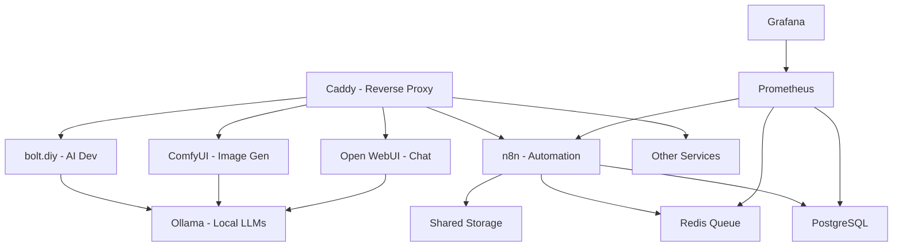

# 🚀 AI LaunchKit

<div align="center">

**Open-Source AI Development Toolkit**  
*Deploy your complete AI stack in minutes, not weeks*

[](LICENSE)
[](https://github.com/freddy-schuetz/ai-launchkit)
[](https://github.com/kossakovsky/n8n-installer)

[Installation](#-installation) • [Features](#-whats-included) • [Documentation](#-documentation) • [Support](#-support)

</div>

---

## 🎯 What is AI LaunchKit?

AI LaunchKit is a comprehensive, self-hosted AI development environment that deploys **20+ pre-configured tools** with a single command. Build AI applications, automate workflows, generate images, and develop with AI assistance - all running on your own infrastructure.

Originally forked from [n8n-installer](https://github.com/kossakovsky/n8n-installer), AI LaunchKit has evolved into a complete AI development platform, maintained by [Friedemann Schuetz](https://www.linkedin.com/in/friedemann-schuetz).

### 🎬 Quick Demo

```bash
# One command to rule them all
git clone https://github.com/freddy-schuetz/ai-launchkit
cd ai-launchkit
sudo bash ./scripts/install.sh
```

**That's it!** Your AI development stack is ready in ~10-15 minutes.

---

## ✨ What's Included

### 🤖 AI Development Tools

| Tool | Description | Access URL |
|------|-------------|------------|
| **[bolt.diy](https://github.com/stackblitz-labs/bolt.diy)** | Build full-stack apps with natural language | `bolt.yourdomain.com` |
| **[OpenHands](https://github.com/All-Hands-AI/OpenHands)** | Autonomous AI developer assistant | `openhands.yourdomain.com` |
| **[OpenUI](https://github.com/wandb/openui)** 🧪 | Generate UI components from descriptions | `openui.yourdomain.com` |
| **[ComfyUI](https://github.com/comfyanonymous/ComfyUI)** | Node-based Stable Diffusion interface | `comfyui.yourdomain.com` |
| **[Dify](https://dify.ai)** | LLMOps platform for AI applications | `dify.yourdomain.com` |

### 🔧 Automation & Workflow

| Tool | Description | Access URL |
|------|-------------|------------|
| **[n8n](https://n8n.io)** | Workflow automation with 400+ integrations | `n8n.yourdomain.com` |
| **[Flowise](https://flowiseai.com)** | No-code AI agent builder | `flowise.yourdomain.com` |
| **[RAGApp](https://github.com/ragapp/ragapp)** | Build RAG assistants over your data | `ragapp.yourdomain.com` |
| **[Letta](https://docs.letta.com)** | Agent server for LLM backends | `letta.yourdomain.com` |

### 💾 Databases & Vector Stores

| Tool | Description | Access URL |
|------|-------------|------------|
| **[Supabase](https://supabase.com)** | Open-source Firebase alternative | `supabase.yourdomain.com` |
| **[Qdrant](https://qdrant.tech)** | High-performance vector database | `qdrant.yourdomain.com` |
| **[Weaviate](https://weaviate.io)** | AI-native vector database | `weaviate.yourdomain.com` |
| **[Neo4j](https://neo4j.com)** | Graph database for relationships | `neo4j.yourdomain.com` |
| **PostgreSQL** | Primary relational database | Internal |
| **Redis** | Caching and queue management | Internal |

### 🎨 UI & Interfaces

| Tool | Description | Access URL |
|------|-------------|------------|
| **[Open WebUI](https://openwebui.com)** | ChatGPT-like interface for your models | `webui.yourdomain.com` |
| **[Postiz](https://postiz.com)** | Social media scheduling platform | `postiz.yourdomain.com` |

### 🛠️ Infrastructure & Monitoring

| Tool | Description | Access URL |
|------|-------------|------------|
| **[Caddy](https://caddyserver.com)** | Automatic HTTPS & reverse proxy | Handles all domains |
| **[Grafana](https://grafana.com)** | Metrics visualization | `grafana.yourdomain.com` |
| **[Prometheus](https://prometheus.io)** | Monitoring & alerting | `prometheus.yourdomain.com` |
| **[Portainer](https://portainer.io)** | Docker management UI | `portainer.yourdomain.com` |
| **[Langfuse](https://langfuse.com)** | AI observability platform | `langfuse.yourdomain.com` |

### 🔍 Utilities

| Tool | Description | Access URL |
|------|-------------|------------|
| **[SearXNG](https://searxng.org)** | Privacy-respecting metasearch | `searxng.yourdomain.com` |
| **[Crawl4ai](https://github.com/unclecode/crawl4ai)** | AI-optimized web crawler | Internal API |
| **[Gotenberg](https://gotenberg.dev)** | Document conversion API | Internal API |
| **[Ollama](https://ollama.com)** | Run LLMs locally | `ollama.yourdomain.com` |

### 🎬 Media Processing Suite

**Pre-installed tools for media manipulation:**
- **ffmpeg 6.1.2** - Video/audio processing
- **ImageMagick 7.1.2** - Image manipulation
- **ExifTool 13.30** - Metadata management
- **MediaInfo** - Media file analysis
- **SoX** - Audio processing
- **Ghostscript** - PDF processing
- **Python3** with pydub & Pillow

---

## 🚀 Installation

### Prerequisites

1. **Server**: Ubuntu 24.04 LTS (64-bit)
   - Minimum: 4GB RAM, 2 CPU cores, 30GB disk (n8n + Flowise only)
   - Recommended: 8GB RAM, 4 CPU cores, 60GB disk (all services)

2. **Domain**: A registered domain with wildcard DNS
   ```
   A *.yourdomain.com -> YOUR_SERVER_IP
   ```

3. **Access**: SSH access to your server

### Quick Install

```bash
# Clone and run the installer
git clone https://github.com/freddy-schuetz/ai-launchkit
cd ai-launchkit
sudo bash ./scripts/install.sh
```

### Installation Process

The installer will ask you for:

1. **Domain name** - Your wildcard domain (e.g., `yourdomain.com`)
2. **Email address** - For SSL certificates and service logins
3. **API keys** (optional) - OpenAI, Anthropic, Groq for enhanced AI features
4. **Community workflows** - Import 300+ n8n templates (optional, 20-30 min)
5. **Worker count** - Number of n8n workers for parallel processing (1-4)
6. **Service selection** - Choose which tools to install

**Installation time:** 10-15 minutes (plus optional workflow import)

### Post-Installation

Configure AI model API keys:
```bash
# Edit configuration
nano .env

# Add your API keys
OPENAI_API_KEY=sk-...
ANTHROPIC_API_KEY=sk-ant-...
GROQ_API_KEY=gsk_...

# Restart services
docker compose restart
```

---

## 📚 Documentation

### 🎯 Quick Start Examples

#### Build a Web App with AI (bolt.diy)
```
1. Open bolt.yourdomain.com
2. Describe your app: "Create a todo app with dark mode"
3. Watch AI build it in real-time
4. Deploy directly or download code
```

#### Create an Automation Workflow (n8n)
```javascript
// Example: Process uploaded videos
// Execute Command Node
Command: ffmpeg
Arguments: -i /data/media/input.mp4 -vn -codec:a mp3 /data/media/output.mp3
```

#### Generate UI Components (OpenUI)
```
1. Open openui.yourdomain.com
2. Describe: "Modern pricing card with gradient"
3. Get React/Vue/HTML component instantly
```

### 📁 File System Access

- **Shared folder**: `./shared` → `/data/shared` in containers
- **Media folder**: `./media` → `/data/media` in containers
- **Temp folder**: `./temp` → `/data/temp` for processing

### 🔒 Security Features

- ✅ **Automatic SSL/TLS** via Let's Encrypt
- ✅ **Firewall configuration** with UFW
- ✅ **Brute-force protection** via Fail2ban
- ✅ **Network isolation** between services
- ✅ **Secure secrets** auto-generated

### 🔄 Maintenance

**Update all services:**
```bash
sudo bash ./scripts/update.sh
```

**Clean up Docker:**
```bash
sudo bash ./scripts/docker_cleanup.sh
```

**Check service status:**
```bash
docker ps
docker stats
```

---

## 🌟 Features Highlight

### 300+ Pre-built Workflows

Optional import includes workflows for:
- **AI & LLM**: RAG systems, chatbots, agents
- **Automation**: Email, documents, data sync
- **Social Media**: Auto-posting, content generation
- **Business**: CRM, e-commerce, HR processes
- **Development**: CI/CD, monitoring, testing

### Enhanced Media Processing

Complete media manipulation toolkit pre-installed:
```javascript
// Video thumbnail generation
ffmpeg -i video.mp4 -ss 00:00:05 -vframes 1 thumb.jpg

// Batch image resizing
magick *.jpg -resize 800x600 resized_%d.jpg

// PDF text extraction
gs -sDEVICE=txtwrite -o output.txt input.pdf
```

### Production-Ready Features

- **Scalable**: Queue-based architecture with Redis
- **Parallel Processing**: Multiple n8n workers
- **Monitoring**: Built-in Grafana dashboards
- **Container Management**: Portainer UI
- **Observability**: AI performance tracking with Langfuse

---

## 🤝 Support

### Community

- **Discord**: [Join our community](https://discord.gg/ai-launchkit) *(coming soon)*
- **Forum**: [oTTomator Think Tank](https://thinktank.ottomator.ai/c/local-ai/18)
- **Issues**: [GitHub Issues](https://github.com/freddy-schuetz/ai-launchkit/issues)

### Resources

- **Original n8n-installer**: [kossakovsky/n8n-installer](https://github.com/kossakovsky/n8n-installer)
- **n8n Templates**: [Official Gallery](https://n8n.io/workflows/?categories=AI)
- **Video Guide**: [AI Starter Kit Walkthrough](https://youtu.be/pOsO40HSbOo)

### Troubleshooting

<details>
<summary><b>Services not loading?</b></summary>

Check resources:
```bash
htop  # CPU/RAM usage
df -h # Disk space
docker stats # Container resources
```

Reduce services if needed or upgrade your server.
</details>

<details>
<summary><b>SSL certificate warnings?</b></summary>

This is normal for the first 1-2 hours. Let's Encrypt certificates take time to propagate. If it persists:
```bash
docker logs caddy
```
</details>

<details>
<summary><b>OpenHands not connecting?</b></summary>

OpenHands requires Docker Desktop for full functionality. On Linux servers without it, consider using bolt.diy as an alternative.
</details>

<details>
<summary><b>Media processing not working?</b></summary>

Check directory permissions:
```bash
ls -la ./media
ls -la ./temp
docker exec n8n ls -la /data/media
```
</details>

---

## 🏗️ Architecture



---

## 👥 Contributors

Created and maintained by [Friedemann Schuetz](https://www.linkedin.com/in/friedemann-schuetz)

Based on:
- [n8n-installer](https://github.com/kossakovsky/n8n-installer) by kossakovsky
- [self-hosted-ai-starter-kit](https://github.com/n8n-io/self-hosted-ai-starter-kit) by n8n team
- [local-ai-packaged](https://github.com/coleam00/local-ai-packaged) by coleam00

[View all contributors](https://github.com/freddy-schuetz/ai-launchkit/graphs/contributors)

---

## 📜 License

This project is licensed under the Apache License 2.0 - see the [LICENSE](LICENSE) file for details.

---

<div align="center">

**Ready to launch your AI projects?**

[⭐ Star this repo](https://github.com/freddy-schuetz/ai-launchkit) • [🐛 Report issues](https://github.com/freddy-schuetz/ai-launchkit/issues) • [🤝 Contribute](https://github.com/freddy-schuetz/ai-launchkit/pulls)

</div>
