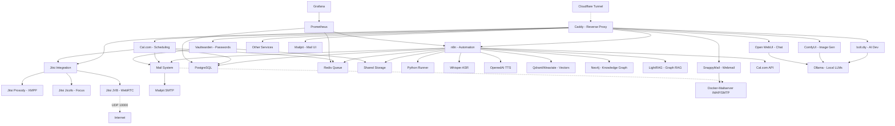

# 🚀 AI LaunchKit

<div align="center">

**Open-Source AI Development Toolkit**

*Deploy your complete AI stack in minutes, not weeks*

[](LICENSE)
[](https://github.com/freddy-schuetz/ai-launchkit)
[](https://github.com/kossakovsky/n8n-installer)

[Installation](#-installation) • [Features](#-whats-included) • [Documentation](#-documentation) • [Support](#-support)

</div>

---

## 🎯 What is AI LaunchKit?

AI LaunchKit is a comprehensive, self-hosted AI development environment that deploys **25+ pre-configured tools** with a single command. Build AI applications, automate workflows, generate images, and develop with AI assistance - all running on your own infrastructure.

Originally forked from [n8n-installer](https://github.com/kossakovsky/n8n-installer), AI LaunchKit has evolved into a complete AI development platform, maintained by [Friedemann Schuetz](https://www.linkedin.com/in/friedemann-schuetz).

### 🎬 Quick Demo

```bash
# One command to rule them all
git clone https://github.com/freddy-schuetz/ai-launchkit && cd ai-launchkit && sudo bash ./scripts/install.sh
```

**That's it!** Your AI development stack is ready in ~10-15 minutes.

ATTENTION! The AI LaunchKit is currently in development. It is regularly tested and updated. However, use is at your own risk!

---

## ✨ What's Included

### 📧 Mail System

| Tool | Description | Always Active | Purpose |
|------|-------------|---------------|----------|
| **[Mailpit](https://github.com/axllent/mailpit)** | Mail catcher with web UI Access: `mail.yourdomain.com` | ✅ Yes | Development/Testing - captures all emails |
| **[Docker-Mailserver](https://github.com/docker-mailserver/docker-mailserver)** | Production mail server | ⚡ Optional | Real email delivery for production |
| **[SnappyMail](https://github.com/the-djmaze/snappymail)** | Modern webmail client Access: `webmail.yourdomain.com` | ⚡ Optional | Web interface for Docker-Mailserver |

**Mail Configuration:**
- Mailpit automatically configured for all services (always active)
- Docker-Mailserver available for production email delivery (optional)
- SnappyMail provides a modern web interface for email access (optional, requires Docker-Mailserver)
- Web UI to view all captured emails
- Zero manual configuration needed!

### 🔧 Workflow Automation

| Tool | Description | Use Cases | Access |
|------|-------------|-----------|--------|
| **[n8n](https://github.com/n8n-io/n8n)** | Visual workflow automation platform | API integrations, data pipelines, business automation | `n8n.yourdomain.com` |
| **300+ Workflows** | Pre-built n8n templates | Email automation, social media, data sync, AI workflows | Imported on install |

### 🎯 User Interfaces

| Tool | Description | Use Cases | Access |
|------|-------------|-----------|--------|
| **[Open WebUI](https://github.com/open-webui/open-webui)** | ChatGPT-like interface for LLMs | AI chat, model switching, conversation management | `webui.yourdomain.com` |
| **[Postiz](https://github.com/gitroomhq/postiz-app)** | Social media management platform | Content scheduling, analytics, multi-platform posting | `postiz.yourdomain.com` |

### 📹 Video Conferencing

| Tool | Description | Use Cases | Access |
|------|-------------|-----------|--------|
| **[Jitsi Meet](https://github.com/jitsi/jitsi-meet)** ⚠️ | Professional video conferencing platform | Client meetings, team calls, webinars, Cal.com integration | `meet.yourdomain.com` |

**⚠️ Jitsi Meet Requirements:**
- **CRITICAL:** Requires UDP Port 10000 for WebRTC audio/video
- Many VPS providers block UDP traffic by default
- Without UDP 10000: Only chat works, no audio/video!
- Test UDP connectivity before production use
- Alternative: Use external services (Zoom, Google Meet) with Cal.com

### 💼 Business & Productivity

| Tool | Description | Use Cases | Access |
|------|-------------|-----------|--------|
| **[Cal.com](https://github.com/calcom/cal.com)** | Open-source scheduling platform | Meeting bookings, team calendars, payment integrations | `cal.yourdomain.com` |
| **[Vikunja](https://github.com/go-vikunja/vikunja)** | Modern task management platform | Kanban boards, Gantt charts, team collaboration, CalDAV | `vikunja.yourdomain.com` |
| **[Leantime](https://github.com/Leantime/leantime)** | Goal-oriented project management suite | ADHD-friendly PM, time tracking, sprints, strategy tools | `leantime.yourdomain.com` |
| **[Kimai](https://github.com/kimai/kimai)** | Professional time tracking | DSGVO-compliant billing, team timesheets, API, 2FA, invoicing | `time.yourdomain.com` |
| **[Invoice Ninja](https://github.com/invoiceninja/invoiceninja)** | Professional invoicing & payment platform | Multi-currency invoices, 40+ payment gateways, recurring billing, client portal | `invoices.yourdomain.com` |
| **[Baserow](https://github.com/bram2w/baserow)** | Airtable Alternative with real-time collaboration | Database management, project tracking, collaborative workflows | `baserow.yourdomain.com` |
| **[NocoDB](https://github.com/nocodb/nocodb)** | Open-source Airtable alternative with API & webhooks | Smart spreadsheet UI, realtime collaboration, automation | `nocodb.yourdomain.com` |
| **[Formbricks](https://github.com/formbricks/formbricks)** | Privacy-first survey platform | Customer feedback, NPS surveys, market research, form builder, GDPR-compliant | `forms.yourdomain.com` |
| **[Metabase](https://github.com/metabase/metabase)** | User-friendly business intelligence platform | No-code dashboards, automated reports, data exploration, team analytics | `analytics.yourdomain.com` |
| **[Odoo 18](https://github.com/odoo/odoo)** | Open Source ERP/CRM with AI features | Sales automation, inventory, accounting, AI lead scoring | `odoo.yourdomain.com` |

### 🎨 AI Content Generation

| Tool | Description | Use Cases | Access |
|------|-------------|-----------|--------|
| **[ComfyUI](https://github.com/comfyanonymous/ComfyUI)** | Node-based Stable Diffusion interface | Image generation, AI art, photo editing, workflows | `comfyui.yourdomain.com` |

### 💻 AI-Powered Development / Vibe Coding

| Tool | Description | Use Cases | Access |
|------|-------------|-----------|--------|
| **[bolt.diy](https://github.com/stackblitz-labs/bolt.diy)** | Build full-stack apps with prompts | Rapid prototyping, MVP creation, learning to code | `bolt.yourdomain.com` |
| **[OpenUI](https://github.com/wandb/openui)** 🧪 | AI-powered UI component generation | Design systems, component libraries, mockups | `openui.yourdomain.com` |

### 🤖 AI Agents

| Tool | Description | Use Cases | Access |
|------|-------------|-----------|--------|
| **[Flowise](https://github.com/FlowiseAI/Flowise)** | Visual AI agent builder | Chatbots, customer support, AI workflows | `flowise.yourdomain.com` |
| **[Dify](https://github.com/langgenius/dify)** | LLMOps platform for AI apps | Production AI apps, model management, prompt engineering | `dify.yourdomain.com` |
| **[Letta](https://github.com/letta-ai/letta)** | Stateful agent server | Persistent AI assistants, memory management | `letta.yourdomain.com` |

### 📚 RAG Systems

| Tool | Description | Use Cases | Access |
|------|-------------|-----------|--------|
| **[RAGApp](https://github.com/ragapp/ragapp)** | Build RAG assistants over your data | Knowledge bases, document Q&A, research tools | `ragapp.yourdomain.com` |
| **[Qdrant](https://github.com/qdrant/qdrant)** | High-performance vector database | Semantic search, recommendations, RAG storage | `qdrant.yourdomain.com` |
| **[Weaviate](https://github.com/weaviate/weaviate)** | AI-native vector database | Hybrid search, multi-modal data, GraphQL API | `weaviate.yourdomain.com` |

### 🎙️ Speech, Language & Text Processing

| Tool | Description | Use Cases | Access |
|------|-------------|-----------|--------|
| **[Faster-Whisper](https://github.com/SYSTRAN/faster-whisper)** | OpenAI-compatible Speech-to-Text | Transcription, voice commands, meeting notes | Internal API |
| **[OpenedAI-Speech](https://github.com/matatonic/openedai-speech)** | OpenAI-compatible Text-to-Speech | Voice assistants, audiobooks, notifications | Internal API |
| **[LibreTranslate](https://github.com/LibreTranslate/LibreTranslate)** | Self-hosted translation API | 50+ languages, document translation, privacy-focused | `translate.yourdomain.com` |
| **OCR Bundle: [Tesseract](https://github.com/tesseract-ocr/tesseract) & [EasyOCR](https://github.com/JaidedAI/EasyOCR)** | Dual OCR engines: Tesseract (fast) + EasyOCR (quality) | Text extraction from images/PDFs, receipt scanning, document digitization | Internal API |

### 🔍 Search & Web Data

| Tool | Description | Use Cases | Access |
|------|-------------|-----------|--------|
| **[SearXNG](https://github.com/searxng/searxng)** | Privacy-respecting metasearch engine | Web search for agents, no tracking, multiple sources | `searxng.yourdomain.com` |
| **[Perplexica](https://github.com/ItzCrazyKns/Perplexica)** | Open-source AI-powered search engine | Deep research, academic search, Perplexity AI alternative | `perplexica.yourdomain.com` |
| **[Crawl4Ai](https://github.com/unclecode/crawl4ai)** | AI-optimized web crawler | Web scraping, data extraction, site monitoring | Internal API |

### 🧠 Knowledge Graphs

| Tool | Description | Use Cases | Access |
|------|-------------|-----------|--------|
| **[Neo4j](https://github.com/neo4j/neo4j)** | Graph database platform | Knowledge graphs, entity relationships, fraud detection, recommendations | `neo4j.yourdomain.com` |
| **[LightRAG](https://github.com/HKUDS/LightRAG)** | Graph-based RAG with entity extraction | Automatic knowledge graph creation, relationship mapping, complex queries | `lightrag.yourdomain.com` |

### 🎬 Media Processing Suite

Pre-installed in the n8n container for seamless media manipulation:

| Tool | Description | Use Cases |
|------|-------------|-----------|
| **[FFmpeg](https://github.com/FFmpeg/FFmpeg)** | Industry-standard multimedia framework | Video conversion, streaming, audio extraction |
| **[ImageMagick](https://github.com/ImageMagick/ImageMagick)** | Image manipulation toolkit | Format conversion, resizing, effects, thumbnails |
| **[ExifTool](https://github.com/exiftool/exiftool)** | Metadata management | Read/write EXIF, IPTC, XMP metadata |
| **[MediaInfo](https://github.com/MediaArea/MediaInfo)** | Technical media analysis | Codec detection, bitrate analysis, format info |
| **[SoX](https://github.com/chirlu/sox)** | Sound processing toolkit | Audio effects, format conversion, synthesis |
| **[Ghostscript](https://github.com/ArtifexSoftware/ghostpdl)** | PostScript/PDF processor | PDF manipulation, conversion, rendering |
| **[Python3](https://github.com/python/cpython)** | With pydub & Pillow libraries | Custom media processing scripts |

### 💾 Data Infrastructure

| Tool | Description | Use Cases | Access |
|------|-------------|-----------|--------|
| **[Supabase](https://github.com/supabase/supabase)** | Open-source Firebase alternative | User auth, realtime data, file storage, vector embeddings | `supabase.yourdomain.com` |
| **[PostgreSQL](https://github.com/postgres/postgres)** | Relational database | Structured data, transactions, n8n backend | Internal |
| **[Redis](https://github.com/redis/redis)** | In-memory data store | Caching, queues, session management | Internal |

### 📊 System Management

| Tool | Description | Use Cases | Access |
|------|-------------|-----------|--------|
| **[Vaultwarden](https://github.com/dani-garcia/vaultwarden)** | Self-hosted Bitwarden-compatible password manager | Secure credential storage for all AI LaunchKit services, team password sharing | `vault.yourdomain.com` |
| **[Caddy](https://github.com/caddyserver/caddy)** | Modern web server | Automatic HTTPS, reverse proxy, load balancing | All domains |
| **[Cloudflare Tunnel](https://github.com/cloudflare/cloudflared)** | Secure tunnel to Cloudflare | Zero-trust access, no exposed ports, DDoS protection | Internal |
| **Python Runner** | Python execution environment for n8n | Custom scripts, data processing, automation tasks | Internal |
| **[Grafana](https://github.com/grafana/grafana)** | Metrics visualization platform | Performance dashboards, alerts, analytics | `grafana.yourdomain.com` |
| **[Prometheus](https://github.com/prometheus/prometheus)** | Time-series monitoring | Metrics collection, alerting rules, scraping | `prometheus.yourdomain.com` |
| **[Portainer](https://github.com/portainer/portainer)** | Container management UI | Docker admin, logs, resource monitoring | `portainer.yourdomain.com` |
| **[Kopia](https://github.com/kopia/kopia)** | Enterprise backup solution | End-to-end encryption, deduplication, WebDAV/S3/B2 support | `backup.yourdomain.com` |
| **[Langfuse](https://github.com/langfuse/langfuse)** | LLM observability platform | AI performance tracking, cost analysis, debugging | `langfuse.yourdomain.com` |

### 🔧 AI Support Tools

| Tool | Description | Use Cases | Access |
|------|-------------|-----------|--------|
| **[Ollama](https://github.com/ollama/ollama)** | Local LLM runtime | Run Llama, Mistral, Gemma models locally | `ollama.yourdomain.com` |
| **[Gotenberg](https://github.com/gotenberg/gotenberg)** | Document conversion API | PDF generation, HTML to PDF, Office conversions | Internal API |
| **[Stirling-PDF](https://github.com/Stirling-Tools/Stirling-PDF)** | Complete PDF toolkit with 100+ features | Merge, split, OCR, sign, watermark, convert documents | `pdf.yourdomain.com` |

---

## 🚀 Installation

### Prerequisites

1. **Server**: Ubuntu 24.04 LTS (64-bit)
   - Minimum: 4 GB RAM, 2 CPU cores, 30GB disk (n8n + Flowise only)
   - Recommended: 16+ GB RAM, 8+ CPU cores, 120GB disk (all services)

2. **Domain**: A registered domain with wildcard DNS
   ```
   A *.yourdomain.com -> YOUR_SERVER_IP
   ```

3. **Access**: SSH access to your server

### Quick Install

```bash
# Clone and run the installer
git clone https://github.com/freddy-schuetz/ai-launchkit && cd ai-launchkit && sudo bash ./scripts/install.sh
```

### Installation Process

The installer will ask you for:
1. **Domain name** - Your wildcard domain (e.g., `yourdomain.com`)
2. **Email address** - For SSL certificates and service logins
3. **API keys** (optional) - OpenAI, Anthropic, Groq for enhanced AI features
4. **Community workflows** - Import 300+ n8n templates (optional, 20-30 min)
5. **Worker count** - Number of n8n workers for parallel processing (1-4)
6. **Service selection** - Choose which tools to install (including Docker-Mailserver and SnappyMail for production email)

**Mail Configuration:** 
- Mailpit is automatically configured to capture all emails for development/testing (always active)
- Docker-Mailserver can be selected during installation for production email delivery
- SnappyMail can be selected as webmail client (requires Docker-Mailserver)

**Installation time:** 10-15 minutes (plus optional workflow import)

### Post-Installation

Configure AI model API keys:
```bash
# Edit configuration
nano .env

# Add your API keys
OPENAI_API_KEY=sk-...
ANTHROPIC_API_KEY=sk-ant-...
GROQ_API_KEY=gsk_...

# Restart services
docker compose restart
```

---

## 🔐 Vaultwarden Password Manager

Vaultwarden is a lightweight, self-hosted password manager that's 100% compatible with Bitwarden clients. Perfect for managing all your AI LaunchKit service credentials securely.

### Why Vaultwarden for AI LaunchKit?

With 40+ services generating unique passwords and API keys, credential management becomes critical. Vaultwarden provides:

* **Central Credential Storage:** All AI LaunchKit passwords in one secure place
* **Browser Integration:** Auto-fill passwords for all your services
* **Team Sharing:** Securely share credentials with team members
* **Mobile Access:** iOS/Android apps for passwords on the go
* **No Basic Auth:** Unlike other services, Vaultwarden has its own user management

### Initial Setup

**First Steps After Installation:**

1. **Access Admin Panel:** Navigate to `https://vault.yourdomain.com/admin`
2. **Enter Admin Token:** Found in the installation final report or `.env` file as `VAULTWARDEN_ADMIN_TOKEN`
3. **Configure SMTP:** Uses your configured mail system (Mailpit or Docker-Mailserver)
4. **Create First User:** Register at `https://vault.yourdomain.com`
5. **Install Browser Extension:** Available for all major browsers

### 🚀 Automatic Credential Import

AI LaunchKit automatically generates a Bitwarden-compatible JSON file with all your service credentials:

```bash
# Generate and download credentials (after installation)
sudo bash ./scripts/download_credentials.sh
```

This script will:
1. Generate a JSON file with all service passwords, API keys, and tokens
2. Open port 8889 temporarily (60 seconds)
3. Display a download link for your browser
4. Automatically delete the file after download for security

**Import into Vaultwarden:**
1. Download the file using the link provided
2. Open Vaultwarden: `https://vault.yourdomain.com`
3. Go to **Tools** → **Import Data**
4. Select Format: **Bitwarden (json)**
5. Choose the downloaded file
6. Click **Import Data**

All credentials will be organized in an "AI LaunchKit Services" folder.

### Security Notes

* The admin token is displayed in the final installation report for convenience
* Credential export files are automatically deleted after download
* Signups are disabled by default - enable in admin panel if needed
* Configure 2FA for additional security

### Client Configuration

**Browser Extensions:**
- Install official Bitwarden extension
- Set server URL: `https://vault.yourdomain.com`
- Login with your created account

**Mobile Apps:**
- Download Bitwarden from App Store/Play Store
- Tap "Self-hosted" during setup
- Enter: `https://vault.yourdomain.com`

**Desktop Apps:**
- Download from bitwarden.com
- Settings → Server URL → `https://vault.yourdomain.com`

### Organizing AI LaunchKit Credentials

**Recommended Organization:**
```
📁 AI LaunchKit
├── 📁 Core Services
│   ├── n8n Admin
│   ├── Supabase Dashboard
│   └── PostgreSQL Database
├── 📁 AI Tools
│   ├── OpenAI API Key
│   ├── Anthropic API Key
│   ├── Groq API Key
│   └── Ollama Admin
├── 📁 Development
│   ├── bolt.diy Access
│   ├── ComfyUI Login
│   └── GitHub Tokens
└── 📁 Monitoring
    ├── Grafana Admin
    ├── Prometheus Access
    └── Portainer Login
```

### Security Features

**No Basic Auth Required:**
- Vaultwarden is a complete authentication system
- Users manage their own strong master passwords
- No interference with browser extensions or mobile apps

**Advanced Security:**
- **2FA Support:** TOTP, WebAuthn, YubiKey, Email
- **Password Generator:** Create strong unique passwords
- **Security Reports:** Identify weak or reused passwords
- **Emergency Access:** Trusted contacts for recovery
- **Send Feature:** Securely share text/files with expiration

### Integration Tips

**Auto-Import AI LaunchKit Credentials:**
After installation, a JSON file with all credentials can be generated:
```bash
# Future feature: Auto-export to Vaultwarden format
cat ai-launchkit-credentials.json
```

**Password Best Practices:**
1. Use Vaultwarden's generator for all new services
2. Enable 2FA on Vaultwarden itself
3. Create organization for team credential sharing
4. Regular backups of Vaultwarden data

### Backup & Recovery

**Backup Vaultwarden Data:**
```bash
# Create backup
docker exec vaultwarden tar -czf /data/shared/vaultwarden-backup-$(date +%Y%m%d).tar.gz /data

# Verify backup
ls -lh ./shared/vaultwarden-backup-*.tar.gz
```

**Restore from Backup:**
```bash
# Stop service
docker stop vaultwarden

# Restore data
docker run --rm -v vaultwarden_data:/data -v ./shared:/backup alpine \
  sh -c "cd /data && tar -xzf /backup/vaultwarden-backup-YYYYMMDD.tar.gz --strip-components=1"

# Restart service
docker start vaultwarden
```

### Resource Usage

- **RAM:** Only 50-200MB (vs 2GB+ for official Bitwarden)
- **Storage:** ~100MB base + user data
- **CPU:** Minimal, only during access
- **Perfect for VPS:** Designed for resource-constrained environments

---

## 🔐 Kopia - Enterprise Backup Solution

Kopia provides fast, secure, and encrypted backups with deduplication and compression, supporting WebDAV (Nextcloud), S3, B2, and local storage. Perfect for automated backups of your AI LaunchKit data.

### Why Kopia for AI LaunchKit?

With critical data across 40+ services, automated backups become essential. Kopia provides:
- **End-to-End Encryption:** All backups encrypted before leaving the server
- **Deduplication:** Saves 60-90% storage through intelligent deduplication
- **Compression:** Further reduces backup size
- **Incremental Snapshots:** Only changes are backed up after initial snapshot
- **WebDAV Support:** Direct integration with Nextcloud, ownCloud, etc.
- **Multiple Storage Options:** S3, B2, Google Cloud, Azure, local storage

### Initial Setup

**First Login to Kopia:**
1. Navigate to `https://backup.yourdomain.com`
2. Login with credentials from `.env` file:
   - Username: `admin`
   - Password: Check `KOPIA_UI_PASSWORD` in `.env`

**Create Your First Repository (Nextcloud Example):**

1. **Click "Create Repository"**
2. **Select WebDAV** as storage type
3. **Configure WebDAV connection:**
Server URL: https://nextcloud.example.com/remote.php/dav/files/USERNAME/kopia-backup
Username: your-nextcloud-username
Password: your-nextcloud-app-password (NOT your regular password!)
4. **Set Repository Password:**
- **IMPORTANT:** This MUST be different from your WebDAV password!
- This password encrypts your backups
- Store it securely - you'll need it to restore

**Generate Nextcloud App Password:**
1. In Nextcloud: Settings → Security → App passwords
2. Create new app password named "Kopia Backup"
3. Use this password for WebDAV connection (step 3 above)

### Automated Backup Strategy

**Configure Backup Policies:**
1. In Kopia UI, go to Policies
2. Set retention (recommended):
- Keep hourly: 24
- Keep daily: 7
- Keep weekly: 4
- Keep monthly: 12
- Keep yearly: 3

**What Gets Backed Up:**
- `/data/shared` - All shared files between services
- n8n workflows and credentials (via PostgreSQL dumps)
- Service configurations
- User-uploaded files

### n8n Integration for Automated Backups

#### Example: Daily Backup Workflow

```javascript
// 1. Schedule Trigger: Daily at 2 AM

// 2. Execute Command Node: Create database dump
Command: pg_dump
Arguments: -U n8n -d n8n -f /data/shared/backups/n8n-backup-{{ $now.format('YYYY-MM-DD') }}.sql

// 3. Execute Command Node: Trigger Kopia snapshot
Command: docker
Arguments: exec kopia kopia snapshot create /data/shared

// 4. Execute Command Node: Get snapshot status
Command: docker
Arguments: exec kopia kopia snapshot list --json

// 5. Send notification with backup status

#### Example: Test Restore Workflow
// 1. Manual Trigger

// 2. Execute Command Node: List available snapshots
Command: docker
Arguments: exec kopia kopia snapshot list

// 3. Execute Command Node: Mount snapshot
Command: docker
Arguments: exec kopia kopia mount k123abc /tmp/restore

// 4. Code Node: Verify files exist
const fs = require('fs');
const files = fs.readdirSync('/tmp/restore');
return { success: files.length > 0, fileCount: files.length };

// 5. Execute Command Node: Unmount
Command: docker
Arguments: exec kopia umount /tmp/restore

Manual Backup Operations
Create snapshot manually:
bashdocker exec kopia kopia snapshot create /data/shared
List snapshots:
bashdocker exec kopia kopia snapshot list
Restore from snapshot:
bash# List snapshots
docker exec kopia kopia snapshot list

# Restore specific file
docker exec kopia kopia restore k9f8d7c6 /data/shared/restored

# Mount snapshot for browsing
docker exec kopia kopia mount k9f8d7c6 /tmp/mounted
Backup Best Practices

3-2-1 Rule:

3 copies of important data
2 different storage media
1 offsite backup (Kopia to Nextcloud/S3 = ✅)


Test Restores Monthly:

A backup is only good if you can restore from it
Create n8n workflow for automated restore testing


Repository Password Management:

Store separately from server passwords
Use password manager (Vaultwarden!)
Keep offline copy in secure location


Monitor Storage Usage:
bashdocker exec kopia kopia repository status

Verify Backup Integrity:
bashdocker exec kopia kopia snapshot verify


Advanced Configuration
Adding More Backup Paths
Edit docker-compose.yml to mount additional directories:
yamlkopia:
  volumes:
    - ./shared:/data/shared:ro
    - ./media:/data/media:ro  # Add this line
    - kopia_config:/app/config
    - kopia_cache:/app/cache
Using S3-Compatible Storage
For Backblaze B2, Wasabi, or MinIO:

Create new repository
Select "S3-compatible"
Configure:

Endpoint: s3.us-west-001.backblazeb2.com
Bucket: your-bucket-name
Access Key ID: your-key-id
Secret Access Key: your-secret-key

Backup Encryption Details

Algorithm: AES-256-GCM or ChaCha20-Poly1305
Key Derivation: Scrypt with high cost parameters
Splitter: Content-defined chunking for optimal deduplication
Compression: Automatic selection (zstd default)

---

## 📹 Jitsi Meet Video Conferencing

Jitsi Meet provides professional self-hosted video conferencing with Cal.com integration for automated meeting links. Perfect for client calls, team meetings, and webinars without external dependencies.

### ⚠️ CRITICAL Requirements

**UDP Port 10000 is MANDATORY for audio/video:**
- Without UDP 10000: Only chat works, NO audio/video!
- Many VPS providers block UDP traffic by default
- Test UDP connectivity BEFORE relying on Jitsi for production

### Pre-Installation UDP Test

```bash
# 1. Open UDP port in firewall
sudo ufw allow 10000/udp

# 2. Test UDP connectivity (requires two terminals)
# Terminal 1 (on your VPS):
nc -u -l 10000

# Terminal 2 (from external network):
nc -u YOUR_VPS_IP 10000
# Type text and press Enter - should appear in Terminal 1

# 3. If text doesn't appear, UDP is blocked by your provider
```

### VPS Provider Compatibility

**Known to work well:**
- Hetzner Cloud (WebRTC-friendly)
- DigitalOcean (good WebRTC performance)
- Contabo (game server support = UDP OK)

**Often problematic:**
- OVH (frequently blocks UDP)
- Scaleway (firewall restrictions)
- AWS/GCP (requires NAT configuration)

### Features

- **No Basic Auth:** Guest-friendly access for meeting participants
- **Lobby Mode:** Control who enters your meetings
- **HD Video:** Up to 1280x720 resolution
- **Screen Sharing:** Share desktop or applications
- **Recording:** Optional local recording
- **Cal.com Integration:** Automatic meeting room generation
- **Mobile Apps:** iOS and Android support
- **No Account Required:** Participants join without registration

### Initial Setup

**After installation:**
1. Test with a simple meeting: `https://meet.yourdomain.com/test123`
2. Verify audio/video works from different networks
3. Configure Cal.com integration (see below)

### Cal.com Integration

Jitsi integrates seamlessly with Cal.com for automated video conferencing:

1. **In Cal.com:**
   - Go to Settings → Apps → Jitsi Video
   - Click "Install App"
   - Server URL: `https://meet.yourdomain.com`
   - Save configuration

2. **Configure Event Types:**
   - Edit any event type
   - Under "Location", select "Jitsi Video"
   - Meeting links are auto-generated for bookings

3. **Meeting URL Format:**
   - Automatic: `https://meet.yourdomain.com/cal/[booking-reference]`
   - Custom: `https://meet.yourdomain.com/YourCompany-ClientName`

### n8n Integration Examples

#### Automated Meeting Reminders
```javascript
// 1. Cal.com Trigger: booking.created
// 2. Wait Node: 1 hour before meeting
// 3. Send Email Node:
To: {{ $json.attendees[0].email }}
Subject: Meeting reminder - {{ $json.title }}
Body: Your meeting starts in 1 hour!
Join here: https://meet.yourdomain.com/cal/{{ $json.uid }}

// 4. Slack Node: Notify team
Channel: #meetings
Message: Client meeting in 1 hour: {{ $json.conferenceUrl }}
```

#### Meeting Recording Workflow
```javascript
// 1. Schedule Trigger: Daily at 6 PM
// 2. HTTP Request: Check for completed meetings
// 3. If recordings exist:
//    - Move to cloud storage
//    - Generate transcript with Whisper
//    - Send summary to participants
```

### Security Considerations

**Why No Basic Auth for Jitsi:**
- Meeting participants need direct access to URLs
- Cal.com integration requires open access
- Mobile apps expect direct connection
- Security is handled at room level, not site level

**Room-Level Security Options:**
- **Lobby Mode:** Approve participants before entry
- **Meeting Passwords:** Add password to sensitive meetings
- **Unique URLs:** Use hard-to-guess room names
- **Time Limits:** Configure maximum meeting duration

### Troubleshooting Jitsi

**No Audio/Video:**
```bash
# Check if JVB is running
docker ps | grep jitsi-jvb

# Check JVB logs for errors
docker logs jitsi-jvb --tail 100

# Verify UDP port is open
sudo netstat -ulnp | grep 10000

# Test from external network
nc -u YOUR_VPS_IP 10000
```

**Connection Issues:**
```bash
# Check all Jitsi components
docker ps | grep jitsi

# Restart Jitsi services
docker compose restart jitsi-web jitsi-prosody jitsi-jicofo jitsi-jvb

# Check Caddy routing
docker logs caddy | grep jitsi
```

**Alternative Solutions:**
If UDP is blocked by your provider:
1. Use external services (Zoom, Google Meet) with Cal.com
2. Set up a TURN server (complex, additional cost)
3. Use a different VPS provider with UDP support
4. Consider Jitsi as a Service (8x8.vc, meet.jit.si)

### Performance Tips

- **Bandwidth:** 2-4 Mbps per participant for HD video
- **CPU:** Video bridge uses ~1 CPU core per 10 participants
- **RAM:** Allocate 1-2GB for Jitsi services
- **Participants:** Tested up to 35 on a 4-core VPS
- **Best Practice:** Use lobby mode for meetings >10 people

---

## 📧 Mail Configuration

AI LaunchKit includes a comprehensive mail system: Mailpit for development/testing (always active), optional Docker-Mailserver for production email delivery, and SnappyMail as a modern webmail client.

### 🎯 How It Works

**Mailpit** (Always Active):
- Captures ALL emails sent by any service
- Web UI to view emails: `https://mail.yourdomain.com`
- No emails leave your server - perfect for development and testing
- No authentication needed for web UI
- All services automatically configured to use Mailpit by default

**Docker-Mailserver** (Optional - Production):
- Full-featured production mail server
- Real email delivery with SMTP/IMAP support
- DKIM, SPF, DMARC support for deliverability
- Spam filtering with Rspamd
- Select during installation wizard

**SnappyMail** (Optional - Webmail Client):
- Modern, lightweight webmail interface
- Ultra-fast with 138KB initial load
- 99% Lighthouse performance score
- Multiple account support
- Mobile responsive
- Requires Docker-Mailserver to be installed

### 📬 Docker-Mailserver Setup (Production)

If you selected Docker-Mailserver during installation:

#### Automatic Configuration
- A `noreply@yourdomain.com` account is created automatically
- All services are configured to use Docker-Mailserver for real email delivery
- SMTP settings are automatically applied to all services

#### Required DNS Records

After installation, configure these DNS records for proper email delivery:

1. **MX Record:**
   ```
   Type: MX
   Name: @ (or yourdomain.com)
   Value: mail.yourdomain.com
   Priority: 10
   ```

2. **A Record for mail subdomain:**
   ```
   Type: A
   Name: mail
   Value: YOUR_SERVER_IP
   ```

3. **SPF Record:**
   ```
   Type: TXT
   Name: @ (or yourdomain.com)
   Value: "v=spf1 mx ~all"
   ```

4. **DMARC Record:**
   ```
   Type: TXT
   Name: _dmarc
   Value: "v=DMARC1; p=none; rua=mailto:postmaster@yourdomain.com"
   ```

5. **DKIM Record (after installation):**
   ```bash
   # Generate DKIM keys
   docker exec mailserver setup config dkim
   
   # Display the public key to add to DNS
   docker exec mailserver cat /tmp/docker-mailserver/opendkim/keys/yourdomain.com/mail.txt
   
   # Add the displayed key as TXT record for mail._domainkey.yourdomain.com
   ```

#### Managing Email Accounts

```bash
# Add a new email account
docker exec -it mailserver setup email add user@yourdomain.com

# List all email accounts
docker exec mailserver setup email list

# Delete an email account
docker exec mailserver setup email del user@yourdomain.com

# Check mail queue
docker exec mailserver postqueue -p

# View logs
docker logs mailserver
```

#### Service Configuration

When Docker-Mailserver is active, all services automatically use these settings:
- **SMTP Host:** `mailserver` (internal)
- **Port:** 587
- **Security:** STARTTLS
- **From:** `noreply@yourdomain.com`
- **Authentication:** Configured automatically

### 🌐 SnappyMail Webmail Setup

If you selected SnappyMail during installation:

#### Initial Configuration

1. **Get the admin password:**
   ```bash
   docker exec snappymail cat /var/lib/snappymail/_data_/_default_/admin_password.txt
   ```

2. **Access the admin panel:**
   - URL: `https://webmail.yourdomain.com/?admin`
   - Username: `admin`
   - Password: (from step 1)

3. **Configure your mail domain:**
   - Go to Domains → Add Domain
   - Domain: `yourdomain.com`
   - IMAP Server: `mailserver`
   - IMAP Port: 143
   - SMTP Server: `mailserver`
   - SMTP Port: 587
   - Use STARTTLS for both

4. **Users can now login:**
   - URL: `https://webmail.yourdomain.com`
   - Email: their-email@yourdomain.com
   - Password: their Docker-Mailserver password

#### SnappyMail Features

- **Ultra-fast performance:** 138KB initial load, 99% Lighthouse score
- **Multiple accounts:** Manage multiple email accounts in one interface
- **Mobile responsive:** Works perfectly on all devices
- **PGP encryption:** Built-in support for encrypted emails
- **2-Factor authentication:** Enhanced security for webmail access
- **No database required:** Simple file-based configuration
- **Dark mode:** Built-in theme support

### 📮 Service Integration

All services automatically use the configured mail system via environment variables:

```bash
# Universal SMTP settings in .env (automatically configured)
# For Mailpit (default):
SMTP_HOST=mailpit
SMTP_PORT=1025
SMTP_USER=admin
SMTP_PASS=admin
SMTP_FROM=noreply@yourdomain.com
SMTP_SECURE=false

# For Docker-Mailserver (if selected):
SMTP_HOST=mailserver
SMTP_PORT=587
SMTP_USER=noreply@yourdomain.com
SMTP_PASS=[auto-generated-password]
SMTP_FROM=noreply@yourdomain.com
SMTP_SECURE=true
```

#### n8n Email Configuration

n8n automatically uses the SMTP settings for:
- User invitations
- Password resets
- Workflow notifications
- Send Email node

**Using Send Email node in workflows:**
1. Add Send Email node to your workflow
2. Create SMTP credentials based on your mail mode:
   
   **For Mailpit (development):**
   - Host: `mailpit`
   - Port: 1025
   - User: admin
   - Password: admin
   - SSL/TLS: OFF
   
   **For Docker-Mailserver (production):**
   - Host: `mailserver`
   - Port: 587
   - User: noreply@yourdomain.com
   - Password: [check .env file]
   - SSL/TLS: STARTTLS

#### Supabase Email Configuration

Supabase uses the mail system for:
- User registration confirmations
- Password reset emails
- Magic link authentication

The configuration is automatic, no manual setup needed.

#### Odoo Email Configuration

Odoo can use the mail system for:
- Customer invoices
- Order confirmations
- Internal notifications

**Configure in Odoo:**
1. Go to Settings → Technical → Outgoing Mail Servers
2. Create new server:
   - For **Mailpit**: SMTP Server: `mailpit`, Port: 1025, No security
   - For **Docker-Mailserver**: SMTP Server: `mailserver`, Port: 587, STARTTLS

#### Cal.com Email Configuration

Cal.com automatically uses the mail system for:
- Booking confirmations to both parties
- Calendar invitations (.ics files)
- Reminder notifications
- Cancellation/rescheduling notices

The configuration is automatic via `EMAIL_*` environment variables.

#### Other Services

Most services that support SMTP can be configured similarly:
- **Mailpit:** Host: `mailpit`, Port: 1025, No auth, No SSL
- **Docker-Mailserver:** Host: `mailserver`, Port: 587, Auth required, STARTTLS

### 📊 Viewing Captured Emails

**Mailpit Web UI (Development/Testing):**
- URL: `https://mail.yourdomain.com`
- Features:
  - Search emails
  - View HTML/Text/Source
  - Download attachments
  - Real-time updates
  - API for automation

**SnappyMail Web UI (Production):**
- URL: `https://webmail.yourdomain.com`
- Features:
  - Full email client functionality
  - Send and receive emails
  - Multiple account management
  - Mobile responsive design
  - PGP encryption support

**Example: Testing email in development:**
```javascript
// n8n workflow to test email
1. Manual Trigger
2. Send Email node:
   - To: test@example.com
   - Subject: Test from AI LaunchKit
   - Message: This email was captured by Mailpit!
3. Check Mailpit UI to see the email
```

### 🛡️ Security Notes

- **Mailpit**: No authentication by default (development use)
- **Docker-Mailserver**: Production-ready with authentication, spam filtering, and security features
- **SnappyMail**: Has its own login system with optional 2FA
- **Internal SMTP**: Services communicate internally without exposing ports
- For additional security, consider using external SMTP services like SendGrid, Mailgun, or AWS SES

### ⚙️ Troubleshooting Mail Issues

**Emails not appearing:**
```bash
# Check if mail service is running
docker ps | grep mailpit
docker ps | grep mailserver
docker ps | grep snappymail

# Check logs
docker logs mailpit
docker logs mailserver
docker logs snappymail

# Test SMTP connection from n8n
docker exec n8n nc -zv mailpit 1025
# or for Docker-Mailserver
docker exec n8n nc -zv mailserver 587
```

**Service can't send emails:**
```bash
# Check SMTP settings in .env
grep "SMTP_\|MAIL_MODE" .env

# Verify internal DNS
docker exec [service] ping mailpit
# or
docker exec [service] ping mailserver

# Check service logs
docker logs [service] | grep -i smtp
```

**Docker-Mailserver specific issues:**
```bash
# Check DKIM configuration
docker exec mailserver setup config dkim status

# Verify account exists
docker exec mailserver setup email list

# Check authentication
docker exec mailserver doveadm auth test noreply@yourdomain.com [password]

# Monitor mail queue
docker exec mailserver postqueue -p
```

**SnappyMail specific issues:**
```bash
# Check if SnappyMail is running
docker ps | grep snappymail

# Get admin password if lost
docker exec snappymail cat /var/lib/snappymail/_data_/_default_/admin_password.txt

# Check logs for errors
docker logs snappymail --tail 50

# Restart if needed
docker compose restart snappymail
```

---

## 📚 Documentation

### 🎯 Quick Start Examples

#### Build a Web App with AI (bolt.diy)
```
1. Open bolt.yourdomain.com
2. Describe your app: "Create a todo app with dark mode"
3. Watch AI build it in real-time
4. Deploy directly or download code
```

#### Create an Automation Workflow (n8n)
```javascript
// Example: Process uploaded videos
// Execute Command Node
Command: ffmpeg
Arguments: -i /data/media/input.mp4 -vn -codec:a mp3 /data/media/output.mp3
```

#### Generate UI Components (OpenUI)
```
1. Open openui.yourdomain.com
2. Describe: "Modern pricing card with gradient"
3. Get React/Vue/HTML component instantly
```

## 📅 Cal.com Scheduling Platform Integration

Cal.com provides a powerful open-source scheduling platform that seamlessly integrates with n8n for automated booking workflows. It's the perfect self-hosted alternative to Calendly with extensive customization options.

### Initial Setup

**First Login to Cal.com:**
1. Navigate to `https://cal.yourdomain.com`
2. First user to register becomes admin
3. Complete onboarding wizard:
   - Set your availability schedule
   - Connect calendar services (optional)
   - Create event types (15min call, 30min meeting, etc.)
4. Your booking link: `https://cal.yourdomain.com/[username]`

**Generate API Key for n8n:**
1. Go to Settings → Developer → API Keys
2. Click "Create new API key"
3. Name it "n8n Integration"
4. Copy the key for use in n8n

### Native n8n Cal.com Integration

n8n provides native Cal.com nodes for seamless integration:

#### Cal.com Trigger Node

The Cal.com Trigger node listens for events in your Cal.com account:

**Available Trigger Events:**
- `booking.created` - New booking made
- `booking.rescheduled` - Booking time changed
- `booking.cancelled` - Booking cancelled
- `booking.completed` - Meeting completed
- `booking.rejected` - Booking rejected
- `booking.requested` - Booking request received (for approval)

**Setup Cal.com Trigger:**
1. Add Cal.com Trigger node to your workflow
2. Create Cal.com credentials:
   - **API Key**: Your generated key from Cal.com
   - **Base URL**: `http://calcom:3000` (internal) or `https://cal.yourdomain.com` (external)
3. Select trigger events to listen for
4. Activate workflow to start receiving webhooks

#### Cal.com Node (Actions)

The Cal.com node provides actions to interact with Cal.com:

**Available Operations:**
- **Event Types**: List, get, create, update, delete event types
- **Bookings**: List, get, cancel, confirm bookings
- **Availability**: Get/set availability schedules
- **Users**: Get user information
- **Webhooks**: Manage webhooks programmatically

### Example: Automated Booking Confirmation Workflow

```javascript
// 1. Cal.com Trigger Node
Trigger: booking.created

// 2. Slack Node
Send message to #sales channel:
"New booking: {{ $json.title }}
Customer: {{ $json.attendees[0].name }}
Time: {{ $json.startTime }}
Type: {{ $json.eventType.title }}"

// 3. Google Calendar Node
Create calendar event with meeting details

// 4. Send Email Node (via configured mail system)
To: {{ $json.attendees[0].email }}
Subject: Booking Confirmed - {{ $json.title }}
Body: Custom welcome email with meeting link

// 5. Airtable/Baserow Node
Create record in CRM with booking details
```

### Example: AI-Enhanced Booking Assistant

```javascript
// 1. Cal.com Trigger Node
Trigger: booking.created

// 2. HTTP Request Node - Research Company
URL: http://perplexica:3000/api/search
Body: {
  "query": "{{ $json.attendees[0].email.split('@')[1] }} company information",
  "mode": "webSearch"
}

// 3. OpenAI/Ollama Node - Generate Briefing
Prompt: |
  Create a meeting briefing for:
  Meeting: {{ $json.title }}
  Attendee: {{ $json.attendees[0].name }}
  Company Research: {{ $json.research }}
  
  Include:
  - Key talking points
  - Relevant questions to ask
  - Company background summary

// 4. Slack/Email Node
Send briefing to host 30 minutes before meeting

// 5. Cal.com Node - Add Notes
Operation: Update Booking
Add briefing to booking notes for reference
```

### Example: Availability Sync Workflow

```javascript
// 1. Schedule Trigger
Every day at 8 AM

// 2. Google Calendar Node
Get events for next 7 days

// 3. Code Node - Process Busy Times
const events = $input.all();
const busySlots = events.map(event => ({
  start: event.json.start.dateTime,
  end: event.json.end.dateTime
}));
return busySlots;

// 4. Cal.com Node
Operation: Update Availability
Block times based on external calendar

// 5. Notification
Confirm sync completed
```

### Example: Follow-up Automation

```javascript
// 1. Cal.com Trigger
Trigger: booking.completed

// 2. Wait Node
Wait 1 hour after meeting end

// 3. Send Email Node
To: {{ $json.attendees[0].email }}
Subject: Thank you for meeting with us!
Body: |
  Hi {{ $json.attendees[0].name }},
  
  Thank you for taking the time to meet today.
  
  As discussed, here are the next steps:
  [Auto-populate based on meeting type]
  
  You can book a follow-up meeting here:
  https://cal.yourdomain.com/{{ $json.organizer.username }}/followup

// 4. CRM Update
Mark meeting as completed
Schedule follow-up task
```

### Example: Smart Scheduling with AI

```javascript
// 1. Webhook Trigger
Receive scheduling request via form/chat

// 2. OpenAI Node - Parse Request
Extract: preferred times, duration, urgency

// 3. Cal.com Node - Get Availability
Operation: Get available slots
Filter by AI-extracted preferences

// 4. Code Node - Rank Slots
   ```json
Rank slots by:
- Customer preference
- Your optimal times
- Buffer time needs

// 5. Cal.com Node - Create Booking
Operation: Create booking
Use top-ranked slot

// 6. Send Confirmation
Email/SMS with calendar invite
```

### Advanced Cal.com API Usage

For operations not available in the native node, use HTTP Request:

```javascript
// Get all event types with full details
Method: GET
URL: http://calcom:3000/api/v2/event-types
Headers: {
  "Authorization": "Bearer cal_api_key_xxx",
  "Content-Type": "application/json"
}

// Create custom availability schedule
Method: POST
URL: http://calcom:3000/api/v2/schedules
Body: {
  "name": "Summer Hours",
  "timeZone": "Europe/Berlin",
  "availability": [
    {
      "days": [1, 2, 3, 4, 5],
      "startTime": "09:00",
      "endTime": "17:00"
    }
  ]
}

// Bulk cancel bookings
Method: POST
URL: http://calcom:3000/api/v2/bookings/cancel
Body: {
  "bookingIds": [123, 124, 125],
  "reason": "Holiday closure"
}
```

### Cal.com Features for Automation

**Event Types:**
- **Recurring Events**: Weekly standups, monthly reviews
- **Team Events**: Round-robin assignment, collective availability
- **Paid Events**: Stripe/PayPal integration for consultations
- **Approval Required**: Screen bookings before confirmation

**Integrations:**
- **Video Conferencing**: Zoom, Google Meet, Jitsi (auto-generated links)
- **Calendar Sync**: Google Calendar, Office 365, CalDAV
- **Payment Processing**: Stripe, PayPal for paid consultations
- **Analytics**: Track no-shows, popular times, conversion rates

**Customization:**
- **Custom Fields**: Collect additional info during booking
- **Workflows**: Set up reminders, follow-ups (complements n8n)
- **Webhooks**: Real-time events to n8n workflows
- **Embed Options**: Add booking widget to websites

### Tips for Cal.com + n8n Integration

1. **Use Internal URLs**: From n8n, use `http://calcom:3000` not the external URL
2. **API Key Security**: Store Cal.com API key in n8n credentials, not in code
3. **Webhook Deduplication**: Cal.com may send webhooks multiple times - add deduplication logic
4. **Time Zones**: Cal.com uses UTC by default - convert for local times
5. **Rate Limiting**: Add delays between bulk operations
6. **Error Handling**: Use Try/Catch nodes for resilient workflows
7. **Testing**: Use Mailpit (or Docker-Mailserver) to catch all booking confirmation emails during development

### Common Cal.com Webhook Payload

```json
{
  "triggerEvent": "booking.created",
  "payload": {
    "id": 12345,
    "uid": "unique-booking-id",
    "title": "30 Min Meeting",
    "description": "Let's discuss the project",
    "startTime": "2025-01-15T10:00:00.000Z",
    "endTime": "2025-01-15T10:30:00.000Z",
    "organizer": {
      "name": "John Host",
      "email": "john@example.com",
      "username": "john"
    },
    "attendees": [
      {
        "name": "Jane Guest",
        "email": "jane@example.com"
      }
    ],
    "eventType": {
      "id": 1,
      "title": "30 Min Meeting",
      "slug": "30min"
    },
    "location": "Google Meet",
    "conferenceUrl": "https://meet.google.com/xyz-abc",
    "status": "ACCEPTED"
  }
}
```

### Email Notifications

Cal.com automatically sends emails for:
- **Booking Confirmations**: Sent to both organizer and attendee
- **Reminders**: Configurable timing before meetings
- **Cancellations**: Notification to all parties
- **Rescheduling**: Update emails with new time

All emails are handled by your configured mail system (Mailpit for development, Docker-Mailserver for production).

### Production Considerations

1. **Calendar Connections**: Connect Google/Office365 for real-time availability
2. **Custom Domain**: Use your domain for professional appearance
3. **Analytics**: Monitor booking rates, no-shows, popular times
4. **Team Coordination**: Set up team events for sales, support
5. **Backup**: Regular database backups of booking data
6. **GDPR**: Configure data retention policies

## ✅ Vikunja Task Management Integration

Vikunja provides a modern task management platform with Kanban, Gantt, and calendar views, perfect for project automation workflows in n8n.

### Initial Setup
1. **First Login to Vikunja:**
   - Navigate to `https://vikunja.yourdomain.com`
   - Click "Register" to create your first account (becomes admin automatically)
   - Create your first project and lists
   - Generate API token in User Settings → API Tokens

2. **n8n Integration Options:**
   - **Community Node:** Install `n8n-nodes-vikunja` via Settings → Community Nodes
   - **HTTP Request:** Use internal API endpoint `http://vikunja:3456/api/v1`
   - **Authentication:** Bearer token from Vikunja API settings

### Key Features for Automation
- **Multiple Views:** Kanban boards, Gantt charts, Calendar, Table view
- **Collaboration:** Team workspaces, task assignments, file attachments (up to 20MB)
- **Import/Export:** From Todoist, Trello, Microsoft To-Do, CSV/JSON export
- **CalDAV Support:** `https://vikunja.yourdomain.com/dav` for calendar sync
- **Mobile Apps:** iOS (App Store - "Vikunja Cloud") and Android (Play Store - "Vikunja")

### Example Workflows
- **Task Automation Pipeline:** Create tasks from emails/webhooks
- **Project Status Dashboard:** Daily task summaries and statistics
- **Recurring Task Generator:** Automatically create daily/weekly tasks
- **Task Import:** Migrate from Trello, Asana, or CSV files

### Tips for n8n Integration
- Use internal URL: `http://vikunja:3456` from n8n containers
- Generate dedicated API tokens for n8n workflows
- Add Wait nodes between bulk operations
- Use Try/Catch nodes for error handling
- Set up webhooks for real-time task updates

## 🎯 Leantime Project Management Integration

Leantime is a goal-oriented project management suite designed specifically for ADHD and neurodiverse teams, offering comprehensive project tracking with time management and strategic planning tools.

### Initial Setup

**First Login to Leantime:**
1. Navigate to `https://leantime.yourdomain.com`
2. The installation wizard starts automatically
3. Create your admin account (first user becomes admin)
4. Complete company profile setup
5. Generate API key in User Settings → API Access

**MySQL 8.4 Auto-Installation:**
- Leantime automatically installs MySQL 8.4 during setup
- This MySQL instance can be reused for other services (WordPress, Ghost, etc.)
- Root password available in `.env` file

### n8n Integration Setup

**Important:** Leantime uses JSON-RPC 2.0 API, not REST. All requests go to `/api/jsonrpc` endpoint.

**Create Leantime Credentials in n8n:**
1. Go to Credentials → New → Header Auth
2. Configure:
   - Name: `Leantime API`
   - Header Name: `x-api-key`
   - Header Value: `[Your API key from Leantime settings]`

**HTTP Request Node Configuration:**
```javascript
Method: POST
URL: http://leantime:8080/api/jsonrpc
Authentication: Header Auth (select your Leantime API credential)
Headers:
  Content-Type: application/json
  Accept: application/json
Body Type: JSON
```

### JSON-RPC API Examples

#### Get All Projects
```json
{
  "jsonrpc": "2.0",
  "method": "leantime.rpc.projects.getAll",
  "id": 1,
  "params": {}
}
```

#### Get All Tickets/Tasks
```json
{
  "jsonrpc": "2.0",
  "method": "leantime.rpc.tickets.getAll",
  "id": 1,
  "params": {}
}
```

#### Create New Task
```json
{
  "jsonrpc": "2.0",
  "method": "leantime.rpc.tickets.addTicket",
  "id": 1,
  "params": {
    "values": {
      "headline": "Task created from n8n",
      "type": "task",
      "description": "Automated task creation",
      "projectId": 1,
      "status": 3,
      "priority": "2",
      "tags": "automated,n8n"
    }
  }
}
```

#### Update Existing Task
```json
{
  "jsonrpc": "2.0",
  "method": "leantime.rpc.tickets.updateTicket",
  "id": 1,
  "params": {
    "id": 10,
    "values": {
      "headline": "Updated headline",
      "status": 4,
      "progress": 50
    }
  }
}
```

### Example: Weekly Sprint Planning Automation

Automatically create sprint tasks from a template:

```javascript
// 1. Schedule Trigger: Weekly on Monday at 9 AM

// 2. HTTP Request: Get current project tasks
// Method: POST
// URL: http://leantime:8080/api/jsonrpc
// Body:
{
  "jsonrpc": "2.0",
  "method": "leantime.rpc.tickets.getAll",
  "id": 1,
  "params": {}
}

// 3. Code Node: Filter and prepare weekly tasks
const tasks = $input.first().json.result;
const weekNumber = new Date().getWeek();

const weeklyTasks = [
  {
    headline: `Week ${weekNumber} - Sprint Planning`,
    type: "task",
    priority: "1"
  },
  {
    headline: `Week ${weekNumber} - Daily Standups`,
    type: "task",
    priority: "2"
  },
  {
    headline: `Week ${weekNumber} - Sprint Review`,
    type: "task",
    priority: "2"
  }
];

return weeklyTasks.map(task => ({ json: task }));

// 4. Loop Over Items
// 5. HTTP Request: Create each task
// Body:
{
  "jsonrpc": "2.0",
  "method": "leantime.rpc.tickets.addTicket",
  "id": 1,
  "params": {
    "values": {
      "headline": "{{ $json.headline }}",
      "type": "{{ $json.type }}",
      "projectId": 1,
      "status": 3,
      "priority": "{{ $json.priority }}",
      "tags": "weekly,automated"
    }
  }
}
```

### Example: Time Tracking Report Automation

Generate weekly time reports:

```javascript
// 1. Schedule Trigger: Friday at 5 PM

// 2. HTTP Request: Get all tickets with time entries
// Method: POST
// URL: http://leantime:8080/api/jsonrpc
// Body:
{
  "jsonrpc": "2.0",
  "method": "leantime.rpc.tickets.getAll",
  "id": 1,
  "params": {}
}

// 3. Code Node: Calculate time summaries
const tickets = $input.first().json.result;

const timeReport = tickets
  .filter(t => t.bookedHours > 0)
  .map(ticket => ({
    task: ticket.headline,
    project: ticket.projectName,
    plannedHours: ticket.planHours,
    actualHours: ticket.bookedHours,
    remaining: ticket.hourRemaining,
    status: ticket.statusLabel
  }));

const totalBooked = timeReport.reduce((sum, t) => sum + t.actualHours, 0);
const totalPlanned = timeReport.reduce((sum, t) => sum + t.plannedHours, 0);

return [{
  json: {
    report: timeReport,
    summary: {
      totalBookedHours: totalBooked,
      totalPlannedHours: totalPlanned,
      efficiency: (totalBooked / totalPlanned * 100).toFixed(2) + '%'
    }
  }
}];

// 4. Send report via email/Slack/Teams
```

### Example: Idea to Task Pipeline

Convert ideas into actionable tasks:

```javascript
// 1. Webhook Trigger: Receive idea submission

// 2. OpenAI Node: Analyze and break down idea
// Prompt: Break down this idea into 3-5 concrete tasks

// 3. Loop Over Generated Tasks

// 4. HTTP Request: Create task in Leantime
// Method: POST
// URL: http://leantime:8080/api/jsonrpc
// Body:
{
  "jsonrpc": "2.0",
  "method": "leantime.rpc.tickets.addTicket",
  "id": 1,
  "params": {
    "values": {
      "headline": "{{ $json.taskTitle }}",
      "description": "{{ $json.taskDescription }}",
      "type": "task",
      "projectId": 1,
      "status": 3,
      "storypoints": "{{ $json.estimatedHours }}",
      "tags": "idea-generated,ai-enhanced"
    }
  }
}

// 5. Notification: Send confirmation with task IDs
```

### Available JSON-RPC Methods

**Project Management:**
- `leantime.rpc.projects.getAll` - Get all projects
- `leantime.rpc.projects.getProject` - Get specific project
- `leantime.rpc.projects.addProject` - Create new project
- `leantime.rpc.projects.updateProject` - Update project

**Task/Ticket Management:**
- `leantime.rpc.tickets.getAll` - Get all tickets
- `leantime.rpc.tickets.getTicket` - Get specific ticket
- `leantime.rpc.tickets.addTicket` - Create new ticket
- `leantime.rpc.tickets.updateTicket` - Update ticket
- `leantime.rpc.tickets.deleteTicket` - Delete ticket

**Time Tracking:**
- `leantime.rpc.timesheets.getAll` - Get timesheets
- `leantime.rpc.timesheets.addTime` - Log time entry
- `leantime.rpc.timesheets.updateTime` - Update time entry

**Milestones:**
- `leantime.rpc.tickets.getAllMilestones` - Get milestones
- `leantime.rpc.tickets.addMilestone` - Create milestone

### Task Status Codes

```javascript
// Status values for tickets
const STATUS = {
  NEW: 3,           // Neu
  IN_PROGRESS: 1,   // In Bearbeitung
  DONE: 0,          // Fertig
  BLOCKED: 4,       // Blockiert
  REVIEW: 2         // Review
};
   - Check header name is exactly `x-api-key`

// Task types
const TYPES = {
  TASK: "task",
  BUG: "bug",
  STORY: "story",
  MILESTONE: "milestone"
};

// Priority levels
const PRIORITY = {
  HIGH: "1",
  MEDIUM: "2",
  LOW: "3"
};
```

### Leantime Features for Automation

**Strategy Tools:**
- **Goal Canvas:** Define and track OKRs
- **Lean Canvas:** Business model planning
- **SWOT Analysis:** Strategic assessment
- **Opportunity Canvas:** Market analysis

**Time Management:**
- **Built-in Timer:** Track time directly in tasks
- **Timesheets:** Exportable reports
- **Estimates vs Actual:** Improve planning accuracy

**ADHD-Friendly Features:**
- **Dopamine-driven UI:** Gamification elements
- **Focus Mode:** Minimize distractions
- **Break Reminders:** Pomodoro technique support
- **Visual Progress:** Charts and progress bars

### Tips for Leantime + n8n Integration

1. **Always use JSON-RPC format:** All API calls must be POST to `/api/jsonrpc`
2. **Internal URL:** Use `http://leantime:8080` from n8n containers
3. **API Authentication:** x-api-key header is required for all requests
4. **Response Format:** Results are in `result` field of JSON-RPC response
5. **Error Handling:** Check for `error` field in responses
6. **Batch Operations:** Send multiple requests in array for efficiency
7. **ID Parameter:** Most update/delete operations need ID in params
8. **Time Format:** Use ISO 8601 format for dates

### Troubleshooting

**Common Issues:**

1. **"Method not found" Error:**
   - Check method name spelling and case sensitivity
   - Ensure format is `leantime.rpc.resource.method`

2. **Authentication Failed:**
   - Verify API key is correct

3. **Invalid Parameters:**
   - Wrap parameters in `params` object
   - For updates, include ID separately from values

4. **Connection Issues:**
   - Use internal Docker hostname: `leantime:8080`
   - Port is 8080, not 80

### Example Error Handling in n8n

```javascript
// Code Node: Check Leantime response
const response = $input.first().json;

if (response.error) {
  throw new Error(`Leantime API Error: ${response.error.message}`);
}

if (!response.result) {
  throw new Error('No result returned from Leantime');
}

// Process successful response
return [{
  json: {
    success: true,
    data: response.result
  }
}];
```

### Leantime Philosophy Integration

Leantime's "Start with WHY" approach fits perfectly with n8n automation:
- Automate goal tracking and alignment
- Generate insights from strategic canvases
- Create feedback loops between execution and strategy
- Support neurodiverse team members with consistent processes

## ⏱️ Kimai Time Tracking Integration

Kimai is a professional time tracking solution from Austria that's DSGVO/GDPR-compliant, perfect for freelancers and small teams. It includes built-in user management, 2FA support, and comprehensive API for automation.

### Initial Setup

**First Login to Kimai:**
1. Navigate to `https://time.yourdomain.com`
2. Login with admin credentials from installation report:
   - Email: Your email address (set during installation)
   - Password: Check `.env` file for `KIMAI_ADMIN_PASSWORD`
3. Complete initial setup:
   - Configure company details
   - Set default currency and timezone
   - Create customers and projects
   - Add team members (Settings → Users)

**Generate API Token for n8n:**
1. Click on your profile icon → API Access
2. Click "Create Token"
3. Name it "n8n Integration"
4. Select all permissions
5. Copy the token for use in n8n

### n8n Integration Setup

**Create Kimai Credentials in n8n:**
```javascript
// HTTP Request Credentials
Authentication: Header Auth
Header Name: X-AUTH-USER
Header Value: admin@example.com
Additional Header:
  Name: X-AUTH-TOKEN
  Value: [Your API token from Kimai]
```

**Base URL for internal access:** `http://kimai:8001/api`

### Example: Automated Time Tracking from Tasks

Track time automatically when tasks are completed in other systems:

```javascript
// 1. Vikunja/Baserow Trigger: Task marked as complete
// 2. Code Node: Calculate duration
const startTime = new Date($json.task_created);
const endTime = new Date($json.task_completed);
const duration = Math.round((endTime - startTime) / 1000); // seconds

return {
  project: $json.project_id,
  activity: $json.task_type,
  description: $json.task_name,
  duration: duration,
  begin: startTime.toISOString(),
  end: endTime.toISOString()
};

// 3. HTTP Request: Create timesheet entry
Method: POST
URL: http://kimai:8001/api/timesheets
Headers:
  X-AUTH-USER: admin@example.com
  X-AUTH-TOKEN: your-api-token
  Content-Type: application/json
Body: {
  "begin": "{{ $json.begin }}",
  "end": "{{ $json.end }}",
  "project": {{ $json.project }},
  "activity": {{ $json.activity }},
  "description": "{{ $json.description }}"
}

// 4. Notification: Confirm time tracked
```

### Example: Weekly Invoice Generation

Automate invoice creation from tracked time:

```javascript
// 1. Schedule Trigger: Friday at 5 PM
// 2. HTTP Request: Get week's timesheets
Method: GET
URL: http://kimai:8001/api/timesheets
Query Parameters:
  begin: {{ $now.startOf('week').toISO() }}
  end: {{ $now.endOf('week').toISO() }}
  
// 3. Code Node: Group by customer
const timesheets = $input.first().json;
const byCustomer = {};

timesheets.forEach(ts => {
  const customer = ts.project.customer.name;
  if (!byCustomer[customer]) {
    byCustomer[customer] = {
      customer: customer,
      entries: [],
      total: 0,
      duration: 0
    };
  }
  byCustomer[customer].entries.push(ts);
  byCustomer[customer].total += ts.rate;
  byCustomer[customer].duration += ts.duration;
});

return Object.values(byCustomer);

// 4. Loop Over Customers
// 5. Generate PDF Invoice (using Gotenberg or custom template)
// 6. Send via Email (using configured mail system)
```

### Example: Project Budget Monitoring

Alert when projects approach budget limits:

```javascript
// 1. Schedule Trigger: Daily at 9 AM
// 2. HTTP Request: Get all projects
Method: GET
URL: http://kimai:8001/api/projects

// 3. Loop Over Projects
// 4. HTTP Request: Get project statistics
Method: GET
URL: http://kimai:8001/api/projects/{{ $json.id }}/rates

// 5. IF Node: Check if >80% budget used
Condition: {{ $json.totalRate > ($json.budget * 0.8) }}

// 6. Send Alert
To: Project Manager
Subject: Budget Alert - {{ $json.name }}
Message: Project has used {{ $json.percentage }}% of budget
```

### Example: Cal.com Meeting Time Tracking

Automatically track time for completed meetings:

```javascript
// 1. Cal.com Trigger: booking.completed
// 2. HTTP Request: Find or create Kimai customer
Method: GET
URL: http://kimai:8001/api/customers
Query: name={{ $json.attendees[0].email.split('@')[1] }}

// 3. IF: Customer doesn't exist
  // Create new customer
  Method: POST
  URL: http://kimai:8001/api/customers
  Body: {
    "name": "{{ $json.attendees[0].email.split('@')[1] }}",
    "contact": "{{ $json.attendees[0].name }}"
  }

// 4. HTTP Request: Create timesheet
Method: POST
URL: http://kimai:8001/api/timesheets
Body: {
  "begin": "{{ $json.startTime }}",
  "end": "{{ $json.endTime }}",
  "project": 1, // Default meeting project
  "activity": 2, // Meeting activity
  "description": "Meeting with {{ $json.attendees[0].name }}",
  "tags": "cal.com,meeting,{{ $json.eventType.slug }}"
}
```

### API Endpoints Reference

**Timesheets:**
- `GET /api/timesheets` - List entries
- `POST /api/timesheets` - Create entry
- `PATCH /api/timesheets/{id}` - Update entry
- `DELETE /api/timesheets/{id}` - Delete entry

**Projects:**
- `GET /api/projects` - List projects
- `POST /api/projects` - Create project
- `GET /api/projects/{id}/rates` - Get project statistics

**Customers:**
- `GET /api/customers` - List customers
- `POST /api/customers` - Create customer

**Activities:**
- `GET /api/activities` - List activities
- `POST /api/activities` - Create activity

### Mobile Apps Integration

Kimai has official mobile apps for on-the-go time tracking:

**iOS:** [App Store - Kimai Mobile](https://apps.apple.com/app/kimai-mobile/id1463807227)
**Android:** [Play Store - Kimai Mobile](https://play.google.com/store/apps/details?id=de.cloudrizon.kimai)

Configure mobile app:
1. Server URL: `https://time.yourdomain.com`
2. Use API token authentication
3. Enable offline time tracking

### Tips for Kimai + n8n Integration

1. **Use Internal URL:** Always use `http://kimai:8001` from n8n, not the external URL
2. **API Authentication:** Both X-AUTH-USER and X-AUTH-TOKEN headers are required
3. **Time Format:** Use ISO 8601 format for all date/time fields
4. **Rate Calculation:** Kimai automatically calculates rates based on project/customer settings
5. **Bulk Operations:** Use the `/api/timesheets/bulk` endpoint for multiple entries
6. **Webhooks:** Kimai doesn't have webhooks yet, use scheduled triggers for monitoring
7. **Export Formats:** Kimai supports Excel, CSV, PDF exports via API

### Advanced Features

**Team Management:**
- First user is Super Admin
- Role hierarchy: User → Teamlead → Admin → Super-Admin
- Teams can have restricted access to specific customers/projects

**Invoice Templates:**
- Customizable invoice templates (Settings → Invoice)
- Supports multiple languages
- Can include company logo and custom fields

**Time Rounding:**
- Configure rounding rules (Settings → Timesheet)
- Options: 1, 5, 10, 15, 30 minutes
- Can round up, down, or to nearest

**API Rate Limits:**
- Default: 1000 requests per hour
- Can be adjusted in local.yaml configuration

### Troubleshooting

**API Returns 401 Unauthorized:**
```bash
# Verify credentials are correct
docker exec kimai bin/console kimai:user:list

# Check if API is enabled
docker exec kimai grep -r "api" /opt/kimai/config/
```

**Database Connection Issues:**
```bash
# Check MySQL is running
docker ps | grep kimai_db

# Test connection
docker exec kimai_db mysql -u kimai -p${KIMAI_DB_PASSWORD} -e "SHOW DATABASES;"
```

**Time Entries Not Showing:**
```bash
# Clear Kimai cache
docker exec kimai bin/console cache:clear --env=prod
docker exec kimai bin/console cache:warmup --env=prod
```

### Resources

- **Documentation:** [kimai.org/documentation](https://www.kimai.org/documentation/)
- **API Reference:** [kimai.org/documentation/rest-api.html](https://www.kimai.org/documentation/rest-api.html)
- **Plugin Store:** [kimai.org/store](https://www.kimai.org/store/)
- **Support Forum:** [github.com/kimai/kimai/discussions](https://github.com/kimai/kimai/discussions)

## 💰 Invoice Ninja Integration

Invoice Ninja provides a complete invoicing and payment platform with 40+ payment gateways, client portal, and comprehensive API for automation workflows.

### Initial Setup

**First Login to Invoice Ninja:**
1. Navigate to `https://invoices.yourdomain.com`
2. Login with admin credentials from installation report:
   - Email: Your email address (set during installation)
   - Password: Check `.env` file for `INVOICENINJA_ADMIN_PASSWORD`
3. Complete initial setup:
   - Company details and logo
   - Tax rates and invoice customization
   - Payment gateway configuration (Stripe, PayPal, etc.)
   - Email templates

**⚠️ IMPORTANT - APP_KEY:**
- Invoice Ninja requires a Laravel APP_KEY for encryption
- This is automatically generated during installation
- If missing, generate manually:
  ```bash
  docker run --rm invoiceninja/invoiceninja:5 php artisan key:generate --show
  # Add the complete output (including "base64:") to .env as INVOICENINJA_APP_KEY
  ```

**Post-Setup Security:**
- After first login, remove these from `.env`:
  - `IN_USER_EMAIL` environment variable
  - `IN_PASSWORD` environment variable
- These are only needed for initial account creation

### n8n Integration Setup

Invoice Ninja has **native n8n node support** for seamless integration!

**Create Invoice Ninja Credentials in n8n:**
1. In n8n, go to Credentials → New → Invoice Ninja API
2. Configure:
   - **URL**: `http://invoiceninja:8000` (internal) or `https://invoices.yourdomain.com` (external)
   - **API Token**: Generate in Invoice Ninja (Settings → Account Management → API Tokens)
   - **Secret** (optional): For webhook validation

**Generate API Token in Invoice Ninja:**
1. Login to Invoice Ninja
2. Settings → Account Management → API Tokens
3. Click "New Token"
4. Name: "n8n Integration"
5. Copy token immediately (shown only once!)

### Example: Automated Invoice Generation from Kimai

Create invoices automatically from tracked time:

```javascript
// 1. Schedule Trigger: Weekly on Friday at 5 PM

// 2. Kimai Node: Get week's time entries
// Or HTTP Request to Kimai API
Method: GET
URL: http://kimai:8001/api/timesheets
Query: {
  begin: {{ $now.startOf('week').toISO() }},
  end: {{ $now.endOf('week').toISO() }}
}

// 3. Code Node: Group by customer
const entries = $input.all();
const byCustomer = {};

entries.forEach(entry => {
  const customer = entry.json.customer;
  if (!byCustomer[customer]) {
    byCustomer[customer] = {
      name: customer,
      items: [],
      total: 0
    };
  }
  byCustomer[customer].items.push({
    product_key: entry.json.project,
    notes: entry.json.description,
    quantity: entry.json.duration / 3600, // Convert to hours
    cost: entry.json.hourlyRate
  });
  byCustomer[customer].total += entry.json.total;
});

return Object.values(byCustomer);

// 4. Loop Over Customers

// 5. Invoice Ninja Node: Create Invoice
Operation: Create Invoice
Fields: {
  client_id: {{ $json.client_id }},
  line_items: {{ $json.items }},
  due_date: {{ $now.plus(30, 'days').toISO() }}
}

// 6. Invoice Ninja Node: Send Invoice
Operation: Send Invoice
Invoice ID: {{ $('Create Invoice').json.id }}
```

### Example: Payment Reminder Automation

Send automated reminders for overdue invoices:

```javascript
// 1. Schedule Trigger: Daily at 9 AM

// 2. Invoice Ninja Node: Get Invoices
Operation: Get All
Filters: {
  status_id: 2, // Sent
  is_deleted: false,
  balance: [">", 0], // Has outstanding balance
  due_date: ["<", "{{ $now.toISO() }}"] // Past due
}

// 3. Loop Over Invoices

// 4. IF Node: Check days overdue
{{ $json.days_overdue > 7 }}

// 5. Invoice Ninja Node: Send Reminder
Operation: Send Invoice Reminder
Invoice ID: {{ $json.id }}
Template: reminder1 // or reminder2, reminder3

// 6. Slack/Email: Notify team
Message: "Reminder sent for invoice #{{ $json.number }}"
```

### Example: Stripe Payment Webhook Processing

Handle successful payments automatically:

```javascript
// 1. Webhook Trigger: Stripe payment.succeeded

// 2. Code Node: Extract invoice ID
const invoiceId = $json.body.metadata.invoice_id;
return { invoiceId };

// 3. Invoice Ninja Node: Get Invoice
Operation: Get
Invoice ID: {{ $json.invoiceId }}

// 4. Invoice Ninja Node: Create Payment
Operation: Create Payment
Fields: {
  invoice_id: {{ $json.invoiceId }},
  amount: {{ $json.amount / 100 }}, // Convert from cents
  payment_date: {{ $now.toISO() }},
  transaction_reference: {{ $json.body.id }}
}

// 5. Send confirmation email (via configured mail system)
```

### Example: Expense to Invoice Workflow

Convert approved expenses into client invoices:

```javascript
// 1. Invoice Ninja Trigger: expense.approved

// 2. Invoice Ninja Node: Get Client
Operation: Get Client
Client ID: {{ $json.client_id }}

// 3. Invoice Ninja Node: Create Invoice
Operation: Create Invoice
Fields: {
  client_id: {{ $json.client_id }},
  line_items: [{
    product_key: "EXPENSE",
    notes: {{ $json.public_notes }},
    quantity: 1,
    cost: {{ $json.amount }}
  }],
  public_notes: "Reimbursable expense from {{ $json.date }}"
}

// 4. Invoice Ninja Node: Mark Expense as Invoiced
Operation: Update Expense
Fields: {
  invoice_id: {{ $('Create Invoice').json.id }},
  should_be_invoiced: false
}
```

### Payment Gateway Configuration

Invoice Ninja supports 40+ payment gateways. Most popular:

**Stripe Setup:**
1. Settings → Payment Settings → Configure Gateways
2. Select Stripe → Configure
3. Add API keys from Stripe Dashboard
4. Enable payment methods (Cards, ACH, SEPA, etc.)
5. Configure webhook: `https://invoices.yourdomain.com/stripe/webhook`

**PayPal Setup:**
1. Settings → Payment Settings → Configure Gateways
2. Select PayPal → Configure
3. Add Client ID and Secret from PayPal Developer
4. Set return URL: `https://invoices.yourdomain.com/paypal/completed`

**Webhook Security:**
- Each gateway provides webhook endpoints
- Use webhook secrets in n8n for validation
- Test with Stripe CLI or PayPal sandbox first

### Advanced API Usage

For operations not in the native node, use HTTP Request:

```javascript
// Bulk invoice creation
Method: POST
URL: http://invoiceninja:8000/api/v1/invoices/bulk
Headers: {
  "X-API-TOKEN": "{{ $credentials.apiToken }}",
  "Content-Type": "application/json"
}
Body: {
  "ids": [1, 2, 3],
  "action": "send" // or "download", "archive", "delete"
}

// Custom reports
Method: GET
URL: http://invoiceninja:8000/api/v1/reports/clients
Query: {
  date_range: "this_year",
  report_keys: ["name", "balance", "paid_to_date"]
}

// Recurring invoice management
Method: POST
URL: http://invoiceninja:8000/api/v1/recurring_invoices
Body: {
  "client_id": 1,
  "frequency_id": 4, // Monthly
  "auto_bill": "always",
  "line_items": {{ $json.items }}
}
```

### Client Portal Features

The client portal allows customers to:
- View and pay invoices online
- Download invoices and receipts
- View payment history
- Update contact information
- Approve quotes
- Access without separate registration

**Portal URL:** `https://invoices.yourdomain.com/client/login`

**Customization:**
- Settings → Client Portal
- Enable/disable features
- Customize terms and privacy policy
- Set payment methods available to clients

### Tips for Invoice Ninja + n8n

1. **Use Internal URLs:** From n8n, use `http://invoiceninja:8000` for better performance
2. **API Rate Limits:** Default 300 requests per minute
3. **Webhook Events:** Enable in Settings → Account Management → Webhooks
4. **PDF Generation:** Uses Chromium internally, may need 1-2 seconds per invoice
5. **Currency Handling:** Always specify currency_id for multi-currency setups
6. **Tax Calculations:** Configure tax rates before creating invoices
7. **Backup:** Regular database backups recommended for financial data

### Multi-Language & Localization

Invoice Ninja supports 30+ languages:

```javascript
// Set invoice language per client
Invoice Ninja Node: Update Client
Fields: {
  settings: {
    language_id: "2", // German
    currency_id: "2", // EUR
    country_id: "276" // Germany
  }
}
```

### Migration from Other Systems

Invoice Ninja can import from:
- QuickBooks
- FreshBooks  
- Wave
- Zoho Invoice
- CSV files

**Import Process:**
1. Settings → Import
2. Select source system
3. Upload export file
4. Map fields
5. Review and confirm

### Troubleshooting

**500 Internal Server Error:**
```bash
# Run migrations
docker exec invoiceninja php artisan migrate --force

# Clear cache
docker exec invoiceninja php artisan optimize:clear
docker exec invoiceninja php artisan optimize

# Check logs
docker logs invoiceninja --tail 100
```

**PDFs not generating:**
```bash
# Check SnappDF
docker exec invoiceninja php artisan ninja:check-pdf

# Alternative: Use PhantomJS
# In .env: PDF_GENERATOR=phantom
```

**Email delivery issues:**
```bash
# Test mail configuration
docker exec invoiceninja php artisan tinker
>>> Mail::raw('Test', function($m) { $m->to('test@example.com')->subject('Test'); });
```

**API returns 401:**
- Verify API token is correct
- Check token permissions in Invoice Ninja
- Ensure token hasn't expired

### Resources

- **Documentation:** [invoiceninja.github.io](https://invoiceninja.github.io/)
- **API Reference:** [api-docs.invoicing.co](https://api-docs.invoicing.co/)
- **Forum:** [forum.invoiceninja.com](https://forum.invoiceninja.com/)
- **GitHub:** [github.com/invoiceninja/invoiceninja](https://github.com/invoiceninja/invoiceninja)
- **YouTube:** [Invoice Ninja Channel](https://www.youtube.com/channel/UCXjmYgQdCTpvHZSQ0x6VFRA)
- **n8n Node Docs:** Search "Invoice Ninja" in n8n node library

### Performance Optimization

For large-scale operations:

```yaml
# Increase PHP memory in docker-compose.yml
environment:
  - PHP_MEMORY_LIMIT=512M
  
# Enable Redis caching (already configured)
  - CACHE_DRIVER=redis
  - SESSION_DRIVER=redis
```

**Queue Processing:**
- Invoice Ninja uses queues for emails and PDFs
- Monitor with: `docker exec invoiceninja php artisan queue:work --stop-when-empty`

## 📊 Formbricks Survey Platform Integration

Formbricks provides a privacy-first survey platform that seamlessly integrates with n8n for automated feedback collection, analysis, and response workflows.

### Initial Setup

**First Login to Formbricks:**
1. Navigate to `https://forms.yourdomain.com`
2. Click "Sign up" to create the first admin account
3. First user automatically becomes organization owner
4. Complete organization setup
5. Generate API key in Settings → API Keys

### n8n Integration Setup

**Install Native Formbricks Node (Community):**
```bash
# In n8n, install community node
docker exec -it n8n bash
cd /home/node/.n8n
npm install @formbricks/n8n-nodes-formbricks
# Restart n8n
docker compose -p localai restart n8n
```

**Create Formbricks Credentials:**
1. In n8n: Credentials → New → Formbricks API
2. Configure:
   - **Host:** `http://formbricks:3000` (internal)
   - **API Key:** Your generated key from Formbricks

### Example: NPS Score Automation

React to low NPS scores immediately:

```javascript
// 1. Webhook Trigger: Formbricks survey response
// Configure in Formbricks: Survey → Settings → Webhooks
// URL: https://n8n.yourdomain.com/webhook/nps-response

// 2. IF Node: Check NPS score
Condition: {{ $json.data.nps_score <= 6 }}

// 3. Create Support Ticket (Baserow/Odoo)
Priority: High
Type: Detractor Alert
Score: {{ $json.data.nps_score }}
Feedback: {{ $json.data.feedback }}

// 4. Send Slack Alert
Channel: #customer-success
Message: "⚠️ Detractor Alert! Score: {{ $json.data.nps_score }}"

// 5. Send Email (via configured mail system)
To: support-team@yourdomain.com
Subject: Urgent: NPS Detractor Response
```

### Example: Form to CRM Pipeline

```javascript
// 1. Webhook: Formbricks form submission
// 2. Code Node: Parse form data
const formData = $json.data;
return {
  name: formData.name,
  email: formData.email,
  company: formData.company,
  source: 'formbricks',
  score: formData.qualification_score
};

// 3. Supabase/Odoo Node: Create lead
// 4. Cal.com Node: Schedule follow-up if score > 70
// 5. Email: Send confirmation to submitter
```

### Survey Types & Use Cases

- **NPS Surveys:** Measure customer satisfaction
- **CSAT Scores:** Post-interaction feedback
- **Lead Qualification:** Score and route leads
- **Employee Pulse:** Team satisfaction surveys
- **Product Feedback:** Feature requests and bug reports

### Tips for Formbricks + n8n

1. **Use Webhooks:** Configure "On Response Completed" webhooks for real-time processing
2. **Internal URL:** Use `http://formbricks:3000` from n8n, not external URL
3. **Multi-Language:** Configure surveys in multiple languages for global reach
4. **Logic Branching:** Use conditional logic to create dynamic survey flows
5. **Embed Options:** Use JavaScript SDK for in-app surveys

## 📊 Metabase Business Intelligence Integration

Metabase provides the most user-friendly open-source BI platform for creating dashboards and analyzing data across all your AI LaunchKit services. With its no-code visual query builder and automatic insights, it's perfect for monitoring your entire stack.

### Initial Setup

**First Login to Metabase:**
1. Navigate to `https://analytics.yourdomain.com`
2. Complete the setup wizard:
   - Choose your language
   - Create admin account (no pre-configured credentials needed)
   - Optional: Add your first data source (or skip and add later)
   - Decline usage data collection for privacy
3. Click "Take me to Metabase"

**Note:** Metabase has its own complete user management system with groups and SSO support, so no Basic Auth is configured in Caddy.

### Connect AI LaunchKit Databases

Metabase can connect to all databases in your AI LaunchKit installation:

#### n8n Workflows Database
```
Host: postgres
Port: 5432
Database: n8n
Username: postgres (or check POSTGRES_USER in .env)
Password: Check POSTGRES_PASSWORD in .env
```

#### Supabase Database (if installed)
```
Host: supabase-db
Port: 5432
Database: postgres
Username: postgres
Password: Check POSTGRES_PASSWORD in .env
```

#### Invoice Ninja MySQL (if installed)
```
Host: invoiceninja_db
Port: 3306
Database: invoiceninja
Username: invoiceninja
Password: Check INVOICENINJA_DB_PASSWORD in .env
```

#### Kimai MySQL (if installed)
```
Host: kimai_db
Port: 3306
Database: kimai
Username: kimai
Password: Check KIMAI_DB_PASSWORD in .env
```

### Example: n8n Workflow Analytics Dashboard

Create a comprehensive dashboard to monitor your n8n automation performance:

```sql
-- Daily Workflow Executions
SELECT 
  DATE(started_at) as date,
  COUNT(*) as total_executions,
  SUM(CASE WHEN finished = true THEN 1 ELSE 0 END) as successful,
  SUM(CASE WHEN finished = false THEN 1 ELSE 0 END) as failed
FROM execution_entity
WHERE started_at > NOW() - INTERVAL '30 days'
GROUP BY DATE(started_at)
ORDER BY date DESC;

-- Most Active Workflows
SELECT 
  w.name as workflow_name,
  COUNT(e.id) as execution_count,
  AVG(EXTRACT(EPOCH FROM (e.stopped_at - e.started_at))) as avg_duration_seconds,
  SUM(CASE WHEN e.finished = true THEN 1 ELSE 0 END)::float / COUNT(*) * 100 as success_rate
FROM execution_entity e
JOIN workflow_entity w ON e.workflow_id = w.id
WHERE e.started_at > NOW() - INTERVAL '7 days'
GROUP BY w.name
ORDER BY execution_count DESC
LIMIT 10;

-- Error Analysis
SELECT 
  w.name as workflow_name,
  e.execution_error->>'message' as error_message,
  COUNT(*) as error_count
FROM execution_entity e
JOIN workflow_entity w ON e.workflow_id = w.id
WHERE e.finished = false
  AND e.started_at > NOW() - INTERVAL '24 hours'
  AND e.execution_error IS NOT NULL
GROUP BY w.name, e.execution_error->>'message'
ORDER BY error_count DESC;
```

### Example: Cross-Service Business Dashboard

Monitor your entire business stack with a unified dashboard:

#### Revenue Tracking (Invoice Ninja)
```sql
-- Monthly Recurring Revenue
SELECT 
  DATE_FORMAT(date, '%Y-%m') as month,
  SUM(amount) as revenue,
  COUNT(DISTINCT client_id) as active_customers
FROM invoices
WHERE status_id = 4 -- Paid
  AND is_recurring = 1
GROUP BY month
ORDER BY month DESC;
```

#### Time vs Revenue Analysis (Kimai + Invoice Ninja)
```javascript
// Create a Question combining data from multiple sources
// 1. Get hours from Kimai
// 2. Get revenue from Invoice Ninja
// 3. Calculate hourly rate efficiency
// 4. Visualize as combo chart (bars for hours, line for revenue)
```

#### Project Health Metrics (Leantime)
```sql
-- Project completion status
SELECT 
  project_name,
  COUNT(*) as total_tasks,
  SUM(CASE WHEN status = 0 THEN 1 ELSE 0 END) as completed,
  SUM(bookedHours) as hours_spent,
  AVG(progress) as avg_progress
FROM tickets
GROUP BY project_name;
```

### n8n Integration Examples

#### Automated Report Distribution

```javascript
// 1. Schedule Trigger: Weekly on Monday 9 AM

// 2. HTTP Request to Metabase API
Method: POST
URL: http://metabase:3000/api/session
Body: {
  "username": "admin@example.com",
  "password": "your-password"
}

// 3. HTTP Request: Get Dashboard Data
Method: GET
URL: http://metabase:3000/api/dashboard/1
Headers: {
  "X-Metabase-Session": "{{ $json.id }}"
}

// 4. Code Node: Format Report
const dashboard = $input.first().json;
const cards = dashboard.ordered_cards;

let report = `# Weekly Analytics Report\n\n`;
report += `Generated: ${new Date().toISOString()}\n\n`;

cards.forEach(card => {
  report += `## ${card.card.name}\n`;
  report += `${card.card.description || ''}\n\n`;
});

return { report };

// 5. Send Email (via configured mail system)
To: team@yourdomain.com
Subject: Weekly Analytics Report
Body: {{ $json.report }}
```

#### Alert on Anomalies

```javascript
// 1. Schedule Trigger: Every hour

// 2. Metabase Query via API
// Check for unusual patterns in workflow failures

// 3. IF Node: Failure rate > 20%

// 4. Slack/Email Alert
Message: "⚠️ High failure rate detected: {{ $json.failure_rate }}%"

// 5. Create incident in tracking system
```

### Advanced Features

#### X-Ray - Automatic Insights
1. Click on any table in your database
2. Click the "X-ray this table" button
3. Metabase automatically generates:
   - Distribution charts for all columns
   - Time series if date columns exist
   - Correlation analysis
   - Suggested questions

#### Pulses - Scheduled Reports
1. Create or open a dashboard
2. Click "Sharing" → "Dashboard Subscriptions"
3. Set schedule (daily, weekly, monthly)
4. Add email recipients or Slack channels
5. Reports sent automatically with charts/data

#### Public Sharing & Embedding
```javascript
// Enable in Admin → Settings → Public Sharing
// Generate public link for dashboard
// Embed in your website with iframe:
<iframe
  src="https://analytics.yourdomain.com/public/dashboard/YOUR-UUID"
  frameborder="0"
  width="800"
  height="600"
  allowtransparency
></iframe>
```

### Performance Optimization

#### For Large Datasets
```yaml
# Increase Java heap in docker-compose.yml
environment:
  - JAVA_OPTS=-Xmx2g -Xms2g  # Increase from 1g to 2g
  - MB_QUERY_TIMEOUT_MINUTES=10  # Increase timeout
```

#### Enable Caching
1. Admin → Settings → Caching
2. Enable caching
3. Set TTL (e.g., 24 hours for daily reports)
4. Enable adaptive caching for automatic optimization

#### Create Materialized Views
```sql
-- For frequently accessed aggregations
CREATE MATERIALIZED VIEW workflow_daily_stats AS
SELECT 
  DATE(started_at) as date,
  COUNT(*) as executions,
  AVG(EXTRACT(EPOCH FROM (stopped_at - started_at))) as avg_duration
FROM execution_entity
GROUP BY DATE(started_at);

-- Refresh daily via n8n workflow
REFRESH MATERIALIZED VIEW workflow_daily_stats;
```

### Tips for Metabase + n8n Integration

1. **Use Internal URLs:** From n8n, always use `http://metabase:3000` not the external URL
2. **API Authentication:** Store Metabase session tokens in n8n variables with expiry handling
3. **Query Optimization:** Use Metabase's query caching for frequently accessed data
4. **Permissions:** Set up groups in Metabase for different access levels
5. **Models:** Create Metabase models as cleaned base tables for consistent metrics
6. **Collections:** Organize dashboards/questions in collections matching your team structure
7. **Alerts:** Configure Metabase alerts to trigger n8n webhooks for automation

### Common Use Cases

#### SaaS Metrics Dashboard
- MRR/ARR tracking (from Invoice Ninja)
- Churn analysis (from customer database)
- User engagement (from n8n workflow logs)
- Support metrics (from ticket system)

#### Team Performance Dashboard
- Time tracking analysis (Kimai)
- Project completion rates (Leantime/Vikunja)
- Automation efficiency (n8n metrics)
- Resource allocation (cross-system)

#### Financial Dashboard
- Revenue by customer/product
- Outstanding invoices aging
- Expense categorization
- Cash flow projections

### Troubleshooting

**Metabase Container Won't Start:**
```bash
# Check logs
docker logs metabase --tail 100

# Common issue: Database migration pending
docker exec metabase java -jar /app/metabase.jar migrate up

# If corrupted, reset Metabase database (loses all settings!)
docker compose down metabase metabase_db
docker volume rm localai_metabase_postgres
docker compose up -d metabase metabase_db
```

**Can't Connect to Database:**
- Verify hostname (use container names, not localhost)
- Check credentials in .env file
- Test connection from Metabase container:
  ```bash
  docker exec metabase ping postgres
  ```

**Slow Queries:**
- Add indexes to frequently queried columns
- Use Metabase's caching feature
- Consider creating summary tables updated via n8n

**Memory Issues:**
- Increase METABASE_MEMORY in .env (default 1g, can increase to 2g or 4g)
- Monitor with: `docker stats metabase`

### Resources

- **Documentation:** [metabase.com/docs](https://www.metabase.com/docs)
- **Learn Metabase:** [metabase.com/learn](https://www.metabase.com/learn)
- **Community Forum:** [discourse.metabase.com](https://discourse.metabase.com)
- **SQL Templates:** [metabase.com/learn/sql-templates](https://www.metabase.com/learn/sql-templates)

### 💾 Baserow Integration with n8n

Baserow provides an Airtable-like database experience with real-time collaboration, making it perfect for data management workflows in n8n. The native Baserow node in n8n offers seamless integration.

#### Initial Setup

**First Login to Baserow:**
1. Navigate to `https://baserow.yourdomain.com`
2. Register as the first user (becomes admin automatically)
3. Create your first workspace and database
4. Generate API token in user settings

#### Native n8n Baserow Node Setup

**Create Baserow Credentials in n8n:**
```javascript
// Baserow API Credentials
Host: http://baserow:80
Database ID: 1 (from database URL)
Token: your-api-token-from-baserow-settings
```

#### Example: Customer Data Management Pipeline

Automate customer data collection and enrichment:

```javascript
// 1. Webhook Trigger: Receive new customer data
// 2. Baserow Node: Create new customer record
Operation: Create
Database: customers
Table ID: 1
Fields: {
  "Name": "{{ $json.name }}",
  "Email": "{{ $json.email }}",
  "Company": "{{ $json.company }}",
  "Status": "New Lead"
}

// 3. Perplexica Node: Research company information
Method: POST
URL: http://perplexica:3000/api/search
Body: {
  "query": "{{ $json.company }} company information",
  "focusMode": "webSearch"
}

// 4. Baserow Node: Update customer with research
Operation: Update
Database: customers
Row ID: "{{ $('Create Customer').json.id }}"
Fields: {
  "Company Info": "{{ $json.research_summary }}",
  "Industry": "{{ $json.detected_industry }}",
  "Status": "Researched"
}
```

#### Example: Project Task Management

Sync project tasks between multiple systems:

```javascript
// 1. Schedule Trigger: Daily at 9 AM
// 2. Baserow Node: Get pending tasks
Operation: List
Database: projects
Table ID: 2
Filters: {
  "Status__equal": "Pending",
  "Due Date__date_before": "{{ $now.plus(3, 'days').toISODate() }}"
}

// 3. Loop Over Items
// 4. Slack Node: Send reminder to assignee
Channel: "{{ $json.assignee_slack_id }}"
Message: "Task due in 3 days: {{ $json.task_name }}"

// 5. Baserow Node: Update task status
Operation: Update
Row ID: "{{ $json.id }}"
Fields: {
  "Reminder Sent": true,
  "Last Notified": "{{ $now.toISO() }}"
}
```

#### Example: Data Enrichment Workflow

Enhance existing records with AI-generated content:

```javascript
// 1. Baserow Node: Get records missing descriptions
Operation: List
Filters: {
  "Description__empty": true
}

// 2. Loop Over Items
// 3. OpenAI Node: Generate product description
Model: gpt-4o-mini
Prompt: |
  Create a compelling product description for:
  Product: {{ $json.product_name }}
  Features: {{ $json.features }}
  Target audience: {{ $json.target_market }}
  
  Make it engaging and SEO-friendly (100-150 words).

// 4. Baserow Node: Update with generated content
Operation: Update
Row ID: "{{ $json.id }}"
Fields: {
  "Description": "{{ $json.generated_description }}",
  "invoice_line_ids": "{{ $json.items }}"
  "SEO Keywords": "{{ $json.suggested_keywords }}",
  "Updated": "{{ $now.toISO() }}"
}
```

#### Example: Real-time Collaboration Trigger

React to changes in Baserow using webhooks:

```javascript
// 1. Webhook Trigger: Baserow sends data on row changes
// 2. Switch Node: Route based on action type
Branch 1 - Row Created:
  // Send welcome email for new customers
  // Create tasks in project management system
  
Branch 2 - Row Updated:
  // Check for status changes
  // Notify team members of updates
  
Branch 3 - Row Deleted:
  // Archive related data
  // Send notification to admin

// 3. Baserow Node: Log action history
Operation: Create
Database: activity_log
Fields: {
  "Action": "{{ $json.action }}",
  "Table": "{{ $json.table_name }}",
  "User": "{{ $json.user_name }}",
  "Timestamp": "{{ $now.toISO() }}"
}
```

### 🗄️ NocoDB Integration with n8n

NocoDB transforms any database into a smart spreadsheet with powerful automation capabilities, REST & GraphQL APIs, and seamless n8n integration through webhooks and HTTP requests.

#### Initial Setup

**First Login to NocoDB:**
1. Navigate to `https://nocodb.yourdomain.com`
2. Login with admin credentials from installation report:
   - Email: Your email address (set during installation)
   - Password: Check `.env` file for `NOCODB_ADMIN_PASSWORD`
3. Create your first base (database)
4. Generate API token in the UI under "API Tokens"

#### n8n Integration Setup

**Create NocoDB Credentials in n8n:**
```javascript
// HTTP Request Node Configuration
Base URL: http://nocodb:8080
Headers:
  xc-token: your-api-token-from-nocodb

Example: Customer Data Pipeline with NocoDB
Automate customer onboarding with smart data management:

// 1. Webhook Trigger: Receive new customer signup
// 2. HTTP Request: Create customer in NocoDB
Method: POST
URL: http://nocodb:8080/api/v1/db/data/v1/PROJECT_ID/customers
Headers:
  xc-token: {{ $credentials.nocodbToken }}
  Content-Type: application/json
Body: {
  "Name": "{{ $json.name }}",
  "Email": "{{ $json.email }}",
  "Company": "{{ $json.company }}",
  "Status": "New",
  "Created": "{{ $now.toISO() }}"
}

// 3. HTTP Request: Create linked record in projects table
Method: POST
URL: http://nocodb:8080/api/v1/db/data/v1/PROJECT_ID/projects
Body: {
  "Customer": {{ $('Create Customer').json.Id }},
  "ProjectName": "Onboarding - {{ $json.company }}",
  "Status": "Active"
}

// 4. NocoDB Webhook: Configure in table settings
// Triggers n8n workflow on record changes

Example: Form to Database Automation
Create public forms that feed directly into your database:

// 1. NocoDB Form View: Create public form
// 2. Webhook from NocoDB: On form submission
// 3. Code Node: Process and validate data
const formData = $json;

// Validate email
if (!formData.email.includes('@')) {
  throw new Error('Invalid email');
}

// Enrich data
return {
  ...formData,
  source: 'nocodb_form',
  processed: true,
  timestamp: new Date().toISO()
};

// 4. HTTP Request: Update record with enrichment
Method: PATCH
URL: http://nocodb:8080/api/v1/db/data/v1/PROJECT_ID/submissions/{{ $json.Id }}
Body: {
  "ProcessedData": "{{ $json.enrichedData }}",
  "Status": "Processed"
}

NocoDB Features for Automation
Multiple Views:

Grid View: Spreadsheet-like interface
Gallery View: Card-based visualization
Kanban View: Drag-and-drop task management
Calendar View: Time-based data visualization
Form View: Public data collection

Field Types (25+):

LinkToAnotherRecord (relationships)
Lookup (fetch related data)
Rollup (aggregate calculations)
Formula (computed fields)
Barcode/QR Code
Attachment (file uploads)
And many more...

API Capabilities:

REST API (auto-generated)
GraphQL API (query flexibility)
Webhooks (real-time triggers)
Bulk operations support
Authentication via API tokens

Example: Sync with External Services
Keep NocoDB synchronized with other systems:

// 1. Schedule Trigger: Every hour
// 2. HTTP Request: Get NocoDB records modified recently
Method: GET
URL: http://nocodb:8080/api/v1/db/data/v1/PROJECT_ID/TABLE_NAME
Query Parameters:
  where: (UpdatedAt,gt,{{ $now.minus(1, 'hour').toISO() }})
  
// 3. Loop Over Records
// 4. Switch Node: Sync based on status
Branch 1 - New Records:
  // Create in external CRM
  // Update NocoDB with external ID
  
Branch 2 - Updated Records:
  // Update external system
  // Log sync timestamp
  
Branch 3 - Deleted Records:
  // Archive in external system
  // Mark as synced

Tips for NocoDB + n8n Integration

Use Internal URLs: Always use http://nocodb:8080 from n8n, not the external URL
API Token Security: Store tokens in n8n credentials, never in code
Webhook Configuration: Set up webhooks in table settings for real-time triggers
Bulk Operations: Use bulk endpoints for better performance with large datasets
Field References: Use field names exactly as they appear in NocoDB
Relationships: Leverage LinkToAnotherRecord for complex data models
Views API: Different views can have different API endpoints
Formula Fields: Use for calculated values that update automatically

NocoDB vs Baserow Comparison
FeatureNocoDBBaserowAPIREST + GraphQLREST onlyWebhooksBuilt-inVia n8nField Types25+ types15+ typesFormula SupportAdvancedBasicViews7 types3 typesRelationshipsMany-to-ManyOne-to-ManyPerformanceExcellentGoodResource UsageLightweightModerate
Choose NocoDB when you need:

GraphQL API support
Advanced formula fields
More view types (Calendar, Gantt)
Many-to-many relationships
Lower resource consumption

Choose Baserow when you need:

Simpler interface
Real-time collaboration focus
Trash/restore functionality
Native n8n node (coming soon)

## POSITION 4: In der Feature Highlight Section
**Suche nach:** "### 💾 Baserow Integration with n8n" (der kurze Hinweis im Feature Highlight Bereich)
**Füge DANACH ein:**
```markdown
### 🗄️ NocoDB Smart Spreadsheets

NocoDB provides a powerful Airtable alternative with advanced automation capabilities:

- **25+ Field Types:** Including formulas, rollups, lookups, and barcodes
- **Multiple Views:** Grid, Gallery, Kanban, Calendar, Form, and Gantt
- **Dual APIs:** Both REST and GraphQL for maximum flexibility
- **Webhooks:** Real-time triggers for n8n workflows
- **Lightweight:** Uses minimal resources compared to alternatives
- **Relationships:** Support for complex many-to-many relationships

#### Kopia Troubleshooting

WebDAV Connection Failed:
# Test from Kopia container
docker exec kopia curl -u username:password https://nextcloud.example.com/remote.php/dav/

# Check logs
docker logs kopia --tail 50

Repository Password Issues:

Ensure repository password differs from WebDAV password
Password is case-sensitive
Check for special characters that might need escaping

Backup Fails:
# Check disk space
df -h

# Check Kopia logs
docker logs kopia --tail 100

# Verify read permissions
docker exec kopia ls -la /data/

Restore Issues:

Ensure you have the correct repository password
Check if snapshot ID is valid
Verify sufficient disk space for restore

Resource Usage

RAM: 500MB-1GB during backups
CPU: Moderate during compression/encryption
Network: Depends on change rate and backup frequency
Storage: Initial backup full size, incrementals tiny

Security Considerations

Repository Password: Never store in .env or code
WebDAV over HTTPS: Always use encrypted connections
Access Control: Kopia UI protected with Basic Auth
Encryption: All data encrypted before transmission
Audit Trail: All operations logged

---

## POSITION 3: Im Troubleshooting Abschnitt (neuer Collapse-Block)
**Suche nach:** Das Ende des letzten `</details>` Tags im Troubleshooting-Bereich
**Füge VOR dem "---" (der die Architecture Section einleitet) ein:**

```markdown
<details>
<summary><b>🔐 Kopia Backup Issues</b></summary>

#### WebDAV Connection Failed

**Symptom:** Cannot connect to Nextcloud/ownCloud WebDAV

**Solutions:**
```bash
# 1. Verify Nextcloud URL format
# Must include: /remote.php/dav/files/USERNAME/
# Full example: https://cloud.example.com/remote.php/dav/files/john/kopia-backup

# 2. Test WebDAV connection manually
docker exec kopia curl -u username:app-password \
  https://cloud.example.com/remote.php/dav/files/USERNAME/

# 3. Check app password
# In Nextcloud: Settings → Security → App passwords
# Create new app password specifically for Kopia

# 4. Ensure backup folder exists in Nextcloud
# Create folder "kopia-backup" in your Nextcloud files

Repository Already Exists Error
Symptom: "Repository already exists" when trying to create new repository
Solutions:

Use "Connect to Repository" instead of "Create Repository"
You'll need the same repository password used during creation
If password is lost, you'll need to delete the repository and create new one (data loss!)

Backup Snapshot Fails
Symptom: Snapshot creation fails with permission errors
Solutions:

# 1. Check permissions
docker exec kopia ls -la /data/shared

# 2. Verify Kopia can read the directories
docker exec kopia find /data/shared -type d ! -readable

# 3. Check disk space
df -h

# 4. Review Kopia logs
docker logs kopia --tail 100 | grep -i error

Cannot Restore Files
Symptom: Restore operation fails or files are missing
Solutions:

# 1. Verify snapshot exists
docker exec kopia kopia snapshot list

# 2. Check repository password is correct
# Password is case-sensitive!

# 3. Test with mounting first
docker exec kopia kopia mount [snapshot-id] /tmp/test
docker exec kopia ls -la /tmp/test
docker exec kopia umount /tmp/test

# 4. Ensure sufficient disk space for restore
df -h /data/sharedHigh Memory Usage During Backup
Symptom: Kopia uses excessive RAM during snapshots
Solutions:

# 1. Adjust parallel uploads in Kopia UI
# Policies → Edit → Upload → Parallel Uploads: 1

# 2. Reduce compression level
# Policies → Edit → Compression → Algorithm: s2-default

# 3. Monitor memory usage
docker stats kopia

# 4. Restart Kopia if needed
docker compose restart kopia


#### Advanced: Baserow REST API via HTTP Request

For operations not available in the native node:

```javascript
// Get database schema information
Method: GET
URL: http://baserow:80/api/database/tables/{{ $json.table_id }}/fields/
Headers: {
  "Authorization": "Token your-api-token"
}

// Bulk operations
Method: PATCH
URL: http://baserow:80/api/database/rows/table/{{ $json.table_id }}/batch/
Headers: {
  "Authorization": "Token your-api-token",
  "Content-Type": "application/json"
}
Body: {
  "items": [
    {"id": 1, "field_1": "updated_value1"},
    {"id": 2, "field_1": "updated_value2"}
  ]
}
```

#### Baserow Features Highlights

**Real-time Collaboration:**
- Multiple users can edit simultaneously
- Changes appear instantly for all users
- Built-in conflict resolution

**Data Safety:**
- Undo/Redo functionality for all actions
- Trash bin for deleted rows (unlike NocoDB)
- Activity log tracks all changes

**Templates and Views:**
- 50+ ready-made templates
- Multiple view types: Grid, Gallery, Form
- Custom filters and sorting
- Public form sharing

#### Tips for Baserow + n8n Integration

1. **Use Internal URLs**: Always use `http://baserow:80` from n8n, not the external URL
2. **Token Authentication**: Generate API tokens instead of using username/password
3. **Field Mapping**: Use field names exactly as they appear in Baserow (case-sensitive)
4. **Batch Operations**: Use the HTTP Request node for bulk updates to avoid rate limits
5. **Webhooks**: Set up Baserow webhooks to trigger n8n workflows on data changes
6. **Error Handling**: Add Try/Catch nodes for resilient workflows
7. **Field Types**: Respect Baserow field types (Text, Number, Date, Select, etc.)
8. **Database Structure**: Use multiple tables with relationships for complex data models

### 🏢 Odoo ERP/CRM Integration with n8n

Odoo 18 comes with built-in AI features and native n8n integration, enabling powerful business automation workflows.

#### Initial Setup

**First Login to Odoo:**
1. Navigate to `https://odoo.yourdomain.com`
2. Create your database with the master password from your `.env` file
3. Set up your admin account with your email
4. Complete the initial configuration wizard

#### Native n8n Odoo Node Setup

**Create Odoo Credentials in n8n:**
```javascript
// Odoo API Credentials
URL: http://odoo:8069
Database: odoo
Email: your-admin@email.com
Password: your-admin-password
```

#### Example: AI-Enhanced Lead Management

Automate lead qualification with AI scoring:

```javascript
// 1. Odoo Node: Get New Leads
Operation: Get All
Resource: Lead/Opportunity
Filters: {
  "stage_id": 1,  // New leads
  "probability": 0 // Not yet scored
}

// 2. Perplexica Node: Research Company
Method: POST
URL: http://perplexica:3000/api/search
Body: {
  "query": "{{ $json.partner_name }} company information",
  "focusMode": "webSearch"
}

// 3. OpenAI/Ollama Node: Score Lead
Prompt: Based on this company research: {{ $json.research }}
Score this lead from 0-100 for potential value.
Consider: company size, industry, recent news.

// 4. Odoo Node: Update Lead
Operation: Update
Resource: Lead/Opportunity
Fields: {
  "probability": "{{ $json.score }}",
  "description": "{{ $json.ai_analysis }}",
  "priority": "{{ $json.score > 70 ? '3' : '1' }}"
}
```

#### Example: Automated Invoice Processing

Process invoices from email attachments:

```javascript
// 1. Email Trigger: Receive invoice emails
// 2. Extract from File: Get PDF text
// 3. Code Node: Parse invoice data
const text = $input.first().json.text;
const invoiceData = {
  vendor: text.match(/Vendor: (.+)/)?.[1],
  amount: parseFloat(text.match(/Total: \$?([\d,]+\.?\d*)/)?.[1].replace(',','')),
  date: text.match(/Date: (.+)/)?.[1],
  items: []
};

// Extract line items
const itemMatches = text.matchAll(/(.+)\s+(\d+)\s+\$?([\d,]+\.?\d*)/g);
for (const match of itemMatches) {
  invoiceData.items.push({
    description: match[1],
    quantity: parseInt(match[2]),
    price: parseFloat(match[3].replace(',',''))
  });
}

return invoiceData;

// 4. Odoo Node: Create Vendor Bill
Operation: Create
Resource: Vendor Bill
Fields: {
  "partner_id": "{{ $json.vendor }}",
  "invoice_date": "{{ $json.date }}",
  "amount_total": "{{ $json.amount }}",
}
```

#### Example: AI Content Generation for Products

Generate product descriptions and marketing content:

```javascript
// 1. Odoo Node: Get Products Without Descriptions
Operation: Get All
Resource: Product
Filters: {
  "description_sale": false
}

// 2. Loop Over Products
// 3. OpenAI Node: Generate Description
Model: gpt-4
Prompt: |
  Create an engaging product description for:
  Product: {{ $json.name }}
  Category: {{ $json.categ_id }}
  Features: {{ $json.attribute_line_ids }}
  
  Include:
  - Key benefits (3-5 bullet points)
  - Technical specifications
  - SEO-optimized description (150-200 words)
  - Suggested keywords

// 4. Odoo Node: Update Product
Operation: Update
Resource: Product
Fields: {
  "description_sale": "{{ $json.description }}",
  "website_description": "{{ $json.seo_description }}",
  "website_meta_keywords": "{{ $json.keywords }}"
}
```

#### Example: Sales Automation Workflow

Automate follow-ups and task creation:

```javascript
// 1. Schedule Trigger: Daily at 9 AM
// 2. Odoo Node: Get Opportunities
- **Send Body:** JSON
Operation: Get All
Resource: Lead/Opportunity
Filters: {
  "probability": [">", 50],
  "activity_date_deadline": ["<", "{{ $now.plus(3, 'days').toISO() }}"]
}

// 3. Loop Over Opportunities
// 4. Odoo Node: Create Activity
    method: "POST",
Operation: Create
Resource: Activity
Fields: {
  "res_model": "crm.lead",
  "res_id": "{{ $json.id }}",
  "activity_type_id": 2, // Call
  "summary": "Follow-up call needed",
  "date_deadline": "{{ $now.plus(1, 'day').toISO() }}",
  "user_id": "{{ $json.user_id }}"
}

// 5. Send Slack/Email Notification
// Using the configured mail system - emails will be captured by Mailpit in dev
// or sent via Docker-Mailserver in production
```

#### Advanced: Odoo API via HTTP Request

For operations not available in the native node:

```javascript
// Authenticate and get session
Method: POST
URL: http://odoo:8069/web/session/authenticate
Body: {
  "jsonrpc": "2.0",
  "params": {
    "db": "odoo",
    "login": "admin@example.com",
    "password": "your-password"
  }
}

// Use session cookie for subsequent requests
Method: POST
URL: http://odoo:8069/web/dataset/call_kw
Headers: {
  "Cookie": "{{ $json.session_id }}"
}
Body: {
  "jsonrpc": "2.0",
  "method": "call",
  "params": {
    "model": "res.partner",
    "method": "create",
    "args": [{
      "name": "New Customer",
      "email": "customer@example.com"
    }],
    "kwargs": {}
  }
}
```

#### Odoo 18 AI Features

Leverage Odoo's built-in AI capabilities:

1. **AI Lead Scoring**: Automatically scores leads based on interaction history
2. **Content Generation**: Generate emails, product descriptions, and quotes
3. **Sales Forecasting**: ML-based predictions for pipeline and revenue
4. **Expense Processing**: OCR and AI for automatic expense categorization
5. **Document Analysis**: Extract data from PDFs and invoices

#### Tips for Odoo + n8n Integration

1. **Use Internal URLs**: Always use `http://odoo:8069` from n8n, not the external URL
2. **Batch Operations**: Process multiple records in loops to avoid rate limits
3. **Error Handling**: Add Try/Catch nodes for resilient workflows
4. **Caching**: Store frequently accessed data (like product lists) in variables
5. **Webhooks**: Set up Odoo automated actions to trigger n8n workflows
6. **Custom Fields**: Create custom fields in Odoo for AI-generated content

### 🔎 Perplexica Integration with n8n

Perplexica provides AI-powered search capabilities that can be integrated into n8n workflows for research automation, content generation, and intelligent data gathering.

#### Basic Search Query (n8n HTTP Request Node)

**Configuration:**
- **Method:** POST
- **URL:** `http://perplexica:3000/api/search`
- **Headers:** `Content-Type: application/json`
- **Body:**
```json
{
  "query": "{{ $json.searchQuery }}",
  "focusMode": "webSearch",
  "chatHistory": []
}
```

#### Available Focus Modes

| Mode | Use Case | Example Query |
|------|----------|---------------|
| `webSearch` | General web search | "Latest AI developments 2025" |
| `academicSearch` | Scientific papers & research | "CRISPR gene editing studies" |
| `youtubeSearch` | Video content discovery | "How to build a RAG system" |
| `redditSearch` | Community discussions | "Best practices for n8n workflows" |
| `writingAssistant` | Content creation help | "Write an introduction about quantum computing" |
| `wolframAlphaSearch` | Math & computational queries | "Calculate the derivative of x^3 + 2x" |

#### Example: Deep Research Workflow

Build an automated research assistant that performs multi-perspective analysis:

```
1. Chat Trigger → Receive research query
2. HTTP Request → Initial Perplexica search (webSearch)
3. Code Node → Extract key topics from response
4. Loop Over Items → For each topic:
   - HTTP Request → Perplexica (different focusMode)
   - Gather multiple perspectives
5. Code Node → Aggregate all research
6. Send Email/Slack → Deliver research report
```

**Extract Topics Code Node:**
```javascript
const response = $input.first().json;
const topics = [];

// Extract key phrases from answer
const headings = response.message.match(/### (.+)/g) || [];
headings.forEach(h => topics.push(h.replace('### ', '')));

// Create follow-up queries
return topics.map(topic => ({
  json: {
    query: `${topic} detailed analysis`,
    focusMode: "academicSearch"
  }
}));
```

**Aggregate Research Code Node:**
```javascript
const allResults = $input.all();
const research = {
  timestamp: new Date().toISOString(),
  findings: {},
  sources: []
};

// Combine all research
allResults.forEach(item => {
  const data = item.json;
  research.findings[data.focusMode] = data.message;
  research.sources.push(...(data.sources || []));
});

// Remove duplicate sources
research.sources = [...new Map(
  research.sources.map(s => [s.url, s])
).values()];

return { json: research };
```

#### Example: Content Generation Pipeline

Combine Perplexica research with AI writing:

```
1. Schedule Trigger → Daily at 9 AM
2. HTTP Request → Perplexica search trending topics
3. Code Node → Select top 3 topics
4. Loop → For each topic:
   - HTTP Request → Deep research via Perplexica
   - HTTP Request → Generate article with Ollama/OpenAI
   - Markdown Node → Format article
5. Ghost/WordPress → Publish articles
```

#### Example: Competitive Intelligence Monitor

```javascript
// Monitor competitor mentions
const competitors = ["Competitor A", "Competitor B"];
const results = [];

for (const competitor of competitors) {
  // Search for recent news
  const news = await $http.request({
    method: "POST",
    url: "http://perplexica:3000/api/search",
    body: {
      query: `${competitor} latest news announcements`,
      focusMode: "webSearch"
    }
  });
  
  // Search for community sentiment
  const sentiment = await $http.request({
    url: "http://perplexica:3000/api/search",
    body: {
      query: `${competitor} reviews opinions`,
      focusMode: "redditSearch"
    }
  });
  
  results.push({
    competitor,
    news: news.message,
    sentiment: sentiment.message,
    sources: [...news.sources, ...sentiment.sources]
  });
}

return results;
```

#### Tips for Perplexica + n8n

1. **Rate Limiting:** Add Wait nodes between searches to avoid overwhelming the service
2. **Error Handling:** Use Try/Catch nodes for resilient workflows
3. **Caching:** Store search results in Supabase/PostgreSQL to avoid duplicate queries
4. **Enrichment:** Combine Perplexica with other services:
   - Use Perplexica for research → LightRAG for knowledge graph
   - Search with Perplexica → Summarize with Ollama
   - Perplexica for sources → Crawl4ai for full content extraction

### 🎙️ Speech Stack Integration

The Speech Stack provides OpenAI-compatible APIs for speech-to-text and text-to-speech, perfect for building voice-enabled workflows in n8n.

#### Speech-to-Text with Whisper (n8n HTTP Request Node)

**Configuration:**
- **Method:** POST
- **URL:** `http://faster-whisper:8000/v1/audio/transcriptions`
- **Send Body:** Form Data Multipart
- **Body Parameters:**
  1. Binary File:
     - Parameter Type: `n8n Binary File`
     - Name: `file`
     - Input Data Field Name: `data`
  2. Model:
     - Parameter Type: `Form Data`
     - Name: `model`
     - Value: `Systran/faster-whisper-large-v3`
  3. Language (optional):
     - Parameter Type: `Form Data`
     - Name: `language`
     - Value: `en` (or `de` for German, etc.)

#### Text-to-Speech with OpenedAI-Speech (n8n HTTP Request Node)

**Configuration:**
- **Method:** POST
- **URL:** `http://openedai-speech:8000/v1/audio/speech`
- **Send Headers:** ON
  - `Content-Type`: `application/json`
  - `Authorization`: `Bearer sk-dummy`
- **Send Body:** JSON
  ```json
  {
    "model": "tts-1",
    "input": "{{ $json.text }}",
    "voice": "alloy"
  }
  ```
- **Response Format:** `File`
- **Put Output in Field:** `data`

**Available English voices:** alloy, echo, fable, onyx, nova, shimmer

#### Example: Voice-to-Voice Workflow
```
1. Telegram Trigger → Receive voice message
2. Get File → Download voice file from Telegram
3. HTTP Request → Transcribe with Whisper
4. AI Agent → Process text with ChatGPT/Claude
5. HTTP Request → Generate speech with TTS
6. Telegram → Send audio response
```

### 🇩🇪 Adding German Voices to TTS

To add German voices (or other languages) to the Text-to-Speech service:

1. **Locate the configuration file:**
   ```bash
   cd ~/ai-launchkit
   nano openedai-config/voice_to_speaker.yaml
   ```

2. **Add German voices to the `tts-1` section:**
   ```yaml
   # Add these lines under the existing voices
   thorsten:
     model: de_DE-thorsten-medium
     speaker: # default speaker
   eva:
     model: de_DE-eva_k-x_low
     speaker: # default speaker
   kerstin:
     model: de_DE-kerstin-low
     speaker: # default speaker
   ```

3. **Restart the TTS service:**
   ```bash
   docker compose -p localai restart openedai-speech
   ```

4. **Use German voices in n8n:**
   {
     "model": "tts-1",
URL: http://lightrag:9621/api/query
     "input": "Hallo, dies ist ein Test der deutschen Sprachausgabe.",
     "voice": "thorsten"
   }
   ```

The voice models will be automatically downloaded on first use. Available German voices:
- **thorsten**: High-quality male voice (medium quality)
- **eva**: Female voice (extra low quality, very fast)
- **kerstin**: Female voice (low quality, fast)

You can find more voices at [Piper Voice Samples](https://rhasspy.github.io/piper-samples/).

### 🔍 OCR Bundle Integration

The OCR Bundle provides two complementary OCR engines for different use cases: Tesseract for speed and EasyOCR for quality, especially on photos and handwritten text.

#### Text Extraction with Tesseract (Fast Mode)

**Best for:** Clean scans, PDFs, bulk processing, high-contrast documents  
**Speed:** ~3-4 seconds per image  
**Languages:** 90+ languages supported

**n8n HTTP Request Node Configuration:**
- **Method:** POST
- **URL:** `http://tesseract-ocr:8884/tesseract`
- **Send Body:** Form Data Multipart
- **Body Parameters:**
  1. Binary File:
     - Parameter Type: `n8n Binary File`
     - Name: `file`
     - Input Data Field Name: `data`
  2. OCR Options:
     - Parameter Type: `Form Data`
     - Name: `options`
     - Value: `{"languages":["eng","deu"],"psm":3}`

**PSM (Page Segmentation Modes):**
- `3` = Fully automatic page segmentation (default)
- `6` = Uniform block of text
- `11` = Sparse text, find as much as possible
- `13` = Raw line, treat image as single text line

#### Text Extraction with EasyOCR (Quality Mode)

**Best for:** Photos, receipts, invoices, handwritten text, low-quality images  
**Speed:** ~7-8 seconds per image (first request ~30s for model loading)  
**Languages:** 80+ languages supported

**n8n HTTP Request Node Configuration:**
- **Method:** POST
- **URL:** `http://easyocr:2000/ocr`
- **Send Headers:** ON
  - `Content-Type`: `application/json`
- **Send Body:** JSON
```json
  {
    "secret_key": "{{ $env.EASYOCR_SECRET_KEY }}",
    "image_url": "{{ $json.imageUrl }}",
    "languages": ["en", "de"],
    "detail": 1,
    "paragraph": true
  }

Note: EasyOCR requires either an image_url or base64-encoded image data.

Smart OCR Selection Workflow
// Function Node: Choose OCR Engine Based on Document Type
const fileType = $input.item.binary.data.mimeType;
const fileName = $input.item.binary.data.fileName || '';
const fileSize = $input.item.binary.data.fileSize;

// Logic for engine selection
let ocrEngine = 'tesseract'; // default

// Use EasyOCR for photos and complex documents
if (fileType.includes('jpeg') || fileType.includes('png')) {
  // Photos typically need EasyOCR
  ocrEngine = 'easyocr';
} else if (fileName.toLowerCase().includes('receipt') || 
           fileName.toLowerCase().includes('invoice')) {
  // Receipts/invoices with numbers work better with EasyOCR
  ocrEngine = 'easyocr';
} else if (fileSize > 5000000) {
  // Large files (>5MB) use Tesseract for speed
  ocrEngine = 'tesseract';
}

return {
  json: {
    ocrEngine,
    endpoint: ocrEngine === 'easyocr' 
      ? 'http://easyocr:2000/ocr'
      : 'http://tesseract-ocr:8884/tesseract',
    method: ocrEngine
  }
};

Example: Document Processing Pipeline

1. Email Trigger → Receive PDF/image attachments
2. Extract Attachment → Get binary file
3. Function → Determine best OCR engine
4. Switch → Route to appropriate OCR service
   - Branch 1: HTTP Request → Tesseract OCR
   - Branch 2: HTTP Request → EasyOCR
5. Text Processing → Clean and structure extracted text
6. AI Agent → Analyze/summarize content
7. Database → Store extracted data

Language Configuration
Tesseract Languages:

{
  "languages": ["eng", "deu", "fra", "spa", "ita", "nld", "por", "rus", "chi_sim", "jpn", "kor"]
}

EasyOCR Languages:


{
  "languages": ["en", "de", "fr", "es", "it", "nl", "pt", "ru", "ch_sim", "ja", "ko"]
}

Common language codes:

English: eng (Tesseract) / en (EasyOCR)
German: deu / de
French: fra / fr
Spanish: spa / es
Chinese Simplified: chi_sim / ch_sim
Japanese: jpn / ja
Arabic: ara / ar
Russian: rus / ru

Tips for Best Results

Image Preprocessing (for better accuracy):

Convert to grayscale
Increase contrast
Resize to 300 DPI
Remove noise/blur


Choose the right engine:

Tesseract: Business documents, books, newspapers, clean PDFs
EasyOCR: Photos, street signs, handwriting, receipts, screenshots


Batch Processing:

For multiple files, use Tesseract with worker pool configuration
Set OCR_CPU_CORES in .env to control parallel processing


Performance Optimization:

First EasyOCR request loads models (~30s), subsequent requests are fast
Tesseract is consistently fast (~3-4s per image)
For mixed workloads, run both engines in parallel


Troubleshooting
Issue: Empty or garbled text output

Solution: Try the other OCR engine, check image quality, verify language settings

Issue: EasyOCR timeout on first request

Solution: Normal behavior - model loading takes ~30s, increase HTTP timeout to 60s

Issue: Special characters not recognized

Solution: Ensure correct language pack is specified, use EasyOCR for complex scripts

Issue: Poor accuracy on photos

Solution: Use EasyOCR instead of Tesseract, enable paragraph mode for better context

### 📄 Stirling-PDF Integration

Stirling-PDF provides a comprehensive PDF manipulation toolkit with over 100 features, perfect for document automation workflows in n8n. With built-in user management and API support, it's ideal for processing invoices, contracts, reports, and any PDF-based workflows.

#### Initial Setup

**First Login to Stirling-PDF:**
1. Navigate to `https://pdf.yourdomain.com`
2. Login with credentials from installation report:
   - Username: Your email address (set during installation)
   - Password: Check `.env` file for `STIRLING_PASSWORD`
3. Explore the web interface for manual operations
4. API documentation available at: `http://stirling-pdf:8080/api/v1/docs`

#### n8n Integration via HTTP Request

**Base Configuration:**
- **Internal URL:** `http://stirling-pdf:8080`
- **API Endpoint:** `/api/v1/[operation]`
- **Authentication:** Use session cookie or API key (if configured)

#### Example: Invoice Processing Pipeline

Automatically process incoming invoices:

```javascript
// 1. Email Trigger: Receive PDF attachments
// 2. Extract from File: Get PDF binary

// 3. HTTP Request: Extract text with OCR
Method: POST
URL: http://stirling-pdf:8080/api/v1/convert/pdf-to-text
Headers:
  Content-Type: multipart/form-data
Body: 
  - Parameter: file (binary)
  - Parameter: outputFormat: "txt"

// 4. Code Node: Parse invoice data
const text = $json.text;
const invoice = {
  number: text.match(/Invoice #: (\d+)/)?.[1],
  date: text.match(/Date: ([\d-/]+)/)?.[1],
  total: text.match(/Total: \$?([\d,]+\.?\d*)/)?.[1],
  vendor: text.match(/From: (.+)/)?.[1]
};
return invoice;

// 5. Invoice Ninja/Odoo: Create vendor bill
```

#### Example: Document Watermarking Workflow

Add watermarks to sensitive documents:

```javascript
// 1. Webhook: Receive document for processing

// 2. HTTP Request: Add watermark
Method: POST
URL: http://stirling-pdf:8080/api/v1/security/add-watermark
Headers:
  Content-Type: multipart/form-data
Body:
  - file: {{ $binary.data }}
  - watermarkText: "CONFIDENTIAL - {{ $now.format('YYYY-MM-DD') }}"
  - fontSize: 48
  - opacity: 0.3
  - rotation: 45

// 3. HTTP Request: Add password protection
Method: POST
URL: http://stirling-pdf:8080/api/v1/security/add-password
Body:
  - file: {{ $json.data }}
  - password: {{ generatePassword() }}
  - keyLength: 256

// 4. Save to shared folder or send via email
```

#### Example: PDF Merge & Split Automation

Combine multiple documents and split by sections:

```javascript
// 1. Schedule Trigger: Daily report generation

// 2. Get multiple PDFs from various sources
// (Database reports, invoices, etc.)

// 3. HTTP Request: Merge PDFs
Method: POST
URL: http://stirling-pdf:8080/api/v1/general/merge-pdfs
Headers:
  Content-Type: multipart/form-data
Body:
  - files: [pdf1.pdf, pdf2.pdf, pdf3.pdf]
  - sortType: "alphabetical"

// 4. HTTP Request: Split by page numbers
Method: POST
URL: http://stirling-pdf:8080/api/v1/general/split-pdfs
Body:
  - file: {{ $binary.mergedPdf }}
  - pageNumbers: "1-10,11-20,21-30"

// 5. Loop: Process each section differently
```

#### Example: Form Processing Pipeline

Extract and process PDF forms:

```javascript
// 1. Webhook: Receive filled form

// 2. HTTP Request: Extract form data
Method: POST
URL: http://stirling-pdf:8080/api/v1/convert/pdf-to-json
Headers:
  Content-Type: multipart/form-data
Body:
  - file: {{ $binary.formPdf }}

// 3. Code Node: Process form fields
const formData = $json.fields;
const submission = {
  name: formData.full_name,
  email: formData.email,
  date: new Date().toISOString(),
  responses: formData
};

// 4. Baserow/Supabase: Store in database
// 5. Email: Send confirmation
```

#### Example: Contract Redaction Workflow

Automatically redact sensitive information:

```javascript
// 1. Trigger: New contract uploaded

// 2. HTTP Request: Auto-redact SSNs
Method: POST
URL: http://stirling-pdf:8080/api/v1/security/auto-redact
Body:
  - file: {{ $binary.contract }}
  - redactPattern: "\\d{3}-\\d{2}-\\d{4}" // SSN pattern
  - color: "black"

// 3. HTTP Request: Remove metadata
Method: POST
URL: http://stirling-pdf:8080/api/v1/security/sanitize-pdf
Body:
  - file: {{ $json.redactedPdf }}
  - removeMetadata: true
  - removeLinks: false
  - removeJavaScript: true

// 4. Store sanitized version
```

#### Available Operations

**Document Manipulation:**
- Merge/Split PDFs
- Rotate pages
- Reorder pages
- Extract specific pages
- Remove pages
- Scale/resize PDFs
- Crop PDFs

**Conversion:**
- PDF to Text (with OCR)
- PDF to Word/Excel/PowerPoint
- Images to PDF
- HTML to PDF
- Markdown to PDF
- PDF to images (PNG/JPEG)

**Security:**
- Add/remove passwords
- Add watermarks
- Digital signatures
- Redact content
- Remove metadata
- Certificate signing

**Forms & Data:**
- Extract form data
- Fill forms programmatically
- Flatten forms
- Add form fields

**Optimization:**
- Compress PDFs
- Optimize for web
- Reduce file size
- Fix corrupted PDFs

#### Tips for Stirling-PDF + n8n Integration

1. **Use Internal URL:** Always use `http://stirling-pdf:8080` from n8n, not the external URL
2. **Binary Data:** Most operations require binary file input - use proper multipart/form-data
3. **Chaining Operations:** Stirling-PDF operations can be chained for complex workflows
4. **Error Handling:** Add Try/Catch nodes for robust document processing
5. **File Size Limits:** Default max is 256MB, configurable in docker-compose.yml
6. **OCR Languages:** Multiple languages supported, specify in API calls
7. **Batch Processing:** Process multiple files in loops with Wait nodes to avoid overload

#### Advanced: Pipeline Mode

Stirling-PDF supports pipeline mode for complex multi-step operations:

```javascript
// HTTP Request: Execute pipeline
Method: POST
URL: http://stirling-pdf:8080/api/v1/pipeline
Headers:
  Content-Type: application/json
Body: {
  "pipeline": [
    {
      "operation": "rotate",
      "parameters": {"angle": 90}
    },
    {
      "operation": "compress", 
      "parameters": {"quality": 85}
    },
    {
      "operation": "watermark",
      "parameters": {"text": "PROCESSED"}
    }
  ],
  "input": "{{ $binary.data }}"
}
```

#### Performance Optimization

For high-volume processing:

```yaml
# Increase memory limits in docker-compose.yml
stirling-pdf:
  environment:
    - DOCKER_ENABLE_SECURITY=true
    - SYSTEM_MAXFILESIZE=512  # Increase from 256MB
    - SYSTEM_CONNECTIONTIMEOUTMINUTES=10  # For large operations
```

#### Common Use Cases

1. **Invoice Automation:** Extract data → Process → Store in ERP
2. **Contract Management:** Redact → Sign → Archive
3. **Report Generation:** Merge sections → Add TOC → Watermark
4. **Form Processing:** Extract data → Validate → Update database
5. **Document Security:** Password protect → Encrypt → Distribute
6. **Compliance:** Sanitize metadata → Redact PII → Audit trail

#### Troubleshooting

**PDF Processing Fails:**
```bash
# Check Stirling-PDF logs
docker logs stirling-pdf --tail 100

# Verify service is running
docker ps | grep stirling-pdf

# Test API endpoint
curl http://localhost:8080/api/v1/info/status
```

**OCR Not Working:**
```bash
# Check if Tesseract is installed
docker exec stirling-pdf tesseract --version

# For additional languages
docker exec stirling-pdf apt-get update
docker exec stirling-pdf apt-get install tesseract-ocr-deu  # German
```

**Memory Issues with Large PDFs:**
```bash
# Increase Docker memory limit
docker update --memory="2g" stirling-pdf

# Or restart with new limits
docker compose up -d stirling-pdf
```

#### Resources

- **Documentation:** [docs.stirlingpdf.com](https://docs.stirlingpdf.com)
- **API Reference:** Access at `https://pdf.yourdomain.com/swagger-ui/index.html`
- **GitHub:** [github.com/Stirling-Tools/Stirling-PDF](https://github.com/Stirling-Tools/Stirling-PDF)
- **Community:** [GitHub Discussions](https://github.com/Stirling-Tools/Stirling-PDF/discussions)

### 🌍 LibreTranslate Integration

LibreTranslate provides a self-hosted translation API with 50+ languages, perfect for privacy-conscious workflows and unlimited translations without API costs.

#### Basic Translation (n8n HTTP Request Node)

**Configuration:**
- **Method:** POST
- **URL:** `http://libretranslate:5000/translate`
- **Authentication:** None (internal access)
- **Send Headers:** ON
  - `Content-Type`: `application/json`
  ```json
  {
6. HTTP Request → Translate back to original language
    "q": "{{ $json.text }}",
    "source": "auto",
    "target": "de",
    "format": "text"
  }
  ```

#### Detect Language

**Configuration:**
- **Method:** POST
- **URL:** `http://libretranslate:5000/detect`
- **Send Body:** JSON
  ```json
  {
    "q": "{{ $json.text }}"
  }
  ```

#### Get Available Languages

**Configuration:**
- **Method:** GET
- **URL:** `http://libretranslate:5000/languages`

#### Example: Multi-Language Support Workflow
```
1. Webhook Trigger → Receive text from user
2. HTTP Request → Detect language
   URL: http://libretranslate:5000/detect
   Body: {"q": "{{ $json.text }}"}
3. IF Node → Check if language != "en"
4. HTTP Request → Translate to English
   URL: http://libretranslate:5000/translate
   Body: {
     "q": "{{ $('Webhook').item.json.text }}",
     "source": "{{ $json[0].language }}",
     "target": "en"
   }
5. OpenAI/Ollama → Process in English
   URL: http://libretranslate:5000/translate
   Body: {
     "q": "{{ $json.response }}",
     "source": "en",
     "target": "{{ $node['HTTP Request'].json[0].language }}"
   }
7. Respond to User → Send translated response
```

#### Common Language Codes

| Code | Language | Code | Language | Code | Language |
|------|----------|------|----------|------|----------|
| `de` | German | `fr` | French | `zh` | Chinese |
| `en` | English | `it` | Italian | `ja` | Japanese |
| `es` | Spanish | `pt` | Portuguese | `ar` | Arabic |
| `ru` | Russian | `nl` | Dutch | `ko` | Korean |
| `pl` | Polish | `tr` | Turkish | `hi` | Hindi |

**Tips:**
- Use `"source": "auto"` for automatic language detection
- Set `"format": "html"` to preserve HTML formatting
- Documents (docx, pdf, txt) can be translated via file upload
- Internal access from n8n doesn't require authentication
- External access via `https://translate.yourdomain.com` requires Basic Auth

### 🔮 LightRAG Integration

LightRAG provides graph-based RAG with automatic entity and relationship extraction, creating knowledge graphs from your documents. It's perfect for complex queries that require understanding relationships between entities.

#### Basic Document Processing (n8n HTTP Request Node)

**Insert Document:**
```javascript
// HTTP Request Node Configuration
Method: POST
URL: http://lightrag:9621/api/insert
Headers:
  Content-Type: application/json
  Authorization: Bearer {{ $credentials.lightragToken }}
Body: {
  "text": "{{ $json.documentContent }}",
  "metadata": {
    "source": "{{ $json.fileName }}",
    "timestamp": "{{ $now.toISO() }}"
  }
}
```

#### Query Knowledge Graph

**Configuration for different query modes:**
```javascript
// Local Query - Specific entity information
Method: POST
URL: http://lightrag:9621/api/query
Body: {
  "query": "What is the role of Petra Hedorfer?",
  "mode": "local",
  "max_results": 5
}

// Global Query - High-level summaries
Method: POST
Body: {
  "query": "What are the main sustainability initiatives?",
  "mode": "global",
  "max_results": 10
}

// Hybrid Query - Combines local and global
Method: POST
URL: http://lightrag:9621/api/query
Body: {
  "query": "How does DZT implement SDGs in tourism?",
  "mode": "hybrid",
  "stream": false
}
```

#### Example: Building a Knowledge Graph from Documents
```
1. Trigger (Webhook/Schedule) → Start workflow
2. Google Drive → Get new PDF documents
3. Extract from File → Extract text from PDF
4. Code Node → Split into chunks (3000 chars)
5. Loop Over Items → For each chunk:
   - HTTP Request → Insert to LightRAG
   - Extract entities and relationships
6. HTTP Request → Query for specific insights
7. Format Response → Create summary report
8. Send Email → Deliver insights (via configured mail system)
```

#### Query Modes Explained
- **`local`**: Retrieves specific information about entities and their direct relationships
- **`global`**: Provides high-level summaries and themes across the entire knowledge base
- **`hybrid`**: Combines both local and global retrieval for comprehensive answers
- **`naive`**: Simple keyword-based retrieval without graph features

#### Advanced: Open WebUI Integration

LightRAG can be added to Open WebUI as an Ollama-compatible model:

1. In Open WebUI, go to Settings → Connections
2. Add new Ollama connection:
   - **URL:** `http://lightrag:9621`
   - **Model name:** `lightrag:latest`
3. Select LightRAG from model dropdown in chat

This enables chatting with your knowledge graph directly through the Open WebUI interface!

#### Optional: Switch from Ollama to OpenAI Models

LightRAG defaults to using local Ollama models, but you can switch to OpenAI for better performance with large documents:

##### Why Switch to OpenAI?
- **Performance:** OpenAI models are 10-100x faster than CPU-based Ollama
- **Large Documents:** Can handle PDFs with 50+ pages without timeouts
- **Better Quality:** More accurate entity and relationship extraction
- **Cost-Efficient:** gpt-4o-mini costs ~$0.15 per million tokens

##### Configuration Steps:

1. **Add OpenAI API Key to .env:**
```bash
nano .env
# Add or update:
OPENAI_API_KEY=sk-proj-YOUR-API-KEY-HERE
```

2. **Update docker-compose.yml:**
```yaml
lightrag:
  environment:
    - OPENAI_API_KEY=${OPENAI_API_KEY}
    - LLM_BINDING=openai                           # Changed from ollama
    - LLM_BINDING_HOST=https://api.openai.com/v1   # OpenAI endpoint
    - LLM_MODEL=gpt-4o-mini                        # Cost-efficient model
    - EMBEDDING_BINDING=openai                     # Changed from ollama
    - EMBEDDING_BINDING_HOST=https://api.openai.com/v1
    - EMBEDDING_MODEL=text-embedding-3-small       # OpenAI embeddings
    - EMBEDDING_DIM=1536                           # OpenAI dimension (not 768!)
    - TIMEOUT=600                                   # 10 minute timeout
    # ... other existing variables ...
```

3. **Clear Existing Data (Important!):**
```bash
# Stop LightRAG
docker compose -p localai down lightrag

# Remove old embeddings (incompatible dimensions)
docker volume rm localai_lightrag_data

# Restart with new configuration
docker compose -p localai up -d lightrag
```

##### Available OpenAI Models:
- **Budget:** `gpt-4o-mini` (~$0.15/1M input, $0.60/1M output)
- **Balanced:** `gpt-4o` (~$2.50/1M input, $10/1M output)
- **Embeddings:** `text-embedding-3-small` (1536 dimensions)

##### Cost Example:
Processing a 50-page PDF (~50,000 tokens):
- **gpt-4o-mini:** ~$0.02 total
- **gpt-4o:** ~$0.20 total
- **Ollama (llama3.2):** Free but may timeout

##### Troubleshooting OpenAI Configuration:

If you get "model not found" errors:
- Ensure `LLM_BINDING` and `EMBEDDING_BINDING` are set to `openai`
- Model names should NOT have `openai/` prefix
- Check API key is valid: https://platform.openai.com/api-keys

If you get dimension mismatch errors:
- You must delete the volume when switching between Ollama (768 dim) and OpenAI (1536 dim)
- This will delete all existing knowledge graphs - export important data first!

### 📁 File System Access
- **Shared folder**: `./shared` → `/data/shared` in containers
- **Media folder**: `./media` → `/data/media` in containers
- **Temp folder**: `./temp` → `/data/temp` for processing

### 🔒 Security Features
- ✅ **Automatic SSL/TLS** via Let's Encrypt
- ✅ **Firewall configuration** with UFW
- ✅ **Brute-force protection** via Fail2ban
- ✅ **Network isolation** between services
- ✅ **Secure secrets** auto-generated

### 🔄 Maintenance

**Update all services:**
```bash
sudo bash ./scripts/update.sh
```

**Clean up Docker:**
```bash
sudo bash ./scripts/docker_cleanup.sh
```

**Check service status:**
```bash
docker ps
docker stats
```

---

## 🌟 Features Highlight

### 300+ Pre-built Workflows

Optional import includes workflows for:
- **AI & LLM**: RAG systems, chatbots, agents
- **Automation**: Email, documents, data sync
- **Social Media**: Auto-posting, content generation
- **Business**: CRM, e-commerce, HR processes
- **Development**: CI/CD, monitoring, testing

### Enhanced Media Processing

Complete media manipulation toolkit pre-installed:
```javascript
// Video thumbnail generation
ffmpeg -i video.mp4 -ss 00:00:05 -vframes 1 thumb.jpg

// Batch image resizing
magick *.jpg -resize 800x600 resized_%d.jpg

// PDF text extraction
gs -sDEVICE=txtwrite -o output.txt input.pdf
```

### Production-Ready Features
- **Scalable**: Queue-based architecture with Redis
- **Parallel Processing**: Multiple n8n workers
- **Monitoring**: Built-in Grafana dashboards
- **Container Management**: Portainer UI
- **Observability**: AI performance tracking with Langfuse

---

## 🤝 Support

### Community
- **Discord**: [Join our community](https://discord.gg/ai-launchkit) *(coming soon)*
- **Forum**: [oTTomator Think Tank](https://thinktank.ottomator.ai/c/local-ai/18)
- **Issues**: [GitHub Issues](https://github.com/freddy-schuetz/ai-launchkit/issues)

### Resources
- **Original n8n-installer**: [kossakovsky/n8n-installer](https://github.com/kossakovsky/n8n-installer)
- **n8n Templates**: [Official Gallery](https://n8n.io/workflows/?categories=AI)
- **Video Guide**: [AI Starter Kit Walkthrough](https://youtu.be/pOsO40HSbOo)

### Troubleshooting

<details>
<summary><b>📧 Mail System Issues</b></summary>

#### Mailpit Not Receiving Emails

**Symptom:** Emails sent from services don't appear in Mailpit UI

**Solutions:**
```bash
# 1. Check if Mailpit is running
docker ps | grep mailpit

# 2. Check Mailpit logs
docker logs mailpit

# 3. Test SMTP connectivity from n8n
docker exec n8n nc -zv mailpit 1025

# 4. Verify environment variables
grep "SMTP_\|MAIL_MODE" .env
```

#### Docker-Mailserver Issues

**Symptom:** Real emails not being delivered when Docker-Mailserver is configured

**Solutions:**
```bash
# 1. Check if Docker-Mailserver is running
docker ps | grep mailserver

# 2. Check Docker-Mailserver logs
docker logs mailserver

# 3. Verify DNS records
nslookup -type=MX yourdomain.com
nslookup mail.yourdomain.com

# 4. Test authentication
docker exec mailserver doveadm auth test noreply@yourdomain.com [password]

# 5. Check mail queue
docker exec mailserver postqueue -p

# 6. Verify DKIM configuration
docker exec mailserver setup config dkim status
```

#### Service Can't Send Emails

**Symptom:** Error messages about SMTP connection failures

**Solutions:**
```bash
# 1. Check service configuration
docker exec [service-name] printenv | grep SMTP

# 2. Test internal DNS resolution
# For Mailpit:
docker exec [service-name] ping mailpit
# For Docker-Mailserver:
docker exec [service-name] ping mailserver

# 3. Check service logs for SMTP errors
docker logs [service-name] | grep -i smtp

# 4. Restart the service
docker compose restart [service-name]
```

#### n8n Send Email Node Not Working

**Symptom:** Send Email node fails with connection error

**Solution for Mailpit (Development):**
1. Create new SMTP credential in n8n:
   - Host: `mailpit` (not localhost!)
   - Port: `1025`
   - User: `admin`
   - Password: `admin`
   - SSL/TLS: **OFF**
   - Sender Email: `noreply@yourdomain.com`

**Solution for Docker-Mailserver (Production):**
1. Create new SMTP credential in n8n:
   - Host: `mailserver`
   - Port: `587`
   - User: `noreply@yourdomain.com`
   - Password: Check `.env` file for `MAIL_NOREPLY_PASSWORD`
   - SSL/TLS: **STARTTLS**
   - Sender Email: `noreply@yourdomain.com`

2. Test with simple workflow:
   ```javascript
   Manual Trigger → Send Email → Set recipient to test@example.com
   ```

#### SnappyMail Issues

**Symptom:** Cannot access SnappyMail webmail interface

**Solutions:**
```bash
# 1. Check if SnappyMail is running
docker ps | grep snappymail

# 2. Get admin password
docker exec snappymail cat /var/lib/snappymail/_data_/_default_/admin_password.txt

# 3. Check logs
docker logs snappymail --tail 50

# 4. Verify Docker-Mailserver connection
docker exec snappymail nc -zv mailserver 143
docker exec snappymail nc -zv mailserver 587

# 5. Restart if needed
docker compose restart snappymail
```

**Symptom:** Users cannot login to SnappyMail

**Solutions:**
1. Ensure domain is configured in admin panel:
   - Access `https://webmail.yourdomain.com/?admin`
   - Check if your domain is added
   - Verify IMAP/SMTP settings point to `mailserver`

2. Verify user account exists in Docker-Mailserver:
   ```bash
   docker exec mailserver setup email list
   ```

3. Test authentication:
   ```bash
   docker exec mailserver doveadm auth test user@yourdomain.com [password]
   ```

</details>

<details>
<summary><b>📹 Jitsi Meet Issues</b></summary>

#### No Audio/Video in Jitsi

**Symptom:** Participants can join meetings but audio/video doesn't work

**Most Common Cause:** UDP Port 10000 is blocked by VPS provider

**Solutions:**
```bash
# 1. Verify UDP port is open in firewall
sudo ufw status | grep 10000

# 2. Test UDP connectivity from external network
# Terminal 1 (on VPS):
nc -u -l 10000

# Terminal 2 (external):
nc -u YOUR_VPS_IP 10000
# Type text - should appear in Terminal 1

# 3. Check JVB (Jitsi Video Bridge) is running
docker ps | grep jitsi-jvb

# 4. Check JVB logs for errors
docker logs jitsi-jvb --tail 100 | grep -i error

# 5. Verify JVB Docker Host Address is set
grep JVB_DOCKER_HOST_ADDRESS .env
```

#### Jitsi Services Not Starting

**Symptom:** One or more Jitsi containers keep restarting

**Solutions:**
```bash
# 1. Check all Jitsi components status
docker ps -a | grep jitsi

# 2. Check logs for each component
docker logs jitsi-web --tail 50
docker logs jitsi-prosody --tail 50
docker logs jitsi-jicofo --tail 50
docker logs jitsi-jvb --tail 50

# 3. Verify all passwords are generated
grep JICOFO_COMPONENT_SECRET .env
grep JICOFO_AUTH_PASSWORD .env
grep JVB_AUTH_PASSWORD .env

# 4. Restart all Jitsi services
docker compose restart jitsi-web jitsi-prosody jitsi-jicofo jitsi-jvb
```

#### Cal.com Integration Not Working

**Symptom:** Cal.com doesn't generate Jitsi meeting links

**Solutions:**
1. In Cal.com Settings → Apps → Jitsi Video
2. Verify Server URL is `https://meet.yourdomain.com` (no trailing slash)
3. Test by creating a manual booking
4. Check Cal.com logs: `docker logs calcom --tail 50`

#### UDP Port Blocked by VPS Provider

**Symptom:** UDP test fails even with firewall configured correctly

**Alternative Solutions:**
1. **Use External Services:** Configure Cal.com with Zoom/Google Meet instead
2. **Change VPS Provider:** Switch to Hetzner, DigitalOcean, or Contabo
3. **Set up TURN Server:** Complex but can work around UDP blocks
4. **Use Jitsi as a Service:** meet.jit.si or 8x8.vc

</details>

<details>
<summary><b>🚨 502 Bad Gateway Errors</b></summary>

502 errors typically indicate that Caddy (the reverse proxy) cannot reach the backend service. This is one of the most common issues, especially during initial setup or when running many services.

#### Quick Diagnosis

1. **Check which containers are actually running:**
   ```bash
   docker ps -a
   ```
   Look for containers with status "Exited" or "Restarting"

2. **Check system resources:**
   ```bash
   # RAM usage
   free -h
   
   # CPU usage
   htop
   
   # Disk space
   df -h
   ```

3. **Check specific service logs:**
   ```bash
   # For the failing service (replace SERVICE_NAME)
   docker logs [SERVICE_NAME] --tail 100
   
   # For Caddy (reverse proxy)
   docker logs caddy --tail 50
   ```

#### Common Causes and Solutions

##### 1. Services Failed to Start (Most Common)

**Symptoms:**
- Service container shows "Exited" status
- Caddy logs show "dial tcp: connection refused"

**Solutions:**
```bash
# Check why the service crashed
docker logs [SERVICE_NAME] --tail 200

# Try restarting the service
docker compose restart [SERVICE_NAME]

# If it keeps crashing, check the .env file for missing variables
nano .env
```

##### 2. Insufficient RAM/Resources

**Symptoms:**
- High memory usage (>90% in `free -h`)
- OOMKiller messages in logs
- Multiple services crashing

**Solutions:**
```bash
# Add swap space (temporary fix)
sudo fallocate -l 4G /swapfile
sudo chmod 600 /swapfile
sudo mkswap /swapfile
sudo swapon /swapfile

# Reduce number of running services
docker compose stop [SERVICE_NAME]

# Or upgrade your VPS (permanent solution)
```

##### 3. Long Startup Times

**Symptoms:**
- Service works after 5-10 minutes
- Container is running but not ready
- Especially common with: Supabase, Dify, ComfyUI, Cal.com

**Solution:**
```bash
# Be patient - some services need time to initialize
# Check progress with:
docker logs [SERVICE_NAME] --follow

# For Cal.com, first build can take 10-15 minutes
# For n8n with workflows import, this can take 30+ minutes
```

##### 4. Port Conflicts

**Symptoms:**
- "bind: address already in use" in logs
- Service can't start on its configured port

**Solutions:**
```bash
# Find what's using the port
sudo lsof -i :PORT_NUMBER

# Edit .env to use a different port
nano .env
# Change PORT_NAME=8080 to PORT_NAME=8081

# Restart services
docker compose down
docker compose up -d
```

##### 5. Network Issues

**Symptoms:**
- Services can't communicate internally
- "no such host" errors in logs

**Solutions:**
```bash
# Recreate Docker network
docker compose down
docker network prune
docker compose up -d

# Verify network connectivity
docker exec caddy ping [SERVICE_NAME]
```

##### 6. Database Connection Issues

**Symptoms:**
- Services depending on PostgreSQL fail
- "connection refused" to postgres:5432

**Solutions:**
```bash
# Check if PostgreSQL is running
docker ps | grep postgres

# Check PostgreSQL logs
docker logs postgres --tail 100

# Ensure password doesn't contain special characters like @
# Edit .env and regenerate if needed
```

#### Service-Specific 502 Issues

##### n8n
```bash
# Often caused by workflow import hanging
# Solution: Skip workflows initially
docker compose stop n8n
# Edit .env: set IMPORT_WORKFLOWS=false
docker compose up -d n8n
```

##### Supabase
```bash
# Complex service with many components
# Check each component:
docker ps | grep supabase
# Kong (API Gateway) must be healthy
docker logs supabase-kong --tail 50
```

##### Cal.com
```bash
# Long build time on first start
# Check build progress:
docker logs calcom --follow
# Can take 10-15 minutes for initial build
```

##### bolt.diy
```bash
# Requires proper hostname configuration
# Verify in .env:
grep BOLT_HOSTNAME .env
# Should match your domain
```

#### Prevention Tips

1. **Start with minimal services:**
   - Begin with just n8n
   - Add services gradually
   - Monitor resources after each addition

2. **Check requirements before installation:**
   - Each service adds ~200-500MB RAM usage
   - Some services (ComfyUI, Dify, Cal.com) need 1-2GB alone

3. **Use monitoring:**
   ```bash
   # Watch resources in real-time
   docker stats
   
   # Set up alerts with Grafana (if installed)
   ```

4. **Regular maintenance:**
   ```bash
   # Clean up unused Docker resources
   docker system prune -a
   
   # Check logs regularly
   docker compose logs --tail 100
   ```

#### Still Getting 502 Errors?

If problems persist after trying these solutions:

1. **Collect diagnostic information:**
   ```bash
   # Save all container statuses
   docker ps -a > docker_status.txt
   
   # Save resource usage
   free -h > memory_status.txt
   df -h > disk_status.txt
   
   # Save logs of failing service
   docker logs [SERVICE_NAME] > service_logs.txt 2>&1
   
   # Save Caddy logs
   docker logs caddy > caddy_logs.txt 2>&1
   ```

2. **Create a GitHub issue with:**
   - Your VPS specifications
   - Services selected during installation
   - The diagnostic files above
   - Specific error messages

3. **Quick workaround:**
   - Access services directly via ports (bypass Caddy)
   - Example: `http://YOUR_IP:8080` instead of `https://n8n.yourdomain.com`
   - Note: This bypasses SSL, use only for testing

</details>

<details>
<summary><b>🎙️ Speech Stack Issues</b></summary>

#### Port Conflicts
- **Common cause:** Port 8000 is used by Kong/Supabase
- **Solution:** Speech Stack uses port 8001 for Whisper and 5001 for TTS to avoid conflicts

#### TTS Not Working
- **Symptom:** HTTP Request to TTS service fails
- **Solution:**
  - Use the internal Docker network URL: `http://openedai-speech:8000/v1/audio/speech`
  - Not `localhost:5001` from within n8n
  - Ensure the Authorization header is set (even with dummy value like `Bearer sk-dummy`)

#### German Speech Recognition Issues
- **Symptom:** German audio transcribed as English gibberish
- **Solution:**
  - Use the full model `Systran/faster-whisper-large-v3` instead of `distil` version
  - Add `"language": "de"` parameter to the transcription request
  - The full model will be downloaded on first use (~6GB)

#### Voice Models Not Loading
- **Symptom:** TTS voice not found error
- **Solution:**
  - Voice models are downloaded automatically on first use
  - Check logs: `docker logs openedai-speech`
  - Ensure the voice name matches exactly (case-sensitive)
  - For custom voices, edit `openedai-config/voice_to_speaker.yaml`

</details>

<details>
<summary><b>🤖 AI Development Tools Issues</b></summary>

#### bolt.diy Not Loading
- **Symptom:** bolt.diy shows "blocked request" or doesn't load
- **Cause:** This is typically a Vite configuration issue with reverse proxy
- **Solution:** This fork includes a dynamic hostname configuration that automatically resolves this. If you still have issues:
  1. Check that BOLT_HOSTNAME is set correctly in your .env file
  2. Restart the service: `docker compose restart bolt`
  3. Clear browser cache and try again

#### OpenHands Runtime Issues
- **Symptom:** OpenHands shows "Failed to connect to runtime" after ~125 seconds
- **Cause:** OpenHands requires Docker Desktop for `host.docker.internal` networking
- **Solution:**
  - On Linux servers without Docker Desktop, this is a known limitation
  - Consider using bolt.diy as an alternative for AI-assisted development
  - For full OpenHands functionality, use a system with Docker Desktop installed

#### OpenUI Quality Issues (EXPERIMENTAL)
- **Symptom:** OpenUI generates poor quality or unusable UI components
- **Cause:** OpenUI's output quality varies significantly based on the LLM model used
- **Solution:**
  - For best results, use Claude 3.5 Sonnet or GPT-4 models
  - Groq models provide faster generation but may sacrifice quality
  - Ollama models are supported but may produce inconsistent results
  - Consider using bolt.diy for more complex UI requirements
  - Always test generated components thoroughly before production use

</details>

<details>
<summary><b>🌐 Services Not Loading</b></summary>

- **Symptom:** Your domains/sites do not open or return errors even though you completed all installation steps
- **Likely cause:** Your VPS does not have enough resources for the set of services you selected
- **What to try:**
  1. Check current CPU and RAM usage:
     ```bash
     htop
     free -h
     docker stats
     ```
  2. If resources are saturated, upgrade the server or reduce the number of running services
  3. Try a minimal configuration — start only `n8n` and verify it comes up
  4. If it works in this minimal setup, enable other services gradually while monitoring the load

</details>

<details>
<summary><b>🔒 SSL Certificate Warnings</b></summary>

- **Symptom:** Browser displays "Dangerous Site" or similar security warning when accessing services
- **Cause:** This can happen for a couple of reasons:
  1. **Brief use of a self-signed certificate:** When Caddy starts up for a new domain, it might briefly use a temporary certificate while requesting one from Let's Encrypt
  2. **Delay in applying the new certificate:** There might be a short delay before the newly obtained certificate is fully applied
- **Solution:**
  - This is usually temporary and resolves within 1-24 hours
  - If the warning persists for more than 24 hours:
    ```bash
    # Check Caddy logs for certificate errors
    docker logs caddy | grep -i certificate
    
    # Verify DNS settings
    nslookup *.yourdomain.com
    
    # Force certificate renewal
    docker exec caddy caddy reload --config /etc/caddy/Caddyfile
    ```
  - Try clearing browser cache or using incognito/private window

</details>

<details>
<summary><b>🗄️ Supabase Issues</b></summary>

#### Supabase Pooler Restarting
- **Problem:** The `supabase-pooler` component keeps restarting
- **Solution:** Follow the instructions in [this GitHub issue](https://github.com/supabase/supabase/issues/30210#issuecomment-2456955578)

#### Supabase Analytics Startup Failure
- **Problem:** The `supabase-analytics` component fails to start after changing Postgres password
- **Solution:** You might need to reset its data
- **⚠️ Warning:** This will delete your Supabase database data!
  - Ensure you have backups before proceeding
  - Technical step: Delete the `supabase/docker/volumes/db/data` folder

#### Supabase Service Unavailable
- **Problem:** Services like n8n cannot connect to Supabase
- **Solution:**
  - Ensure your Postgres password doesn't contain special characters like "@"
  - Check logs: `docker logs supabase-db`
  - Verify network connectivity: `docker exec n8n ping supabase-db`

</details>

<details>
<summary><b>🎬 Media Processing Not Working</b></summary>

- **Symptom:** Permission denied errors when processing media files
- **Solution:**
  ```bash
  # Check directory permissions
  ls -la ./media
  ls -la ./temp
  
  # Check from within container
  docker exec n8n ls -la /data/media
  docker exec n8n ls -la /data/temp
  
  # Fix permissions if needed
  sudo chown -R 1000:1000 ./media ./temp
  sudo chmod -R 775 ./media ./temp
  
  # Restart n8n
  docker restart n8n
  ```

</details>

<details>
<summary><b>🐳 Docker & Network Issues</b></summary>

#### VPN Conflicts
- **Problem:** Unable to download Docker images
- **Solution:** Temporarily disable VPN during installation or updates

#### Container Name Conflicts
- **Symptom:** "Container name already in use" error
- **Solution:**
  ```bash
  # Stop and remove conflicting container
  docker stop [container-name]
  docker rm [container-name]
  
  # Or remove all stopped containers
  docker container prune
  ```

#### Port Already in Use
- **Symptom:** "Bind: address already in use" error
- **Solution:**
  ```bash
  # Find what's using the port
  sudo lsof -i :PORT_NUMBER
  
  # Kill the process or change port in .env file
  ```

</details>

<details>
<summary><b>📊 Performance Issues</b></summary>

#### High Memory Usage
- **Check current usage:**
  ```bash
  docker stats --no-stream
  free -h
  ```
- **Solutions:**
  - Reduce n8n workers in .env file
  - Disable unused services
  - Add swap space:
    ```bash
    sudo fallocate -l 4G /swapfile
    sudo chmod 600 /swapfile
    sudo mkswap /swapfile
    sudo swapon /swapfile
    ```

#### Slow Performance
- **Check disk I/O:**
  ```bash
  iostat -x 1
  ```
- **Check Docker logs for errors:**
  ```bash
  docker logs n8n --tail 100
  docker logs postgres --tail 100
  ```

</details>

<details>
<summary><b>⚠️ General Issues</b></summary>

#### Server Requirements
- Ensure your server meets minimum requirements:
  - Ubuntu 24.04 LTS (64-bit)
  - Minimum 4GB RAM for basic setup
  - 30GB+ disk space
  - Properly configured DNS with wildcard A record

#### Checking Service Health
```bash
# View all running containers
docker ps

# Check specific service logs
docker logs [service-name] --tail 50

# Restart a specific service
docker compose restart [service-name]

# Restart everything
docker compose down && docker compose up -d
```

#### Getting Help
If problems persist:
1. Check existing [GitHub Issues](https://github.com/freddy-schuetz/ai-launchkit/issues)
2. Search the [Community Forum](https://thinktank.ottomator.ai/c/local-ai/18)
3. Create a new issue with:
   - Your server specs
   - Services selected during installation
   - Error messages from `docker logs`
   - Output of `docker ps` and `docker stats`

</details>

---

## 🏗️ Architecture



---

## 👥 Contributors

Created and maintained by [Friedemann Schuetz](https://www.linkedin.com/in/friedemann-schuetz)

Based on:
- [n8n-installer](https://github.com/kossakovsky/n8n-installer) by kossakovsky
- [self-hosted-ai-starter-kit](https://github.com/n8n-io/self-hosted-ai-starter-kit) by n8n team
- [local-ai-packaged](https://github.com/coleam00/local-ai-packaged) by coleam00

[View all contributors](https://github.com/freddy-schuetz/ai-launchkit/graphs/contributors)

---

## 📜 License

This project is licensed under the Apache License 2.0 - see the [LICENSE](LICENSE) file for details.

---

<div align="center">

**Ready to launch your AI projects?**

[⭐ Star this repo](https://github.com/freddy-schuetz/ai-launchkit) • [🐛 Report issues](https://github.com/freddy-schuetz/ai-launchkit/issues) • [🤝 Contribute](https://github.com/freddy-schuetz/ai-launchkit/pulls)

</div>
