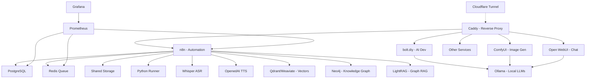

# 🚀 AI LaunchKit

<div align="center">

**Open-Source AI Development Toolkit**

*Deploy your complete AI stack in minutes, not weeks*

[](LICENSE)
[](https://github.com/freddy-schuetz/ai-launchkit)
[](https://github.com/kossakovsky/n8n-installer)

[Installation](#-installation) • [Features](#-whats-included) • [Documentation](#-documentation) • [Support](#-support)

</div>

---

## 🎯 What is AI LaunchKit?

AI LaunchKit is a comprehensive, self-hosted AI development environment that deploys **25+ pre-configured tools** with a single command. Build AI applications, automate workflows, generate images, and develop with AI assistance - all running on your own infrastructure.

Originally forked from [n8n-installer](https://github.com/kossakovsky/n8n-installer), AI LaunchKit has evolved into a complete AI development platform, maintained by [Friedemann Schuetz](https://www.linkedin.com/in/friedemann-schuetz).

### 🎬 Quick Demo

```bash
# One command to rule them all
git clone https://github.com/freddy-schuetz/ai-launchkit && cd ai-launchkit && sudo bash ./scripts/install.sh
```

**That's it!** Your AI development stack is ready in ~10-15 minutes.

---

## ✨ What's Included

### 🔧 Workflow Automation

| Tool | Description | Use Cases | Access |
|------|-------------|-----------|--------|
| **[n8n](https://github.com/n8n-io/n8n)** | Visual workflow automation platform | API integrations, data pipelines, business automation | `n8n.yourdomain.com` |
| **300+ Workflows** | Pre-built n8n templates | Email automation, social media, data sync, AI workflows | Imported on install |

### 🎯 User Interfaces

| Tool | Description | Use Cases | Access |
|------|-------------|-----------|--------|
| **[Open WebUI](https://github.com/open-webui/open-webui)** | ChatGPT-like interface for LLMs | AI chat, model switching, conversation management | `webui.yourdomain.com` |
| **[Postiz](https://github.com/gitroomhq/postiz-app)** | Social media management platform | Content scheduling, analytics, multi-platform posting | `postiz.yourdomain.com` |

### 🎨 AI Content Generation

| Tool | Description | Use Cases | Access |
|------|-------------|-----------|--------|
| **[ComfyUI](https://github.com/comfyanonymous/ComfyUI)** | Node-based Stable Diffusion interface | Image generation, AI art, photo editing, workflows | `comfyui.yourdomain.com` |

### 💻 AI-Powered Development / Vibe Coding

| Tool | Description | Use Cases | Access |
|------|-------------|-----------|--------|
| **[bolt.diy](https://github.com/stackblitz-labs/bolt.diy)** | Build full-stack apps with prompts | Rapid prototyping, MVP creation, learning to code | `bolt.yourdomain.com` |
| **[OpenUI](https://github.com/wandb/openui)** 🧪 | AI-powered UI component generation | Design systems, component libraries, mockups | `openui.yourdomain.com` |

### 🤖 AI Agents

| Tool | Description | Use Cases | Access |
|------|-------------|-----------|--------|
| **[Flowise](https://github.com/FlowiseAI/Flowise)** | Visual AI agent builder | Chatbots, customer support, AI workflows | `flowise.yourdomain.com` |
| **[Dify](https://github.com/langgenius/dify)** | LLMOps platform for AI apps | Production AI apps, model management, prompt engineering | `dify.yourdomain.com` |
| **[Letta](https://github.com/letta-ai/letta)** | Stateful agent server | Persistent AI assistants, memory management | `letta.yourdomain.com` |

### 📚 RAG Systems

| Tool | Description | Use Cases | Access |
|------|-------------|-----------|--------|
| **[RAGApp](https://github.com/ragapp/ragapp)** | Build RAG assistants over your data | Knowledge bases, document Q&A, research tools | `ragapp.yourdomain.com` |
| **[Qdrant](https://github.com/qdrant/qdrant)** | High-performance vector database | Semantic search, recommendations, RAG storage | `qdrant.yourdomain.com` |
| **[Weaviate](https://github.com/weaviate/weaviate)** | AI-native vector database | Hybrid search, multi-modal data, GraphQL API | `weaviate.yourdomain.com` |

### 🎙️ Speech & Language Processing

| Tool | Description | Use Cases | Access |
|------|-------------|-----------|--------|
| **[Faster-Whisper](https://github.com/SYSTRAN/faster-whisper)** | OpenAI-compatible Speech-to-Text | Transcription, voice commands, meeting notes | Port 8001 |
| **[OpenedAI-Speech](https://github.com/matatonic/openedai-speech)** | OpenAI-compatible Text-to-Speech | Voice assistants, audiobooks, notifications | Port 5001 |
| **[LibreTranslate](https://github.com/LibreTranslate/LibreTranslate)** | Self-hosted translation API | 50+ languages, document translation, privacy-focused | `translate.yourdomain.com` |

### 🔍 Search & Web Data

| Tool | Description | Use Cases | Access |
|------|-------------|-----------|--------|
| **[SearXNG](https://github.com/searxng/searxng)** | Privacy-respecting metasearch engine | Web search for agents, no tracking, multiple sources | `searxng.yourdomain.com` |
| **[Perplexica](https://github.com/ItzCrazyKns/Perplexica)** | Open-source AI-powered search engine | Deep research, academic search, Perplexity AI alternative | `perplexica.yourdomain.com` |
| **[Crawl4Ai](https://github.com/unclecode/crawl4ai)** | AI-optimized web crawler | Web scraping, data extraction, site monitoring | Internal API |

### 🧠 Knowledge Graphs

| Tool | Description | Use Cases | Access |
|------|-------------|-----------|--------|
| **[Neo4j](https://github.com/neo4j/neo4j)** | Graph database platform | Knowledge graphs, entity relationships, fraud detection, recommendations | `neo4j.yourdomain.com` |
| **[LightRAG](https://github.com/HKUDS/LightRAG)** | Graph-based RAG with entity extraction | Automatic knowledge graph creation, relationship mapping, complex queries | `lightrag.yourdomain.com` |

### 🎬 Media Processing Suite

Pre-installed in the n8n container for seamless media manipulation:

| Tool | Description | Use Cases |
|------|-------------|-----------|
| **[FFmpeg](https://github.com/FFmpeg/FFmpeg)** | Industry-standard multimedia framework | Video conversion, streaming, audio extraction |
| **[ImageMagick](https://github.com/ImageMagick/ImageMagick)** | Image manipulation toolkit | Format conversion, resizing, effects, thumbnails |
| **[ExifTool](https://github.com/exiftool/exiftool)** | Metadata management | Read/write EXIF, IPTC, XMP metadata |
| **[MediaInfo](https://github.com/MediaArea/MediaInfo)** | Technical media analysis | Codec detection, bitrate analysis, format info |
| **[SoX](https://github.com/chirlu/sox)** | Sound processing toolkit | Audio effects, format conversion, synthesis |
| **[Ghostscript](https://github.com/ArtifexSoftware/ghostpdl)** | PostScript/PDF processor | PDF manipulation, conversion, rendering |
| **[Python3](https://github.com/python/cpython)** | With pydub & Pillow libraries | Custom media processing scripts |

### 💾 Data Infrastructure

| Tool | Description | Use Cases | Access |
|------|-------------|-----------|--------|
| **[Supabase](https://github.com/supabase/supabase)** | Open-source Firebase alternative | User auth, realtime data, file storage, vector embeddings | `supabase.yourdomain.com` |
| **[PostgreSQL](https://github.com/postgres/postgres)** | Relational database | Structured data, transactions, n8n backend | Internal |
| **[Redis](https://github.com/redis/redis)** | In-memory data store | Caching, queues, session management | Internal |

### 📊 System Management

| Tool | Description | Use Cases | Access |
|------|-------------|-----------|--------|
| **[Caddy](https://github.com/caddyserver/caddy)** | Modern web server | Automatic HTTPS, reverse proxy, load balancing | All domains |
| **[Cloudflare Tunnel](https://github.com/cloudflare/cloudflared)** | Secure tunnel to Cloudflare | Zero-trust access, no exposed ports, DDoS protection | Internal |
| **Python Runner** | Python execution environment for n8n | Custom scripts, data processing, automation tasks | Internal |
| **[Grafana](https://github.com/grafana/grafana)** | Metrics visualization platform | Performance dashboards, alerts, analytics | `grafana.yourdomain.com` |
| **[Prometheus](https://github.com/prometheus/prometheus)** | Time-series monitoring | Metrics collection, alerting rules, scraping | `prometheus.yourdomain.com` |
| **[Portainer](https://github.com/portainer/portainer)** | Container management UI | Docker admin, logs, resource monitoring | `portainer.yourdomain.com` |
| **[Langfuse](https://github.com/langfuse/langfuse)** | LLM observability platform | AI performance tracking, cost analysis, debugging | `langfuse.yourdomain.com` |

### 🔧 AI Support Tools

| Tool | Description | Use Cases | Access |
|------|-------------|-----------|--------|
| **[Ollama](https://github.com/ollama/ollama)** | Local LLM runtime | Run Llama, Mistral, Gemma models locally | `ollama.yourdomain.com` |
| **[Gotenberg](https://github.com/gotenberg/gotenberg)** | Document conversion API | PDF generation, HTML to PDF, Office conversions | Internal API |

---

## 🚀 Installation

### Prerequisites

1. **Server**: Ubuntu 24.04 LTS (64-bit)
   - Minimum: 4GB RAM, 2 CPU cores, 30GB disk (n8n + Flowise only)
   - Recommended: 8GB RAM, 4 CPU cores, 60GB disk (all services)

2. **Domain**: A registered domain with wildcard DNS
   ```
   A *.yourdomain.com -> YOUR_SERVER_IP
   ```

3. **Access**: SSH access to your server

### Quick Install

```bash
# Clone and run the installer
git clone https://github.com/freddy-schuetz/ai-launchkit && cd ai-launchkit && sudo bash ./scripts/install.sh
```

### Installation Process

The installer will ask you for:
1. **Domain name** - Your wildcard domain (e.g., `yourdomain.com`)
2. **Email address** - For SSL certificates and service logins
3. **API keys** (optional) - OpenAI, Anthropic, Groq for enhanced AI features
4. **Community workflows** - Import 300+ n8n templates (optional, 20-30 min)
5. **Worker count** - Number of n8n workers for parallel processing (1-4)
6. **Service selection** - Choose which tools to install (including Speech Stack)

**Installation time:** 10-15 minutes (plus optional workflow import)

### Post-Installation

Configure AI model API keys:
```bash
# Edit configuration
nano .env

# Add your API keys
OPENAI_API_KEY=sk-...
ANTHROPIC_API_KEY=sk-ant-...
GROQ_API_KEY=gsk_...

# Restart services
docker compose restart
```

---

## 📚 Documentation

### 🎯 Quick Start Examples

#### Build a Web App with AI (bolt.diy)
```
1. Open bolt.yourdomain.com
2. Describe your app: "Create a todo app with dark mode"
3. Watch AI build it in real-time
4. Deploy directly or download code
```

#### Create an Automation Workflow (n8n)
```javascript
// Example: Process uploaded videos
// Execute Command Node
Command: ffmpeg
Arguments: -i /data/media/input.mp4 -vn -codec:a mp3 /data/media/output.mp3
```

#### Generate UI Components (OpenUI)
```
1. Open openui.yourdomain.com
2. Describe: "Modern pricing card with gradient"
3. Get React/Vue/HTML component instantly
```

### 🔎 Perplexica Integration with n8n

Perplexica provides AI-powered search capabilities that can be integrated into n8n workflows for research automation, content generation, and intelligent data gathering.

#### Basic Search Query (n8n HTTP Request Node)

**Configuration:**
- **Method:** POST
- **URL:** `http://perplexica:3000/api/search`
- **Headers:** `Content-Type: application/json`
- **Body:**
```json
{
  "query": "{{ $json.searchQuery }}",
  "focusMode": "webSearch",
  "chatHistory": []
}
```

#### Available Focus Modes

| Mode | Use Case | Example Query |
|------|----------|---------------|
| `webSearch` | General web search | "Latest AI developments 2025" |
| `academicSearch` | Scientific papers & research | "CRISPR gene editing studies" |
| `youtubeSearch` | Video content discovery | "How to build a RAG system" |
| `redditSearch` | Community discussions | "Best practices for n8n workflows" |
| `writingAssistant` | Content creation help | "Write an introduction about quantum computing" |
| `wolframAlphaSearch` | Math & computational queries | "Calculate the derivative of x^3 + 2x" |

#### Example: Deep Research Workflow

Build an automated research assistant that performs multi-perspective analysis:

```
1. Chat Trigger → Receive research query
2. HTTP Request → Initial Perplexica search (webSearch)
3. Code Node → Extract key topics from response
4. Loop Over Items → For each topic:
   - HTTP Request → Perplexica (different focusMode)
   - Gather multiple perspectives
5. Code Node → Aggregate all research
6. Send Email/Slack → Deliver research report
```

**Extract Topics Code Node:**
```javascript
const response = $input.first().json;
const topics = [];

// Extract key phrases from answer
const headings = response.message.match(/### (.+)/g) || [];
headings.forEach(h => topics.push(h.replace('### ', '')));

// Create follow-up queries
return topics.map(topic => ({
  json: {
    query: `${topic} detailed analysis`,
    focusMode: "academicSearch"
  }
}));
```

**Aggregate Research Code Node:**
```javascript
const allResults = $input.all();
const research = {
  timestamp: new Date().toISOString(),
  findings: {},
  sources: []
};

// Combine all research
allResults.forEach(item => {
  const data = item.json;
  research.findings[data.focusMode] = data.message;
  research.sources.push(...(data.sources || []));
});

// Remove duplicate sources
research.sources = [...new Map(
  research.sources.map(s => [s.url, s])
).values()];

return { json: research };
```

#### Example: Content Generation Pipeline

Combine Perplexica research with AI writing:

```
1. Schedule Trigger → Daily at 9 AM
2. HTTP Request → Perplexica search trending topics
3. Code Node → Select top 3 topics
4. Loop → For each topic:
   - HTTP Request → Deep research via Perplexica
   - HTTP Request → Generate article with Ollama/OpenAI
   - Markdown Node → Format article
5. Ghost/WordPress → Publish articles
```

#### Example: Competitive Intelligence Monitor

```javascript
// Monitor competitor mentions
const competitors = ["Competitor A", "Competitor B"];
const results = [];

for (const competitor of competitors) {
  // Search for recent news
  const news = await $http.request({
    method: "POST",
    url: "http://perplexica:3000/api/search",
    body: {
      query: `${competitor} latest news announcements`,
      focusMode: "webSearch"
    }
  });
  
  // Search for community sentiment
  const sentiment = await $http.request({
    method: "POST",
    url: "http://perplexica:3000/api/search",
    body: {
      query: `${competitor} reviews opinions`,
      focusMode: "redditSearch"
    }
  });
  
  results.push({
    competitor,
    news: news.message,
    sentiment: sentiment.message,
    sources: [...news.sources, ...sentiment.sources]
  });
}

return results;
```

#### Tips for Perplexica + n8n

1. **Rate Limiting:** Add Wait nodes between searches to avoid overwhelming the service
2. **Error Handling:** Use Try/Catch nodes for resilient workflows
3. **Caching:** Store search results in Supabase/PostgreSQL to avoid duplicate queries
4. **Enrichment:** Combine Perplexica with other services:
   - Use Perplexica for research → LightRAG for knowledge graph
   - Search with Perplexica → Summarize with Ollama
   - Perplexica for sources → Crawl4ai for full content extraction

### 🎙️ Speech Stack Integration

The Speech Stack provides OpenAI-compatible APIs for speech-to-text and text-to-speech, perfect for building voice-enabled workflows in n8n.

#### Speech-to-Text with Whisper (n8n HTTP Request Node)

**Configuration:**
- **Method:** POST
- **URL:** `http://faster-whisper:8000/v1/audio/transcriptions`
- **Send Body:** Form Data Multipart
- **Body Parameters:**
  1. Binary File:
     - Parameter Type: `n8n Binary File`
     - Name: `file`
     - Input Data Field Name: `data`
  2. Model:
     - Parameter Type: `Form Data`
     - Name: `model`
     - Value: `Systran/faster-whisper-large-v3`
  3. Language (optional):
     - Parameter Type: `Form Data`
     - Name: `language`
     - Value: `en` (or `de` for German, etc.)

#### Text-to-Speech with OpenedAI-Speech (n8n HTTP Request Node)

**Configuration:**
- **Method:** POST
- **URL:** `http://openedai-speech:8000/v1/audio/speech`
- **Send Headers:** ON
  - `Content-Type`: `application/json`
  - `Authorization`: `Bearer sk-dummy`
- **Send Body:** JSON
  ```json
  {
    "model": "tts-1",
    "input": "{{ $json.text }}",
    "voice": "alloy"
  }
  ```
- **Response Format:** `File`
- **Put Output in Field:** `data`

**Available English voices:** alloy, echo, fable, onyx, nova, shimmer

#### Example: Voice-to-Voice Workflow
```
1. Telegram Trigger → Receive voice message
2. Get File → Download voice file from Telegram
3. HTTP Request → Transcribe with Whisper
4. AI Agent → Process text with ChatGPT/Claude
5. HTTP Request → Generate speech with TTS
6. Telegram → Send audio response
```

### 🇩🇪 Adding German Voices to TTS

To add German voices (or other languages) to the Text-to-Speech service:

1. **Locate the configuration file:**
   ```bash
   cd ~/ai-launchkit
   nano openedai-config/voice_to_speaker.yaml
   ```

2. **Add German voices to the `tts-1` section:**
   ```yaml
   # Add these lines under the existing voices
   thorsten:
     model: de_DE-thorsten-medium
     speaker: # default speaker
   eva:
     model: de_DE-eva_k-x_low
     speaker: # default speaker
   kerstin:
     model: de_DE-kerstin-low
     speaker: # default speaker
   ```

3. **Restart the TTS service:**
   ```bash
   docker compose -p localai restart openedai-speech
   ```

4. **Use German voices in n8n:**
   ```json
   {
     "model": "tts-1",
     "input": "Hallo, dies ist ein Test der deutschen Sprachausgabe.",
     "voice": "thorsten"
   }
   ```

The voice models will be automatically downloaded on first use. Available German voices:
- **thorsten**: High-quality male voice (medium quality)
- **eva**: Female voice (extra low quality, very fast)
- **kerstin**: Female voice (low quality, fast)

You can find more voices at [Piper Voice Samples](https://rhasspy.github.io/piper-samples/).

### 🌍 LibreTranslate Integration

LibreTranslate provides a self-hosted translation API with 50+ languages, perfect for privacy-conscious workflows and unlimited translations without API costs.

#### Basic Translation (n8n HTTP Request Node)

**Configuration:**
- **Method:** POST
- **URL:** `http://libretranslate:5000/translate`
- **Authentication:** None (internal access)
- **Send Headers:** ON
  - `Content-Type`: `application/json`
- **Send Body:** JSON
  ```json
  {
    "q": "{{ $json.text }}",
    "source": "auto",
    "target": "de",
    "format": "text"
  }
  ```

#### Detect Language

**Configuration:**
- **Method:** POST
- **URL:** `http://libretranslate:5000/detect`
- **Send Body:** JSON
  ```json
  {
    "q": "{{ $json.text }}"
  }
  ```

#### Get Available Languages

**Configuration:**
- **Method:** GET
- **URL:** `http://libretranslate:5000/languages`

#### Example: Multi-Language Support Workflow
```
1. Webhook Trigger → Receive text from user
2. HTTP Request → Detect language
   URL: http://libretranslate:5000/detect
   Body: {"q": "{{ $json.text }}"}
3. IF Node → Check if language != "en"
4. HTTP Request → Translate to English
   URL: http://libretranslate:5000/translate
   Body: {
     "q": "{{ $('Webhook').item.json.text }}",
     "source": "{{ $json[0].language }}",
     "target": "en"
   }
5. OpenAI/Ollama → Process in English
6. HTTP Request → Translate back to original language
   URL: http://libretranslate:5000/translate
   Body: {
     "q": "{{ $json.response }}",
     "source": "en",
     "target": "{{ $node['HTTP Request'].json[0].language }}"
   }
7. Respond to User → Send translated response
```

#### Common Language Codes

| Code | Language | Code | Language | Code | Language |
|------|----------|------|----------|------|----------|
| `de` | German | `fr` | French | `zh` | Chinese |
| `en` | English | `it` | Italian | `ja` | Japanese |
| `es` | Spanish | `pt` | Portuguese | `ar` | Arabic |
| `ru` | Russian | `nl` | Dutch | `ko` | Korean |
| `pl` | Polish | `tr` | Turkish | `hi` | Hindi |

**Tips:**
- Use `"source": "auto"` for automatic language detection
- Set `"format": "html"` to preserve HTML formatting
- Documents (docx, pdf, txt) can be translated via file upload
- Internal access from n8n doesn't require authentication
- External access via `https://translate.yourdomain.com` requires Basic Auth

### 🔮 LightRAG Integration

LightRAG provides graph-based RAG with automatic entity and relationship extraction, creating knowledge graphs from your documents. It's perfect for complex queries that require understanding relationships between entities.

#### Basic Document Processing (n8n HTTP Request Node)

**Insert Document:**
```javascript
// HTTP Request Node Configuration
Method: POST
URL: http://lightrag:9621/api/insert
Headers:
  Content-Type: application/json
  Authorization: Bearer {{ $credentials.lightragToken }}
Body: {
  "text": "{{ $json.documentContent }}",
  "metadata": {
    "source": "{{ $json.fileName }}",
    "timestamp": "{{ $now.toISO() }}"
  }
}
```

#### Query Knowledge Graph

**Configuration for different query modes:**
```javascript
// Local Query - Specific entity information
Method: POST
URL: http://lightrag:9621/api/query
Body: {
  "query": "What is the role of Petra Hedorfer?",
  "mode": "local",
  "max_results": 5
}

// Global Query - High-level summaries
Method: POST
URL: http://lightrag:9621/api/query
Body: {
  "query": "What are the main sustainability initiatives?",
  "mode": "global",
  "max_results": 10
}

// Hybrid Query - Combines local and global
Method: POST
URL: http://lightrag:9621/api/query
Body: {
  "query": "How does DZT implement SDGs in tourism?",
  "mode": "hybrid",
  "stream": false
}
```

#### Example: Building a Knowledge Graph from Documents
```
1. Trigger (Webhook/Schedule) → Start workflow
2. Google Drive → Get new PDF documents
3. Extract from File → Extract text from PDF
4. Code Node → Split into chunks (3000 chars)
5. Loop Over Items → For each chunk:
   - HTTP Request → Insert to LightRAG
   - Extract entities and relationships
6. HTTP Request → Query for specific insights
7. Format Response → Create summary report
8. Send Email → Deliver insights
```

#### Query Modes Explained
- **`local`**: Retrieves specific information about entities and their direct relationships
- **`global`**: Provides high-level summaries and themes across the entire knowledge base
- **`hybrid`**: Combines both local and global retrieval for comprehensive answers
- **`naive`**: Simple keyword-based retrieval without graph features

#### Advanced: Open WebUI Integration

LightRAG can be added to Open WebUI as an Ollama-compatible model:

1. In Open WebUI, go to Settings → Connections
2. Add new Ollama connection:
   - **URL:** `http://lightrag:9621`
   - **Model name:** `lightrag:latest`
3. Select LightRAG from model dropdown in chat

This enables chatting with your knowledge graph directly through the Open WebUI interface!

#### Optional: Switch from Ollama to OpenAI Models

LightRAG defaults to using local Ollama models, but you can switch to OpenAI for better performance with large documents:

##### Why Switch to OpenAI?
- **Performance:** OpenAI models are 10-100x faster than CPU-based Ollama
- **Large Documents:** Can handle PDFs with 50+ pages without timeouts
- **Better Quality:** More accurate entity and relationship extraction
- **Cost-Efficient:** gpt-4o-mini costs ~$0.15 per million tokens

##### Configuration Steps:

1. **Add OpenAI API Key to .env:**
```bash
nano .env
# Add or update:
OPENAI_API_KEY=sk-proj-YOUR-API-KEY-HERE
```

2. **Update docker-compose.yml:**
```yaml
lightrag:
  environment:
    - OPENAI_API_KEY=${OPENAI_API_KEY}
    - LLM_BINDING=openai                           # Changed from ollama
    - LLM_BINDING_HOST=https://api.openai.com/v1   # OpenAI endpoint
    - LLM_MODEL=gpt-4o-mini                        # Cost-efficient model
    - EMBEDDING_BINDING=openai                     # Changed from ollama
    - EMBEDDING_BINDING_HOST=https://api.openai.com/v1
    - EMBEDDING_MODEL=text-embedding-3-small       # OpenAI embeddings
    - EMBEDDING_DIM=1536                           # OpenAI dimension (not 768!)
    - TIMEOUT=600                                   # 10 minute timeout
    # ... other existing variables ...
```

3. **Clear Existing Data (Important!):**
```bash
# Stop LightRAG
docker compose -p localai down lightrag

# Remove old embeddings (incompatible dimensions)
docker volume rm localai_lightrag_data

# Restart with new configuration
docker compose -p localai up -d lightrag
```

##### Available OpenAI Models:
- **Budget:** `gpt-4o-mini` (~$0.15/1M input, $0.60/1M output)
- **Balanced:** `gpt-4o` (~$2.50/1M input, $10/1M output)
- **Embeddings:** `text-embedding-3-small` (1536 dimensions)

##### Cost Example:
Processing a 50-page PDF (~50,000 tokens):
- **gpt-4o-mini:** ~$0.02 total
- **gpt-4o:** ~$0.20 total
- **Ollama (llama3.2):** Free but may timeout

##### Troubleshooting OpenAI Configuration:

If you get "model not found" errors:
- Ensure `LLM_BINDING` and `EMBEDDING_BINDING` are set to `openai`
- Model names should NOT have `openai/` prefix
- Check API key is valid: https://platform.openai.com/api-keys

If you get dimension mismatch errors:
- You must delete the volume when switching between Ollama (768 dim) and OpenAI (1536 dim)
- This will delete all existing knowledge graphs - export important data first!

### 📁 File System Access
- **Shared folder**: `./shared` → `/data/shared` in containers
- **Media folder**: `./media` → `/data/media` in containers
- **Temp folder**: `./temp` → `/data/temp` for processing

### 🔒 Security Features
- ✅ **Automatic SSL/TLS** via Let's Encrypt
- ✅ **Firewall configuration** with UFW
- ✅ **Brute-force protection** via Fail2ban
- ✅ **Network isolation** between services
- ✅ **Secure secrets** auto-generated

### 🔄 Maintenance

**Update all services:**
```bash
sudo bash ./scripts/update.sh
```

**Clean up Docker:**
```bash
sudo bash ./scripts/docker_cleanup.sh
```

**Check service status:**
```bash
docker ps
docker stats
```

---

## 🌟 Features Highlight

### 300+ Pre-built Workflows

Optional import includes workflows for:
- **AI & LLM**: RAG systems, chatbots, agents
- **Automation**: Email, documents, data sync
- **Social Media**: Auto-posting, content generation
- **Business**: CRM, e-commerce, HR processes
- **Development**: CI/CD, monitoring, testing

### Enhanced Media Processing

Complete media manipulation toolkit pre-installed:
```javascript
// Video thumbnail generation
ffmpeg -i video.mp4 -ss 00:00:05 -vframes 1 thumb.jpg

// Batch image resizing
magick *.jpg -resize 800x600 resized_%d.jpg

// PDF text extraction
gs -sDEVICE=txtwrite -o output.txt input.pdf
```

### Production-Ready Features
- **Scalable**: Queue-based architecture with Redis
- **Parallel Processing**: Multiple n8n workers
- **Monitoring**: Built-in Grafana dashboards
- **Container Management**: Portainer UI
- **Observability**: AI performance tracking with Langfuse

---

## 🤝 Support

### Community
- **Discord**: [Join our community](https://discord.gg/ai-launchkit) *(coming soon)*
- **Forum**: [oTTomator Think Tank](https://thinktank.ottomator.ai/c/local-ai/18)
- **Issues**: [GitHub Issues](https://github.com/freddy-schuetz/ai-launchkit/issues)

### Resources
- **Original n8n-installer**: [kossakovsky/n8n-installer](https://github.com/kossakovsky/n8n-installer)
- **n8n Templates**: [Official Gallery](https://n8n.io/workflows/?categories=AI)
- **Video Guide**: [AI Starter Kit Walkthrough](https://youtu.be/pOsO40HSbOo)

### Troubleshooting

<details>
<summary><b>🚨 502 Bad Gateway Errors</b></summary>

502 errors typically indicate that Caddy (the reverse proxy) cannot reach the backend service. This is one of the most common issues, especially during initial setup or when running many services.

#### Quick Diagnosis

1. **Check which containers are actually running:**
   ```bash
   docker ps -a
   ```
   Look for containers with status "Exited" or "Restarting"

2. **Check system resources:**
   ```bash
   # RAM usage
   free -h
   
   # CPU usage
   htop
   
   # Disk space
   df -h
   ```

3. **Check specific service logs:**
   ```bash
   # For the failing service (replace SERVICE_NAME)
   docker logs [SERVICE_NAME] --tail 100
   
   # For Caddy (reverse proxy)
   docker logs caddy --tail 50
   ```

#### Common Causes and Solutions

##### 1. Services Failed to Start (Most Common)

**Symptoms:**
- Service container shows "Exited" status
- Caddy logs show "dial tcp: connection refused"

**Solutions:**
```bash
# Check why the service crashed
docker logs [SERVICE_NAME] --tail 200

# Try restarting the service
docker compose restart [SERVICE_NAME]

# If it keeps crashing, check the .env file for missing variables
nano .env
```

##### 2. Insufficient RAM/Resources

**Symptoms:**
- High memory usage (>90% in `free -h`)
- OOMKiller messages in logs
- Multiple services crashing

**Solutions:**
```bash
# Add swap space (temporary fix)
sudo fallocate -l 4G /swapfile
sudo chmod 600 /swapfile
sudo mkswap /swapfile
sudo swapon /swapfile

# Reduce number of running services
docker compose stop [SERVICE_NAME]

# Or upgrade your VPS (permanent solution)
```

##### 3. Long Startup Times

**Symptoms:**
- Service works after 5-10 minutes
- Container is running but not ready
- Especially common with: Supabase, Dify, ComfyUI

**Solution:**
```bash
# Be patient - some services need time to initialize
# Check progress with:
docker logs [SERVICE_NAME] --follow

# For n8n with workflows import, this can take 30+ minutes
```

##### 4. Port Conflicts

**Symptoms:**
- "bind: address already in use" in logs
- Service can't start on its configured port

**Solutions:**
```bash
# Find what's using the port
sudo lsof -i :PORT_NUMBER

# Edit .env to use a different port
nano .env
# Change PORT_NAME=8080 to PORT_NAME=8081

# Restart services
docker compose down
docker compose up -d
```

##### 5. Network Issues

**Symptoms:**
- Services can't communicate internally
- "no such host" errors in logs

**Solutions:**
```bash
# Recreate Docker network
docker compose down
docker network prune
docker compose up -d

# Verify network connectivity
docker exec caddy ping [SERVICE_NAME]
```

##### 6. Database Connection Issues

**Symptoms:**
- Services depending on PostgreSQL fail
- "connection refused" to postgres:5432

**Solutions:**
```bash
# Check if PostgreSQL is running
docker ps | grep postgres

# Check PostgreSQL logs
docker logs postgres --tail 100

# Ensure password doesn't contain special characters like @
# Edit .env and regenerate if needed
```

#### Service-Specific 502 Issues

##### n8n
```bash
# Often caused by workflow import hanging
# Solution: Skip workflows initially
docker compose stop n8n
# Edit .env: set IMPORT_WORKFLOWS=false
docker compose up -d n8n
```

##### Supabase
```bash
# Complex service with many components
# Check each component:
docker ps | grep supabase
# Kong (API Gateway) must be healthy
docker logs supabase-kong --tail 50
```

##### bolt.diy
```bash
# Requires proper hostname configuration
# Verify in .env:
grep BOLT_HOSTNAME .env
# Should match your domain
```

#### Prevention Tips

1. **Start with minimal services:**
   - Begin with just n8n
   - Add services gradually
   - Monitor resources after each addition

2. **Check requirements before installation:**
   - Each service adds ~200-500MB RAM usage
   - Some services (ComfyUI, Dify) need 1-2GB alone

3. **Use monitoring:**
   ```bash
   # Watch resources in real-time
   docker stats
   
   # Set up alerts with Grafana (if installed)
   ```

4. **Regular maintenance:**
   ```bash
   # Clean up unused Docker resources
   docker system prune -a
   
   # Check logs regularly
   docker compose logs --tail 100
   ```

#### Still Getting 502 Errors?

If problems persist after trying these solutions:

1. **Collect diagnostic information:**
   ```bash
   # Save all container statuses
   docker ps -a > docker_status.txt
   
   # Save resource usage
   free -h > memory_status.txt
   df -h > disk_status.txt
   
   # Save logs of failing service
   docker logs [SERVICE_NAME] > service_logs.txt 2>&1
   
   # Save Caddy logs
   docker logs caddy > caddy_logs.txt 2>&1
   ```

2. **Create a GitHub issue with:**
   - Your VPS specifications
   - Services selected during installation
   - The diagnostic files above
   - Specific error messages

3. **Quick workaround:**
   - Access services directly via ports (bypass Caddy)
   - Example: `http://YOUR_IP:8080` instead of `https://n8n.yourdomain.com`
   - Note: This bypasses SSL, use only for testing

</details>

<details>
<summary><b>🎙️ Speech Stack Issues</b></summary>

#### Port Conflicts
- **Symptom:** "Port already allocated" error during startup
- **Common cause:** Port 8000 is used by Kong/Supabase
- **Solution:** Speech Stack uses port 8001 for Whisper and 5001 for TTS to avoid conflicts

#### TTS Not Working
- **Symptom:** HTTP Request to TTS service fails
- **Solution:**
  - Use the internal Docker network URL: `http://openedai-speech:8000/v1/audio/speech`
  - Not `localhost:5001` from within n8n
  - Ensure the Authorization header is set (even with dummy value like `Bearer sk-dummy`)

#### German Speech Recognition Issues
- **Symptom:** German audio transcribed as English gibberish
- **Solution:**
  - Use the full model `Systran/faster-whisper-large-v3` instead of `distil` version
  - Add `"language": "de"` parameter to the transcription request
  - The full model will be downloaded on first use (~6GB)

#### Voice Models Not Loading
- **Symptom:** TTS voice not found error
- **Solution:**
  - Voice models are downloaded automatically on first use
  - Check logs: `docker logs openedai-speech`
  - Ensure the voice name matches exactly (case-sensitive)
  - For custom voices, edit `openedai-config/voice_to_speaker.yaml`

</details>

<details>
<summary><b>🤖 AI Development Tools Issues</b></summary>

#### bolt.diy Not Loading
- **Symptom:** bolt.diy shows "blocked request" or doesn't load
- **Cause:** This is typically a Vite configuration issue with reverse proxy
- **Solution:** This fork includes a dynamic hostname configuration that automatically resolves this. If you still have issues:
  1. Check that BOLT_HOSTNAME is set correctly in your .env file
  2. Restart the service: `docker compose restart bolt`
  3. Clear browser cache and try again

#### OpenHands Runtime Issues
- **Symptom:** OpenHands shows "Failed to connect to runtime" after ~125 seconds
- **Cause:** OpenHands requires Docker Desktop for `host.docker.internal` networking
- **Solution:**
  - On Linux servers without Docker Desktop, this is a known limitation
  - Consider using bolt.diy as an alternative for AI-assisted development
  - For full OpenHands functionality, use a system with Docker Desktop installed

#### OpenUI Quality Issues (EXPERIMENTAL)
- **Symptom:** OpenUI generates poor quality or unusable UI components
- **Cause:** OpenUI's output quality varies significantly based on the LLM model used
- **Solution:**
  - For best results, use Claude 3.5 Sonnet or GPT-4 models
  - Groq models provide faster generation but may sacrifice quality
  - Ollama models are supported but may produce inconsistent results
  - Consider using bolt.diy for more complex UI requirements
  - Always test generated components thoroughly before production use

</details>

<details>
<summary><b>🌐 Services Not Loading</b></summary>

- **Symptom:** Your domains/sites do not open or return errors even though you completed all installation steps
- **Likely cause:** Your VPS does not have enough resources for the set of services you selected
- **What to try:**
  1. Check current CPU and RAM usage:
     ```bash
     htop
     free -h
     docker stats
     ```
  2. If resources are saturated, upgrade the server or reduce the number of running services
  3. Try a minimal configuration — start only `n8n` and verify it comes up
  4. If it works in this minimal setup, enable other services gradually while monitoring the load

</details>

<details>
<summary><b>🔒 SSL Certificate Warnings</b></summary>

- **Symptom:** Browser displays "Dangerous Site" or similar security warning when accessing services
- **Cause:** This can happen for a couple of reasons:
  1. **Brief use of a self-signed certificate:** When Caddy starts up for a new domain, it might briefly use a temporary certificate while requesting one from Let's Encrypt
  2. **Delay in applying the new certificate:** There might be a short delay before the newly obtained certificate is fully applied
- **Solution:**
  - This is usually temporary and resolves within 1-24 hours
  - If the warning persists for more than 24 hours:
    ```bash
    # Check Caddy logs for certificate errors
    docker logs caddy | grep -i certificate
    
    # Verify DNS settings
    nslookup *.yourdomain.com
    
    # Force certificate renewal
    docker exec caddy caddy reload --config /etc/caddy/Caddyfile
    ```
  - Try clearing browser cache or using incognito/private window

</details>

<details>
<summary><b>🗄️ Supabase Issues</b></summary>

#### Supabase Pooler Restarting
- **Problem:** The `supabase-pooler` component keeps restarting
- **Solution:** Follow the instructions in [this GitHub issue](https://github.com/supabase/supabase/issues/30210#issuecomment-2456955578)

#### Supabase Analytics Startup Failure
- **Problem:** The `supabase-analytics` component fails to start after changing Postgres password
- **Solution:** You might need to reset its data
- **⚠️ Warning:** This will delete your Supabase database data!
  - Ensure you have backups before proceeding
  - Technical step: Delete the `supabase/docker/volumes/db/data` folder

#### Supabase Service Unavailable
- **Problem:** Services like n8n cannot connect to Supabase
- **Solution:**
  - Ensure your Postgres password doesn't contain special characters like "@"
  - Check logs: `docker logs supabase-db`
  - Verify network connectivity: `docker exec n8n ping supabase-db`

</details>

<details>
<summary><b>🎬 Media Processing Not Working</b></summary>

- **Symptom:** Permission denied errors when processing media files
- **Solution:**
  ```bash
  # Check directory permissions
  ls -la ./media
  ls -la ./temp
  
  # Check from within container
  docker exec n8n ls -la /data/media
  docker exec n8n ls -la /data/temp
  
  # Fix permissions if needed
  sudo chown -R 1000:1000 ./media ./temp
  sudo chmod -R 775 ./media ./temp
  
  # Restart n8n
  docker restart n8n
  ```

</details>

<details>
<summary><b>🐳 Docker & Network Issues</b></summary>

#### VPN Conflicts
- **Problem:** Unable to download Docker images
- **Solution:** Temporarily disable VPN during installation or updates

#### Container Name Conflicts
- **Symptom:** "Container name already in use" error
- **Solution:**
  ```bash
  # Stop and remove conflicting container
  docker stop [container-name]
  docker rm [container-name]
  
  # Or remove all stopped containers
  docker container prune
  ```

#### Port Already in Use
- **Symptom:** "Bind: address already in use" error
- **Solution:**
  ```bash
  # Find what's using the port
  sudo lsof -i :PORT_NUMBER
  
  # Kill the process or change port in .env file
  ```

</details>

<details>
<summary><b>📊 Performance Issues</b></summary>

#### High Memory Usage
- **Check current usage:**
  ```bash
  docker stats --no-stream
  free -h
  ```
- **Solutions:**
  - Reduce n8n workers in .env file
  - Disable unused services
  - Add swap space:
    ```bash
    sudo fallocate -l 4G /swapfile
    sudo chmod 600 /swapfile
    sudo mkswap /swapfile
    sudo swapon /swapfile
    ```

#### Slow Performance
- **Check disk I/O:**
  ```bash
  iostat -x 1
  ```
- **Check Docker logs for errors:**
  ```bash
  docker logs n8n --tail 100
  docker logs postgres --tail 100
  ```

</details>

<details>
<summary><b>⚠️ General Issues</b></summary>

#### Server Requirements
- Ensure your server meets minimum requirements:
  - Ubuntu 24.04 LTS (64-bit)
  - Minimum 4GB RAM for basic setup
  - 30GB+ disk space
  - Properly configured DNS with wildcard A record

#### Checking Service Health
```bash
# View all running containers
docker ps

# Check specific service logs
docker logs [service-name] --tail 50

# Restart a specific service
docker compose restart [service-name]

# Restart everything
docker compose down && docker compose up -d
```

#### Getting Help
If problems persist:
1. Check existing [GitHub Issues](https://github.com/freddy-schuetz/ai-launchkit/issues)
2. Search the [Community Forum](https://thinktank.ottomator.ai/c/local-ai/18)
3. Create a new issue with:
   - Your server specs
   - Services selected during installation
   - Error messages from `docker logs`
   - Output of `docker ps` and `docker stats`

</details>

---

## 🏗️ Architecture



---

## 👥 Contributors

Created and maintained by [Friedemann Schuetz](https://www.linkedin.com/in/friedemann-schuetz)

Based on:
- [n8n-installer](https://github.com/kossakovsky/n8n-installer) by kossakovsky
- [self-hosted-ai-starter-kit](https://github.com/n8n-io/self-hosted-ai-starter-kit) by n8n team
- [local-ai-packaged](https://github.com/coleam00/local-ai-packaged) by coleam00

[View all contributors](https://github.com/freddy-schuetz/ai-launchkit/graphs/contributors)

---

## 📜 License

This project is licensed under the Apache License 2.0 - see the [LICENSE](LICENSE) file for details.

---

<div align="center">

**Ready to launch your AI projects?**

[⭐ Star this repo](https://github.com/freddy-schuetz/ai-launchkit) • [🐛 Report issues](https://github.com/freddy-schuetz/ai-launchkit/issues) • [🤝 Contribute](https://github.com/freddy-schuetz/ai-launchkit/pulls)

</div>
