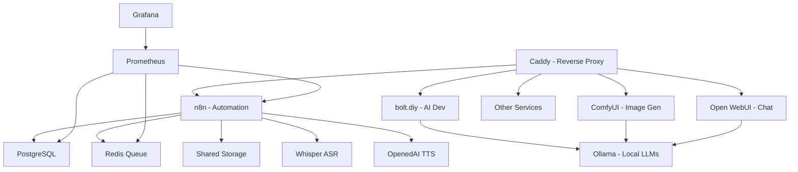

# 🚀 AI LaunchKit

<div align="center">

**Open-Source AI Development Toolkit**  
*Deploy your complete AI stack in minutes, not weeks*

[](LICENSE)
[](https://github.com/freddy-schuetz/ai-launchkit)
[](https://github.com/kossakovsky/n8n-installer)

[Installation](#-installation) • [Features](#-whats-included) • [Documentation](#-documentation) • [Support](#-support)

</div>

---

## 🎯 What is AI LaunchKit?

AI LaunchKit is a comprehensive, self-hosted AI development environment that deploys **20+ pre-configured tools** with a single command. Build AI applications, automate workflows, generate images, and develop with AI assistance - all running on your own infrastructure.

Originally forked from [n8n-installer](https://github.com/kossakovsky/n8n-installer), AI LaunchKit has evolved into a complete AI development platform, maintained by [Friedemann Schuetz](https://www.linkedin.com/in/friedemann-schuetz).

### 🎬 Quick Demo

```bash
# One command to rule them all
git clone https://github.com/freddy-schuetz/ai-launchkit
cd ai-launchkit
sudo bash ./scripts/install.sh
```

**That's it!** Your AI development stack is ready in ~10-15 minutes.

---

## ✨ What's Included

### 🤖 AI Development Tools

| Tool | Description | Access URL |
|------|-------------|------------|
| **[bolt.diy](https://github.com/stackblitz-labs/bolt.diy)** | Build full-stack apps with natural language | `bolt.yourdomain.com` |
| **[OpenUI](https://github.com/wandb/openui)** 🧪 | Generate UI components from descriptions | `openui.yourdomain.com` |
| **[ComfyUI](https://github.com/comfyanonymous/ComfyUI)** | Node-based Stable Diffusion interface | `comfyui.yourdomain.com` |
| **[Dify](https://dify.ai)** | LLMOps platform for AI applications | `dify.yourdomain.com` |

### 🎙️ Speech Stack

| Tool | Description | Access URL |
|------|-------------|------------|
| **[Faster-Whisper](https://github.com/SYSTRAN/faster-whisper)** | OpenAI-compatible Speech-to-Text API | Port 8000/8001 |
| **[OpenedAI-Speech](https://github.com/matatonic/openedai-speech)** | OpenAI-compatible Text-to-Speech API | Port 5001/8000 |

Both services are CPU-optimized and work seamlessly with n8n for voice automation workflows.

### 🔧 Automation & Workflow

| Tool | Description | Access URL |
|------|-------------|------------|
| **[n8n](https://n8n.io)** | Workflow automation with 400+ integrations | `n8n.yourdomain.com` |
| **[Flowise](https://flowiseai.com)** | No-code AI agent builder | `flowise.yourdomain.com` |
| **[RAGApp](https://github.com/ragapp/ragapp)** | Build RAG assistants over your data | `ragapp.yourdomain.com` |
| **[Letta](https://docs.letta.com)** | Agent server for LLM backends | `letta.yourdomain.com` |

### 💾 Databases & Vector Stores

| Tool | Description | Access URL |
|------|-------------|------------|
| **[Supabase](https://supabase.com)** | Open-source Firebase alternative | `supabase.yourdomain.com` |
| **[Qdrant](https://qdrant.tech)** | High-performance vector database | `qdrant.yourdomain.com` |
| **[Weaviate](https://weaviate.io)** | AI-native vector database | `weaviate.yourdomain.com` |
| **[Neo4j](https://neo4j.com)** | Graph database for relationships | `neo4j.yourdomain.com` |
| **PostgreSQL** | Primary relational database | Internal |
| **Redis** | Caching and queue management | Internal |

### 🎨 UI & Interfaces

| Tool | Description | Access URL |
|------|-------------|------------|
| **[Open WebUI](https://openwebui.com)** | ChatGPT-like interface for your models | `webui.yourdomain.com` |
| **[Postiz](https://postiz.com)** | Social media scheduling platform | `postiz.yourdomain.com` |

### 🛠️ Infrastructure & Monitoring

| Tool | Description | Access URL |
|------|-------------|------------|
| **[Caddy](https://caddyserver.com)** | Automatic HTTPS & reverse proxy | Handles all domains |
| **[Grafana](https://grafana.com)** | Metrics visualization | `grafana.yourdomain.com` |
| **[Prometheus](https://prometheus.io)** | Monitoring & alerting | `prometheus.yourdomain.com` |
| **[Portainer](https://portainer.io)** | Docker management UI | `portainer.yourdomain.com` |
| **[Langfuse](https://langfuse.com)** | AI observability platform | `langfuse.yourdomain.com` |

### 🔍 Utilities

| Tool | Description | Access URL |
|------|-------------|------------|
| **[SearXNG](https://searxng.org)** | Privacy-respecting metasearch | `searxng.yourdomain.com` |
| **[Crawl4ai](https://github.com/unclecode/crawl4ai)** | AI-optimized web crawler | Internal API |
| **[Gotenberg](https://gotenberg.dev)** | Document conversion API | Internal API |
| **[Ollama](https://ollama.com)** | Run LLMs locally | `ollama.yourdomain.com` |

### 🎬 Media Processing Suite

**Pre-installed tools for media manipulation:**
- **ffmpeg 6.1.2** - Video/audio processing
- **ImageMagick 7.1.2** - Image manipulation
- **ExifTool 13.30** - Metadata management
- **MediaInfo** - Media file analysis
- **SoX** - Audio processing
- **Ghostscript** - PDF processing
- **Python3** with pydub & Pillow

---

## 🚀 Installation

### Prerequisites

1. **Server**: Ubuntu 24.04 LTS (64-bit)
   - Minimum: 4GB RAM, 2 CPU cores, 30GB disk (n8n + Flowise only)
   - Recommended: 8GB RAM, 4 CPU cores, 60GB disk (all services)

2. **Domain**: A registered domain with wildcard DNS
   ```
   A *.yourdomain.com -> YOUR_SERVER_IP
   ```

3. **Access**: SSH access to your server

### Quick Install

```bash
# Clone and run the installer
git clone https://github.com/freddy-schuetz/ai-launchkit
cd ai-launchkit
sudo bash ./scripts/install.sh
```

### Installation Process

The installer will ask you for:

1. **Domain name** - Your wildcard domain (e.g., `yourdomain.com`)
2. **Email address** - For SSL certificates and service logins
3. **API keys** (optional) - OpenAI, Anthropic, Groq for enhanced AI features
4. **Community workflows** - Import 300+ n8n templates (optional, 20-30 min)
5. **Worker count** - Number of n8n workers for parallel processing (1-4)
6. **Service selection** - Choose which tools to install (including Speech Stack)

**Installation time:** 10-15 minutes (plus optional workflow import)

### Post-Installation

Configure AI model API keys:
```bash
# Edit configuration
nano .env

# Add your API keys
OPENAI_API_KEY=sk-...
ANTHROPIC_API_KEY=sk-ant-...
GROQ_API_KEY=gsk_...

# Restart services
docker compose restart
```

---

## 📚 Documentation

### 🎯 Quick Start Examples

#### Build a Web App with AI (bolt.diy)
```
1. Open bolt.yourdomain.com
2. Describe your app: "Create a todo app with dark mode"
3. Watch AI build it in real-time
4. Deploy directly or download code
```

#### Create an Automation Workflow (n8n)
```javascript
// Example: Process uploaded videos
// Execute Command Node
Command: ffmpeg
Arguments: -i /data/media/input.mp4 -vn -codec:a mp3 /data/media/output.mp3
```

#### Generate UI Components (OpenUI)
```
1. Open openui.yourdomain.com
2. Describe: "Modern pricing card with gradient"
3. Get React/Vue/HTML component instantly
```

### 🎙️ Speech Stack Integration

The Speech Stack provides OpenAI-compatible APIs for speech-to-text and text-to-speech, perfect for building voice-enabled workflows in n8n.

#### Speech-to-Text with Whisper (n8n HTTP Request Node)

**Configuration:**
- **Method:** POST
- **URL:** `http://faster-whisper:8000/v1/audio/transcriptions`
- **Send Body:** Form Data Multipart
- **Body Parameters:**
  1. Binary File:
     - Parameter Type: `n8n Binary File`
     - Name: `file`
     - Input Data Field Name: `data`
  2. Model:
     - Parameter Type: `Form Data`
     - Name: `model`
     - Value: `Systran/faster-whisper-large-v3`
  3. Language (optional):
     - Parameter Type: `Form Data`
     - Name: `language`
     - Value: `en` (or `de` for German, etc.)

#### Text-to-Speech with OpenedAI-Speech (n8n HTTP Request Node)

**Configuration:**
- **Method:** POST
- **URL:** `http://openedai-speech:8000/v1/audio/speech`
- **Send Headers:** ON
  - `Content-Type`: `application/json`
  - `Authorization`: `Bearer sk-dummy`
- **Send Body:** JSON
  ```json
  {
    "model": "tts-1",
    "input": "{{ $json.text }}",
    "voice": "alloy"
  }
  ```
- **Response Format:** `File`
- **Put Output in Field:** `data`

**Available English voices:** alloy, echo, fable, onyx, nova, shimmer

#### Example: Voice-to-Voice Workflow

```
1. Telegram Trigger → Receive voice message
2. Get File → Download voice file from Telegram
3. HTTP Request → Transcribe with Whisper
4. AI Agent → Process text with ChatGPT/Claude
5. HTTP Request → Generate speech with TTS
6. Telegram → Send audio response
```

### 🇩🇪 Adding German Voices to TTS

To add German voices (or other languages) to the Text-to-Speech service:

1. **Locate the configuration file:**
   ```bash
   cd ~/ai-launchkit
   nano openedai-config/voice_to_speaker.yaml
   ```

2. **Add German voices to the `tts-1` section:**
   ```yaml
   # Add these lines under the existing voices
   thorsten:
     model: de_DE-thorsten-medium
     speaker: # default speaker
   eva:
     model: de_DE-eva_k-x_low
     speaker: # default speaker
   kerstin:
     model: de_DE-kerstin-low
     speaker: # default speaker
   ```

3. **Restart the TTS service:**
   ```bash
   docker compose -p localai restart openedai-speech
   ```

4. **Use German voices in n8n:**
   ```json
   {
     "model": "tts-1",
     "input": "Hallo, dies ist ein Test der deutschen Sprachausgabe.",
     "voice": "thorsten"
   }
   ```

The voice models will be automatically downloaded on first use. Available German voices:
- **thorsten**: High-quality male voice (medium quality)
- **eva**: Female voice (extra low quality, very fast)
- **kerstin**: Female voice (low quality, fast)

You can find more voices at [Piper Voice Samples](https://rhasspy.github.io/piper-samples/).

### 📁 File System Access

- **Shared folder**: `./shared` → `/data/shared` in containers
- **Media folder**: `./media` → `/data/media` in containers
- **Temp folder**: `./temp` → `/data/temp` for processing

### 🔒 Security Features

- ✅ **Automatic SSL/TLS** via Let's Encrypt
- ✅ **Firewall configuration** with UFW
- ✅ **Brute-force protection** via Fail2ban
- ✅ **Network isolation** between services
- ✅ **Secure secrets** auto-generated

### 🔄 Maintenance

**Update all services:**
```bash
sudo bash ./scripts/update.sh
```

**Clean up Docker:**
```bash
sudo bash ./scripts/docker_cleanup.sh
```

**Check service status:**
```bash
docker ps
docker stats
```

---

## 🌟 Features Highlight

### 300+ Pre-built Workflows

Optional import includes workflows for:
- **AI & LLM**: RAG systems, chatbots, agents
- **Automation**: Email, documents, data sync
- **Social Media**: Auto-posting, content generation
- **Business**: CRM, e-commerce, HR processes
- **Development**: CI/CD, monitoring, testing

### Enhanced Media Processing

Complete media manipulation toolkit pre-installed:
```javascript
// Video thumbnail generation
ffmpeg -i video.mp4 -ss 00:00:05 -vframes 1 thumb.jpg

// Batch image resizing
magick *.jpg -resize 800x600 resized_%d.jpg

// PDF text extraction
gs -sDEVICE=txtwrite -o output.txt input.pdf
```

### Production-Ready Features

- **Scalable**: Queue-based architecture with Redis
- **Parallel Processing**: Multiple n8n workers
- **Monitoring**: Built-in Grafana dashboards
- **Container Management**: Portainer UI
- **Observability**: AI performance tracking with Langfuse

---

## 🤝 Support

### Community

- **Discord**: [Join our community](https://discord.gg/ai-launchkit) *(coming soon)*
- **Forum**: [oTTomator Think Tank](https://thinktank.ottomator.ai/c/local-ai/18)
- **Issues**: [GitHub Issues](https://github.com/freddy-schuetz/ai-launchkit/issues)

### Resources

- **Original n8n-installer**: [kossakovsky/n8n-installer](https://github.com/kossakovsky/n8n-installer)
- **n8n Templates**: [Official Gallery](https://n8n.io/workflows/?categories=AI)
- **Video Guide**: [AI Starter Kit Walkthrough](https://youtu.be/pOsO40HSbOo)

### Troubleshooting

<details>
<summary><b>🎙️ Speech Stack Issues</b></summary>

#### Port Conflicts
- **Symptom:** "Port already allocated" error during startup
- **Common cause:** Port 8000 is used by Kong/Supabase
- **Solution:** Speech Stack uses port 8001 for Whisper and 5001 for TTS to avoid conflicts

#### TTS Not Working
- **Symptom:** HTTP Request to TTS service fails
- **Solution:** 
  - Use the internal Docker network URL: `http://openedai-speech:8000/v1/audio/speech`
  - Not `localhost:5001` from within n8n
  - Ensure the Authorization header is set (even with dummy value like `Bearer sk-dummy`)

#### German Speech Recognition Issues
- **Symptom:** German audio transcribed as English gibberish
- **Solution:** 
  - Use the full model `Systran/faster-whisper-large-v3` instead of `distil` version
  - Add `"language": "de"` parameter to the transcription request
  - The full model will be downloaded on first use (~6GB)

#### Voice Models Not Loading
- **Symptom:** TTS voice not found error
- **Solution:**
  - Voice models are downloaded automatically on first use
  - Check logs: `docker logs openedai-speech`
  - Ensure the voice name matches exactly (case-sensitive)
  - For custom voices, edit `openedai-config/voice_to_speaker.yaml`
</details>

<details>
<summary><b>🤖 AI Development Tools Issues</b></summary>

#### bolt.diy Not Loading
- **Symptom:** bolt.diy shows "blocked request" or doesn't load
- **Cause:** This is typically a Vite configuration issue with reverse proxy
- **Solution:** This fork includes a dynamic hostname configuration that automatically resolves this. If you still have issues:
  1. Check that BOLT_HOSTNAME is set correctly in your .env file
  2. Restart the service: `docker compose restart bolt`
  3. Clear browser cache and try again

#### OpenUI Quality Issues (EXPERIMENTAL)
- **Symptom:** OpenUI generates poor quality or unusable UI components
- **Cause:** OpenUI's output quality varies significantly based on the LLM model used
- **Solution:**
  - For best results, use Claude 3.5 Sonnet or GPT-4 models
  - Groq models provide faster generation but may sacrifice quality
  - Ollama models are supported but may produce inconsistent results
  - Consider using bolt.diy for more complex UI requirements
  - Always test generated components thoroughly before production use
</details>

<details>
<summary><b>🌐 Services Not Loading</b></summary>

- **Symptom:** Your domains/sites do not open or return errors even though you completed all installation steps
- **Likely cause:** Your VPS does not have enough resources for the set of services you selected
- **What to try:**
  1. Check current CPU and RAM usage:
     ```bash
     htop
     free -h
     docker stats
     ```
  2. If resources are saturated, upgrade the server or reduce the number of running services
  3. Try a minimal configuration — start only `n8n` and verify it comes up
  4. If it works in this minimal setup, enable other services gradually while monitoring the load
</details>

<details>
<summary><b>🔒 SSL Certificate Warnings</b></summary>

- **Symptom:** Browser displays "Dangerous Site" or similar security warning when accessing services
- **Cause:** This can happen for a couple of reasons:
  1. **Brief use of a self-signed certificate:** When Caddy starts up for a new domain, it might briefly use a temporary certificate while requesting one from Let's Encrypt
  2. **Delay in applying the new certificate:** There might be a short delay before the newly obtained certificate is fully applied

- **Solution:** 
  - This is usually temporary and resolves within 1-24 hours
  - If the warning persists for more than 24 hours:
    ```bash
    # Check Caddy logs for certificate errors
    docker logs caddy | grep -i certificate
    
    # Verify DNS settings
    nslookup *.yourdomain.com
    
    # Force certificate renewal
    docker exec caddy caddy reload --config /etc/caddy/Caddyfile
    ```
  - Try clearing browser cache or using incognito/private window
</details>

<details>
<summary><b>🗄️ Supabase Issues</b></summary>

#### Supabase Pooler Restarting
- **Problem:** The `supabase-pooler` component keeps restarting
- **Solution:** Follow the instructions in [this GitHub issue](https://github.com/supabase/supabase/issues/30210#issuecomment-2456955578)

#### Supabase Analytics Startup Failure
- **Problem:** The `supabase-analytics` component fails to start after changing Postgres password
- **Solution:** You might need to reset its data
  - **⚠️ Warning:** This will delete your Supabase database data!
  - Ensure you have backups before proceeding
  - Technical step: Delete the `supabase/docker/volumes/db/data` folder

#### Supabase Service Unavailable
- **Problem:** Services like n8n cannot connect to Supabase
- **Solution:** 
  - Ensure your Postgres password doesn't contain special characters like "@"
  - Check logs: `docker logs supabase-db`
  - Verify network connectivity: `docker exec n8n ping supabase-db`
</details>

<details>
<summary><b>🎬 Media Processing Not Working</b></summary>

- **Symptom:** Permission denied errors when processing media files
- **Solution:**
  ```bash
  # Check directory permissions
  ls -la ./media
  ls -la ./temp
  
  # Check from within container
  docker exec n8n ls -la /data/media
  docker exec n8n ls -la /data/temp
  
  # Fix permissions if needed
  sudo chown -R 1000:1000 ./media ./temp
  sudo chmod -R 775 ./media ./temp
  
  # Restart n8n
  docker restart n8n
  ```
</details>

<details>
<summary><b>🐳 Docker & Network Issues</b></summary>

#### VPN Conflicts
- **Problem:** Unable to download Docker images
- **Solution:** Temporarily disable VPN during installation or updates

#### Container Name Conflicts
- **Symptom:** "Container name already in use" error
- **Solution:**
  ```bash
  # Stop and remove conflicting container
  docker stop [container-name]
  docker rm [container-name]
  
  # Or remove all stopped containers
  docker container prune
  ```

#### Port Already in Use
- **Symptom:** "Bind: address already in use" error
- **Solution:**
  ```bash
  # Find what's using the port
  sudo lsof -i :PORT_NUMBER
  
  # Kill the process or change port in .env file
  ```
</details>

<details>
<summary><b>📊 Performance Issues</b></summary>

#### High Memory Usage
- **Check current usage:**
  ```bash
  docker stats --no-stream
  free -h
  ```
- **Solutions:**
  - Reduce n8n workers in .env file
  - Disable unused services
  - Add swap space:
    ```bash
    sudo fallocate -l 4G /swapfile
    sudo chmod 600 /swapfile
    sudo mkswap /swapfile
    sudo swapon /swapfile
    ```

#### Slow Performance
- **Check disk I/O:**
  ```bash
  iostat -x 1
  ```
- **Check Docker logs for errors:**
  ```bash
  docker logs n8n --tail 100
  docker logs postgres --tail 100
  ```
</details>

<details>
<summary><b>⚠️ General Issues</b></summary>

#### Server Requirements
- Ensure your server meets minimum requirements:
  - Ubuntu 24.04 LTS (64-bit)
  - Minimum 4GB RAM for basic setup
  - 30GB+ disk space
  - Properly configured DNS with wildcard A record

#### Checking Service Health
```bash
# View all running containers
docker ps

# Check specific service logs
docker logs [service-name] --tail 50

# Restart a specific service
docker compose restart [service-name]

# Restart everything
docker compose down && docker compose up -d
```

#### Getting Help
If problems persist:
1. Check existing [GitHub Issues](https://github.com/freddy-schuetz/ai-launchkit/issues)
2. Search the [Community Forum](https://thinktank.ottomator.ai/c/local-ai/18)
3. Create a new issue with:
   - Your server specs
   - Services selected during installation
   - Error messages from `docker logs`
   - Output of `docker ps` and `docker stats`
</details>

---

## 🏗️ Architecture



---

## 👥 Contributors

Created and maintained by [Friedemann Schuetz](https://www.linkedin.com/in/friedemann-schuetz)

Based on:
- [n8n-installer](https://github.com/kossakovsky/n8n-installer) by kossakovsky
- [self-hosted-ai-starter-kit](https://github.com/n8n-io/self-hosted-ai-starter-kit) by n8n team
- [local-ai-packaged](https://github.com/coleam00/local-ai-packaged) by coleam00

[View all contributors](https://github.com/freddy-schuetz/ai-launchkit/graphs/contributors)

---

## 📜 License

This project is licensed under the Apache License 2.0 - see the [LICENSE](LICENSE) file for details.

---

<div align="center">

**Ready to launch your AI projects?**

[⭐ Star this repo](https://github.com/freddy-schuetz/ai-launchkit) • [🐛 Report issues](https://github.com/freddy-schuetz/ai-launchkit/issues) • [🤝 Contribute](https://github.com/freddy-schuetz/ai-launchkit/pulls)

</div>
