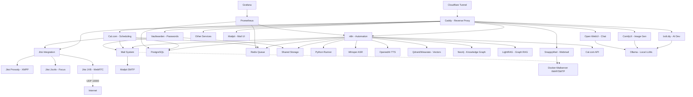

# 🚀 AI LaunchKit

<div align="center">

**Open-Source AI Development Toolkit**

*Deploy your complete AI stack in minutes, not weeks*

[](LICENSE)
[](https://github.com/freddy-schuetz/ai-launchkit)
[](https://github.com/freddy-schuetz/ai-launchkit)
[](https://github.com/freddy-schuetz/ai-launchkit/commits/main)
[](https://github.com/freddy-schuetz/ai-launchkit/graphs/contributors)

[](https://gdpr.eu/)
[](https://github.com/freddy-schuetz/ai-launchkit)
[](https://www.docker.com/)
[](https://github.com/freddy-schuetz/ai-launchkit)

[](https://github.com/kossakovsky/n8n-installer)

[Installation](#-quick-start) • [Features](#-whats-included) • [Documentation](#-services) • [Support](#common-issues)

German version: [German README](https://github.com/freddy-schuetz/ai-launchkit/blob/main/README_GERMAN.md)

</div>

---

## 🎯 What is AI LaunchKit?

AI LaunchKit is a comprehensive, self-hosted AI development environment that deploys **50+ pre-configured tools** with a single command. Build AI applications, automate workflows, generate images, and develop with AI assistance - all running on your own infrastructure.

Originally forked from [n8n-installer](https://github.com/kossakovsky/n8n-installer), AI LaunchKit has evolved into a complete AI development platform, maintained by [Friedemann Schuetz](https://www.linkedin.com/in/friedemann-schuetz).

### 🔒 Privacy-First & GDPR Compliant by Design

AI LaunchKit was built with **European data protection regulations** at its core. Unlike cloud AI services that send your data to US servers, everything runs on your infrastructure.

#### Why Self-Hosted AI Matters

| Challenge | Cloud AI Services | AI LaunchKit |
|-----------|-------------------|--------------|
| **Data Location** | USA, third-party servers | Your infrastructure, your country |
| **GDPR Compliance** | Complex DPAs, risk assessment | Compliant by design ✅ |
| **Costs** | €100-500+/month usage fees | €20-50/month (server only) |
| **API Limits** | Rate limits, token costs | Unlimited usage |
| **Vendor Lock-in** | Proprietary APIs | Open source, portable |
| **Offline Usage** | Internet required | Works offline ✅ |
| **Data Breaches** | Your data at risk | Air-gapped if needed |

#### 🇪🇺 Built for European Data Protection

| Regulation | How AI LaunchKit Helps |
|------------|------------------------|
| **GDPR Art. 5** (Data Minimization) | No data collection, no external storage |
| **GDPR Art. 25** (Privacy by Design) | Self-hosted architecture, no cloud dependencies |
| **GDPR Art. 32** (Security) | Full control over encryption, access, backups |
| **Schrems II** (Third-Country Transfers) | No US data transfers - host in EU |
| **BDSG** (German Federal Law) | Meets all German data protection requirements |

#### Perfect For

- 🏥 **Healthcare** - HIPAA/GDPR-compliant patient data processing
- 🏦 **Finance** - Sensitive financial data analysis without cloud exposure
- ⚖️ **Legal** - Attorney-client privilege with zero third-party access
- 🏛️ **Government** - Classified information processing on-premises
- 🇪🇺 **EU SMBs** - Privacy-first AI without expensive compliance consultants
- 🔐 **Privacy-Conscious** - Anyone who doesn't trust big tech with their data

### 🎬 Quick Demo

```bash
# One command to rule them all
git clone https://github.com/freddy-schuetz/ai-launchkit && cd ai-launchkit && sudo bash ./scripts/install.sh
```

**That's it!** Your AI development stack is ready in ~10-15 minutes (or several hours with optional workflow import).

**ATTENTION!** The AI LaunchKit is currently in development. It is regularly tested and updated. However, use is at your own risk!

---

## ✨ What's Included

### 📧 Mail System

| Tool | Description | Always Active | Purpose |
|------|-------------|---------------|----------|
| **[Mailpit](https://github.com/axllent/mailpit)** | Mail catcher with web UI Access: `mail.yourdomain.com` | ✅ Yes | Development/Testing - captures all emails |
| **[Docker-Mailserver](https://github.com/docker-mailserver/docker-mailserver)** | Production mail server | ⚡ Optional | Real email delivery for production |
| **[SnappyMail](https://github.com/the-djmaze/snappymail)** | Modern webmail client Access: `webmail.yourdomain.com` | ⚡ Optional | Web interface for Docker-Mailserver |

**Mail Configuration:**
- Mailpit automatically configured for all services (always active)
- Docker-Mailserver available for production email delivery (optional)
- SnappyMail provides a modern web interface for email access (optional, requires Docker-Mailserver)
- Web UI to view all captured emails
- Zero manual configuration needed!

### 🔧 Workflow Automation

| Tool | Description | Use Cases | Access |
|------|-------------|-----------|--------|
| **[n8n](https://github.com/n8n-io/n8n)** | Visual workflow automation platform | API integrations, data pipelines, business automation | `n8n.yourdomain.com` |
| **[n8n-MCP](https://github.com/czlonkowski/n8n-mcp)** | AI workflow generator for n8n | Claude/Cursor integration, 525+ node docs, workflow validation | `n8nmcp.yourdomain.com` |
| **[Webhook Tester](https://github.com/tarampampam/webhook-tester)** | Webhook debugging tool | Receive & inspect webhooks, debug n8n integrations, test external services | `webhook-test.yourdomain.com` |
| **[Hoppscotch](https://github.com/hoppscotch/hoppscotch)** | API testing platform | Test n8n webhook triggers, REST/GraphQL/WebSocket, team collaboration | `api-test.yourdomain.com` |
| **300+ Workflows** | Pre-built n8n templates | Email automation, social media, data sync, AI workflows | Imported on install |

### 🎯 User Interfaces

| Tool | Description | Use Cases | Access |
|------|-------------|-----------|--------|
| **[Open WebUI](https://github.com/open-webui/open-webui)** | ChatGPT-like interface for LLMs | AI chat, model switching, conversation management | `webui.yourdomain.com` |
| **[Postiz](https://github.com/gitroomhq/postiz-app)** | Social media management platform | Content scheduling, analytics, multi-platform posting | `postiz.yourdomain.com` |

### 📹 Video Conferencing

| Tool | Description | Use Cases | Access |
|------|-------------|-----------|--------|
| **[Jitsi Meet](https://github.com/jitsi/jitsi-meet)** ⚠️ | Professional video conferencing platform | Client meetings, team calls, webinars, Cal.com integration | `meet.yourdomain.com` |

**⚠️ Jitsi Meet Requirements:**
- **CRITICAL:** Requires UDP Port 10000 for WebRTC audio/video
- Many VPS providers block UDP traffic by default
- Without UDP 10000: Only chat works, no audio/video!
- Test UDP connectivity before production use
- Alternative: Use external services (Zoom, Google Meet) with Cal.com

### 📁 File & Document Management

| Tool | Description | Use Cases | Access |
|------|-------------|-----------|--------|
| **[Seafile](https://github.com/haiwen/seafile)** | Professional file sync & share platform | Team collaboration, file versioning, WebDAV, mobile sync | `files.yourdomain.com` |
| **[Paperless-ngx](https://github.com/paperless-ngx/paperless-ngx)** | Intelligent document management with OCR | Document archiving, AI auto-tagging, GDPR compliance, full-text search | `docs.yourdomain.com` |

### 💼 Business & Productivity

| Tool | Description | Use Cases | Access |
|------|-------------|-----------|--------|
| **[Cal.com](https://github.com/calcom/cal.com)** | Open-source scheduling platform | Meeting bookings, team calendars, payment integrations | `cal.yourdomain.com` |
| **[Vikunja](https://github.com/go-vikunja/vikunja)** | Modern task management platform | Kanban boards, Gantt charts, team collaboration, CalDAV | `vikunja.yourdomain.com` |
| **[Leantime](https://github.com/Leantime/leantime)** | Goal-oriented project management suite | ADHD-friendly PM, time tracking, sprints, strategy tools | `leantime.yourdomain.com` |
| **[Kimai](https://github.com/kimai/kimai)** | Professional time tracking | DSGVO-compliant billing, team timesheets, API, 2FA, invoicing | `time.yourdomain.com` |
| **[Invoice Ninja](https://github.com/invoiceninja/invoiceninja)** | Professional invoicing & payment platform | Multi-currency invoices, 40+ payment gateways, recurring billing, client portal | `invoices.yourdomain.com` |
| **[Baserow](https://github.com/bram2w/baserow)** | Airtable Alternative with real-time collaboration | Database management, project tracking, collaborative workflows | `baserow.yourdomain.com` |
| **[NocoDB](https://github.com/nocodb/nocodb)** | Open-source Airtable alternative with API & webhooks | Smart spreadsheet UI, realtime collaboration, automation | `nocodb.yourdomain.com` |
| **[Formbricks](https://github.com/formbricks/formbricks)** | Privacy-first survey platform | Customer feedback, NPS surveys, market research, form builder, GDPR-compliant | `forms.yourdomain.com` |
| **[Metabase](https://github.com/metabase/metabase)** | User-friendly business intelligence platform | No-code dashboards, automated reports, data exploration, team analytics | `analytics.yourdomain.com` |
| **[Odoo 18](https://github.com/odoo/odoo)** | Open Source ERP/CRM with AI features | Sales automation, inventory, accounting, AI lead scoring | `odoo.yourdomain.com` |
| **[Twenty CRM](https://github.com/twentyhq/twenty)** | Modern Notion-like CRM | Customer pipelines, GraphQL API, team collaboration, lightweight CRM for startups | `twenty.yourdomain.com` |
| **[EspoCRM](https://github.com/espocrm/espocrm)** | Full-featured CRM platform | Email campaigns, workflow automation, advanced reporting, role-based access | `espocrm.yourdomain.com` |
| **[Mautic](https://github.com/mautic/mautic)** | Marketing automation platform | Lead scoring, email campaigns, landing pages, multi-channel marketing, automation workflows | `mautic.yourdomain.com` |

### 🎨 AI Content Generation

| Tool | Description | Use Cases | Access |
|------|-------------|-----------|--------|
| **[ComfyUI](https://github.com/comfyanonymous/ComfyUI)** | Node-based Stable Diffusion interface | Image generation, AI art, photo editing, workflows | `comfyui.yourdomain.com` |

### 💻 AI-Powered Development / Vibe Coding

| Tool | Description | Use Cases | Access |
|------|-------------|-----------|--------|
| **[bolt.diy](https://github.com/stackblitz-labs/bolt.diy)** | Build full-stack apps with prompts | Rapid prototyping, MVP creation, learning to code | `bolt.yourdomain.com` |
| **[OpenUI](https://github.com/wandb/openui)** 🧪 | AI-powered UI component generation | Design systems, component libraries, mockups | `openui.yourdomain.com` |

### 🤖 AI Agents

| Tool | Description | Use Cases | Access |
|------|-------------|-----------|--------|
| **[Flowise](https://github.com/FlowiseAI/Flowise)** | Visual AI agent builder | Chatbots, customer support, AI workflows | `flowise.yourdomain.com` |
| **[LiveKit](https://github.com/livekit/livekit)** + Agents | Real-time voice agents with WebRTC (auto-uses Whisper/TTS/Ollama or OpenAI) | AI voice assistants, conversational AI, ChatGPT-like voice bots, requires UDP 50000-50100 | `livekit.yourdomain.com` |
| **[Dify](https://github.com/langgenius/dify)** | LLMOps platform for AI apps | Production AI apps, model management, prompt engineering | `dify.yourdomain.com` |
| **[Letta](https://github.com/letta-ai/letta)** | Stateful agent server | Persistent AI assistants, memory management | `letta.yourdomain.com` |
| **[Browser-use](https://github.com/browser-use/browser-use)** | LLM-powered browser control | Web scraping, form filling, automated testing | Internal API only |
| **[Skyvern](https://skyvern.com)** | Vision-based browser automation | Complex web tasks, CAPTCHA handling, dynamic sites | Internal API only |
| **[Browserless](https://browserless.io)** | Headless Chrome service | Puppeteer/Playwright hub, PDF generation, screenshots | Internal WebSocket |

### 📚 RAG Systems

| Tool | Description | Use Cases | Access |
|------|-------------|-----------|--------|
| **[RAGApp](https://github.com/ragapp/ragapp)** | Build RAG assistants over your data | Knowledge bases, document Q&A, research tools | `ragapp.yourdomain.com` |
| **[Qdrant](https://github.com/qdrant/qdrant)** | High-performance vector database | Semantic search, recommendations, RAG storage | `qdrant.yourdomain.com` |
| **[Weaviate](https://github.com/weaviate/weaviate)** | AI-native vector database | Hybrid search, multi-modal data, GraphQL API | `weaviate.yourdomain.com` |

### 🎙️ Speech, Language & Text Processing

| Tool | Description | Use Cases | Access |
|------|-------------|-----------|--------|
| **[Faster-Whisper](https://github.com/SYSTRAN/faster-whisper)** | OpenAI-compatible Speech-to-Text | Transcription, voice commands, meeting notes | Internal API |
| **[OpenedAI-Speech](https://github.com/matatonic/openedai-speech)** | OpenAI-compatible Text-to-Speech | Voice assistants, audiobooks, notifications | Internal API |
| **[TTS Chatterbox](https://github.com/resemble-ai/chatterbox)** | State-of-the-art TTS with emotion control & voice cloning | AI voices with emotional expression, voice synthesis, outperforms ElevenLabs | `chatterbox.yourdomain.com` |
| **[LibreTranslate](https://github.com/LibreTranslate/LibreTranslate)** | Self-hosted translation API | 50+ languages, document translation, privacy-focused | `translate.yourdomain.com` |
| **OCR Bundle: [Tesseract](https://github.com/tesseract-ocr/tesseract) & [EasyOCR](https://github.com/JaidedAI/EasyOCR)** | Dual OCR engines: Tesseract (fast) + EasyOCR (quality) | Text extraction from images/PDFs, receipt scanning, document digitization | Internal API |
| **[Scriberr](https://github.com/rishikanthc/Scriberr)** | AI audio transcription with WhisperX & speaker diarization | Meeting transcripts, podcast processing, call recordings, speaker identification | `scriberr.yourdomain.com` |
| **[Vexa](https://github.com/Vexa-ai/vexa)** | Real-time meeting transcription API | Live transcription for Google Meet & Teams, speaker identification, 99 languages, n8n integration | Internal API |

*If you have troubles installing or updating Vexa, please view this guide:* **[Vexa Workaround](https://github.com/freddy-schuetz/ai-launchkit/blob/main/vexa-troubleshooting-workarounds.md)**

### 🔍 Search & Web Data

| Tool | Description | Use Cases | Access |
|------|-------------|-----------|--------|
| **[SearXNG](https://github.com/searxng/searxng)** | Privacy-respecting metasearch engine | Web search for agents, no tracking, multiple sources | `searxng.yourdomain.com` |
| **[Perplexica](https://github.com/ItzCrazyKns/Perplexica)** | Open-source AI-powered search engine | Deep research, academic search, Perplexity AI alternative | `perplexica.yourdomain.com` |
| **[Crawl4Ai](https://github.com/unclecode/crawl4ai)** | AI-optimized web crawler | Web scraping, data extraction, site monitoring | Internal API |
| **[GPT Researcher](https://github.com/assafelovic/gpt-researcher)** | Autonomous research agent (2000+ word reports) | Comprehensive research reports, multi-source analysis, citations | `research.yourdomain.com` |
| **[Local Deep Research](https://github.com/langchain-ai/local-deep-researcher)** | LangChain's iterative deep research (~95% accuracy) | Fact-checking, detailed analysis, research loops with reflection | Internal API |
| **[Open Notebook](https://github.com/lfnovo/open-notebook)** | AI-powered knowledge management & research platform | NotebookLM alternative, multi-modal content, podcast generation, 16+ AI models | `notebook.yourdomain.com` |

### 🧠 Knowledge Graphs

| Tool | Description | Use Cases | Access |
|------|-------------|-----------|--------|
| **[Neo4j](https://github.com/neo4j/neo4j)** | Graph database platform | Knowledge graphs, entity relationships, fraud detection, recommendations | `neo4j.yourdomain.com` |
| **[LightRAG](https://github.com/HKUDS/LightRAG)** | Graph-based RAG with entity extraction | Automatic knowledge graph creation, relationship mapping, complex queries | `lightrag.yourdomain.com` |

### 🎬 Media Processing Suite

Pre-installed in the n8n container for seamless media manipulation:

| Tool | Description | Use Cases |
|------|-------------|-----------|
| **[FFmpeg](https://github.com/FFmpeg/FFmpeg)** | Industry-standard multimedia framework | Video conversion, streaming, audio extraction |
| **[ImageMagick](https://github.com/ImageMagick/ImageMagick)** | Image manipulation toolkit | Format conversion, resizing, effects, thumbnails |
| **[ExifTool](https://github.com/exiftool/exiftool)** | Metadata management | Read/write EXIF, IPTC, XMP metadata |
| **[MediaInfo](https://github.com/MediaArea/MediaInfo)** | Media file analyzer | Codec detection, bitrate analysis, format info |
| **[SoX](http://sox.sourceforge.net/)** | Sound processing utility | Audio format conversion, effects, resampling |
| **[Ghostscript](https://github.com/ArtifexSoftware/ghostscript)** | PDF/PostScript processor | PDF manipulation, conversion, optimization |
| **Python3 + Libraries** | Pillow, OpenCV, NumPy, Pandas | Image processing, data analysis, automation |

### 🗄️ Data Infrastructure

| Tool | Description | Use Cases | Access |
|------|-------------|-----------|--------|
| **[Supabase](https://github.com/supabase/supabase)** | Open-source Firebase alternative | Instant APIs, auth, realtime, storage, edge functions | `supabase.yourdomain.com` |
| **[PostgreSQL 17](https://www.postgresql.org/)** | Advanced relational database | Primary database for n8n, Cal.com, and other services | Internal only |
| **[Redis](https://github.com/redis/redis)** | In-memory data store | Queue management, caching, session storage | Internal only |

### ⚙️ System Management

| Tool | Description | Use Cases | Access |
|------|-------------|-----------|--------|
| **[Vaultwarden](https://github.com/dani-garcia/vaultwarden)** | Bitwarden-compatible password manager | Credential management, team password sharing, auto-fill | `vault.yourdomain.com` |
| **[Caddy](https://github.com/caddyserver/caddy)** | Automatic HTTPS reverse proxy | SSL certificates, load balancing, routing | Automatic |
| **[Cloudflare Tunnel](https://github.com/cloudflare/cloudflared)** | Secure tunnel without port forwarding | Zero-trust access, DDoS protection, firewall bypass | Optional |
| **[Python Runner](https://github.com/n8n-io/n8n)** | Isolated Python environment | Execute Python scripts from n8n workflows | Internal only |
| **[Grafana](https://github.com/grafana/grafana)** | Metrics visualization platform | System monitoring, performance dashboards, alerting | `grafana.yourdomain.com` |
| **[Prometheus](https://github.com/prometheus/prometheus)** | Metrics collection & alerting | Time-series database, service monitoring, resource tracking | Internal only |
| **[Uptime Kuma](https://github.com/louislam/uptime-kuma)** | Uptime monitoring & status pages | Service uptime tracking, public status pages, multi-protocol monitoring, 90+ notifications | `status.yourdomain.com` |
| **[Portainer](https://github.com/portainer/portainer)** | Docker management interface | Container monitoring, logs, restart services | `portainer.yourdomain.com` |

### 🧰 AI Support Tools

| Tool | Description | Use Cases | Access |
|------|-------------|-----------|--------|
| **[Ollama](https://github.com/ollama/ollama)** | Local LLM runtime | Run Llama, Mistral, Phi locally, API-compatible | `ollama.yourdomain.com` |
| **[Gotenberg](https://github.com/gotenberg/gotenberg)** | Universal document converter | HTML/Markdown → PDF, Office → PDF, merge PDFs | Internal API |
| **[Stirling-PDF](https://github.com/Stirling-Tools/Stirling-PDF)** | PDF toolkit | Split, merge, compress, OCR, sign PDFs | `pdf.yourdomain.com` |

### 🛡️ AI Security & Compliance

| Tool | Description | Use Cases | Access |
|------|-------------|-----------|--------|
| **[LLM Guard](https://github.com/protectai/llm-guard)** | Input/output filtering for LLMs | Prompt injection prevention, toxicity filtering, PII removal | Internal API |
| **[Microsoft Presidio](https://github.com/microsoft/presidio)** | PII detection & anonymization (English) | GDPR compliance, data protection, sensitive data handling | Internal API |
| **[Flair NER](https://github.com/flairNLP/flair)** | German PII detection | DSGVO compliance, German text processing, entity recognition | Internal API |

---

## 🚀 Quick Start

<details>
<summary><b>Installation</b></summary>

### Installation Command

```bash
git clone https://github.com/freddy-schuetz/ai-launchkit && cd ai-launchkit && sudo bash ./scripts/install.sh
```

### What the Installer Does

1. **Checks Prerequisites** - Verifies Docker, domain, and system requirements
2. **Configures Services** - Sets up environment variables and generates secure passwords
3. **Deploys Stack** - Starts all selected services with Docker Compose
4. **Obtains SSL Certificates** - Automatic HTTPS via Caddy
5. **Imports Workflows** - Optional: Downloads 300+ pre-built n8n templates
6. **Generates Report** - Provides access URLs and credentials

### After Installation

1. **Access n8n:** Navigate to `https://n8n.yourdomain.com`
2. **Create Admin Account:** First visitor becomes owner
3. **Configure API Keys:** Add OpenAI, Anthropic, Groq keys in `.env` file
4. **Explore Services:** Check the final report for all URLs and credentials
5. **Import Credentials to Vaultwarden:** Run `sudo bash ./scripts/download_credentials.sh`

### Installation Time

- **Base Installation:** 10-15 minutes
- **With Workflow Import:** +several hours (optional, depends on server speed)
- **Total:** 15 minutes to several hours depending on selections

**System Requirements:**
- 4GB RAM minimum (8GB+ recommended)
- 40GB disk space (more for media/models)
- Ubuntu 22.04/24.04 or Debian 11/12
- Domain with wildcard DNS configured

</details>

<details>
<summary><b>Update</b></summary>

### Update Command

```bash
cd ai-launchkit && sudo bash ./scripts/update.sh
```

### What the Update Does

1. **Backs Up Data** - Creates automatic backups before updating
2. **Pulls Latest Changes** - Downloads newest version from GitHub
3. **Updates Docker Images** - Pulls latest container versions
4. **Restarts Services** - Applies updates with minimal downtime
5. **Verifies Health** - Checks that all services started correctly

### Update Time

- **Standard Update:** 5-10 minutes
- **Major Version:** 10-15 minutes
- **With PostgreSQL Migration:** 15-20 minutes

**Always backup before updating!** See detailed update guide below for backup commands.

</details>

---

## 📦 Installation - Detailed version

<details>
<summary><b>Click to expand detailed installation guide</b></summary>

### Prerequisites

Before installing AI LaunchKit, ensure you have:

1. **Server:** Ubuntu 22.04/24.04 or Debian 11/12 LTS
   - 4GB RAM minimum (8GB+ recommended for AI workloads)
   - 40GB+ disk space (SSD recommended)
   - Root or sudo access

2. **Domain:** A registered domain with wildcard DNS
   ```
   A *.yourdomain.com -> YOUR_SERVER_IP
   ```

3. **Access:** SSH access to your server

### Step-by-Step Installation

#### Step 1: Connect to Your Server

```bash
# Connect via SSH
ssh root@YOUR_SERVER_IP

# Or with key authentication
ssh -i ~/.ssh/your-key.pem user@YOUR_SERVER_IP
```

#### Step 2: Clone Repository

```bash
# Clone AI LaunchKit
git clone https://github.com/freddy-schuetz/ai-launchkit

# Navigate into directory
cd ai-launchkit
```

#### Step 3: Run Installer

```bash
# Start installation wizard
sudo bash ./scripts/install.sh
```

#### Step 4: Answer Installation Prompts

The installer will ask you for:

**1. Domain Name:**
```
Enter your domain (e.g., example.com): yourdomain.com
```

**2. Email Address:**
```
Enter email for SSL certificates: admin@yourdomain.com
```

**3. API Keys (Optional):**
```
Enter OpenAI API key (or press Enter to skip): sk-...
Enter Anthropic API key (or press Enter to skip): sk-ant-...
Enter Groq API key (or press Enter to skip): gsk_...
```

**4. Community Workflows (Optional):**
```
Import 300+ n8n community workflows? [y/N]: y
```
**Note: This can take several hours depending on your server speed!**

**5. Worker Configuration:**
```
How many n8n workers? (1-4): 2
```

**6. Service Selection:**
```
Install Docker-Mailserver for production email? [y/N]: n
Install SnappyMail webmail client? [y/N]: n
Install Jitsi Meet? [y/N]: y
... (and more services)
```

#### Step 5: Installation Progress

The installer will now:
1. ✅ Install Docker and Docker Compose
2. ✅ Generate secure passwords
3. ✅ Configure services
4. ✅ Start Docker containers
5. ✅ Request SSL certificates
6. ✅ Import workflows (if selected)
7. ✅ Generate final report

💡 **Tip:** If you encounter Docker Hub rate limit errors (`toomanyrequests: Rate exceeded`) during installation/update, run `docker login` first (free account required) - this gives you individual rate limits instead of sharing with all VPS users, significantly reducing timeout issues. If that doesn't work, I recommend not installing all services with one installation, but only a maximum of 15-20 at first and then gradually installing the others via updates!

#### Step 6: Save Installation Report

At the end, you'll see:

```
================================
Installation Complete! 🎉
================================

Access URLs:
  n8n: https://n8n.yourdomain.com
  bolt.diy: https://bolt.yourdomain.com
  Mailpit: https://mail.yourdomain.com
  ... (more services)

Download credentials with:
sudo bash ./scripts/download_credentials.sh
```

**Important:** Save the installation output - it contains all passwords!

### Post-Installation Steps

#### First Login to Services

**n8n (Workflow Automation):**
1. Open `https://n8n.yourdomain.com`
2. First visitor creates owner account
3. Choose strong password (min 8 characters)
4. Setup complete!

**Vaultwarden (Password Manager):**
1. Open `https://vault.yourdomain.com`
2. Click "Create Account"
3. Set master password (very strong!)
4. Import AI LaunchKit credentials:
   ```bash
   sudo bash ./scripts/download_credentials.sh
   ```
5. Download JSON file and import in Vaultwarden

**Other Services:**
- Most services: First user = admin
- Some require credentials from `.env` file
- Check the installation output or `.env` file for credentials

#### Configure API Keys (Optional)

If you skipped API keys during installation:

```bash
# Edit environment file
nano .env

# Add your keys:
OPENAI_API_KEY=sk-your-key-here
ANTHROPIC_API_KEY=sk-ant-your-key-here
GROQ_API_KEY=gsk_your-key-here

# Save and exit (Ctrl+X, Y, Enter)

# Apply changes
docker compose restart
```

#### DNS Verification

Ensure your domains are resolving correctly:

```bash
# Test DNS resolution
nslookup n8n.yourdomain.com
nslookup bolt.yourdomain.com

# Test HTTPS access
curl -I https://n8n.yourdomain.com
# Should return: HTTP/2 200
```

#### Firewall Check

Verify firewall rules are correct:

```bash
sudo ufw status

# Should show:
# 22/tcp                     ALLOW       Anywhere
# 80/tcp                     ALLOW       Anywhere
# 443/tcp                    ALLOW       Anywhere
```

### Optional: Docker-Mailserver Setup

If you selected Docker-Mailserver for production email:

#### Add Email Accounts

```bash
# Create first email account
docker exec -it mailserver setup email add admin@yourdomain.com

# Create additional accounts
docker exec -it mailserver setup email add noreply@yourdomain.com
docker exec -it mailserver setup email add support@yourdomain.com

# List all accounts
docker exec mailserver setup email list
```

#### Configure DNS for Email

**Required DNS Records:**

```
# MX Record
Type: MX
Name: @
Value: mail.yourdomain.com
Priority: 10

# A Record for mail
Type: A  
Name: mail
Value: YOUR_SERVER_IP

# SPF Record
Type: TXT
Name: @
Value: v=spf1 mx ~all

# DMARC Record
Type: TXT
Name: _dmarc
Value: v=DMARC1; p=none; rua=mailto:postmaster@yourdomain.com
```

#### Generate DKIM Keys

```bash
# Generate DKIM signature
docker exec mailserver setup config dkim

# Get public key for DNS
docker exec mailserver cat /tmp/docker-mailserver/opendkim/keys/yourdomain.com/mail.txt

# Add as TXT record:
# Name: mail._domainkey
# Value: (paste the key from above)
```

### Troubleshooting Installation

#### Services Won't Start

```bash
# Check Docker is running
sudo systemctl status docker

# Check specific service logs
docker compose logs [service-name] --tail 50

# Common issues:
# - Not enough RAM: Reduce services or upgrade server
# - Port conflicts: Check if ports 80/443 are free
# - DNS not ready: Wait 15 minutes for propagation
```

#### SSL Certificate Errors

```bash
# Caddy might take a few minutes to get certificates
# Check Caddy logs:
docker compose logs caddy --tail 50

# If problems persist:
# 1. Verify DNS is correct
# 2. Check firewall allows 80/443
# 3. Restart Caddy
docker compose restart caddy
```

#### Docker Issues

```bash
# Restart Docker daemon
sudo systemctl restart docker

# Reset Docker network (if needed)
docker network prune -f

# Restart all services
cd ai-launchkit
docker compose restart
```

</details>

---

## 🔄 Update - Detailed version

<details>
<summary><b>Click to expand detailed update guide</b></summary>

### When to Update

Update AI LaunchKit when:
- New features are released
- Security patches are available
- Bug fixes are published
- You want the latest service versions

**Check for updates:**
```bash
cd ai-launchkit
git fetch origin
git log HEAD..origin/main --oneline
```

### Backup Before Update

**CRITICAL:** Always backup before updating!

```bash
# Navigate to AI LaunchKit
cd ai-launchkit

# Backup all Docker volumes
tar czf backup-$(date +%Y%m%d).tar.gz \
  /var/lib/docker/volumes/localai_*

# Backup PostgreSQL database
docker exec postgres pg_dumpall -U postgres > backup-$(date +%Y%m%d).sql

# Backup .env file
cp .env .env.backup

# Backup Docker Compose
cp docker-compose.yml docker-compose.yml.backup
```

**Move backups to safe location:**
```bash
# Create backup directory
mkdir -p ~/ai-launchkit-backups

# Move backups
mv backup-*.tar.gz ~/ai-launchkit-backups/
mv backup-*.sql ~/ai-launchkit-backups/

# Verify backups exist
ls -lh ~/ai-launchkit-backups/
```

### Update Procedure

#### Standard Update Process

```bash
# 1. Navigate to AI LaunchKit
cd ai-launchkit

# 2. Run update script
sudobash ./scripts/update.sh

💡 **Tip:** If you encounter Docker Hub rate limit errors (`toomanyrequests: Rate exceeded`) during installation/update, run `docker login` first (free account required) - this gives you individual rate limits instead of sharing with all VPS users, significantly reducing timeout issues. If that doesn't work, I recommend not installing all services with one installation, but only a maximum of 15-20 at first and then gradually installing the others via updates!

# 3. Check service status
docker compose ps

# 4. Monitor logs for issues
docker compose logs -f --tail 100
```

### PostgreSQL Version Handling

**Important:** AI LaunchKit pins PostgreSQL to version 17 to prevent automatic upgrades.

#### Check Current PostgreSQL Version

```bash
docker exec postgres postgres --version
```

#### If You Have PostgreSQL 18

If you installed after September 26, 2025 and have PostgreSQL 18:

```bash
# Pin to PostgreSQL 18 in .env
echo "POSTGRES_VERSION=18" >> .env

# Update safely
bash scripts/update.sh
```

#### If You Experience Database Errors

If you see "database files are incompatible" errors:

<details>
<summary><b>Emergency Recovery Steps</b></summary>

```bash
# 1. BACKUP YOUR DATA (CRITICAL!)
docker exec postgres pg_dumpall -U postgres > emergency-backup.sql

# 2. Stop all services
docker compose down

# 3. Remove incompatible volume
docker volume rm localai_postgres_data

# 4. Pull latest fixes
git pull

# 5. Start PostgreSQL (now pinned to v17)
docker compose up -d postgres
sleep 10

# 6. Restore your data
docker exec -i postgres psql -U postgres < emergency-backup.sql

# 7. Start all services
docker compose up -d
```

</details>

#### Version Verification

After update, verify versions:

```bash
docker exec postgres postgres --version
# Should show: PostgreSQL 17.x or 18.x (if pinned)
```

### Post-Update Verification

#### Check Service Status

```bash
# View all services
docker compose ps

# All should show: STATUS = Up
# If any show "Restarting" wait 2-3 minutes, then check logs:
docker compose logs [service-name] --tail 50
```

#### Test Key Services

**n8n:**
```bash
curl -I https://n8n.yourdomain.com
# Should return: HTTP/2 200
```

**Database:**
```bash
docker exec postgres pg_isready -U postgres
# Should return: accepting connections
```

**Redis:**
```bash
docker exec redis redis-cli ping
# Should return: PONG
```

#### Monitor Resource Usage

```bash
# Check memory and CPU
docker stats --no-stream

# Check disk space
df -h
```

#### Verify Workflows Still Run

1. Open n8n: `https://n8n.yourdomain.com`
2. Open a test workflow
3. Click "Execute Workflow"
4. Verify it completes successfully

### Rollback Procedure

If the update causes issues, rollback to the previous version:

#### Quick Rollback

```bash
# 1. Navigate to AI LaunchKit
cd ai-launchkit

# 2. View commit history
git log --oneline -10

# 3. Rollback to previous commit
git reset --hard [previous-commit-hash]

# 4. Restore .env if needed
cp .env.backup .env

# 5. Restart with old version
docker compose down
docker compose up -d
```

#### Full Rollback with Data Restore

```bash
# 1. Stop services
docker compose down

# 2. Restore volumes from backup
tar xzf volumes-backup-YYYYMMDD.tar.gz

# 3. Restore PostgreSQL
docker compose up -d postgres
sleep 10
docker exec -i postgres psql -U postgres < backup-YYYYMMDD.sql

# 4. Start all services
docker compose up -d
```

### Service-Specific Updates

Some services may require additional steps:

#### ComfyUI Models

```bash
# Models are not automatically updated
# To update models, manually download new versions to:
/var/lib/docker/volumes/localai_comfyui_data/_data/models/
```

#### Ollama Models

```bash
# Update installed models
docker exec ollama ollama pull llama3.2
docker exec ollama ollama pull mistral
```

#### n8n Community Nodes

```bash
# Update community nodes
docker exec n8n npm update -g n8n

# Restart n8n
docker compose restart n8n
```

#### Supabase

```bash
# Supabase has multiple components
# All update together with docker compose pull
docker compose pull supabase-kong supabase-auth supabase-rest supabase-storage
docker compose up -d supabase-kong supabase-auth supabase-rest supabase-storage
```

### Update Troubleshooting

#### Services Won't Start After Update

```bash
# Check logs for specific error
docker compose logs [service-name] --tail 100

# Common fixes:
# 1. Recreate service
docker compose up -d --force-recreate [service-name]

# 2. Clear cache and restart
docker compose down
docker system prune -f
docker compose up -d

# 3. Restore from backup if needed
```

#### Database Connection Errors

```bash
# PostgreSQL not starting
docker compose logs postgres --tail 100

# Common causes:
# - Incompatible data format (see PostgreSQL section)
# - Corrupted data (restore from backup)
# - Insufficient disk space (check with df -h)
```

#### Port Conflicts After Update

```bash
# Check what's using the port
sudo lsof -i :80
sudo lsof -i :443

# Stop conflicting service
sudo systemctl stop [service-name]

# Or change port in .env
nano .env
# Change PORT_VARIABLE to different port
```

#### Missing Environment Variables

```bash
# Compare with .env.example
diff .env .env.example

# Add any missing variables
nano .env

# Restart services
docker compose restart
```

### Maintenance Updates

#### Regular Maintenance

```bash
# Clean up old Docker resources (monthly)
docker system prune -af --volumes

# Update system packages (monthly)
sudo apt update && sudo apt upgrade -y

# Check disk space (weekly)
df -h
docker system df
```

#### Security Updates

```bash
# Update OS security patches
sudo apt update
sudo apt upgrade -y

# Update Docker
sudo apt install docker-ce docker-ce-cli containerd.io

# Restart Docker daemon
sudo systemctl restart docker

# Restart all services
docker compose restart
```

### Update Best Practices

1. **Always Backup First** - Cannot stress this enough
2. **Test in Staging** - If you have a test environment
3. **Read Changelogs** - Know what's changing
4. **Update Off-Peak** - Minimize user impact
5. **Monitor After Update** - Watch logs for 24 hours
6. **Keep Backups** - Retain last 3-5 backups
7. **Document Changes** - Note what was updated and when

### Update Notifications

Stay informed about updates:

- **Watch GitHub Repository**: Get notifications for new releases
- **Join Community Forum**: [oTTomator Think Tank](https://thinktank.ottomator.ai/c/local-ai/18)
- **Discord** *(coming soon)*: Real-time update announcements

### Getting Help with Updates

If you encounter issues:

1. **Check Logs**: `docker compose logs [service]`
2. **Search Issues**: [GitHub Issues](https://github.com/freddy-schuetz/ai-launchkit/issues)
3. **Community Forum**: Ask for help
4. **Rollback**: Use the procedure above if needed

</details>

---

**Next Steps:** After updating, explore the [Services section](#-services) for new features in each tool.

---

## 📧 Services

📚 **For detailed service documentation, setup guides, n8n integration examples, and troubleshooting, see [README_Services.md](README_Services.md)**

---

## 💡 Support & FAQ

### Common Issues

<details>
<summary><b>🚨 502 Bad Gateway Errors</b></summary>

502 errors typically indicate that Caddy (the reverse proxy) cannot reach the backend service. This is one of the most common issues, especially during initial setup or when running many services.

### Quick Diagnosis

1. **Check which containers are actually running:**
   ```bash
   docker ps -a
   ```
   Look for containers with status "Exited" or "Restarting"

2. **Check system resources:**
   ```bash
   # RAM usage
   free -h
   
   # CPU usage
   htop
   
   # Disk space
   df -h
   ```

3. **Check specific service logs:**
   ```bash
   # For the failing service (replace SERVICE_NAME)
   docker logs [SERVICE_NAME] --tail 100
   
   # For Caddy (reverse proxy)
   docker logs caddy --tail 50
   ```

### Common Causes and Solutions

#### 1. Services Failed to Start (Most Common)

**Symptoms:**
- Service container shows "Exited" status
- Caddy logs show "dial tcp: connection refused"

**Solutions:**
```bash
# Check why the service crashed
docker logs [SERVICE_NAME] --tail 200

# Try restarting the service
docker compose restart [SERVICE_NAME]

# If it keeps crashing, check the .env file for missing variables
nano .env
```

#### 2. Insufficient RAM/Resources

**Symptoms:**
- High memory usage (>90% in `free -h`)
- OOMKiller messages in logs
- Multiple services crashing

**Solutions:**
```bash
# Add swap space (temporary fix)
sudo fallocate -l 4G /swapfile
sudo chmod 600 /swapfile
sudo mkswap /swapfile
sudo swapon /swapfile

# Reduce number of running services
docker compose stop [SERVICE_NAME]

# Or upgrade your VPS (permanent solution)
```

#### 3. Long Startup Times

**Symptoms:**
- Service works after 5-10 minutes
- Container is running but not ready
- Especially common with: Supabase, Dify, ComfyUI, Cal.com

**Solution:**
```bash
# Be patient - some services need time to initialize
# Check progress with:
docker logs [SERVICE_NAME] --follow

# For Cal.com, first build can take 10-15 minutes
# For n8n with workflows import, this can take 30+ minutes
```

#### 4. Port Conflicts

**Symptoms:**
- "bind: address already in use" in logs
- Service can't start on its configured port

**Solutions:**
```bash
# Find what's using the port
sudo lsof -i :PORT_NUMBER

# Edit .env to use a different port
nano .env
# Change PORT_NAME=8080 to PORT_NAME=8081

# Restart services
docker compose down
docker compose up -d
```

#### 5. Network Issues

**Symptoms:**
- Services can't communicate internally
- "no such host" errors in logs

**Solutions:**
```bash
# Recreate Docker network
docker compose down
docker network prune
docker compose up -d

# Verify network connectivity
docker exec caddy ping [SERVICE_NAME]
```

#### 6. Database Connection Issues

**Symptoms:**
- Services depending on PostgreSQL fail
- "connection refused" to postgres:5432

**Solutions:**
```bash
# Check if PostgreSQL is running
docker ps | grep postgres

# Check PostgreSQL logs
docker logs postgres --tail 100

# Ensure password doesn't contain special characters like @
# Edit .env and regenerate if needed
```

### Service-Specific 502 Issues

**n8n:**
```bash
# Often caused by workflow import hanging
# Solution: Skip workflows initially
docker compose stop n8n
# Edit .env: set IMPORT_WORKFLOWS=false
docker compose up -d n8n
```

**Supabase:**
```bash
# Complex service with many components
# Check each component:
docker ps | grep supabase
# Kong (API Gateway) must be healthy
docker logs supabase-kong --tail 50
```

**Cal.com:**
```bash
# Long build time on first start
# Check build progress:
docker logs calcom --follow
# Can take 10-15 minutes for initial build
```

**bolt.diy:**
```bash
# Requires proper hostname configuration
# Verify in .env:
grep BOLT_HOSTNAME .env
# Should match your domain
```

### Prevention Tips

1. **Start with minimal services:**
   - Begin with just n8n
   - Add services gradually
   - Monitor resources after each addition

2. **Check requirements before installation:**
   - Each service adds ~200-500MB RAM usage
   - Some services (ComfyUI, Dify, Cal.com) need 1-2GB alone

3. **Use monitoring:**
   ```bash
   # Watch resources in real-time
   docker stats
   
   # Set up alerts with Grafana (if installed)
   ```

4. **Regular maintenance:**
   ```bash
   # Clean up unused Docker resources
   docker system prune -a
   
   # Check logs regularly
   docker compose logs --tail 100
   ```

### Still Getting 502 Errors?

If problems persist after trying these solutions:

1. **Collect diagnostic information:**
   ```bash
   # Save all container statuses
   docker ps -a > docker_status.txt
   
   # Save resource usage
   free -h > memory_status.txt
   df -h > disk_status.txt
   
   # Save logs of failing service
   docker logs [SERVICE_NAME] > service_logs.txt 2>&1
   
   # Save Caddy logs
   docker logs caddy > caddy_logs.txt 2>&1
   ```

2. **Create a GitHub issue with:**
   - Your VPS specifications
   - Services selected during installation
   - The diagnostic files above
   - Specific error messages

3. **Quick workaround:**
   - Access services directly via ports (bypass Caddy)
   - Example: `http://YOUR_IP:5678` instead of `https://n8n.yourdomain.com`
   - Note: This bypasses SSL, use only for testing

</details>

<details>
<summary><b>📧 Mail System Issues</b></summary>

AI LaunchKit includes Mailpit (always active), optional Docker-Mailserver (production), and SnappyMail (webmail). Here's how to troubleshoot common email issues.

### Mailpit Issues

#### Emails Not Appearing in Mailpit

**Symptom:** Emails sent from services don't appear in Mailpit UI

**Solutions:**
```bash
# 1. Check if Mailpit is running
docker ps | grep mailpit

# 2. Check Mailpit logs
docker logs mailpit --tail 50

# 3. Test SMTP connectivity from n8n
docker exec n8n nc -zv mailpit 1025

# Should return: Connection successful

# 4. Verify environment variables
grep "SMTP_\|MAIL" .env

# 5. Test email from command line
docker exec mailpit nc localhost 1025 << EOF
HELO test
MAIL FROM:<test@example.com>
RCPT TO:<user@example.com>
DATA
Subject: Test Email
This is a test
.
QUIT
EOF

# 6. Check Mailpit Web UI
curl -I https://mail.yourdomain.com
```

#### Mailpit Web UI Not Accessible

**Symptom:** Cannot access `https://mail.yourdomain.com`

**Solutions:**
```bash
# 1. Check Caddy logs
docker logs caddy | grep mailpit

# 2. Restart Mailpit container
docker compose restart mailpit

# 3. Clear browser cache
# CTRL+F5 or use incognito mode

# 4. Check DNS resolution
nslookup mail.yourdomain.com
# Should return your server IP

# 5. Test local access
curl http://localhost:8025
```

#### Service Cannot Send Emails to Mailpit

**Symptom:** Service shows SMTP errors in logs

**Solutions:**
```bash
# 1. Check service SMTP settings
docker exec [service-name] env | grep SMTP

# Should show: SMTP_HOST=mailpit, SMTP_PORT=1025

# 2. Check Docker network
docker network inspect ai-launchkit_default | grep mailpit

# 3. Test connection from service container
docker exec [service-name] nc -zv mailpit 1025

# 4. Check service logs for SMTP errors
docker logs [service-name] | grep -i "mail\|smtp"

# 5. Restart service
docker compose restart [service-name]
```

### Docker-Mailserver Issues

#### Emails Not Being Delivered

**Symptom:** Real emails not sent when Docker-Mailserver configured

**Solutions:**
```bash
# 1. Check if Docker-Mailserver is running
docker ps | grep mailserver

# 2. Check Docker-Mailserver logs
docker logs mailserver --tail 100

# 3. Verify DNS records (CRITICAL!)
nslookup -type=MX yourdomain.com
nslookup -type=TXT yourdomain.com  # SPF record
nslookup mail.yourdomain.com

# 4. Test authentication
docker exec mailserver doveadm auth test noreply@yourdomain.com [password]

# 5. Check mail queue
docker exec mailserver postqueue -p

# 6. Verify DKIM configuration
docker exec mailserver setup config dkim status

# 7. Test outbound mail delivery
echo "Test email body" | docker exec -i mailserver mail -s "Test Subject" test@gmail.com
```

#### SMTP Authentication Fails

**Symptom:** Services cannot authenticate to Docker-Mailserver

**Solutions:**
```bash
# 1. Check account exists
docker exec mailserver setup email list

# 2. Test authentication manually
docker exec mailserver doveadm auth test noreply@yourdomain.com [password]

# 3. Verify password in .env
grep MAIL_NOREPLY_PASSWORD .env

# 4. Reset password if needed
docker exec mailserver setup email update noreply@yourdomain.com [new-password]

# 5. Restart mailserver
docker compose restart mailserver
```

#### Emails Landing in Spam

**Symptom:** Sent emails go to recipient's spam folder

**Solutions:**
```bash
# 1. Check DKIM, SPF, DMARC configuration
# Use online tools: https://mxtoolbox.com/

# 2. Verify DKIM is working
docker exec mailserver opendkim-testkey -d yourdomain.com -s mail -vvv

# 3. Check IP reputation
# Use: https://multirbl.valli.org/

# 4. Verify reverse DNS (PTR record)
dig -x YOUR_SERVER_IP

# 5. Check Rspamd logs
docker logs mailserver | grep -i rspamd

# 6. Test email deliverability
# Use: https://www.mail-tester.com/
```

#### Docker-Mailserver Won't Start

**Symptom:** mailserver container exits immediately

**Solutions:**
```bash
# 1. Check logs for specific error
docker logs mailserver --tail 200

# 2. Check volumes
docker volume ls | grep mailserver

# 3. Check ports (25, 465, 587, 993)
sudo netstat -tulpn | grep -E "25|465|587|993"

# 4. Verify .env configuration
grep -E "MAIL_|SMTP_" .env

# 5. Recreate container
docker compose down mailserver
docker compose up -d --force-recreate mailserver
```

### SnappyMail Issues

#### Cannot Access SnappyMail

**Symptom:** `https://webmail.yourdomain.com` not accessible

**Solutions:**
```bash
# 1. Check if SnappyMail is running
docker ps | grep snappymail

# 2. Get admin password
docker exec snappymail cat /var/lib/snappymail/_data_/_default_/admin_password.txt

# 3. Check logs
docker logs snappymail --tail 50

# 4. Verify Docker-Mailserver connection
docker exec snappymail nc -zv mailserver 143
docker exec snappymail nc -zv mailserver 587

# 5. Restart if needed
docker compose restart snappymail
```

#### Users Cannot Login to SnappyMail

**Symptom:** Login fails with authentication error

**Solutions:**
1. **Ensure domain is configured in admin panel:**
   - Access `https://webmail.yourdomain.com/?admin`
   - Check if your domain is added
   - Verify IMAP/SMTP settings point to `mailserver`

2. **Verify user account exists in Docker-Mailserver:**
   ```bash
   docker exec mailserver setup email list
   ```

3. **Test authentication:**
   ```bash
   docker exec mailserver doveadm auth test user@yourdomain.com [password]
   ```

4. **Check SnappyMail domain configuration:**
   - Admin Panel → Domains
   - IMAP: mailserver:143 (STARTTLS)
   - SMTP: mailserver:587 (STARTTLS)

### n8n Send Email Node Issues

#### Send Email Node Fails

**Symptom:** n8n Send Email node shows connection error

**Solution for Mailpit (Development):**

Create new SMTP credential in n8n:
- Host: `mailpit` (not localhost!)
- Port: `1025`
- User: `admin`
- Password: `admin`
- SSL/TLS: **OFF**
- Sender Email: `noreply@yourdomain.com`

**Solution for Docker-Mailserver (Production):**

Create new SMTP credential in n8n:
- Host: `mailserver`
- Port: `587`
- User: `noreply@yourdomain.com`
- Password: Check `.env` file for `MAIL_NOREPLY_PASSWORD`
- SSL/TLS: **STARTTLS**
- Sender Email: `noreply@yourdomain.com`

**Test with simple workflow:**
```javascript
Manual Trigger → Send Email → Set recipient to test@example.com
```

### General Mail Troubleshooting

**Check mail flow:**
```bash
# 1. Service → Mailpit/Mailserver
docker logs [service-name] | grep -i smtp

# 2. Mailpit → Web UI
curl http://localhost:8025/api/v1/messages

# 3. Docker-Mailserver → External
docker exec mailserver postqueue -p
docker logs mailserver | grep "status=sent"
```

**Verify configuration:**
```bash
# Check which mail system is active
grep MAIL_MODE .env

# For Mailpit (default):
# MAIL_MODE=mailpit

# For Docker-Mailserver:
# MAIL_MODE=mailserver
```

**Reset mail configuration:**
```bash
# Stop mail services
docker compose stop mailpit mailserver snappymail

# Clear mail queue (if Docker-Mailserver)
docker exec mailserver postsuper -d ALL

# Restart mail services
docker compose up -d mailpit mailserver snappymail
```

</details>

<details>
<summary><b>🐳 Docker & Network Issues</b></summary>

### VPN Conflicts

**Symptoms:**
- Unable to download Docker images during installation
- "no route to host" errors
- Timeout errors when pulling images

**Solution:**
```bash
# Temporarily disable VPN during installation/updates
sudo systemctl stop openvpn
# Or disconnect VPN in your VPN client

# Perform installation or update
./install.sh
# or
./update.sh

# Re-enable VPN after completion
```

### Container Name Conflicts

**Symptoms:**
- "Container name already in use" error during installation
- Unable to start new services

**Solution:**
```bash
# Stop and remove conflicting container
docker stop [container-name]
docker rm [container-name]

# Or remove all stopped containers
docker container prune

# Restart the installation/service
docker compose up -d [service-name]
```

### Port Already in Use

**Symptoms:**
- "Bind: address already in use" error
- Service fails to start
- Docker logs show port conflict

**Solution:**
```bash
# Find what's using the port
sudo lsof -i :PORT_NUMBER

# Example: Check port 5678
sudo lsof -i :5678

# Kill the process if it's not needed
sudo kill -9 [PID]

# Or change port in .env file
nano .env
# Find the service port variable and change it
# Example: N8N_PORT=5678 → N8N_PORT=5679

# Restart services
docker compose down
docker compose up -d
```

### Network Communication Issues

**Symptoms:**
- Services can't communicate with each other internally
- "no such host" errors in logs
- "connection refused" between containers

**Diagnosis:**
```bash
# 1. Check if containers are on same network
docker network inspect ai-launchkit_default

# Should show all service containers in "Containers" section

# 2. Test connectivity between containers
docker exec n8n ping postgres
docker exec n8n ping supabase-db
docker exec caddy ping n8n

# 3. Check if service is actually listening
docker exec postgres netstat -tlnp | grep 5432
docker exec n8n netstat -tlnp | grep 5678
```

**Solutions:**
```bash
# Solution 1: Recreate Docker network
docker compose down
docker network prune
docker compose up -d

# Solution 2: Verify internal DNS resolution
# Use container names (not localhost or 127.0.0.1)
# Correct: http://postgres:5432
# Wrong: http://localhost:5432

# Solution 3: Check firewall rules
sudo ufw status
# Ensure Docker networks are allowed

# Solution 4: Restart Docker daemon
sudo systemctl restart docker
docker compose up -d
```

### Docker Compose Issues

**Symptoms:**
- "docker compose: command not found"
- Services won't start after update
- Unexpected service behavior

**Solutions:**
```bash
# Check Docker Compose version
docker compose version

# Should be v2.x.x or higher

# If using old version (docker-compose with hyphen), update:
sudo apt update
sudo apt install docker-compose-plugin

# Validate docker-compose.yml
docker compose config

# If validation fails, check for syntax errors in docker-compose.yml

# Force recreate all containers
docker compose up -d --force-recreate

# Pull latest images
docker compose pull
docker compose up -d
```

### Network Performance Issues

**Symptoms:**
- Slow response times between services
- Timeouts on internal API calls
- High latency in Docker network

**Diagnosis:**
```bash
# Test network latency between containers
docker exec n8n ping -c 10 postgres

# Check for packet loss and latency

# Monitor network I/O
docker stats --no-stream

# Look at "NET I/O" column for unusual traffic
```

**Solutions:**
```bash
# Solution 1: Restart problematic containers
docker compose restart [service-name]

# Solution 2: Check MTU settings
docker network inspect ai-launchkit_default | grep MTU

# Solution 3: Reduce DNS lookup time
# Add to docker-compose.yml for services with issues:
dns:
  - 8.8.8.8
  - 8.8.4.4

# Solution 4: Clear DNS cache
docker compose down
docker compose up -d
```

### Docker Storage Issues

**Symptoms:**
- "no space left on device" errors
- Docker can't pull images
- Container logs show disk full errors

**Solutions:**
```bash
# Check Docker disk usage
docker system df

# Remove unused data (careful!)
docker system prune -a
# WARNING: This removes all unused containers, networks, images

# Safer approach - remove specific items:

# Remove stopped containers
docker container prune

# Remove unused images
docker image prune -a

# Remove unused volumes (careful with data!)
docker volume prune

# Remove unused networks
docker network prune

# Move Docker data to larger disk (if needed)
# See: https://docs.docker.com/config/daemon/
```

### Docker Daemon Issues

**Symptoms:**
- Cannot connect to Docker daemon
- "permission denied" errors
- Docker commands fail

**Solutions:**
```bash
# Check if Docker is running
sudo systemctl status docker

# Start Docker if stopped
sudo systemctl start docker

# Enable Docker to start on boot
sudo systemctl enable docker

# Add your user to docker group (to avoid sudo)
sudo usermod -aG docker $USER

# Log out and back in for group changes to take effect

# Test Docker without sudo
docker ps

# If still issues, restart Docker daemon
sudo systemctl restart docker
```

</details>

<details>
<summary><b>⚡ Performance Issues</b></summary>

### High Memory Usage

**Symptoms:**
- System running slow
- OOMKiller messages in logs
- Services crashing randomly
- "out of memory" errors

**Diagnosis:**
```bash
# Check overall system memory
free -h

# Output example:
#               total        used        free      shared  buff/cache   available
# Mem:           3.8Gi       3.2Gi       124Mi        28Mi       481Mi       340Mi

# If "available" is < 500MB, you have memory pressure

# Check which containers use most memory
docker stats --no-stream --format "table {{.Name}}\t{{.MemUsage}}\t{{.MemPerc}}"

# Check system logs for OOM events
sudo dmesg | grep -i "out of memory"
sudo journalctl -k | grep -i "killed process"
```

**Solutions:**

**1. Add Swap Space (Temporary Solution):**
```bash
# Create 4GB swap file
sudo fallocate -l 4G /swapfile
sudo chmod 600 /swapfile
sudo mkswap /swapfile
sudo swapon /swapfile

# Verify swap is active
free -h

# Make swap permanent (add to /etc/fstab)
echo '/swapfile none swap sw 0 0' | sudo tee -a /etc/fstab

# Adjust swappiness (optional - makes system prefer RAM)
sudo sysctl vm.swappiness=10
echo 'vm.swappiness=10' | sudo tee -a /etc/sysctl.conf
```

**2. Reduce Running Services:**
```bash
# Stop memory-heavy services you don't use
docker compose stop comfyui     # ~1-2GB
docker compose stop dify        # ~1.5GB
docker compose stop calcom      # ~800MB
docker compose stop supabase    # ~1GB (all components)

# List services by memory usage
docker stats --no-stream --format "table {{.Name}}\t{{.MemUsage}}" | sort -k2 -hr
```

**3. Optimize n8n Workers:**
```bash
# Edit .env file
nano .env

# Reduce concurrent workers (default: 10)
N8N_CONCURRENCY_PRODUCTION_LIMIT=3

# Restart n8n
docker compose restart n8n

# This reduces n8n memory but slows down parallel workflows
```

**4. Limit Container Memory:**
```bash
# Edit docker-compose.yml to add memory limits
# Example for n8n:
services:
  n8n:
    deploy:
      resources:
        limits:
          memory: 1G
        reservations:
          memory: 512M

# Apply changes
docker compose up -d
```

**5. Upgrade VPS (Permanent Solution):**
- Minimum recommended: 4GB RAM
- Comfortable setup: 8GB RAM
- Full stack (all services): 16GB+ RAM

### High CPU Usage

**Symptoms:**
- Server sluggish/unresponsive
- Websites loading slowly
- High load average (>4.0 on 4-core system)

**Diagnosis:**
```bash
# Check CPU usage
htop
# Press F4 to filter by high CPU processes
# Press q to quit

# Check load average
uptime
# Output: load average: 2.15, 1.89, 1.67
# If load > CPU cores, system is overloaded

# Check container CPU usage
docker stats --no-stream --format "table {{.Name}}\t{{.CPUPerc}}"

# Identify CPU-heavy processes
docker top [container-name]
```

**Solutions:**

**1. Limit Container CPU:**
```bash
# Edit docker-compose.yml
services:
  comfyui:
    deploy:
      resources:
        limits:
          cpus: '2.0'  # Limit to 2 CPU cores

# Apply changes
docker compose up -d
```

**2. Optimize AI Services:**
```bash
# For Ollama - reduce concurrent requests
# In .env:
OLLAMA_MAX_LOADED_MODELS=1  # Default: 3
OLLAMA_NUM_PARALLEL=1       # Default: 4

# For ComfyUI - reduce batch sizes in workflows

# For Open WebUI - limit concurrent requests
WEBUI_PARALLEL_REQUESTS=2   # Default: 4

docker compose restart ollama open-webui comfyui
```

**3. Stop Resource-Heavy Services:**
```bash
# Stop AI services when not in use
docker compose stop ollama comfyui flowise

# Restart when needed
docker compose start ollama comfyui flowise
```

**4. Check for Runaway Processes:**
```bash
# Find processes using >90% CPU
docker stats --no-stream | awk '$3 > 90.0 {print $1, $2, $3}'

# Check logs for errors causing high CPU
docker logs [container-name] --tail 200

# Restart problematic container
docker compose restart [container-name]
```

### Slow Database Performance

**Symptoms:**
- Queries taking long time
- Applications timing out
- High database CPU/memory usage

**Diagnosis:**
```bash
# Check PostgreSQL performance
docker exec postgres psql -U postgres -c "SELECT datname, pg_size_pretty(pg_database_size(datname)) FROM pg_database;"

# Check active connections
docker exec postgres psql -U postgres -c "SELECT count(*) FROM pg_stat_activity;"

# Check slow queries (requires pg_stat_statements)
docker exec postgres psql -U postgres -d [database_name] -c "
SELECT query, calls, total_exec_time, mean_exec_time 
FROM pg_stat_statements 
ORDER BY mean_exec_time DESC 
LIMIT 10;"

# Monitor PostgreSQL logs
docker logs postgres --tail 100 | grep "duration"
```

**Solutions:**

**1. Optimize PostgreSQL Configuration:**
```bash
# Edit PostgreSQL config for better performance
# In docker-compose.yml, add:
services:
  postgres:
    command:
      - postgres
      - -c
      - shared_buffers=256MB      # 25% of RAM
      - -c
      - effective_cache_size=1GB  # 50-75% of RAM
      - -c
      - max_connections=100

docker compose up -d postgres
```

**2. Create Database Indexes:**
```bash
# Connect to database
docker exec -it postgres psql -U postgres -d [database_name]

# Create indexes on frequently queried columns
CREATE INDEX idx_users_email ON users(email);
CREATE INDEX idx_posts_created_at ON posts(created_at DESC);

# Analyze table statistics
ANALYZE users;
ANALYZE posts;
```

**3. Vacuum Database:**
```bash
# Reclaim storage and update statistics
docker exec postgres psql -U postgres -d [database_name] -c "VACUUM ANALYZE;"

# For aggressive cleanup
docker exec postgres psql -U postgres -d [database_name] -c "VACUUM FULL ANALYZE;"
```

**4. Monitor Connection Pool:**
```bash
# Check for connection leaks
docker exec postgres psql -U postgres -c "
SELECT pid, usename, application_name, client_addr, state, query_start 
FROM pg_stat_activity 
WHERE state != 'idle';"

# Kill idle connections older than 1 hour
docker exec postgres psql -U postgres -c "
SELECT pg_terminate_backend(pid) 
FROM pg_stat_activity 
WHERE state = 'idle' 
AND now() - query_start > interval '1 hour';"
```

### Slow Disk I/O

**Symptoms:**
- High disk wait times
- Slow container startup
- Database write delays

**Diagnosis:**
```bash
# Check disk I/O
iostat -x 1 5
# Look at %util column - if >80%, disk is bottleneck

# Check Docker disk usage
docker system df -v

# Check which containers use most disk
docker ps -s --format "table {{.Names}}\t{{.Size}}"

# Monitor disk I/O per container
docker stats --format "table {{.Name}}\t{{.BlockIO}}"
```

**Solutions:**

**1. Move to Faster Storage:**
- Use SSD instead of HDD
- Use NVMe if available
- Check VPS provider's disk performance specs

**2. Optimize Docker Storage:**
```bash
# Clean up unused data
docker system prune -a --volumes

# Optimize log size (edit docker-compose.yml)
services:
  n8n:
    logging:
      driver: "json-file"
      options:
        max-size: "10m"
        max-file: "3"

docker compose up -d
```

**3. Optimize Database Storage:**
```bash
# For PostgreSQL - reduce WAL size
# In docker-compose.yml:
services:
  postgres:
    command:
      - postgres
      - -c
      - wal_buffers=16MB
      - -c
      - checkpoint_completion_target=0.9

# Restart PostgreSQL
docker compose restart postgres
```

**4. Use tmpfs for Temporary Data:**
```bash
# Mount temp directories in RAM (docker-compose.yml)
services:
  n8n:
    tmpfs:
      - /tmp
      - /data/temp

docker compose up -d n8n
```

### Network Latency Issues

**Symptoms:**
- Slow API responses
- Timeouts on service-to-service calls
- High ping times internally

**Diagnosis:**
```bash
# Test internal network latency
docker exec n8n ping -c 10 postgres
docker exec n8n ping -c 10 supabase-db

# Check for packet loss (should be 0%)

# Test DNS resolution speed
time docker exec n8n getent hosts postgres

# Monitor network throughput
docker stats --format "table {{.Name}}\t{{.NetIO}}"
```

**Solutions:**
```bash
# 1. Optimize DNS
# Add to docker-compose.yml:
services:
  n8n:
    dns:
      - 8.8.8.8
      - 1.1.1.1

# 2. Increase network buffer sizes
# In /etc/sysctl.conf:
net.core.rmem_max=134217728
net.core.wmem_max=134217728
net.ipv4.tcp_rmem=4096 87380 67108864
net.ipv4.tcp_wmem=4096 65536 67108864

sudo sysctl -p

# 3. Restart Docker network
docker compose down
docker network prune
docker compose up -d
```

### General Performance Tips

**1. Monitor System Resources Regularly:**
```bash
# Create monitoring script (~/check_resources.sh)
#!/bin/bash
echo "=== System Resources ==="
free -h
echo ""
echo "=== Load Average ==="
uptime
echo ""
echo "=== Top Memory Containers ==="
docker stats --no-stream --format "table {{.Name}}\t{{.MemUsage}}" | sort -k2 -hr | head -6
echo ""
echo "=== Top CPU Containers ==="
docker stats --no-stream --format "table {{.Name}}\t{{.CPUPerc}}" | sort -k2 -hr | head -6

# Make executable
chmod +x ~/check_resources.sh

# Run regularly
~/check_resources.sh
```

**2. Set Up Grafana Monitoring:**
- Use the included Grafana service
- Monitor CPU, memory, disk, network
- Set up alerts for high resource usage

**3. Optimize Service Startup Order:**
- Start core services first (PostgreSQL, Redis)
- Then dependent services (n8n, Supabase)
- Finally, optional services (ComfyUI, etc.)

**4. Regular Maintenance:**
```bash
# Weekly cleanup
docker system prune -a

# Monthly database vacuum
docker exec postgres psql -U postgres -d [database] -c "VACUUM ANALYZE;"

# Monitor log sizes
du -sh /var/lib/docker/containers/*/*.log | sort -hr | head -10
```

</details>

<details>
<summary><b>⚠️ General Troubleshooting</b></summary>

### Server Requirements Check

Before troubleshooting, ensure your server meets the minimum requirements:

```bash
# Check OS version
lsb_release -a
# Should show: Ubuntu 24.04 LTS (64-bit)

# Check RAM
free -h
# Minimum: 4GB total RAM
# Recommended: 8GB+ for multiple services

# Check disk space
df -h
# Minimum: 30GB free on /
# Recommended: 50GB+ for logs and data

# Check CPU cores
nproc
# Minimum: 2 cores
# Recommended: 4+ cores

# Check if virtualization enabled (for Docker)
egrep -c '(vmx|svm)' /proc/cpuinfo
# Should return > 0

# Check Docker version
docker --version
# Should be Docker version 20.10+ or higher

docker compose version
# Should be Docker Compose version v2.0+ or higher
```

### Checking Service Health

**View All Running Containers:**
```bash
# See all containers and their status
docker ps -a

# Status should be "Up" for running services
# If "Exited" or "Restarting", there's an issue

# Format output for easier reading
docker ps --format "table {{.Names}}\t{{.Status}}\t{{.Ports}}"
```

**Check Specific Service Logs:**
```bash
# View last 50 lines of logs
docker logs [service-name] --tail 50

# Follow logs in real-time
docker logs [service-name] --follow

# View logs with timestamps
docker logs [service-name] --timestamps --tail 100

# Search logs for errors
docker logs [service-name] 2>&1 | grep -i error

# Common service names:
# n8n, postgres, caddy, supabase-db, ollama, 
# comfyui, flowise, open-webui, etc.
```

**Restart Services:**
```bash
# Restart a specific service
docker compose restart [service-name]

# Restart all services
docker compose restart

# Stop and start (more thorough than restart)
docker compose stop [service-name]
docker compose start [service-name]

# Recreate container (if config changed)
docker compose up -d --force-recreate [service-name]

# Restart everything from scratch
docker compose down
docker compose up -d
```

### Common Diagnostic Commands

**Check Environment Variables:**
```bash
# View .env file
cat .env

# Check specific variable
grep "N8N_" .env
grep "POSTGRES_" .env

# Verify variables are loaded in container
docker exec n8n env | grep N8N_
docker exec postgres env | grep POSTGRES_
```

**Test Network Connectivity:**
```bash
# Ping between containers
docker exec n8n ping postgres
docker exec n8n ping supabase-db
docker exec caddy ping n8n

# Test HTTP connectivity
docker exec n8n curl http://postgres:5432
docker exec n8n curl http://ollama:11434/api/tags

# Check DNS resolution
docker exec n8n nslookup postgres
docker exec n8n nslookup yourdomain.com
```

**Check DNS Configuration:**
```bash
# Verify A record for your domain
nslookup yourdomain.com

# Should point to your VPS IP

# Verify wildcard subdomain
nslookup n8n.yourdomain.com
nslookup random.yourdomain.com

# Both should resolve to same IP

# Check from external DNS server
nslookup yourdomain.com 8.8.8.8
```

**Verify SSL Certificates:**
```bash
# Check Caddy's certificate status
docker exec caddy caddy list-certificates

# Test HTTPS connectivity
curl -I https://n8n.yourdomain.com
# Should return: HTTP/2 200

# Check certificate validity
echo | openssl s_client -connect n8n.yourdomain.com:443 2>/dev/null | openssl x509 -noout -dates

# View Caddy logs for certificate issues
docker logs caddy --tail 100 | grep -i "certificate\|acme\|tls"
```

**Check Port Availability:**
```bash
# Check if port is open from outside
nc -zv yourdomain.com 80
nc -zv yourdomain.com 443

# Check if port is listening locally
sudo netstat -tlnp | grep :80
sudo netstat -tlnp | grep :443

# Check all Docker-exposed ports
docker ps --format "table {{.Names}}\t{{.Ports}}"
```

**Monitor Resource Usage:**
```bash
# Real-time resource monitoring
docker stats

# One-time snapshot
docker stats --no-stream

# Specific container
docker stats n8n --no-stream

# System-wide resources
htop
# Press F5 for tree view
# Press q to quit
```

### Database Connection Issues

**PostgreSQL Connection Troubleshooting:**
```bash
# Check if PostgreSQL is running
docker ps | grep postgres

# Test connection from host
docker exec -it postgres psql -U postgres -c "SELECT version();"

# Test connection from another container
docker exec n8n psql -h postgres -U postgres -c "SELECT 1;"

# Check PostgreSQL logs for errors
docker logs postgres --tail 100

# Common issues:

# 1. Wrong password in .env
grep POSTGRES_PASSWORD .env
# Verify matches in all services using PostgreSQL

# 2. Database doesn't exist
docker exec postgres psql -U postgres -c "\l"
# Lists all databases

# 3. Too many connections
docker exec postgres psql -U postgres -c "SELECT count(*) FROM pg_stat_activity;"
# If near max_connections (default 100), restart services

# 4. Special characters in password
# Avoid: @ # $ % & * ( ) in POSTGRES_PASSWORD
# Use: alphanumeric + - _ .
```

**Supabase Database Connection:**
```bash
# Check all Supabase components
docker ps | grep supabase

# Critical components:
# - supabase-db (PostgreSQL)
# - supabase-kong (API Gateway)
# - supabase-auth
# - supabase-rest
# - supabase-storage

# Test Kong API Gateway
curl http://localhost:8000/health

# Check Supabase Studio access
curl http://localhost:3000

# View Kong logs (common issue source)
docker logs supabase-kong --tail 50

# Restart Supabase stack
docker compose stop supabase-db supabase-kong supabase-auth supabase-rest supabase-storage
docker compose start supabase-db
# Wait 10 seconds for DB to be ready
sleep 10
docker compose start supabase-kong supabase-auth supabase-rest supabase-storage
```

### Permission Issues

**File Permission Errors:**
```bash
# Check ownership of Docker volumes
ls -la ./data
ls -la ./media
ls -la ./temp

# Fix ownership (user 1000 is default for most containers)
sudo chown -R 1000:1000 ./data
sudo chown -R 1000:1000 ./media
sudo chown -R 1000:1000 ./temp

# Fix permissions
sudo chmod -R 755 ./data
sudo chmod -R 775 ./media
sudo chmod -R 775 ./temp

# Restart affected services
docker compose restart n8n
```

**Docker Permission Errors:**
```bash
# Add user to docker group
sudo usermod -aG docker $USER

# Log out and back in, then test
docker ps
# Should work without sudo

# If still issues, check Docker socket permissions
ls -l /var/run/docker.sock
# Should show: srw-rw---- 1 root docker

# Fix if needed
sudo chmod 666 /var/run/docker.sock
```

### Configuration File Issues

**Validate docker-compose.yml:**
```bash
# Check syntax
docker compose config

# If errors shown, file has syntax issues
# Common issues:
# - Incorrect indentation (must use spaces, not tabs)
# - Missing quotes around special characters
# - Invalid YAML structure

# View processed configuration
docker compose config > validated-config.yml
cat validated-config.yml
```

**Validate .env File:**
```bash
# Check for common issues
cat .env

# Look for:
# 1. Spaces around = sign (should be VAR=value, not VAR = value)
# 2. Special characters not in quotes
# 3. Duplicate variable definitions
# 4. Missing required variables

# Test variable expansion
source .env
echo $N8N_HOST
echo $POSTGRES_PASSWORD

# If empty, variable not set correctly
```

### Log Collection for Support

If you need to create a GitHub issue or ask for help, collect diagnostic information:

```bash
# Create diagnostic report
mkdir ~/launchkit-diagnostics
cd ~/launchkit-diagnostics

# 1. System information
uname -a > system-info.txt
lsb_release -a >> system-info.txt
free -h >> system-info.txt
df -h >> system-info.txt
docker --version >> system-info.txt
docker compose version >> system-info.txt

# 2. Container status
docker ps -a > container-status.txt

# 3. Environment variables (REDACT PASSWORDS!)
cp ~/.ai-launchkit/.env env-backup.txt
# Edit env-backup.txt and replace password values with "REDACTED"

# 4. Service logs
docker logs caddy --tail 200 > caddy-logs.txt 2>&1
docker logs n8n --tail 200 > n8n-logs.txt 2>&1
docker logs postgres --tail 200 > postgres-logs.txt 2>&1
# Add other failing services

# 5. Docker Compose configuration
docker compose config > docker-compose-processed.yml

# 6. Network information
docker network ls > networks.txt
docker network inspect ai-launchkit_default > network-details.txt 2>&1

# 7. Resource usage
docker stats --no-stream > resource-usage.txt

# Create archive
cd ~
tar -czf launchkit-diagnostics.tar.gz launchkit-diagnostics/

echo "Diagnostic archive created: ~/launchkit-diagnostics.tar.gz"
echo "Upload this file when creating a GitHub issue"
```

### Reset and Reinstall

**Nuclear Option - Complete Reset:**
```bash
# WARNING: This deletes ALL data and configurations!
# Make backups first!

# 1. Stop all services
cd ~/.ai-launchkit
docker compose down -v

# 2. Remove all containers, images, volumes
docker system prune -a --volumes

# 3. Remove AI LaunchKit directory
cd ~
rm -rf ~/.ai-launchkit

# 4. Re-run installer
curl -sSL https://raw.githubusercontent.com/freddy-schuetz/ai-launchkit/main/install.sh | sudo bash

# Or clone and run manually:
git clone https://github.com/freddy-schuetz/ai-launchkit.git
cd ai-launchkit
chmod +x install.sh
./install.sh
```

**Selective Service Reset:**
```bash
# Reset specific service without affecting others
cd ~/.ai-launchkit

# 1. Stop and remove container
docker compose stop [service-name]
docker compose rm [service-name]

# 2. Remove service volume (if exists)
docker volume rm ai-launchkit_[service-name]-data

# 3. Remove service configuration from .env
nano .env
# Comment out or remove service-specific variables

# 4. Restart service
docker compose up -d [service-name]

# Example: Reset n8n
docker compose stop n8n
docker compose rm n8n
docker volume rm ai-launchkit_n8n-data
docker compose up -d n8n
```

### Still Having Issues?

**Before Creating a GitHub Issue:**

1. **Search Existing Issues:**
   - Check [GitHub Issues](https://github.com/freddy-schuetz/ai-launchkit/issues)
   - Check [Community Forum](https://thinktank.ottomator.ai/c/local-ai/18)
   - Search for your error message

2. **Try Basic Fixes:**
   - Restart the affected service
   - Check logs for error messages
   - Verify .env configuration
   - Ensure DNS is properly configured
   - Check system resources (RAM, disk, CPU)

3. **Collect Information:**
   - VPS specifications (RAM, CPU, disk)
   - Services you enabled during installation
   - Error messages (exact text)
   - Steps to reproduce the issue
   - Diagnostic files (see "Log Collection" above)

4. **Create Detailed Issue:**
   - Use issue template if available
   - Include system information
   - Attach diagnostic archive
   - Describe what you expected vs. what happened
   - Include any error messages

**Community Resources:**
- **GitHub Issues:** [Report a bug](https://github.com/freddy-schuetz/ai-launchkit/issues/new)

</details>

### Getting Help

**Community Resources:**
- **LinkedIn**: [Friedemann Schuetz at LinkedIn](https://www.linkedin.com/in/friedemann-schuetz)
- **Issues**: [GitHub Issues](https://github.com/freddy-schuetz/ai-launchkit/issues)

**Before Creating an Issue:**
1. Check existing GitHub Issues
2. Search the Community Forum
3. Provide:
   - Your server specs
   - Services selected during installation
   - Error messages from `docker logs`
   - Output of `docker ps` and `docker stats`

---

## 🏗️ Architecture



---

## 👥 Contributors

Created and maintained by [Friedemann Schuetz](https://www.linkedin.com/in/friedemann-schuetz)

**Based on:**
- [n8n-installer](https://github.com/kossakovsky/n8n-installer) by kossakovsky
- [self-hosted-ai-starter-kit](https://github.com/n8n-io/self-hosted-ai-starter-kit) by n8n team
- [local-ai-packaged](https://github.com/coleam00/local-ai-packaged) by coleam00

[View all contributors](https://github.com/freddy-schuetz/ai-launchkit/graphs/contributors)

---

## 📜 License

This project is licensed under the Apache License 2.0 - see the [LICENSE](LICENSE) file for details.

---

<div align="center">

**Ready to launch your AI projects?**

[⭐ Star this repo](https://github.com/freddy-schuetz/ai-launchkit) • [🐛 Report issues](https://github.com/freddy-schuetz/ai-launchkit/issues) • [🤝 Contribute](https://github.com/freddy-schuetz/ai-launchkit/pulls)

</div>
