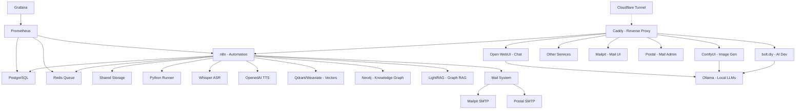

# 🚀 AI LaunchKit

<div align="center">

**Open-Source AI Development Toolkit**

*Deploy your complete AI stack in minutes, not weeks*

[](LICENSE)
[](https://github.com/freddy-schuetz/ai-launchkit)
[](https://github.com/kossakovsky/n8n-installer)

[Installation](#-installation) • [Features](#-whats-included) • [Documentation](#-documentation) • [Support](#-support)

</div>

---

## 🎯 What is AI LaunchKit?

AI LaunchKit is a comprehensive, self-hosted AI development environment that deploys **25+ pre-configured tools** with a single command. Build AI applications, automate workflows, generate images, and develop with AI assistance - all running on your own infrastructure.

Originally forked from [n8n-installer](https://github.com/kossakovsky/n8n-installer), AI LaunchKit has evolved into a complete AI development platform, maintained by [Friedemann Schuetz](https://www.linkedin.com/in/friedemann-schuetz).

### 🎬 Quick Demo

```bash
# One command to rule them all
git clone https://github.com/freddy-schuetz/ai-launchkit && cd ai-launchkit && sudo bash ./scripts/install.sh
```

**That's it!** Your AI development stack is ready in ~10-15 minutes.

ATTENTION! The AI LaunchKit is currently in development. It is regularly tested and updated. However, use is at your own risk!

---

## ✨ What's Included

### 📧 Mail System (NEW!)

| Tool | Description | Always Active | Purpose |
|------|-------------|---------------|----------|
| **[Mailpit](https://github.com/axllent/mailpit)** | Mail catcher with web UI | ✅ Yes | Development/Testing - captures all emails |
| **[Postal](https://github.com/postalserver/postal)** | Full mail server | ❌ Optional | Production - real email delivery |

**Smart Mail Configuration:**
- Automatically detects development domains (sslip.io, nip.io) → uses Mailpit
- For production domains → choice between Mailpit or Postal
- All services automatically configured with correct SMTP settings
- Zero manual configuration needed!

### 🔧 Workflow Automation

| Tool | Description | Use Cases | Access |
|------|-------------|-----------|--------|
| **[n8n](https://github.com/n8n-io/n8n)** | Visual workflow automation platform | API integrations, data pipelines, business automation | `n8n.yourdomain.com` |
| **300+ Workflows** | Pre-built n8n templates | Email automation, social media, data sync, AI workflows | Imported on install |

### 🎯 User Interfaces

| Tool | Description | Use Cases | Access |
|------|-------------|-----------|--------|
| **[Open WebUI](https://github.com/open-webui/open-webui)** | ChatGPT-like interface for LLMs | AI chat, model switching, conversation management | `webui.yourdomain.com` |
| **[Postiz](https://github.com/gitroomhq/postiz-app)** | Social media management platform | Content scheduling, analytics, multi-platform posting | `postiz.yourdomain.com` |

### 💼 Business & Productivity

| Tool | Description | Use Cases | Access |
|------|-------------|-----------|--------|
| **[Vikunja](https://vikunja.io)** | Modern task management platform | Kanban boards, Gantt charts, team collaboration, CalDAV | `vikunja.yourdomain.com` |
| **[Leantime](https://leantime.io)** | Goal-oriented project management suite | ADHD-friendly PM, time tracking, sprints, strategy tools | `leantime.yourdomain.com` |
| **[Baserow](https://github.com/bram2w/baserow)** | Airtable Alternative with real-time collaboration | Database management, project tracking, collaborative workflows | `baserow.yourdomain.com` |
| **[Odoo 18](https://github.com/odoo/odoo)** | Open Source ERP/CRM with AI features | Sales automation, inventory, accounting, AI lead scoring | `odoo.yourdomain.com` |

### 🎨 AI Content Generation

| Tool | Description | Use Cases | Access |
|------|-------------|-----------|--------|
| **[ComfyUI](https://github.com/comfyanonymous/ComfyUI)** | Node-based Stable Diffusion interface | Image generation, AI art, photo editing, workflows | `comfyui.yourdomain.com` |

### 💻 AI-Powered Development / Vibe Coding

| Tool | Description | Use Cases | Access |
|------|-------------|-----------|--------|
| **[bolt.diy](https://github.com/stackblitz-labs/bolt.diy)** | Build full-stack apps with prompts | Rapid prototyping, MVP creation, learning to code | `bolt.yourdomain.com` |
| **[OpenUI](https://github.com/wandb/openui)** 🧪 | AI-powered UI component generation | Design systems, component libraries, mockups | `openui.yourdomain.com` |

### 🤖 AI Agents

| Tool | Description | Use Cases | Access |
|------|-------------|-----------|--------|
| **[Flowise](https://github.com/FlowiseAI/Flowise)** | Visual AI agent builder | Chatbots, customer support, AI workflows | `flowise.yourdomain.com` |
| **[Dify](https://github.com/langgenius/dify)** | LLMOps platform for AI apps | Production AI apps, model management, prompt engineering | `dify.yourdomain.com` |
| **[Letta](https://github.com/letta-ai/letta)** | Stateful agent server | Persistent AI assistants, memory management | `letta.yourdomain.com` |

### 📚 RAG Systems

| Tool | Description | Use Cases | Access |
|------|-------------|-----------|--------|
| **[RAGApp](https://github.com/ragapp/ragapp)** | Build RAG assistants over your data | Knowledge bases, document Q&A, research tools | `ragapp.yourdomain.com` |
| **[Qdrant](https://github.com/qdrant/qdrant)** | High-performance vector database | Semantic search, recommendations, RAG storage | `qdrant.yourdomain.com` |
| **[Weaviate](https://github.com/weaviate/weaviate)** | AI-native vector database | Hybrid search, multi-modal data, GraphQL API | `weaviate.yourdomain.com` |

### 🎙️ Speech & Language Processing

| Tool | Description | Use Cases | Access |
|------|-------------|-----------|--------|
| **[Faster-Whisper](https://github.com/SYSTRAN/faster-whisper)** | OpenAI-compatible Speech-to-Text | Transcription, voice commands, meeting notes | Port 8001 |
| **[OpenedAI-Speech](https://github.com/matatonic/openedai-speech)** | OpenAI-compatible Text-to-Speech | Voice assistants, audiobooks, notifications | Port 5001 |
| **[LibreTranslate](https://github.com/LibreTranslate/LibreTranslate)** | Self-hosted translation API | 50+ languages, document translation, privacy-focused | `translate.yourdomain.com` |

### 🔍 Search & Web Data

| Tool | Description | Use Cases | Access |
|------|-------------|-----------|--------|
| **[SearXNG](https://github.com/searxng/searxng)** | Privacy-respecting metasearch engine | Web search for agents, no tracking, multiple sources | `searxng.yourdomain.com` |
| **[Perplexica](https://github.com/ItzCrazyKns/Perplexica)** | Open-source AI-powered search engine | Deep research, academic search, Perplexity AI alternative | `perplexica.yourdomain.com` |
| **[Crawl4Ai](https://github.com/unclecode/crawl4ai)** | AI-optimized web crawler | Web scraping, data extraction, site monitoring | Internal API |

### 🧠 Knowledge Graphs

| Tool | Description | Use Cases | Access |
|------|-------------|-----------|--------|
| **[Neo4j](https://github.com/neo4j/neo4j)** | Graph database platform | Knowledge graphs, entity relationships, fraud detection, recommendations | `neo4j.yourdomain.com` |
| **[LightRAG](https://github.com/HKUDS/LightRAG)** | Graph-based RAG with entity extraction | Automatic knowledge graph creation, relationship mapping, complex queries | `lightrag.yourdomain.com` |

### 🎬 Media Processing Suite

Pre-installed in the n8n container for seamless media manipulation:

| Tool | Description | Use Cases |
|------|-------------|-----------|
| **[FFmpeg](https://github.com/FFmpeg/FFmpeg)** | Industry-standard multimedia framework | Video conversion, streaming, audio extraction |
| **[ImageMagick](https://github.com/ImageMagick/ImageMagick)** | Image manipulation toolkit | Format conversion, resizing, effects, thumbnails |
| **[ExifTool](https://github.com/exiftool/exiftool)** | Metadata management | Read/write EXIF, IPTC, XMP metadata |
| **[MediaInfo](https://github.com/MediaArea/MediaInfo)** | Technical media analysis | Codec detection, bitrate analysis, format info |
| **[SoX](https://github.com/chirlu/sox)** | Sound processing toolkit | Audio effects, format conversion, synthesis |
| **[Ghostscript](https://github.com/ArtifexSoftware/ghostpdl)** | PostScript/PDF processor | PDF manipulation, conversion, rendering |
| **[Python3](https://github.com/python/cpython)** | With pydub & Pillow libraries | Custom media processing scripts |

### 💾 Data Infrastructure

| Tool | Description | Use Cases | Access |
|------|-------------|-----------|--------|
| **[Supabase](https://github.com/supabase/supabase)** | Open-source Firebase alternative | User auth, realtime data, file storage, vector embeddings | `supabase.yourdomain.com` |
| **[PostgreSQL](https://github.com/postgres/postgres)** | Relational database | Structured data, transactions, n8n backend | Internal |
| **[Redis](https://github.com/redis/redis)** | In-memory data store | Caching, queues, session management | Internal |

### 📊 System Management

| Tool | Description | Use Cases | Access |
|------|-------------|-----------|--------|
| **[Caddy](https://github.com/caddyserver/caddy)** | Modern web server | Automatic HTTPS, reverse proxy, load balancing | All domains |
| **[Cloudflare Tunnel](https://github.com/cloudflare/cloudflared)** | Secure tunnel to Cloudflare | Zero-trust access, no exposed ports, DDoS protection | Internal |
| **Python Runner** | Python execution environment for n8n | Custom scripts, data processing, automation tasks | Internal |
| **[Grafana](https://github.com/grafana/grafana)** | Metrics visualization platform | Performance dashboards, alerts, analytics | `grafana.yourdomain.com` |
| **[Prometheus](https://github.com/prometheus/prometheus)** | Time-series monitoring | Metrics collection, alerting rules, scraping | `prometheus.yourdomain.com` |
| **[Portainer](https://github.com/portainer/portainer)** | Container management UI | Docker admin, logs, resource monitoring | `portainer.yourdomain.com` |
| **[Langfuse](https://github.com/langfuse/langfuse)** | LLM observability platform | AI performance tracking, cost analysis, debugging | `langfuse.yourdomain.com` |

### 🔧 AI Support Tools

| Tool | Description | Use Cases | Access |
|------|-------------|-----------|--------|
| **[Ollama](https://github.com/ollama/ollama)** | Local LLM runtime | Run Llama, Mistral, Gemma models locally | `ollama.yourdomain.com` |
| **[Gotenberg](https://github.com/gotenberg/gotenberg)** | Document conversion API | PDF generation, HTML to PDF, Office conversions | Internal API |

---

## 🚀 Installation

### Prerequisites

1. **Server**: Ubuntu 24.04 LTS (64-bit)
   - Minimum: 4GB RAM, 2 CPU cores, 30GB disk (n8n + Flowise only)
   - Recommended: 8GB RAM, 4 CPU cores, 60GB disk (all services)

2. **Domain**: A registered domain with wildcard DNS
   ```
   A *.yourdomain.com -> YOUR_SERVER_IP
   ```

3. **Access**: SSH access to your server

### Quick Install

```bash
# Clone and run the installer
git clone https://github.com/freddy-schuetz/ai-launchkit && cd ai-launchkit && sudo bash ./scripts/install.sh
```

### Installation Process

The installer will ask you for:
1. **Domain name** - Your wildcard domain (e.g., `yourdomain.com`)
2. **Email address** - For SSL certificates and service logins
3. **API keys** (optional) - OpenAI, Anthropic, Groq for enhanced AI features
4. **Community workflows** - Import 300+ n8n templates (optional, 20-30 min)
5. **Worker count** - Number of n8n workers for parallel processing (1-4)
6. **Service selection** - Choose which tools to install (including Speech Stack)

**🆕 Mail Configuration (Automatic):**
- For `sslip.io`, `nip.io`, or `localhost` domains → Mailpit automatically configured
- For real domains → Choose between Mailpit (testing) or Postal (production)

**Installation time:** 10-15 minutes (plus optional workflow import)

### Post-Installation

Configure AI model API keys:
```bash
# Edit configuration
nano .env

# Add your API keys
OPENAI_API_KEY=sk-...
ANTHROPIC_API_KEY=sk-ant-...
GROQ_API_KEY=gsk_...

# Restart services
docker compose restart
```

---

## 📧 Mail Configuration

AI LaunchKit includes an intelligent dual mail system that automatically configures based on your domain type:

### 🎯 How It Works

1. **Automatic Domain Detection:**
   - **Development domains** (`sslip.io`, `nip.io`, `localhost`): Automatically configures Mailpit
   - **Production domains**: Asks whether you want Mailpit (testing) or Postal (real delivery)

2. **Mailpit** (Always Active):
   - Captures ALL emails sent by any service
   - Web UI to view emails: `https://mail.yourdomain.com`
   - No emails leave your server - perfect for development
   - No authentication needed for web UI

3. **Postal** (Optional - Production only):
   - Full-featured mail server for real email delivery
   - Admin UI: `https://postal.yourdomain.com`
   - Requires DNS configuration (SPF, DKIM, DMARC)
   - Supports multiple organizations and mail servers

### 📮 Service Integration

All services automatically use the configured SMTP settings via environment variables:

```bash
# Universal SMTP settings in .env (automatically configured)
SMTP_HOST=mailpit        # or postal
SMTP_PORT=1025           # or 25 for postal
SMTP_USER=admin
SMTP_PASS=admin
SMTP_FROM=noreply@yourdomain.com
SMTP_SECURE=false
```

#### n8n Email Configuration

n8n automatically uses the SMTP settings for:
- User invitations
- Password resets
- Workflow notifications
- Send Email node

**Additional n8n-specific variables (auto-configured):**
```bash
N8N_EMAIL_MODE=smtp
N8N_SMTP_HOST=${SMTP_HOST}
N8N_SMTP_PORT=${SMTP_PORT}
N8N_SMTP_USER=${SMTP_USER}
N8N_SMTP_PASS=${SMTP_PASS}
N8N_SMTP_SENDER=${SMTP_FROM}
N8N_SMTP_SSL=${SMTP_SECURE}
```

**Using Send Email node in workflows:**
1. Add Send Email node to your workflow
2. Create SMTP credentials:
   - Host: Use `mailpit` (internal) or `${SMTP_HOST}`
   - Port: 1025 (or `${SMTP_PORT}`)
   - User: admin
   - Password: admin
   - SSL/TLS: OFF for Mailpit

#### Supabase Email Configuration

Supabase uses the mail system for:
- User registration confirmations
- Password reset emails
- Magic link authentication

The configuration is automatic, no manual setup needed.

#### Odoo Email Configuration

Odoo can use the mail system for:
- Customer invoices
- Order confirmations
- Internal notifications

**Configure in Odoo:**
1. Go to Settings → Technical → Outgoing Mail Servers
2. Create new server:
   - SMTP Server: `mailpit` (or `postal`)
   - Port: 1025 (or 25)
   - Connection Security: None
   - Username/Password: admin/admin

#### Other Services

Most services that support SMTP can be configured similarly:
- **Host**: `mailpit` (from within Docker network)
- **Port**: 1025
- **Authentication**: Usually not required for Mailpit
- **SSL/TLS**: Disabled

### 🔄 Switching Mail Modes

To switch between Mailpit and Postal after installation:

```bash
# Edit .env file
nano .env

# Change mail mode
MAIL_MODE=mailpit  # or postal
SMTP_HOST=mailpit  # or postal
SMTP_PORT=1025     # or 25 for postal

# Restart all services
docker compose -p localai restart
```

### 📊 Viewing Captured Emails

**Mailpit Web UI:**
- URL: `https://mail.yourdomain.com`
- Features:
  - Search emails
  - View HTML/Text/Source
  - Download attachments
  - Real-time updates
  - API for automation

**Example: Testing email in development:**
```javascript
// n8n workflow to test email
1. Manual Trigger
2. Send Email node:
   - To: test@example.com
   - Subject: Test from AI LaunchKit
   - Message: This email was captured by Mailpit!
3. Check Mailpit UI to see the email
```

### 🚀 Production Setup with Postal

If you choose Postal for production:

1. **Initial Setup:**
   - Access `https://postal.yourdomain.com`
   - Login with credentials from installation
   - Create organization
   - Create mail server

2. **DNS Configuration Required:**
   ```
   MX    mail.yourdomain.com
   TXT   v=spf1 include:spf.postal.yourdomain.com ~all
   DKIM  (generated by Postal)
   DMARC v=DMARC1; p=quarantine
   ```

3. **Generate SMTP Credentials:**
   - In Postal UI → Credentials
   - Create new SMTP user
   - Update .env with new credentials

### 🛡️ Security Notes

- **Mailpit**: No authentication by default (development use)
- **Postal**: Basic Auth protection via Caddy
- **Internal SMTP**: Services communicate internally without auth
- **Port 25**: May be blocked by VPS provider (contact support)

### ⚙️ Troubleshooting Mail Issues

**Emails not appearing in Mailpit:**
```bash
# Check if Mailpit is running
docker ps | grep mailpit

# Check Mailpit logs
docker logs mailpit

# Test SMTP connection from n8n
docker exec n8n nc -zv mailpit 1025
```

**Service can't send emails:**
```bash
# Check SMTP settings in .env
grep "SMTP_" .env

# Verify internal DNS
docker exec [service] ping mailpit

# Check service logs
docker logs [service] | grep -i smtp
```

**Switching from dev to production:**
1. Update domain in .env
2. Re-run `sudo bash ./scripts/03_generate_secrets.sh`
3. Choose Postal when prompted
4. Configure DNS records
5. Test with a real email address

---

## 📚 Documentation

### 🎯 Quick Start Examples

#### Build a Web App with AI (bolt.diy)
```
1. Open bolt.yourdomain.com
2. Describe your app: "Create a todo app with dark mode"
3. Watch AI build it in real-time
4. Deploy directly or download code
```

#### Create an Automation Workflow (n8n)
```javascript
// Example: Process uploaded videos
// Execute Command Node
Command: ffmpeg
Arguments: -i /data/media/input.mp4 -vn -codec:a mp3 /data/media/output.mp3
```

#### Generate UI Components (OpenUI)
```
1. Open openui.yourdomain.com
2. Describe: "Modern pricing card with gradient"
3. Get React/Vue/HTML component instantly
```

## ✅ Vikunja Task Management Integration

Vikunja provides a modern task management platform with Kanban, Gantt, and calendar views, perfect for project automation workflows in n8n.

### Initial Setup
1. **First Login to Vikunja:**
   - Navigate to `https://vikunja.yourdomain.com`
   - Click "Register" to create your first account (becomes admin automatically)
   - Create your first project and lists
   - Generate API token in User Settings → API Tokens

2. **n8n Integration Options:**
   - **Community Node:** Install `n8n-nodes-vikunja` via Settings → Community Nodes
   - **HTTP Request:** Use internal API endpoint `http://vikunja:3456/api/v1`
   - **Authentication:** Bearer token from Vikunja API settings

### Key Features for Automation
- **Multiple Views:** Kanban boards, Gantt charts, Calendar, Table view
- **Collaboration:** Team workspaces, task assignments, file attachments (up to 20MB)
- **Import/Export:** From Todoist, Trello, Microsoft To-Do, CSV/JSON export
- **CalDAV Support:** `https://vikunja.yourdomain.com/dav` for calendar sync
- **Mobile Apps:** iOS (App Store - "Vikunja Cloud") and Android (Play Store - "Vikunja")

### Example Workflows
- **Task Automation Pipeline:** Create tasks from emails/webhooks
- **Project Status Dashboard:** Daily task summaries and statistics
- **Recurring Task Generator:** Automatically create daily/weekly tasks
- **Task Import:** Migrate from Trello, Asana, or CSV files

### Tips for n8n Integration
- Use internal URL: `http://vikunja:3456` from n8n containers
- Generate dedicated API tokens for n8n workflows
- Add Wait nodes between bulk operations
- Use Try/Catch nodes for error handling
- Set up webhooks for real-time task updates

## 🎯 Leantime Project Management Integration

Leantime is a goal-oriented project management suite designed specifically for ADHD and neurodiverse teams, offering comprehensive project tracking with time management and strategic planning tools.

### Initial Setup

**First Login to Leantime:**
1. Navigate to `https://leantime.yourdomain.com`
2. The installation wizard starts automatically
3. Create your admin account (first user becomes admin)
4. Complete company profile setup
5. Generate API key in User Settings → API Access

**MySQL 8.4 Auto-Installation:**
- Leantime automatically installs MySQL 8.4 during setup
- This MySQL instance can be reused for other services (WordPress, Ghost, etc.)
- Root password available in `.env` file

### n8n Integration Setup

**Important:** Leantime uses JSON-RPC 2.0 API, not REST. All requests go to `/api/jsonrpc` endpoint.

**Create Leantime Credentials in n8n:**
1. Go to Credentials → New → Header Auth
2. Configure:
   - Name: `Leantime API`
   - Header Name: `x-api-key`
   - Header Value: `[Your API key from Leantime settings]`

**HTTP Request Node Configuration:**
```javascript
Method: POST
URL: http://leantime:8080/api/jsonrpc
Authentication: Header Auth (select your Leantime API credential)
Headers:
  Content-Type: application/json
  Accept: application/json
Body Type: JSON
```

### JSON-RPC API Examples

#### Get All Projects
```json
{
  "jsonrpc": "2.0",
  "method": "leantime.rpc.projects.getAll",
  "id": 1,
  "params": {}
}
```

#### Get All Tickets/Tasks
```json
{
  "jsonrpc": "2.0",
  "method": "leantime.rpc.tickets.getAll",
  "id": 1,
  "params": {}
}
```

#### Create New Task
```json
{
  "jsonrpc": "2.0",
  "method": "leantime.rpc.tickets.addTicket",
  "id": 1,
  "params": {
    "values": {
      "headline": "Task created from n8n",
      "type": "task",
      "description": "Automated task creation",
      "projectId": 1,
      "status": 3,
      "priority": "2",
      "tags": "automated,n8n"
    }
  }
}
```

#### Update Existing Task
```json
{
  "jsonrpc": "2.0",
  "method": "leantime.rpc.tickets.updateTicket",
  "id": 1,
  "params": {
    "id": 10,
    "values": {
      "headline": "Updated headline",
      "status": 4,
      "progress": 50
    }
  }
}
```

### Example: Weekly Sprint Planning Automation

Automatically create sprint tasks from a template:

```javascript
// 1. Schedule Trigger: Weekly on Monday at 9 AM

// 2. HTTP Request: Get current project tasks
// Method: POST
// URL: http://leantime:8080/api/jsonrpc
// Body:
{
  "jsonrpc": "2.0",
  "method": "leantime.rpc.tickets.getAll",
  "id": 1,
  "params": {}
}

// 3. Code Node: Filter and prepare weekly tasks
const tasks = $input.first().json.result;
const weekNumber = new Date().getWeek();

const weeklyTasks = [
  {
    headline: `Week ${weekNumber} - Sprint Planning`,
    type: "task",
    priority: "1"
  },
  {
    headline: `Week ${weekNumber} - Daily Standups`,
    type: "task",
    priority: "2"
  },
  {
    headline: `Week ${weekNumber} - Sprint Review`,
    type: "task",
    priority: "2"
  }
];

return weeklyTasks.map(task => ({ json: task }));

// 4. Loop Over Items
// 5. HTTP Request: Create each task
// Body:
{
  "jsonrpc": "2.0",
  "method": "leantime.rpc.tickets.addTicket",
  "id": 1,
  "params": {
    "values": {
      "headline": "{{ $json.headline }}",
      "type": "{{ $json.type }}",
      "projectId": 1,
      "status": 3,
      "priority": "{{ $json.priority }}",
      "tags": "weekly,automated"
    }
  }
}
```

### Example: Time Tracking Report Automation

Generate weekly time reports:

```javascript
// 1. Schedule Trigger: Friday at 5 PM

// 2. HTTP Request: Get all tickets with time entries
// Method: POST
// URL: http://leantime:8080/api/jsonrpc
// Body:
{
  "jsonrpc": "2.0",
  "method": "leantime.rpc.tickets.getAll",
  "id": 1,
  "params": {}
}

// 3. Code Node: Calculate time summaries
const tickets = $input.first().json.result;

const timeReport = tickets
  .filter(t => t.bookedHours > 0)
  .map(ticket => ({
    task: ticket.headline,
    project: ticket.projectName,
    plannedHours: ticket.planHours,
    actualHours: ticket.bookedHours,
    remaining: ticket.hourRemaining,
    status: ticket.statusLabel
  }));

const totalBooked = timeReport.reduce((sum, t) => sum + t.actualHours, 0);
const totalPlanned = timeReport.reduce((sum, t) => sum + t.plannedHours, 0);

return [{
  json: {
    report: timeReport,
    summary: {
      totalBookedHours: totalBooked,
      totalPlannedHours: totalPlanned,
      efficiency: (totalBooked / totalPlanned * 100).toFixed(2) + '%'
    }
  }
}];

// 4. Send report via email/Slack/Teams
```

### Example: Idea to Task Pipeline

Convert ideas into actionable tasks:

```javascript
// 1. Webhook Trigger: Receive idea submission

// 2. OpenAI Node: Analyze and break down idea
// Prompt: Break down this idea into 3-5 concrete tasks

// 3. Loop Over Generated Tasks

// 4. HTTP Request: Create task in Leantime
// Method: POST
// URL: http://leantime:8080/api/jsonrpc
// Body:
{
  "jsonrpc": "2.0",
  "method": "leantime.rpc.tickets.addTicket",
  "id": 1,
  "params": {
    "values": {
      "headline": "{{ $json.taskTitle }}",
      "description": "{{ $json.taskDescription }}",
      "type": "task",
      "projectId": 1,
      "status": 3,
      "storypoints": "{{ $json.estimatedHours }}",
      "tags": "idea-generated,ai-enhanced"
    }
  }
}

// 5. Notification: Send confirmation with task IDs
```

### Available JSON-RPC Methods

**Project Management:**
- `leantime.rpc.projects.getAll` - Get all projects
- `leantime.rpc.projects.getProject` - Get specific project
- `leantime.rpc.projects.addProject` - Create new project
- `leantime.rpc.projects.updateProject` - Update project

**Task/Ticket Management:**
- `leantime.rpc.tickets.getAll` - Get all tickets
- `leantime.rpc.tickets.getTicket` - Get specific ticket
- `leantime.rpc.tickets.addTicket` - Create new ticket
- `leantime.rpc.tickets.updateTicket` - Update ticket
- `leantime.rpc.tickets.deleteTicket` - Delete ticket

**Time Tracking:**
- `leantime.rpc.timesheets.getAll` - Get timesheets
- `leantime.rpc.timesheets.addTime` - Log time entry
- `leantime.rpc.timesheets.updateTime` - Update time entry

**Milestones:**
- `leantime.rpc.tickets.getAllMilestones` - Get milestones
- `leantime.rpc.tickets.addMilestone` - Create milestone

### Task Status Codes

```javascript
// Status values for tickets
const STATUS = {
  NEW: 3,           // Neu
  IN_PROGRESS: 1,   // In Bearbeitung
  DONE: 0,          // Fertig
  BLOCKED: 4,       // Blockiert
  REVIEW: 2         // Review
};

// Task types
const TYPES = {
  TASK: "task",
  BUG: "bug",
  STORY: "story",
  MILESTONE: "milestone"
};

// Priority levels
const PRIORITY = {
  HIGH: "1",
  MEDIUM: "2",
  LOW: "3"
};
```

### Leantime Features for Automation

**Strategy Tools:**
- **Goal Canvas:** Define and track OKRs
- **Lean Canvas:** Business model planning
- **SWOT Analysis:** Strategic assessment
- **Opportunity Canvas:** Market analysis

**Time Management:**
- **Built-in Timer:** Track time directly in tasks
- **Timesheets:** Exportable reports
- **Estimates vs Actual:** Improve planning accuracy

**ADHD-Friendly Features:**
- **Dopamine-driven UI:** Gamification elements
- **Focus Mode:** Minimize distractions
- **Break Reminders:** Pomodoro technique support
- **Visual Progress:** Charts and progress bars

### Tips for Leantime + n8n Integration

1. **Always use JSON-RPC format:** All API calls must be POST to `/api/jsonrpc`
2. **Internal URL:** Use `http://leantime:8080` from n8n containers
3. **API Authentication:** x-api-key header is required for all requests
4. **Response Format:** Results are in `result` field of JSON-RPC response
5. **Error Handling:** Check for `error` field in responses
6. **Batch Operations:** Send multiple requests in array for efficiency
7. **ID Parameter:** Most update/delete operations need ID in params
8. **Time Format:** Use ISO 8601 format for dates

### Troubleshooting

**Common Issues:**

1. **"Method not found" Error:**
   - Check method name spelling and case sensitivity
   - Ensure format is `leantime.rpc.resource.method`

2. **Authentication Failed:**
   - Verify API key is correct
   - Check header name is exactly `x-api-key`

3. **Invalid Parameters:**
   - Wrap parameters in `params` object
   - For updates, include ID separately from values

4. **Connection Issues:**
   - Use internal Docker hostname: `leantime:8080`
   - Port is 8080, not 80

### Example Error Handling in n8n

```javascript
// Code Node: Check Leantime response
const response = $input.first().json;

if (response.error) {
  throw new Error(`Leantime API Error: ${response.error.message}`);
}

if (!response.result) {
  throw new Error('No result returned from Leantime');
}

// Process successful response
return [{
  json: {
    success: true,
    data: response.result
  }
}];
```

### Leantime Philosophy Integration

Leantime's "Start with WHY" approach fits perfectly with n8n automation:
- Automate goal tracking and alignment
- Generate insights from strategic canvases
- Create feedback loops between execution and strategy
- Support neurodiverse team members with consistent processes

### 💾 Baserow Integration with n8n

Baserow provides an Airtable-like database experience with real-time collaboration, making it perfect for data management workflows in n8n. The native Baserow node in n8n offers seamless integration.

#### Initial Setup

**First Login to Baserow:**
1. Navigate to `https://baserow.yourdomain.com`
2. Register as the first user (becomes admin automatically)
3. Create your first workspace and database
4. Generate API token in user settings

#### Native n8n Baserow Node Setup

**Create Baserow Credentials in n8n:**
```javascript
// Baserow API Credentials
Host: http://baserow:80
Database ID: 1 (from database URL)
Token: your-api-token-from-baserow-settings
```

#### Example: Customer Data Management Pipeline

Automate customer data collection and enrichment:

```javascript
// 1. Webhook Trigger: Receive new customer data
// 2. Baserow Node: Create new customer record
Operation: Create
Database: customers
Table ID: 1
Fields: {
  "Name": "{{ $json.name }}",
  "Email": "{{ $json.email }}",
  "Company": "{{ $json.company }}",
  "Status": "New Lead"
}

// 3. Perplexica Node: Research company information
Method: POST
URL: http://perplexica:3000/api/search
Body: {
  "query": "{{ $json.company }} company information",
  "focusMode": "webSearch"
}

// 4. Baserow Node: Update customer with research
Operation: Update
Database: customers
Row ID: "{{ $('Create Customer').json.id }}"
Fields: {
  "Company Info": "{{ $json.research_summary }}",
  "Industry": "{{ $json.detected_industry }}",
  "Status": "Researched"
}
```

#### Example: Project Task Management

Sync project tasks between multiple systems:

```javascript
// 1. Schedule Trigger: Daily at 9 AM
// 2. Baserow Node: Get pending tasks
Operation: List
Database: projects
Table ID: 2
Filters: {
  "Status__equal": "Pending",
  "Due Date__date_before": "{{ $now.plus(3, 'days').toISODate() }}"
}

// 3. Loop Over Items
// 4. Slack Node: Send reminder to assignee
Channel: "{{ $json.assignee_slack_id }}"
Message: "Task due in 3 days: {{ $json.task_name }}"

// 5. Baserow Node: Update task status
Operation: Update
Row ID: "{{ $json.id }}"
Fields: {
  "Reminder Sent": true,
  "Last Notified": "{{ $now.toISO() }}"
}
```

#### Example: Data Enrichment Workflow

Enhance existing records with AI-generated content:

```javascript
// 1. Baserow Node: Get records missing descriptions
Operation: List
Filters: {
  "Description__empty": true
}

// 2. Loop Over Items
// 3. OpenAI Node: Generate product description
Model: gpt-4o-mini
Prompt: |
  Create a compelling product description for:
  Product: {{ $json.product_name }}
  Features: {{ $json.features }}
  Target audience: {{ $json.target_market }}
  
  Make it engaging and SEO-friendly (100-150 words).

// 4. Baserow Node: Update with generated content
Operation: Update
Row ID: "{{ $json.id }}"
Fields: {
  "Description": "{{ $json.generated_description }}",
  "SEO Keywords": "{{ $json.suggested_keywords }}",
  "Updated": "{{ $now.toISO() }}"
}
```

#### Example: Real-time Collaboration Trigger

React to changes in Baserow using webhooks:

```javascript
// 1. Webhook Trigger: Baserow sends data on row changes
// 2. Switch Node: Route based on action type
Branch 1 - Row Created:
  // Send welcome email for new customers
  // Create tasks in project management system
  
Branch 2 - Row Updated:
  // Check for status changes
  // Notify team members of updates
  
Branch 3 - Row Deleted:
  // Archive related data
  // Send notification to admin

// 3. Baserow Node: Log action history
Operation: Create
Database: activity_log
Fields: {
  "Action": "{{ $json.action }}",
  "Table": "{{ $json.table_name }}",
  "User": "{{ $json.user_name }}",
  "Timestamp": "{{ $now.toISO() }}"
}
```

#### Advanced: Baserow REST API via HTTP Request

For operations not available in the native node:

```javascript
// Get database schema information
Method: GET
URL: http://baserow:80/api/database/tables/{{ $json.table_id }}/fields/
Headers: {
  "Authorization": "Token your-api-token"
}

// Bulk operations
Method: PATCH
URL: http://baserow:80/api/database/rows/table/{{ $json.table_id }}/batch/
Headers: {
  "Authorization": "Token your-api-token",
  "Content-Type": "application/json"
}
Body: {
  "items": [
    {"id": 1, "field_1": "updated_value1"},
    {"id": 2, "field_1": "updated_value2"}
  ]
}
```

#### Baserow Features Highlights

**Real-time Collaboration:**
- Multiple users can edit simultaneously
- Changes appear instantly for all users
- Built-in conflict resolution

**Data Safety:**
- Undo/Redo functionality for all actions
- Trash bin for deleted rows (unlike NocoDB)
- Activity log tracks all changes

**Templates and Views:**
- 50+ ready-made templates
- Multiple view types: Grid, Gallery, Form
- Custom filters and sorting
- Public form sharing

#### Tips for Baserow + n8n Integration

1. **Use Internal URLs**: Always use `http://baserow:80` from n8n, not the external URL
2. **Token Authentication**: Generate API tokens instead of using username/password
3. **Field Mapping**: Use field names exactly as they appear in Baserow (case-sensitive)
4. **Batch Operations**: Use the HTTP Request node for bulk updates to avoid rate limits
5. **Webhooks**: Set up Baserow webhooks to trigger n8n workflows on data changes
6. **Error Handling**: Add Try/Catch nodes for resilient workflows
7. **Field Types**: Respect Baserow field types (Text, Number, Date, Select, etc.)
8. **Database Structure**: Use multiple tables with relationships for complex data models

### 🏢 Odoo ERP/CRM Integration with n8n

Odoo 18 comes with built-in AI features and native n8n integration, enabling powerful business automation workflows.

#### Initial Setup

**First Login to Odoo:**
1. Navigate to `https://odoo.yourdomain.com`
2. Create your database with the master password from your `.env` file
3. Set up your admin account with your email
4. Complete the initial configuration wizard

#### Native n8n Odoo Node Setup

**Create Odoo Credentials in n8n:**
```javascript
// Odoo API Credentials
URL: http://odoo:8069
Database: odoo
Email: your-admin@email.com
Password: your-admin-password
```

#### Example: AI-Enhanced Lead Management

Automate lead qualification with AI scoring:

```javascript
// 1. Odoo Node: Get New Leads
Operation: Get All
Resource: Lead/Opportunity
Filters: {
  "stage_id": 1,  // New leads
  "probability": 0 // Not yet scored
}

// 2. Perplexica Node: Research Company
Method: POST
URL: http://perplexica:3000/api/search
Body: {
  "query": "{{ $json.partner_name }} company information",
  "focusMode": "webSearch"
}

// 3. OpenAI/Ollama Node: Score Lead
Prompt: Based on this company research: {{ $json.research }}
Score this lead from 0-100 for potential value.
Consider: company size, industry, recent news.

// 4. Odoo Node: Update Lead
Operation: Update
Resource: Lead/Opportunity
Fields: {
  "probability": "{{ $json.score }}",
  "description": "{{ $json.ai_analysis }}",
  "priority": "{{ $json.score > 70 ? '3' : '1' }}"
}
```

#### Example: Automated Invoice Processing

Process invoices from email attachments:

```javascript
// 1. Email Trigger: Receive invoice emails
// 2. Extract from File: Get PDF text
// 3. Code Node: Parse invoice data
const text = $input.first().json.text;
const invoiceData = {
  vendor: text.match(/Vendor: (.+)/)?.[1],
  amount: parseFloat(text.match(/Total: \$?([\d,]+\.?\d*)/)?.[1].replace(',','')),
  date: text.match(/Date: (.+)/)?.[1],
  items: []
};

// Extract line items
const itemMatches = text.matchAll(/(.+)\s+(\d+)\s+\$?([\d,]+\.?\d*)/g);
for (const match of itemMatches) {
  invoiceData.items.push({
    description: match[1],
    quantity: parseInt(match[2]),
    price: parseFloat(match[3].replace(',',''))
  });
}

return invoiceData;

// 4. Odoo Node: Create Vendor Bill
Operation: Create
Resource: Vendor Bill
Fields: {
  "partner_id": "{{ $json.vendor }}",
  "invoice_date": "{{ $json.date }}",
  "amount_total": "{{ $json.amount }}",
  "invoice_line_ids": "{{ $json.items }}"
}
```

#### Example: AI Content Generation for Products

Generate product descriptions and marketing content:

```javascript
// 1. Odoo Node: Get Products Without Descriptions
Operation: Get All
Resource: Product
Filters: {
  "description_sale": false
}

// 2. Loop Over Products
// 3. OpenAI Node: Generate Description
Model: gpt-4
Prompt: |
  Create an engaging product description for:
  Product: {{ $json.name }}
  Category: {{ $json.categ_id }}
  Features: {{ $json.attribute_line_ids }}
  
  Include:
  - Key benefits (3-5 bullet points)
  - Technical specifications
  - SEO-optimized description (150-200 words)
  - Suggested keywords

// 4. Odoo Node: Update Product
Operation: Update
Resource: Product
Fields: {
  "description_sale": "{{ $json.description }}",
  "website_description": "{{ $json.seo_description }}",
  "website_meta_keywords": "{{ $json.keywords }}"
}
```

#### Example: Sales Automation Workflow

Automate follow-ups and task creation:

```javascript
// 1. Schedule Trigger: Daily at 9 AM
// 2. Odoo Node: Get Opportunities
Operation: Get All
Resource: Lead/Opportunity
Filters: {
  "probability": [">", 50],
  "activity_date_deadline": ["<", "{{ $now.plus(3, 'days').toISO() }}"]
}

// 3. Loop Over Opportunities
// 4. Odoo Node: Create Activity
    method: "POST",
Operation: Create
Resource: Activity
Fields: {
  "res_model": "crm.lead",
  "res_id": "{{ $json.id }}",
  "activity_type_id": 2, // Call
  "summary": "Follow-up call needed",
  "date_deadline": "{{ $now.plus(1, 'day').toISO() }}",
  "user_id": "{{ $json.user_id }}"
}

// 5. Send Slack/Email Notification
// Using the configured mail system - emails will be captured by Mailpit in dev
```

#### Advanced: Odoo API via HTTP Request

For operations not available in the native node:

```javascript
// Authenticate and get session
Method: POST
URL: http://odoo:8069/web/session/authenticate
Body: {
  "jsonrpc": "2.0",
  "params": {
    "db": "odoo",
    "login": "admin@example.com",
    "password": "your-password"
  }
}

// Use session cookie for subsequent requests
Method: POST
URL: http://odoo:8069/web/dataset/call_kw
Headers: {
  "Cookie": "{{ $json.session_id }}"
}
Body: {
  "jsonrpc": "2.0",
  "method": "call",
  "params": {
    "model": "res.partner",
    "method": "create",
    "args": [{
      "name": "New Customer",
      "email": "customer@example.com"
    }],
    "kwargs": {}
  }
}
```

#### Odoo 18 AI Features

Leverage Odoo's built-in AI capabilities:

1. **AI Lead Scoring**: Automatically scores leads based on interaction history
2. **Content Generation**: Generate emails, product descriptions, and quotes
3. **Sales Forecasting**: ML-based predictions for pipeline and revenue
4. **Expense Processing**: OCR and AI for automatic expense categorization
5. **Document Analysis**: Extract data from PDFs and invoices

#### Tips for Odoo + n8n Integration

1. **Use Internal URLs**: Always use `http://odoo:8069` from n8n, not the external URL
2. **Batch Operations**: Process multiple records in loops to avoid rate limits
3. **Error Handling**: Add Try/Catch nodes for resilient workflows
4. **Caching**: Store frequently accessed data (like product lists) in variables
5. **Webhooks**: Set up Odoo automated actions to trigger n8n workflows
6. **Custom Fields**: Create custom fields in Odoo for AI-generated content

### 🔎 Perplexica Integration with n8n

Perplexica provides AI-powered search capabilities that can be integrated into n8n workflows for research automation, content generation, and intelligent data gathering.

#### Basic Search Query (n8n HTTP Request Node)

**Configuration:**
- **Method:** POST
- **URL:** `http://perplexica:3000/api/search`
- **Headers:** `Content-Type: application/json`
- **Body:**
```json
{
  "query": "{{ $json.searchQuery }}",
  "focusMode": "webSearch",
  "chatHistory": []
}
```

#### Available Focus Modes

| Mode | Use Case | Example Query |
|------|----------|---------------|
| `webSearch` | General web search | "Latest AI developments 2025" |
| `academicSearch` | Scientific papers & research | "CRISPR gene editing studies" |
| `youtubeSearch` | Video content discovery | "How to build a RAG system" |
| `redditSearch` | Community discussions | "Best practices for n8n workflows" |
| `writingAssistant` | Content creation help | "Write an introduction about quantum computing" |
| `wolframAlphaSearch` | Math & computational queries | "Calculate the derivative of x^3 + 2x" |

#### Example: Deep Research Workflow

Build an automated research assistant that performs multi-perspective analysis:

```
1. Chat Trigger → Receive research query
2. HTTP Request → Initial Perplexica search (webSearch)
3. Code Node → Extract key topics from response
4. Loop Over Items → For each topic:
   - HTTP Request → Perplexica (different focusMode)
   - Gather multiple perspectives
5. Code Node → Aggregate all research
6. Send Email/Slack → Deliver research report
```

**Extract Topics Code Node:**
```javascript
const response = $input.first().json;
const topics = [];

// Extract key phrases from answer
const headings = response.message.match(/### (.+)/g) || [];
headings.forEach(h => topics.push(h.replace('### ', '')));

// Create follow-up queries
return topics.map(topic => ({
  json: {
    query: `${topic} detailed analysis`,
    focusMode: "academicSearch"
  }
}));
```

**Aggregate Research Code Node:**
```javascript
const allResults = $input.all();
const research = {
  timestamp: new Date().toISOString(),
  findings: {},
  sources: []
};

// Combine all research
allResults.forEach(item => {
  const data = item.json;
  research.findings[data.focusMode] = data.message;
  research.sources.push(...(data.sources || []));
});

// Remove duplicate sources
research.sources = [...new Map(
  research.sources.map(s => [s.url, s])
).values()];

return { json: research };
```

#### Example: Content Generation Pipeline

Combine Perplexica research with AI writing:

```
1. Schedule Trigger → Daily at 9 AM
2. HTTP Request → Perplexica search trending topics
3. Code Node → Select top 3 topics
4. Loop → For each topic:
   - HTTP Request → Deep research via Perplexica
   - HTTP Request → Generate article with Ollama/OpenAI
   - Markdown Node → Format article
5. Ghost/WordPress → Publish articles
```

#### Example: Competitive Intelligence Monitor

```javascript
// Monitor competitor mentions
const competitors = ["Competitor A", "Competitor B"];
const results = [];

for (const competitor of competitors) {
  // Search for recent news
  const news = await $http.request({
    method: "POST",
    url: "http://perplexica:3000/api/search",
    body: {
      query: `${competitor} latest news announcements`,
      focusMode: "webSearch"
    }
  });
  
  // Search for community sentiment
  const sentiment = await $http.request({
    url: "http://perplexica:3000/api/search",
    body: {
      query: `${competitor} reviews opinions`,
      focusMode: "redditSearch"
    }
  });
  
  results.push({
    competitor,
    news: news.message,
    sentiment: sentiment.message,
    sources: [...news.sources, ...sentiment.sources]
  });
}

return results;
```

#### Tips for Perplexica + n8n

1. **Rate Limiting:** Add Wait nodes between searches to avoid overwhelming the service
2. **Error Handling:** Use Try/Catch nodes for resilient workflows
3. **Caching:** Store search results in Supabase/PostgreSQL to avoid duplicate queries
4. **Enrichment:** Combine Perplexica with other services:
   - Use Perplexica for research → LightRAG for knowledge graph
   - Search with Perplexica → Summarize with Ollama
   - Perplexica for sources → Crawl4ai for full content extraction

### 🎙️ Speech Stack Integration

The Speech Stack provides OpenAI-compatible APIs for speech-to-text and text-to-speech, perfect for building voice-enabled workflows in n8n.

#### Speech-to-Text with Whisper (n8n HTTP Request Node)

**Configuration:**
- **Method:** POST
- **URL:** `http://faster-whisper:8000/v1/audio/transcriptions`
- **Send Body:** Form Data Multipart
- **Body Parameters:**
  1. Binary File:
     - Parameter Type: `n8n Binary File`
     - Name: `file`
     - Input Data Field Name: `data`
  2. Model:
     - Parameter Type: `Form Data`
     - Name: `model`
     - Value: `Systran/faster-whisper-large-v3`
  3. Language (optional):
     - Parameter Type: `Form Data`
     - Name: `language`
     - Value: `en` (or `de` for German, etc.)

#### Text-to-Speech with OpenedAI-Speech (n8n HTTP Request Node)

**Configuration:**
- **Method:** POST
- **URL:** `http://openedai-speech:8000/v1/audio/speech`
- **Send Headers:** ON
  - `Content-Type`: `application/json`
  - `Authorization`: `Bearer sk-dummy`
- **Send Body:** JSON
  ```json
  {
    "model": "tts-1",
    "input": "{{ $json.text }}",
    "voice": "alloy"
  }
  ```
- **Response Format:** `File`
- **Put Output in Field:** `data`

**Available English voices:** alloy, echo, fable, onyx, nova, shimmer

#### Example: Voice-to-Voice Workflow
```
1. Telegram Trigger → Receive voice message
2. Get File → Download voice file from Telegram
3. HTTP Request → Transcribe with Whisper
4. AI Agent → Process text with ChatGPT/Claude
5. HTTP Request → Generate speech with TTS

6. Telegram → Send audio response
```
### 🇩🇪 Adding German Voices to TTS

To add German voices (or other languages) to the Text-to-Speech service:

1. **Locate the configuration file:**
   ```bash
   cd ~/ai-launchkit
   nano openedai-config/voice_to_speaker.yaml
   ```

2. **Add German voices to the `tts-1` section:**
   ```yaml
   # Add these lines under the existing voices
   thorsten:
     model: de_DE-thorsten-medium
     speaker: # default speaker
   eva:
     model: de_DE-eva_k-x_low
     speaker: # default speaker
   kerstin:
     model: de_DE-kerstin-low
     speaker: # default speaker
   ```

3. **Restart the TTS service:**
   ```bash
   docker compose -p localai restart openedai-speech
   ```

4. **Use German voices in n8n:**
   ```json
   {
     "model": "tts-1",
     "input": "Hallo, dies ist ein Test der deutschen Sprachausgabe.",
     "voice": "thorsten"
   }
   ```

The voice models will be automatically downloaded on first use. Available German voices:
- **thorsten**: High-quality male voice (medium quality)
- **eva**: Female voice (extra low quality, very fast)
- **kerstin**: Female voice (low quality, fast)

You can find more voices at [Piper Voice Samples](https://rhasspy.github.io/piper-samples/).

### 🌍 LibreTranslate Integration

LibreTranslate provides a self-hosted translation API with 50+ languages, perfect for privacy-conscious workflows and unlimited translations without API costs.

#### Basic Translation (n8n HTTP Request Node)

**Configuration:**
- **Method:** POST
- **URL:** `http://libretranslate:5000/translate`
- **Authentication:** None (internal access)
- **Send Headers:** ON
  - `Content-Type`: `application/json`
- **Send Body:** JSON
  ```json
  {
    "q": "{{ $json.text }}",
    "source": "auto",
    "target": "de",
    "format": "text"
  }
  ```

#### Detect Language

**Configuration:**
- **Method:** POST
- **URL:** `http://libretranslate:5000/detect`
- **Send Body:** JSON
  ```json
  {
    "q": "{{ $json.text }}"
  }
- **Symptom:** "Port already allocated" error during startup
  ```

#### Get Available Languages

**Configuration:**
- **Method:** GET
- **URL:** `http://libretranslate:5000/languages`

#### Example: Multi-Language Support Workflow
```
1. Webhook Trigger → Receive text from user
2. HTTP Request → Detect language
   URL: http://libretranslate:5000/detect
   Body: {"q": "{{ $json.text }}"}
3. IF Node → Check if language != "en"
4. HTTP Request → Translate to English
   URL: http://libretranslate:5000/translate
   Body: {
     "q": "{{ $('Webhook').item.json.text }}",
     "source": "{{ $json[0].language }}",
     "target": "en"
   }
5. OpenAI/Ollama → Process in English
6. HTTP Request → Translate back to original language
   URL: http://libretranslate:5000/translate
   Body: {
     "q": "{{ $json.response }}",
     "source": "en",
     "target": "{{ $node['HTTP Request'].json[0].language }}"
   }
7. Respond to User → Send translated response
```

#### Common Language Codes

| Code | Language | Code | Language | Code | Language |
|------|----------|------|----------|------|----------|
| `de` | German | `fr` | French | `zh` | Chinese |
| `en` | English | `it` | Italian | `ja` | Japanese |
| `es` | Spanish | `pt` | Portuguese | `ar` | Arabic |
| `ru` | Russian | `nl` | Dutch | `ko` | Korean |
| `pl` | Polish | `tr` | Turkish | `hi` | Hindi |

**Tips:**
- Use `"source": "auto"` for automatic language detection
- Set `"format": "html"` to preserve HTML formatting
- Documents (docx, pdf, txt) can be translated via file upload
- Internal access from n8n doesn't require authentication
- External access via `https://translate.yourdomain.com` requires Basic Auth

### 🔮 LightRAG Integration

LightRAG provides graph-based RAG with automatic entity and relationship extraction, creating knowledge graphs from your documents. It's perfect for complex queries that require understanding relationships between entities.

#### Basic Document Processing (n8n HTTP Request Node)

**Insert Document:**
```javascript
// HTTP Request Node Configuration
Method: POST
URL: http://lightrag:9621/api/insert
Headers:
  Content-Type: application/json
  Authorization: Bearer {{ $credentials.lightragToken }}
Body: {
  "text": "{{ $json.documentContent }}",
  "metadata": {
    "source": "{{ $json.fileName }}",
    "timestamp": "{{ $now.toISO() }}"
  }
}
```

#### Query Knowledge Graph

**Configuration for different query modes:**
```javascript
// Local Query - Specific entity information
Method: POST
URL: http://lightrag:9621/api/query
Body: {
  "query": "What is the role of Petra Hedorfer?",
  "mode": "local",
  "max_results": 5
}

// Global Query - High-level summaries
Method: POST
URL: http://lightrag:9621/api/query
Body: {
  "query": "What are the main sustainability initiatives?",
  "mode": "global",
  "max_results": 10
}

// Hybrid Query - Combines local and global
Method: POST
URL: http://lightrag:9621/api/query
Body: {
  "query": "How does DZT implement SDGs in tourism?",
  "mode": "hybrid",
  "stream": false
}
```

#### Example: Building a Knowledge Graph from Documents
```
1. Trigger (Webhook/Schedule) → Start workflow
2. Google Drive → Get new PDF documents
3. Extract from File → Extract text from PDF
4. Code Node → Split into chunks (3000 chars)
5. Loop Over Items → For each chunk:
   - HTTP Request → Insert to LightRAG
   - Extract entities and relationships
6. HTTP Request → Query for specific insights
7. Format Response → Create summary report
8. Send Email → Deliver insights (via Mailpit in dev)
```

#### Query Modes Explained
- **`local`**: Retrieves specific information about entities and their direct relationships
- **`global`**: Provides high-level summaries and themes across the entire knowledge base
- **`hybrid`**: Combines both local and global retrieval for comprehensive answers
- **`naive`**: Simple keyword-based retrieval without graph features

#### Advanced: Open WebUI Integration

LightRAG can be added to Open WebUI as an Ollama-compatible model:

1. In Open WebUI, go to Settings → Connections
2. Add new Ollama connection:
   - **URL:** `http://lightrag:9621`
   - **Model name:** `lightrag:latest`
3. Select LightRAG from model dropdown in chat

This enables chatting with your knowledge graph directly through the Open WebUI interface!

#### Optional: Switch from Ollama to OpenAI Models

LightRAG defaults to using local Ollama models, but you can switch to OpenAI for better performance with large documents:

##### Why Switch to OpenAI?
- **Performance:** OpenAI models are 10-100x faster than CPU-based Ollama
- **Large Documents:** Can handle PDFs with 50+ pages without timeouts
- **Better Quality:** More accurate entity and relationship extraction
- **Cost-Efficient:** gpt-4o-mini costs ~$0.15 per million tokens

##### Configuration Steps:

1. **Add OpenAI API Key to .env:**
```bash
nano .env
# Add or update:
OPENAI_API_KEY=sk-proj-YOUR-API-KEY-HERE
```

2. **Update docker-compose.yml:**
```yaml
lightrag:
  environment:
    - OPENAI_API_KEY=${OPENAI_API_KEY}
    - LLM_BINDING=openai                           # Changed from ollama
    - LLM_BINDING_HOST=https://api.openai.com/v1   # OpenAI endpoint
    - LLM_MODEL=gpt-4o-mini                        # Cost-efficient model
    - EMBEDDING_BINDING=openai                     # Changed from ollama
    - EMBEDDING_BINDING_HOST=https://api.openai.com/v1
    - EMBEDDING_MODEL=text-embedding-3-small       # OpenAI embeddings
    - EMBEDDING_DIM=1536                           # OpenAI dimension (not 768!)
    - TIMEOUT=600                                   # 10 minute timeout
    # ... other existing variables ...
```

3. **Clear Existing Data (Important!):**
```bash
# Stop LightRAG
docker compose -p localai down lightrag

# Remove old embeddings (incompatible dimensions)
docker volume rm localai_lightrag_data

# Restart with new configuration
docker compose -p localai up -d lightrag
```

##### Available OpenAI Models:
- **Budget:** `gpt-4o-mini` (~$0.15/1M input, $0.60/1M output)
- **Balanced:** `gpt-4o` (~$2.50/1M input, $10/1M output)
- **Embeddings:** `text-embedding-3-small` (1536 dimensions)

##### Cost Example:
Processing a 50-page PDF (~50,000 tokens):
- **gpt-4o-mini:** ~$0.02 total
- **gpt-4o:** ~$0.20 total
- **Ollama (llama3.2):** Free but may timeout

##### Troubleshooting OpenAI Configuration:

If you get "model not found" errors:
- Ensure `LLM_BINDING` and `EMBEDDING_BINDING` are set to `openai`
- Model names should NOT have `openai/` prefix
- Check API key is valid: https://platform.openai.com/api-keys

If you get dimension mismatch errors:
- You must delete the volume when switching between Ollama (768 dim) and OpenAI (1536 dim)
- This will delete all existing knowledge graphs - export important data first!

### 📁 File System Access
- **Shared folder**: `./shared` → `/data/shared` in containers
- **Media folder**: `./media` → `/data/media` in containers
- **Temp folder**: `./temp` → `/data/temp` for processing

### 🔒 Security Features
- ✅ **Automatic SSL/TLS** via Let's Encrypt
- ✅ **Firewall configuration** with UFW
- ✅ **Brute-force protection** via Fail2ban
- ✅ **Network isolation** between services
- ✅ **Secure secrets** auto-generated

### 🔄 Maintenance

**Update all services:**
```bash
sudo bash ./scripts/update.sh
```

**Clean up Docker:**
```bash
sudo bash ./scripts/docker_cleanup.sh
```

**Check service status:**
```bash
docker ps
docker stats
```

---

## 🌟 Features Highlight

### 300+ Pre-built Workflows

Optional import includes workflows for:
- **AI & LLM**: RAG systems, chatbots, agents
- **Automation**: Email, documents, data sync
- **Social Media**: Auto-posting, content generation
- **Business**: CRM, e-commerce, HR processes
- **Development**: CI/CD, monitoring, testing

### Enhanced Media Processing

Complete media manipulation toolkit pre-installed:
```javascript
// Video thumbnail generation
ffmpeg -i video.mp4 -ss 00:00:05 -vframes 1 thumb.jpg

// Batch image resizing
magick *.jpg -resize 800x600 resized_%d.jpg

// PDF text extraction
gs -sDEVICE=txtwrite -o output.txt input.pdf
```

### Production-Ready Features
- **Scalable**: Queue-based architecture with Redis
- **Parallel Processing**: Multiple n8n workers
- **Monitoring**: Built-in Grafana dashboards
- **Container Management**: Portainer UI
- **Observability**: AI performance tracking with Langfuse

---

## 🤝 Support

### Community
- **Discord**: [Join our community](https://discord.gg/ai-launchkit) *(coming soon)*
- **Forum**: [oTTomator Think Tank](https://thinktank.ottomator.ai/c/local-ai/18)
- **Issues**: [GitHub Issues](https://github.com/freddy-schuetz/ai-launchkit/issues)

### Resources
- **Original n8n-installer**: [kossakovsky/n8n-installer](https://github.com/kossakovsky/n8n-installer)
- **n8n Templates**: [Official Gallery](https://n8n.io/workflows/?categories=AI)
- **Video Guide**: [AI Starter Kit Walkthrough](https://youtu.be/pOsO40HSbOo)

### Troubleshooting

<details>
<summary><b>📧 Mail System Issues</b></summary>

#### Mailpit Not Receiving Emails

**Symptom:** Emails sent from services don't appear in Mailpit UI

**Solutions:**
```bash
# 1. Check if Mailpit is running
docker ps | grep mailpit

# 2. Check Mailpit logs
docker logs mailpit

# 3. Test SMTP connectivity from n8n
docker exec n8n nc -zv mailpit 1025

# 4. Verify environment variables
grep "SMTP_\|MAIL_MODE" .env
```

#### Service Can't Send Emails

**Symptom:** Error messages about SMTP connection failures

**Solutions:**
```bash
# 1. Check service configuration
docker exec [service-name] printenv | grep SMTP

# 2. Test internal DNS resolution
docker exec [service-name] ping mailpit

# 3. Check service logs for SMTP errors
docker logs [service-name] | grep -i smtp

# 4. Restart the service
docker compose restart [service-name]
```

#### n8n Send Email Node Not Working

**Symptom:** Send Email node fails with connection error

**Solution:**
1. Create new SMTP credential in n8n:
   - Host: `mailpit` (not localhost!)
   - Port: `1025`
   - User: `admin`
   - Password: `admin`
   - SSL/TLS: **OFF**
   - Sender Email: `noreply@yourdomain.com`

2. Test with simple workflow:
   ```javascript
   Manual Trigger → Send Email → Set recipient to test@example.com
   ```

#### Switching to Production (Postal)

**Steps to migrate from development to production:**
```bash
# 1. Change domain in .env
nano .env
# Update USER_DOMAIN_NAME from sslip.io to real domain

# 2. Re-run secrets generation
sudo bash ./scripts/03_generate_secrets.sh
# Choose option 2 (Postal) when prompted

# 3. Start Postal containers
docker compose -p localai --profile postal up -d

# 4. Configure DNS records (required for Postal)
# Add these to your domain's DNS:
MX     mail.yourdomain.com    10
TXT    v=spf1 include:spf.postal.yourdomain.com ~all
# DKIM will be provided by Postal UI

# 5. Access Postal admin
# https://postal.yourdomain.com
# Create organization and mail server
```

#### Port 25 Blocked by VPS Provider

**Symptom:** Postal can't send external emails

**Solutions:**
1. **Contact VPS support** to unblock port 25
2. **Use alternative ports** (587 with TLS)
3. **Use relay service** (SendGrid, AWS SES) as smarthost

#### Postal Not Starting

**Common issues:**
```bash
# Check all Postal components
docker ps | grep postal

# Check MariaDB
docker logs postal-mariadb

# Check RabbitMQ
docker logs postal-rabbitmq

# Check main Postal container
docker logs postal

# Common fix: Reset Postal data
docker compose -p localai down
docker volume rm localai_postal_mariadb localai_postal_rabbitmq
docker compose -p localai --profile postal up -d
```

</details>

<details>
<summary><b>🚨 502 Bad Gateway Errors</b></summary>

502 errors typically indicate that Caddy (the reverse proxy) cannot reach the backend service. This is one of the most common issues, especially during initial setup or when running many services.

#### Quick Diagnosis

1. **Check which containers are actually running:**
   ```bash
   docker ps -a
   ```
   Look for containers with status "Exited" or "Restarting"

2. **Check system resources:**
   ```bash
   # RAM usage
   free -h
   
   # CPU usage
   htop
   
   # Disk space
   df -h
   ```

3. **Check specific service logs:**
   ```bash
   # For the failing service (replace SERVICE_NAME)
   docker logs [SERVICE_NAME] --tail 100
   
   # For Caddy (reverse proxy)
   docker logs caddy --tail 50
   ```

#### Common Causes and Solutions

##### 1. Services Failed to Start (Most Common)

**Symptoms:**
- Service container shows "Exited" status
- Caddy logs show "dial tcp: connection refused"

**Solutions:**
```bash
# Check why the service crashed
docker logs [SERVICE_NAME] --tail 200

# Try restarting the service
docker compose restart [SERVICE_NAME]

# If it keeps crashing, check the .env file for missing variables
nano .env
```

##### 2. Insufficient RAM/Resources

**Symptoms:**
- High memory usage (>90% in `free -h`)
- OOMKiller messages in logs
- Multiple services crashing

**Solutions:**
```bash
# Add swap space (temporary fix)
sudo fallocate -l 4G /swapfile
sudo chmod 600 /swapfile
sudo mkswap /swapfile
sudo swapon /swapfile

# Reduce number of running services
docker compose stop [SERVICE_NAME]

# Or upgrade your VPS (permanent solution)
```

##### 3. Long Startup Times

**Symptoms:**
- Service works after 5-10 minutes
- Container is running but not ready
- Especially common with: Supabase, Dify, ComfyUI

**Solution:**
```bash
# Be patient - some services need time to initialize
# Check progress with:
docker logs [SERVICE_NAME] --follow

# For n8n with workflows import, this can take 30+ minutes
```

##### 4. Port Conflicts

**Symptoms:**
- "bind: address already in use" in logs
- Service can't start on its configured port

**Solutions:**
```bash
# Find what's using the port
sudo lsof -i :PORT_NUMBER

# Edit .env to use a different port
nano .env
# Change PORT_NAME=8080 to PORT_NAME=8081

# Restart services
docker compose down
docker compose up -d
```

##### 5. Network Issues

**Symptoms:**
- Services can't communicate internally
- "no such host" errors in logs

**Solutions:**
```bash
# Recreate Docker network
docker compose down
docker network prune
docker compose up -d

# Verify network connectivity
docker exec caddy ping [SERVICE_NAME]
```

##### 6. Database Connection Issues

**Symptoms:**
- Services depending on PostgreSQL fail
- "connection refused" to postgres:5432

**Solutions:**
```bash
# Check if PostgreSQL is running
docker ps | grep postgres

# Check PostgreSQL logs
docker logs postgres --tail 100

# Ensure password doesn't contain special characters like @
# Edit .env and regenerate if needed
```

#### Service-Specific 502 Issues

##### n8n
```bash
# Often caused by workflow import hanging
# Solution: Skip workflows initially
docker compose stop n8n
# Edit .env: set IMPORT_WORKFLOWS=false
docker compose up -d n8n
```

##### Supabase
```bash
# Complex service with many components
# Check each component:
docker ps | grep supabase
# Kong (API Gateway) must be healthy
docker logs supabase-kong --tail 50
```

##### bolt.diy
```bash
# Requires proper hostname configuration
# Verify in .env:
grep BOLT_HOSTNAME .env
# Should match your domain
```

#### Prevention Tips

1. **Start with minimal services:**
   - Begin with just n8n
   - Add services gradually
   - Monitor resources after each addition

2. **Check requirements before installation:**
   - Each service adds ~200-500MB RAM usage
   - Some services (ComfyUI, Dify) need 1-2GB alone

3. **Use monitoring:**
   ```bash
   # Watch resources in real-time
   docker stats
   
   # Set up alerts with Grafana (if installed)
   ```

4. **Regular maintenance:**
   ```bash
   # Clean up unused Docker resources
   docker system prune -a
   
   # Check logs regularly
   docker compose logs --tail 100
   ```

#### Still Getting 502 Errors?

If problems persist after trying these solutions:

1. **Collect diagnostic information:**
   ```bash
   # Save all container statuses
   docker ps -a > docker_status.txt
   
   # Save resource usage
   free -h > memory_status.txt
   df -h > disk_status.txt
   
   # Save logs of failing service
   docker logs [SERVICE_NAME] > service_logs.txt 2>&1
   
   # Save Caddy logs
   docker logs caddy > caddy_logs.txt 2>&1
   ```

2. **Create a GitHub issue with:**
   - Your VPS specifications
   - Services selected during installation
   - The diagnostic files above
   - Specific error messages

3. **Quick workaround:**
   - Access services directly via ports (bypass Caddy)
   - Example: `http://YOUR_IP:8080` instead of `https://n8n.yourdomain.com`
   - Note: This bypasses SSL, use only for testing

</details>

<details>
<summary><b>🎙️ Speech Stack Issues</b></summary>

#### Port Conflicts
- **Common cause:** Port 8000 is used by Kong/Supabase
- **Solution:** Speech Stack uses port 8001 for Whisper and 5001 for TTS to avoid conflicts

#### TTS Not Working
- **Symptom:** HTTP Request to TTS service fails
- **Solution:**
  - Use the internal Docker network URL: `http://openedai-speech:8000/v1/audio/speech`
  - Not `localhost:5001` from within n8n
  - Ensure the Authorization header is set (even with dummy value like `Bearer sk-dummy`)

#### German Speech Recognition Issues
- **Symptom:** German audio transcribed as English gibberish
- **Solution:**
  - Use the full model `Systran/faster-whisper-large-v3` instead of `distil` version
  - Add `"language": "de"` parameter to the transcription request
  - The full model will be downloaded on first use (~6GB)

#### Voice Models Not Loading
- **Symptom:** TTS voice not found error
- **Solution:**
  - Voice models are downloaded automatically on first use
  - Check logs: `docker logs openedai-speech`
  - Ensure the voice name matches exactly (case-sensitive)
  - For custom voices, edit `openedai-config/voice_to_speaker.yaml`

</details>

<details>
<summary><b>🤖 AI Development Tools Issues</b></summary>

#### bolt.diy Not Loading
- **Symptom:** bolt.diy shows "blocked request" or doesn't load
- **Cause:** This is typically a Vite configuration issue with reverse proxy
- **Solution:** This fork includes a dynamic hostname configuration that automatically resolves this. If you still have issues:
  1. Check that BOLT_HOSTNAME is set correctly in your .env file
  2. Restart the service: `docker compose restart bolt`
  3. Clear browser cache and try again

#### OpenHands Runtime Issues
- **Symptom:** OpenHands shows "Failed to connect to runtime" after ~125 seconds
- **Cause:** OpenHands requires Docker Desktop for `host.docker.internal` networking
- **Solution:**
  - On Linux servers without Docker Desktop, this is a known limitation
  - Consider using bolt.diy as an alternative for AI-assisted development
  - For full OpenHands functionality, use a system with Docker Desktop installed

#### OpenUI Quality Issues (EXPERIMENTAL)
- **Symptom:** OpenUI generates poor quality or unusable UI components
- **Cause:** OpenUI's output quality varies significantly based on the LLM model used
- **Solution:**
  - For best results, use Claude 3.5 Sonnet or GPT-4 models
  - Groq models provide faster generation but may sacrifice quality
  - Ollama models are supported but may produce inconsistent results
  - Consider using bolt.diy for more complex UI requirements
  - Always test generated components thoroughly before production use

</details>

<details>
<summary><b>🌐 Services Not Loading</b></summary>

- **Symptom:** Your domains/sites do not open or return errors even though you completed all installation steps
- **Likely cause:** Your VPS does not have enough resources for the set of services you selected
- **What to try:**
  1. Check current CPU and RAM usage:
     ```bash
     htop
     free -h
     docker stats
     ```
  2. If resources are saturated, upgrade the server or reduce the number of running services
  3. Try a minimal configuration — start only `n8n` and verify it comes up
  4. If it works in this minimal setup, enable other services gradually while monitoring the load

</details>

<details>
<summary><b>🔒 SSL Certificate Warnings</b></summary>

- **Symptom:** Browser displays "Dangerous Site" or similar security warning when accessing services
- **Cause:** This can happen for a couple of reasons:
  1. **Brief use of a self-signed certificate:** When Caddy starts up for a new domain, it might briefly use a temporary certificate while requesting one from Let's Encrypt
  2. **Delay in applying the new certificate:** There might be a short delay before the newly obtained certificate is fully applied
- **Solution:**
  - This is usually temporary and resolves within 1-24 hours
  - If the warning persists for more than 24 hours:
    ```bash
    # Check Caddy logs for certificate errors
    docker logs caddy | grep -i certificate
    
    # Verify DNS settings
    nslookup *.yourdomain.com
    
    # Force certificate renewal
    docker exec caddy caddy reload --config /etc/caddy/Caddyfile
    ```
  - Try clearing browser cache or using incognito/private window

</details>

<details>
<summary><b>🗄️ Supabase Issues</b></summary>

#### Supabase Pooler Restarting
- **Problem:** The `supabase-pooler` component keeps restarting
- **Solution:** Follow the instructions in [this GitHub issue](https://github.com/supabase/supabase/issues/30210#issuecomment-2456955578)

#### Supabase Analytics Startup Failure
- **Problem:** The `supabase-analytics` component fails to start after changing Postgres password
- **Solution:** You might need to reset its data
- **⚠️ Warning:** This will delete your Supabase database data!
  - Ensure you have backups before proceeding
  - Technical step: Delete the `supabase/docker/volumes/db/data` folder

#### Supabase Service Unavailable
- **Problem:** Services like n8n cannot connect to Supabase
- **Solution:**
  - Ensure your Postgres password doesn't contain special characters like "@"
  - Check logs: `docker logs supabase-db`
  - Verify network connectivity: `docker exec n8n ping supabase-db`

</details>

<details>
<summary><b>🎬 Media Processing Not Working</b></summary>

- **Symptom:** Permission denied errors when processing media files
- **Solution:**
  ```bash
  # Check directory permissions
  ls -la ./media
  ls -la ./temp
  
  # Check from within container
  docker exec n8n ls -la /data/media
  docker exec n8n ls -la /data/temp
  
  # Fix permissions if needed
  sudo chown -R 1000:1000 ./media ./temp
  sudo chmod -R 775 ./media ./temp
  
  # Restart n8n
  docker restart n8n
  ```

</details>

<details>
<summary><b>🐳 Docker & Network Issues</b></summary>

#### VPN Conflicts
- **Problem:** Unable to download Docker images
- **Solution:** Temporarily disable VPN during installation or updates

#### Container Name Conflicts
- **Symptom:** "Container name already in use" error
- **Solution:**
  ```bash
  # Stop and remove conflicting container
  docker stop [container-name]
  docker rm [container-name]
  
  # Or remove all stopped containers
  docker container prune
  ```

#### Port Already in Use
- **Symptom:** "Bind: address already in use" error
- **Solution:**
  ```bash
  # Find what's using the port
  sudo lsof -i :PORT_NUMBER
  
  # Kill the process or change port in .env file
  ```

</details>

<details>
<summary><b>📊 Performance Issues</b></summary>

#### High Memory Usage
- **Check current usage:**
  ```bash
  docker stats --no-stream
  free -h
  ```
- **Solutions:**
  - Reduce n8n workers in .env file
  - Disable unused services
  - Add swap space:
    ```bash
    sudo fallocate -l 4G /swapfile
    sudo chmod 600 /swapfile
    sudo mkswap /swapfile
    sudo swapon /swapfile
    ```

#### Slow Performance
- **Check disk I/O:**
  ```bash
  iostat -x 1
  ```
- **Check Docker logs for errors:**
  ```bash
  docker logs n8n --tail 100
  docker logs postgres --tail 100
  ```

</details>

<details>
<summary><b>⚠️ General Issues</b></summary>

#### Server Requirements
- Ensure your server meets minimum requirements:
  - Ubuntu 24.04 LTS (64-bit)
  - Minimum 4GB RAM for basic setup
  - 30GB+ disk space
  - Properly configured DNS with wildcard A record

#### Checking Service Health
```bash
# View all running containers
docker ps

# Check specific service logs
docker logs [service-name] --tail 50

# Restart a specific service
docker compose restart [service-name]

# Restart everything
docker compose down && docker compose up -d
```

#### Getting Help
If problems persist:
1. Check existing [GitHub Issues](https://github.com/freddy-schuetz/ai-launchkit/issues)
2. Search the [Community Forum](https://thinktank.ottomator.ai/c/local-ai/18)
3. Create a new issue with:
   - Your server specs
   - Services selected during installation
   - Error messages from `docker logs`
   - Output of `docker ps` and `docker stats`

</details>

---

## 🏗️ Architecture



---

## 👥 Contributors

Created and maintained by [Friedemann Schuetz](https://www.linkedin.com/in/friedemann-schuetz)

Based on:
- [n8n-installer](https://github.com/kossakovsky/n8n-installer) by kossakovsky
- [self-hosted-ai-starter-kit](https://github.com/n8n-io/self-hosted-ai-starter-kit) by n8n team
- [local-ai-packaged](https://github.com/coleam00/local-ai-packaged) by coleam00

[View all contributors](https://github.com/freddy-schuetz/ai-launchkit/graphs/contributors)

---

## 📜 License

This project is licensed under the Apache License 2.0 - see the [LICENSE](LICENSE) file for details.

---

<div align="center">

**Ready to launch your AI projects?**

[⭐ Star this repo](https://github.com/freddy-schuetz/ai-launchkit) • [🐛 Report issues](https://github.com/freddy-schuetz/ai-launchkit/issues) • [🤝 Contribute](https://github.com/freddy-schuetz/ai-launchkit/pulls)

</div>
