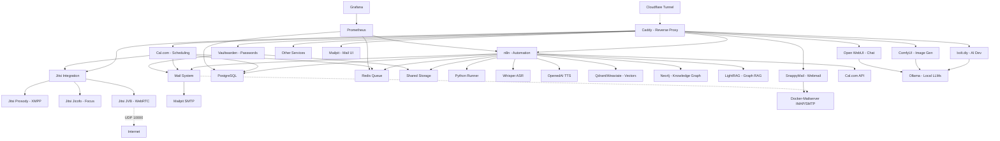

# 🚀 AI LaunchKit

<div align="center">

**Open-Source AI Development Toolkit**

*Deploy your complete AI stack in minutes, not weeks*

[](LICENSE)
[](https://github.com/freddy-schuetz/ai-launchkit)
[](https://github.com/kossakovsky/n8n-installer)

[Installation](#-installation) • [Features](#-whats-included) • [Documentation](#-documentation) • [Support](#-support)

</div>

---

## 🎯 What is AI LaunchKit?

AI LaunchKit is a comprehensive, self-hosted AI development environment that deploys **50+ pre-configured tools** with a single command. Build AI applications, automate workflows, generate images, and develop with AI assistance - all running on your own infrastructure.

Originally forked from [n8n-installer](https://github.com/kossakovsky/n8n-installer), AI LaunchKit has evolved into a complete AI development platform, maintained by [Friedemann Schuetz](https://www.linkedin.com/in/friedemann-schuetz).

### 🎬 Quick Demo

```bash
# One command to rule them all
git clone https://github.com/freddy-schuetz/ai-launchkit && cd ai-launchkit && sudo bash ./scripts/install.sh
```

**That's it!** Your AI development stack is ready in ~10-15 minutes.

**ATTENTION!** The AI LaunchKit is currently in development. It is regularly tested and updated. However, use is at your own risk!

---

## ✨ What's Included

### 📧 Mail System

| Tool | Description | Always Active | Purpose |
|------|-------------|---------------|----------|
| **[Mailpit](https://github.com/axllent/mailpit)** | Mail catcher with web UI Access: `mail.yourdomain.com` | ✅ Yes | Development/Testing - captures all emails |
| **[Docker-Mailserver](https://github.com/docker-mailserver/docker-mailserver)** | Production mail server | ⚡ Optional | Real email delivery for production |
| **[SnappyMail](https://github.com/the-djmaze/snappymail)** | Modern webmail client Access: `webmail.yourdomain.com` | ⚡ Optional | Web interface for Docker-Mailserver |

**Mail Configuration:**
- Mailpit automatically configured for all services (always active)
- Docker-Mailserver available for production email delivery (optional)
- SnappyMail provides a modern web interface for email access (optional, requires Docker-Mailserver)
- Web UI to view all captured emails
- Zero manual configuration needed!

### 🔧 Workflow Automation

| Tool | Description | Use Cases | Access |
|------|-------------|-----------|--------|
| **[n8n](https://github.com/n8n-io/n8n)** | Visual workflow automation platform | API integrations, data pipelines, business automation | `n8n.yourdomain.com` |
| **[n8n-MCP](https://github.com/czlonkowski/n8n-mcp)** | AI workflow generator for n8n | Claude/Cursor integration, 525+ node docs, workflow validation | `n8nmcp.yourdomain.com` |
| **300+ Workflows** | Pre-built n8n templates | Email automation, social media, data sync, AI workflows | Imported on install |

### 🎯 User Interfaces

| Tool | Description | Use Cases | Access |
|------|-------------|-----------|--------|
| **[Open WebUI](https://github.com/open-webui/open-webui)** | ChatGPT-like interface for LLMs | AI chat, model switching, conversation management | `webui.yourdomain.com` |
| **[Postiz](https://github.com/gitroomhq/postiz-app)** | Social media management platform | Content scheduling, analytics, multi-platform posting | `postiz.yourdomain.com` |

### 📹 Video Conferencing

| Tool | Description | Use Cases | Access |
|------|-------------|-----------|--------|
| **[Jitsi Meet](https://github.com/jitsi/jitsi-meet)** ⚠️ | Professional video conferencing platform | Client meetings, team calls, webinars, Cal.com integration | `meet.yourdomain.com` |

**⚠️ Jitsi Meet Requirements:**
- **CRITICAL:** Requires UDP Port 10000 for WebRTC audio/video
- Many VPS providers block UDP traffic by default
- Without UDP 10000: Only chat works, no audio/video!
- Test UDP connectivity before production use
- Alternative: Use external services (Zoom, Google Meet) with Cal.com

### 💼 Business & Productivity

| Tool | Description | Use Cases | Access |
|------|-------------|-----------|--------|
| **[Cal.com](https://github.com/calcom/cal.com)** | Open-source scheduling platform | Meeting bookings, team calendars, payment integrations | `cal.yourdomain.com` |
| **[Vikunja](https://github.com/go-vikunja/vikunja)** | Modern task management platform | Kanban boards, Gantt charts, team collaboration, CalDAV | `vikunja.yourdomain.com` |
| **[Leantime](https://github.com/Leantime/leantime)** | Goal-oriented project management suite | ADHD-friendly PM, time tracking, sprints, strategy tools | `leantime.yourdomain.com` |
| **[Kimai](https://github.com/kimai/kimai)** | Professional time tracking | DSGVO-compliant billing, team timesheets, API, 2FA, invoicing | `time.yourdomain.com` |
| **[Invoice Ninja](https://github.com/invoiceninja/invoiceninja)** | Professional invoicing & payment platform | Multi-currency invoices, 40+ payment gateways, recurring billing, client portal | `invoices.yourdomain.com` |
| **[Baserow](https://github.com/bram2w/baserow)** | Airtable Alternative with real-time collaboration | Database management, project tracking, collaborative workflows | `baserow.yourdomain.com` |
| **[NocoDB](https://github.com/nocodb/nocodb)** | Open-source Airtable alternative with API & webhooks | Smart spreadsheet UI, realtime collaboration, automation | `nocodb.yourdomain.com` |
| **[Formbricks](https://github.com/formbricks/formbricks)** | Privacy-first survey platform | Customer feedback, NPS surveys, market research, form builder, GDPR-compliant | `forms.yourdomain.com` |
| **[Metabase](https://github.com/metabase/metabase)** | User-friendly business intelligence platform | No-code dashboards, automated reports, data exploration, team analytics | `analytics.yourdomain.com` |
| **[Odoo 18](https://github.com/odoo/odoo)** | Open Source ERP/CRM with AI features | Sales automation, inventory, accounting, AI lead scoring | `odoo.yourdomain.com` |
| **[Twenty CRM](https://github.com/twentyhq/twenty)** | Modern Notion-like CRM | Customer pipelines, GraphQL API, team collaboration, lightweight CRM for startups | `twenty.yourdomain.com` |
| **[EspoCRM](https://github.com/espocrm/espocrm)** | Full-featured CRM platform | Email campaigns, workflow automation, advanced reporting, role-based access | `espocrm.yourdomain.com` |
| **[Mautic](https://github.com/mautic/mautic)** | Marketing automation platform | Lead scoring, email campaigns, landing pages, multi-channel marketing, automation workflows | `mautic.yourdomain.com` |

### 🎨 AI Content Generation

| Tool | Description | Use Cases | Access |
|------|-------------|-----------|--------|
| **[ComfyUI](https://github.com/comfyanonymous/ComfyUI)** | Node-based Stable Diffusion interface | Image generation, AI art, photo editing, workflows | `comfyui.yourdomain.com` |

### 💻 AI-Powered Development / Vibe Coding

| Tool | Description | Use Cases | Access |
|------|-------------|-----------|--------|
| **[bolt.diy](https://github.com/stackblitz-labs/bolt.diy)** | Build full-stack apps with prompts | Rapid prototyping, MVP creation, learning to code | `bolt.yourdomain.com` |
| **[OpenUI](https://github.com/wandb/openui)** 🧪 | AI-powered UI component generation | Design systems, component libraries, mockups | `openui.yourdomain.com` |

### 🤖 AI Agents

| Tool | Description | Use Cases | Access |
|------|-------------|-----------|--------|
| **[Flowise](https://github.com/FlowiseAI/Flowise)** | Visual AI agent builder | Chatbots, customer support, AI workflows | `flowise.yourdomain.com` |
| **[LiveKit](https://github.com/livekit/livekit)** + Agents | Real-time voice agents with WebRTC (auto-uses Whisper/TTS/Ollama or OpenAI) | AI voice assistants, conversational AI, ChatGPT-like voice bots, requires UDP 50000-50100 | `livekit.yourdomain.com` |
| **[Dify](https://github.com/langgenius/dify)** | LLMOps platform for AI apps | Production AI apps, model management, prompt engineering | `dify.yourdomain.com` |
| **[Letta](https://github.com/letta-ai/letta)** | Stateful agent server | Persistent AI assistants, memory management | `letta.yourdomain.com` |
| **[Browser-use](https://github.com/browser-use/browser-use)** | LLM-powered browser control | Web scraping, form filling, automated testing | Internal API only |
| **[Skyvern](https://skyvern.com)** | Vision-based browser automation | Complex web tasks, CAPTCHA handling, dynamic sites | Internal API only |
| **[Browserless](https://browserless.io)** | Headless Chrome service | Puppeteer/Playwright hub, PDF generation, screenshots | Internal WebSocket |

### 📚 RAG Systems

| Tool | Description | Use Cases | Access |
|------|-------------|-----------|--------|
| **[RAGApp](https://github.com/ragapp/ragapp)** | Build RAG assistants over your data | Knowledge bases, document Q&A, research tools | `ragapp.yourdomain.com` |
| **[Qdrant](https://github.com/qdrant/qdrant)** | High-performance vector database | Semantic search, recommendations, RAG storage | `qdrant.yourdomain.com` |
| **[Weaviate](https://github.com/weaviate/weaviate)** | AI-native vector database | Hybrid search, multi-modal data, GraphQL API | `weaviate.yourdomain.com` |

### 🎙️ Speech, Language & Text Processing

| Tool | Description | Use Cases | Access |
|------|-------------|-----------|--------|
| **[Faster-Whisper](https://github.com/SYSTRAN/faster-whisper)** | OpenAI-compatible Speech-to-Text | Transcription, voice commands, meeting notes | Internal API |
| **[OpenedAI-Speech](https://github.com/matatonic/openedai-speech)** | OpenAI-compatible Text-to-Speech | Voice assistants, audiobooks, notifications | Internal API |
| **[TTS Chatterbox](https://github.com/resemble-ai/chatterbox)** | State-of-the-art TTS with emotion control & voice cloning | AI voices with emotional expression, voice synthesis, outperforms ElevenLabs | `chatterbox.yourdomain.com` |
| **[LibreTranslate](https://github.com/LibreTranslate/LibreTranslate)** | Self-hosted translation API | 50+ languages, document translation, privacy-focused | `translate.yourdomain.com` |
| **OCR Bundle: [Tesseract](https://github.com/tesseract-ocr/tesseract) & [EasyOCR](https://github.com/JaidedAI/EasyOCR)** | Dual OCR engines: Tesseract (fast) + EasyOCR (quality) | Text extraction from images/PDFs, receipt scanning, document digitization | Internal API |
| **[Scriberr](https://github.com/rishikanthc/Scriberr)** | AI audio transcription with WhisperX & speaker diarization | Meeting transcripts, podcast processing, call recordings, speaker identification | `scriberr.yourdomain.com` |
| **[Vexa](https://github.com/Vexa-ai/vexa)** | Real-time meeting transcription API | Live transcription for Google Meet & Teams, speaker identification, 99 languages, n8n integration | Internal API |

*If you have troubles installing or updating Vexa, please view this guide:* **[Vexa Workaround](https://github.com/freddy-schuetz/ai-launchkit/blob/main/vexa-troubleshooting-workarounds.md)**

### 🔍 Search & Web Data

| Tool | Description | Use Cases | Access |
|------|-------------|-----------|--------|
| **[SearXNG](https://github.com/searxng/searxng)** | Privacy-respecting metasearch engine | Web search for agents, no tracking, multiple sources | `searxng.yourdomain.com` |
| **[Perplexica](https://github.com/ItzCrazyKns/Perplexica)** | Open-source AI-powered search engine | Deep research, academic search, Perplexity AI alternative | `perplexica.yourdomain.com` |
| **[Crawl4Ai](https://github.com/unclecode/crawl4ai)** | AI-optimized web crawler | Web scraping, data extraction, site monitoring | Internal API |
| **[GPT Researcher](https://github.com/assafelovic/gpt-researcher)** | Autonomous research agent (2000+ word reports) | Comprehensive research reports, multi-source analysis, citations | `research.yourdomain.com` |
| **[Local Deep Research](https://github.com/langchain-ai/local-deep-researcher)** | LangChain's iterative deep research (~95% accuracy) | Fact-checking, detailed analysis, research loops with reflection | Internal API |

### 🧠 Knowledge Graphs

| Tool | Description | Use Cases | Access |
|------|-------------|-----------|--------|
| **[Neo4j](https://github.com/neo4j/neo4j)** | Graph database platform | Knowledge graphs, entity relationships, fraud detection, recommendations | `neo4j.yourdomain.com` |
| **[LightRAG](https://github.com/HKUDS/LightRAG)** | Graph-based RAG with entity extraction | Automatic knowledge graph creation, relationship mapping, complex queries | `lightrag.yourdomain.com` |

### 🎬 Media Processing Suite

Pre-installed in the n8n container for seamless media manipulation:

| Tool | Description | Use Cases |
|------|-------------|-----------|
| **[FFmpeg](https://github.com/FFmpeg/FFmpeg)** | Industry-standard multimedia framework | Video conversion, streaming, audio extraction |
| **[ImageMagick](https://github.com/ImageMagick/ImageMagick)** | Image manipulation toolkit | Format conversion, resizing, effects, thumbnails |
| **[ExifTool](https://github.com/exiftool/exiftool)** | Metadata management | Read/write EXIF, IPTC, XMP metadata |
| **[MediaInfo](https://github.com/MediaArea/MediaInfo)** | Media file analyzer | Codec detection, bitrate analysis, format info |
| **[SoX](http://sox.sourceforge.net/)** | Sound processing utility | Audio format conversion, effects, resampling |
| **[Ghostscript](https://github.com/ArtifexSoftware/ghostscript)** | PDF/PostScript processor | PDF manipulation, conversion, optimization |
| **Python3 + Libraries** | Pillow, OpenCV, NumPy, Pandas | Image processing, data analysis, automation |

### 🗄️ Data Infrastructure

| Tool | Description | Use Cases | Access |
|------|-------------|-----------|--------|
| **[Supabase](https://github.com/supabase/supabase)** | Open-source Firebase alternative | Instant APIs, auth, realtime, storage, edge functions | `supabase.yourdomain.com` |
| **[PostgreSQL 17](https://www.postgresql.org/)** | Advanced relational database | Primary database for n8n, Cal.com, and other services | Internal only |
| **[Redis](https://github.com/redis/redis)** | In-memory data store | Queue management, caching, session storage | Internal only |

### ⚙️ System Management

| Tool | Description | Use Cases | Access |
|------|-------------|-----------|--------|
| **[Vaultwarden](https://github.com/dani-garcia/vaultwarden)** | Bitwarden-compatible password manager | Credential management, team password sharing, auto-fill | `vault.yourdomain.com` |
| **[Caddy](https://github.com/caddyserver/caddy)** | Automatic HTTPS reverse proxy | SSL certificates, load balancing, routing | Automatic |
| **[Cloudflare Tunnel](https://github.com/cloudflare/cloudflared)** | Secure tunnel without port forwarding | Zero-trust access, DDoS protection, firewall bypass | Optional |
| **[Python Runner](https://github.com/n8n-io/n8n)** | Isolated Python environment | Execute Python scripts from n8n workflows | Internal only |
| **[Grafana](https://github.com/grafana/grafana)** | Metrics visualization platform | System monitoring, performance dashboards, alerting | `grafana.yourdomain.com` |
| **[Prometheus](https://github.com/prometheus/prometheus)** | Metrics collection & alerting | Time-series database, service monitoring, resource tracking | Internal only |
| **[Portainer](https://github.com/portainer/portainer)** | Docker management interface | Container monitoring, logs, restart services | `portainer.yourdomain.com` |

### 🧰 AI Support Tools

| Tool | Description | Use Cases | Access |
|------|-------------|-----------|--------|
| **[Ollama](https://github.com/ollama/ollama)** | Local LLM runtime | Run Llama, Mistral, Phi locally, API-compatible | `ollama.yourdomain.com` |
| **[Gotenberg](https://github.com/gotenberg/gotenberg)** | Universal document converter | HTML/Markdown → PDF, Office → PDF, merge PDFs | Internal API |
| **[Stirling-PDF](https://github.com/Stirling-Tools/Stirling-PDF)** | PDF toolkit | Split, merge, compress, OCR, sign PDFs | `pdf.yourdomain.com` |

### 🛡️ AI Security & Compliance

| Tool | Description | Use Cases | Access |
|------|-------------|-----------|--------|
| **[LLM Guard](https://github.com/protectai/llm-guard)** | Input/output filtering for LLMs | Prompt injection prevention, toxicity filtering, PII removal | Internal API |
| **[Microsoft Presidio](https://github.com/microsoft/presidio)** | PII detection & anonymization (English) | GDPR compliance, data protection, sensitive data handling | Internal API |
| **[Flair NER](https://github.com/flairNLP/flair)** | German PII detection | DSGVO compliance, German text processing, entity recognition | Internal API |

---

## 🚀 Quick Start

### Installation Command

```bash
git clone https://github.com/freddy-schuetz/ai-launchkit && cd ai-launchkit && sudo bash ./scripts/install.sh
```

### What the Installer Does

1. **Checks Prerequisites** - Verifies Docker, domain, and system requirements
2. **Configures Services** - Sets up environment variables and generates secure passwords
3. **Deploys Stack** - Starts all selected services with Docker Compose
4. **Obtains SSL Certificates** - Automatic HTTPS via Caddy
5. **Imports Workflows** - Optional: Downloads 300+ pre-built n8n templates
6. **Generates Report** - Provides access URLs and credentials

### After Installation

1. **Access n8n:** Navigate to `https://n8n.yourdomain.com`
2. **Create Admin Account:** First visitor becomes owner
3. **Configure API Keys:** Add OpenAI, Anthropic, Groq keys in `.env` file
4. **Explore Services:** Check the final report for all URLs and credentials
5. **Import Credentials to Vaultwarden:** Run `sudo bash ./scripts/download_credentials.sh`

### Installation Time

- **Base Installation:** 10-15 minutes
- **With Workflow Import:** +20-30 minutes (optional)
- **Total:** 15-45 minutes depending on selections

**System Requirements:**
- 4GB RAM minimum (8GB+ recommended)
- 40GB disk space (more for media/models)
- Ubuntu 22.04/24.04 or Debian 11/12
- Domain with wildcard DNS configured

---

## 📦 Installation - Detailliert

### Prerequisites

Before installing AI LaunchKit, ensure you have:

1. **Server:** Ubuntu 22.04/24.04 or Debian 11/12 LTS
   - 4GB RAM minimum (8GB+ recommended for AI workloads)
   - 40GB+ disk space (SSD recommended)
   - Root or sudo access

2. **Domain:** A registered domain with wildcard DNS
   ```
   A *.yourdomain.com -> YOUR_SERVER_IP
   ```

3. **Access:** SSH access to your server

### Step-by-Step Installation

#### Step 1: Connect to Your Server

```bash
# Connect via SSH
ssh root@YOUR_SERVER_IP

# Or with key authentication
ssh -i ~/.ssh/your-key.pem user@YOUR_SERVER_IP
```

#### Step 2: Clone Repository

```bash
# Clone AI LaunchKit
git clone https://github.com/freddy-schuetz/ai-launchkit

# Navigate into directory
cd ai-launchkit
```

#### Step 3: Run Installer

```bash
# Start installation wizard
sudo bash ./scripts/install.sh
```

#### Step 4: Answer Installation Prompts

The installer will ask you for:

**1. Domain Name:**
```
Enter your domain (e.g., example.com): yourdomain.com
```

**2. Email Address:**
```
Enter email for SSL certificates: admin@yourdomain.com
```

**3. API Keys (Optional):**
```
Enter OpenAI API key (or press Enter to skip): sk-...
Enter Anthropic API key (or press Enter to skip): sk-ant-...
Enter Groq API key (or press Enter to skip): gsk_...
```

**4. Community Workflows (Optional):**
```
Import 300+ n8n community workflows? [y/N]: y
```
*Note: This takes 20-30 minutes extra*

**5. Worker Configuration:**
```
How many n8n workers? (1-4): 2
```

**6. Service Selection:**
```
Install Docker-Mailserver for production email? [y/N]: n
Install SnappyMail webmail client? [y/N]: n
Install Jitsi Meet? [y/N]: y
... (and more services)
```

#### Step 5: Installation Progress

The installer will now:
1. ✅ Install Docker and Docker Compose
2. ✅ Generate secure passwords
3. ✅ Configure services
4. ✅ Start Docker containers
5. ✅ Request SSL certificates
6. ✅ Import workflows (if selected)
7. ✅ Generate final report

#### Step 6: Save Installation Report

At the end, you'll see:

```
================================
Installation Complete! 🎉
================================

Access URLs:
  n8n: https://n8n.yourdomain.com
  bolt.diy: https://bolt.yourdomain.com
  Mailpit: https://mail.yourdomain.com
  ... (more services)

Credentials saved to: installation_report.txt

Download with:
sudo bash ./scripts/download_credentials.sh
```

**Important:** Save `installation_report.txt` - it contains all passwords!

### Post-Installation Steps

#### First Login to Services

**n8n (Workflow Automation):**
1. Open `https://n8n.yourdomain.com`
2. First visitor creates owner account
3. Choose strong password (min 8 characters)
4. Setup complete!

**Vaultwarden (Password Manager):**
1. Open `https://vault.yourdomain.com`
2. Click "Create Account"
3. Set master password (very strong!)
4. Import AI LaunchKit credentials:
   ```bash
   sudo bash ./scripts/download_credentials.sh
   ```
5. Download JSON file and import in Vaultwarden

**Other Services:**
- Most services: First user = admin
- Some require credentials from `.env` file
- Check `installation_report.txt` for details

#### Configure API Keys (Optional)

If you skipped API keys during installation:

```bash
# Edit environment file
nano .env

# Add your keys:
OPENAI_API_KEY=sk-your-key-here
ANTHROPIC_API_KEY=sk-ant-your-key-here
GROQ_API_KEY=gsk_your-key-here

# Save and exit (Ctrl+X, Y, Enter)

# Apply changes
docker compose restart
```

#### DNS Verification

Ensure your domains are resolving correctly:

```bash
# Test DNS resolution
nslookup n8n.yourdomain.com
nslookup bolt.yourdomain.com

# Test HTTPS access
curl -I https://n8n.yourdomain.com
# Should return: HTTP/2 200
```

#### Firewall Check

Verify firewall rules are correct:

```bash
sudo ufw status

# Should show:
# 22/tcp                     ALLOW       Anywhere
# 80/tcp                     ALLOW       Anywhere
# 443/tcp                    ALLOW       Anywhere
```

### Optional: Docker-Mailserver Setup

If you selected Docker-Mailserver for production email:

#### Add Email Accounts

```bash
# Create first email account
docker exec -it mailserver setup email add admin@yourdomain.com

# Create additional accounts
docker exec -it mailserver setup email add noreply@yourdomain.com
docker exec -it mailserver setup email add support@yourdomain.com

# List all accounts
docker exec mailserver setup email list
```

#### Configure DNS for Email

**Required DNS Records:**

```
# MX Record
Type: MX
Name: @
Value: mail.yourdomain.com
Priority: 10

# A Record for mail
Type: A  
Name: mail
Value: YOUR_SERVER_IP

# SPF Record
Type: TXT
Name: @
Value: v=spf1 mx ~all

# DMARC Record
Type: TXT
Name: _dmarc
Value: v=DMARC1; p=none; rua=mailto:postmaster@yourdomain.com
```

#### Generate DKIM Keys

```bash
# Generate DKIM signature
docker exec mailserver setup config dkim

# Get public key for DNS
docker exec mailserver cat /tmp/docker-mailserver/opendkim/keys/yourdomain.com/mail.txt

# Add as TXT record:
# Name: mail._domainkey
# Value: (paste the key from above)
```

### Troubleshooting Installation

#### Services Won't Start

```bash
# Check Docker is running
sudo systemctl status docker

# Check specific service logs
docker compose logs [service-name] --tail 50

# Common issues:
# - Not enough RAM: Reduce services or upgrade server
# - Port conflicts: Check if ports 80/443 are free
# - DNS not ready: Wait 15 minutes for propagation
```

#### SSL Certificate Errors

```bash
# Caddy might take a few minutes to get certificates
# Check Caddy logs:
docker compose logs caddy --tail 50

# If problems persist:
# 1. Verify DNS is correct
# 2. Check firewall allows 80/443
# 3. Restart Caddy
docker compose restart caddy
```

#### Docker Issues

```bash
# Restart Docker daemon
sudo systemctl restart docker

# Reset Docker network (if needed)
docker network prune -f

# Restart all services
cd ai-launchkit
docker compose restart
```

---

## 🔄 Update - Detailliert

### When to Update

Update AI LaunchKit when:
- New features are released
- Security patches are available
- Bug fixes are published
- You want the latest service versions

**Check for updates:**
```bash
cd ai-launchkit
git fetch origin
git log HEAD..origin/main --oneline
```

### Backup Before Update

**CRITICAL:** Always backup before updating!

```bash
# Navigate to AI LaunchKit
cd ai-launchkit

# Backup all Docker volumes
tar czf backup-$(date +%Y%m%d).tar.gz \
  /var/lib/docker/volumes/localai_*

# Backup PostgreSQL database
docker exec postgres pg_dumpall -U postgres > backup-$(date +%Y%m%d).sql

# Backup .env file
cp .env .env.backup

# Backup Docker Compose
cp docker-compose.yml docker-compose.yml.backup
```

**Move backups to safe location:**
```bash
# Create backup directory
mkdir -p ~/ai-launchkit-backups

# Move backups
mv backup-*.tar.gz ~/ai-launchkit-backups/
mv backup-*.sql ~/ai-launchkit-backups/

# Verify backups exist
ls -lh ~/ai-launchkit-backups/
```

### Update Procedure

#### Standard Update Process

```bash
# 1. Navigate to AI LaunchKit
cd ai-launchkit

# 2. Stop all services gracefully
docker compose down

# 3. Backup (see section above)
# ... (perform backups)

# 4. Pull latest changes
git pull

# 5. Pull new Docker images
docker compose pull

# 6. Start services with new images
docker compose up -d

# 7. Check service status
docker compose ps

# 8. Monitor logs for issues
docker compose logs -f --tail 100
```

#### Update with Service Changes

If the update adds new services or changes configuration:

```bash
# 1. Stop services
docker compose down

# 2. Backup everything
# ... (perform backups)

# 3. Pull latest code
git pull

# 4. Review .env.example for new variables
diff .env .env.example

# 5. Add new variables to .env
nano .env
# Add any new required variables

# 6. Pull new images
docker compose pull

# 7. Recreate services with new config
docker compose up -d --force-recreate

# 8. Verify all services started
docker compose ps
```

### PostgreSQL Version Handling

**Important:** AI LaunchKit pins PostgreSQL to version 17 to prevent automatic upgrades.

#### Check Current PostgreSQL Version

```bash
docker exec postgres postgres --version
```

#### If You Have PostgreSQL 18

If you installed after September 26, 2025 and have PostgreSQL 18:

```bash
# Pin to PostgreSQL 18 in .env
echo "POSTGRES_VERSION=18" >> .env

# Update safely
bash scripts/update.sh
```

#### If You Experience Database Errors

If you see "database files are incompatible" errors:

<details>
<summary><b>Emergency Recovery Steps</b></summary>

```bash
# 1. BACKUP YOUR DATA (CRITICAL!)
docker exec postgres pg_dumpall -U postgres > emergency-backup.sql

# 2. Stop all services
docker compose down

# 3. Remove incompatible volume
docker volume rm localai_postgres_data

# 4. Pull latest fixes
git pull

# 5. Start PostgreSQL (now pinned to v17)
docker compose up -d postgres
sleep 10

# 6. Restore your data
docker exec -i postgres psql -U postgres < emergency-backup.sql

# 7. Start all services
docker compose up -d
```

</details>

#### Version Verification

After update, verify versions:

```bash
docker exec postgres postgres --version
# Should show: PostgreSQL 17.x or 18.x (if pinned)
```

### Post-Update Verification

#### Check Service Status

```bash
# View all services
docker compose ps

# All should show: STATUS = Up
# If any show "Restarting" wait 2-3 minutes, then check logs:
docker compose logs [service-name] --tail 50
```

#### Test Key Services

**n8n:**
```bash
curl -I https://n8n.yourdomain.com
# Should return: HTTP/2 200
```

**Database:**
```bash
docker exec postgres pg_isready -U postgres
# Should return: accepting connections
```

**Redis:**
```bash
docker exec redis redis-cli ping
# Should return: PONG
```

#### Monitor Resource Usage

```bash
# Check memory and CPU
docker stats --no-stream

# Check disk space
df -h
```

#### Verify Workflows Still Run

1. Open n8n: `https://n8n.yourdomain.com`
2. Open a test workflow
3. Click "Execute Workflow"
4. Verify it completes successfully

### Rollback Procedure

If the update causes issues, rollback to the previous version:

#### Quick Rollback

```bash
# 1. Navigate to AI LaunchKit
cd ai-launchkit

# 2. View commit history
git log --oneline -10

# 3. Rollback to previous commit
git reset --hard [previous-commit-hash]

# 4. Restore .env if needed
cp .env.backup .env

# 5. Restart with old version
docker compose down
docker compose up -d
```

#### Full Rollback with Data Restore

```bash
# 1. Stop services
docker compose down

# 2. Restore volumes from backup
tar xzf volumes-backup-YYYYMMDD.tar.gz

# 3. Restore PostgreSQL
docker compose up -d postgres
sleep 10
docker exec -i postgres psql -U postgres < backup-YYYYMMDD.sql

# 4. Start all services
docker compose up -d
```

### Service-Specific Updates

Some services may require additional steps:

#### ComfyUI Models

```bash
# Models are not automatically updated
# To update models, manually download new versions to:
/var/lib/docker/volumes/localai_comfyui_data/_data/models/
```

#### Ollama Models

```bash
# Update installed models
docker exec ollama ollama pull llama3.2
docker exec ollama ollama pull mistral
```

#### n8n Community Nodes

```bash
# Update community nodes
docker exec n8n npm update -g n8n

# Restart n8n
docker compose restart n8n
```

#### Supabase

```bash
# Supabase has multiple components
# All update together with docker compose pull
docker compose pull supabase-kong supabase-auth supabase-rest supabase-storage
docker compose up -d supabase-kong supabase-auth supabase-rest supabase-storage
```

### Update Troubleshooting

#### Services Won't Start After Update

```bash
# Check logs for specific error
docker compose logs [service-name] --tail 100

# Common fixes:
# 1. Recreate service
docker compose up -d --force-recreate [service-name]

# 2. Clear cache and restart
docker compose down
docker system prune -f
docker compose up -d

# 3. Restore from backup if needed
```

#### Database Connection Errors

```bash
# PostgreSQL not starting
docker compose logs postgres --tail 100

# Common causes:
# - Incompatible data format (see PostgreSQL section)
# - Corrupted data (restore from backup)
# - Insufficient disk space (check with df -h)
```

#### Port Conflicts After Update

```bash
# Check what's using the port
sudo lsof -i :80
sudo lsof -i :443

# Stop conflicting service
sudo systemctl stop [service-name]

# Or change port in .env
nano .env
# Change PORT_VARIABLE to different port
```

#### Missing Environment Variables

```bash
# Compare with .env.example
diff .env .env.example

# Add any missing variables
nano .env

# Restart services
docker compose restart
```

### Maintenance Updates

#### Regular Maintenance

```bash
# Clean up old Docker resources (monthly)
docker system prune -af --volumes

# Update system packages (monthly)
sudo apt update && sudo apt upgrade -y

# Check disk space (weekly)
df -h
docker system df
```

#### Security Updates

```bash
# Update OS security patches
sudo apt update
sudo apt upgrade -y

# Update Docker
sudo apt install docker-ce docker-ce-cli containerd.io

# Restart Docker daemon
sudo systemctl restart docker

# Restart all services
docker compose restart
```

### Update Best Practices

1. **Always Backup First** - Cannot stress this enough
2. **Test in Staging** - If you have a test environment
3. **Read Changelogs** - Know what's changing
4. **Update Off-Peak** - Minimize user impact
5. **Monitor After Update** - Watch logs for 24 hours
6. **Keep Backups** - Retain last 3-5 backups
7. **Document Changes** - Note what was updated and when

### Update Notifications

Stay informed about updates:

- **Watch GitHub Repository**: Get notifications for new releases
- **Join Community Forum**: [oTTomator Think Tank](https://thinktank.ottomator.ai/c/local-ai/18)
- **Discord** *(coming soon)*: Real-time update announcements

### Getting Help with Updates

If you encounter issues:

1. **Check Logs**: `docker compose logs [service]`
2. **Search Issues**: [GitHub Issues](https://github.com/freddy-schuetz/ai-launchkit/issues)
3. **Community Forum**: Ask for help
4. **Rollback**: Use the procedure above if needed

---

**Next Steps:** After updating, explore the [Services section](#-services) for new features in each tool.

---

## 📧 Services

This section provides detailed information for each service, including setup, n8n integration examples, and troubleshooting.

<!-- Each service will be added as an expandable <details> section in Phase 2 -->

### Mail System

<details>
<summary><b>📧 Mailpit - Development Mail Catcher</b></summary>

### Was ist Mailpit?

Mailpit ist ein moderner Email-Testserver mit integrierter Web-UI. Er fängt alle ausgehenden E-Mails ab und zeigt sie in einer benutzerfreundlichen Oberfläche an - perfekt für Entwicklung und Testing.

### Features

- **Email Capture:** Fängt ALLE E-Mails aller Services ab
- **Web UI:** Modern, schnell, responsive Interface
- **Real-time Updates:** Neue E-Mails erscheinen sofort
- **Search & Filter:** Durchsuche E-Mails nach Absender, Betreff, etc.
- **API Access:** Programmgesteuerten Zugriff auf E-Mails
- **Zero Configuration:** Funktioniert out-of-the-box

### Initial Setup

**Mailpit ist bereits vorkonfiguriert!** Kein Setup erforderlich.

**Zugriff auf die Web-UI:**

1. Öffne `https://mail.yourdomain.com`
2. Keine Anmeldung erforderlich
3. Alle von Services gesendeten E-Mails erscheinen automatisch hier

**Alle Services sind vorkonfiguriert:**
- SMTP Host: `mailpit`
- SMTP Port: `1025`
- Keine Authentifizierung erforderlich
- Kein SSL/TLS

### n8n Integration Setup

Mailpit ist **bereits in n8n vorkonfiguriert**. Alle "Send Email"-Nodes verwenden Mailpit automatisch.

**Email von n8n senden (bereits konfiguriert):**

1. Workflow erstellen
2. "Send Email" Node hinzufügen
3. Node ist bereits mit Mailpit konfiguriert
4. Email wird automatisch in Mailpit erfasst

**Internal URL für manuelle Konfiguration:** `http://mailpit:1025`

### Example Workflows

#### Example 1: Test Email senden

```javascript
// 1. Manual Trigger Node

// 2. Send Email Node (bereits vorkonfiguriert)
{
  "to": "test@example.com",
  "subject": "Test from AI LaunchKit",
  "text": "Diese E-Mail wurde von Mailpit erfasst!"
}

// 3. Mailpit Web-UI öffnen
// → E-Mail erscheint sofort bei mail.yourdomain.com
```

#### Example 2: Automatische Benachrichtigungen testen

```javascript
// 1. Webhook Trigger Node
// Empfängt POST von externem Service

// 2. Code Node - E-Mail formatieren
const emailData = {
  to: "admin@example.com",
  subject: `Neue Benachrichtigung: ${$json.event}`,
  html: `
    <h2>Event Details</h2>
    <p><strong>Type:</strong> ${$json.event}</p>
    <p><strong>Time:</strong> ${new Date().toLocaleString()}</p>
    <p><strong>Data:</strong> ${JSON.stringify($json.data, null, 2)}</p>
  `
};
return emailData;

// 3. Send Email Node
// → Sendet an Mailpit zur Überprüfung

// 4. In Mailpit Web-UI testen
// → HTML-Formatierung und Daten validieren
```

#### Example 3: Service-Email-Konfiguration testen

```javascript
// Cal.com, Vikunja, Invoice Ninja etc. testen
// Alle Services → Mailpit automatisch konfiguriert

// Test:
// 1. In Service eine Aktion ausführen (z.B. Meeting in Cal.com buchen)
// 2. Service sendet E-Mail
// 3. E-Mail in Mailpit Web-UI überprüfen
// 4. Format und Inhalt validieren

// Kein Code nötig - Services senden direkt an Mailpit!
```

### Troubleshooting

**E-Mails erscheinen nicht in Mailpit:**

```bash
# 1. Mailpit Status prüfen
docker ps | grep mailpit
# Should show: STATUS = Up

# 2. Mailpit Logs checken
docker logs mailpit --tail 50

# 3. SMTP-Verbindung testen
docker exec n8n nc -zv mailpit 1025
# Should return: Connection successful

# 4. Von anderem Container testen
docker exec -it [service-name] sh
nc -zv mailpit 1025
```

**Mailpit Web-UI nicht erreichbar:**

```bash
# 1. Caddy Logs prüfen
docker logs caddy | grep mailpit

# 2. Mailpit Container neu starten
docker compose restart mailpit

# 3. Browser-Cache leeren
# STRG+F5 oder Inkognito-Modus

# 4. DNS prüfen
nslookup mail.yourdomain.com
# Should return your server IP
```

**Service kann keine E-Mails senden:**

```bash
# 1. Service SMTP-Einstellungen prüfen
docker exec [service] env | grep SMTP
# Should show: SMTP_HOST=mailpit, SMTP_PORT=1025

# 2. Docker Network prüfen
docker network inspect ai-launchkit_default | grep mailpit

# 3. Service Logs checken
docker logs [service] | grep -i "mail\|smtp"

# 4. Service neu starten
docker compose restart [service]
```

### Resources

- **GitHub:** https://github.com/axllent/mailpit
- **Documentation:** https://mailpit.axllent.org/docs/
- **API Documentation:** https://mailpit.axllent.org/docs/api/
- **Web-UI:** `https://mail.yourdomain.com`

</details>

<details>
<summary><b>📬 Docker-Mailserver - Production Email</b></summary>

### Was ist Docker-Mailserver?

Docker-Mailserver ist ein vollwertiger, produktionsreifer Mail-Server (SMTP, IMAP) mit integriertem Spam-Schutz und Security-Features. Perfekt für echte Email-Zustellung in Produktion.

### Features

- **Full SMTP/IMAP Support:** Echte Email-Zustellung und -Empfang
- **DKIM/SPF/DMARC:** Konfiguriert für beste Zustellbarkeit
- **Rspamd Integration:** Automatischer Spam-Schutz
- **User Management:** Einfache CLI-Tools für Account-Verwaltung
- **Secure by Default:** TLS/STARTTLS, moderne Cipher Suites

### Initial Setup

**Voraussetzung:** Docker-Mailserver muss während der Installation ausgewählt worden sein.

#### 1. DNS Records konfigurieren

Diese DNS-Einträge sind **erforderlich** für die Email-Zustellung:

**MX Record:**
```
Type: MX
Name: @ (oder yourdomain.com)
Value: mail.yourdomain.com
Priority: 10
```

**A Record für mail subdomain:**
```
Type: A
Name: mail
Value: DEINE_SERVER_IP
```

**SPF Record:**
```
Type: TXT
Name: @ (oder yourdomain.com)
Value: "v=spf1 mx ~all"
```

**DMARC Record:**
```
Type: TXT
Name: _dmarc
Value: "v=DMARC1; p=none; rua=mailto:postmaster@yourdomain.com"
```

**DKIM Record (nach Installation):**
```bash
# DKIM Keys generieren
docker exec mailserver setup config dkim

# Public Key für DNS anzeigen
docker exec mailserver cat /tmp/docker-mailserver/opendkim/keys/yourdomain.com/mail.txt

# Als TXT Record hinzufügen:
# Name: mail._domainkey
# Value: (der angezeigte Key)
```

#### 2. Email-Accounts erstellen

```bash
# Ersten Account erstellen
docker exec -it mailserver setup email add admin@yourdomain.com

# Weitere Accounts hinzufügen
docker exec mailserver setup email add user@yourdomain.com
docker exec mailserver setup email add support@yourdomain.com

# Alle Accounts auflisten
docker exec mailserver setup email list
```

#### 3. Automatische Konfiguration

**Alle Services verwenden Docker-Mailserver automatisch:**
- SMTP Host: `mailserver`
- SMTP Port: `587`
- Security: STARTTLS
- Authentication: noreply@yourdomain.com
- Password: automatisch generiert (siehe `.env`)

### n8n Integration Setup

**SMTP Credentials in n8n erstellen:**

1. In n8n öffnen: `https://n8n.yourdomain.com`
2. Settings → Credentials → Add New
3. Credential Type: SMTP
4. Konfiguration:

```
Host: mailserver
Port: 587
User: noreply@yourdomain.com
Password: [siehe .env Datei - MAIL_NOREPLY_PASSWORD]
SSL/TLS: STARTTLS aktivieren
Sender Email: noreply@yourdomain.com
```

**Internal URL für HTTP Requests:** `http://mailserver:587`

### Example Workflows

#### Example 1: Produktions-Email senden

```javascript
// 1. Manual Trigger Node

// 2. Send Email Node
// → SMTP Credential auswählen (siehe Setup oben)
{
  "to": "kunde@example.com",
  "subject": "Bestellbestätigung #12345",
  "html": `
    <h1>Vielen Dank für Ihre Bestellung!</h1>
    <p>Ihre Bestellung wurde erfolgreich bearbeitet.</p>
    <p>Bestellnummer: #12345</p>
  `
}

// E-Mail wird über Docker-Mailserver versendet
// Empfänger erhält echte E-Mail
```

#### Example 2: Cal.com Booking Notifications

```javascript
// Cal.com sendet automatisch E-Mails über Docker-Mailserver:
// - Buchungsbestätigungen
// - Kalender-Einladungen (.ics)
// - Erinnerungen
// - Absagen/Umplanungen

// Keine Konfiguration nötig - automatisch!
// Alle Cal.com E-Mails → Docker-Mailserver → Empfänger
```

#### Example 3: Invoice Ninja Integration

```javascript
// Invoice Ninja SMTP konfigurieren:
// Settings → Email Settings → SMTP Configuration
// Host: mailserver
// Port: 587
// Encryption: TLS
// Username: noreply@yourdomain.com
// Password: [aus .env]

// Workflow-Beispiel:
// 1. Invoice Ninja erstellt Rechnung
// 2. Invoice Ninja sendet Email via Docker-Mailserver
// 3. Kunde erhält professionelle Rechnung per E-Mail
```

### Troubleshooting

**E-Mails werden nicht zugestellt:**

```bash
# 1. DNS Records prüfen
nslookup -type=MX yourdomain.com
nslookup -type=TXT yourdomain.com

# 2. Docker-Mailserver Logs checken
docker logs mailserver --tail 100

# 3. Mail Queue prüfen
docker exec mailserver postqueue -p

# 4. DKIM Status prüfen
docker exec mailserver setup config dkim status

# 5. Test-Email senden
docker exec mailserver setup email add test@yourdomain.com
# Dann von extern an test@yourdomain.com senden
```

**SMTP Authentication fehlschlägt:**

```bash
# 1. Account-Existenz prüfen
docker exec mailserver setup email list

# 2. Authentication testen
docker exec mailserver doveadm auth test noreply@yourdomain.com [password]

# 3. Password aus .env überprüfen
grep MAIL_NOREPLY_PASSWORD .env

# 4. Service neu starten
docker compose restart mailserver
```

**Spam-Probleme (E-Mails landen im Spam):**

```bash
# 1. DKIM, SPF, DMARC überprüfen
# Online-Tools nutzen: https://mxtoolbox.com/

# 2. IP-Reputation prüfen
# https://multirbl.valli.org/

# 3. Rspamd Logs prüfen
docker exec mailserver cat /var/log/rspamd/rspamd.log

# 4. Port 25 für ausgehende Mails testen
telnet smtp.gmail.com 25
```

**Docker-Mailserver startet nicht:**

```bash
# 1. Logs prüfen
docker logs mailserver --tail 100

# 2. Volumes prüfen
docker volume ls | grep mailserver

# 3. Ports prüfen (25, 465, 587, 993)
sudo netstat -tulpn | grep -E "25|465|587|993"

# 4. Container neu erstellen
docker compose up -d --force-recreate mailserver
```

### Resources

- **GitHub:** https://github.com/docker-mailserver/docker-mailserver
- **Documentation:** https://docker-mailserver.github.io/docker-mailserver/latest/
- **Setup Guide:** https://docker-mailserver.github.io/docker-mailserver/latest/usage/
- **Best Practices:** https://docker-mailserver.github.io/docker-mailserver/latest/faq/

</details>

<details>
<summary><b>✉️ SnappyMail - Webmail Client</b></summary>

### Was ist SnappyMail?

SnappyMail ist ein moderner, ultra-schneller Webmail-Client mit nur 138KB Ladezeit. Er bietet eine vollständige E-Mail-Oberfläche für Docker-Mailserver mit professionellen Features wie PGP-Verschlüsselung und Multi-Account-Support.

### Features

- **Ultra-fast Performance:** 138KB initial load, 99% Lighthouse score
- **Multiple Accounts:** Verwalte mehrere E-Mail-Accounts in einer Oberfläche
- **Mobile Responsive:** Funktioniert perfekt auf allen Geräten
- **PGP Encryption:** Integrierte Unterstützung für verschlüsselte E-Mails
- **2-Factor Authentication:** Erhöhte Sicherheit für Webmail-Zugriff
- **No Database Required:** Einfache dateibasierte Konfiguration
- **Dark Mode:** Integrierte Theme-Unterstützung

### Initial Setup

**Voraussetzung:** Docker-Mailserver muss installiert sein (SnappyMail benötigt IMAP/SMTP).

#### 1. Admin-Passwort abrufen

```bash
# Admin-Passwort anzeigen
docker exec snappymail cat /var/lib/snappymail/_data_/_default_/admin_password.txt
```

#### 2. Admin Panel konfigurieren

1. Öffne Admin Panel: `https://webmail.yourdomain.com/?admin`
2. Username: `admin`
3. Password: (aus Schritt 1)

#### 3. Domain hinzufügen

Im Admin Panel:

**Domains → Add Domain:**
```
Domain: yourdomain.com
IMAP Server: mailserver
IMAP Port: 143
IMAP Security: STARTTLS
SMTP Server: mailserver
SMTP Port: 587
SMTP Security: STARTTLS
```

#### 4. User Login

Nach Domain-Konfiguration können User sich einloggen:

1. URL: `https://webmail.yourdomain.com`
2. Email: `user@yourdomain.com`
3. Password: (Docker-Mailserver Passwort des Users)

### n8n Integration Setup

**SnappyMail ist ein Webmail-Client ohne direkte API.** Die Integration erfolgt über Docker-Mailserver:

**Email-Workflow-Architektur:**
```
n8n Send Email Node → Docker-Mailserver → SnappyMail (E-Mails lesen)
```

**IMAP-Integration in n8n (E-Mails abrufen):**

1. Email (IMAP) Trigger Node in n8n
2. Konfiguration:

```
Host: mailserver
Port: 993
User: user@yourdomain.com
Password: [Docker-Mailserver Password]
TLS: Aktiviert
```

**Internal URLs:**
- IMAP: `mailserver:993` (mit TLS) oder `mailserver:143` (STARTTLS)
- SMTP: `mailserver:587` (STARTTLS)

### Example Workflows

#### Example 1: E-Mail Management Workflow

```javascript
// SnappyMail Use Case: E-Mails über Web-UI verwalten

// Workflow-Architektur:
// 1. Service sendet E-Mail → Docker-Mailserver
// 2. User öffnet SnappyMail → Liest E-Mail
// 3. User antwortet → Über Docker-Mailserver versendet

// n8n Parallel-Workflow:
// 1. IMAP Trigger Node (mailserver:993)
//    → Neue E-Mails automatisch verarbeiten
// 2. Code Node - E-Mail analysieren
// 3. Conditional Node - Nach Kriterien filtern
// 4. Action Nodes - Automatisierte Aktionen
```

#### Example 2: Multi-Account Management

```javascript
// SnappyMail Feature: Mehrere Accounts verwalten

// Setup in SnappyMail:
// 1. User Login: user@yourdomain.com
// 2. Settings → Accounts → Add Account
// 3. Weitere Accounts hinzufügen (support@, sales@, etc.)
// 4. Zwischen Accounts wechseln mit einem Klick

// Alle E-Mails zentral verwalten!
```

#### Example 3: Ticket-System Integration

```javascript
// 1. IMAP Trigger Node (mailserver:993)
//    Mailbox: support@yourdomain.com
//    → Wartet auf neue Support-E-Mails

// 2. Code Node - Ticket-Daten extrahieren
const ticketData = {
  from: $json.from.value[0].address,
  subject: $json.subject,
  body: $json.textPlain || $json.textHtml,
  date: $json.date,
  priority: $json.subject.includes('URGENT') ? 'high' : 'normal'
};
return ticketData;

// 3. HTTP Request Node - Ticket erstellen
// POST zu Ticketing-System API
{
  "title": ticketData.subject,
  "description": ticketData.body,
  "customer_email": ticketData.from,
  "priority": ticketData.priority
}

// 4. Send Email Node - Bestätigung senden
// → Kunde erhält Ticket-Nummer
// → E-Mail in SnappyMail sichtbar

// Support-Team kann in SnappyMail antworten!
```

### Troubleshooting

**SnappyMail Web-UI nicht erreichbar:**

```bash
# 1. Container Status prüfen
docker ps | grep snappymail
# Should show: STATUS = Up

# 2. Logs checken
docker logs snappymail --tail 50

# 3. Admin-Passwort erneut abrufen
docker exec snappymail cat /var/lib/snappymail/_data_/_default_/admin_password.txt

# 4. Caddy Logs prüfen
docker logs caddy | grep snappymail

# 5. Container neu starten
docker compose restart snappymail
```

**User können sich nicht einloggen:**

```bash
# 1. Domain-Konfiguration prüfen
# → Admin Panel öffnen: https://webmail.yourdomain.com/?admin
# → Domains → Domain prüfen
# → IMAP/SMTP Settings verifizieren

# 2. User-Account in Docker-Mailserver prüfen
docker exec mailserver setup email list

# 3. IMAP/SMTP Verbindung testen
docker exec snappymail nc -zv mailserver 143
docker exec snappymail nc -zv mailserver 587

# 4. Authentication testen
docker exec mailserver doveadm auth test user@yourdomain.com [password]

# 5. User-spezifische Logs
docker logs snappymail | grep -i "login\|auth\|imap"
```

**E-Mails werden nicht angezeigt:**

```bash
# 1. IMAP-Connection prüfen
docker exec snappymail nc -zv mailserver 143

# 2. Mailbox in Docker-Mailserver prüfen
docker exec mailserver doveadm mailbox list -u user@yourdomain.com

# 3. E-Mail-Zustellung testen
# Test-E-Mail an user@yourdomain.com senden

# 4. Docker-Mailserver Logs
docker logs mailserver | grep user@yourdomain.com

# 5. SnappyMail Cache löschen
docker exec snappymail rm -rf /var/lib/snappymail/_data_/_default_/cache/*
docker compose restart snappymail
```

**Performance-Probleme:**

```bash
# 1. Cache-Größe prüfen
docker exec snappymail du -sh /var/lib/snappymail/_data_/_default_/cache/

# 2. Cache leeren (wenn zu groß)
docker exec snappymail rm -rf /var/lib/snappymail/_data_/_default_/cache/*

# 3. Container-Ressourcen prüfen
docker stats snappymail --no-stream

# 4. Logs auf Fehler prüfen
docker logs snappymail | grep -i "error\|warning"

# 5. Container neu starten
docker compose restart snappymail
```

### Resources

- **GitHub:** https://github.com/the-djmaze/snappymail
- **Documentation:** https://snappymail.eu/docs/
- **Demo:** https://snappymail.eu/demo/
- **Admin Guide:** https://snappymail.eu/docs/admin/
- **Web-UI:** `https://webmail.yourdomain.com`
- **Admin Panel:** `https://webmail.yourdomain.com/?admin`

</details>

### Workflow Automation

<details>
<summary><b>🔧 n8n - Workflow Automation Platform</b></summary>

<!-- TODO: Content will be added in Phase 2 -->

</details>

<details>
<summary><b>🤖 n8n-MCP - AI Workflow Generator</b></summary>

<!-- TODO: Content will be added in Phase 2 -->

</details>

### User Interfaces

<details>
<summary><b>💬 Open WebUI - ChatGPT Interface</b></summary>

<!-- TODO: Content will be added in Phase 2 -->

</details>

<details>
<summary><b>📱 Postiz - Social Media Management</b></summary>

<!-- TODO: Content will be added in Phase 2 -->

</details>

### Video Conferencing

<details>
<summary><b>📹 Jitsi Meet - Video Conferencing</b></summary>

<!-- TODO: Content will be added in Phase 2 -->

</details>

### Business & Productivity

<details>
<summary><b>📅 Cal.com - Scheduling Platform</b></summary>

<!-- TODO: Content will be added in Phase 2 -->

</details>

<details>
<summary><b>✅ Vikunja - Task Management</b></summary>

<!-- TODO: Content will be added in Phase 2 -->

</details>

<details>
<summary><b>🎯 Leantime - Project Management</b></summary>

<!-- TODO: Content will be added in Phase 2 -->

</details>

<details>
<summary><b>⏱️ Kimai - Time Tracking</b></summary>

<!-- TODO: Content will be added in Phase 2 -->

</details>

<details>
<summary><b>💰 Invoice Ninja - Invoicing Platform</b></summary>

<!-- TODO: Content will be added in Phase 2 -->

</details>

<details>
<summary><b>📊 Baserow - Airtable Alternative</b></summary>

<!-- TODO: Content will be added in Phase 2 -->

</details>

<details>
<summary><b>📋 NocoDB - Airtable Alternative</b></summary>

<!-- TODO: Content will be added in Phase 2 -->

</details>

<details>
<summary><b>📝 Formbricks - Survey Platform</b></summary>

<!-- TODO: Content will be added in Phase 2 -->

</details>

<details>
<summary><b>📈 Metabase - Business Intelligence</b></summary>

<!-- TODO: Content will be added in Phase 2 -->

</details>

<details>
<summary><b>🏢 Odoo 18 - ERP/CRM</b></summary>

<!-- TODO: Content will be added in Phase 2 -->

</details>

<details>
<summary><b>💼 Twenty CRM - Modern CRM</b></summary>

<!-- TODO: Content will be added in Phase 2 -->

</details>

<details>
<summary><b>📞 EspoCRM - CRM Platform</b></summary>

<!-- TODO: Content will be added in Phase 2 -->

</details>

<details>
<summary><b>📧 Mautic - Marketing Automation</b></summary>

<!-- TODO: Content will be added in Phase 2 -->

</details>

### AI Content Generation

<details>
<summary><b>🎨 ComfyUI - Image Generation</b></summary>

<!-- TODO: Content will be added in Phase 2 -->

</details>

### AI-Powered Development

<details>
<summary><b>⚡ bolt.diy - AI App Builder</b></summary>

<!-- TODO: Content will be added in Phase 2 -->

</details>

<details>
<summary><b>🎨 OpenUI - UI Component Generator</b></summary>

<!-- TODO: Content will be added in Phase 2 -->

</details>

### AI Agents

<details>
<summary><b>🤖 Flowise - Visual AI Builder</b></summary>

<!-- TODO: Content will be added in Phase 2 -->

</details>

<details>
<summary><b>🎙️ LiveKit - Voice Agents</b></summary>

<!-- TODO: Content will be added in Phase 2 -->

</details>

<details>
<summary><b>🧠 Dify - LLMOps Platform</b></summary>

<!-- TODO: Content will be added in Phase 2 -->

</details>

<details>
<summary><b>💾 Letta - Stateful Agents</b></summary>

<!-- TODO: Content will be added in Phase 2 -->

</details>

<details>
<summary><b>🌐 Browser-use - Browser Control</b></summary>

<!-- TODO: Content will be added in Phase 2 -->

</details>

<details>
<summary><b>👁️ Skyvern - Vision Automation</b></summary>

<!-- TODO: Content will be added in Phase 2 -->

</details>

<details>
<summary><b>🖥️ Browserless - Headless Chrome</b></summary>

<!-- TODO: Content will be added in Phase 2 -->

</details>

### RAG Systems

<details>
<summary><b>📚 RAGApp - RAG Assistant Builder</b></summary>

<!-- TODO: Content will be added in Phase 2 -->

</details>

<details>
<summary><b>🔍 Qdrant - Vector Database</b></summary>

<!-- TODO: Content will be added in Phase 2 -->

</details>

<details>
<summary><b>🗄️ Weaviate - AI Vector Database</b></summary>

<!-- TODO: Content will be added in Phase 2 -->

</details>

### Speech & Language

<details>
<summary><b>🎤 Faster-Whisper - Speech-to-Text</b></summary>

<!-- TODO: Content will be added in Phase 2 -->

</details>

<details>
<summary><b>🔊 OpenedAI-Speech - Text-to-Speech</b></summary>

<!-- TODO: Content will be added in Phase 2 -->

</details>

<details>
<summary><b>🗣️ TTS Chatterbox - Advanced TTS</b></summary>

<!-- TODO: Content will be added in Phase 2 -->

</details>

<details>
<summary><b>🌍 LibreTranslate - Translation API</b></summary>

<!-- TODO: Content will be added in Phase 2 -->

</details>

<details>
<summary><b>👁️ OCR Bundle - Text Extraction</b></summary>

<!-- TODO: Content will be added in Phase 2 -->

</details>

<details>
<summary><b>📝 Scriberr - Audio Transcription</b></summary>

<!-- TODO: Content will be added in Phase 2 -->

</details>

<details>
<summary><b>📞 Vexa - Meeting Transcription</b></summary>

<!-- TODO: Content will be added in Phase 2 -->

</details>

### Search & Web Data

<details>
<summary><b>🔍 SearXNG - Privacy Search</b></summary>

<!-- TODO: Content will be added in Phase 2 -->

</details>

<details>
<summary><b>🔎 Perplexica - AI Search</b></summary>

<!-- TODO: Content will be added in Phase 2 -->

</details>

<details>
<summary><b>🕷️ Crawl4Ai - Web Crawler</b></summary>

<!-- TODO: Content will be added in Phase 2 -->

</details>

<details>
<summary><b>📊 GPT Researcher - Research Agent</b></summary>

<!-- TODO: Content will be added in Phase 2 -->

</details>

<details>
<summary><b>🔬 Local Deep Research - Iterative Research</b></summary>

<!-- TODO: Content will be added in Phase 2 -->

</details>

### Knowledge Graphs

<details>
<summary><b>🕸️ Neo4j - Graph Database</b></summary>

<!-- TODO: Content will be added in Phase 2 -->

</details>

<details>
<summary><b>🔗 LightRAG - Graph-Based RAG</b></summary>

<!-- TODO: Content will be added in Phase 2 -->

</details>

### Media Processing Suite

<details>
<summary><b>🎬 Media Processing Tools</b></summary>

<!-- TODO: Content will be added in Phase 2 -->
**Tools included:**
- FFmpeg
- ImageMagick
- ExifTool
- MediaInfo
- SoX
- Ghostscript
- Python3 with libraries

</details>

### Data Infrastructure

<details>
<summary><b>🔥 Supabase - Firebase Alternative</b></summary>

<!-- TODO: Content will be added in Phase 2 -->

</details>

<details>
<summary><b>🐘 PostgreSQL - Relational Database</b></summary>

<!-- TODO: Content will be added in Phase 2 -->

</details>

<details>
<summary><b>⚡ Redis - In-Memory Store</b></summary>

<!-- TODO: Content will be added in Phase 2 -->

</details>

### System Management

<details>
<summary><b>🔐 Vaultwarden - Password Manager</b></summary>

<!-- TODO: Content will be added in Phase 2 -->

</details>

<details>
<summary><b>🌐 Caddy - Web Server</b></summary>

<!-- TODO: Content will be added in Phase 2 -->

</details>

<details>
<summary><b>☁️ Cloudflare Tunnel - Secure Access</b></summary>

<!-- TODO: Content will be added in Phase 2 -->

</details>

<details>
<summary><b>🐍 Python Runner - Script Execution</b></summary>

<!-- TODO: Content will be added in Phase 2 -->

</details>

<details>
<summary><b>📊 Grafana - Metrics Visualization</b></summary>

<!-- TODO: Content will be added in Phase 2 -->

</details>

<details>
<summary><b>📈 Prometheus - Monitoring</b></summary>

<!-- TODO: Content will be added in Phase 2 -->

</details>

<details>
<summary><b>🐳 Portainer - Container Management</b></summary>

<!-- TODO: Content will be added in Phase 2 -->

</details>

### AI Support Tools

<details>
<summary><b>🦙 Ollama - Local LLMs</b></summary>

<!-- TODO: Content will be added in Phase 2 -->

</details>

<details>
<summary><b>📄 Gotenberg - Document Converter</b></summary>

<!-- TODO: Content will be added in Phase 2 -->

</details>

<details>
<summary><b>📋 Stirling-PDF - PDF Toolkit</b></summary>

<!-- TODO: Content will be added in Phase 2 -->

</details>

### AI Security & Compliance

<details>
<summary><b>🛡️ LLM Guard - Input/Output Filtering</b></summary>

<!-- TODO: Content will be added in Phase 2 -->

</details>

<details>
<summary><b>🔒 Microsoft Presidio - PII Detection (English)</b></summary>

<!-- TODO: Content will be added in Phase 2 -->

</details>

<details>
<summary><b>🇩🇪 Flair NER - PII Detection (German)</b></summary>

<!-- TODO: Content will be added in Phase 2 -->

</details>

---

## 💡 Support & FAQ

<!-- TODO: Support section will be added in Phase 2, Step N -->

### Common Issues

<details>
<summary><b>🚨 502 Bad Gateway Errors</b></summary>

<!-- TODO: Content will be added -->

</details>

<details>
<summary><b>📧 Mail System Issues</b></summary>

<!-- TODO: Content will be added -->

</details>

<details>
<summary><b>🐳 Docker & Network Issues</b></summary>

<!-- TODO: Content will be added -->

</details>

<details>
<summary><b>⚡ Performance Issues</b></summary>

<!-- TODO: Content will be added -->

</details>

<details>
<summary><b>⚠️ General Troubleshooting</b></summary>

<!-- TODO: Content will be added -->

</details>

### Getting Help

**Community Resources:**
- **Discord**: [Join our community](https://discord.gg/ai-launchkit) *(coming soon)*
- **Forum**: [oTTomator Think Tank](https://thinktank.ottomator.ai/c/local-ai/18)
- **Issues**: [GitHub Issues](https://github.com/freddy-schuetz/ai-launchkit/issues)

**Before Creating an Issue:**
1. Check existing GitHub Issues
2. Search the Community Forum
3. Provide:
   - Your server specs
   - Services selected during installation
   - Error messages from `docker logs`
   - Output of `docker ps` and `docker stats`

---

## 🏗️ Architecture



---

## 👥 Contributors

Created and maintained by [Friedemann Schuetz](https://www.linkedin.com/in/friedemann-schuetz)

**Based on:**
- [n8n-installer](https://github.com/kossakovsky/n8n-installer) by kossakovsky
- [self-hosted-ai-starter-kit](https://github.com/n8n-io/self-hosted-ai-starter-kit) by n8n team
- [local-ai-packaged](https://github.com/coleam00/local-ai-packaged) by coleam00

[View all contributors](https://github.com/freddy-schuetz/ai-launchkit/graphs/contributors)

---

## 📜 License

This project is licensed under the Apache License 2.0 - see the [LICENSE](LICENSE) file for details.

---

<div align="center">

**Ready to launch your AI projects?**

[⭐ Star this repo](https://github.com/freddy-schuetz/ai-launchkit) • [🐛 Report issues](https://github.com/freddy-schuetz/ai-launchkit/issues) • [🤝 Contribute](https://github.com/freddy-schuetz/ai-launchkit/pulls)

</div>
