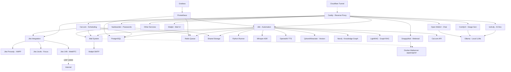

# 🚀 AI LaunchKit

<div align="center">

**Open-Source AI Development Toolkit**

*Deploy your complete AI stack in minutes, not weeks*

[](LICENSE)
[](https://github.com/freddy-schuetz/ai-launchkit)
[](https://github.com/kossakovsky/n8n-installer)

[Installation](#-installation) • [Features](#-whats-included) • [Documentation](#-documentation) • [Support](#-support)

</div>

---

## 🎯 What is AI LaunchKit?

AI LaunchKit is a comprehensive, self-hosted AI development environment that deploys **50+ pre-configured tools** with a single command. Build AI applications, automate workflows, generate images, and develop with AI assistance - all running on your own infrastructure.

Originally forked from [n8n-installer](https://github.com/kossakovsky/n8n-installer), AI LaunchKit has evolved into a complete AI development platform, maintained by [Friedemann Schuetz](https://www.linkedin.com/in/friedemann-schuetz).

### 🎬 Quick Demo

```bash
# One command to rule them all
git clone https://github.com/freddy-schuetz/ai-launchkit && cd ai-launchkit && sudo bash ./scripts/install.sh
```

**That's it!** Your AI development stack is ready in ~10-15 minutes.

**ATTENTION!** The AI LaunchKit is currently in development. It is regularly tested and updated. However, use is at your own risk!

---

## ✨ What's Included

### 📧 Mail System

| Tool | Description | Always Active | Purpose |
|------|-------------|---------------|----------|
| **[Mailpit](https://github.com/axllent/mailpit)** | Mail catcher with web UI Access: `mail.yourdomain.com` | ✅ Yes | Development/Testing - captures all emails |
| **[Docker-Mailserver](https://github.com/docker-mailserver/docker-mailserver)** | Production mail server | ⚡ Optional | Real email delivery for production |
| **[SnappyMail](https://github.com/the-djmaze/snappymail)** | Modern webmail client Access: `webmail.yourdomain.com` | ⚡ Optional | Web interface for Docker-Mailserver |

**Mail Configuration:**
- Mailpit automatically configured for all services (always active)
- Docker-Mailserver available for production email delivery (optional)
- SnappyMail provides a modern web interface for email access (optional, requires Docker-Mailserver)
- Web UI to view all captured emails
- Zero manual configuration needed!

### 🔧 Workflow Automation

| Tool | Description | Use Cases | Access |
|------|-------------|-----------|--------|
| **[n8n](https://github.com/n8n-io/n8n)** | Visual workflow automation platform | API integrations, data pipelines, business automation | `n8n.yourdomain.com` |
| **[n8n-MCP](https://github.com/czlonkowski/n8n-mcp)** | AI workflow generator for n8n | Claude/Cursor integration, 525+ node docs, workflow validation | `n8nmcp.yourdomain.com` |
| **300+ Workflows** | Pre-built n8n templates | Email automation, social media, data sync, AI workflows | Imported on install |

### 🎯 User Interfaces

| Tool | Description | Use Cases | Access |
|------|-------------|-----------|--------|
| **[Open WebUI](https://github.com/open-webui/open-webui)** | ChatGPT-like interface for LLMs | AI chat, model switching, conversation management | `webui.yourdomain.com` |
| **[Postiz](https://github.com/gitroomhq/postiz-app)** | Social media management platform | Content scheduling, analytics, multi-platform posting | `postiz.yourdomain.com` |

### 📹 Video Conferencing

| Tool | Description | Use Cases | Access |
|------|-------------|-----------|--------|
| **[Jitsi Meet](https://github.com/jitsi/jitsi-meet)** ⚠️ | Professional video conferencing platform | Client meetings, team calls, webinars, Cal.com integration | `meet.yourdomain.com` |

**⚠️ Jitsi Meet Requirements:**
- **CRITICAL:** Requires UDP Port 10000 for WebRTC audio/video
- Many VPS providers block UDP traffic by default
- Without UDP 10000: Only chat works, no audio/video!
- Test UDP connectivity before production use
- Alternative: Use external services (Zoom, Google Meet) with Cal.com

### 💼 Business & Productivity

| Tool | Description | Use Cases | Access |
|------|-------------|-----------|--------|
| **[Cal.com](https://github.com/calcom/cal.com)** | Open-source scheduling platform | Meeting bookings, team calendars, payment integrations | `cal.yourdomain.com` |
| **[Vikunja](https://github.com/go-vikunja/vikunja)** | Modern task management platform | Kanban boards, Gantt charts, team collaboration, CalDAV | `vikunja.yourdomain.com` |
| **[Leantime](https://github.com/Leantime/leantime)** | Goal-oriented project management suite | ADHD-friendly PM, time tracking, sprints, strategy tools | `leantime.yourdomain.com` |
| **[Kimai](https://github.com/kimai/kimai)** | Professional time tracking | DSGVO-compliant billing, team timesheets, API, 2FA, invoicing | `time.yourdomain.com` |
| **[Invoice Ninja](https://github.com/invoiceninja/invoiceninja)** | Professional invoicing & payment platform | Multi-currency invoices, 40+ payment gateways, recurring billing, client portal | `invoices.yourdomain.com` |
| **[Baserow](https://github.com/bram2w/baserow)** | Airtable Alternative with real-time collaboration | Database management, project tracking, collaborative workflows | `baserow.yourdomain.com` |
| **[NocoDB](https://github.com/nocodb/nocodb)** | Open-source Airtable alternative with API & webhooks | Smart spreadsheet UI, realtime collaboration, automation | `nocodb.yourdomain.com` |
| **[Formbricks](https://github.com/formbricks/formbricks)** | Privacy-first survey platform | Customer feedback, NPS surveys, market research, form builder, GDPR-compliant | `forms.yourdomain.com` |
| **[Metabase](https://github.com/metabase/metabase)** | User-friendly business intelligence platform | No-code dashboards, automated reports, data exploration, team analytics | `analytics.yourdomain.com` |
| **[Odoo 18](https://github.com/odoo/odoo)** | Open Source ERP/CRM with AI features | Sales automation, inventory, accounting, AI lead scoring | `odoo.yourdomain.com` |
| **[Twenty CRM](https://github.com/twentyhq/twenty)** | Modern Notion-like CRM | Customer pipelines, GraphQL API, team collaboration, lightweight CRM for startups | `twenty.yourdomain.com` |
| **[EspoCRM](https://github.com/espocrm/espocrm)** | Full-featured CRM platform | Email campaigns, workflow automation, advanced reporting, role-based access | `espocrm.yourdomain.com` |
| **[Mautic](https://github.com/mautic/mautic)** | Marketing automation platform | Lead scoring, email campaigns, landing pages, multi-channel marketing, automation workflows | `mautic.yourdomain.com` |

### 🎨 AI Content Generation

| Tool | Description | Use Cases | Access |
|------|-------------|-----------|--------|
| **[ComfyUI](https://github.com/comfyanonymous/ComfyUI)** | Node-based Stable Diffusion interface | Image generation, AI art, photo editing, workflows | `comfyui.yourdomain.com` |

### 💻 AI-Powered Development / Vibe Coding

| Tool | Description | Use Cases | Access |
|------|-------------|-----------|--------|
| **[bolt.diy](https://github.com/stackblitz-labs/bolt.diy)** | Build full-stack apps with prompts | Rapid prototyping, MVP creation, learning to code | `bolt.yourdomain.com` |
| **[OpenUI](https://github.com/wandb/openui)** 🧪 | AI-powered UI component generation | Design systems, component libraries, mockups | `openui.yourdomain.com` |

### 🤖 AI Agents

| Tool | Description | Use Cases | Access |
|------|-------------|-----------|--------|
| **[Flowise](https://github.com/FlowiseAI/Flowise)** | Visual AI agent builder | Chatbots, customer support, AI workflows | `flowise.yourdomain.com` |
| **[LiveKit](https://github.com/livekit/livekit)** + Agents | Real-time voice agents with WebRTC (auto-uses Whisper/TTS/Ollama or OpenAI) | AI voice assistants, conversational AI, ChatGPT-like voice bots, requires UDP 50000-50100 | `livekit.yourdomain.com` |
| **[Dify](https://github.com/langgenius/dify)** | LLMOps platform for AI apps | Production AI apps, model management, prompt engineering | `dify.yourdomain.com` |
| **[Letta](https://github.com/letta-ai/letta)** | Stateful agent server | Persistent AI assistants, memory management | `letta.yourdomain.com` |
| **[Browser-use](https://github.com/browser-use/browser-use)** | LLM-powered browser control | Web scraping, form filling, automated testing | Internal API only |
| **[Skyvern](https://skyvern.com)** | Vision-based browser automation | Complex web tasks, CAPTCHA handling, dynamic sites | Internal API only |
| **[Browserless](https://browserless.io)** | Headless Chrome service | Puppeteer/Playwright hub, PDF generation, screenshots | Internal WebSocket |

### 📚 RAG Systems

| Tool | Description | Use Cases | Access |
|------|-------------|-----------|--------|
| **[RAGApp](https://github.com/ragapp/ragapp)** | Build RAG assistants over your data | Knowledge bases, document Q&A, research tools | `ragapp.yourdomain.com` |
| **[Qdrant](https://github.com/qdrant/qdrant)** | High-performance vector database | Semantic search, recommendations, RAG storage | `qdrant.yourdomain.com` |
| **[Weaviate](https://github.com/weaviate/weaviate)** | AI-native vector database | Hybrid search, multi-modal data, GraphQL API | `weaviate.yourdomain.com` |

### 🎙️ Speech, Language & Text Processing

| Tool | Description | Use Cases | Access |
|------|-------------|-----------|--------|
| **[Faster-Whisper](https://github.com/SYSTRAN/faster-whisper)** | OpenAI-compatible Speech-to-Text | Transcription, voice commands, meeting notes | Internal API |
| **[OpenedAI-Speech](https://github.com/matatonic/openedai-speech)** | OpenAI-compatible Text-to-Speech | Voice assistants, audiobooks, notifications | Internal API |
| **[TTS Chatterbox](https://github.com/resemble-ai/chatterbox)** | State-of-the-art TTS with emotion control & voice cloning | AI voices with emotional expression, voice synthesis, outperforms ElevenLabs | `chatterbox.yourdomain.com` |
| **[LibreTranslate](https://github.com/LibreTranslate/LibreTranslate)** | Self-hosted translation API | 50+ languages, document translation, privacy-focused | `translate.yourdomain.com` |
| **OCR Bundle: [Tesseract](https://github.com/tesseract-ocr/tesseract) & [EasyOCR](https://github.com/JaidedAI/EasyOCR)** | Dual OCR engines: Tesseract (fast) + EasyOCR (quality) | Text extraction from images/PDFs, receipt scanning, document digitization | Internal API |
| **[Scriberr](https://github.com/rishikanthc/Scriberr)** | AI audio transcription with WhisperX & speaker diarization | Meeting transcripts, podcast processing, call recordings, speaker identification | `scriberr.yourdomain.com` |
| **[Vexa](https://github.com/Vexa-ai/vexa)** | Real-time meeting transcription API | Live transcription for Google Meet & Teams, speaker identification, 99 languages, n8n integration | Internal API |

*If you have troubles installing or updating Vexa, please view this guide:* **[Vexa Workaround](https://github.com/freddy-schuetz/ai-launchkit/blob/main/vexa-troubleshooting-workarounds.md)**

### 🔍 Search & Web Data

| Tool | Description | Use Cases | Access |
|------|-------------|-----------|--------|
| **[SearXNG](https://github.com/searxng/searxng)** | Privacy-respecting metasearch engine | Web search for agents, no tracking, multiple sources | `searxng.yourdomain.com` |
| **[Perplexica](https://github.com/ItzCrazyKns/Perplexica)** | Open-source AI-powered search engine | Deep research, academic search, Perplexity AI alternative | `perplexica.yourdomain.com` |
| **[Crawl4Ai](https://github.com/unclecode/crawl4ai)** | AI-optimized web crawler | Web scraping, data extraction, site monitoring | Internal API |
| **[GPT Researcher](https://github.com/assafelovic/gpt-researcher)** | Autonomous research agent (2000+ word reports) | Comprehensive research reports, multi-source analysis, citations | `research.yourdomain.com` |
| **[Local Deep Research](https://github.com/langchain-ai/local-deep-researcher)** | LangChain's iterative deep research (~95% accuracy) | Fact-checking, detailed analysis, research loops with reflection | Internal API |

### 🧠 Knowledge Graphs

| Tool | Description | Use Cases | Access |
|------|-------------|-----------|--------|
| **[Neo4j](https://github.com/neo4j/neo4j)** | Graph database platform | Knowledge graphs, entity relationships, fraud detection, recommendations | `neo4j.yourdomain.com` |
| **[LightRAG](https://github.com/HKUDS/LightRAG)** | Graph-based RAG with entity extraction | Automatic knowledge graph creation, relationship mapping, complex queries | `lightrag.yourdomain.com` |

### 🎬 Media Processing Suite

Pre-installed in the n8n container for seamless media manipulation:

| Tool | Description | Use Cases |
|------|-------------|-----------|
| **[FFmpeg](https://github.com/FFmpeg/FFmpeg)** | Industry-standard multimedia framework | Video conversion, streaming, audio extraction |
| **[ImageMagick](https://github.com/ImageMagick/ImageMagick)** | Image manipulation toolkit | Format conversion, resizing, effects, thumbnails |
| **[ExifTool](https://github.com/exiftool/exiftool)** | Metadata management | Read/write EXIF, IPTC, XMP metadata |
| **[MediaInfo](https://github.com/MediaArea/MediaInfo)** | Technical media analysis | Codec detection, bitrate analysis, format info |
| **[SoX](https://github.com/chirlu/sox)** | Sound processing toolkit | Audio effects, format conversion, synthesis |
| **[Ghostscript](https://github.com/ArtifexSoftware/ghostpdl)** | PostScript/PDF processor | PDF manipulation, conversion, rendering |
| **[Python3](https://github.com/python/cpython)** | With pydub & Pillow libraries | Custom media processing scripts |

### 💾 Data Infrastructure

| Tool | Description | Use Cases | Access |
|------|-------------|-----------|--------|
| **[Supabase](https://github.com/supabase/supabase)** | Open-source Firebase alternative | User auth, realtime data, file storage, vector embeddings | `supabase.yourdomain.com` |
| **[PostgreSQL](https://github.com/postgres/postgres)** | Relational database | Structured data, transactions, n8n backend | Internal |
| **[Redis](https://github.com/redis/redis)** | In-memory data store | Caching, queues, session management | Internal |

### 📊 System Management

| Tool | Description | Use Cases | Access |
|------|-------------|-----------|--------|
| **[Vaultwarden](https://github.com/dani-garcia/vaultwarden)** | Self-hosted Bitwarden-compatible password manager | Secure credential storage for all AI LaunchKit services, team password sharing | `vault.yourdomain.com` |
| **[Caddy](https://github.com/caddyserver/caddy)** | Modern web server | Automatic HTTPS, reverse proxy, load balancing | All domains |
| **[Cloudflare Tunnel](https://github.com/cloudflare/cloudflared)** | Secure tunnel to Cloudflare | Zero-trust access, no exposed ports, DDoS protection | Internal |
| **Python Runner** | Python execution environment for n8n | Custom scripts, data processing, automation tasks | Internal |
| **[Grafana](https://github.com/grafana/grafana)** | Metrics visualization platform | Performance dashboards, alerts, analytics | `grafana.yourdomain.com` |
| **[Prometheus](https://github.com/prometheus/prometheus)** | Time-series monitoring | Metrics collection, alerting rules, scraping | `prometheus.yourdomain.com` |
| **[Portainer](https://github.com/portainer/portainer)** | Container management UI | Docker admin, logs, resource monitoring | `portainer.yourdomain.com` |
| **[Kopia](https://github.com/kopia/kopia)** | Enterprise backup solution | End-to-end encryption, deduplication, WebDAV/S3/B2 support | `backup.yourdomain.com` |
| **[Langfuse](https://github.com/langfuse/langfuse)** | LLM observability platform | AI performance tracking, cost analysis, debugging | `langfuse.yourdomain.com` |

### 🔧 AI Support Tools

| Tool | Description | Use Cases | Access |
|------|-------------|-----------|--------|
| **[Ollama](https://github.com/ollama/ollama)** | Local LLM runtime | Run Llama, Mistral, Gemma models locally | `ollama.yourdomain.com` |
| **[Gotenberg](https://github.com/gotenberg/gotenberg)** | Document conversion API | PDF generation, HTML to PDF, Office conversions | Internal API |
| **[Stirling-PDF](https://github.com/Stirling-Tools/Stirling-PDF)** | Complete PDF toolkit with 100+ features | Merge, split, OCR, sign, watermark, convert documents | `pdf.yourdomain.com` |

### 🛡️ AI Security & Compliance

| Tool | Description | Use Cases | Access |
|------|-------------|-----------|--------|
| **[LLM Guard](https://github.com/protectai/llm-guard)** | AI security toolkit for LLM applications | Prompt injection detection, PII scanning, toxicity filtering, jailbreak prevention | Internal API |
| **[Microsoft Presidio](https://github.com/microsoft/presidio)** | Enterprise PII detection & anonymization (English) | PII patterns, credit cards, SSN, email addresses, GDPR compliance | Internal API |
| **[Flair NER](https://github.com/flairNLP/flair)** | State-of-the-art German & multi-language PII detection | German names/addresses, IBAN, phone numbers, 95%+ accuracy for DE text | Internal API |

**Security Features:**
- LLM Guard: Real-time threat detection for AI applications  
- Presidio: Enterprise-grade PII handling for English text with pattern matching
- Flair NER: State-of-the-art German PII detection with 95%+ accuracy using neural models
- Combined workflow: Input validation → Language detection → PII detection (Presidio/Flair) → LLM processing → Output sanitization
- No external access required - internal APIs only for n8n integration

---

## 🚀 Quick Start

```bash
# Clone the repository
git clone https://github.com/freddy-schuetz/ai-launchkit
cd ai-launchkit

# Run the installer
sudo bash ./scripts/install.sh

# Follow the interactive wizard to:
# 1. Set your domain
# 2. Enter your email
# 3. Select services
# 4. Configure options

# Done! Access your services at:
# https://n8n.yourdomain.com
# https://bolt.yourdomain.com
# https://comfyui.yourdomain.com
# ... and more!
```

**Installation takes approximately 10-15 minutes** depending on selected services and server speed.

---

## 📦 Installation

<!-- TODO: Detailed installation guide will be added in Phase 2, Step 2 -->

### Prerequisites

1. **Server Requirements:**
   - Ubuntu 24.04 LTS (64-bit)
   - Minimum: 4 GB RAM, 2 CPU cores, 30GB disk (basic setup)
   - Recommended: 16+ GB RAM, 8+ CPU cores, 120GB disk (full setup)

2. **Domain Configuration:**
   - A registered domain with wildcard DNS
   - Configure DNS: `A *.yourdomain.com -> YOUR_SERVER_IP`

3. **Server Access:**
   - SSH access to your server
   - Root or sudo privileges

### Installation Steps

**Detailed installation guide with step-by-step instructions will be added here.**

Topics to cover:
- Domain setup
- API key configuration
- Service selection via wizard
- Post-installation verification
- First login credentials

---

## 🔄 Update

<!-- TODO: Update guide will be added in Phase 2, Step 3 -->

**Comprehensive update instructions will be added here.**

Topics to cover:
- Running update.sh
- Backup before update
- Service-specific updates
- PostgreSQL 17 vs 18 considerations
- Rollback procedures

---

## 🔧 Services

This section provides detailed information for each service, including setup, n8n integration examples, and troubleshooting.

<!-- Each service will be added as an expandable <details> section in Phase 2 -->

### Mail System

<details>
<summary><b>📧 Mailpit - Development Mail Catcher</b></summary>

<!-- TODO: Content will be added in Phase 2, Step 4 -->
**Content to be added:**
- What is Mailpit?
- Features
- Initial Setup
- n8n Integration
- Examples
- Troubleshooting

</details>

<details>
<summary><b>📬 Docker-Mailserver - Production Email</b></summary>

<!-- TODO: Content will be added in Phase 2 -->

</details>

<details>
<summary><b>✉️ SnappyMail - Webmail Client</b></summary>

<!-- TODO: Content will be added in Phase 2 -->

</details>

### Workflow Automation

<details>
<summary><b>🔧 n8n - Workflow Automation Platform</b></summary>

<!-- TODO: Content will be added in Phase 2 -->

</details>

<details>
<summary><b>🤖 n8n-MCP - AI Workflow Generator</b></summary>

<!-- TODO: Content will be added in Phase 2 -->

</details>

### User Interfaces

<details>
<summary><b>💬 Open WebUI - ChatGPT Interface</b></summary>

<!-- TODO: Content will be added in Phase 2 -->

</details>

<details>
<summary><b>📱 Postiz - Social Media Management</b></summary>

<!-- TODO: Content will be added in Phase 2 -->

</details>

### Video Conferencing

<details>
<summary><b>📹 Jitsi Meet - Video Conferencing</b></summary>

<!-- TODO: Content will be added in Phase 2 -->

</details>

### Business & Productivity

<details>
<summary><b>📅 Cal.com - Scheduling Platform</b></summary>

<!-- TODO: Content will be added in Phase 2 -->

</details>

<details>
<summary><b>✅ Vikunja - Task Management</b></summary>

<!-- TODO: Content will be added in Phase 2 -->

</details>

<details>
<summary><b>🎯 Leantime - Project Management</b></summary>

<!-- TODO: Content will be added in Phase 2 -->

</details>

<details>
<summary><b>⏱️ Kimai - Time Tracking</b></summary>

<!-- TODO: Content will be added in Phase 2 -->

</details>

<details>
<summary><b>💰 Invoice Ninja - Invoicing Platform</b></summary>

<!-- TODO: Content will be added in Phase 2 -->

</details>

<details>
<summary><b>📊 Baserow - Airtable Alternative</b></summary>

<!-- TODO: Content will be added in Phase 2 -->

</details>

<details>
<summary><b>🗂️ NocoDB - Smart Spreadsheets</b></summary>

<!-- TODO: Content will be added in Phase 2 -->

</details>

<details>
<summary><b>📋 Formbricks - Survey Platform</b></summary>

<!-- TODO: Content will be added in Phase 2 -->

</details>

<details>
<summary><b>📈 Metabase - Business Intelligence</b></summary>

<!-- TODO: Content will be added in Phase 2 -->

</details>

<details>
<summary><b>🏢 Odoo 18 - ERP/CRM</b></summary>

<!-- TODO: Content will be added in Phase 2 -->

</details>

<details>
<summary><b>👥 Twenty CRM - Modern CRM</b></summary>

<!-- TODO: Content will be added in Phase 2 -->

</details>

<details>
<summary><b>🔄 EspoCRM - Full-Featured CRM</b></summary>

<!-- TODO: Content will be added in Phase 2 -->

</details>

<details>
<summary><b>📧 Mautic - Marketing Automation</b></summary>

<!-- TODO: Content will be added in Phase 2 -->

</details>

### AI Content Generation

<details>
<summary><b>🎨 ComfyUI - Stable Diffusion Interface</b></summary>

<!-- TODO: Content will be added in Phase 2 -->

</details>

### AI-Powered Development

<details>
<summary><b>⚡ bolt.diy - Full-Stack AI Development</b></summary>

<!-- TODO: Content will be added in Phase 2 -->

</details>

<details>
<summary><b>🎨 OpenUI - UI Component Generator</b></summary>

<!-- TODO: Content will be added in Phase 2 -->

</details>

### AI Agents

<details>
<summary><b>🤖 Flowise - Visual AI Agent Builder</b></summary>

<!-- TODO: Content will be added in Phase 2 -->

</details>

<details>
<summary><b>🎙️ LiveKit - Voice Agents</b></summary>

<!-- TODO: Content will be added in Phase 2 -->

</details>

<details>
<summary><b>🧠 Dify - LLMOps Platform</b></summary>

<!-- TODO: Content will be added in Phase 2 -->

</details>

<details>
<summary><b>💾 Letta - Stateful Agent Server</b></summary>

<!-- TODO: Content will be added in Phase 2 -->

</details>

<details>
<summary><b>🌐 Browser-use - LLM Browser Control</b></summary>

<!-- TODO: Content will be added in Phase 2 -->

</details>

<details>
<summary><b>👁️ Skyvern - Vision-Based Automation</b></summary>

<!-- TODO: Content will be added in Phase 2 -->

</details>

<details>
<summary><b>🖥️ Browserless - Headless Chrome</b></summary>

<!-- TODO: Content will be added in Phase 2 -->

</details>

### RAG Systems

<details>
<summary><b>📚 RAGApp - RAG Assistant Builder</b></summary>

<!-- TODO: Content will be added in Phase 2 -->

</details>

<details>
<summary><b>🔍 Qdrant - Vector Database</b></summary>

<!-- TODO: Content will be added in Phase 2 -->

</details>

<details>
<summary><b>🧩 Weaviate - AI-Native Vector DB</b></summary>

<!-- TODO: Content will be added in Phase 2 -->

</details>

### Speech, Language & Text Processing

<details>
<summary><b>🎤 Faster-Whisper - Speech-to-Text</b></summary>

<!-- TODO: Content will be added in Phase 2 -->

</details>

<details>
<summary><b>🔊 OpenedAI-Speech - Text-to-Speech</b></summary>

<!-- TODO: Content will be added in Phase 2 -->

</details>

<details>
<summary><b>🗣️ TTS Chatterbox - Advanced TTS</b></summary>

<!-- TODO: Content will be added in Phase 2 -->

</details>

<details>
<summary><b>🌍 LibreTranslate - Translation API</b></summary>

<!-- TODO: Content will be added in Phase 2 -->

</details>

<details>
<summary><b>📄 OCR Bundle - Tesseract & EasyOCR</b></summary>

<!-- TODO: Content will be added in Phase 2 -->

</details>

<details>
<summary><b>🎧 Scriberr - Audio Transcription</b></summary>

<!-- TODO: Content will be added in Phase 2 -->

</details>

<details>
<summary><b>📝 Vexa - Meeting Transcription</b></summary>

<!-- TODO: Content will be added in Phase 2 -->

</details>

### Search & Web Data

<details>
<summary><b>🔎 SearXNG - Privacy Search Engine</b></summary>

<!-- TODO: Content will be added in Phase 2 -->

</details>

<details>
<summary><b>🧠 Perplexica - AI-Powered Search</b></summary>

<!-- TODO: Content will be added in Phase 2 -->

</details>

<details>
<summary><b>🕷️ Crawl4Ai - Web Crawler</b></summary>

<!-- TODO: Content will be added in Phase 2 -->

</details>

<details>
<summary><b>🔬 GPT Researcher - Research Agent</b></summary>

<!-- TODO: Content will be added in Phase 2 -->

</details>

<details>
<summary><b>🔍 Local Deep Research - Iterative Research</b></summary>

<!-- TODO: Content will be added in Phase 2 -->

</details>

### Knowledge Graphs

<details>
<summary><b>🕸️ Neo4j - Graph Database</b></summary>

<!-- TODO: Content will be added in Phase 2 -->

</details>

<details>
<summary><b>🔗 LightRAG - Graph-Based RAG</b></summary>

<!-- TODO: Content will be added in Phase 2 -->

</details>

### Media Processing Suite

<details>
<summary><b>🎬 Media Processing Tools</b></summary>

<!-- TODO: Content will be added in Phase 2 -->
**Tools included:**
- FFmpeg
- ImageMagick
- ExifTool
- MediaInfo
- SoX
- Ghostscript
- Python3 with libraries

</details>

### Data Infrastructure

<details>
<summary><b>🔥 Supabase - Firebase Alternative</b></summary>

<!-- TODO: Content will be added in Phase 2 -->

</details>

<details>
<summary><b>🐘 PostgreSQL - Relational Database</b></summary>

<!-- TODO: Content will be added in Phase 2 -->

</details>

<details>
<summary><b>⚡ Redis - In-Memory Store</b></summary>

<!-- TODO: Content will be added in Phase 2 -->

</details>

### System Management

<details>
<summary><b>🔐 Vaultwarden - Password Manager</b></summary>

<!-- TODO: Content will be added in Phase 2 -->

</details>

<details>
<summary><b>🌐 Caddy - Web Server</b></summary>

<!-- TODO: Content will be added in Phase 2 -->

</details>

<details>
<summary><b>☁️ Cloudflare Tunnel - Secure Access</b></summary>

<!-- TODO: Content will be added in Phase 2 -->

</details>

<details>
<summary><b>🐍 Python Runner - Script Execution</b></summary>

<!-- TODO: Content will be added in Phase 2 -->

</details>

<details>
<summary><b>📊 Grafana - Metrics Visualization</b></summary>

<!-- TODO: Content will be added in Phase 2 -->

</details>

<details>
<summary><b>📈 Prometheus - Monitoring</b></summary>

<!-- TODO: Content will be added in Phase 2 -->

</details>

<details>
<summary><b>🐳 Portainer - Container Management</b></summary>

<!-- TODO: Content will be added in Phase 2 -->

</details>

<details>
<summary><b>💾 Kopia - Backup Solution</b></summary>

<!-- TODO: Content will be added in Phase 2 -->

</details>

<details>
<summary><b>🔍 Langfuse - LLM Observability</b></summary>

<!-- TODO: Content will be added in Phase 2 -->

</details>

### AI Support Tools

<details>
<summary><b>🦙 Ollama - Local LLM Runtime</b></summary>

<!-- TODO: Content will be added in Phase 2 -->

</details>

<details>
<summary><b>📄 Gotenberg - Document Conversion</b></summary>

<!-- TODO: Content will be added in Phase 2 -->

</details>

<details>
<summary><b>📋 Stirling-PDF - PDF Toolkit</b></summary>

<!-- TODO: Content will be added in Phase 2 -->

</details>

### AI Security & Compliance

<details>
<summary><b>🛡️ LLM Guard - AI Security</b></summary>

<!-- TODO: Content will be added in Phase 2 -->

</details>

<details>
<summary><b>🔒 Microsoft Presidio - PII Detection (English)</b></summary>

<!-- TODO: Content will be added in Phase 2 -->

</details>

<details>
<summary><b>🇩🇪 Flair NER - PII Detection (German)</b></summary>

<!-- TODO: Content will be added in Phase 2 -->

</details>

---

## 💡 Support & FAQ

<!-- TODO: Support section will be added in Phase 2, Step N -->

### Common Issues

<details>
<summary><b>🚨 502 Bad Gateway Errors</b></summary>

<!-- TODO: Content will be added -->

</details>

<details>
<summary><b>📧 Mail System Issues</b></summary>

<!-- TODO: Content will be added -->

</details>

<details>
<summary><b>🐳 Docker & Network Issues</b></summary>

<!-- TODO: Content will be added -->

</details>

<details>
<summary><b>⚡ Performance Issues</b></summary>

<!-- TODO: Content will be added -->

</details>

<details>
<summary><b>⚠️ General Troubleshooting</b></summary>

<!-- TODO: Content will be added -->

</details>

### Getting Help

**Community Resources:**
- **Discord**: [Join our community](https://discord.gg/ai-launchkit) *(coming soon)*
- **Forum**: [oTTomator Think Tank](https://thinktank.ottomator.ai/c/local-ai/18)
- **Issues**: [GitHub Issues](https://github.com/freddy-schuetz/ai-launchkit/issues)

**Before Creating an Issue:**
1. Check existing GitHub Issues
2. Search the Community Forum
3. Provide:
   - Your server specs
   - Services selected during installation
   - Error messages from `docker logs`
   - Output of `docker ps` and `docker stats`

---

## 🏗️ Architecture



---

## 👥 Contributors

Created and maintained by [Friedemann Schuetz](https://www.linkedin.com/in/friedemann-schuetz)

**Based on:**
- [n8n-installer](https://github.com/kossakovsky/n8n-installer) by kossakovsky
- [self-hosted-ai-starter-kit](https://github.com/n8n-io/self-hosted-ai-starter-kit) by n8n team
- [local-ai-packaged](https://github.com/coleam00/local-ai-packaged) by coleam00

[View all contributors](https://github.com/freddy-schuetz/ai-launchkit/graphs/contributors)

---

## 📜 License

This project is licensed under the Apache License 2.0 - see the [LICENSE](LICENSE) file for details.

---

<div align="center">

**Ready to launch your AI projects?**

[⭐ Star this repo](https://github.com/freddy-schuetz/ai-launchkit) • [🐛 Report issues](https://github.com/freddy-schuetz/ai-launchkit/issues) • [🤝 Contribute](https://github.com/freddy-schuetz/ai-launchkit/pulls)

</div>
