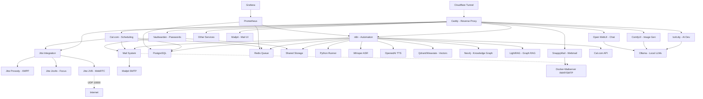

# 🚀 AI LaunchKit

<div align="center">

**Open-Source AI Development Toolkit**

*Deploy your complete AI stack in minutes, not weeks*

[](LICENSE)
[](https://github.com/freddy-schuetz/ai-launchkit)
[](https://github.com/kossakovsky/n8n-installer)

[Installation](#-installation) • [Features](#-whats-included) • [Documentation](#-documentation) • [Support](#-support)

</div>

---

## 🎯 What is AI LaunchKit?

AI LaunchKit is a comprehensive, self-hosted AI development environment that deploys **50+ pre-configured tools** with a single command. Build AI applications, automate workflows, generate images, and develop with AI assistance - all running on your own infrastructure.

Originally forked from [n8n-installer](https://github.com/kossakovsky/n8n-installer), AI LaunchKit has evolved into a complete AI development platform, maintained by [Friedemann Schuetz](https://www.linkedin.com/in/friedemann-schuetz).

### 🎬 Quick Demo

```bash
# One command to rule them all
git clone https://github.com/freddy-schuetz/ai-launchkit && cd ai-launchkit && sudo bash ./scripts/install.sh
```

**That's it!** Your AI development stack is ready in ~10-15 minutes.

**ATTENTION!** The AI LaunchKit is currently in development. It is regularly tested and updated. However, use is at your own risk!

---

## ✨ What's Included

### 📧 Mail System

| Tool | Description | Always Active | Purpose |
|------|-------------|---------------|----------|
| **[Mailpit](https://github.com/axllent/mailpit)** | Mail catcher with web UI Access: `mail.yourdomain.com` | ✅ Yes | Development/Testing - captures all emails |
| **[Docker-Mailserver](https://github.com/docker-mailserver/docker-mailserver)** | Production mail server | ⚡ Optional | Real email delivery for production |
| **[SnappyMail](https://github.com/the-djmaze/snappymail)** | Modern webmail client Access: `webmail.yourdomain.com` | ⚡ Optional | Web interface for Docker-Mailserver |

**Mail Configuration:**
- Mailpit automatically configured for all services (always active)
- Docker-Mailserver available for production email delivery (optional)
- SnappyMail provides a modern web interface for email access (optional, requires Docker-Mailserver)
- Web UI to view all captured emails
- Zero manual configuration needed!

### 🔧 Workflow Automation

| Tool | Description | Use Cases | Access |
|------|-------------|-----------|--------|
| **[n8n](https://github.com/n8n-io/n8n)** | Visual workflow automation platform | API integrations, data pipelines, business automation | `n8n.yourdomain.com` |
| **[n8n-MCP](https://github.com/czlonkowski/n8n-mcp)** | AI workflow generator for n8n | Claude/Cursor integration, 525+ node docs, workflow validation | `n8nmcp.yourdomain.com` |
| **300+ Workflows** | Pre-built n8n templates | Email automation, social media, data sync, AI workflows | Imported on install |

### 🎯 User Interfaces

| Tool | Description | Use Cases | Access |
|------|-------------|-----------|--------|
| **[Open WebUI](https://github.com/open-webui/open-webui)** | ChatGPT-like interface for LLMs | AI chat, model switching, conversation management | `webui.yourdomain.com` |
| **[Postiz](https://github.com/gitroomhq/postiz-app)** | Social media management platform | Content scheduling, analytics, multi-platform posting | `postiz.yourdomain.com` |

### 📹 Video Conferencing

| Tool | Description | Use Cases | Access |
|------|-------------|-----------|--------|
| **[Jitsi Meet](https://github.com/jitsi/jitsi-meet)** ⚠️ | Professional video conferencing platform | Client meetings, team calls, webinars, Cal.com integration | `meet.yourdomain.com` |

**⚠️ Jitsi Meet Requirements:**
- **CRITICAL:** Requires UDP Port 10000 for WebRTC audio/video
- Many VPS providers block UDP traffic by default
- Without UDP 10000: Only chat works, no audio/video!
- Test UDP connectivity before production use
- Alternative: Use external services (Zoom, Google Meet) with Cal.com

### 💼 Business & Productivity

| Tool | Description | Use Cases | Access |
|------|-------------|-----------|--------|
| **[Cal.com](https://github.com/calcom/cal.com)** | Open-source scheduling platform | Meeting bookings, team calendars, payment integrations | `cal.yourdomain.com` |
| **[Vikunja](https://github.com/go-vikunja/vikunja)** | Modern task management platform | Kanban boards, Gantt charts, team collaboration, CalDAV | `vikunja.yourdomain.com` |
| **[Leantime](https://github.com/Leantime/leantime)** | Goal-oriented project management suite | ADHD-friendly PM, time tracking, sprints, strategy tools | `leantime.yourdomain.com` |
| **[Kimai](https://github.com/kimai/kimai)** | Professional time tracking | DSGVO-compliant billing, team timesheets, API, 2FA, invoicing | `time.yourdomain.com` |
| **[Invoice Ninja](https://github.com/invoiceninja/invoiceninja)** | Professional invoicing & payment platform | Multi-currency invoices, 40+ payment gateways, recurring billing, client portal | `invoices.yourdomain.com` |
| **[Baserow](https://github.com/bram2w/baserow)** | Airtable Alternative with real-time collaboration | Database management, project tracking, collaborative workflows | `baserow.yourdomain.com` |
| **[NocoDB](https://github.com/nocodb/nocodb)** | Open-source Airtable alternative with API & webhooks | Smart spreadsheet UI, realtime collaboration, automation | `nocodb.yourdomain.com` |
| **[Formbricks](https://github.com/formbricks/formbricks)** | Privacy-first survey platform | Customer feedback, NPS surveys, market research, form builder, GDPR-compliant | `forms.yourdomain.com` |
| **[Metabase](https://github.com/metabase/metabase)** | User-friendly business intelligence platform | No-code dashboards, automated reports, data exploration, team analytics | `analytics.yourdomain.com` |
| **[Odoo 18](https://github.com/odoo/odoo)** | Open Source ERP/CRM with AI features | Sales automation, inventory, accounting, AI lead scoring | `odoo.yourdomain.com` |
| **[Twenty CRM](https://github.com/twentyhq/twenty)** | Modern Notion-like CRM | Customer pipelines, GraphQL API, team collaboration, lightweight CRM for startups | `twenty.yourdomain.com` |
| **[EspoCRM](https://github.com/espocrm/espocrm)** | Full-featured CRM platform | Email campaigns, workflow automation, advanced reporting, role-based access | `espocrm.yourdomain.com` |
| **[Mautic](https://github.com/mautic/mautic)** | Marketing automation platform | Lead scoring, email campaigns, landing pages, multi-channel marketing, automation workflows | `mautic.yourdomain.com` |

### 🎨 AI Content Generation

| Tool | Description | Use Cases | Access |
|------|-------------|-----------|--------|
| **[ComfyUI](https://github.com/comfyanonymous/ComfyUI)** | Node-based Stable Diffusion interface | Image generation, AI art, photo editing, workflows | `comfyui.yourdomain.com` |

### 💻 AI-Powered Development / Vibe Coding

| Tool | Description | Use Cases | Access |
|------|-------------|-----------|--------|
| **[bolt.diy](https://github.com/stackblitz-labs/bolt.diy)** | Build full-stack apps with prompts | Rapid prototyping, MVP creation, learning to code | `bolt.yourdomain.com` |
| **[OpenUI](https://github.com/wandb/openui)** 🧪 | AI-powered UI component generation | Design systems, component libraries, mockups | `openui.yourdomain.com` |

### 🤖 AI Agents

| Tool | Description | Use Cases | Access |
|------|-------------|-----------|--------|
| **[Flowise](https://github.com/FlowiseAI/Flowise)** | Visual AI agent builder | Chatbots, customer support, AI workflows | `flowise.yourdomain.com` |
| **[LiveKit](https://github.com/livekit/livekit)** + Agents | Real-time voice agents with WebRTC (auto-uses Whisper/TTS/Ollama or OpenAI) | AI voice assistants, conversational AI, ChatGPT-like voice bots, requires UDP 50000-50100 | `livekit.yourdomain.com` |
| **[Dify](https://github.com/langgenius/dify)** | LLMOps platform for AI apps | Production AI apps, model management, prompt engineering | `dify.yourdomain.com` |
| **[Letta](https://github.com/letta-ai/letta)** | Stateful agent server | Persistent AI assistants, memory management | `letta.yourdomain.com` |
| **[Browser-use](https://github.com/browser-use/browser-use)** | LLM-powered browser control | Web scraping, form filling, automated testing | Internal API only |
| **[Skyvern](https://skyvern.com)** | Vision-based browser automation | Complex web tasks, CAPTCHA handling, dynamic sites | Internal API only |
| **[Browserless](https://browserless.io)** | Headless Chrome service | Puppeteer/Playwright hub, PDF generation, screenshots | Internal WebSocket |

### 📚 RAG Systems

| Tool | Description | Use Cases | Access |
|------|-------------|-----------|--------|
| **[RAGApp](https://github.com/ragapp/ragapp)** | Build RAG assistants over your data | Knowledge bases, document Q&A, research tools | `ragapp.yourdomain.com` |
| **[Qdrant](https://github.com/qdrant/qdrant)** | High-performance vector database | Semantic search, recommendations, RAG storage | `qdrant.yourdomain.com` |
| **[Weaviate](https://github.com/weaviate/weaviate)** | AI-native vector database | Hybrid search, multi-modal data, GraphQL API | `weaviate.yourdomain.com` |

### 🎙️ Speech, Language & Text Processing

| Tool | Description | Use Cases | Access |
|------|-------------|-----------|--------|
| **[Faster-Whisper](https://github.com/SYSTRAN/faster-whisper)** | OpenAI-compatible Speech-to-Text | Transcription, voice commands, meeting notes | Internal API |
| **[OpenedAI-Speech](https://github.com/matatonic/openedai-speech)** | OpenAI-compatible Text-to-Speech | Voice assistants, audiobooks, notifications | Internal API |
| **[TTS Chatterbox](https://github.com/resemble-ai/chatterbox)** | State-of-the-art TTS with emotion control & voice cloning | AI voices with emotional expression, voice synthesis, outperforms ElevenLabs | `chatterbox.yourdomain.com` |
| **[LibreTranslate](https://github.com/LibreTranslate/LibreTranslate)** | Self-hosted translation API | 50+ languages, document translation, privacy-focused | `translate.yourdomain.com` |
| **OCR Bundle: [Tesseract](https://github.com/tesseract-ocr/tesseract) & [EasyOCR](https://github.com/JaidedAI/EasyOCR)** | Dual OCR engines: Tesseract (fast) + EasyOCR (quality) | Text extraction from images/PDFs, receipt scanning, document digitization | Internal API |
| **[Scriberr](https://github.com/rishikanthc/Scriberr)** | AI audio transcription with WhisperX & speaker diarization | Meeting transcripts, podcast processing, call recordings, speaker identification | `scriberr.yourdomain.com` |
| **[Vexa](https://github.com/Vexa-ai/vexa)** | Real-time meeting transcription API | Live transcription for Google Meet & Teams, speaker identification, 99 languages, n8n integration | Internal API |

*If you have troubles installing or updating Vexa, please view this guide:* **[Vexa Workaround](https://github.com/freddy-schuetz/ai-launchkit/blob/main/vexa-troubleshooting-workarounds.md)**

### 🔍 Search & Web Data

| Tool | Description | Use Cases | Access |
|------|-------------|-----------|--------|
| **[SearXNG](https://github.com/searxng/searxng)** | Privacy-respecting metasearch engine | Web search for agents, no tracking, multiple sources | `searxng.yourdomain.com` |
| **[Perplexica](https://github.com/ItzCrazyKns/Perplexica)** | Open-source AI-powered search engine | Deep research, academic search, Perplexity AI alternative | `perplexica.yourdomain.com` |
| **[Crawl4Ai](https://github.com/unclecode/crawl4ai)** | AI-optimized web crawler | Web scraping, data extraction, site monitoring | Internal API |
| **[GPT Researcher](https://github.com/assafelovic/gpt-researcher)** | Autonomous research agent (2000+ word reports) | Comprehensive research reports, multi-source analysis, citations | `research.yourdomain.com` |
| **[Local Deep Research](https://github.com/langchain-ai/local-deep-researcher)** | LangChain's iterative deep research (~95% accuracy) | Fact-checking, detailed analysis, research loops with reflection | Internal API |

### 🧠 Knowledge Graphs

| Tool | Description | Use Cases | Access |
|------|-------------|-----------|--------|
| **[Neo4j](https://github.com/neo4j/neo4j)** | Graph database platform | Knowledge graphs, entity relationships, fraud detection, recommendations | `neo4j.yourdomain.com` |
| **[LightRAG](https://github.com/HKUDS/LightRAG)** | Graph-based RAG with entity extraction | Automatic knowledge graph creation, relationship mapping, complex queries | `lightrag.yourdomain.com` |

### 🎬 Media Processing Suite

Pre-installed in the n8n container for seamless media manipulation:

| Tool | Description | Use Cases |
|------|-------------|-----------|
| **[FFmpeg](https://github.com/FFmpeg/FFmpeg)** | Industry-standard multimedia framework | Video conversion, streaming, audio extraction |
| **[ImageMagick](https://github.com/ImageMagick/ImageMagick)** | Image manipulation toolkit | Format conversion, resizing, effects, thumbnails |
| **[ExifTool](https://github.com/exiftool/exiftool)** | Metadata management | Read/write EXIF, IPTC, XMP metadata |
| **[MediaInfo](https://github.com/MediaArea/MediaInfo)** | Media file analyzer | Codec detection, bitrate analysis, format info |
| **[SoX](http://sox.sourceforge.net/)** | Sound processing utility | Audio format conversion, effects, resampling |
| **[Ghostscript](https://github.com/ArtifexSoftware/ghostscript)** | PDF/PostScript processor | PDF manipulation, conversion, optimization |
| **Python3 + Libraries** | Pillow, OpenCV, NumPy, Pandas | Image processing, data analysis, automation |

### 🗄️ Data Infrastructure

| Tool | Description | Use Cases | Access |
|------|-------------|-----------|--------|
| **[Supabase](https://github.com/supabase/supabase)** | Open-source Firebase alternative | Instant APIs, auth, realtime, storage, edge functions | `supabase.yourdomain.com` |
| **[PostgreSQL 17](https://www.postgresql.org/)** | Advanced relational database | Primary database for n8n, Cal.com, and other services | Internal only |
| **[Redis](https://github.com/redis/redis)** | In-memory data store | Queue management, caching, session storage | Internal only |

### ⚙️ System Management

| Tool | Description | Use Cases | Access |
|------|-------------|-----------|--------|
| **[Vaultwarden](https://github.com/dani-garcia/vaultwarden)** | Bitwarden-compatible password manager | Credential management, team password sharing, auto-fill | `vault.yourdomain.com` |
| **[Caddy](https://github.com/caddyserver/caddy)** | Automatic HTTPS reverse proxy | SSL certificates, load balancing, routing | Automatic |
| **[Cloudflare Tunnel](https://github.com/cloudflare/cloudflared)** | Secure tunnel without port forwarding | Zero-trust access, DDoS protection, firewall bypass | Optional |
| **[Python Runner](https://github.com/n8n-io/n8n)** | Isolated Python environment | Execute Python scripts from n8n workflows | Internal only |
| **[Grafana](https://github.com/grafana/grafana)** | Metrics visualization platform | System monitoring, performance dashboards, alerting | `grafana.yourdomain.com` |
| **[Prometheus](https://github.com/prometheus/prometheus)** | Metrics collection & alerting | Time-series database, service monitoring, resource tracking | Internal only |
| **[Portainer](https://github.com/portainer/portainer)** | Docker management interface | Container monitoring, logs, restart services | `portainer.yourdomain.com` |

### 🧰 AI Support Tools

| Tool | Description | Use Cases | Access |
|------|-------------|-----------|--------|
| **[Ollama](https://github.com/ollama/ollama)** | Local LLM runtime | Run Llama, Mistral, Phi locally, API-compatible | `ollama.yourdomain.com` |
| **[Gotenberg](https://github.com/gotenberg/gotenberg)** | Universal document converter | HTML/Markdown → PDF, Office → PDF, merge PDFs | Internal API |
| **[Stirling-PDF](https://github.com/Stirling-Tools/Stirling-PDF)** | PDF toolkit | Split, merge, compress, OCR, sign PDFs | `pdf.yourdomain.com` |

### 🛡️ AI Security & Compliance

| Tool | Description | Use Cases | Access |
|------|-------------|-----------|--------|
| **[LLM Guard](https://github.com/protectai/llm-guard)** | Input/output filtering for LLMs | Prompt injection prevention, toxicity filtering, PII removal | Internal API |
| **[Microsoft Presidio](https://github.com/microsoft/presidio)** | PII detection & anonymization (English) | GDPR compliance, data protection, sensitive data handling | Internal API |
| **[Flair NER](https://github.com/flairNLP/flair)** | German PII detection | DSGVO compliance, German text processing, entity recognition | Internal API |

---

## 🚀 Quick Start

### Installation Command

```bash
git clone https://github.com/freddy-schuetz/ai-launchkit && cd ai-launchkit && sudo bash ./scripts/install.sh
```

### What the Installer Does

1. **Checks Prerequisites** - Verifies Docker, domain, and system requirements
2. **Configures Services** - Sets up environment variables and generates secure passwords
3. **Deploys Stack** - Starts all selected services with Docker Compose
4. **Obtains SSL Certificates** - Automatic HTTPS via Caddy
5. **Imports Workflows** - Optional: Downloads 300+ pre-built n8n templates
6. **Generates Report** - Provides access URLs and credentials

### After Installation

1. **Access n8n:** Navigate to `https://n8n.yourdomain.com`
2. **Create Admin Account:** First visitor becomes owner
3. **Configure API Keys:** Add OpenAI, Anthropic, Groq keys in `.env` file
4. **Explore Services:** Check the final report for all URLs and credentials
5. **Import Credentials to Vaultwarden:** Run `sudo bash ./scripts/download_credentials.sh`

### Installation Time

- **Base Installation:** 10-15 minutes
- **With Workflow Import:** +20-30 minutes (optional)
- **Total:** 15-45 minutes depending on selections

**System Requirements:**
- 4GB RAM minimum (8GB+ recommended)
- 40GB disk space (more for media/models)
- Ubuntu 22.04/24.04 or Debian 11/12
- Domain with wildcard DNS configured

---

## 📦 Installation - Detailliert

### Prerequisites

Before installing AI LaunchKit, ensure you have:

1. **Server:** Ubuntu 22.04/24.04 or Debian 11/12 LTS
   - 4GB RAM minimum (8GB+ recommended for AI workloads)
   - 40GB+ disk space (SSD recommended)
   - Root or sudo access

2. **Domain:** A registered domain with wildcard DNS
   ```
   A *.yourdomain.com -> YOUR_SERVER_IP
   ```

3. **Access:** SSH access to your server

### Step-by-Step Installation

#### Step 1: Connect to Your Server

```bash
# Connect via SSH
ssh root@YOUR_SERVER_IP

# Or with key authentication
ssh -i ~/.ssh/your-key.pem user@YOUR_SERVER_IP
```

#### Step 2: Clone Repository

```bash
# Clone AI LaunchKit
git clone https://github.com/freddy-schuetz/ai-launchkit

# Navigate into directory
cd ai-launchkit
```

#### Step 3: Run Installer

```bash
# Start installation wizard
sudo bash ./scripts/install.sh
```

#### Step 4: Answer Installation Prompts

The installer will ask you for:

**1. Domain Name:**
```
Enter your domain (e.g., example.com): yourdomain.com
```

**2. Email Address:**
```
Enter email for SSL certificates: admin@yourdomain.com
```

**3. API Keys (Optional):**
```
Enter OpenAI API key (or press Enter to skip): sk-...
Enter Anthropic API key (or press Enter to skip): sk-ant-...
Enter Groq API key (or press Enter to skip): gsk_...
```

**4. Community Workflows (Optional):**
```
Import 300+ n8n community workflows? [y/N]: y
```
*Note: This takes 20-30 minutes extra*

**5. Worker Configuration:**
```
How many n8n workers? (1-4): 2
```

**6. Service Selection:**
```
Install Docker-Mailserver for production email? [y/N]: n
Install SnappyMail webmail client? [y/N]: n
Install Jitsi Meet? [y/N]: y
... (and more services)
```

#### Step 5: Installation Progress

The installer will now:
1. ✅ Install Docker and Docker Compose
2. ✅ Generate secure passwords
3. ✅ Configure services
4. ✅ Start Docker containers
5. ✅ Request SSL certificates
6. ✅ Import workflows (if selected)
7. ✅ Generate final report

#### Step 6: Save Installation Report

At the end, you'll see:

```
================================
Installation Complete! 🎉
================================

Access URLs:
  n8n: https://n8n.yourdomain.com
  bolt.diy: https://bolt.yourdomain.com
  Mailpit: https://mail.yourdomain.com
  ... (more services)

Download credentials with:
sudo bash ./scripts/download_credentials.sh
```

**Important:** Save the installation output - it contains all passwords!

### Post-Installation Steps

#### First Login to Services

**n8n (Workflow Automation):**
1. Open `https://n8n.yourdomain.com`
2. First visitor creates owner account
3. Choose strong password (min 8 characters)
4. Setup complete!

**Vaultwarden (Password Manager):**
1. Open `https://vault.yourdomain.com`
2. Click "Create Account"
3. Set master password (very strong!)
4. Import AI LaunchKit credentials:
   ```bash
   sudo bash ./scripts/download_credentials.sh
   ```
5. Download JSON file and import in Vaultwarden

**Other Services:**
- Most services: First user = admin
- Some require credentials from `.env` file
- Check the installation output or `.env` file for credentials

#### Configure API Keys (Optional)

If you skipped API keys during installation:

```bash
# Edit environment file
nano .env

# Add your keys:
OPENAI_API_KEY=sk-your-key-here
ANTHROPIC_API_KEY=sk-ant-your-key-here
GROQ_API_KEY=gsk_your-key-here

# Save and exit (Ctrl+X, Y, Enter)

# Apply changes
docker compose restart
```

#### DNS Verification

Ensure your domains are resolving correctly:

```bash
# Test DNS resolution
nslookup n8n.yourdomain.com
nslookup bolt.yourdomain.com

# Test HTTPS access
curl -I https://n8n.yourdomain.com
# Should return: HTTP/2 200
```

#### Firewall Check

Verify firewall rules are correct:

```bash
sudo ufw status

# Should show:
# 22/tcp                     ALLOW       Anywhere
# 80/tcp                     ALLOW       Anywhere
# 443/tcp                    ALLOW       Anywhere
```

### Optional: Docker-Mailserver Setup

If you selected Docker-Mailserver for production email:

#### Add Email Accounts

```bash
# Create first email account
docker exec -it mailserver setup email add admin@yourdomain.com

# Create additional accounts
docker exec -it mailserver setup email add noreply@yourdomain.com
docker exec -it mailserver setup email add support@yourdomain.com

# List all accounts
docker exec mailserver setup email list
```

#### Configure DNS for Email

**Required DNS Records:**

```
# MX Record
Type: MX
Name: @
Value: mail.yourdomain.com
Priority: 10

# A Record for mail
Type: A  
Name: mail
Value: YOUR_SERVER_IP

# SPF Record
Type: TXT
Name: @
Value: v=spf1 mx ~all

# DMARC Record
Type: TXT
Name: _dmarc
Value: v=DMARC1; p=none; rua=mailto:postmaster@yourdomain.com
```

#### Generate DKIM Keys

```bash
# Generate DKIM signature
docker exec mailserver setup config dkim

# Get public key for DNS
docker exec mailserver cat /tmp/docker-mailserver/opendkim/keys/yourdomain.com/mail.txt

# Add as TXT record:
# Name: mail._domainkey
# Value: (paste the key from above)
```

### Troubleshooting Installation

#### Services Won't Start

```bash
# Check Docker is running
sudo systemctl status docker

# Check specific service logs
docker compose logs [service-name] --tail 50

# Common issues:
# - Not enough RAM: Reduce services or upgrade server
# - Port conflicts: Check if ports 80/443 are free
# - DNS not ready: Wait 15 minutes for propagation
```

#### SSL Certificate Errors

```bash
# Caddy might take a few minutes to get certificates
# Check Caddy logs:
docker compose logs caddy --tail 50

# If problems persist:
# 1. Verify DNS is correct
# 2. Check firewall allows 80/443
# 3. Restart Caddy
docker compose restart caddy
```

#### Docker Issues

```bash
# Restart Docker daemon
sudo systemctl restart docker

# Reset Docker network (if needed)
docker network prune -f

# Restart all services
cd ai-launchkit
docker compose restart
```

---

## 🔄 Update - Detailliert

### When to Update

Update AI LaunchKit when:
- New features are released
- Security patches are available
- Bug fixes are published
- You want the latest service versions

**Check for updates:**
```bash
cd ai-launchkit
git fetch origin
git log HEAD..origin/main --oneline
```

### Backup Before Update

**CRITICAL:** Always backup before updating!

```bash
# Navigate to AI LaunchKit
cd ai-launchkit

# Backup all Docker volumes
tar czf backup-$(date +%Y%m%d).tar.gz \
  /var/lib/docker/volumes/localai_*

# Backup PostgreSQL database
docker exec postgres pg_dumpall -U postgres > backup-$(date +%Y%m%d).sql

# Backup .env file
cp .env .env.backup

# Backup Docker Compose
cp docker-compose.yml docker-compose.yml.backup
```

**Move backups to safe location:**
```bash
# Create backup directory
mkdir -p ~/ai-launchkit-backups

# Move backups
mv backup-*.tar.gz ~/ai-launchkit-backups/
mv backup-*.sql ~/ai-launchkit-backups/

# Verify backups exist
ls -lh ~/ai-launchkit-backups/
```

### Update Procedure

#### Standard Update Process

```bash
# 1. Navigate to AI LaunchKit
cd ai-launchkit

# 2. Stop all services gracefully
docker compose down

# 3. Backup (see section above)
# ... (perform backups)

# 4. Pull latest changes
git pull

# 5. Pull new Docker images
docker compose pull

# 6. Start services with new images
docker compose up -d

# 7. Check service status
docker compose ps

# 8. Monitor logs for issues
docker compose logs -f --tail 100
```

#### Update with Service Changes

If the update adds new services or changes configuration:

```bash
# 1. Stop services
docker compose down

# 2. Backup everything
# ... (perform backups)

# 3. Pull latest code
git pull

# 4. Review .env.example for new variables
diff .env .env.example

# 5. Add new variables to .env
nano .env
# Add any new required variables

# 6. Pull new images
docker compose pull

# 7. Recreate services with new config
docker compose up -d --force-recreate

# 8. Verify all services started
docker compose ps
```

### PostgreSQL Version Handling

**Important:** AI LaunchKit pins PostgreSQL to version 17 to prevent automatic upgrades.

#### Check Current PostgreSQL Version

```bash
docker exec postgres postgres --version
```

#### If You Have PostgreSQL 18

If you installed after September 26, 2025 and have PostgreSQL 18:

```bash
# Pin to PostgreSQL 18 in .env
echo "POSTGRES_VERSION=18" >> .env

# Update safely
bash scripts/update.sh
```

#### If You Experience Database Errors

If you see "database files are incompatible" errors:

<details>
<summary><b>Emergency Recovery Steps</b></summary>

```bash
# 1. BACKUP YOUR DATA (CRITICAL!)
docker exec postgres pg_dumpall -U postgres > emergency-backup.sql

# 2. Stop all services
docker compose down

# 3. Remove incompatible volume
docker volume rm localai_postgres_data

# 4. Pull latest fixes
git pull

# 5. Start PostgreSQL (now pinned to v17)
docker compose up -d postgres
sleep 10

# 6. Restore your data
docker exec -i postgres psql -U postgres < emergency-backup.sql

# 7. Start all services
docker compose up -d
```

</details>

#### Version Verification

After update, verify versions:

```bash
docker exec postgres postgres --version
# Should show: PostgreSQL 17.x or 18.x (if pinned)
```

### Post-Update Verification

#### Check Service Status

```bash
# View all services
docker compose ps

# All should show: STATUS = Up
# If any show "Restarting" wait 2-3 minutes, then check logs:
docker compose logs [service-name] --tail 50
```

#### Test Key Services

**n8n:**
```bash
curl -I https://n8n.yourdomain.com
# Should return: HTTP/2 200
```

**Database:**
```bash
docker exec postgres pg_isready -U postgres
# Should return: accepting connections
```

**Redis:**
```bash
docker exec redis redis-cli ping
# Should return: PONG
```

#### Monitor Resource Usage

```bash
# Check memory and CPU
docker stats --no-stream

# Check disk space
df -h
```

#### Verify Workflows Still Run

1. Open n8n: `https://n8n.yourdomain.com`
2. Open a test workflow
3. Click "Execute Workflow"
4. Verify it completes successfully

### Rollback Procedure

If the update causes issues, rollback to the previous version:

#### Quick Rollback

```bash
# 1. Navigate to AI LaunchKit
cd ai-launchkit

# 2. View commit history
git log --oneline -10

# 3. Rollback to previous commit
git reset --hard [previous-commit-hash]

# 4. Restore .env if needed
cp .env.backup .env

# 5. Restart with old version
docker compose down
docker compose up -d
```

#### Full Rollback with Data Restore

```bash
# 1. Stop services
docker compose down

# 2. Restore volumes from backup
tar xzf volumes-backup-YYYYMMDD.tar.gz

# 3. Restore PostgreSQL
docker compose up -d postgres
sleep 10
docker exec -i postgres psql -U postgres < backup-YYYYMMDD.sql

# 4. Start all services
docker compose up -d
```

### Service-Specific Updates

Some services may require additional steps:

#### ComfyUI Models

```bash
# Models are not automatically updated
# To update models, manually download new versions to:
/var/lib/docker/volumes/localai_comfyui_data/_data/models/
```

#### Ollama Models

```bash
# Update installed models
docker exec ollama ollama pull llama3.2
docker exec ollama ollama pull mistral
```

#### n8n Community Nodes

```bash
# Update community nodes
docker exec n8n npm update -g n8n

# Restart n8n
docker compose restart n8n
```

#### Supabase

```bash
# Supabase has multiple components
# All update together with docker compose pull
docker compose pull supabase-kong supabase-auth supabase-rest supabase-storage
docker compose up -d supabase-kong supabase-auth supabase-rest supabase-storage
```

### Update Troubleshooting

#### Services Won't Start After Update

```bash
# Check logs for specific error
docker compose logs [service-name] --tail 100

# Common fixes:
# 1. Recreate service
docker compose up -d --force-recreate [service-name]

# 2. Clear cache and restart
docker compose down
docker system prune -f
docker compose up -d

# 3. Restore from backup if needed
```

#### Database Connection Errors

```bash
# PostgreSQL not starting
docker compose logs postgres --tail 100

# Common causes:
# - Incompatible data format (see PostgreSQL section)
# - Corrupted data (restore from backup)
# - Insufficient disk space (check with df -h)
```

#### Port Conflicts After Update

```bash
# Check what's using the port
sudo lsof -i :80
sudo lsof -i :443

# Stop conflicting service
sudo systemctl stop [service-name]

# Or change port in .env
nano .env
# Change PORT_VARIABLE to different port
```

#### Missing Environment Variables

```bash
# Compare with .env.example
diff .env .env.example

# Add any missing variables
nano .env

# Restart services
docker compose restart
```

### Maintenance Updates

#### Regular Maintenance

```bash
# Clean up old Docker resources (monthly)
docker system prune -af --volumes

# Update system packages (monthly)
sudo apt update && sudo apt upgrade -y

# Check disk space (weekly)
df -h
docker system df
```

#### Security Updates

```bash
# Update OS security patches
sudo apt update
sudo apt upgrade -y

# Update Docker
sudo apt install docker-ce docker-ce-cli containerd.io

# Restart Docker daemon
sudo systemctl restart docker

# Restart all services
docker compose restart
```

### Update Best Practices

1. **Always Backup First** - Cannot stress this enough
2. **Test in Staging** - If you have a test environment
3. **Read Changelogs** - Know what's changing
4. **Update Off-Peak** - Minimize user impact
5. **Monitor After Update** - Watch logs for 24 hours
6. **Keep Backups** - Retain last 3-5 backups
7. **Document Changes** - Note what was updated and when

### Update Notifications

Stay informed about updates:

- **Watch GitHub Repository**: Get notifications for new releases
- **Join Community Forum**: [oTTomator Think Tank](https://thinktank.ottomator.ai/c/local-ai/18)
- **Discord** *(coming soon)*: Real-time update announcements

### Getting Help with Updates

If you encounter issues:

1. **Check Logs**: `docker compose logs [service]`
2. **Search Issues**: [GitHub Issues](https://github.com/freddy-schuetz/ai-launchkit/issues)
3. **Community Forum**: Ask for help
4. **Rollback**: Use the procedure above if needed

---

**Next Steps:** After updating, explore the [Services section](#-services) for new features in each tool.

---

## 📧 Services

This section provides detailed information for each service, including setup, n8n integration examples, and troubleshooting.

<!-- Each service will be added as an expandable <details> section in Phase 2 -->

### Mail System

<details>
<summary><b>📧 Mailpit - Development Mail Catcher</b></summary>

### What is Mailpit?

Mailpit is a modern email testing server with an integrated web UI. It captures all outgoing emails and displays them in a user-friendly interface - perfect for development and testing.

### Features

- **Email Capture:** Catches ALL emails from all services
- **Web UI:** Modern, fast, responsive interface
- **Real-time Updates:** New emails appear instantly
- **Search & Filter:** Search emails by sender, subject, etc.
- **API Access:** Programmatic access to emails
- **Zero Configuration:** Works out-of-the-box

### Initial Setup

**Mailpit is already pre-configured!** No setup required.

**Access the Web UI:**

1. Navigate to `https://mail.yourdomain.com`
2. No authentication required
3. All emails sent by services appear automatically here

**All services are pre-configured:**
- SMTP Host: `mailpit`
- SMTP Port: `1025`
- No authentication required
- No SSL/TLS

### n8n Integration Setup

Mailpit is **already pre-configured in n8n**. All "Send Email" nodes use Mailpit automatically.

**Send email from n8n (already configured):**

1. Create workflow
2. Add "Send Email" node
3. Node is already configured with Mailpit
4. Email is automatically captured in Mailpit

**Internal URL for manual configuration:** `http://mailpit:1025`

### Example Workflows

#### Example 1: Send Test Email

```javascript
// 1. Manual Trigger Node

// 2. Send Email Node (already pre-configured)
{
  "to": "test@example.com",
  "subject": "Test from AI LaunchKit",
  "text": "This email was captured by Mailpit!"
}

// 3. Open Mailpit Web UI
// → Email appears instantly at mail.yourdomain.com
```

#### Example 2: Test Automated Notifications

```javascript
// 1. Webhook Trigger Node
// Receives POST from external service

// 2. Code Node - Format email
const emailData = {
  to: "admin@example.com",
  subject: `New Notification: ${$json.event}`,
  html: `
    <h2>Event Details</h2>
    <p><strong>Type:</strong> ${$json.event}</p>
    <p><strong>Time:</strong> ${new Date().toLocaleString()}</p>
    <p><strong>Data:</strong> ${JSON.stringify($json.data, null, 2)}</p>
  `
};
return emailData;

// 3. Send Email Node
// → Sends to Mailpit for review

// 4. Test in Mailpit Web UI
// → Validate HTML formatting and data
```

#### Example 3: Test Service Email Configuration

```javascript
// Test Cal.com, Vikunja, Invoice Ninja, etc.
// All services → Mailpit automatically configured

// Test process:
// 1. Perform action in service (e.g., book meeting in Cal.com)
// 2. Service sends email
// 3. Check email in Mailpit Web UI
// 4. Validate format and content

// No code needed - services send directly to Mailpit!
```

### Troubleshooting

**Emails not appearing in Mailpit:**

```bash
# 1. Check Mailpit status
docker ps | grep mailpit
# Should show: STATUS = Up

# 2. Check Mailpit logs
docker logs mailpit --tail 50

# 3. Test SMTP connection
docker exec n8n nc -zv mailpit 1025
# Should return: Connection successful

# 4. Test from another container
docker exec -it [service-name] sh
nc -zv mailpit 1025
```

**Mailpit Web UI not accessible:**

```bash
# 1. Check Caddy logs
docker logs caddy | grep mailpit

# 2. Restart Mailpit container
docker compose restart mailpit

# 3. Clear browser cache
# CTRL+F5 or incognito mode

# 4. Check DNS
nslookup mail.yourdomain.com
# Should return your server IP
```

**Service cannot send emails:**

```bash
# 1. Check service SMTP settings
docker exec [service] env | grep SMTP
# Should show: SMTP_HOST=mailpit, SMTP_PORT=1025

# 2. Check Docker network
docker network inspect ai-launchkit_default | grep mailpit

# 3. Check service logs
docker logs [service] | grep -i "mail\|smtp"

# 4. Restart service
docker compose restart [service]
```

### Resources

- **GitHub:** https://github.com/axllent/mailpit
- **Documentation:** https://mailpit.axllent.org/docs/
- **API Documentation:** https://mailpit.axllent.org/docs/api/
- **Web-UI:** `https://mail.yourdomain.com`

</details>

<details>
<summary><b>📬 Docker-Mailserver - Production Email</b></summary>

### What is Docker-Mailserver?

Docker-Mailserver is a full-featured, production-ready mail server (SMTP, IMAP) with integrated spam protection and security features. Perfect for real email delivery in production.

### Features

- **Full SMTP/IMAP Support:** Real email delivery and receiving
- **DKIM/SPF/DMARC:** Configured for best deliverability
- **Rspamd Integration:** Automatic spam protection
- **User Management:** Easy CLI tools for account management
- **Secure by Default:** TLS/STARTTLS, modern cipher suites

### Initial Setup

**Prerequisite:** Docker-Mailserver must have been selected during installation.

#### 1. Configure DNS Records

These DNS entries are **required** for email delivery:

**MX Record:**
```
Type: MX
Name: @ (or yourdomain.com)
Value: mail.yourdomain.com
Priority: 10
```

**A Record for mail subdomain:**
```
Type: A
Name: mail
Value: YOUR_SERVER_IP
```

**SPF Record:**
```
Type: TXT
Name: @ (or yourdomain.com)
Value: "v=spf1 mx ~all"
```

**DMARC Record:**
```
Type: TXT
Name: _dmarc
Value: "v=DMARC1; p=none; rua=mailto:postmaster@yourdomain.com"
```

**DKIM Record (after installation):**
```bash
# Generate DKIM keys
docker exec mailserver setup config dkim

# Display public key for DNS
docker exec mailserver cat /tmp/docker-mailserver/opendkim/keys/yourdomain.com/mail.txt

# Add as TXT record:
# Name: mail._domainkey
# Value: (the displayed key)
```

#### 2. Create Email Accounts

```bash
# Create first account
docker exec -it mailserver setup email add admin@yourdomain.com

# Add more accounts
docker exec mailserver setup email add user@yourdomain.com
docker exec mailserver setup email add support@yourdomain.com

# List all accounts
docker exec mailserver setup email list
```

#### 3. Automatic Configuration

**All services automatically use Docker-Mailserver:**
- SMTP Host: `mailserver`
- SMTP Port: `587`
- Security: STARTTLS
- Authentication: noreply@yourdomain.com
- Password: auto-generated (see `.env`)

### n8n Integration Setup

**Create SMTP Credentials in n8n:**

1. Open n8n: `https://n8n.yourdomain.com`
2. Settings → Credentials → Add New
3. Credential Type: SMTP
4. Configuration:

```
Host: mailserver
Port: 587
User: noreply@yourdomain.com
Password: [see .env file - MAIL_NOREPLY_PASSWORD]
SSL/TLS: Enable STARTTLS
Sender Email: noreply@yourdomain.com
```

**Internal URL for HTTP Requests:** `http://mailserver:587`

### Example Workflows

#### Example 1: Send Production Email

```javascript
// 1. Manual Trigger Node

// 2. Send Email Node
// → Select SMTP credential (see setup above)
{
  "to": "customer@example.com",
  "subject": "Order Confirmation #12345",
  "html": `
    <h1>Thank you for your order!</h1>
    <p>Your order has been successfully processed.</p>
    <p>Order Number: #12345</p>
  `
}

// Email sent via Docker-Mailserver
// Recipient receives real email
```

#### Example 2: Cal.com Booking Notifications

```javascript
// Cal.com automatically sends emails via Docker-Mailserver:
// - Booking confirmations
// - Calendar invitations (.ics)
// - Reminders
// - Cancellations/rescheduling

// No configuration needed - automatic!
// All Cal.com emails → Docker-Mailserver → Recipients
```

#### Example 3: Invoice Ninja Integration

```javascript
// Configure SMTP in Invoice Ninja:
// Settings → Email Settings → SMTP Configuration
// Host: mailserver
// Port: 587
// Encryption: TLS
// Username: noreply@yourdomain.com
// Password: [from .env]

// Workflow example:
// 1. Invoice Ninja creates invoice
// 2. Invoice Ninja sends email via Docker-Mailserver
// 3. Customer receives professional invoice via email
```

### Troubleshooting

**Emails not being delivered:**

```bash
# 1. Check DNS records
nslookup -type=MX yourdomain.com
nslookup -type=TXT yourdomain.com

# 2. Check Docker-Mailserver logs
docker logs mailserver --tail 100

# 3. Check mail queue
docker exec mailserver postqueue -p

# 4. Check DKIM status
docker exec mailserver setup config dkim status

# 5. Send test email
docker exec mailserver setup email add test@yourdomain.com
# Then send from external to test@yourdomain.com
```

**SMTP authentication fails:**

```bash
# 1. Check account exists
docker exec mailserver setup email list

# 2. Test authentication
docker exec mailserver doveadm auth test noreply@yourdomain.com [password]

# 3. Verify password in .env
grep MAIL_NOREPLY_PASSWORD .env

# 4. Restart service
docker compose restart mailserver
```

**Spam issues (emails landing in spam):**

```bash
# 1. Check DKIM, SPF, DMARC
# Use online tools: https://mxtoolbox.com/

# 2. Check IP reputation
# https://multirbl.valli.org/

# 3. Check Rspamd logs
docker exec mailserver cat /var/log/rspamd/rspamd.log

# 4. Test outgoing port 25
telnet smtp.gmail.com 25
```

**Docker-Mailserver won't start:**

```bash
# 1. Check logs
docker logs mailserver --tail 100

# 2. Check volumes
docker volume ls | grep mailserver

# 3. Check ports (25, 465, 587, 993)
sudo netstat -tulpn | grep -E "25|465|587|993"

# 4. Recreate container
docker compose up -d --force-recreate mailserver
```

### Resources

- **GitHub:** https://github.com/docker-mailserver/docker-mailserver
- **Documentation:** https://docker-mailserver.github.io/docker-mailserver/latest/
- **Setup Guide:** https://docker-mailserver.github.io/docker-mailserver/latest/usage/
- **Best Practices:** https://docker-mailserver.github.io/docker-mailserver/latest/faq/

</details>

<details>
<summary><b>✉️ SnappyMail - Webmail Client</b></summary>

### What is SnappyMail?

SnappyMail is a modern, ultra-fast webmail client with only 138KB load time. It provides a complete email interface for Docker-Mailserver with professional features like PGP encryption and multi-account support.

### Features

- **Ultra-fast Performance:** 138KB initial load, 99% Lighthouse score
- **Multiple Accounts:** Manage multiple email accounts in one interface
- **Mobile Responsive:** Works perfectly on all devices
- **PGP Encryption:** Built-in support for encrypted emails
- **2-Factor Authentication:** Enhanced security for webmail access
- **No Database Required:** Simple file-based configuration
- **Dark Mode:** Built-in theme support

### Initial Setup

**Prerequisite:** Docker-Mailserver must be installed (SnappyMail requires IMAP/SMTP).

#### 1. Get Admin Password

```bash
# Display admin password
docker exec snappymail cat /var/lib/snappymail/_data_/_default_/admin_password.txt
```

#### 2. Configure Admin Panel

1. Open admin panel: `https://webmail.yourdomain.com/?admin`
2. Username: `admin`
3. Password: (from step 1)

#### 3. Add Domain

In the admin panel:

**Domains → Add Domain:**
```
Domain: yourdomain.com
IMAP Server: mailserver
IMAP Port: 143
IMAP Security: STARTTLS
SMTP Server: mailserver
SMTP Port: 587
SMTP Security: STARTTLS
```

#### 4. User Login

After domain configuration, users can log in:

1. URL: `https://webmail.yourdomain.com`
2. Email: `user@yourdomain.com`
3. Password: (User's Docker-Mailserver password)

### n8n Integration Setup

**SnappyMail is a webmail client without a direct API.** Integration happens via Docker-Mailserver:

**Email Workflow Architecture:**
```
n8n Send Email Node → Docker-Mailserver → SnappyMail (read emails)
```

**IMAP Integration in n8n (retrieve emails):**

1. Email (IMAP) Trigger Node in n8n
2. Configuration:

```
Host: mailserver
Port: 993
User: user@yourdomain.com
Password: [Docker-Mailserver Password]
TLS: Enabled
```

**Internal URLs:**
- IMAP: `mailserver:993` (with TLS) or `mailserver:143` (STARTTLS)
- SMTP: `mailserver:587` (STARTTLS)

### Example Workflows

#### Example 1: Email Management Workflow

```javascript
// SnappyMail Use Case: Manage emails via web UI

// Workflow Architecture:
// 1. Service sends email → Docker-Mailserver
// 2. User opens SnappyMail → Reads email
// 3. User replies → Sent via Docker-Mailserver

// n8n Parallel Workflow:
// 1. IMAP Trigger Node (mailserver:993)
//    → Automatically process new emails
// 2. Code Node - Analyze email
// 3. Conditional Node - Filter by criteria
// 4. Action Nodes - Automated actions
```

#### Example 2: Multi-Account Management

```javascript
// SnappyMail Feature: Manage multiple accounts

// Setup in SnappyMail:
// 1. User Login: user@yourdomain.com
// 2. Settings → Accounts → Add Account
// 3. Add more accounts (support@, sales@, etc.)
// 4. Switch between accounts with one click

// Manage all emails centrally!
```

#### Example 3: Ticket System Integration

```javascript
// 1. IMAP Trigger Node (mailserver:993)
//    Mailbox: support@yourdomain.com
//    → Waits for new support emails

// 2. Code Node - Extract ticket data
const ticketData = {
  from: $json.from.value[0].address,
  subject: $json.subject,
  body: $json.textPlain || $json.textHtml,
  date: $json.date,
  priority: $json.subject.includes('URGENT') ? 'high' : 'normal'
};
return ticketData;

// 3. HTTP Request Node - Create ticket
// POST to ticketing system API
{
  "title": ticketData.subject,
  "description": ticketData.body,
  "customer_email": ticketData.from,
  "priority": ticketData.priority
}

// 4. Send Email Node - Send confirmation
// → Customer receives ticket number
// → Email visible in SnappyMail

// Support team can reply in SnappyMail!
```

### Troubleshooting

**SnappyMail Web UI not accessible:**

```bash
# 1. Check container status
docker ps | grep snappymail
# Should show: STATUS = Up

# 2. Check logs
docker logs snappymail --tail 50

# 3. Get admin password again
docker exec snappymail cat /var/lib/snappymail/_data_/_default_/admin_password.txt

# 4. Check Caddy logs
docker logs caddy | grep snappymail

# 5. Restart container
docker compose restart snappymail
```

**Users cannot log in:**

```bash
# 1. Check domain configuration
# → Open admin panel: https://webmail.yourdomain.com/?admin
# → Domains → Check domain
# → Verify IMAP/SMTP settings

# 2. Check user account in Docker-Mailserver
docker exec mailserver setup email list

# 3. Test IMAP/SMTP connection
docker exec snappymail nc -zv mailserver 143
docker exec snappymail nc -zv mailserver 587

# 4. Test authentication
docker exec mailserver doveadm auth test user@yourdomain.com [password]

# 5. Check user-specific logs
docker logs snappymail | grep -i "login\|auth\|imap"
```

**Emails not showing:**

```bash
# 1. Check IMAP connection
docker exec snappymail nc -zv mailserver 143

# 2. Check mailbox in Docker-Mailserver
docker exec mailserver doveadm mailbox list -u user@yourdomain.com

# 3. Test email delivery
# Send test email to user@yourdomain.com

# 4. Check Docker-Mailserver logs
docker logs mailserver | grep user@yourdomain.com

# 5. Clear SnappyMail cache
docker exec snappymail rm -rf /var/lib/snappymail/_data_/_default_/cache/*
docker compose restart snappymail
```

**Performance issues:**

```bash
# 1. Check cache size
docker exec snappymail du -sh /var/lib/snappymail/_data_/_default_/cache/

# 2. Clear cache (if too large)
docker exec snappymail rm -rf /var/lib/snappymail/_data_/_default_/cache/*

# 3. Check container resources
docker stats snappymail --no-stream

# 4. Check logs for errors
docker logs snappymail | grep -i "error\|warning"

# 5. Restart container
docker compose restart snappymail
```

### Resources

- **GitHub:** https://github.com/the-djmaze/snappymail
- **Documentation:** https://snappymail.eu/docs/
- **Demo:** https://snappymail.eu/demo/
- **Admin Guide:** https://snappymail.eu/docs/admin/
- **Web-UI:** `https://webmail.yourdomain.com`
- **Admin Panel:** `https://webmail.yourdomain.com/?admin`

</details>

### Workflow Automation

<details>
<summary><b>🔧 n8n - Workflow Automation Platform</b></summary>

### What is n8n?

n8n is a powerful, extendable workflow automation platform that lets you connect anything to everything via its open, fair-code model. It's the heart of AI LaunchKit, orchestrating all integrations between the 50+ services.

### Features

- **400+ Integrations:** Pre-built nodes for popular services
- **Visual Workflow Editor:** Drag-and-drop interface for building automations
- **Custom Code Execution:** JavaScript/Python nodes for complex logic
- **Self-Hosted:** Full data control, no external dependencies
- **Active Community:** 300+ pre-built workflow templates included
- **Advanced Scheduling:** Cron expressions, intervals, webhook triggers
- **Error Handling:** Built-in retry logic, error workflows, monitoring

### Initial Setup

**First Login to n8n:**

1. Navigate to `https://n8n.yourdomain.com`
2. **First visitor becomes owner** - Create your admin account
3. Set strong password (minimum 8 characters)
4. Setup complete!

**Generate API Key (for external integrations):**

1. Click your profile (bottom left)
2. Settings → API
3. Create new API Key
4. Save securely - used for n8n-MCP and external automations

### n8n Integration Setup

n8n integrates with itself and other AI LaunchKit services:

#### Connect to Internal Services

**All services are pre-configured with internal URLs:**

```javascript
// PostgreSQL (internal database)
Host: postgres
Port: 5432
Database: n8n
User: n8n
Password: [from .env file]

// Redis (queue management)
Host: redis
Port: 6379

// Ollama (local LLMs)
Base URL: http://ollama:11434

// Mailpit (email testing)
SMTP Host: mailpit
SMTP Port: 1025
```

#### API Access from External Tools

```bash
# n8n API endpoint (external)
https://n8n.yourdomain.com/api/v1

# Authentication header
Authorization: Bearer YOUR_API_KEY

# Example: List all workflows
curl -X GET https://n8n.yourdomain.com/api/v1/workflows \
  -H "Authorization: Bearer YOUR_API_KEY"
```

### Example Workflows

#### Example 1: AI Email Processing Pipeline

Complete workflow for intelligent email handling:

```javascript
// 1. Email (IMAP) Trigger Node
Host: mailserver (or mailpit for testing)
Port: 993
TLS: Enabled
Check for new emails every: 1 minute

// 2. Code Node - Extract Email Data
const email = {
  from: $json.from.value[0].address,
  subject: $json.subject,
  body: $json.textPlain || $json.html,
  date: $json.date,
  attachments: $json.attachments ? $json.attachments.length : 0
};

// Classify email priority
const urgent = /urgent|asap|important/i.test(email.subject);
email.priority = urgent ? 'high' : 'normal';

return { json: email };

// 3. OpenAI Node - Analyze Email Content
Operation: Message a Model
Model: gpt-4o-mini
Messages:
  System: "You are an email classification assistant. Categorize emails into: Support, Sales, General, Spam"
  User: "Subject: {{$json.subject}}\n\nBody: {{$json.body}}"

// 4. Switch Node - Route by Category
Mode: Rules
Rules:
  - category equals "Support" → Route to support workflow
  - category equals "Sales" → Route to CRM
  - category equals "Spam" → Delete
  - default → Archive

// 5a. Support Route: Create Ticket
// HTTP Request to ticketing system
Method: POST
URL: http://baserow:8000/api/database/rows/table/tickets/
Body: {
  "title": "{{$('Extract Email').json.subject}}",
  "description": "{{$('Extract Email').json.body}}",
  "customer_email": "{{$('Extract Email').json.from}}",
  "priority": "{{$('Extract Email').json.priority}}",
  "status": "New"
}

// 6. Send Email Node - Auto-Reply
To: {{$('Extract Email').json.from}}
Subject: Re: {{$('Extract Email').json.subject}}
Message: |
  Thank you for contacting us!
  
  Your ticket #{{$json.id}} has been created.
  Our team will respond within 24 hours.
  
  Best regards,
  Support Team
```

#### Example 2: Multi-Service Data Sync

Sync data across multiple services automatically:

```javascript
// 1. Schedule Trigger Node
Trigger Interval: Every 15 minutes
Cron Expression: */15 * * * *

// 2. HTTP Request - Get New Customers from Supabase
Method: GET
URL: http://supabase-kong:8000/rest/v1/customers
Headers:
  apikey: {{$env.SUPABASE_ANON_KEY}}
  Authorization: Bearer {{$env.SUPABASE_ANON_KEY}}
Query Parameters:
  select: *
  created_at: gte.{{$now.minus(15, 'minutes').toISO()}}

// 3. Loop Over Items Node
// Process each new customer

// 4. Branch 1: Create in CRM (Twenty)
HTTP Request Node
Method: POST
URL: http://twenty:3000/graphql
Body (GraphQL):
mutation {
  createPerson(data: {
    firstName: "{{$json.first_name}}"
    lastName: "{{$json.last_name}}"
    email: "{{$json.email}}"
    phone: "{{$json.phone}}"
    companyId: "{{$json.company_id}}"
  }) {
    id
  }
}

// 5. Branch 2: Add to Mailing List (Mautic)
HTTP Request Node  
Method: POST
URL: http://mautic_web/api/contacts/new
Body: {
  "email": "{{$json.email}}",
  "firstname": "{{$json.first_name}}",
  "lastname": "{{$json.last_name}}",
  "tags": ["new-customer", "supabase-sync"]
}

// 6. Branch 3: Create Project (Leantime)
HTTP Request Node
Method: POST
URL: http://leantime:8080/api/jsonrpc
Body: {
  "jsonrpc": "2.0",
  "method": "leantime.rpc.projects.addProject",
  "params": {
    "values": {
      "name": "Onboarding - {{$json.company_name}}",
      "clientId": 1,
      "state": 0
    }
  },
  "id": 1
}

// 7. Slack Notification
Channel: #new-customers
Message: |
  🎉 New Customer Added!
  
  Name: {{$json.first_name}} {{$json.last_name}}
  Email: {{$json.email}}
  Company: {{$json.company_name}}
  
  Actions completed:
  ✅ Added to CRM
  ✅ Added to mailing list
  ✅ Onboarding project created
```

#### Example 3: AI Content Generation Pipeline

Generate and publish content automatically:

```javascript
// 1. Schedule Trigger
Trigger: Weekly on Monday at 10 AM

// 2. Code Node - Define Content Topics
const topics = [
  "AI automation trends",
  "Self-hosted tools benefits",
  "Workflow optimization tips",
  "Data privacy best practices"
];

// Random topic selection
const randomTopic = topics[Math.floor(Math.random() * topics.length)];

return {
  json: {
    topic: randomTopic,
    date: new Date().toISOString()
  }
};

// 3. OpenAI Node - Generate Blog Post
Operation: Message a Model
Model: gpt-4o
Messages:
  System: "You are a technical content writer specializing in AI and automation."
  User: |
    Write a comprehensive blog post about: {{$json.topic}}
    
    Requirements:
    - 800-1000 words
    - Include practical examples
    - SEO-optimized with relevant keywords
    - Engaging tone for technical audience
    - Include 3-5 actionable takeaways

// 4. OpenAI Node - Generate Social Media Posts
Operation: Message a Model
Model: gpt-4o-mini
Messages:
  User: |
    Create social media posts for this blog:
    {{$('Generate Blog Post').json.choices[0].message.content}}
    
    Create:
    1. LinkedIn post (max 1300 characters)
    2. Twitter thread (3-5 tweets)
    3. Instagram caption (max 2200 characters)

// 5. HTTP Request - Publish to WordPress/Ghost
Method: POST
URL: http://wordpress:80/wp-json/wp/v2/posts
Headers:
  Authorization: Basic {{$env.WORDPRESS_AUTH}}
Body: {
  "title": "{{$json.topic}}",
  "content": "{{$('Generate Blog Post').json.content}}",
  "status": "draft",
  "categories": [1]
}

// 6. Postiz Node - Schedule Social Posts
// Use native Postiz node or HTTP requests
// Schedule LinkedIn, Twitter, Instagram posts

// 7. Slack Notification
Channel: #content-team
Message: |
  📝 New Blog Post Generated!
  
  Topic: {{$('Define Topics').json.topic}}
  Status: Draft (ready for review)
  WordPress: {{$('Publish').json.link}}
  
  Social posts scheduled ✅
```

### Troubleshooting

**Workflows not executing:**

```bash
# 1. Check n8n container status
docker ps | grep n8n

# 2. Check n8n logs
docker logs n8n --tail 100

# 3. Check worker processes
docker logs n8n-worker --tail 100

# 4. Verify Redis connection
docker exec n8n nc -zv redis 6379

# 5. Check PostgreSQL connection
docker exec n8n nc -zv postgres 5432
```

**"Service not reachable" errors:**

```bash
# 1. Verify internal service is running
docker ps | grep [service-name]

# 2. Test internal DNS resolution
docker exec n8n ping [service-name]

# 3. Check Docker network
docker network inspect ai-launchkit_default

# 4. Verify port is correct
docker port [service-name]

# 5. Check service logs
docker logs [service-name] --tail 50
```

**Memory/Performance issues:**

```bash
# 1. Check resource usage
docker stats n8n --no-stream

# 2. Check worker count
grep N8N_WORKER_COUNT .env

# 3. Increase memory limit (if needed)
# Edit docker-compose.yml:
# mem_limit: 2g

# 4. Optimize workflows
# - Use pagination for large datasets
# - Add Wait nodes between bulk operations
# - Split complex workflows into smaller ones

# 5. Clear execution data
docker exec n8n n8n clear:executions --all
```

**Credential authentication failures:**

```bash
# 1. Check credential configuration
# In n8n: Credentials → Test Connection

# 2. Verify environment variables
docker exec n8n printenv | grep [SERVICE]

# 3. Check internal URLs
# Use service name, not localhost
# ✅ http://mailserver:587
# ❌ http://localhost:587

# 4. Recreate credential
# Delete and recreate in n8n UI

# 5. Restart n8n
docker compose restart n8n
```

**Webhook not receiving data:**

```bash
# 1. Test webhook URL
curl -X POST https://n8n.yourdomain.com/webhook-test/your-webhook \
  -H "Content-Type: application/json" \
  -d '{"test": "data"}'

# 2. Check Caddy logs
docker logs caddy | grep webhook

# 3. Verify webhook is active
# n8n → Workflow → Webhook node → Check "Listening"

# 4. Check firewall
sudo ufw status | grep 443

# 5. Test from external service
# Verify webhook URL is accessible from internet
```

### Resources

- **Official Documentation:** https://docs.n8n.io/
- **Community Forum:** https://community.n8n.io/
- **Workflow Templates:** https://n8n.io/workflows
- **API Documentation:** https://docs.n8n.io/api/
- **YouTube Tutorials:** https://www.youtube.com/@n8n-io
- **GitHub:** https://github.com/n8n-io/n8n

### Best Practices

**Workflow Organization:**
- Use descriptive workflow names
- Add notes to complex nodes
- Group related nodes with sticky notes
- Use consistent naming for credentials
- Version control: Export workflows as JSON

**Performance Optimization:**
- Use batch processing for large datasets
- Add Wait nodes between API calls
- Implement error handling with Try/Catch nodes
- Use pagination for API requests
- Monitor execution times

**Security:**
- Never hardcode credentials in workflows
- Use environment variables for sensitive data
- Implement webhook authentication
- Regularly rotate API keys
- Review workflow permissions

**Maintenance:**
- Regularly check error executions
- Monitor workflow execution times
- Update community nodes
- Backup workflows weekly
- Document complex logic in notes

</details>

<details>
<summary><b>🤖 n8n-MCP - AI Workflow Generator</b></summary>

### What is n8n-MCP?

n8n-MCP enables AI assistants like Claude Desktop and Cursor to generate complete n8n workflows through natural language. It provides access to documentation for 525+ n8n nodes, allowing AI tools to understand node properties, authentication requirements, and configuration options.

n8n-MCP implements the Model Context Protocol (MCP) standard, making it compatible with any MCP-enabled AI tool.

### Features

- **Complete node documentation** - Properties, authentication, and examples for 525+ nodes
- **Workflow generation** - Create complex automations from natural language prompts
- **Validation** - Ensures correct node configuration before deployment
- **99% coverage** - Supports nearly all n8n node properties and settings
- **MCP standard** - Works with any MCP-compatible AI tool (Claude, Cursor, etc.)

### Initial Setup

**Access n8n-MCP:**
- **External URL:** `https://n8nmcp.yourdomain.com`
- **Internal URL:** `http://n8nmcp:3000`
- **Token:** Found in `.env` file as `N8N_MCP_TOKEN`

**No web interface** - n8n-MCP is a backend service accessed through AI tools.

### Setup with Claude Desktop

**1. Locate Claude Desktop Config File:**

**macOS/Linux:**
```bash
~/.config/claude/claude_desktop_config.json
```

**Windows:**
```
%APPDATA%\Claude\claude_desktop_config.json
```

**2. Configure Claude Desktop:**

```json
{
  "mcpServers": {
    "n8n-mcp": {
      "command": "npx",
      "args": ["@czlonkowski/n8n-mcp-client"],
      "env": {
        "N8N_MCP_URL": "https://n8nmcp.yourdomain.com",
        "N8N_MCP_TOKEN": "your-token-from-env-file",
        "N8N_API_URL": "https://n8n.yourdomain.com",
        "N8N_API_KEY": "your-n8n-api-key"
      }
    }
  }
}
```

**3. Restart Claude Desktop**

### Setup with Cursor IDE

**Create `.cursor/mcp_config.json` in your project:**

```json
{
  "servers": {
    "n8n-mcp": {
      "url": "https://n8nmcp.yourdomain.com",
      "token": "your-token-from-env-file"
    }
  }
}
```

### Example Prompts for Claude/Cursor

#### Basic Automation

```
"Create an n8n workflow that monitors a Gmail inbox for invoices, 
extracts data using AI, and saves to Google Sheets"
```

**Claude will:**
1. Use n8n-MCP to look up node documentation
2. Generate complete workflow JSON
3. Configure all node properties correctly
4. Include authentication requirements
5. Provide deployment instructions

#### Complex Integration

```
"Build a workflow that:
1. Triggers on new Stripe payment
2. Creates invoice in QuickBooks
3. Sends receipt via SendGrid
4. Updates customer in Airtable
5. Posts to Slack channel"
```

**Result:** Complete workflow with all nodes configured, including:
- Webhook trigger
- API credentials
- Data transformations
- Error handling
- Notification logic

#### AI Pipeline

```
"Design a content pipeline that takes YouTube videos, 
transcribes with Whisper, summarizes with GPT-4, 
and posts to WordPress with SEO optimization"
```

**Claude generates:**
- YouTube data extraction
- Whisper transcription node
- OpenAI summarization
- WordPress API integration
- SEO metadata generation

### Available MCP Commands

n8n-MCP provides these commands to AI assistants:

**`list_nodes`** - Get all available n8n nodes
```json
Response: {
  "nodes": ["HTTP Request", "Code", "IF", "Gmail", "Slack", ...]
}
```

**`get_node_docs`** - Full documentation for specific node
```json
Request: { "node": "HTTP Request" }
Response: {
  "properties": [...],
  "authentication": [...],
  "examples": [...]
}
```

**`validate_workflow`** - Check workflow configuration
```json
Request: { "workflow": {...} }
Response: {
  "valid": true,
  "errors": []
}
```

**`suggest_nodes`** - Get node recommendations for task
```json
Request: { "task": "send email with attachment" }
Response: {
  "nodes": ["Gmail", "Send Email", "IMAP"],
  "reasoning": "..."
}
```

### n8n Integration

**HTTP Request to n8n-MCP from n8n workflow:**

```javascript
// HTTP Request Node Configuration
Method: POST
URL: https://n8nmcp.yourdomain.com/generate
Authentication: Header Auth
  Header: Authorization
  Value: Bearer {{$env.N8N_MCP_TOKEN}}
  
Body (JSON):
{
  "prompt": "Create workflow to sync Notion database with Google Calendar",
  "target_n8n": "https://n8n.yourdomain.com",
  "auto_import": true
}

// Response:
{
  "workflow": {...},
  "import_url": "https://n8n.yourdomain.com/workflows/import",
  "validation": { "valid": true }
}
```

### Example: AI-Generated Workflow

**Prompt to Claude:**
```
"Create an n8n workflow that:
1. Watches a folder in Google Drive
2. When a new PDF is added, extract text with OCR
3. Summarize the content with OpenAI
4. Create a task in Vikunja with the summary
5. Send notification to Slack"
```

**Claude with n8n-MCP generates:**

```javascript
// 1. Google Drive Trigger Node
Trigger: On File Created
Folder: "/Invoices"
File Type: PDF

// 2. HTTP Request Node - OCR Service
Method: POST
URL: http://tesseract:8000/ocr
Body: 
  file: {{$binary.data}}
  language: eng

// 3. OpenAI Node - Summarization
Operation: Message a Model
Model: gpt-4o-mini
System Message: "Summarize this invoice in 2-3 sentences"
User Message: {{$json.text}}

// 4. HTTP Request Node - Vikunja API
Method: POST
URL: http://vikunja:3456/api/v1/tasks
Headers:
  Authorization: Bearer {{$credentials.vikunjaToken}}
Body:
{
  "title": "Invoice: {{$('Google Drive').json.name}}",
  "description": "{{$json.summary}}",
  "project_id": 1
}

// 5. Slack Node
Operation: Send Message
Channel: #finance
Message: |
  New invoice processed:
  File: {{$('Google Drive').json.name}}
  Summary: {{$('OpenAI').json.summary}}
  Task: {{$('Vikunja').json.link}}
```

### Tips for Best Results

**Be Specific:**
```
❌ "Create a workflow to process emails"
✅ "Create a workflow that reads unread Gmail emails, 
   extracts attachments, uploads to Google Drive, 
   and marks email as read"
```

**Include Tool Names:**
```
❌ "Send data to my CRM"
✅ "Send data to Odoo CRM via HTTP Request node"
```

**Provide Sample Data:**
```
"Process customer data like:
{
  'name': 'John Doe',
  'email': 'john@example.com',
  'company': 'Acme Corp'
}"
```

**Iterate Through Conversation:**
```
1. "Create workflow to process invoices"
2. [Claude generates initial workflow]
3. "Add error handling and retry logic"
4. [Claude enhances workflow]
5. "Add notification to Microsoft Teams instead of Slack"
6. [Claude updates notification node]
```

### Workflow Version Control

**Export Workflows as JSON:**

```bash
# After AI generates workflow, export it
curl -X GET https://n8n.yourdomain.com/api/v1/workflows/123 \
  -H "Authorization: Bearer YOUR_API_KEY" \
  > workflow-v1.json

# Commit to Git
git add workflow-v1.json
git commit -m "Add AI-generated invoice processing workflow"
```

### Troubleshooting

**Connection refused:**
```bash
# Check n8n-MCP is running
docker ps | grep n8nmcp

# Check token in .env
grep N8N_MCP_TOKEN .env

# Test connection
curl -H "Authorization: Bearer YOUR_TOKEN" \
  https://n8nmcp.yourdomain.com/health
```

**Invalid workflow generated:**
```bash
# Use validation endpoint
curl -X POST https://n8nmcp.yourdomain.com/validate \
  -H "Authorization: Bearer YOUR_TOKEN" \
  -d '{"workflow": {...}}'

# Check n8n-MCP logs
docker logs n8nmcp --tail 100
```

**Missing node documentation:**
```bash
# Update n8n-MCP to latest version
docker compose pull n8nmcp
docker compose up -d n8nmcp

# Rebuild node cache
docker exec n8nmcp npm run rebuild-cache
```

**Timeout errors:**
```bash
# Increase timeout in MCP client config
{
  "mcpServers": {
    "n8n-mcp": {
      ...
      "timeout": 60000
    }
  }
}
```

### Resources

- **Documentation:** https://github.com/czlonkowski/n8n-mcp
- **MCP Protocol:** https://modelcontextprotocol.io
- **n8n API Reference:** https://docs.n8n.io/api/
- **Community Examples:** https://n8n.io/workflows (filter by "AI-generated")

### Best Practices

**Prompt Engineering:**
- Start with high-level description
- Add details incrementally
- Test each addition
- Use real data examples
- Specify error handling requirements

**Security:**
- Never include credentials in prompts
- Use n8n credential system
- Validate AI-generated workflows before production
- Review generated code for security issues

**Maintenance:**
- Export workflows to Git after generation
- Document prompt used to generate workflow
- Test generated workflows thoroughly
- Keep n8n-MCP updated for latest node support

**Performance:**
- Break complex workflows into smaller ones
- Use webhook triggers instead of polling where possible
- Implement rate limiting for external APIs
- Monitor workflow execution times

</details>

### User Interfaces

<details>
<summary><b>💬 Open WebUI - ChatGPT Interface</b></summary>

### What is Open WebUI?

Open WebUI is a self-hosted ChatGPT-like interface that provides a beautiful, feature-rich chat experience for local and remote LLMs. It seamlessly integrates with Ollama for local models, OpenAI API, and other providers, offering conversation management, model switching, and advanced features like RAG (Retrieval-Augmented Generation).

### Features

- **ChatGPT-like Interface** - Familiar chat UI with markdown, code highlighting, and streaming
- **Multiple Model Support** - Switch between Ollama (local), OpenAI, Anthropic, and other providers
- **Conversation Management** - Save, search, and organize chat history
- **RAG Integration** - Upload documents and chat with your data using vector search
- **Multi-user Support** - User accounts, authentication, and role-based access
- **Model Library** - Browse and download Ollama models directly from the UI

### Initial Setup

**First Login to Open WebUI:**

1. Navigate to `https://webui.yourdomain.com`
2. **First user becomes admin** - Create your account
3. Set strong password
4. Setup complete!

**Ollama is pre-configured** - All local models from Ollama are automatically available.

### Connect to Ollama Models

**Ollama is already connected internally:**

- **Internal URL:** `http://ollama:11434`
- All models pulled in Ollama appear automatically in Open WebUI
- No additional configuration needed!

**Available default models:**
- `llama3.2` - Fast, general-purpose (recommended)
- `mistral` - Great for coding and reasoning
- `llama3.2-vision` - Multimodal (text + images)
- `qwen2.5-coder` - Specialized for code generation

### Download Additional Models

**Option 1: From Open WebUI (recommended)**

1. Click Settings (gear icon)
2. Go to **Models** tab
3. Browse available models
4. Click **Pull** to download

**Option 2: From Command Line**

```bash
# Download a specific model
docker exec ollama ollama pull llama3.2

# List installed models
docker exec ollama ollama list

# Remove a model
docker exec ollama ollama rm modelname
```

**Popular Model Recommendations:**

| Model | Size | Best For | RAM Required |
|-------|------|----------|--------------|
| `llama3.2` | 2GB | General chat, fast | 4GB |
| `llama3.2:70b` | 40GB | Best quality | 64GB+ |
| `mistral` | 4GB | Coding, reasoning | 8GB |
| `qwen2.5-coder:7b` | 4GB | Code generation | 8GB |
| `llama3.2-vision` | 5GB | Image understanding | 8GB |
| `deepseek-r1:7b` | 4GB | Reasoning, math | 8GB |

### Add OpenAI API Models

**Connect to OpenAI for faster responses:**

1. Settings → **Connections**
2. **OpenAI API** section
3. Add API Key: `sk-your-key-here`
4. Enable OpenAI models

**Available models:**
- `gpt-4o` - Most capable (recommended)
- `gpt-4o-mini` - Fast and cost-effective
- `o1` - Advanced reasoning

### RAG (Chat with Your Documents)

**Upload and chat with documents:**

1. Click the **+** icon in chat
2. Select **Upload Files**
3. Choose PDF, DOCX, TXT, or other documents
4. Open WebUI automatically:
   - Extracts text
   - Creates embeddings
   - Stores in vector database
5. Ask questions about your documents!

**Example queries:**
```
"Summarize the key findings from the uploaded report"
"What does the contract say about termination?"
"Extract all action items from the meeting notes"
```

### n8n Integration

**HTTP Request to Open WebUI API:**

```javascript
// HTTP Request Node Configuration
Method: POST
URL: http://open-webui:8080/api/chat/completions
Authentication: Bearer Token
  Token: [Your Open WebUI API Key]
  
Body (JSON):
{
  "model": "llama3.2",
  "messages": [
    {
      "role": "system",
      "content": "You are a helpful assistant"
    },
    {
      "role": "user",
      "content": "{{$json.user_question}}"
    }
  ],
  "stream": false
}

// Response:
{
  "choices": [
    {
      "message": {
        "role": "assistant",
        "content": "AI response here..."
      }
    }
  ]
}
```

**Generate API Key in Open WebUI:**
1. Settings → **Account** → **API Keys**
2. Click **Create new API Key**
3. Copy and save securely

### Example Workflows

#### Example 1: Customer Support Automation

```javascript
// 1. Webhook Trigger - Receive support ticket
// Input: { "customer": "John", "question": "How do I reset password?" }

// 2. HTTP Request - Query Open WebUI
Method: POST
URL: http://open-webui:8080/api/chat/completions
Headers:
  Authorization: Bearer {{$env.OPENWEBUI_API_KEY}}
Body: {
  "model": "llama3.2",
  "messages": [
    {
      "role": "system",
      "content": "You are a customer support assistant. Provide clear, helpful answers based on our knowledge base."
    },
    {
      "role": "user",
      "content": "{{$json.question}}"
    }
  ]
}

// 3. Code Node - Format response
const response = $json.choices[0].message.content;
return {
  customer: $('Webhook').item.json.customer,
  question: $('Webhook').item.json.question,
  ai_response: response,
  timestamp: new Date().toISOString()
};

// 4. Send Email - Reply to customer
To: {{$json.customer}}@company.com
Subject: Re: {{$json.question}}
Message: |
  Hi {{$json.customer}},
  
  {{$json.ai_response}}
  
  Best regards,
  Support Team

// 5. Baserow Node - Log interaction
Table: support_tickets
Fields: {
  customer: {{$json.customer}},
  question: {{$json.question}},
  ai_response: {{$json.ai_response}},
  resolved: true
}
```

#### Example 2: Document Analysis Pipeline

```javascript
// 1. Schedule Trigger - Daily at 9 AM

// 2. Google Drive - Get new PDFs
Folder: /Documents/ToProcess
File Type: PDF

// 3. HTTP Request - Upload to Open WebUI with RAG
Method: POST
URL: http://open-webui:8080/api/documents/upload
Headers:
  Authorization: Bearer {{$env.OPENWEBUI_API_KEY}}
Body (Form Data):
  file: {{$binary.data}}

// 4. HTTP Request - Query document
Method: POST
URL: http://open-webui:8080/api/chat/completions
Body: {
  "model": "llama3.2",
  "messages": [
    {
      "role": "user",
      "content": "Analyze this document and extract: 1) Key topics, 2) Action items, 3) Deadlines"
    }
  ],
  "files": ["{{$json.document_id}}"]
}

// 5. Code Node - Structure results
const analysis = JSON.parse($json.choices[0].message.content);
return {
  document: $('Google Drive').item.json.name,
  key_topics: analysis.key_topics,
  action_items: analysis.action_items,
  deadlines: analysis.deadlines
};

// 6. Notion - Create page with analysis
Database: Project Docs
Properties: {
  title: {{$json.document}},
  topics: {{$json.key_topics}},
  actions: {{$json.action_items}},
  due_dates: {{$json.deadlines}}
}
```

#### Example 3: Multi-Model Comparison

```javascript
// Compare responses from different models

// 1. Webhook Trigger - Receive question

// 2. Split in Batches (parallel execution)

// 3a. HTTP Request - Ollama (Llama)
URL: http://open-webui:8080/api/chat/completions
Body: {
  "model": "llama3.2",
  "messages": [{"role": "user", "content": "{{$json.question}}"}]
}

// 3b. HTTP Request - OpenAI (GPT-4)
URL: http://open-webui:8080/api/chat/completions
Body: {
  "model": "gpt-4o",
  "messages": [{"role": "user", "content": "{{$json.question}}"}]
}

// 3c. HTTP Request - Mistral
URL: http://open-webui:8080/api/chat/completions
Body: {
  "model": "mistral",
  "messages": [{"role": "user", "content": "{{$json.question}}"}]
}

// 4. Aggregate Results
// Combine all responses

// 5. Code Node - Compare and score
const responses = [
  { model: "llama3.2", answer: $item(0).json.choices[0].message.content },
  { model: "gpt-4o", answer: $item(1).json.choices[0].message.content },
  { model: "mistral", answer: $item(2).json.choices[0].message.content }
];

// Return best answer based on length, clarity, etc.
return responses;
```

### LightRAG Integration

**Add LightRAG as a model in Open WebUI:**

1. Settings → **Connections**
2. Add new Ollama connection:
   - **URL:** `http://lightrag:9621`
   - **Model name:** `lightrag:latest`
3. Select LightRAG from model dropdown

**Now you can chat with your knowledge graph directly!**

### User Management

**Admin Functions:**

1. Settings → **Admin Panel**
2. Manage users, roles, permissions
3. Control model access per user
4. View usage statistics

**Create Additional Users:**

1. Admin Panel → **Users** → **Add User**
2. Set username, email, password
3. Assign role: Admin, User, or Pending
4. Users can also self-register if enabled

### Troubleshooting

**Models not appearing:**

```bash
# Check Ollama is running
docker ps | grep ollama

# Verify connectivity from Open WebUI
docker exec open-webui curl http://ollama:11434/api/tags

# Restart Open WebUI
docker compose restart open-webui
```

**Slow responses:**

```bash
# Check server resources
docker stats ollama

# Model might be too large for RAM
# Switch to smaller model:
# llama3.2 (2GB) instead of llama3.2:70b (40GB)

# Increase CPU allocation in docker-compose.yml
```

**RAG not working:**

```bash
# Check vector database
docker logs open-webui | grep vector

# Clear and rebuild embeddings
# Settings → Admin → Reset Vector Database

# Ensure enough disk space
df -h
```

**API authentication failed:**

```bash
# Regenerate API key in Open WebUI
# Settings → Account → API Keys → Create New

# Update n8n credential
# Replace old key with new one
```

### Resources

- **Official Documentation:** https://docs.openwebui.com/
- **GitHub:** https://github.com/open-webui/open-webui
- **API Reference:** https://docs.openwebui.com/api/
- **Model Library:** https://ollama.com/library
- **Community Discord:** https://discord.gg/open-webui

### Best Practices

**Model Selection:**
- Use `llama3.2` for general tasks (fast, 2GB)
- Use `gpt-4o-mini` for better quality when speed matters
- Use `qwen2.5-coder` for code-heavy tasks
- Use vision models for image analysis

**Performance:**
- Keep 2-3 frequently used models downloaded
- Remove unused models to save disk space
- Use OpenAI API for production (faster, more reliable)
- Use Ollama for privacy-sensitive data

**Security:**
- Change default admin password immediately
- Disable self-registration in production
- Use role-based access for team deployments
- Regularly backup conversation history

**RAG Optimization:**
- Upload documents in supported formats (PDF, DOCX, TXT)
- Keep documents under 10MB for best performance
- Use clear, descriptive questions
- Combine multiple related documents for better context

</details>

<details>
<summary><b>📱 Postiz - Social Media Management</b></summary>

### What is Postiz?

Postiz is a powerful, open-source social media management platform that centralizes content planning, scheduling, and analytics across 20+ platforms. It's a self-hosted alternative to Buffer, Hootsuite, and similar tools, offering AI-powered content creation, team collaboration, and comprehensive analytics—all while maintaining complete control over your data.

### Features

- **Multi-Platform Support** - Schedule to 20+ platforms: X, Facebook, Instagram, LinkedIn, YouTube, TikTok, Threads, Bluesky, Reddit, Mastodon, Pinterest, Dribbble, Slack, Discord
- **AI Content Generation** - OpenAI-powered post creation with hashtags, emojis, and CTAs
- **Visual Calendar** - Drag-and-drop scheduling with clear overview of all content
- **Design Studio** - Canva-like interface for creating graphics, infographics, and videos
- **Analytics & Insights** - Track engagement, reach, impressions, and audience demographics
- **Team Collaboration** - Multi-user support with roles, permissions, and comment system

### Initial Setup

**First Login to Postiz:**

1. Navigate to `https://postiz.yourdomain.com`
2. **First user becomes admin** - Create your account
3. Complete organization setup
4. Connect your first social media account

**Connect Social Media Accounts:**

1. Click **Integrations** in sidebar
2. Select platform (X, Facebook, LinkedIn, etc.)
3. Authorize via OAuth
4. Account appears in your channels list

### Generate API Key

**For n8n integration and automation:**

1. Click **Settings** (gear icon, top right)
2. Go to **Public API** section
3. Click **Generate API Key**
4. Copy and save securely

**API Limits:**
- 30 requests per hour
- Applies to API calls, not post count
- Plan ahead to maximize efficiency

### n8n Integration Setup

**Option 1: Custom Postiz Node (Recommended)**

Postiz has a custom n8n community node:

1. n8n → Settings → **Community Nodes**
2. Search: `n8n-nodes-postiz`
3. Click **Install**
4. Restart n8n: `docker compose restart n8n`

**Create Postiz Credentials in n8n:**
```javascript
// Postiz API Credentials
API URL: https://postiz.yourdomain.com
API Key: [Your API key from Postiz settings]
```

**Option 2: HTTP Request Node**

```javascript
// HTTP Request Node Configuration
Method: POST
URL: https://postiz.yourdomain.com/api/public/v1/posts
Authentication: Header Auth
  Header: Authorization
  Value: {{$env.POSTIZ_API_KEY}}
  
Headers:
  Content-Type: application/json
```

**Internal URL:** `http://postiz:3000`

### Example Workflows

#### Example 1: Auto-Post Blog to Social Media

```javascript
// 1. RSS Feed Trigger - Monitor blog for new posts
URL: https://yourblog.com/feed.xml
Check every: 1 hour

// 2. Code Node - Extract post data
const item = $json;
return {
  title: item.title,
  url: item.link,
  summary: item.contentSnippet,
  published: item.pubDate
};

// 3. OpenAI Node - Generate social post
Model: gpt-4o-mini
Prompt: |
  Create an engaging social media post for this blog article:
  Title: {{$json.title}}
  Summary: {{$json.summary}}
  
  Make it catchy with emojis and hashtags. Keep it under 280 characters.
  Include a call-to-action to read the full article.

// 4. Postiz Node (or HTTP Request) - Schedule post
Operation: Create Post
Channels: ["twitter", "linkedin", "facebook"]
Content: {{$json.ai_generated_post}}
Link: {{$('Extract Data').json.url}}
Scheduled Time: Now + 30 minutes

// 5. Slack Node - Notify team
Channel: #marketing
Message: |
  📝 New blog post auto-scheduled to social media!
  
  Title: {{$('Extract Data').json.title}}
  Platforms: Twitter, LinkedIn, Facebook
  Goes live in 30 minutes
```

#### Example 2: AI-Powered Content Calendar

```javascript
// Generate a week of social media posts with AI

// 1. Schedule Trigger - Monday at 9 AM

// 2. OpenAI Node - Generate content ideas
Model: gpt-4o
Prompt: |
  Generate 7 engaging social media post ideas for this week.
  Topics: AI, automation, productivity, tech tips
  
  Return as JSON array:
  [
    {
      "day": "Monday",
      "topic": "...",
      "content": "...",
      "hashtags": "..."
    }
  ]

// 3. Split in Batches - Process each day

// 4. Code Node - Format for Postiz
const post = $json;
const dayOffset = {
  "Monday": 0,
  "Tuesday": 1,
  "Wednesday": 2,
  "Thursday": 3,
  "Friday": 4,
  "Saturday": 5,
  "Sunday": 6
};

const scheduleDate = new Date();
scheduleDate.setDate(scheduleDate.getDate() + dayOffset[post.day]);
scheduleDate.setHours(10, 0, 0, 0); // 10 AM each day

return {
  content: `${post.content}\n\n${post.hashtags}`,
  scheduledTime: scheduleDate.toISOString(),
  platforms: ["twitter", "linkedin"]
};

// 5. Loop Over Posts
// 6. HTTP Request - Create scheduled posts
Method: POST
URL: http://postiz:3000/api/public/v1/posts
Headers:
  Authorization: {{$env.POSTIZ_API_KEY}}
Body: {
  "content": "{{$json.content}}",
  "scheduledTime": "{{$json.scheduledTime}}",
  "integrations": ["twitter_id", "linkedin_id"]
}

// 7. Aggregate - Collect all created posts
// 8. Email Node - Send confirmation
To: marketing@company.com
Subject: Week's social media scheduled!
Message: |
  ✅ Successfully scheduled 7 posts across Twitter & LinkedIn
  
  Posts go live at 10 AM daily starting Monday.
```

#### Example 3: Performance Analytics Report

```javascript
// Weekly social media analytics digest

// 1. Schedule Trigger - Friday at 5 PM

// 2. HTTP Request - Get posts from last 7 days
Method: GET
URL: http://postiz:3000/api/public/v1/posts
Headers:
  Authorization: {{$env.POSTIZ_API_KEY}}
Query Parameters:
  startDate: {{$now.minus(7, 'days').toISO()}}
  endDate: {{$now.toISO()}}

// 3. Code Node - Calculate metrics
const posts = $json.posts;

const stats = {
  totalPosts: posts.length,
  platforms: {},
  topPerformer: null,
  totalEngagement: 0
};

posts.forEach(post => {
  // Group by platform
  const platform = post.integration.name;
  if (!stats.platforms[platform]) {
    stats.platforms[platform] = {
      count: 0,
      engagement: 0
    };
  }
  
  stats.platforms[platform].count++;
  stats.platforms[platform].engagement += post.engagement || 0;
  stats.totalEngagement += post.engagement || 0;
  
  // Track top performer
  if (!stats.topPerformer || post.engagement > stats.topPerformer.engagement) {
    stats.topPerformer = post;
  }
});

return stats;

// 4. OpenAI Node - Generate insights
Model: gpt-4o-mini
Prompt: |
  Analyze this week's social media performance and provide insights:
  
  {{JSON.stringify($json)}}
  
  Provide:
  1. Overall performance summary
  2. Best performing platform
  3. Recommendations for next week

// 5. Google Docs Node - Create report
Document: Weekly Social Media Report
Content: |
  # Social Media Report - Week of {{$now.toFormat('MMM dd')}}
  
  ## 📊 Overview
  - Total Posts: {{$('Calculate').json.totalPosts}}
  - Total Engagement: {{$('Calculate').json.totalEngagement}}
  
  ## 🏆 Top Post
  {{$('Calculate').json.topPerformer.content}}
  Engagement: {{$('Calculate').json.topPerformer.engagement}}
  
  ## 🤖 AI Insights
  {{$json.insights}}

// 6. Slack Node - Share report
Channel: #marketing
Message: |
  📈 Weekly Social Media Report is ready!
  
  [Link to Google Doc]
```

#### Example 4: User-Generated Content Workflow

```javascript
// Monitor brand mentions and repost with permission

// 1. HTTP Request - Search for brand mentions
// (Use Twitter API, Instagram API, or web scraping)

// 2. Code Node - Filter quality content
const mentions = $json;
return mentions.filter(m => 
  m.engagement > 100 && 
  m.sentiment === 'positive' &&
  !m.author.isSpam
);

// 3. Send Email - Request permission
To: {{$json.author.email}}
Subject: Love to feature your content!
Message: |
  Hi {{$json.author.name}},
  
  We noticed your awesome post about our product!
  May we share it on our channels with credit?
  
  Reply YES to approve.

// 4. Wait for Webhook - User approval
// Email reply triggers webhook

// 5. IF Node - Check approval
Condition: {{$json.response}} === "YES"

// 6. Postiz Node - Schedule repost
Content: |
  Amazing content from @{{$json.author.username}}! 🎉
  
  {{$json.original_content}}
  
  #UserFeature #Community
Channels: ["twitter", "instagram", "linkedin"]
Media: {{$json.media_url}}
```

### API Endpoints Reference

**Create Post:**
```bash
POST /api/public/v1/posts
{
  "content": "Your post content",
  "scheduledTime": "2025-01-20T10:00:00Z",
  "integrations": ["twitter_id", "facebook_id"]
}
```

**Get Posts:**
```bash
GET /api/public/v1/posts?startDate=2025-01-01&endDate=2025-01-20
```

**Upload Media:**
```bash
POST /api/public/v1/upload
{
  "file": "base64_encoded_image"
}
```

**Upload from URL:**
```bash
POST /api/public/v1/upload-from-url
{
  "url": "https://example.com/image.jpg"
}
```

### AI Content Generation

**Using built-in AI assistant:**

1. Create new post in Postiz UI
2. Click **AI Generate** button
3. Enter prompt: "Create engaging post about product launch"
4. AI generates content with hashtags and emojis
5. Edit and schedule

**Current limitation:** Only OpenAI supported (no Ollama yet)

**Workaround for local AI:**
Use n8n with Ollama to generate content, then send to Postiz API.

### Team Collaboration

**Invite Team Members:**

1. Settings → **Team**
2. Click **Invite Member**
3. Enter email and select role:
   - **Admin** - Full access
   - **Member** - Create and schedule posts
   - **Viewer** - View-only access

**Comment on Posts:**
- Team members can comment on scheduled posts
- Discuss changes before publishing
- Approval workflow for sensitive content

### Troubleshooting

**Posts not publishing:**

```bash
# Check Postiz workers
docker logs postiz-worker --tail 50

# Verify social account connection
# Postiz UI → Integrations → Check status

# Re-authorize account if needed
# Tokens expire after 60-90 days for most platforms

# Check scheduled time
# Posts must be scheduled at least 5 minutes in future
```

**API rate limit exceeded:**

```bash
# Error: 429 Too Many Requests
# Limit: 30 requests/hour

# Solution: Implement request throttling in n8n
// Add Wait Node between requests
Wait: 2 minutes

// Or batch schedule posts
// Schedule multiple posts in single API call
```

**Media upload failed:**

```bash
# Check file size
# Max: 10MB per file

# Supported formats:
# Images: JPG, PNG, GIF, WEBP
# Videos: MP4, MOV (max 100MB)

# Compress large files before upload
docker exec n8n ffmpeg -i input.mp4 -vcodec libx264 -crf 28 output.mp4
```

**OAuth authentication failed:**

```bash
# Requires public URL for callbacks
# Cannot use localhost

# If using Cloudflare Tunnel:
# Make sure tunnel is active

# Check callback URL in platform settings
# Example Twitter: https://postiz.yourdomain.com/api/integration/twitter/callback
```

### Resources

- **Official Website:** https://postiz.com/
- **Documentation:** https://docs.postiz.com/
- **GitHub:** https://github.com/gitroomhq/postiz-app
- **API Docs:** https://docs.postiz.com/public-api
- **n8n Community Node:** https://www.npmjs.com/package/n8n-nodes-postiz
- **Discord Community:** https://discord.gg/postiz

### Best Practices

**Content Strategy:**
- Plan content 1-2 weeks ahead
- Use visual calendar for overview
- Batch create content on specific days
- Mix promotional and engaging content

**Scheduling:**
- Post during peak engagement times
- Stagger posts across platforms (don't post everywhere simultaneously)
- Use Postiz analytics to find best times
- Schedule at least 5 minutes in advance

**Media:**
- Always include images/videos (higher engagement)
- Use design studio for branded graphics
- Keep videos under 2 minutes for best performance
- Optimize images (compress before upload)

**API Automation:**
- Implement error handling in workflows
- Use webhooks for real-time updates
- Batch operations to respect rate limits
- Monitor API usage to avoid hitting limits

**Team Workflow:**
- Create approval process for sensitive posts
- Use comments for collaboration
- Assign specific platforms to team members
- Regular review meetings using analytics

</details>

### Video Conferencing

<details>
<summary><b>📹 Jitsi Meet - Video Conferencing</b></summary>

### What is Jitsi Meet?

Jitsi Meet is a professional, self-hosted video conferencing platform that provides secure, feature-rich meetings without external dependencies. It integrates seamlessly with Cal.com for automated meeting room generation, making it perfect for client calls, team meetings, webinars, and remote collaboration.

### ⚠️ CRITICAL Requirements

**UDP Port 10000 is MANDATORY for audio/video:**
- Without UDP 10000: Only chat works, NO audio/video!
- Many VPS providers block UDP traffic by default
- Test UDP connectivity BEFORE relying on Jitsi for production
- Alternative: Use external services (Zoom, Google Meet) with Cal.com

### Pre-Installation UDP Test

**Before installing Jitsi, verify UDP works on your VPS:**

```bash
# 1. Open UDP port in firewall
sudo ufw allow 10000/udp

# 2. Test UDP connectivity (requires two terminals)
# Terminal 1 (on your VPS):
nc -u -l 10000

# Terminal 2 (from external network, e.g., your laptop):
nc -u YOUR_VPS_IP 10000
# Type some text and press Enter
# If text appears in Terminal 1, UDP works! ✅
# If nothing appears, UDP is blocked by your provider ❌
```

### VPS Provider Compatibility

**Known to work well with Jitsi:**
- ✅ **Hetzner Cloud** - WebRTC-friendly, recommended
- ✅ **DigitalOcean** - Good WebRTC performance
- ✅ **Contabo** - Game server support = UDP OK
- ✅ **Vultr** - Good for real-time applications

**Often problematic:**
- ❌ **OVH** - Frequently blocks UDP traffic
- ❌ **Scaleway** - Strict firewall restrictions
- ⚠️ **AWS/GCP** - Requires NAT configuration (advanced)

### Features

- **No Authentication Required** - Guest-friendly for meeting participants
- **Lobby Mode** - Control who enters your meetings
- **HD Video** - Up to 1280x720 resolution
- **Screen Sharing** - Share desktop or specific applications
- **Recording** - Optional local recording (requires extra setup)
- **Mobile Apps** - iOS and Android native apps
- **Cal.com Integration** - Automatic meeting room generation
- **End-to-End Encryption** - Optional E2EE for sensitive meetings
- **Chat & Reactions** - In-meeting text chat and emoji reactions

### Initial Setup

**Test Jitsi After Installation:**

1. Navigate to `https://meet.yourdomain.com`
2. Create a test room: `https://meet.yourdomain.com/test123`
3. Allow camera/microphone permissions
4. Verify:
   - ✅ You can see yourself on video
   - ✅ Audio is working
   - ✅ Screen sharing works
5. Test from different network (mobile phone with 4G)

**Architecture:**

Jitsi consists of multiple components:
- **jitsi-web** - Web interface
- **jitsi-prosody** - XMPP server for signaling
- **jitsi-jicofo** - Focus component (manages sessions)
- **jitsi-jvb** - Video bridge (handles media streams via UDP 10000)

### Cal.com Integration

**Automatic Video Conferencing for Bookings:**

#### 1. Install Jitsi App in Cal.com

1. Open Cal.com: `https://cal.yourdomain.com`
2. Go to **Settings** → **Apps**
3. Find **Jitsi Video**
4. Click **Install App**
5. Configure:
   - **Server URL:** `https://meet.yourdomain.com`
   - No trailing slash!
6. Click **Save**

#### 2. Configure Event Types

1. Go to **Event Types**
2. Edit any event type (or create new)
3. Under **Location**, select **Jitsi Video**
4. Save changes

**Meeting links are now auto-generated!**

#### 3. Meeting URL Format

When someone books a meeting:
- **Automatic format:** `https://meet.yourdomain.com/cal/[booking-reference]`
- **Example:** `https://meet.yourdomain.com/cal/abc123def456`

Both you and the attendee receive this link in confirmation emails.

### n8n Integration

**Automated Meeting Workflows:**

#### Example 1: Meeting Reminders

```javascript
// 1. Cal.com Webhook Trigger - booking.created
// Fires when someone books a meeting

// 2. Code Node - Calculate reminder time
const booking = $json;
const meetingTime = new Date(booking.startTime);
const reminderTime = new Date(meetingTime.getTime() - 3600000); // 1 hour before

return {
  attendeeEmail: booking.attendees[0].email,
  meetingTitle: booking.title,
  meetingUrl: `https://meet.yourdomain.com/cal/${booking.uid}`,
  reminderTime: reminderTime.toISOString(),
  attendeeName: booking.attendees[0].name,
  hostName: booking.user.name
};

// 3. Wait Node - Until reminder time
Wait Until: {{$json.reminderTime}}

// 4. Send Email Node - Reminder to attendee
To: {{$('Code Node').json.attendeeEmail}}
Subject: Meeting reminder - {{$('Code Node').json.meetingTitle}}
Message: |
  Hi {{$('Code Node').json.attendeeName}},
  
  Your meeting with {{$('Code Node').json.hostName}} starts in 1 hour!
  
  📅 Meeting: {{$('Code Node').json.meetingTitle}}
  🔗 Join here: {{$('Code Node').json.meetingUrl}}
  
  See you soon!

// 5. Slack Node - Notify team
Channel: #meetings
Message: |
  🔔 Upcoming meeting in 1 hour
  Meeting: {{$('Code Node').json.meetingTitle}}
  Attendee: {{$('Code Node').json.attendeeName}}
  Link: {{$('Code Node').json.meetingUrl}}
```

#### Example 2: Post-Meeting Follow-up

```javascript
// 1. Cal.com Webhook Trigger - booking.completed
// Fires after meeting ends (based on scheduled duration)

// 2. Wait Node - 5 minutes after meeting
Wait: 5 minutes

// 3. Send Email Node - Thank you + feedback
To: {{$json.attendees[0].email}}
Subject: Thanks for the meeting!
Message: |
  Hi {{$json.attendees[0].name}},
  
  Thanks for meeting with us today!
  
  We'd love your feedback:
  [Feedback Form Link]
  
  Next steps:
  - We'll send the summary by EOD
  - Follow-up meeting in 2 weeks
  
  Best regards,
  {{$json.user.name}}

// 4. HTTP Request - Create task in project management
Method: POST
URL: http://vikunja:3456/api/v1/tasks
Body: {
  "title": "Follow up with {{$json.attendees[0].name}}",
  "description": "Meeting: {{$json.title}}\nDate: {{$json.startTime}}",
  "due_date": "{{$now.plus(2, 'weeks').toISO()}}"
}
```

#### Example 3: AI Meeting Transcription

```javascript
// Requires Whisper service

// 1. Cal.com Webhook - booking.created
// 2. Wait Until - Meeting time
// 3. Wait - Meeting duration + 5 minutes
// 4. Check if recording exists (manual recording required)
// 5. If recording exists:
//    - Transcribe with Whisper
//    - Summarize with OpenAI
//    - Email summary to participants
```

### Security & Access Control

**Why No Basic Auth?**
- Meeting participants need direct URL access
- Mobile apps expect direct connection
- Cal.com integration requires open access
- Security is handled at room level, not site level

**Room-Level Security Options:**

1. **Lobby Mode** (Recommended)
   - Host must approve participants before entry
   - Prevents unwanted guests
   - Enable in meeting settings

2. **Meeting Passwords**
   - Add password to room URL
   - Format: `https://meet.yourdomain.com/SecureRoom123?jwt=password`
   - Share password separately from link

3. **Unique Room Names**
   - Use long, random room names
   - Avoid predictable names like "sales-call"
   - Example: `https://meet.yourdomain.com/xK9mP2nQ4vL7`

4. **Time-Limited Meetings**
   - Configure max meeting duration
   - Automatically end after timeout
   - Set in Jitsi configuration

### Troubleshooting

**No Audio/Video (Most Common Issue):**

```bash
# 1. Verify UDP port is open in firewall
sudo ufw status | grep 10000

# Should show:
# 10000/udp                  ALLOW       Anywhere

# 2. Check if JVB (Video Bridge) is running
docker ps | grep jitsi-jvb

# Should show container with "Up" status

# 3. Check JVB logs for errors
docker logs jitsi-jvb --tail 100

# Look for:
# - "Failed to bind" → Port conflict
# - "No candidates" → UDP blocked
# - "ICE failed" → Network issues

# 4. Test UDP from external network
# (See Pre-Installation UDP Test above)

# 5. Verify JVB host address is set correctly
grep JVB_DOCKER_HOST_ADDRESS .env

# Should show your public IP:
# JVB_DOCKER_HOST_ADDRESS=YOUR_PUBLIC_IP
```

**Participants Can't Join:**

```bash
# 1. Check all Jitsi components are running
docker ps | grep jitsi

# Should see 4 containers:
# - jitsi-web
# - jitsi-prosody
# - jitsi-jicofo
# - jitsi-jvb

# 2. Check Caddy routing
docker logs caddy | grep jitsi

# 3. Test from external browser (incognito)
# Open: https://meet.yourdomain.com

# 4. Check browser console for errors (F12)
```

**One-Way Video (You see them, they don't see you):**

```bash
# Usually indicates UDP issues for outbound traffic

# Check firewall rules
sudo iptables -L -n | grep 10000

# Restart JVB
docker compose restart jitsi-jvb

# Check if your router/firewall allows outbound UDP
# Some corporate networks block UDP
```

**Jitsi Services Not Starting:**

```bash
# Check logs for each component
docker logs jitsi-web --tail 50
docker logs jitsi-prosody --tail 50
docker logs jitsi-jicofo --tail 50
docker logs jitsi-jvb --tail 50

# Verify all passwords are generated in .env
grep JICOFO_COMPONENT_SECRET .env
grep JICOFO_AUTH_PASSWORD .env
grep JVB_AUTH_PASSWORD .env

# If any are missing, regenerate secrets:
cd ai-launchkit
sudo bash ./scripts/03_generate_secrets.sh

# Restart all Jitsi services
docker compose down
docker compose up -d jitsi-web jitsi-prosody jitsi-jicofo jitsi-jvb
```

**Cal.com Integration Not Working:**

```bash
# 1. Verify Jitsi server URL in Cal.com
# Settings → Apps → Jitsi Video
# Must be: https://meet.yourdomain.com (no trailing slash)

# 2. Test manual meeting creation
# Create event in Cal.com
# Book a test meeting
# Check if Jitsi link is generated

# 3. Check Cal.com logs
docker logs calcom --tail 100 | grep -i jitsi

# 4. Verify Jitsi is accessible from Cal.com container
docker exec calcom curl https://meet.yourdomain.com
# Should return HTML, not error
```

**UDP Blocked by VPS Provider (No Solution):**

If UDP test fails and provider won't enable it:

**Alternative Solutions:**
1. **Use External Services**
   - Configure Cal.com with Zoom instead
   - Or Google Meet integration
   - Both work well with Cal.com

2. **Change VPS Provider**
   - Migrate to Hetzner, DigitalOcean, or Contabo
   - All support UDP for WebRTC

3. **Set up TURN Server** (Advanced)
   - Falls back to TURN when UDP fails
   - Requires additional VPS with UDP
   - More complex configuration

4. **Use Jitsi as a Service**
   - Free: https://meet.jit.si
   - Paid: https://8x8.vc
   - Configure in Cal.com instead

### Performance Tips

**Bandwidth Requirements:**
- **Video:** 2-4 Mbps per participant (HD)
- **Audio only:** 50-100 Kbps per participant
- **Screen share:** +1-2 Mbps

**Server Resources:**
- **CPU:** ~1 core per 10 participants
- **RAM:** 1-2GB for Jitsi services
- **Tested:** Up to 35 participants on 4-core VPS

**Best Practices:**
- Use **lobby mode** for meetings >10 people
- Disable video for large meetings (audio only)
- Use **720p** instead of 1080p (better performance)
- Limit screen sharing to one person at a time
- Consider external service for >30 participants

### Advanced Configuration

**Enable Recording:**

Requires additional setup:
1. Install Jibri (Jitsi recording service)
2. Configure storage location
3. Enable in meeting settings

**Custom Branding:**

Edit Jitsi config to customize:
- Logo and colors
- Welcome page text
- Room name format
- Default settings

**Integration with Other Tools:**

- **Matrix/Element** - Bridge Jitsi to Matrix rooms
- **Slack/Discord** - Start Jitsi calls from chat
- **WordPress** - Embed Jitsi on website

### Resources

- **Official Documentation:** https://jitsi.github.io/handbook/
- **Community Forum:** https://community.jitsi.org/
- **GitHub:** https://github.com/jitsi/jitsi-meet
- **Docker Setup:** https://jitsi.github.io/handbook/docs/devops-guide/devops-guide-docker
- **Mobile Apps:**
  - iOS: https://apps.apple.com/app/jitsi-meet/id1165103905
  - Android: https://play.google.com/store/apps/details?id=org.jitsi.meet

### Best Practices

**For Hosts:**
- Test meeting room before important calls
- Use lobby mode for client meetings
- Share meeting link 24h before call
- Keep room names professional
- Have backup plan (phone number, Zoom link)

**For Participants:**
- Join 2-3 minutes early to test audio/video
- Use headphones to avoid echo
- Mute when not speaking
- Use "Raise hand" feature for questions
- Stable internet connection (wired > WiFi)

**For Organizations:**
- Create naming convention for meeting rooms
- Set up automated reminders (n8n)
- Monitor server resources during large meetings
- Have IT support contact ready
- Document setup for team members

</details>

### Business & Productivity

<details>
<summary><b>📅 Cal.com - Scheduling Platform</b></summary>

### What is Cal.com?

Cal.com is a powerful open-source scheduling platform that provides a self-hosted alternative to Calendly. It offers automated booking workflows, team scheduling, payment integration, and seamless n8n integration for comprehensive automation. Perfect for managing client meetings, consultations, and team calendars.

### Features

- **Event Types** - Multiple meeting types: 15min, 30min, 1-on-1, team meetings, recurring events
- **Team Scheduling** - Round-robin assignment, collective availability, team event types
- **Video Integration** - Auto-generated links for Jitsi, Zoom, Google Meet, Teams
- **Payment Processing** - Stripe and PayPal for paid consultations
- **Custom Fields** - Collect additional information during booking
- **Native n8n Integration** - Built-in Cal.com trigger and action nodes
- **Webhooks** - Real-time events for booking.created, cancelled, rescheduled, completed

### Initial Setup

**First Login to Cal.com:**

1. Navigate to `https://cal.yourdomain.com`
2. **First user becomes admin** - Register your account
3. Complete onboarding wizard:
   - Set your availability schedule (working hours)
   - Connect calendar services (Google Calendar, Office 365 - optional)
   - Create event types (15min call, 30min meeting, etc.)
4. Your booking link: `https://cal.yourdomain.com/[username]`

**Generate API Key for n8n:**

1. Go to **Settings** → **Developer** → **API Keys**
2. Click **Create new API key**
3. Name it `n8n Integration`
4. Copy and save securely

### n8n Integration Setup

Cal.com has **native n8n nodes** - no manual configuration needed!

#### Cal.com Trigger Node

**Listen for booking events in real-time:**

1. Add **Cal.com Trigger** node to workflow
2. Create Cal.com credentials:
   - Click **Create New Credential**
   - **API Key:** Paste your Cal.com API key
   - **Base URL:** `http://calcom:3000` (internal) or `https://cal.yourdomain.com` (external)
   - Save
3. Select trigger events:
   - `booking.created` - New booking made
   - `booking.rescheduled` - Booking time changed
   - `booking.cancelled` - Booking cancelled
   - `booking.completed` - Meeting finished
   - `booking.rejected` - Booking rejected (if approval required)
   - `booking.requested` - Booking awaits approval
4. Activate workflow

**The trigger fires automatically when events occur!**

#### Cal.com Node (Actions)

**Perform actions in Cal.com:**

Available operations:
- **Event Types** - List, get, create, update, delete event types
- **Bookings** - List, get, cancel, confirm bookings
- **Availability** - Get/set availability schedules
- **Users** - Get user information
- **Webhooks** - Manage webhooks programmatically

### Jitsi Meet Integration

**Automatic Video Conferencing:**

1. Settings → **Apps**
2. Find **Jitsi Video**
3. Click **Install App**
4. Configure:
   - **Server URL:** `https://meet.yourdomain.com`
   - No trailing slash!
5. Save

**Configure Event Types:**
1. Edit any event type
2. Under **Location**, select **Jitsi Video**
3. Save

**Meeting URLs are auto-generated:**
- Format: `https://meet.yourdomain.com/cal/[booking-reference]`
- Included in confirmation emails automatically

### Example Workflows

#### Example 1: Automated Booking Confirmation

```javascript
// Complete workflow for new bookings

// 1. Cal.com Trigger Node
Event: booking.created

// 2. Code Node - Extract booking data
const booking = $json;
return {
  attendeeName: booking.attendees[0].name,
  attendeeEmail: booking.attendees[0].email,
  meetingTitle: booking.title,
  startTime: new Date(booking.startTime).toLocaleString('de-DE'),
  endTime: new Date(booking.endTime).toLocaleString('de-DE'),
  meetingUrl: `https://meet.yourdomain.com/cal/${booking.uid}`,
  eventType: booking.eventType.title,
  organizerName: booking.organizer.name
};

// 3. Slack Node - Notify team
Channel: #sales
Message: |
  📅 New Booking!
  
  Customer: {{$json.attendeeName}}
  Meeting: {{$json.meetingTitle}}
  Time: {{$json.startTime}}
  Link: {{$json.meetingUrl}}

// 4. Google Calendar Node - Create calendar event
Operation: Create Event
Calendar: Sales Team Calendar
Summary: {{$('Code').json.meetingTitle}}
Description: |
  Meeting with {{$('Code').json.attendeeName}}
  Join: {{$('Code').json.meetingUrl}}
Start: {{$json.startTime}}
End: {{$json.endTime}}

// 5. Send Email Node - Custom confirmation
To: {{$('Code').json.attendeeEmail}}
Subject: Meeting Confirmed - {{$('Code').json.meetingTitle}}
Message: |
  Hi {{$('Code').json.attendeeName}},
  
  Your meeting with {{$('Code').json.organizerName}} is confirmed!
  
  📅 Date & Time: {{$('Code').json.startTime}}
  🔗 Join meeting: {{$('Code').json.meetingUrl}}
  
  Looking forward to speaking with you!

// 6. Baserow/NocoDB Node - Add to CRM
Table: bookings
Fields: {
  customer_name: {{$('Code').json.attendeeName}},
  customer_email: {{$('Code').json.attendeeEmail}},
  meeting_type: {{$('Code').json.eventType}},
  scheduled_time: {{$json.startTime}},
  status: "confirmed"
}
```

#### Example 2: Meeting Reminder System

```javascript
// Automated reminders 1 hour before meeting

// 1. Cal.com Trigger Node
Event: booking.created

// 2. Code Node - Calculate reminder time
const meetingTime = new Date($json.startTime);
const reminderTime = new Date(meetingTime.getTime() - 3600000); // 1 hour before

return {
  attendeeEmail: $json.attendees[0].email,
  attendeeName: $json.attendees[0].name,
  meetingTitle: $json.title,
  meetingUrl: `https://meet.yourdomain.com/cal/${$json.uid}`,
  reminderTime: reminderTime.toISOString(),
  hostName: $json.user.name
};

// 3. Wait Node
Wait Until: {{$json.reminderTime}}

// 4. Send Email Node - Reminder
To: {{$('Code Node').json.attendeeEmail}}
Subject: Meeting Reminder - Starts in 1 hour!
Message: |
  Hi {{$('Code Node').json.attendeeName}},
  
  Your meeting with {{$('Code Node').json.hostName}} starts in 1 hour!
  
  📅 Meeting: {{$('Code Node').json.meetingTitle}}
  🕐 Time: In 1 hour
  🔗 Join here: {{$('Code Node').json.meetingUrl}}
  
  See you soon!

// 5. SMS Node (optional - via Twilio)
// Send SMS reminder for mobile notification
```

#### Example 3: AI-Enhanced Meeting Preparation

```javascript
// Research and prepare briefing before meeting

// 1. Cal.com Trigger Node
Event: booking.created

// 2. Code Node - Extract company domain
const attendeeEmail = $json.attendees[0].email;
const companyDomain = attendeeEmail.split('@')[1];

return {
  attendeeName: $json.attendees[0].name,
  attendeeEmail: attendeeEmail,
  companyDomain: companyDomain,
  meetingTitle: $json.title,
  meetingTime: $json.startTime,
  bookingId: $json.id
};

// 3. HTTP Request - Research company (via Perplexica)
Method: POST
URL: http://perplexica:3000/api/search
Body: {
  "query": "{{$json.companyDomain}} company information, recent news, key people",
  "focusMode": "webSearch"
}

// 4. OpenAI Node - Generate meeting briefing
Model: gpt-4o-mini
System Message: "You are a meeting preparation assistant."
User Message: |
  Create a concise meeting briefing for:
  
  Meeting: {{$('Code Node').json.meetingTitle}}
  Attendee: {{$('Code Node').json.attendeeName}}
  Company: {{$('Code Node').json.companyDomain}}
  
  Research findings:
  {{$json.results}}
  
  Include:
  1. Company background (2-3 sentences)
  2. Recent news or developments
  3. Key talking points
  4. Questions to ask

// 5. Wait Node
Wait until: 30 minutes before meeting

// 6. Slack Node - Send briefing to host
Channel: @{{$('Code Node').json.hostName}}
Message: |
  📋 Meeting Briefing
  
  Meeting in 30 minutes with {{$('Code Node').json.attendeeName}}
  
  {{$('OpenAI').json.briefing}}

// 7. Cal.com Node - Add notes to booking
Operation: Update Booking
Booking ID: {{$('Code Node').json.bookingId}}
Notes: {{$('OpenAI').json.briefing}}
```

#### Example 4: Post-Meeting Follow-up

```javascript
// Automated follow-up after meeting completes

// 1. Cal.com Trigger Node
Event: booking.completed

// 2. Wait Node
Wait: 1 hour after meeting end

// 3. Send Email Node - Thank you & feedback
To: {{$json.attendees[0].email}}
Subject: Thanks for the meeting!
Message: |
  Hi {{$json.attendees[0].name}},
  
  Thanks for meeting with us today!
  
  📝 We'd love your feedback:
  https://forms.yourdomain.com/meeting-feedback?id={{$json.id}}
  
  Next Steps:
  - Summary will be sent by EOD
  - Follow-up meeting in 2 weeks
  
  Questions? Just reply to this email.
  
  Best regards,
  {{$json.user.name}}

// 4. HTTP Request - Create follow-up task (via Vikunja)
Method: POST
URL: http://vikunja:3456/api/v1/tasks
Headers:
  Authorization: Bearer {{$env.VIKUNJA_API_TOKEN}}
Body: {
  "title": "Follow up with {{$json.attendees[0].name}}",
  "description": "Meeting: {{$json.title}}\nDate: {{$json.startTime}}",
  "due_date": "{{$now.plus(2, 'weeks').toISO()}}",
  "project_id": 1
}

// 5. Cal.com Node - Schedule follow-up meeting (optional)
Operation: Create Booking
Event Type: Follow-up Call
Date: {{$now.plus(2, 'weeks')}}
```

#### Example 5: Smart Scheduling with AI

```javascript
// AI-powered scheduling from natural language

// 1. Webhook Trigger - Receive scheduling request
// Example: Customer fills form or sends chat message

// 2. OpenAI Node - Parse scheduling request
Model: gpt-4o-mini
Prompt: |
  Extract scheduling preferences from this request:
  "{{$json.message}}"
  
  Return JSON:
  {
    "preferredDays": ["Monday", "Wednesday"],
    "preferredTimes": ["morning", "afternoon"],
    "duration": 30,
    "topic": "product demo",
    "urgency": "high"
  }

// 3. Cal.com Node - Get availability
Operation: Get Available Slots
Event Type: Consultation
Date Range: Next 7 days

// 4. Code Node - Rank slots by AI preferences
const slots = $json.slots;
const preferences = $('OpenAI').json;

// Score each slot based on preferences
const rankedSlots = slots.map(slot => {
  let score = 0;
  
  // Preferred day match
  const slotDay = new Date(slot.time).toLocaleDateString('en-US', {weekday: 'long'});
  if (preferences.preferredDays.includes(slotDay)) score += 10;
  
  // Preferred time match
  const slotHour = new Date(slot.time).getHours();
  if (preferences.preferredTimes.includes('morning') && slotHour < 12) score += 5;
  if (preferences.preferredTimes.includes('afternoon') && slotHour >= 12) score += 5;
  
  // Urgency (prefer sooner)
  if (preferences.urgency === 'high') {
    const daysUntil = Math.floor((new Date(slot.time) - new Date()) / (1000 * 60 * 60 * 24));
    score += (7 - daysUntil);
  }
  
  return { ...slot, score };
}).sort((a, b) => b.score - a.score);

return rankedSlots[0]; // Best match

// 5. Cal.com Node - Create booking
Operation: Create Booking
Event Type ID: 1
Start Time: {{$json.time}}
Attendee Name: {{$('Webhook').json.name}}
Attendee Email: {{$('Webhook').json.email}}

// 6. Send Confirmation
To: {{$('Webhook').json.email}}
Subject: Meeting Scheduled!
Message: |
  Great news! Your meeting is scheduled:
  
  📅 {{$json.startTime}}
  🔗 {{$json.conferenceUrl}}
  
  This time was selected based on your preferences.
```

### Advanced API Usage

**For operations not available in the native node, use HTTP Request:**

```javascript
// Get all event types with full details
Method: GET
URL: http://calcom:3000/api/v2/event-types
Headers:
  Authorization: Bearer {{$env.CAL_API_KEY}}
  Content-Type: application/json

// Create custom availability schedule
Method: POST
URL: http://calcom:3000/api/v2/schedules
Body: {
  "name": "Summer Hours",
  "timeZone": "Europe/Berlin",
  "availability": [
    {
      "days": [1, 2, 3, 4, 5],
      "startTime": "09:00",
      "endTime": "17:00"
    }
  ]
}

// Bulk cancel bookings
Method: POST
URL: http://calcom:3000/api/v2/bookings/cancel
Body: {
  "bookingIds": [123, 124, 125],
  "reason": "Holiday closure"
}
```

### Common Webhook Payload

**booking.created event:**
```json
{
  "triggerEvent": "booking.created",
  "payload": {
    "id": 12345,
    "uid": "abc123def456",
    "title": "30 Min Meeting",
    "description": "Let's discuss the project",
    "startTime": "2025-01-20T10:00:00.000Z",
    "endTime": "2025-01-20T10:30:00.000Z",
    "organizer": {
      "name": "John Host",
      "email": "john@example.com",
      "username": "john"
    },
    "attendees": [{
      "name": "Jane Guest",
      "email": "jane@example.com"
    }],
    "eventType": {
      "id": 1,
      "title": "30 Min Meeting",
      "slug": "30min"
    },
    "location": "Jitsi Video",
    "conferenceUrl": "https://meet.yourdomain.com/cal/abc123",
    "status": "ACCEPTED"
  }
}
```

### Email Notifications

Cal.com automatically sends emails for:
- **Booking Confirmations** - To organizer and attendee
- **Reminders** - Configurable timing (15min, 1h, 1day before)
- **Cancellations** - Notification to all parties
- **Rescheduling** - Update emails with new time

All emails use your configured mail system (Mailpit for development, Docker-Mailserver for production).

### Troubleshooting

**Webhook not firing:**

```bash
# Check Cal.com logs
docker logs calcom --tail 100 | grep -i webhook

# Verify webhook is registered
# Cal.com → Settings → Webhooks
# Should show n8n webhook URL

# Test webhook manually
curl -X POST https://n8n.yourdomain.com/webhook/cal-com-test \
  -H "Content-Type: application/json" \
  -d '{"test": "data"}'

# Restart Cal.com if needed
docker compose restart calcom
```

**API authentication failed:**

```bash
# Verify API key is valid
# Cal.com → Settings → Developer → API Keys
# Check key hasn't expired

# Test API key
curl -H "Authorization: Bearer YOUR_API_KEY" \
  https://cal.yourdomain.com/api/v2/me

# Should return your user info, not 401
```

**Calendar sync not working:**

```bash
# Check Cal.com can reach external calendars
docker exec calcom curl https://www.googleapis.com

# Reconnect calendar integration
# Cal.com → Settings → Apps → Google Calendar → Reconnect

# Check logs for OAuth errors
docker logs calcom | grep -i oauth
```

**Slow booking page load:**

```bash
# Check database performance
docker exec calcom-db pg_stat_activity

# Restart Cal.com services
docker compose restart calcom calcom-db

# Check server resources
docker stats calcom
```

### Resources

- **Official Documentation:** https://cal.com/docs
- **API Reference:** https://cal.com/docs/api-reference
- **GitHub:** https://github.com/calcom/cal.com
- **n8n Integration:** https://docs.n8n.io/integrations/builtin/app-nodes/n8n-nodes-base.calcom/
- **Community Forum:** https://github.com/calcom/cal.com/discussions

### Best Practices

**Event Type Setup:**
- Create specific types for different use cases (sales, support, consultation)
- Set appropriate buffer times between meetings
- Use location-specific event types (office vs. remote)
- Configure custom fields to collect required information

**Availability Management:**
- Set realistic working hours
- Block personal time in connected calendars
- Use multiple schedules for different seasons
- Enable "minimum notice" to avoid last-minute bookings

**n8n Integration:**
- Use internal URL (`http://calcom:3000`) for performance
- Implement error handling for failed bookings
- Add deduplication logic for webhook events
- Store API key in n8n credentials, not hardcoded

**Team Coordination:**
- Use round-robin for sales leads
- Set up collective events for panel interviews
- Configure team routing rules
- Monitor team booking metrics

**Customer Experience:**
- Customize confirmation emails with branding
- Provide clear meeting preparation instructions
- Set up automatic reminders
- Collect feedback after meetings

</details>

<details>
<summary><b>✅ Vikunja - Task Management</b></summary>

<!-- TODO: Content will be added in Phase 2 -->

</details>

<details>
<summary><b>🎯 Leantime - Project Management</b></summary>

<!-- TODO: Content will be added in Phase 2 -->

</details>

<details>
<summary><b>⏱️ Kimai - Time Tracking</b></summary>

<!-- TODO: Content will be added in Phase 2 -->

</details>

<details>
<summary><b>💰 Invoice Ninja - Invoicing Platform</b></summary>

<!-- TODO: Content will be added in Phase 2 -->

</details>

<details>
<summary><b>📊 Baserow - Airtable Alternative</b></summary>

<!-- TODO: Content will be added in Phase 2 -->

</details>

<details>
<summary><b>📋 NocoDB - Airtable Alternative</b></summary>

<!-- TODO: Content will be added in Phase 2 -->

</details>

<details>
<summary><b>📝 Formbricks - Survey Platform</b></summary>

<!-- TODO: Content will be added in Phase 2 -->

</details>

<details>
<summary><b>📈 Metabase - Business Intelligence</b></summary>

<!-- TODO: Content will be added in Phase 2 -->

</details>

<details>
<summary><b>🏢 Odoo 18 - ERP/CRM</b></summary>

<!-- TODO: Content will be added in Phase 2 -->

</details>

<details>
<summary><b>💼 Twenty CRM - Modern CRM</b></summary>

<!-- TODO: Content will be added in Phase 2 -->

</details>

<details>
<summary><b>📞 EspoCRM - CRM Platform</b></summary>

<!-- TODO: Content will be added in Phase 2 -->

</details>

<details>
<summary><b>📧 Mautic - Marketing Automation</b></summary>

<!-- TODO: Content will be added in Phase 2 -->

</details>

### AI Content Generation

<details>
<summary><b>🎨 ComfyUI - Image Generation</b></summary>

<!-- TODO: Content will be added in Phase 2 -->

</details>

### AI-Powered Development

<details>
<summary><b>⚡ bolt.diy - AI App Builder</b></summary>

<!-- TODO: Content will be added in Phase 2 -->

</details>

<details>
<summary><b>🎨 OpenUI - UI Component Generator</b></summary>

<!-- TODO: Content will be added in Phase 2 -->

</details>

### AI Agents

<details>
<summary><b>🤖 Flowise - Visual AI Builder</b></summary>

<!-- TODO: Content will be added in Phase 2 -->

</details>

<details>
<summary><b>🎙️ LiveKit - Voice Agents</b></summary>

<!-- TODO: Content will be added in Phase 2 -->

</details>

<details>
<summary><b>🧠 Dify - LLMOps Platform</b></summary>

<!-- TODO: Content will be added in Phase 2 -->

</details>

<details>
<summary><b>💾 Letta - Stateful Agents</b></summary>

<!-- TODO: Content will be added in Phase 2 -->

</details>

<details>
<summary><b>🌐 Browser-use - Browser Control</b></summary>

<!-- TODO: Content will be added in Phase 2 -->

</details>

<details>
<summary><b>👁️ Skyvern - Vision Automation</b></summary>

<!-- TODO: Content will be added in Phase 2 -->

</details>

<details>
<summary><b>🖥️ Browserless - Headless Chrome</b></summary>

<!-- TODO: Content will be added in Phase 2 -->

</details>

### RAG Systems

<details>
<summary><b>📚 RAGApp - RAG Assistant Builder</b></summary>

<!-- TODO: Content will be added in Phase 2 -->

</details>

<details>
<summary><b>🔍 Qdrant - Vector Database</b></summary>

<!-- TODO: Content will be added in Phase 2 -->

</details>

<details>
<summary><b>🗄️ Weaviate - AI Vector Database</b></summary>

<!-- TODO: Content will be added in Phase 2 -->

</details>

### Speech & Language

<details>
<summary><b>🎤 Faster-Whisper - Speech-to-Text</b></summary>

<!-- TODO: Content will be added in Phase 2 -->

</details>

<details>
<summary><b>🔊 OpenedAI-Speech - Text-to-Speech</b></summary>

<!-- TODO: Content will be added in Phase 2 -->

</details>

<details>
<summary><b>🗣️ TTS Chatterbox - Advanced TTS</b></summary>

<!-- TODO: Content will be added in Phase 2 -->

</details>

<details>
<summary><b>🌍 LibreTranslate - Translation API</b></summary>

<!-- TODO: Content will be added in Phase 2 -->

</details>

<details>
<summary><b>👁️ OCR Bundle - Text Extraction</b></summary>

<!-- TODO: Content will be added in Phase 2 -->

</details>

<details>
<summary><b>📝 Scriberr - Audio Transcription</b></summary>

<!-- TODO: Content will be added in Phase 2 -->

</details>

<details>
<summary><b>📞 Vexa - Meeting Transcription</b></summary>

<!-- TODO: Content will be added in Phase 2 -->

</details>

### Search & Web Data

<details>
<summary><b>🔍 SearXNG - Privacy Search</b></summary>

<!-- TODO: Content will be added in Phase 2 -->

</details>

<details>
<summary><b>🔎 Perplexica - AI Search</b></summary>

<!-- TODO: Content will be added in Phase 2 -->

</details>

<details>
<summary><b>🕷️ Crawl4Ai - Web Crawler</b></summary>

<!-- TODO: Content will be added in Phase 2 -->

</details>

<details>
<summary><b>📊 GPT Researcher - Research Agent</b></summary>

<!-- TODO: Content will be added in Phase 2 -->

</details>

<details>
<summary><b>🔬 Local Deep Research - Iterative Research</b></summary>

<!-- TODO: Content will be added in Phase 2 -->

</details>

### Knowledge Graphs

<details>
<summary><b>🕸️ Neo4j - Graph Database</b></summary>

<!-- TODO: Content will be added in Phase 2 -->

</details>

<details>
<summary><b>🔗 LightRAG - Graph-Based RAG</b></summary>

<!-- TODO: Content will be added in Phase 2 -->

</details>

### Media Processing Suite

<details>
<summary><b>🎬 Media Processing Tools</b></summary>

<!-- TODO: Content will be added in Phase 2 -->
**Tools included:**
- FFmpeg
- ImageMagick
- ExifTool
- MediaInfo
- SoX
- Ghostscript
- Python3 with libraries

</details>

### Data Infrastructure

<details>
<summary><b>🔥 Supabase - Firebase Alternative</b></summary>

<!-- TODO: Content will be added in Phase 2 -->

</details>

<details>
<summary><b>🐘 PostgreSQL - Relational Database</b></summary>

<!-- TODO: Content will be added in Phase 2 -->

</details>

<details>
<summary><b>⚡ Redis - In-Memory Store</b></summary>

<!-- TODO: Content will be added in Phase 2 -->

</details>

### System Management

<details>
<summary><b>🔐 Vaultwarden - Password Manager</b></summary>

<!-- TODO: Content will be added in Phase 2 -->

</details>

<details>
<summary><b>🌐 Caddy - Web Server</b></summary>

<!-- TODO: Content will be added in Phase 2 -->

</details>

<details>
<summary><b>☁️ Cloudflare Tunnel - Secure Access</b></summary>

<!-- TODO: Content will be added in Phase 2 -->

</details>

<details>
<summary><b>🐍 Python Runner - Script Execution</b></summary>

<!-- TODO: Content will be added in Phase 2 -->

</details>

<details>
<summary><b>📊 Grafana - Metrics Visualization</b></summary>

<!-- TODO: Content will be added in Phase 2 -->

</details>

<details>
<summary><b>📈 Prometheus - Monitoring</b></summary>

<!-- TODO: Content will be added in Phase 2 -->

</details>

<details>
<summary><b>🐳 Portainer - Container Management</b></summary>

<!-- TODO: Content will be added in Phase 2 -->

</details>

### AI Support Tools

<details>
<summary><b>🦙 Ollama - Local LLMs</b></summary>

<!-- TODO: Content will be added in Phase 2 -->

</details>

<details>
<summary><b>📄 Gotenberg - Document Converter</b></summary>

<!-- TODO: Content will be added in Phase 2 -->

</details>

<details>
<summary><b>📋 Stirling-PDF - PDF Toolkit</b></summary>

<!-- TODO: Content will be added in Phase 2 -->

</details>

### AI Security & Compliance

<details>
<summary><b>🛡️ LLM Guard - Input/Output Filtering</b></summary>

<!-- TODO: Content will be added in Phase 2 -->

</details>

<details>
<summary><b>🔒 Microsoft Presidio - PII Detection (English)</b></summary>

<!-- TODO: Content will be added in Phase 2 -->

</details>

<details>
<summary><b>🇩🇪 Flair NER - PII Detection (German)</b></summary>

<!-- TODO: Content will be added in Phase 2 -->

</details>

---

## 💡 Support & FAQ

<!-- TODO: Support section will be added in Phase 2, Step N -->

### Common Issues

<details>
<summary><b>🚨 502 Bad Gateway Errors</b></summary>

<!-- TODO: Content will be added -->

</details>

<details>
<summary><b>📧 Mail System Issues</b></summary>

<!-- TODO: Content will be added -->

</details>

<details>
<summary><b>🐳 Docker & Network Issues</b></summary>

<!-- TODO: Content will be added -->

</details>

<details>
<summary><b>⚡ Performance Issues</b></summary>

<!-- TODO: Content will be added -->

</details>

<details>
<summary><b>⚠️ General Troubleshooting</b></summary>

<!-- TODO: Content will be added -->

</details>

### Getting Help

**Community Resources:**
- **Discord**: [Join our community](https://discord.gg/ai-launchkit) *(coming soon)*
- **Forum**: [oTTomator Think Tank](https://thinktank.ottomator.ai/c/local-ai/18)
- **Issues**: [GitHub Issues](https://github.com/freddy-schuetz/ai-launchkit/issues)

**Before Creating an Issue:**
1. Check existing GitHub Issues
2. Search the Community Forum
3. Provide:
   - Your server specs
   - Services selected during installation
   - Error messages from `docker logs`
   - Output of `docker ps` and `docker stats`

---

## 🏗️ Architecture



---

## 👥 Contributors

Created and maintained by [Friedemann Schuetz](https://www.linkedin.com/in/friedemann-schuetz)

**Based on:**
- [n8n-installer](https://github.com/kossakovsky/n8n-installer) by kossakovsky
- [self-hosted-ai-starter-kit](https://github.com/n8n-io/self-hosted-ai-starter-kit) by n8n team
- [local-ai-packaged](https://github.com/coleam00/local-ai-packaged) by coleam00

[View all contributors](https://github.com/freddy-schuetz/ai-launchkit/graphs/contributors)

---

## 📜 License

This project is licensed under the Apache License 2.0 - see the [LICENSE](LICENSE) file for details.

---

<div align="center">

**Ready to launch your AI projects?**

[⭐ Star this repo](https://github.com/freddy-schuetz/ai-launchkit) • [🐛 Report issues](https://github.com/freddy-schuetz/ai-launchkit/issues) • [🤝 Contribute](https://github.com/freddy-schuetz/ai-launchkit/pulls)

</div>
