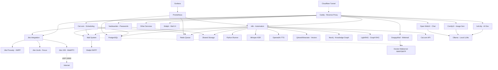

# 🚀 AI LaunchKit

<div align="center">

**Open-Source AI Development Toolkit**

*Deploy your complete AI stack in minutes, not weeks*

[](LICENSE)
[](https://github.com/freddy-schuetz/ai-launchkit)
[](https://github.com/kossakovsky/n8n-installer)

[Installation](#-installation) • [Features](#-whats-included) • [Documentation](#-documentation) • [Support](#-support)

</div>

---

## 🎯 What is AI LaunchKit?

AI LaunchKit is a comprehensive, self-hosted AI development environment that deploys **50+ pre-configured tools** with a single command. Build AI applications, automate workflows, generate images, and develop with AI assistance - all running on your own infrastructure.

Originally forked from [n8n-installer](https://github.com/kossakovsky/n8n-installer), AI LaunchKit has evolved into a complete AI development platform, maintained by [Friedemann Schuetz](https://www.linkedin.com/in/friedemann-schuetz).

### 🎬 Quick Demo

```bash
# One command to rule them all
git clone https://github.com/freddy-schuetz/ai-launchkit && cd ai-launchkit && sudo bash ./scripts/install.sh
```

**That's it!** Your AI development stack is ready in ~10-15 minutes.

**ATTENTION!** The AI LaunchKit is currently in development. It is regularly tested and updated. However, use is at your own risk!

---

## ✨ What's Included

### 📧 Mail System

| Tool | Description | Always Active | Purpose |
|------|-------------|---------------|----------|
| **[Mailpit](https://github.com/axllent/mailpit)** | Mail catcher with web UI Access: `mail.yourdomain.com` | ✅ Yes | Development/Testing - captures all emails |
| **[Docker-Mailserver](https://github.com/docker-mailserver/docker-mailserver)** | Production mail server | ⚡ Optional | Real email delivery for production |
| **[SnappyMail](https://github.com/the-djmaze/snappymail)** | Modern webmail client Access: `webmail.yourdomain.com` | ⚡ Optional | Web interface for Docker-Mailserver |

**Mail Configuration:**
- Mailpit automatically configured for all services (always active)
- Docker-Mailserver available for production email delivery (optional)
- SnappyMail provides a modern web interface for email access (optional, requires Docker-Mailserver)
- Web UI to view all captured emails
- Zero manual configuration needed!

### 🔧 Workflow Automation

| Tool | Description | Use Cases | Access |
|------|-------------|-----------|--------|
| **[n8n](https://github.com/n8n-io/n8n)** | Visual workflow automation platform | API integrations, data pipelines, business automation | `n8n.yourdomain.com` |
| **[n8n-MCP](https://github.com/czlonkowski/n8n-mcp)** | AI workflow generator for n8n | Claude/Cursor integration, 525+ node docs, workflow validation | `n8nmcp.yourdomain.com` |
| **300+ Workflows** | Pre-built n8n templates | Email automation, social media, data sync, AI workflows | Imported on install |

### 🎯 User Interfaces

| Tool | Description | Use Cases | Access |
|------|-------------|-----------|--------|
| **[Open WebUI](https://github.com/open-webui/open-webui)** | ChatGPT-like interface for LLMs | AI chat, model switching, conversation management | `webui.yourdomain.com` |
| **[Postiz](https://github.com/gitroomhq/postiz-app)** | Social media management platform | Content scheduling, analytics, multi-platform posting | `postiz.yourdomain.com` |

### 📹 Video Conferencing

| Tool | Description | Use Cases | Access |
|------|-------------|-----------|--------|
| **[Jitsi Meet](https://github.com/jitsi/jitsi-meet)** ⚠️ | Professional video conferencing platform | Client meetings, team calls, webinars, Cal.com integration | `meet.yourdomain.com` |

**⚠️ Jitsi Meet Requirements:**
- **CRITICAL:** Requires UDP Port 10000 for WebRTC audio/video
- Many VPS providers block UDP traffic by default
- Without UDP 10000: Only chat works, no audio/video!
- Test UDP connectivity before production use
- Alternative: Use external services (Zoom, Google Meet) with Cal.com

### 💼 Business & Productivity

| Tool | Description | Use Cases | Access |
|------|-------------|-----------|--------|
| **[Cal.com](https://github.com/calcom/cal.com)** | Open-source scheduling platform | Meeting bookings, team calendars, payment integrations | `cal.yourdomain.com` |
| **[Vikunja](https://github.com/go-vikunja/vikunja)** | Modern task management platform | Kanban boards, Gantt charts, team collaboration, CalDAV | `vikunja.yourdomain.com` |
| **[Leantime](https://github.com/Leantime/leantime)** | Goal-oriented project management suite | ADHD-friendly PM, time tracking, sprints, strategy tools | `leantime.yourdomain.com` |
| **[Kimai](https://github.com/kimai/kimai)** | Professional time tracking | DSGVO-compliant billing, team timesheets, API, 2FA, invoicing | `time.yourdomain.com` |
| **[Invoice Ninja](https://github.com/invoiceninja/invoiceninja)** | Professional invoicing & payment platform | Multi-currency invoices, 40+ payment gateways, recurring billing, client portal | `invoices.yourdomain.com` |
| **[Baserow](https://github.com/bram2w/baserow)** | Airtable Alternative with real-time collaboration | Database management, project tracking, collaborative workflows | `baserow.yourdomain.com` |
| **[NocoDB](https://github.com/nocodb/nocodb)** | Open-source Airtable alternative with API & webhooks | Smart spreadsheet UI, realtime collaboration, automation | `nocodb.yourdomain.com` |
| **[Formbricks](https://github.com/formbricks/formbricks)** | Privacy-first survey platform | Customer feedback, NPS surveys, market research, form builder, GDPR-compliant | `forms.yourdomain.com` |
| **[Metabase](https://github.com/metabase/metabase)** | User-friendly business intelligence platform | No-code dashboards, automated reports, data exploration, team analytics | `analytics.yourdomain.com` |
| **[Odoo 18](https://github.com/odoo/odoo)** | Open Source ERP/CRM with AI features | Sales automation, inventory, accounting, AI lead scoring | `odoo.yourdomain.com` |
| **[Twenty CRM](https://github.com/twentyhq/twenty)** | Modern Notion-like CRM | Customer pipelines, GraphQL API, team collaboration, lightweight CRM for startups | `twenty.yourdomain.com` |
| **[EspoCRM](https://github.com/espocrm/espocrm)** | Full-featured CRM platform | Email campaigns, workflow automation, advanced reporting, role-based access | `espocrm.yourdomain.com` |
| **[Mautic](https://github.com/mautic/mautic)** | Marketing automation platform | Lead scoring, email campaigns, landing pages, multi-channel marketing, automation workflows | `mautic.yourdomain.com` |

### 🎨 AI Content Generation

| Tool | Description | Use Cases | Access |
|------|-------------|-----------|--------|
| **[ComfyUI](https://github.com/comfyanonymous/ComfyUI)** | Node-based Stable Diffusion interface | Image generation, AI art, photo editing, workflows | `comfyui.yourdomain.com` |

### 💻 AI-Powered Development / Vibe Coding

| Tool | Description | Use Cases | Access |
|------|-------------|-----------|--------|
| **[bolt.diy](https://github.com/stackblitz-labs/bolt.diy)** | Build full-stack apps with prompts | Rapid prototyping, MVP creation, learning to code | `bolt.yourdomain.com` |
| **[OpenUI](https://github.com/wandb/openui)** 🧪 | AI-powered UI component generation | Design systems, component libraries, mockups | `openui.yourdomain.com` |

### 🤖 AI Agents

| Tool | Description | Use Cases | Access |
|------|-------------|-----------|--------|
| **[Flowise](https://github.com/FlowiseAI/Flowise)** | Visual AI agent builder | Chatbots, customer support, AI workflows | `flowise.yourdomain.com` |
| **[LiveKit](https://github.com/livekit/livekit)** + Agents | Real-time voice agents with WebRTC (auto-uses Whisper/TTS/Ollama or OpenAI) | AI voice assistants, conversational AI, ChatGPT-like voice bots, requires UDP 50000-50100 | `livekit.yourdomain.com` |
| **[Dify](https://github.com/langgenius/dify)** | LLMOps platform for AI apps | Production AI apps, model management, prompt engineering | `dify.yourdomain.com` |
| **[Letta](https://github.com/letta-ai/letta)** | Stateful agent server | Persistent AI assistants, memory management | `letta.yourdomain.com` |
| **[Browser-use](https://github.com/browser-use/browser-use)** | LLM-powered browser control | Web scraping, form filling, automated testing | Internal API only |
| **[Skyvern](https://skyvern.com)** | Vision-based browser automation | Complex web tasks, CAPTCHA handling, dynamic sites | Internal API only |
| **[Browserless](https://browserless.io)** | Headless Chrome service | Puppeteer/Playwright hub, PDF generation, screenshots | Internal WebSocket |

### 📚 RAG Systems

| Tool | Description | Use Cases | Access |
|------|-------------|-----------|--------|
| **[RAGApp](https://github.com/ragapp/ragapp)** | Build RAG assistants over your data | Knowledge bases, document Q&A, research tools | `ragapp.yourdomain.com` |
| **[Qdrant](https://github.com/qdrant/qdrant)** | High-performance vector database | Semantic search, recommendations, RAG storage | `qdrant.yourdomain.com` |
| **[Weaviate](https://github.com/weaviate/weaviate)** | AI-native vector database | Hybrid search, multi-modal data, GraphQL API | `weaviate.yourdomain.com` |

### 🎙️ Speech, Language & Text Processing

| Tool | Description | Use Cases | Access |
|------|-------------|-----------|--------|
| **[Faster-Whisper](https://github.com/SYSTRAN/faster-whisper)** | OpenAI-compatible Speech-to-Text | Transcription, voice commands, meeting notes | Internal API |
| **[OpenedAI-Speech](https://github.com/matatonic/openedai-speech)** | OpenAI-compatible Text-to-Speech | Voice assistants, audiobooks, notifications | Internal API |
| **[TTS Chatterbox](https://github.com/resemble-ai/chatterbox)** | State-of-the-art TTS with emotion control & voice cloning | AI voices with emotional expression, voice synthesis, outperforms ElevenLabs | `chatterbox.yourdomain.com` |
| **[LibreTranslate](https://github.com/LibreTranslate/LibreTranslate)** | Self-hosted translation API | 50+ languages, document translation, privacy-focused | `translate.yourdomain.com` |
| **OCR Bundle: [Tesseract](https://github.com/tesseract-ocr/tesseract) & [EasyOCR](https://github.com/JaidedAI/EasyOCR)** | Dual OCR engines: Tesseract (fast) + EasyOCR (quality) | Text extraction from images/PDFs, receipt scanning, document digitization | Internal API |
| **[Scriberr](https://github.com/rishikanthc/Scriberr)** | AI audio transcription with WhisperX & speaker diarization | Meeting transcripts, podcast processing, call recordings, speaker identification | `scriberr.yourdomain.com` |
| **[Vexa](https://github.com/Vexa-ai/vexa)** | Real-time meeting transcription API | Live transcription for Google Meet & Teams, speaker identification, 99 languages, n8n integration | Internal API |

*If you have troubles installing or updating Vexa, please view this guide:* **[Vexa Workaround](https://github.com/freddy-schuetz/ai-launchkit/blob/main/vexa-troubleshooting-workarounds.md)**

### 🔍 Search & Web Data

| Tool | Description | Use Cases | Access |
|------|-------------|-----------|--------|
| **[SearXNG](https://github.com/searxng/searxng)** | Privacy-respecting metasearch engine | Web search for agents, no tracking, multiple sources | `searxng.yourdomain.com` |
| **[Perplexica](https://github.com/ItzCrazyKns/Perplexica)** | Open-source AI-powered search engine | Deep research, academic search, Perplexity AI alternative | `perplexica.yourdomain.com` |
| **[Crawl4Ai](https://github.com/unclecode/crawl4ai)** | AI-optimized web crawler | Web scraping, data extraction, site monitoring | Internal API |
| **[GPT Researcher](https://github.com/assafelovic/gpt-researcher)** | Autonomous research agent (2000+ word reports) | Comprehensive research reports, multi-source analysis, citations | `research.yourdomain.com` |
| **[Local Deep Research](https://github.com/langchain-ai/local-deep-researcher)** | LangChain's iterative deep research (~95% accuracy) | Fact-checking, detailed analysis, research loops with reflection | Internal API |

### 🧠 Knowledge Graphs

| Tool | Description | Use Cases | Access |
|------|-------------|-----------|--------|
| **[Neo4j](https://github.com/neo4j/neo4j)** | Graph database platform | Knowledge graphs, entity relationships, fraud detection, recommendations | `neo4j.yourdomain.com` |
| **[LightRAG](https://github.com/HKUDS/LightRAG)** | Graph-based RAG with entity extraction | Automatic knowledge graph creation, relationship mapping, complex queries | `lightrag.yourdomain.com` |

### 🎬 Media Processing Suite

Pre-installed in the n8n container for seamless media manipulation:

| Tool | Description | Use Cases |
|------|-------------|-----------|
| **[FFmpeg](https://github.com/FFmpeg/FFmpeg)** | Industry-standard multimedia framework | Video conversion, streaming, audio extraction |
| **[ImageMagick](https://github.com/ImageMagick/ImageMagick)** | Image manipulation toolkit | Format conversion, resizing, effects, thumbnails |
| **[ExifTool](https://github.com/exiftool/exiftool)** | Metadata management | Read/write EXIF, IPTC, XMP metadata |
| **[MediaInfo](https://github.com/MediaArea/MediaInfo)** | Media file analyzer | Codec detection, bitrate analysis, format info |
| **[SoX](http://sox.sourceforge.net/)** | Sound processing utility | Audio format conversion, effects, resampling |
| **[Ghostscript](https://github.com/ArtifexSoftware/ghostscript)** | PDF/PostScript processor | PDF manipulation, conversion, optimization |
| **Python3 + Libraries** | Pillow, OpenCV, NumPy, Pandas | Image processing, data analysis, automation |

### 🗄️ Data Infrastructure

| Tool | Description | Use Cases | Access |
|------|-------------|-----------|--------|
| **[Supabase](https://github.com/supabase/supabase)** | Open-source Firebase alternative | Instant APIs, auth, realtime, storage, edge functions | `supabase.yourdomain.com` |
| **[PostgreSQL 17](https://www.postgresql.org/)** | Advanced relational database | Primary database for n8n, Cal.com, and other services | Internal only |
| **[Redis](https://github.com/redis/redis)** | In-memory data store | Queue management, caching, session storage | Internal only |

### ⚙️ System Management

| Tool | Description | Use Cases | Access |
|------|-------------|-----------|--------|
| **[Vaultwarden](https://github.com/dani-garcia/vaultwarden)** | Bitwarden-compatible password manager | Credential management, team password sharing, auto-fill | `vault.yourdomain.com` |
| **[Caddy](https://github.com/caddyserver/caddy)** | Automatic HTTPS reverse proxy | SSL certificates, load balancing, routing | Automatic |
| **[Cloudflare Tunnel](https://github.com/cloudflare/cloudflared)** | Secure tunnel without port forwarding | Zero-trust access, DDoS protection, firewall bypass | Optional |
| **[Python Runner](https://github.com/n8n-io/n8n)** | Isolated Python environment | Execute Python scripts from n8n workflows | Internal only |
| **[Grafana](https://github.com/grafana/grafana)** | Metrics visualization platform | System monitoring, performance dashboards, alerting | `grafana.yourdomain.com` |
| **[Prometheus](https://github.com/prometheus/prometheus)** | Metrics collection & alerting | Time-series database, service monitoring, resource tracking | Internal only |
| **[Portainer](https://github.com/portainer/portainer)** | Docker management interface | Container monitoring, logs, restart services | `portainer.yourdomain.com` |

### 🧰 AI Support Tools

| Tool | Description | Use Cases | Access |
|------|-------------|-----------|--------|
| **[Ollama](https://github.com/ollama/ollama)** | Local LLM runtime | Run Llama, Mistral, Phi locally, API-compatible | `ollama.yourdomain.com` |
| **[Gotenberg](https://github.com/gotenberg/gotenberg)** | Universal document converter | HTML/Markdown → PDF, Office → PDF, merge PDFs | Internal API |
| **[Stirling-PDF](https://github.com/Stirling-Tools/Stirling-PDF)** | PDF toolkit | Split, merge, compress, OCR, sign PDFs | `pdf.yourdomain.com` |

### 🛡️ AI Security & Compliance

| Tool | Description | Use Cases | Access |
|------|-------------|-----------|--------|
| **[LLM Guard](https://github.com/protectai/llm-guard)** | Input/output filtering for LLMs | Prompt injection prevention, toxicity filtering, PII removal | Internal API |
| **[Microsoft Presidio](https://github.com/microsoft/presidio)** | PII detection & anonymization (English) | GDPR compliance, data protection, sensitive data handling | Internal API |
| **[Flair NER](https://github.com/flairNLP/flair)** | German PII detection | DSGVO compliance, German text processing, entity recognition | Internal API |

---

## 🚀 Quick Start

### Installation Command

```bash
git clone https://github.com/freddy-schuetz/ai-launchkit && cd ai-launchkit && sudo bash ./scripts/install.sh
```

### What the Installer Does

1. **Checks Prerequisites** - Verifies Docker, domain, and system requirements
2. **Configures Services** - Sets up environment variables and generates secure passwords
3. **Deploys Stack** - Starts all selected services with Docker Compose
4. **Obtains SSL Certificates** - Automatic HTTPS via Caddy
5. **Imports Workflows** - Optional: Downloads 300+ pre-built n8n templates
6. **Generates Report** - Provides access URLs and credentials

### After Installation

1. **Access n8n:** Navigate to `https://n8n.yourdomain.com`
2. **Create Admin Account:** First visitor becomes owner
3. **Configure API Keys:** Add OpenAI, Anthropic, Groq keys in `.env` file
4. **Explore Services:** Check the final report for all URLs and credentials
5. **Import Credentials to Vaultwarden:** Run `sudo bash ./scripts/download_credentials.sh`

### Installation Time

- **Base Installation:** 10-15 minutes
- **With Workflow Import:** +20-30 minutes (optional)
- **Total:** 15-45 minutes depending on selections

**System Requirements:**
- 4GB RAM minimum (8GB+ recommended)
- 40GB disk space (more for media/models)
- Ubuntu 22.04/24.04 or Debian 11/12
- Domain with wildcard DNS configured

---

## 📦 Installation - Detailed version

### Prerequisites

Before installing AI LaunchKit, ensure you have:

1. **Server:** Ubuntu 22.04/24.04 or Debian 11/12 LTS
   - 4GB RAM minimum (8GB+ recommended for AI workloads)
   - 40GB+ disk space (SSD recommended)
   - Root or sudo access

2. **Domain:** A registered domain with wildcard DNS
   ```
   A *.yourdomain.com -> YOUR_SERVER_IP
   ```

3. **Access:** SSH access to your server

### Step-by-Step Installation

#### Step 1: Connect to Your Server

```bash
# Connect via SSH
ssh root@YOUR_SERVER_IP

# Or with key authentication
ssh -i ~/.ssh/your-key.pem user@YOUR_SERVER_IP
```

#### Step 2: Clone Repository

```bash
# Clone AI LaunchKit
git clone https://github.com/freddy-schuetz/ai-launchkit

# Navigate into directory
cd ai-launchkit
```

#### Step 3: Run Installer

```bash
# Start installation wizard
sudo bash ./scripts/install.sh
```

#### Step 4: Answer Installation Prompts

The installer will ask you for:

**1. Domain Name:**
```
Enter your domain (e.g., example.com): yourdomain.com
```

**2. Email Address:**
```
Enter email for SSL certificates: admin@yourdomain.com
```

**3. API Keys (Optional):**
```
Enter OpenAI API key (or press Enter to skip): sk-...
Enter Anthropic API key (or press Enter to skip): sk-ant-...
Enter Groq API key (or press Enter to skip): gsk_...
```

**4. Community Workflows (Optional):**
```
Import 300+ n8n community workflows? [y/N]: y
```
*Note: This takes 20-30 minutes extra*

**5. Worker Configuration:**
```
How many n8n workers? (1-4): 2
```

**6. Service Selection:**
```
Install Docker-Mailserver for production email? [y/N]: n
Install SnappyMail webmail client? [y/N]: n
Install Jitsi Meet? [y/N]: y
... (and more services)
```

#### Step 5: Installation Progress

The installer will now:
1. ✅ Install Docker and Docker Compose
2. ✅ Generate secure passwords
3. ✅ Configure services
4. ✅ Start Docker containers
5. ✅ Request SSL certificates
6. ✅ Import workflows (if selected)
7. ✅ Generate final report

#### Step 6: Save Installation Report

At the end, you'll see:

```
================================
Installation Complete! 🎉
================================

Access URLs:
  n8n: https://n8n.yourdomain.com
  bolt.diy: https://bolt.yourdomain.com
  Mailpit: https://mail.yourdomain.com
  ... (more services)

Download credentials with:
sudo bash ./scripts/download_credentials.sh
```

**Important:** Save the installation output - it contains all passwords!

### Post-Installation Steps

#### First Login to Services

**n8n (Workflow Automation):**
1. Open `https://n8n.yourdomain.com`
2. First visitor creates owner account
3. Choose strong password (min 8 characters)
4. Setup complete!

**Vaultwarden (Password Manager):**
1. Open `https://vault.yourdomain.com`
2. Click "Create Account"
3. Set master password (very strong!)
4. Import AI LaunchKit credentials:
   ```bash
   sudo bash ./scripts/download_credentials.sh
   ```
5. Download JSON file and import in Vaultwarden

**Other Services:**
- Most services: First user = admin
- Some require credentials from `.env` file
- Check the installation output or `.env` file for credentials

#### Configure API Keys (Optional)

If you skipped API keys during installation:

```bash
# Edit environment file
nano .env

# Add your keys:
OPENAI_API_KEY=sk-your-key-here
ANTHROPIC_API_KEY=sk-ant-your-key-here
GROQ_API_KEY=gsk_your-key-here

# Save and exit (Ctrl+X, Y, Enter)

# Apply changes
docker compose restart
```

#### DNS Verification

Ensure your domains are resolving correctly:

```bash
# Test DNS resolution
nslookup n8n.yourdomain.com
nslookup bolt.yourdomain.com

# Test HTTPS access
curl -I https://n8n.yourdomain.com
# Should return: HTTP/2 200
```

#### Firewall Check

Verify firewall rules are correct:

```bash
sudo ufw status

# Should show:
# 22/tcp                     ALLOW       Anywhere
# 80/tcp                     ALLOW       Anywhere
# 443/tcp                    ALLOW       Anywhere
```

### Optional: Docker-Mailserver Setup

If you selected Docker-Mailserver for production email:

#### Add Email Accounts

```bash
# Create first email account
docker exec -it mailserver setup email add admin@yourdomain.com

# Create additional accounts
docker exec -it mailserver setup email add noreply@yourdomain.com
docker exec -it mailserver setup email add support@yourdomain.com

# List all accounts
docker exec mailserver setup email list
```

#### Configure DNS for Email

**Required DNS Records:**

```
# MX Record
Type: MX
Name: @
Value: mail.yourdomain.com
Priority: 10

# A Record for mail
Type: A  
Name: mail
Value: YOUR_SERVER_IP

# SPF Record
Type: TXT
Name: @
Value: v=spf1 mx ~all

# DMARC Record
Type: TXT
Name: _dmarc
Value: v=DMARC1; p=none; rua=mailto:postmaster@yourdomain.com
```

#### Generate DKIM Keys

```bash
# Generate DKIM signature
docker exec mailserver setup config dkim

# Get public key for DNS
docker exec mailserver cat /tmp/docker-mailserver/opendkim/keys/yourdomain.com/mail.txt

# Add as TXT record:
# Name: mail._domainkey
# Value: (paste the key from above)
```

### Troubleshooting Installation

#### Services Won't Start

```bash
# Check Docker is running
sudo systemctl status docker

# Check specific service logs
docker compose logs [service-name] --tail 50

# Common issues:
# - Not enough RAM: Reduce services or upgrade server
# - Port conflicts: Check if ports 80/443 are free
# - DNS not ready: Wait 15 minutes for propagation
```

#### SSL Certificate Errors

```bash
# Caddy might take a few minutes to get certificates
# Check Caddy logs:
docker compose logs caddy --tail 50

# If problems persist:
# 1. Verify DNS is correct
# 2. Check firewall allows 80/443
# 3. Restart Caddy
docker compose restart caddy
```

#### Docker Issues

```bash
# Restart Docker daemon
sudo systemctl restart docker

# Reset Docker network (if needed)
docker network prune -f

# Restart all services
cd ai-launchkit
docker compose restart
```

---

## 🔄 Update - Detailed version

### When to Update

Update AI LaunchKit when:
- New features are released
- Security patches are available
- Bug fixes are published
- You want the latest service versions

**Check for updates:**
```bash
cd ai-launchkit
git fetch origin
git log HEAD..origin/main --oneline
```

### Backup Before Update

**CRITICAL:** Always backup before updating!

```bash
# Navigate to AI LaunchKit
cd ai-launchkit

# Backup all Docker volumes
tar czf backup-$(date +%Y%m%d).tar.gz \
  /var/lib/docker/volumes/localai_*

# Backup PostgreSQL database
docker exec postgres pg_dumpall -U postgres > backup-$(date +%Y%m%d).sql

# Backup .env file
cp .env .env.backup

# Backup Docker Compose
cp docker-compose.yml docker-compose.yml.backup
```

**Move backups to safe location:**
```bash
# Create backup directory
mkdir -p ~/ai-launchkit-backups

# Move backups
mv backup-*.tar.gz ~/ai-launchkit-backups/
mv backup-*.sql ~/ai-launchkit-backups/

# Verify backups exist
ls -lh ~/ai-launchkit-backups/
```

### Update Procedure

#### Standard Update Process

```bash
# 1. Navigate to AI LaunchKit
cd ai-launchkit

# 2. Run update script
sudobash ./scripts/update.sh

# 3. Check service status
docker compose ps

# 4. Monitor logs for issues
docker compose logs -f --tail 100
```

### PostgreSQL Version Handling

**Important:** AI LaunchKit pins PostgreSQL to version 17 to prevent automatic upgrades.

#### Check Current PostgreSQL Version

```bash
docker exec postgres postgres --version
```

#### If You Have PostgreSQL 18

If you installed after September 26, 2025 and have PostgreSQL 18:

```bash
# Pin to PostgreSQL 18 in .env
echo "POSTGRES_VERSION=18" >> .env

# Update safely
bash scripts/update.sh
```

#### If You Experience Database Errors

If you see "database files are incompatible" errors:

<details>
<summary><b>Emergency Recovery Steps</b></summary>

```bash
# 1. BACKUP YOUR DATA (CRITICAL!)
docker exec postgres pg_dumpall -U postgres > emergency-backup.sql

# 2. Stop all services
docker compose down

# 3. Remove incompatible volume
docker volume rm localai_postgres_data

# 4. Pull latest fixes
git pull

# 5. Start PostgreSQL (now pinned to v17)
docker compose up -d postgres
sleep 10

# 6. Restore your data
docker exec -i postgres psql -U postgres < emergency-backup.sql

# 7. Start all services
docker compose up -d
```

</details>

#### Version Verification

After update, verify versions:

```bash
docker exec postgres postgres --version
# Should show: PostgreSQL 17.x or 18.x (if pinned)
```

### Post-Update Verification

#### Check Service Status

```bash
# View all services
docker compose ps

# All should show: STATUS = Up
# If any show "Restarting" wait 2-3 minutes, then check logs:
docker compose logs [service-name] --tail 50
```

#### Test Key Services

**n8n:**
```bash
curl -I https://n8n.yourdomain.com
# Should return: HTTP/2 200
```

**Database:**
```bash
docker exec postgres pg_isready -U postgres
# Should return: accepting connections
```

**Redis:**
```bash
docker exec redis redis-cli ping
# Should return: PONG
```

#### Monitor Resource Usage

```bash
# Check memory and CPU
docker stats --no-stream

# Check disk space
df -h
```

#### Verify Workflows Still Run

1. Open n8n: `https://n8n.yourdomain.com`
2. Open a test workflow
3. Click "Execute Workflow"
4. Verify it completes successfully

### Rollback Procedure

If the update causes issues, rollback to the previous version:

#### Quick Rollback

```bash
# 1. Navigate to AI LaunchKit
cd ai-launchkit

# 2. View commit history
git log --oneline -10

# 3. Rollback to previous commit
git reset --hard [previous-commit-hash]

# 4. Restore .env if needed
cp .env.backup .env

# 5. Restart with old version
docker compose down
docker compose up -d
```

#### Full Rollback with Data Restore

```bash
# 1. Stop services
docker compose down

# 2. Restore volumes from backup
tar xzf volumes-backup-YYYYMMDD.tar.gz

# 3. Restore PostgreSQL
docker compose up -d postgres
sleep 10
docker exec -i postgres psql -U postgres < backup-YYYYMMDD.sql

# 4. Start all services
docker compose up -d
```

### Service-Specific Updates

Some services may require additional steps:

#### ComfyUI Models

```bash
# Models are not automatically updated
# To update models, manually download new versions to:
/var/lib/docker/volumes/localai_comfyui_data/_data/models/
```

#### Ollama Models

```bash
# Update installed models
docker exec ollama ollama pull llama3.2
docker exec ollama ollama pull mistral
```

#### n8n Community Nodes

```bash
# Update community nodes
docker exec n8n npm update -g n8n

# Restart n8n
docker compose restart n8n
```

#### Supabase

```bash
# Supabase has multiple components
# All update together with docker compose pull
docker compose pull supabase-kong supabase-auth supabase-rest supabase-storage
docker compose up -d supabase-kong supabase-auth supabase-rest supabase-storage
```

### Update Troubleshooting

#### Services Won't Start After Update

```bash
# Check logs for specific error
docker compose logs [service-name] --tail 100

# Common fixes:
# 1. Recreate service
docker compose up -d --force-recreate [service-name]

# 2. Clear cache and restart
docker compose down
docker system prune -f
docker compose up -d

# 3. Restore from backup if needed
```

#### Database Connection Errors

```bash
# PostgreSQL not starting
docker compose logs postgres --tail 100

# Common causes:
# - Incompatible data format (see PostgreSQL section)
# - Corrupted data (restore from backup)
# - Insufficient disk space (check with df -h)
```

#### Port Conflicts After Update

```bash
# Check what's using the port
sudo lsof -i :80
sudo lsof -i :443

# Stop conflicting service
sudo systemctl stop [service-name]

# Or change port in .env
nano .env
# Change PORT_VARIABLE to different port
```

#### Missing Environment Variables

```bash
# Compare with .env.example
diff .env .env.example

# Add any missing variables
nano .env

# Restart services
docker compose restart
```

### Maintenance Updates

#### Regular Maintenance

```bash
# Clean up old Docker resources (monthly)
docker system prune -af --volumes

# Update system packages (monthly)
sudo apt update && sudo apt upgrade -y

# Check disk space (weekly)
df -h
docker system df
```

#### Security Updates

```bash
# Update OS security patches
sudo apt update
sudo apt upgrade -y

# Update Docker
sudo apt install docker-ce docker-ce-cli containerd.io

# Restart Docker daemon
sudo systemctl restart docker

# Restart all services
docker compose restart
```

### Update Best Practices

1. **Always Backup First** - Cannot stress this enough
2. **Test in Staging** - If you have a test environment
3. **Read Changelogs** - Know what's changing
4. **Update Off-Peak** - Minimize user impact
5. **Monitor After Update** - Watch logs for 24 hours
6. **Keep Backups** - Retain last 3-5 backups
7. **Document Changes** - Note what was updated and when

### Update Notifications

Stay informed about updates:

- **Watch GitHub Repository**: Get notifications for new releases
- **Join Community Forum**: [oTTomator Think Tank](https://thinktank.ottomator.ai/c/local-ai/18)
- **Discord** *(coming soon)*: Real-time update announcements

### Getting Help with Updates

If you encounter issues:

1. **Check Logs**: `docker compose logs [service]`
2. **Search Issues**: [GitHub Issues](https://github.com/freddy-schuetz/ai-launchkit/issues)
3. **Community Forum**: Ask for help
4. **Rollback**: Use the procedure above if needed

---

**Next Steps:** After updating, explore the [Services section](#-services) for new features in each tool.

---

## 📧 Services

This section provides detailed information for each service, including setup, n8n integration examples, and troubleshooting.

<!-- Each service will be added as an expandable <details> section in Phase 2 -->

### Mail System

<details>
<summary><b>📧 Mailpit - Development Mail Catcher</b></summary>

### What is Mailpit?

Mailpit is a modern email testing server with an integrated web UI. It captures all outgoing emails and displays them in a user-friendly interface - perfect for development and testing.

### Features

- **Email Capture:** Catches ALL emails from all services
- **Web UI:** Modern, fast, responsive interface
- **Real-time Updates:** New emails appear instantly
- **Search & Filter:** Search emails by sender, subject, etc.
- **API Access:** Programmatic access to emails
- **Zero Configuration:** Works out-of-the-box

### Initial Setup

**Mailpit is already pre-configured!** No setup required.

**Access the Web UI:**

1. Navigate to `https://mail.yourdomain.com`
2. No authentication required
3. All emails sent by services appear automatically here

**All services are pre-configured:**
- SMTP Host: `mailpit`
- SMTP Port: `1025`
- No authentication required
- No SSL/TLS

### n8n Integration Setup

Mailpit is **already pre-configured in n8n**. All "Send Email" nodes use Mailpit automatically.

**Send email from n8n (already configured):**

1. Create workflow
2. Add "Send Email" node
3. Node is already configured with Mailpit
4. Email is automatically captured in Mailpit

**Internal URL for manual configuration:** `http://mailpit:1025`

### Example Workflows

#### Example 1: Send Test Email

```javascript
// 1. Manual Trigger Node

// 2. Send Email Node (already pre-configured)
{
  "to": "test@example.com",
  "subject": "Test from AI LaunchKit",
  "text": "This email was captured by Mailpit!"
}

// 3. Open Mailpit Web UI
// → Email appears instantly at mail.yourdomain.com
```

#### Example 2: Test Automated Notifications

```javascript
// 1. Webhook Trigger Node
// Receives POST from external service

// 2. Code Node - Format email
const emailData = {
  to: "admin@example.com",
  subject: `New Notification: ${$json.event}`,
  html: `
    <h2>Event Details</h2>
    <p><strong>Type:</strong> ${$json.event}</p>
    <p><strong>Time:</strong> ${new Date().toLocaleString()}</p>
    <p><strong>Data:</strong> ${JSON.stringify($json.data, null, 2)}</p>
  `
};
return emailData;

// 3. Send Email Node
// → Sends to Mailpit for review

// 4. Test in Mailpit Web UI
// → Validate HTML formatting and data
```

#### Example 3: Test Service Email Configuration

```javascript
// Test Cal.com, Vikunja, Invoice Ninja, etc.
// All services → Mailpit automatically configured

// Test process:
// 1. Perform action in service (e.g., book meeting in Cal.com)
// 2. Service sends email
// 3. Check email in Mailpit Web UI
// 4. Validate format and content

// No code needed - services send directly to Mailpit!
```

### Troubleshooting

**Emails not appearing in Mailpit:**

```bash
# 1. Check Mailpit status
docker ps | grep mailpit
# Should show: STATUS = Up

# 2. Check Mailpit logs
docker logs mailpit --tail 50

# 3. Test SMTP connection
docker exec n8n nc -zv mailpit 1025
# Should return: Connection successful

# 4. Test from another container
docker exec -it [service-name] sh
nc -zv mailpit 1025
```

**Mailpit Web UI not accessible:**

```bash
# 1. Check Caddy logs
docker logs caddy | grep mailpit

# 2. Restart Mailpit container
docker compose restart mailpit

# 3. Clear browser cache
# CTRL+F5 or incognito mode

# 4. Check DNS
nslookup mail.yourdomain.com
# Should return your server IP
```

**Service cannot send emails:**

```bash
# 1. Check service SMTP settings
docker exec [service] env | grep SMTP
# Should show: SMTP_HOST=mailpit, SMTP_PORT=1025

# 2. Check Docker network
docker network inspect ai-launchkit_default | grep mailpit

# 3. Check service logs
docker logs [service] | grep -i "mail\|smtp"

# 4. Restart service
docker compose restart [service]
```

### Resources

- **GitHub:** https://github.com/axllent/mailpit
- **Documentation:** https://mailpit.axllent.org/docs/
- **API Documentation:** https://mailpit.axllent.org/docs/api/
- **Web-UI:** `https://mail.yourdomain.com`

</details>

<details>
<summary><b>📬 Docker-Mailserver - Production Email</b></summary>

### What is Docker-Mailserver?

Docker-Mailserver is a full-featured, production-ready mail server (SMTP, IMAP) with integrated spam protection and security features. Perfect for real email delivery in production.

### Features

- **Full SMTP/IMAP Support:** Real email delivery and receiving
- **DKIM/SPF/DMARC:** Configured for best deliverability
- **Rspamd Integration:** Automatic spam protection
- **User Management:** Easy CLI tools for account management
- **Secure by Default:** TLS/STARTTLS, modern cipher suites

### Initial Setup

**Prerequisite:** Docker-Mailserver must have been selected during installation.

#### 1. Configure DNS Records

These DNS entries are **required** for email delivery:

**MX Record:**
```
Type: MX
Name: @ (or yourdomain.com)
Value: mail.yourdomain.com
Priority: 10
```

**A Record for mail subdomain:**
```
Type: A
Name: mail
Value: YOUR_SERVER_IP
```

**SPF Record:**
```
Type: TXT
Name: @ (or yourdomain.com)
Value: "v=spf1 mx ~all"
```

**DMARC Record:**
```
Type: TXT
Name: _dmarc
Value: "v=DMARC1; p=none; rua=mailto:postmaster@yourdomain.com"
```

**DKIM Record (after installation):**
```bash
# Generate DKIM keys
docker exec mailserver setup config dkim

# Display public key for DNS
docker exec mailserver cat /tmp/docker-mailserver/opendkim/keys/yourdomain.com/mail.txt

# Add as TXT record:
# Name: mail._domainkey
# Value: (the displayed key)
```

#### 2. Create Email Accounts

```bash
# Create first account
docker exec -it mailserver setup email add admin@yourdomain.com

# Add more accounts
docker exec mailserver setup email add user@yourdomain.com
docker exec mailserver setup email add support@yourdomain.com

# List all accounts
docker exec mailserver setup email list
```

#### 3. Automatic Configuration

**All services automatically use Docker-Mailserver:**
- SMTP Host: `mailserver`
- SMTP Port: `587`
- Security: STARTTLS
- Authentication: noreply@yourdomain.com
- Password: auto-generated (see `.env`)

### n8n Integration Setup

**Create SMTP Credentials in n8n:**

1. Open n8n: `https://n8n.yourdomain.com`
2. Settings → Credentials → Add New
3. Credential Type: SMTP
4. Configuration:

```
Host: mailserver
Port: 587
User: noreply@yourdomain.com
Password: [see .env file - MAIL_NOREPLY_PASSWORD]
SSL/TLS: Enable STARTTLS
Sender Email: noreply@yourdomain.com
```

**Internal URL for HTTP Requests:** `http://mailserver:587`

### Example Workflows

#### Example 1: Send Production Email

```javascript
// 1. Manual Trigger Node

// 2. Send Email Node
// → Select SMTP credential (see setup above)
{
  "to": "customer@example.com",
  "subject": "Order Confirmation #12345",
  "html": `
    <h1>Thank you for your order!</h1>
    <p>Your order has been successfully processed.</p>
    <p>Order Number: #12345</p>
  `
}

// Email sent via Docker-Mailserver
// Recipient receives real email
```

#### Example 2: Cal.com Booking Notifications

```javascript
// Cal.com automatically sends emails via Docker-Mailserver:
// - Booking confirmations
// - Calendar invitations (.ics)
// - Reminders
// - Cancellations/rescheduling

// No configuration needed - automatic!
// All Cal.com emails → Docker-Mailserver → Recipients
```

#### Example 3: Invoice Ninja Integration

```javascript
// Configure SMTP in Invoice Ninja:
// Settings → Email Settings → SMTP Configuration
// Host: mailserver
// Port: 587
// Encryption: TLS
// Username: noreply@yourdomain.com
// Password: [from .env]

// Workflow example:
// 1. Invoice Ninja creates invoice
// 2. Invoice Ninja sends email via Docker-Mailserver
// 3. Customer receives professional invoice via email
```

### Troubleshooting

**Emails not being delivered:**

```bash
# 1. Check DNS records
nslookup -type=MX yourdomain.com
nslookup -type=TXT yourdomain.com

# 2. Check Docker-Mailserver logs
docker logs mailserver --tail 100

# 3. Check mail queue
docker exec mailserver postqueue -p

# 4. Check DKIM status
docker exec mailserver setup config dkim status

# 5. Send test email
docker exec mailserver setup email add test@yourdomain.com
# Then send from external to test@yourdomain.com
```

**SMTP authentication fails:**

```bash
# 1. Check account exists
docker exec mailserver setup email list

# 2. Test authentication
docker exec mailserver doveadm auth test noreply@yourdomain.com [password]

# 3. Verify password in .env
grep MAIL_NOREPLY_PASSWORD .env

# 4. Restart service
docker compose restart mailserver
```

**Spam issues (emails landing in spam):**

```bash
# 1. Check DKIM, SPF, DMARC
# Use online tools: https://mxtoolbox.com/

# 2. Check IP reputation
# https://multirbl.valli.org/

# 3. Check Rspamd logs
docker exec mailserver cat /var/log/rspamd/rspamd.log

# 4. Test outgoing port 25
telnet smtp.gmail.com 25
```

**Docker-Mailserver won't start:**

```bash
# 1. Check logs
docker logs mailserver --tail 100

# 2. Check volumes
docker volume ls | grep mailserver

# 3. Check ports (25, 465, 587, 993)
sudo netstat -tulpn | grep -E "25|465|587|993"

# 4. Recreate container
docker compose up -d --force-recreate mailserver
```

### Resources

- **GitHub:** https://github.com/docker-mailserver/docker-mailserver
- **Documentation:** https://docker-mailserver.github.io/docker-mailserver/latest/
- **Setup Guide:** https://docker-mailserver.github.io/docker-mailserver/latest/usage/
- **Best Practices:** https://docker-mailserver.github.io/docker-mailserver/latest/faq/

</details>

<details>
<summary><b>✉️ SnappyMail - Webmail Client</b></summary>

### What is SnappyMail?

SnappyMail is a modern, ultra-fast webmail client with only 138KB load time. It provides a complete email interface for Docker-Mailserver with professional features like PGP encryption and multi-account support.

### Features

- **Ultra-fast Performance:** 138KB initial load, 99% Lighthouse score
- **Multiple Accounts:** Manage multiple email accounts in one interface
- **Mobile Responsive:** Works perfectly on all devices
- **PGP Encryption:** Built-in support for encrypted emails
- **2-Factor Authentication:** Enhanced security for webmail access
- **No Database Required:** Simple file-based configuration
- **Dark Mode:** Built-in theme support

### Initial Setup

**Prerequisite:** Docker-Mailserver must be installed (SnappyMail requires IMAP/SMTP).

#### 1. Get Admin Password

```bash
# Display admin password
docker exec snappymail cat /var/lib/snappymail/_data_/_default_/admin_password.txt
```

#### 2. Configure Admin Panel

1. Open admin panel: `https://webmail.yourdomain.com/?admin`
2. Username: `admin`
3. Password: (from step 1)

#### 3. Add Domain

In the admin panel:

**Domains → Add Domain:**
```
Domain: yourdomain.com
IMAP Server: mailserver
IMAP Port: 143
IMAP Security: STARTTLS
SMTP Server: mailserver
SMTP Port: 587
SMTP Security: STARTTLS
```

#### 4. User Login

After domain configuration, users can log in:

1. URL: `https://webmail.yourdomain.com`
2. Email: `user@yourdomain.com`
3. Password: (User's Docker-Mailserver password)

### n8n Integration Setup

**SnappyMail is a webmail client without a direct API.** Integration happens via Docker-Mailserver:

**Email Workflow Architecture:**
```
n8n Send Email Node → Docker-Mailserver → SnappyMail (read emails)
```

**IMAP Integration in n8n (retrieve emails):**

1. Email (IMAP) Trigger Node in n8n
2. Configuration:

```
Host: mailserver
Port: 993
User: user@yourdomain.com
Password: [Docker-Mailserver Password]
TLS: Enabled
```

**Internal URLs:**
- IMAP: `mailserver:993` (with TLS) or `mailserver:143` (STARTTLS)
- SMTP: `mailserver:587` (STARTTLS)

### Example Workflows

#### Example 1: Email Management Workflow

```javascript
// SnappyMail Use Case: Manage emails via web UI

// Workflow Architecture:
// 1. Service sends email → Docker-Mailserver
// 2. User opens SnappyMail → Reads email
// 3. User replies → Sent via Docker-Mailserver

// n8n Parallel Workflow:
// 1. IMAP Trigger Node (mailserver:993)
//    → Automatically process new emails
// 2. Code Node - Analyze email
// 3. Conditional Node - Filter by criteria
// 4. Action Nodes - Automated actions
```

#### Example 2: Multi-Account Management

```javascript
// SnappyMail Feature: Manage multiple accounts

// Setup in SnappyMail:
// 1. User Login: user@yourdomain.com
// 2. Settings → Accounts → Add Account
// 3. Add more accounts (support@, sales@, etc.)
// 4. Switch between accounts with one click

// Manage all emails centrally!
```

#### Example 3: Ticket System Integration

```javascript
// 1. IMAP Trigger Node (mailserver:993)
//    Mailbox: support@yourdomain.com
//    → Waits for new support emails

// 2. Code Node - Extract ticket data
const ticketData = {
  from: $json.from.value[0].address,
  subject: $json.subject,
  body: $json.textPlain || $json.textHtml,
  date: $json.date,
  priority: $json.subject.includes('URGENT') ? 'high' : 'normal'
};
return ticketData;

// 3. HTTP Request Node - Create ticket
// POST to ticketing system API
{
  "title": ticketData.subject,
  "description": ticketData.body,
  "customer_email": ticketData.from,
  "priority": ticketData.priority
}

// 4. Send Email Node - Send confirmation
// → Customer receives ticket number
// → Email visible in SnappyMail

// Support team can reply in SnappyMail!
```

### Troubleshooting

**SnappyMail Web UI not accessible:**

```bash
# 1. Check container status
docker ps | grep snappymail
# Should show: STATUS = Up

# 2. Check logs
docker logs snappymail --tail 50

# 3. Get admin password again
docker exec snappymail cat /var/lib/snappymail/_data_/_default_/admin_password.txt

# 4. Check Caddy logs
docker logs caddy | grep snappymail

# 5. Restart container
docker compose restart snappymail
```

**Users cannot log in:**

```bash
# 1. Check domain configuration
# → Open admin panel: https://webmail.yourdomain.com/?admin
# → Domains → Check domain
# → Verify IMAP/SMTP settings

# 2. Check user account in Docker-Mailserver
docker exec mailserver setup email list

# 3. Test IMAP/SMTP connection
docker exec snappymail nc -zv mailserver 143
docker exec snappymail nc -zv mailserver 587

# 4. Test authentication
docker exec mailserver doveadm auth test user@yourdomain.com [password]

# 5. Check user-specific logs
docker logs snappymail | grep -i "login\|auth\|imap"
```

**Emails not showing:**

```bash
# 1. Check IMAP connection
docker exec snappymail nc -zv mailserver 143

# 2. Check mailbox in Docker-Mailserver
docker exec mailserver doveadm mailbox list -u user@yourdomain.com

# 3. Test email delivery
# Send test email to user@yourdomain.com

# 4. Check Docker-Mailserver logs
docker logs mailserver | grep user@yourdomain.com

# 5. Clear SnappyMail cache
docker exec snappymail rm -rf /var/lib/snappymail/_data_/_default_/cache/*
docker compose restart snappymail
```

**Performance issues:**

```bash
# 1. Check cache size
docker exec snappymail du -sh /var/lib/snappymail/_data_/_default_/cache/

# 2. Clear cache (if too large)
docker exec snappymail rm -rf /var/lib/snappymail/_data_/_default_/cache/*

# 3. Check container resources
docker stats snappymail --no-stream

# 4. Check logs for errors
docker logs snappymail | grep -i "error\|warning"

# 5. Restart container
docker compose restart snappymail
```

### Resources

- **GitHub:** https://github.com/the-djmaze/snappymail
- **Documentation:** https://snappymail.eu/docs/
- **Demo:** https://snappymail.eu/demo/
- **Admin Guide:** https://snappymail.eu/docs/admin/
- **Web-UI:** `https://webmail.yourdomain.com`
- **Admin Panel:** `https://webmail.yourdomain.com/?admin`

</details>

### Workflow Automation

<details>
<summary><b>🔧 n8n - Workflow Automation Platform</b></summary>

### What is n8n?

n8n is a powerful, extendable workflow automation platform that lets you connect anything to everything via its open, fair-code model. It's the heart of AI LaunchKit, orchestrating all integrations between the 50+ services.

### Features

- **400+ Integrations:** Pre-built nodes for popular services
- **Visual Workflow Editor:** Drag-and-drop interface for building automations
- **Custom Code Execution:** JavaScript/Python nodes for complex logic
- **Self-Hosted:** Full data control, no external dependencies
- **Active Community:** 300+ pre-built workflow templates included
- **Advanced Scheduling:** Cron expressions, intervals, webhook triggers
- **Error Handling:** Built-in retry logic, error workflows, monitoring

### Initial Setup

**First Login to n8n:**

1. Navigate to `https://n8n.yourdomain.com`
2. **First visitor becomes owner** - Create your admin account
3. Set strong password (minimum 8 characters)
4. Setup complete!

**Generate API Key (for external integrations):**

1. Click your profile (bottom left)
2. Settings → API
3. Create new API Key
4. Save securely - used for n8n-MCP and external automations

### n8n Integration Setup

n8n integrates with itself and other AI LaunchKit services:

#### Connect to Internal Services

**All services are pre-configured with internal URLs:**

```javascript
// PostgreSQL (internal database)
Host: postgres
Port: 5432
Database: n8n
User: n8n
Password: [from .env file]

// Redis (queue management)
Host: redis
Port: 6379

// Ollama (local LLMs)
Base URL: http://ollama:11434

// Mailpit (email testing)
SMTP Host: mailpit
SMTP Port: 1025
```

#### API Access from External Tools

```bash
# n8n API endpoint (external)
https://n8n.yourdomain.com/api/v1

# Authentication header
Authorization: Bearer YOUR_API_KEY

# Example: List all workflows
curl -X GET https://n8n.yourdomain.com/api/v1/workflows \
  -H "Authorization: Bearer YOUR_API_KEY"
```

### Example Workflows

#### Example 1: AI Email Processing Pipeline

Complete workflow for intelligent email handling:

```javascript
// 1. Email (IMAP) Trigger Node
Host: mailserver (or mailpit for testing)
Port: 993
TLS: Enabled
Check for new emails every: 1 minute

// 2. Code Node - Extract Email Data
const email = {
  from: $json.from.value[0].address,
  subject: $json.subject,
  body: $json.textPlain || $json.html,
  date: $json.date,
  attachments: $json.attachments ? $json.attachments.length : 0
};

// Classify email priority
const urgent = /urgent|asap|important/i.test(email.subject);
email.priority = urgent ? 'high' : 'normal';

return { json: email };

// 3. OpenAI Node - Analyze Email Content
Operation: Message a Model
Model: gpt-4o-mini
Messages:
  System: "You are an email classification assistant. Categorize emails into: Support, Sales, General, Spam"
  User: "Subject: {{$json.subject}}\n\nBody: {{$json.body}}"

// 4. Switch Node - Route by Category
Mode: Rules
Rules:
  - category equals "Support" → Route to support workflow
  - category equals "Sales" → Route to CRM
  - category equals "Spam" → Delete
  - default → Archive

// 5a. Support Route: Create Ticket
// HTTP Request to ticketing system
Method: POST
URL: http://baserow:8000/api/database/rows/table/tickets/
Body: {
  "title": "{{$('Extract Email').json.subject}}",
  "description": "{{$('Extract Email').json.body}}",
  "customer_email": "{{$('Extract Email').json.from}}",
  "priority": "{{$('Extract Email').json.priority}}",
  "status": "New"
}

// 6. Send Email Node - Auto-Reply
To: {{$('Extract Email').json.from}}
Subject: Re: {{$('Extract Email').json.subject}}
Message: |
  Thank you for contacting us!
  
  Your ticket #{{$json.id}} has been created.
  Our team will respond within 24 hours.
  
  Best regards,
  Support Team
```

#### Example 2: Multi-Service Data Sync

Sync data across multiple services automatically:

```javascript
// 1. Schedule Trigger Node
Trigger Interval: Every 15 minutes
Cron Expression: */15 * * * *

// 2. HTTP Request - Get New Customers from Supabase
Method: GET
URL: http://supabase-kong:8000/rest/v1/customers
Headers:
  apikey: {{$env.SUPABASE_ANON_KEY}}
  Authorization: Bearer {{$env.SUPABASE_ANON_KEY}}
Query Parameters:
  select: *
  created_at: gte.{{$now.minus(15, 'minutes').toISO()}}

// 3. Loop Over Items Node
// Process each new customer

// 4. Branch 1: Create in CRM (Twenty)
HTTP Request Node
Method: POST
URL: http://twenty:3000/graphql
Body (GraphQL):
mutation {
  createPerson(data: {
    firstName: "{{$json.first_name}}"
    lastName: "{{$json.last_name}}"
    email: "{{$json.email}}"
    phone: "{{$json.phone}}"
    companyId: "{{$json.company_id}}"
  }) {
    id
  }
}

// 5. Branch 2: Add to Mailing List (Mautic)
HTTP Request Node  
Method: POST
URL: http://mautic_web/api/contacts/new
Body: {
  "email": "{{$json.email}}",
  "firstname": "{{$json.first_name}}",
  "lastname": "{{$json.last_name}}",
  "tags": ["new-customer", "supabase-sync"]
}

// 6. Branch 3: Create Project (Leantime)
HTTP Request Node
Method: POST
URL: http://leantime:8080/api/jsonrpc
Body: {
  "jsonrpc": "2.0",
  "method": "leantime.rpc.projects.addProject",
  "params": {
    "values": {
      "name": "Onboarding - {{$json.company_name}}",
      "clientId": 1,
      "state": 0
    }
  },
  "id": 1
}

// 7. Slack Notification
Channel: #new-customers
Message: |
  🎉 New Customer Added!
  
  Name: {{$json.first_name}} {{$json.last_name}}
  Email: {{$json.email}}
  Company: {{$json.company_name}}
  
  Actions completed:
  ✅ Added to CRM
  ✅ Added to mailing list
  ✅ Onboarding project created
```

#### Example 3: AI Content Generation Pipeline

Generate and publish content automatically:

```javascript
// 1. Schedule Trigger
Trigger: Weekly on Monday at 10 AM

// 2. Code Node - Define Content Topics
const topics = [
  "AI automation trends",
  "Self-hosted tools benefits",
  "Workflow optimization tips",
  "Data privacy best practices"
];

// Random topic selection
const randomTopic = topics[Math.floor(Math.random() * topics.length)];

return {
  json: {
    topic: randomTopic,
    date: new Date().toISOString()
  }
};

// 3. OpenAI Node - Generate Blog Post
Operation: Message a Model
Model: gpt-4o
Messages:
  System: "You are a technical content writer specializing in AI and automation."
  User: |
    Write a comprehensive blog post about: {{$json.topic}}
    
    Requirements:
    - 800-1000 words
    - Include practical examples
    - SEO-optimized with relevant keywords
    - Engaging tone for technical audience
    - Include 3-5 actionable takeaways

// 4. OpenAI Node - Generate Social Media Posts
Operation: Message a Model
Model: gpt-4o-mini
Messages:
  User: |
    Create social media posts for this blog:
    {{$('Generate Blog Post').json.choices[0].message.content}}
    
    Create:
    1. LinkedIn post (max 1300 characters)
    2. Twitter thread (3-5 tweets)
    3. Instagram caption (max 2200 characters)

// 5. HTTP Request - Publish to WordPress/Ghost
Method: POST
URL: http://wordpress:80/wp-json/wp/v2/posts
Headers:
  Authorization: Basic {{$env.WORDPRESS_AUTH}}
Body: {
  "title": "{{$json.topic}}",
  "content": "{{$('Generate Blog Post').json.content}}",
  "status": "draft",
  "categories": [1]
}

// 6. Postiz Node - Schedule Social Posts
// Use native Postiz node or HTTP requests
// Schedule LinkedIn, Twitter, Instagram posts

// 7. Slack Notification
Channel: #content-team
Message: |
  📝 New Blog Post Generated!
  
  Topic: {{$('Define Topics').json.topic}}
  Status: Draft (ready for review)
  WordPress: {{$('Publish').json.link}}
  
  Social posts scheduled ✅
```

### Troubleshooting

**Workflows not executing:**

```bash
# 1. Check n8n container status
docker ps | grep n8n

# 2. Check n8n logs
docker logs n8n --tail 100

# 3. Check worker processes
docker logs n8n-worker --tail 100

# 4. Verify Redis connection
docker exec n8n nc -zv redis 6379

# 5. Check PostgreSQL connection
docker exec n8n nc -zv postgres 5432
```

**"Service not reachable" errors:**

```bash
# 1. Verify internal service is running
docker ps | grep [service-name]

# 2. Test internal DNS resolution
docker exec n8n ping [service-name]

# 3. Check Docker network
docker network inspect ai-launchkit_default

# 4. Verify port is correct
docker port [service-name]

# 5. Check service logs
docker logs [service-name] --tail 50
```

**Memory/Performance issues:**

```bash
# 1. Check resource usage
docker stats n8n --no-stream

# 2. Check worker count
grep N8N_WORKER_COUNT .env

# 3. Increase memory limit (if needed)
# Edit docker-compose.yml:
# mem_limit: 2g

# 4. Optimize workflows
# - Use pagination for large datasets
# - Add Wait nodes between bulk operations
# - Split complex workflows into smaller ones

# 5. Clear execution data
docker exec n8n n8n clear:executions --all
```

**Credential authentication failures:**

```bash
# 1. Check credential configuration
# In n8n: Credentials → Test Connection

# 2. Verify environment variables
docker exec n8n printenv | grep [SERVICE]

# 3. Check internal URLs
# Use service name, not localhost
# ✅ http://mailserver:587
# ❌ http://localhost:587

# 4. Recreate credential
# Delete and recreate in n8n UI

# 5. Restart n8n
docker compose restart n8n
```

**Webhook not receiving data:**

```bash
# 1. Test webhook URL
curl -X POST https://n8n.yourdomain.com/webhook-test/your-webhook \
  -H "Content-Type: application/json" \
  -d '{"test": "data"}'

# 2. Check Caddy logs
docker logs caddy | grep webhook

# 3. Verify webhook is active
# n8n → Workflow → Webhook node → Check "Listening"

# 4. Check firewall
sudo ufw status | grep 443

# 5. Test from external service
# Verify webhook URL is accessible from internet
```

### Resources

- **Official Documentation:** https://docs.n8n.io/
- **Community Forum:** https://community.n8n.io/
- **Workflow Templates:** https://n8n.io/workflows
- **API Documentation:** https://docs.n8n.io/api/
- **YouTube Tutorials:** https://www.youtube.com/@n8n-io
- **GitHub:** https://github.com/n8n-io/n8n

### Best Practices

**Workflow Organization:**
- Use descriptive workflow names
- Add notes to complex nodes
- Group related nodes with sticky notes
- Use consistent naming for credentials
- Version control: Export workflows as JSON

**Performance Optimization:**
- Use batch processing for large datasets
- Add Wait nodes between API calls
- Implement error handling with Try/Catch nodes
- Use pagination for API requests
- Monitor execution times

**Security:**
- Never hardcode credentials in workflows
- Use environment variables for sensitive data
- Implement webhook authentication
- Regularly rotate API keys
- Review workflow permissions

**Maintenance:**
- Regularly check error executions
- Monitor workflow execution times
- Update community nodes
- Backup workflows weekly
- Document complex logic in notes

</details>

<details>
<summary><b>🤖 n8n-MCP - AI Workflow Generator</b></summary>

### What is n8n-MCP?

n8n-MCP enables AI assistants like Claude Desktop and Cursor to generate complete n8n workflows through natural language. It provides access to documentation for 525+ n8n nodes, allowing AI tools to understand node properties, authentication requirements, and configuration options.

n8n-MCP implements the Model Context Protocol (MCP) standard, making it compatible with any MCP-enabled AI tool.

### Features

- **Complete node documentation** - Properties, authentication, and examples for 525+ nodes
- **Workflow generation** - Create complex automations from natural language prompts
- **Validation** - Ensures correct node configuration before deployment
- **99% coverage** - Supports nearly all n8n node properties and settings
- **MCP standard** - Works with any MCP-compatible AI tool (Claude, Cursor, etc.)

### Initial Setup

**Access n8n-MCP:**
- **External URL:** `https://n8nmcp.yourdomain.com`
- **Internal URL:** `http://n8nmcp:3000`
- **Token:** Found in `.env` file as `N8N_MCP_TOKEN`

**No web interface** - n8n-MCP is a backend service accessed through AI tools.

### Setup with Claude Desktop

**1. Locate Claude Desktop Config File:**

**macOS/Linux:**
```bash
~/.config/claude/claude_desktop_config.json
```

**Windows:**
```
%APPDATA%\Claude\claude_desktop_config.json
```

**2. Configure Claude Desktop:**

```json
{
  "mcpServers": {
    "n8n-mcp": {
      "command": "npx",
      "args": ["@czlonkowski/n8n-mcp-client"],
      "env": {
        "N8N_MCP_URL": "https://n8nmcp.yourdomain.com",
        "N8N_MCP_TOKEN": "your-token-from-env-file",
        "N8N_API_URL": "https://n8n.yourdomain.com",
        "N8N_API_KEY": "your-n8n-api-key"
      }
    }
  }
}
```

**3. Restart Claude Desktop**

### Setup with Cursor IDE

**Create `.cursor/mcp_config.json` in your project:**

```json
{
  "servers": {
    "n8n-mcp": {
      "url": "https://n8nmcp.yourdomain.com",
      "token": "your-token-from-env-file"
    }
  }
}
```

### Example Prompts for Claude/Cursor

#### Basic Automation

```
"Create an n8n workflow that monitors a Gmail inbox for invoices, 
extracts data using AI, and saves to Google Sheets"
```

**Claude will:**
1. Use n8n-MCP to look up node documentation
2. Generate complete workflow JSON
3. Configure all node properties correctly
4. Include authentication requirements
5. Provide deployment instructions

#### Complex Integration

```
"Build a workflow that:
1. Triggers on new Stripe payment
2. Creates invoice in QuickBooks
3. Sends receipt via SendGrid
4. Updates customer in Airtable
5. Posts to Slack channel"
```

**Result:** Complete workflow with all nodes configured, including:
- Webhook trigger
- API credentials
- Data transformations
- Error handling
- Notification logic

#### AI Pipeline

```
"Design a content pipeline that takes YouTube videos, 
transcribes with Whisper, summarizes with GPT-4, 
and posts to WordPress with SEO optimization"
```

**Claude generates:**
- YouTube data extraction
- Whisper transcription node
- OpenAI summarization
- WordPress API integration
- SEO metadata generation

### Available MCP Commands

n8n-MCP provides these commands to AI assistants:

**`list_nodes`** - Get all available n8n nodes
```json
Response: {
  "nodes": ["HTTP Request", "Code", "IF", "Gmail", "Slack", ...]
}
```

**`get_node_docs`** - Full documentation for specific node
```json
Request: { "node": "HTTP Request" }
Response: {
  "properties": [...],
  "authentication": [...],
  "examples": [...]
}
```

**`validate_workflow`** - Check workflow configuration
```json
Request: { "workflow": {...} }
Response: {
  "valid": true,
  "errors": []
}
```

**`suggest_nodes`** - Get node recommendations for task
```json
Request: { "task": "send email with attachment" }
Response: {
  "nodes": ["Gmail", "Send Email", "IMAP"],
  "reasoning": "..."
}
```

### n8n Integration

**HTTP Request to n8n-MCP from n8n workflow:**

```javascript
// HTTP Request Node Configuration
Method: POST
URL: https://n8nmcp.yourdomain.com/generate
Authentication: Header Auth
  Header: Authorization
  Value: Bearer {{$env.N8N_MCP_TOKEN}}
  
Body (JSON):
{
  "prompt": "Create workflow to sync Notion database with Google Calendar",
  "target_n8n": "https://n8n.yourdomain.com",
  "auto_import": true
}

// Response:
{
  "workflow": {...},
  "import_url": "https://n8n.yourdomain.com/workflows/import",
  "validation": { "valid": true }
}
```

### Example: AI-Generated Workflow

**Prompt to Claude:**
```
"Create an n8n workflow that:
1. Watches a folder in Google Drive
2. When a new PDF is added, extract text with OCR
3. Summarize the content with OpenAI
4. Create a task in Vikunja with the summary
5. Send notification to Slack"
```

**Claude with n8n-MCP generates:**

```javascript
// 1. Google Drive Trigger Node
Trigger: On File Created
Folder: "/Invoices"
File Type: PDF

// 2. HTTP Request Node - OCR Service
Method: POST
URL: http://tesseract:8000/ocr
Body: 
  file: {{$binary.data}}
  language: eng

// 3. OpenAI Node - Summarization
Operation: Message a Model
Model: gpt-4o-mini
System Message: "Summarize this invoice in 2-3 sentences"
User Message: {{$json.text}}

// 4. HTTP Request Node - Vikunja API
Method: POST
URL: http://vikunja:3456/api/v1/tasks
Headers:
  Authorization: Bearer {{$credentials.vikunjaToken}}
Body:
{
  "title": "Invoice: {{$('Google Drive').json.name}}",
  "description": "{{$json.summary}}",
  "project_id": 1
}

// 5. Slack Node
Operation: Send Message
Channel: #finance
Message: |
  New invoice processed:
  File: {{$('Google Drive').json.name}}
  Summary: {{$('OpenAI').json.summary}}
  Task: {{$('Vikunja').json.link}}
```

### Tips for Best Results

**Be Specific:**
```
❌ "Create a workflow to process emails"
✅ "Create a workflow that reads unread Gmail emails, 
   extracts attachments, uploads to Google Drive, 
   and marks email as read"
```

**Include Tool Names:**
```
❌ "Send data to my CRM"
✅ "Send data to Odoo CRM via HTTP Request node"
```

**Provide Sample Data:**
```
"Process customer data like:
{
  'name': 'John Doe',
  'email': 'john@example.com',
  'company': 'Acme Corp'
}"
```

**Iterate Through Conversation:**
```
1. "Create workflow to process invoices"
2. [Claude generates initial workflow]
3. "Add error handling and retry logic"
4. [Claude enhances workflow]
5. "Add notification to Microsoft Teams instead of Slack"
6. [Claude updates notification node]
```

### Workflow Version Control

**Export Workflows as JSON:**

```bash
# After AI generates workflow, export it
curl -X GET https://n8n.yourdomain.com/api/v1/workflows/123 \
  -H "Authorization: Bearer YOUR_API_KEY" \
  > workflow-v1.json

# Commit to Git
git add workflow-v1.json
git commit -m "Add AI-generated invoice processing workflow"
```

### Troubleshooting

**Connection refused:**
```bash
# Check n8n-MCP is running
docker ps | grep n8nmcp

# Check token in .env
grep N8N_MCP_TOKEN .env

# Test connection
curl -H "Authorization: Bearer YOUR_TOKEN" \
  https://n8nmcp.yourdomain.com/health
```

**Invalid workflow generated:**
```bash
# Use validation endpoint
curl -X POST https://n8nmcp.yourdomain.com/validate \
  -H "Authorization: Bearer YOUR_TOKEN" \
  -d '{"workflow": {...}}'

# Check n8n-MCP logs
docker logs n8nmcp --tail 100
```

**Missing node documentation:**
```bash
# Update n8n-MCP to latest version
docker compose pull n8nmcp
docker compose up -d n8nmcp

# Rebuild node cache
docker exec n8nmcp npm run rebuild-cache
```

**Timeout errors:**
```bash
# Increase timeout in MCP client config
{
  "mcpServers": {
    "n8n-mcp": {
      ...
      "timeout": 60000
    }
  }
}
```

### Resources

- **Documentation:** https://github.com/czlonkowski/n8n-mcp
- **MCP Protocol:** https://modelcontextprotocol.io
- **n8n API Reference:** https://docs.n8n.io/api/
- **Community Examples:** https://n8n.io/workflows (filter by "AI-generated")

### Best Practices

**Prompt Engineering:**
- Start with high-level description
- Add details incrementally
- Test each addition
- Use real data examples
- Specify error handling requirements

**Security:**
- Never include credentials in prompts
- Use n8n credential system
- Validate AI-generated workflows before production
- Review generated code for security issues

**Maintenance:**
- Export workflows to Git after generation
- Document prompt used to generate workflow
- Test generated workflows thoroughly
- Keep n8n-MCP updated for latest node support

**Performance:**
- Break complex workflows into smaller ones
- Use webhook triggers instead of polling where possible
- Implement rate limiting for external APIs
- Monitor workflow execution times

</details>

### User Interfaces

<details>
<summary><b>💬 Open WebUI - ChatGPT Interface</b></summary>

### What is Open WebUI?

Open WebUI is a self-hosted ChatGPT-like interface that provides a beautiful, feature-rich chat experience for local and remote LLMs. It seamlessly integrates with Ollama for local models, OpenAI API, and other providers, offering conversation management, model switching, and advanced features like RAG (Retrieval-Augmented Generation).

### Features

- **ChatGPT-like Interface** - Familiar chat UI with markdown, code highlighting, and streaming
- **Multiple Model Support** - Switch between Ollama (local), OpenAI, Anthropic, and other providers
- **Conversation Management** - Save, search, and organize chat history
- **RAG Integration** - Upload documents and chat with your data using vector search
- **Multi-user Support** - User accounts, authentication, and role-based access
- **Model Library** - Browse and download Ollama models directly from the UI

### Initial Setup

**First Login to Open WebUI:**

1. Navigate to `https://webui.yourdomain.com`
2. **First user becomes admin** - Create your account
3. Set strong password
4. Setup complete!

**Ollama is pre-configured** - All local models from Ollama are automatically available.

### Connect to Ollama Models

**Ollama is already connected internally:**

- **Internal URL:** `http://ollama:11434`
- All models pulled in Ollama appear automatically in Open WebUI
- No additional configuration needed!

**Available default models:**
- `llama3.2` - Fast, general-purpose (recommended)
- `mistral` - Great for coding and reasoning
- `llama3.2-vision` - Multimodal (text + images)
- `qwen2.5-coder` - Specialized for code generation

### Download Additional Models

**Option 1: From Open WebUI (recommended)**

1. Click Settings (gear icon)
2. Go to **Models** tab
3. Browse available models
4. Click **Pull** to download

**Option 2: From Command Line**

```bash
# Download a specific model
docker exec ollama ollama pull llama3.2

# List installed models
docker exec ollama ollama list

# Remove a model
docker exec ollama ollama rm modelname
```

**Popular Model Recommendations:**

| Model | Size | Best For | RAM Required |
|-------|------|----------|--------------|
| `llama3.2` | 2GB | General chat, fast | 4GB |
| `llama3.2:70b` | 40GB | Best quality | 64GB+ |
| `mistral` | 4GB | Coding, reasoning | 8GB |
| `qwen2.5-coder:7b` | 4GB | Code generation | 8GB |
| `llama3.2-vision` | 5GB | Image understanding | 8GB |
| `deepseek-r1:7b` | 4GB | Reasoning, math | 8GB |

### Add OpenAI API Models

**Connect to OpenAI for faster responses:**

1. Settings → **Connections**
2. **OpenAI API** section
3. Add API Key: `sk-your-key-here`
4. Enable OpenAI models

**Available models:**
- `gpt-4o` - Most capable (recommended)
- `gpt-4o-mini` - Fast and cost-effective
- `o1` - Advanced reasoning

### RAG (Chat with Your Documents)

**Upload and chat with documents:**

1. Click the **+** icon in chat
2. Select **Upload Files**
3. Choose PDF, DOCX, TXT, or other documents
4. Open WebUI automatically:
   - Extracts text
   - Creates embeddings
   - Stores in vector database
5. Ask questions about your documents!

**Example queries:**
```
"Summarize the key findings from the uploaded report"
"What does the contract say about termination?"
"Extract all action items from the meeting notes"
```

### n8n Integration

**HTTP Request to Open WebUI API:**

```javascript
// HTTP Request Node Configuration
Method: POST
URL: http://open-webui:8080/api/chat/completions
Authentication: Bearer Token
  Token: [Your Open WebUI API Key]
  
Body (JSON):
{
  "model": "llama3.2",
  "messages": [
    {
      "role": "system",
      "content": "You are a helpful assistant"
    },
    {
      "role": "user",
      "content": "{{$json.user_question}}"
    }
  ],
  "stream": false
}

// Response:
{
  "choices": [
    {
      "message": {
        "role": "assistant",
        "content": "AI response here..."
      }
    }
  ]
}
```

**Generate API Key in Open WebUI:**
1. Settings → **Account** → **API Keys**
2. Click **Create new API Key**
3. Copy and save securely

### Example Workflows

#### Example 1: Customer Support Automation

```javascript
// 1. Webhook Trigger - Receive support ticket
// Input: { "customer": "John", "question": "How do I reset password?" }

// 2. HTTP Request - Query Open WebUI
Method: POST
URL: http://open-webui:8080/api/chat/completions
Headers:
  Authorization: Bearer {{$env.OPENWEBUI_API_KEY}}
Body: {
  "model": "llama3.2",
  "messages": [
    {
      "role": "system",
      "content": "You are a customer support assistant. Provide clear, helpful answers based on our knowledge base."
    },
    {
      "role": "user",
      "content": "{{$json.question}}"
    }
  ]
}

// 3. Code Node - Format response
const response = $json.choices[0].message.content;
return {
  customer: $('Webhook').item.json.customer,
  question: $('Webhook').item.json.question,
  ai_response: response,
  timestamp: new Date().toISOString()
};

// 4. Send Email - Reply to customer
To: {{$json.customer}}@company.com
Subject: Re: {{$json.question}}
Message: |
  Hi {{$json.customer}},
  
  {{$json.ai_response}}
  
  Best regards,
  Support Team

// 5. Baserow Node - Log interaction
Table: support_tickets
Fields: {
  customer: {{$json.customer}},
  question: {{$json.question}},
  ai_response: {{$json.ai_response}},
  resolved: true
}
```

#### Example 2: Document Analysis Pipeline

```javascript
// 1. Schedule Trigger - Daily at 9 AM

// 2. Google Drive - Get new PDFs
Folder: /Documents/ToProcess
File Type: PDF

// 3. HTTP Request - Upload to Open WebUI with RAG
Method: POST
URL: http://open-webui:8080/api/documents/upload
Headers:
  Authorization: Bearer {{$env.OPENWEBUI_API_KEY}}
Body (Form Data):
  file: {{$binary.data}}

// 4. HTTP Request - Query document
Method: POST
URL: http://open-webui:8080/api/chat/completions
Body: {
  "model": "llama3.2",
  "messages": [
    {
      "role": "user",
      "content": "Analyze this document and extract: 1) Key topics, 2) Action items, 3) Deadlines"
    }
  ],
  "files": ["{{$json.document_id}}"]
}

// 5. Code Node - Structure results
const analysis = JSON.parse($json.choices[0].message.content);
return {
  document: $('Google Drive').item.json.name,
  key_topics: analysis.key_topics,
  action_items: analysis.action_items,
  deadlines: analysis.deadlines
};

// 6. Notion - Create page with analysis
Database: Project Docs
Properties: {
  title: {{$json.document}},
  topics: {{$json.key_topics}},
  actions: {{$json.action_items}},
  due_dates: {{$json.deadlines}}
}
```

#### Example 3: Multi-Model Comparison

```javascript
// Compare responses from different models

// 1. Webhook Trigger - Receive question

// 2. Split in Batches (parallel execution)

// 3a. HTTP Request - Ollama (Llama)
URL: http://open-webui:8080/api/chat/completions
Body: {
  "model": "llama3.2",
  "messages": [{"role": "user", "content": "{{$json.question}}"}]
}

// 3b. HTTP Request - OpenAI (GPT-4)
URL: http://open-webui:8080/api/chat/completions
Body: {
  "model": "gpt-4o",
  "messages": [{"role": "user", "content": "{{$json.question}}"}]
}

// 3c. HTTP Request - Mistral
URL: http://open-webui:8080/api/chat/completions
Body: {
  "model": "mistral",
  "messages": [{"role": "user", "content": "{{$json.question}}"}]
}

// 4. Aggregate Results
// Combine all responses

// 5. Code Node - Compare and score
const responses = [
  { model: "llama3.2", answer: $item(0).json.choices[0].message.content },
  { model: "gpt-4o", answer: $item(1).json.choices[0].message.content },
  { model: "mistral", answer: $item(2).json.choices[0].message.content }
];

// Return best answer based on length, clarity, etc.
return responses;
```

### LightRAG Integration

**Add LightRAG as a model in Open WebUI:**

1. Settings → **Connections**
2. Add new Ollama connection:
   - **URL:** `http://lightrag:9621`
   - **Model name:** `lightrag:latest`
3. Select LightRAG from model dropdown

**Now you can chat with your knowledge graph directly!**

### User Management

**Admin Functions:**

1. Settings → **Admin Panel**
2. Manage users, roles, permissions
3. Control model access per user
4. View usage statistics

**Create Additional Users:**

1. Admin Panel → **Users** → **Add User**
2. Set username, email, password
3. Assign role: Admin, User, or Pending
4. Users can also self-register if enabled

### Troubleshooting

**Models not appearing:**

```bash
# Check Ollama is running
docker ps | grep ollama

# Verify connectivity from Open WebUI
docker exec open-webui curl http://ollama:11434/api/tags

# Restart Open WebUI
docker compose restart open-webui
```

**Slow responses:**

```bash
# Check server resources
docker stats ollama

# Model might be too large for RAM
# Switch to smaller model:
# llama3.2 (2GB) instead of llama3.2:70b (40GB)

# Increase CPU allocation in docker-compose.yml
```

**RAG not working:**

```bash
# Check vector database
docker logs open-webui | grep vector

# Clear and rebuild embeddings
# Settings → Admin → Reset Vector Database

# Ensure enough disk space
df -h
```

**API authentication failed:**

```bash
# Regenerate API key in Open WebUI
# Settings → Account → API Keys → Create New

# Update n8n credential
# Replace old key with new one
```

### Resources

- **Official Documentation:** https://docs.openwebui.com/
- **GitHub:** https://github.com/open-webui/open-webui
- **API Reference:** https://docs.openwebui.com/api/
- **Model Library:** https://ollama.com/library
- **Community Discord:** https://discord.gg/open-webui

### Best Practices

**Model Selection:**
- Use `llama3.2` for general tasks (fast, 2GB)
- Use `gpt-4o-mini` for better quality when speed matters
- Use `qwen2.5-coder` for code-heavy tasks
- Use vision models for image analysis

**Performance:**
- Keep 2-3 frequently used models downloaded
- Remove unused models to save disk space
- Use OpenAI API for production (faster, more reliable)
- Use Ollama for privacy-sensitive data

**Security:**
- Change default admin password immediately
- Disable self-registration in production
- Use role-based access for team deployments
- Regularly backup conversation history

**RAG Optimization:**
- Upload documents in supported formats (PDF, DOCX, TXT)
- Keep documents under 10MB for best performance
- Use clear, descriptive questions
- Combine multiple related documents for better context

</details>

<details>
<summary><b>📱 Postiz - Social Media Management</b></summary>

### What is Postiz?

Postiz is a powerful, open-source social media management platform that centralizes content planning, scheduling, and analytics across 20+ platforms. It's a self-hosted alternative to Buffer, Hootsuite, and similar tools, offering AI-powered content creation, team collaboration, and comprehensive analytics—all while maintaining complete control over your data.

### Features

- **Multi-Platform Support** - Schedule to 20+ platforms: X, Facebook, Instagram, LinkedIn, YouTube, TikTok, Threads, Bluesky, Reddit, Mastodon, Pinterest, Dribbble, Slack, Discord
- **AI Content Generation** - OpenAI-powered post creation with hashtags, emojis, and CTAs
- **Visual Calendar** - Drag-and-drop scheduling with clear overview of all content
- **Design Studio** - Canva-like interface for creating graphics, infographics, and videos
- **Analytics & Insights** - Track engagement, reach, impressions, and audience demographics
- **Team Collaboration** - Multi-user support with roles, permissions, and comment system

### Initial Setup

**First Login to Postiz:**

1. Navigate to `https://postiz.yourdomain.com`
2. **First user becomes admin** - Create your account
3. Complete organization setup
4. Connect your first social media account

**Connect Social Media Accounts:**

1. Click **Integrations** in sidebar
2. Select platform (X, Facebook, LinkedIn, etc.)
3. Authorize via OAuth
4. Account appears in your channels list

### Generate API Key

**For n8n integration and automation:**

1. Click **Settings** (gear icon, top right)
2. Go to **Public API** section
3. Click **Generate API Key**
4. Copy and save securely

**API Limits:**
- 30 requests per hour
- Applies to API calls, not post count
- Plan ahead to maximize efficiency

### n8n Integration Setup

**Option 1: Custom Postiz Node (Recommended)**

Postiz has a custom n8n community node:

1. n8n → Settings → **Community Nodes**
2. Search: `n8n-nodes-postiz`
3. Click **Install**
4. Restart n8n: `docker compose restart n8n`

**Create Postiz Credentials in n8n:**
```javascript
// Postiz API Credentials
API URL: https://postiz.yourdomain.com
API Key: [Your API key from Postiz settings]
```

**Option 2: HTTP Request Node**

```javascript
// HTTP Request Node Configuration
Method: POST
URL: https://postiz.yourdomain.com/api/public/v1/posts
Authentication: Header Auth
  Header: Authorization
  Value: {{$env.POSTIZ_API_KEY}}
  
Headers:
  Content-Type: application/json
```

**Internal URL:** `http://postiz:3000`

### Example Workflows

#### Example 1: Auto-Post Blog to Social Media

```javascript
// 1. RSS Feed Trigger - Monitor blog for new posts
URL: https://yourblog.com/feed.xml
Check every: 1 hour

// 2. Code Node - Extract post data
const item = $json;
return {
  title: item.title,
  url: item.link,
  summary: item.contentSnippet,
  published: item.pubDate
};

// 3. OpenAI Node - Generate social post
Model: gpt-4o-mini
Prompt: |
  Create an engaging social media post for this blog article:
  Title: {{$json.title}}
  Summary: {{$json.summary}}
  
  Make it catchy with emojis and hashtags. Keep it under 280 characters.
  Include a call-to-action to read the full article.

// 4. Postiz Node (or HTTP Request) - Schedule post
Operation: Create Post
Channels: ["twitter", "linkedin", "facebook"]
Content: {{$json.ai_generated_post}}
Link: {{$('Extract Data').json.url}}
Scheduled Time: Now + 30 minutes

// 5. Slack Node - Notify team
Channel: #marketing
Message: |
  📝 New blog post auto-scheduled to social media!
  
  Title: {{$('Extract Data').json.title}}
  Platforms: Twitter, LinkedIn, Facebook
  Goes live in 30 minutes
```

#### Example 2: AI-Powered Content Calendar

```javascript
// Generate a week of social media posts with AI

// 1. Schedule Trigger - Monday at 9 AM

// 2. OpenAI Node - Generate content ideas
Model: gpt-4o
Prompt: |
  Generate 7 engaging social media post ideas for this week.
  Topics: AI, automation, productivity, tech tips
  
  Return as JSON array:
  [
    {
      "day": "Monday",
      "topic": "...",
      "content": "...",
      "hashtags": "..."
    }
  ]

// 3. Split in Batches - Process each day

// 4. Code Node - Format for Postiz
const post = $json;
const dayOffset = {
  "Monday": 0,
  "Tuesday": 1,
  "Wednesday": 2,
  "Thursday": 3,
  "Friday": 4,
  "Saturday": 5,
  "Sunday": 6
};

const scheduleDate = new Date();
scheduleDate.setDate(scheduleDate.getDate() + dayOffset[post.day]);
scheduleDate.setHours(10, 0, 0, 0); // 10 AM each day

return {
  content: `${post.content}\n\n${post.hashtags}`,
  scheduledTime: scheduleDate.toISOString(),
  platforms: ["twitter", "linkedin"]
};

// 5. Loop Over Posts
// 6. HTTP Request - Create scheduled posts
Method: POST
URL: http://postiz:3000/api/public/v1/posts
Headers:
  Authorization: {{$env.POSTIZ_API_KEY}}
Body: {
  "content": "{{$json.content}}",
  "scheduledTime": "{{$json.scheduledTime}}",
  "integrations": ["twitter_id", "linkedin_id"]
}

// 7. Aggregate - Collect all created posts
// 8. Email Node - Send confirmation
To: marketing@company.com
Subject: Week's social media scheduled!
Message: |
  ✅ Successfully scheduled 7 posts across Twitter & LinkedIn
  
  Posts go live at 10 AM daily starting Monday.
```

#### Example 3: Performance Analytics Report

```javascript
// Weekly social media analytics digest

// 1. Schedule Trigger - Friday at 5 PM

// 2. HTTP Request - Get posts from last 7 days
Method: GET
URL: http://postiz:3000/api/public/v1/posts
Headers:
  Authorization: {{$env.POSTIZ_API_KEY}}
Query Parameters:
  startDate: {{$now.minus(7, 'days').toISO()}}
  endDate: {{$now.toISO()}}

// 3. Code Node - Calculate metrics
const posts = $json.posts;

const stats = {
  totalPosts: posts.length,
  platforms: {},
  topPerformer: null,
  totalEngagement: 0
};

posts.forEach(post => {
  // Group by platform
  const platform = post.integration.name;
  if (!stats.platforms[platform]) {
    stats.platforms[platform] = {
      count: 0,
      engagement: 0
    };
  }
  
  stats.platforms[platform].count++;
  stats.platforms[platform].engagement += post.engagement || 0;
  stats.totalEngagement += post.engagement || 0;
  
  // Track top performer
  if (!stats.topPerformer || post.engagement > stats.topPerformer.engagement) {
    stats.topPerformer = post;
  }
});

return stats;

// 4. OpenAI Node - Generate insights
Model: gpt-4o-mini
Prompt: |
  Analyze this week's social media performance and provide insights:
  
  {{JSON.stringify($json)}}
  
  Provide:
  1. Overall performance summary
  2. Best performing platform
  3. Recommendations for next week

// 5. Google Docs Node - Create report
Document: Weekly Social Media Report
Content: |
  # Social Media Report - Week of {{$now.toFormat('MMM dd')}}
  
  ## 📊 Overview
  - Total Posts: {{$('Calculate').json.totalPosts}}
  - Total Engagement: {{$('Calculate').json.totalEngagement}}
  
  ## 🏆 Top Post
  {{$('Calculate').json.topPerformer.content}}
  Engagement: {{$('Calculate').json.topPerformer.engagement}}
  
  ## 🤖 AI Insights
  {{$json.insights}}

// 6. Slack Node - Share report
Channel: #marketing
Message: |
  📈 Weekly Social Media Report is ready!
  
  [Link to Google Doc]
```

#### Example 4: User-Generated Content Workflow

```javascript
// Monitor brand mentions and repost with permission

// 1. HTTP Request - Search for brand mentions
// (Use Twitter API, Instagram API, or web scraping)

// 2. Code Node - Filter quality content
const mentions = $json;
return mentions.filter(m => 
  m.engagement > 100 && 
  m.sentiment === 'positive' &&
  !m.author.isSpam
);

// 3. Send Email - Request permission
To: {{$json.author.email}}
Subject: Love to feature your content!
Message: |
  Hi {{$json.author.name}},
  
  We noticed your awesome post about our product!
  May we share it on our channels with credit?
  
  Reply YES to approve.

// 4. Wait for Webhook - User approval
// Email reply triggers webhook

// 5. IF Node - Check approval
Condition: {{$json.response}} === "YES"

// 6. Postiz Node - Schedule repost
Content: |
  Amazing content from @{{$json.author.username}}! 🎉
  
  {{$json.original_content}}
  
  #UserFeature #Community
Channels: ["twitter", "instagram", "linkedin"]
Media: {{$json.media_url}}
```

### API Endpoints Reference

**Create Post:**
```bash
POST /api/public/v1/posts
{
  "content": "Your post content",
  "scheduledTime": "2025-01-20T10:00:00Z",
  "integrations": ["twitter_id", "facebook_id"]
}
```

**Get Posts:**
```bash
GET /api/public/v1/posts?startDate=2025-01-01&endDate=2025-01-20
```

**Upload Media:**
```bash
POST /api/public/v1/upload
{
  "file": "base64_encoded_image"
}
```

**Upload from URL:**
```bash
POST /api/public/v1/upload-from-url
{
  "url": "https://example.com/image.jpg"
}
```

### AI Content Generation

**Using built-in AI assistant:**

1. Create new post in Postiz UI
2. Click **AI Generate** button
3. Enter prompt: "Create engaging post about product launch"
4. AI generates content with hashtags and emojis
5. Edit and schedule

**Current limitation:** Only OpenAI supported (no Ollama yet)

**Workaround for local AI:**
Use n8n with Ollama to generate content, then send to Postiz API.

### Team Collaboration

**Invite Team Members:**

1. Settings → **Team**
2. Click **Invite Member**
3. Enter email and select role:
   - **Admin** - Full access
   - **Member** - Create and schedule posts
   - **Viewer** - View-only access

**Comment on Posts:**
- Team members can comment on scheduled posts
- Discuss changes before publishing
- Approval workflow for sensitive content

### Troubleshooting

**Posts not publishing:**

```bash
# Check Postiz workers
docker logs postiz-worker --tail 50

# Verify social account connection
# Postiz UI → Integrations → Check status

# Re-authorize account if needed
# Tokens expire after 60-90 days for most platforms

# Check scheduled time
# Posts must be scheduled at least 5 minutes in future
```

**API rate limit exceeded:**

```bash
# Error: 429 Too Many Requests
# Limit: 30 requests/hour

# Solution: Implement request throttling in n8n
// Add Wait Node between requests
Wait: 2 minutes

// Or batch schedule posts
// Schedule multiple posts in single API call
```

**Media upload failed:**

```bash
# Check file size
# Max: 10MB per file

# Supported formats:
# Images: JPG, PNG, GIF, WEBP
# Videos: MP4, MOV (max 100MB)

# Compress large files before upload
docker exec n8n ffmpeg -i input.mp4 -vcodec libx264 -crf 28 output.mp4
```

**OAuth authentication failed:**

```bash
# Requires public URL for callbacks
# Cannot use localhost

# If using Cloudflare Tunnel:
# Make sure tunnel is active

# Check callback URL in platform settings
# Example Twitter: https://postiz.yourdomain.com/api/integration/twitter/callback
```

### Resources

- **Official Website:** https://postiz.com/
- **Documentation:** https://docs.postiz.com/
- **GitHub:** https://github.com/gitroomhq/postiz-app
- **API Docs:** https://docs.postiz.com/public-api
- **n8n Community Node:** https://www.npmjs.com/package/n8n-nodes-postiz
- **Discord Community:** https://discord.gg/postiz

### Best Practices

**Content Strategy:**
- Plan content 1-2 weeks ahead
- Use visual calendar for overview
- Batch create content on specific days
- Mix promotional and engaging content

**Scheduling:**
- Post during peak engagement times
- Stagger posts across platforms (don't post everywhere simultaneously)
- Use Postiz analytics to find best times
- Schedule at least 5 minutes in advance

**Media:**
- Always include images/videos (higher engagement)
- Use design studio for branded graphics
- Keep videos under 2 minutes for best performance
- Optimize images (compress before upload)

**API Automation:**
- Implement error handling in workflows
- Use webhooks for real-time updates
- Batch operations to respect rate limits
- Monitor API usage to avoid hitting limits

**Team Workflow:**
- Create approval process for sensitive posts
- Use comments for collaboration
- Assign specific platforms to team members
- Regular review meetings using analytics

</details>

### Video Conferencing

<details>
<summary><b>📹 Jitsi Meet - Video Conferencing</b></summary>

### What is Jitsi Meet?

Jitsi Meet is a professional, self-hosted video conferencing platform that provides secure, feature-rich meetings without external dependencies. It integrates seamlessly with Cal.com for automated meeting room generation, making it perfect for client calls, team meetings, webinars, and remote collaboration.

### ⚠️ CRITICAL Requirements

**UDP Port 10000 is MANDATORY for audio/video:**
- Without UDP 10000: Only chat works, NO audio/video!
- Many VPS providers block UDP traffic by default
- Test UDP connectivity BEFORE relying on Jitsi for production
- Alternative: Use external services (Zoom, Google Meet) with Cal.com

### Pre-Installation UDP Test

**Before installing Jitsi, verify UDP works on your VPS:**

```bash
# 1. Open UDP port in firewall
sudo ufw allow 10000/udp

# 2. Test UDP connectivity (requires two terminals)
# Terminal 1 (on your VPS):
nc -u -l 10000

# Terminal 2 (from external network, e.g., your laptop):
nc -u YOUR_VPS_IP 10000
# Type some text and press Enter
# If text appears in Terminal 1, UDP works! ✅
# If nothing appears, UDP is blocked by your provider ❌
```

### VPS Provider Compatibility

**Known to work well with Jitsi:**
- ✅ **Hetzner Cloud** - WebRTC-friendly, recommended
- ✅ **DigitalOcean** - Good WebRTC performance
- ✅ **Contabo** - Game server support = UDP OK
- ✅ **Vultr** - Good for real-time applications

**Often problematic:**
- ❌ **OVH** - Frequently blocks UDP traffic
- ❌ **Scaleway** - Strict firewall restrictions
- ⚠️ **AWS/GCP** - Requires NAT configuration (advanced)

### Features

- **No Authentication Required** - Guest-friendly for meeting participants
- **Lobby Mode** - Control who enters your meetings
- **HD Video** - Up to 1280x720 resolution
- **Screen Sharing** - Share desktop or specific applications
- **Recording** - Optional local recording (requires extra setup)
- **Mobile Apps** - iOS and Android native apps
- **Cal.com Integration** - Automatic meeting room generation
- **End-to-End Encryption** - Optional E2EE for sensitive meetings
- **Chat & Reactions** - In-meeting text chat and emoji reactions

### Initial Setup

**Test Jitsi After Installation:**

1. Navigate to `https://meet.yourdomain.com`
2. Create a test room: `https://meet.yourdomain.com/test123`
3. Allow camera/microphone permissions
4. Verify:
   - ✅ You can see yourself on video
   - ✅ Audio is working
   - ✅ Screen sharing works
5. Test from different network (mobile phone with 4G)

**Architecture:**

Jitsi consists of multiple components:
- **jitsi-web** - Web interface
- **jitsi-prosody** - XMPP server for signaling
- **jitsi-jicofo** - Focus component (manages sessions)
- **jitsi-jvb** - Video bridge (handles media streams via UDP 10000)

### Cal.com Integration

**Automatic Video Conferencing for Bookings:**

#### 1. Install Jitsi App in Cal.com

1. Open Cal.com: `https://cal.yourdomain.com`
2. Go to **Settings** → **Apps**
3. Find **Jitsi Video**
4. Click **Install App**
5. Configure:
   - **Server URL:** `https://meet.yourdomain.com`
   - No trailing slash!
6. Click **Save**

#### 2. Configure Event Types

1. Go to **Event Types**
2. Edit any event type (or create new)
3. Under **Location**, select **Jitsi Video**
4. Save changes

**Meeting links are now auto-generated!**

#### 3. Meeting URL Format

When someone books a meeting:
- **Automatic format:** `https://meet.yourdomain.com/cal/[booking-reference]`
- **Example:** `https://meet.yourdomain.com/cal/abc123def456`

Both you and the attendee receive this link in confirmation emails.

### n8n Integration

**Automated Meeting Workflows:**

#### Example 1: Meeting Reminders

```javascript
// 1. Cal.com Webhook Trigger - booking.created
// Fires when someone books a meeting

// 2. Code Node - Calculate reminder time
const booking = $json;
const meetingTime = new Date(booking.startTime);
const reminderTime = new Date(meetingTime.getTime() - 3600000); // 1 hour before

return {
  attendeeEmail: booking.attendees[0].email,
  meetingTitle: booking.title,
  meetingUrl: `https://meet.yourdomain.com/cal/${booking.uid}`,
  reminderTime: reminderTime.toISOString(),
  attendeeName: booking.attendees[0].name,
  hostName: booking.user.name
};

// 3. Wait Node - Until reminder time
Wait Until: {{$json.reminderTime}}

// 4. Send Email Node - Reminder to attendee
To: {{$('Code Node').json.attendeeEmail}}
Subject: Meeting reminder - {{$('Code Node').json.meetingTitle}}
Message: |
  Hi {{$('Code Node').json.attendeeName}},
  
  Your meeting with {{$('Code Node').json.hostName}} starts in 1 hour!
  
  📅 Meeting: {{$('Code Node').json.meetingTitle}}
  🔗 Join here: {{$('Code Node').json.meetingUrl}}
  
  See you soon!

// 5. Slack Node - Notify team
Channel: #meetings
Message: |
  🔔 Upcoming meeting in 1 hour
  Meeting: {{$('Code Node').json.meetingTitle}}
  Attendee: {{$('Code Node').json.attendeeName}}
  Link: {{$('Code Node').json.meetingUrl}}
```

#### Example 2: Post-Meeting Follow-up

```javascript
// 1. Cal.com Webhook Trigger - booking.completed
// Fires after meeting ends (based on scheduled duration)

// 2. Wait Node - 5 minutes after meeting
Wait: 5 minutes

// 3. Send Email Node - Thank you + feedback
To: {{$json.attendees[0].email}}
Subject: Thanks for the meeting!
Message: |
  Hi {{$json.attendees[0].name}},
  
  Thanks for meeting with us today!
  
  We'd love your feedback:
  [Feedback Form Link]
  
  Next steps:
  - We'll send the summary by EOD
  - Follow-up meeting in 2 weeks
  
  Best regards,
  {{$json.user.name}}

// 4. HTTP Request - Create task in project management
Method: POST
URL: http://vikunja:3456/api/v1/tasks
Body: {
  "title": "Follow up with {{$json.attendees[0].name}}",
  "description": "Meeting: {{$json.title}}\nDate: {{$json.startTime}}",
  "due_date": "{{$now.plus(2, 'weeks').toISO()}}"
}
```

#### Example 3: AI Meeting Transcription

```javascript
// Requires Whisper service

// 1. Cal.com Webhook - booking.created
// 2. Wait Until - Meeting time
// 3. Wait - Meeting duration + 5 minutes
// 4. Check if recording exists (manual recording required)
// 5. If recording exists:
//    - Transcribe with Whisper
//    - Summarize with OpenAI
//    - Email summary to participants
```

### Security & Access Control

**Why No Basic Auth?**
- Meeting participants need direct URL access
- Mobile apps expect direct connection
- Cal.com integration requires open access
- Security is handled at room level, not site level

**Room-Level Security Options:**

1. **Lobby Mode** (Recommended)
   - Host must approve participants before entry
   - Prevents unwanted guests
   - Enable in meeting settings

2. **Meeting Passwords**
   - Add password to room URL
   - Format: `https://meet.yourdomain.com/SecureRoom123?jwt=password`
   - Share password separately from link

3. **Unique Room Names**
   - Use long, random room names
   - Avoid predictable names like "sales-call"
   - Example: `https://meet.yourdomain.com/xK9mP2nQ4vL7`

4. **Time-Limited Meetings**
   - Configure max meeting duration
   - Automatically end after timeout
   - Set in Jitsi configuration

### Troubleshooting

**No Audio/Video (Most Common Issue):**

```bash
# 1. Verify UDP port is open in firewall
sudo ufw status | grep 10000

# Should show:
# 10000/udp                  ALLOW       Anywhere

# 2. Check if JVB (Video Bridge) is running
docker ps | grep jitsi-jvb

# Should show container with "Up" status

# 3. Check JVB logs for errors
docker logs jitsi-jvb --tail 100

# Look for:
# - "Failed to bind" → Port conflict
# - "No candidates" → UDP blocked
# - "ICE failed" → Network issues

# 4. Test UDP from external network
# (See Pre-Installation UDP Test above)

# 5. Verify JVB host address is set correctly
grep JVB_DOCKER_HOST_ADDRESS .env

# Should show your public IP:
# JVB_DOCKER_HOST_ADDRESS=YOUR_PUBLIC_IP
```

**Participants Can't Join:**

```bash
# 1. Check all Jitsi components are running
docker ps | grep jitsi

# Should see 4 containers:
# - jitsi-web
# - jitsi-prosody
# - jitsi-jicofo
# - jitsi-jvb

# 2. Check Caddy routing
docker logs caddy | grep jitsi

# 3. Test from external browser (incognito)
# Open: https://meet.yourdomain.com

# 4. Check browser console for errors (F12)
```

**One-Way Video (You see them, they don't see you):**

```bash
# Usually indicates UDP issues for outbound traffic

# Check firewall rules
sudo iptables -L -n | grep 10000

# Restart JVB
docker compose restart jitsi-jvb

# Check if your router/firewall allows outbound UDP
# Some corporate networks block UDP
```

**Jitsi Services Not Starting:**

```bash
# Check logs for each component
docker logs jitsi-web --tail 50
docker logs jitsi-prosody --tail 50
docker logs jitsi-jicofo --tail 50
docker logs jitsi-jvb --tail 50

# Verify all passwords are generated in .env
grep JICOFO_COMPONENT_SECRET .env
grep JICOFO_AUTH_PASSWORD .env
grep JVB_AUTH_PASSWORD .env

# If any are missing, regenerate secrets:
cd ai-launchkit
sudo bash ./scripts/03_generate_secrets.sh

# Restart all Jitsi services
docker compose down
docker compose up -d jitsi-web jitsi-prosody jitsi-jicofo jitsi-jvb
```

**Cal.com Integration Not Working:**

```bash
# 1. Verify Jitsi server URL in Cal.com
# Settings → Apps → Jitsi Video
# Must be: https://meet.yourdomain.com (no trailing slash)

# 2. Test manual meeting creation
# Create event in Cal.com
# Book a test meeting
# Check if Jitsi link is generated

# 3. Check Cal.com logs
docker logs calcom --tail 100 | grep -i jitsi

# 4. Verify Jitsi is accessible from Cal.com container
docker exec calcom curl https://meet.yourdomain.com
# Should return HTML, not error
```

**UDP Blocked by VPS Provider (No Solution):**

If UDP test fails and provider won't enable it:

**Alternative Solutions:**
1. **Use External Services**
   - Configure Cal.com with Zoom instead
   - Or Google Meet integration
   - Both work well with Cal.com

2. **Change VPS Provider**
   - Migrate to Hetzner, DigitalOcean, or Contabo
   - All support UDP for WebRTC

3. **Set up TURN Server** (Advanced)
   - Falls back to TURN when UDP fails
   - Requires additional VPS with UDP
   - More complex configuration

4. **Use Jitsi as a Service**
   - Free: https://meet.jit.si
   - Paid: https://8x8.vc
   - Configure in Cal.com instead

### Performance Tips

**Bandwidth Requirements:**
- **Video:** 2-4 Mbps per participant (HD)
- **Audio only:** 50-100 Kbps per participant
- **Screen share:** +1-2 Mbps

**Server Resources:**
- **CPU:** ~1 core per 10 participants
- **RAM:** 1-2GB for Jitsi services
- **Tested:** Up to 35 participants on 4-core VPS

**Best Practices:**
- Use **lobby mode** for meetings >10 people
- Disable video for large meetings (audio only)
- Use **720p** instead of 1080p (better performance)
- Limit screen sharing to one person at a time
- Consider external service for >30 participants

### Advanced Configuration

**Enable Recording:**

Requires additional setup:
1. Install Jibri (Jitsi recording service)
2. Configure storage location
3. Enable in meeting settings

**Custom Branding:**

Edit Jitsi config to customize:
- Logo and colors
- Welcome page text
- Room name format
- Default settings

**Integration with Other Tools:**

- **Matrix/Element** - Bridge Jitsi to Matrix rooms
- **Slack/Discord** - Start Jitsi calls from chat
- **WordPress** - Embed Jitsi on website

### Resources

- **Official Documentation:** https://jitsi.github.io/handbook/
- **Community Forum:** https://community.jitsi.org/
- **GitHub:** https://github.com/jitsi/jitsi-meet
- **Docker Setup:** https://jitsi.github.io/handbook/docs/devops-guide/devops-guide-docker
- **Mobile Apps:**
  - iOS: https://apps.apple.com/app/jitsi-meet/id1165103905
  - Android: https://play.google.com/store/apps/details?id=org.jitsi.meet

### Best Practices

**For Hosts:**
- Test meeting room before important calls
- Use lobby mode for client meetings
- Share meeting link 24h before call
- Keep room names professional
- Have backup plan (phone number, Zoom link)

**For Participants:**
- Join 2-3 minutes early to test audio/video
- Use headphones to avoid echo
- Mute when not speaking
- Use "Raise hand" feature for questions
- Stable internet connection (wired > WiFi)

**For Organizations:**
- Create naming convention for meeting rooms
- Set up automated reminders (n8n)
- Monitor server resources during large meetings
- Have IT support contact ready
- Document setup for team members

</details>

### Business & Productivity

<details>
<summary><b>📅 Cal.com - Scheduling Platform</b></summary>

### What is Cal.com?

Cal.com is a powerful open-source scheduling platform that provides a self-hosted alternative to Calendly. It offers automated booking workflows, team scheduling, payment integration, and seamless n8n integration for comprehensive automation. Perfect for managing client meetings, consultations, and team calendars.

### Features

- **Event Types** - Multiple meeting types: 15min, 30min, 1-on-1, team meetings, recurring events
- **Team Scheduling** - Round-robin assignment, collective availability, team event types
- **Video Integration** - Auto-generated links for Jitsi, Zoom, Google Meet, Teams
- **Payment Processing** - Stripe and PayPal for paid consultations
- **Custom Fields** - Collect additional information during booking
- **Native n8n Integration** - Built-in Cal.com trigger and action nodes
- **Webhooks** - Real-time events for booking.created, cancelled, rescheduled, completed

### Initial Setup

**First Login to Cal.com:**

1. Navigate to `https://cal.yourdomain.com`
2. **First user becomes admin** - Register your account
3. Complete onboarding wizard:
   - Set your availability schedule (working hours)
   - Connect calendar services (Google Calendar, Office 365 - optional)
   - Create event types (15min call, 30min meeting, etc.)
4. Your booking link: `https://cal.yourdomain.com/[username]`

**Generate API Key for n8n:**

1. Go to **Settings** → **Developer** → **API Keys**
2. Click **Create new API key**
3. Name it `n8n Integration`
4. Copy and save securely

### n8n Integration Setup

Cal.com has **native n8n nodes** - no manual configuration needed!

#### Cal.com Trigger Node

**Listen for booking events in real-time:**

1. Add **Cal.com Trigger** node to workflow
2. Create Cal.com credentials:
   - Click **Create New Credential**
   - **API Key:** Paste your Cal.com API key
   - **Base URL:** `http://calcom:3000` (internal) or `https://cal.yourdomain.com` (external)
   - Save
3. Select trigger events:
   - `booking.created` - New booking made
   - `booking.rescheduled` - Booking time changed
   - `booking.cancelled` - Booking cancelled
   - `booking.completed` - Meeting finished
   - `booking.rejected` - Booking rejected (if approval required)
   - `booking.requested` - Booking awaits approval
4. Activate workflow

**The trigger fires automatically when events occur!**

#### Cal.com Node (Actions)

**Perform actions in Cal.com:**

Available operations:
- **Event Types** - List, get, create, update, delete event types
- **Bookings** - List, get, cancel, confirm bookings
- **Availability** - Get/set availability schedules
- **Users** - Get user information
- **Webhooks** - Manage webhooks programmatically

### Jitsi Meet Integration

**Automatic Video Conferencing:**

1. Settings → **Apps**
2. Find **Jitsi Video**
3. Click **Install App**
4. Configure:
   - **Server URL:** `https://meet.yourdomain.com`
   - No trailing slash!
5. Save

**Configure Event Types:**
1. Edit any event type
2. Under **Location**, select **Jitsi Video**
3. Save

**Meeting URLs are auto-generated:**
- Format: `https://meet.yourdomain.com/cal/[booking-reference]`
- Included in confirmation emails automatically

### Example Workflows

#### Example 1: Automated Booking Confirmation

```javascript
// Complete workflow for new bookings

// 1. Cal.com Trigger Node
Event: booking.created

// 2. Code Node - Extract booking data
const booking = $json;
return {
  attendeeName: booking.attendees[0].name,
  attendeeEmail: booking.attendees[0].email,
  meetingTitle: booking.title,
  startTime: new Date(booking.startTime).toLocaleString('de-DE'),
  endTime: new Date(booking.endTime).toLocaleString('de-DE'),
  meetingUrl: `https://meet.yourdomain.com/cal/${booking.uid}`,
  eventType: booking.eventType.title,
  organizerName: booking.organizer.name
};

// 3. Slack Node - Notify team
Channel: #sales
Message: |
  📅 New Booking!
  
  Customer: {{$json.attendeeName}}
  Meeting: {{$json.meetingTitle}}
  Time: {{$json.startTime}}
  Link: {{$json.meetingUrl}}

// 4. Google Calendar Node - Create calendar event
Operation: Create Event
Calendar: Sales Team Calendar
Summary: {{$('Code').json.meetingTitle}}
Description: |
  Meeting with {{$('Code').json.attendeeName}}
  Join: {{$('Code').json.meetingUrl}}
Start: {{$json.startTime}}
End: {{$json.endTime}}

// 5. Send Email Node - Custom confirmation
To: {{$('Code').json.attendeeEmail}}
Subject: Meeting Confirmed - {{$('Code').json.meetingTitle}}
Message: |
  Hi {{$('Code').json.attendeeName}},
  
  Your meeting with {{$('Code').json.organizerName}} is confirmed!
  
  📅 Date & Time: {{$('Code').json.startTime}}
  🔗 Join meeting: {{$('Code').json.meetingUrl}}
  
  Looking forward to speaking with you!

// 6. Baserow/NocoDB Node - Add to CRM
Table: bookings
Fields: {
  customer_name: {{$('Code').json.attendeeName}},
  customer_email: {{$('Code').json.attendeeEmail}},
  meeting_type: {{$('Code').json.eventType}},
  scheduled_time: {{$json.startTime}},
  status: "confirmed"
}
```

#### Example 2: Meeting Reminder System

```javascript
// Automated reminders 1 hour before meeting

// 1. Cal.com Trigger Node
Event: booking.created

// 2. Code Node - Calculate reminder time
const meetingTime = new Date($json.startTime);
const reminderTime = new Date(meetingTime.getTime() - 3600000); // 1 hour before

return {
  attendeeEmail: $json.attendees[0].email,
  attendeeName: $json.attendees[0].name,
  meetingTitle: $json.title,
  meetingUrl: `https://meet.yourdomain.com/cal/${$json.uid}`,
  reminderTime: reminderTime.toISOString(),
  hostName: $json.user.name
};

// 3. Wait Node
Wait Until: {{$json.reminderTime}}

// 4. Send Email Node - Reminder
To: {{$('Code Node').json.attendeeEmail}}
Subject: Meeting Reminder - Starts in 1 hour!
Message: |
  Hi {{$('Code Node').json.attendeeName}},
  
  Your meeting with {{$('Code Node').json.hostName}} starts in 1 hour!
  
  📅 Meeting: {{$('Code Node').json.meetingTitle}}
  🕐 Time: In 1 hour
  🔗 Join here: {{$('Code Node').json.meetingUrl}}
  
  See you soon!

// 5. SMS Node (optional - via Twilio)
// Send SMS reminder for mobile notification
```

#### Example 3: AI-Enhanced Meeting Preparation

```javascript
// Research and prepare briefing before meeting

// 1. Cal.com Trigger Node
Event: booking.created

// 2. Code Node - Extract company domain
const attendeeEmail = $json.attendees[0].email;
const companyDomain = attendeeEmail.split('@')[1];

return {
  attendeeName: $json.attendees[0].name,
  attendeeEmail: attendeeEmail,
  companyDomain: companyDomain,
  meetingTitle: $json.title,
  meetingTime: $json.startTime,
  bookingId: $json.id
};

// 3. HTTP Request - Research company (via Perplexica)
Method: POST
URL: http://perplexica:3000/api/search
Body: {
  "query": "{{$json.companyDomain}} company information, recent news, key people",
  "focusMode": "webSearch"
}

// 4. OpenAI Node - Generate meeting briefing
Model: gpt-4o-mini
System Message: "You are a meeting preparation assistant."
User Message: |
  Create a concise meeting briefing for:
  
  Meeting: {{$('Code Node').json.meetingTitle}}
  Attendee: {{$('Code Node').json.attendeeName}}
  Company: {{$('Code Node').json.companyDomain}}
  
  Research findings:
  {{$json.results}}
  
  Include:
  1. Company background (2-3 sentences)
  2. Recent news or developments
  3. Key talking points
  4. Questions to ask

// 5. Wait Node
Wait until: 30 minutes before meeting

// 6. Slack Node - Send briefing to host
Channel: @{{$('Code Node').json.hostName}}
Message: |
  📋 Meeting Briefing
  
  Meeting in 30 minutes with {{$('Code Node').json.attendeeName}}
  
  {{$('OpenAI').json.briefing}}

// 7. Cal.com Node - Add notes to booking
Operation: Update Booking
Booking ID: {{$('Code Node').json.bookingId}}
Notes: {{$('OpenAI').json.briefing}}
```

#### Example 4: Post-Meeting Follow-up

```javascript
// Automated follow-up after meeting completes

// 1. Cal.com Trigger Node
Event: booking.completed

// 2. Wait Node
Wait: 1 hour after meeting end

// 3. Send Email Node - Thank you & feedback
To: {{$json.attendees[0].email}}
Subject: Thanks for the meeting!
Message: |
  Hi {{$json.attendees[0].name}},
  
  Thanks for meeting with us today!
  
  📝 We'd love your feedback:
  https://forms.yourdomain.com/meeting-feedback?id={{$json.id}}
  
  Next Steps:
  - Summary will be sent by EOD
  - Follow-up meeting in 2 weeks
  
  Questions? Just reply to this email.
  
  Best regards,
  {{$json.user.name}}

// 4. HTTP Request - Create follow-up task (via Vikunja)
Method: POST
URL: http://vikunja:3456/api/v1/tasks
Headers:
  Authorization: Bearer {{$env.VIKUNJA_API_TOKEN}}
Body: {
  "title": "Follow up with {{$json.attendees[0].name}}",
  "description": "Meeting: {{$json.title}}\nDate: {{$json.startTime}}",
  "due_date": "{{$now.plus(2, 'weeks').toISO()}}",
  "project_id": 1
}

// 5. Cal.com Node - Schedule follow-up meeting (optional)
Operation: Create Booking
Event Type: Follow-up Call
Date: {{$now.plus(2, 'weeks')}}
```

#### Example 5: Smart Scheduling with AI

```javascript
// AI-powered scheduling from natural language

// 1. Webhook Trigger - Receive scheduling request
// Example: Customer fills form or sends chat message

// 2. OpenAI Node - Parse scheduling request
Model: gpt-4o-mini
Prompt: |
  Extract scheduling preferences from this request:
  "{{$json.message}}"
  
  Return JSON:
  {
    "preferredDays": ["Monday", "Wednesday"],
    "preferredTimes": ["morning", "afternoon"],
    "duration": 30,
    "topic": "product demo",
    "urgency": "high"
  }

// 3. Cal.com Node - Get availability
Operation: Get Available Slots
Event Type: Consultation
Date Range: Next 7 days

// 4. Code Node - Rank slots by AI preferences
const slots = $json.slots;
const preferences = $('OpenAI').json;

// Score each slot based on preferences
const rankedSlots = slots.map(slot => {
  let score = 0;
  
  // Preferred day match
  const slotDay = new Date(slot.time).toLocaleDateString('en-US', {weekday: 'long'});
  if (preferences.preferredDays.includes(slotDay)) score += 10;
  
  // Preferred time match
  const slotHour = new Date(slot.time).getHours();
  if (preferences.preferredTimes.includes('morning') && slotHour < 12) score += 5;
  if (preferences.preferredTimes.includes('afternoon') && slotHour >= 12) score += 5;
  
  // Urgency (prefer sooner)
  if (preferences.urgency === 'high') {
    const daysUntil = Math.floor((new Date(slot.time) - new Date()) / (1000 * 60 * 60 * 24));
    score += (7 - daysUntil);
  }
  
  return { ...slot, score };
}).sort((a, b) => b.score - a.score);

return rankedSlots[0]; // Best match

// 5. Cal.com Node - Create booking
Operation: Create Booking
Event Type ID: 1
Start Time: {{$json.time}}
Attendee Name: {{$('Webhook').json.name}}
Attendee Email: {{$('Webhook').json.email}}

// 6. Send Confirmation
To: {{$('Webhook').json.email}}
Subject: Meeting Scheduled!
Message: |
  Great news! Your meeting is scheduled:
  
  📅 {{$json.startTime}}
  🔗 {{$json.conferenceUrl}}
  
  This time was selected based on your preferences.
```

### Advanced API Usage

**For operations not available in the native node, use HTTP Request:**

```javascript
// Get all event types with full details
Method: GET
URL: http://calcom:3000/api/v2/event-types
Headers:
  Authorization: Bearer {{$env.CAL_API_KEY}}
  Content-Type: application/json

// Create custom availability schedule
Method: POST
URL: http://calcom:3000/api/v2/schedules
Body: {
  "name": "Summer Hours",
  "timeZone": "Europe/Berlin",
  "availability": [
    {
      "days": [1, 2, 3, 4, 5],
      "startTime": "09:00",
      "endTime": "17:00"
    }
  ]
}

// Bulk cancel bookings
Method: POST
URL: http://calcom:3000/api/v2/bookings/cancel
Body: {
  "bookingIds": [123, 124, 125],
  "reason": "Holiday closure"
}
```

### Common Webhook Payload

**booking.created event:**
```json
{
  "triggerEvent": "booking.created",
  "payload": {
    "id": 12345,
    "uid": "abc123def456",
    "title": "30 Min Meeting",
    "description": "Let's discuss the project",
    "startTime": "2025-01-20T10:00:00.000Z",
    "endTime": "2025-01-20T10:30:00.000Z",
    "organizer": {
      "name": "John Host",
      "email": "john@example.com",
      "username": "john"
    },
    "attendees": [{
      "name": "Jane Guest",
      "email": "jane@example.com"
    }],
    "eventType": {
      "id": 1,
      "title": "30 Min Meeting",
      "slug": "30min"
    },
    "location": "Jitsi Video",
    "conferenceUrl": "https://meet.yourdomain.com/cal/abc123",
    "status": "ACCEPTED"
  }
}
```

### Email Notifications

Cal.com automatically sends emails for:
- **Booking Confirmations** - To organizer and attendee
- **Reminders** - Configurable timing (15min, 1h, 1day before)
- **Cancellations** - Notification to all parties
- **Rescheduling** - Update emails with new time

All emails use your configured mail system (Mailpit for development, Docker-Mailserver for production).

### Troubleshooting

**Webhook not firing:**

```bash
# Check Cal.com logs
docker logs calcom --tail 100 | grep -i webhook

# Verify webhook is registered
# Cal.com → Settings → Webhooks
# Should show n8n webhook URL

# Test webhook manually
curl -X POST https://n8n.yourdomain.com/webhook/cal-com-test \
  -H "Content-Type: application/json" \
  -d '{"test": "data"}'

# Restart Cal.com if needed
docker compose restart calcom
```

**API authentication failed:**

```bash
# Verify API key is valid
# Cal.com → Settings → Developer → API Keys
# Check key hasn't expired

# Test API key
curl -H "Authorization: Bearer YOUR_API_KEY" \
  https://cal.yourdomain.com/api/v2/me

# Should return your user info, not 401
```

**Calendar sync not working:**

```bash
# Check Cal.com can reach external calendars
docker exec calcom curl https://www.googleapis.com

# Reconnect calendar integration
# Cal.com → Settings → Apps → Google Calendar → Reconnect

# Check logs for OAuth errors
docker logs calcom | grep -i oauth
```

**Slow booking page load:**

```bash
# Check database performance
docker exec calcom-db pg_stat_activity

# Restart Cal.com services
docker compose restart calcom calcom-db

# Check server resources
docker stats calcom
```

### Resources

- **Official Documentation:** https://cal.com/docs
- **API Reference:** https://cal.com/docs/api-reference
- **GitHub:** https://github.com/calcom/cal.com
- **n8n Integration:** https://docs.n8n.io/integrations/builtin/app-nodes/n8n-nodes-base.calcom/
- **Community Forum:** https://github.com/calcom/cal.com/discussions

### Best Practices

**Event Type Setup:**
- Create specific types for different use cases (sales, support, consultation)
- Set appropriate buffer times between meetings
- Use location-specific event types (office vs. remote)
- Configure custom fields to collect required information

**Availability Management:**
- Set realistic working hours
- Block personal time in connected calendars
- Use multiple schedules for different seasons
- Enable "minimum notice" to avoid last-minute bookings

**n8n Integration:**
- Use internal URL (`http://calcom:3000`) for performance
- Implement error handling for failed bookings
- Add deduplication logic for webhook events
- Store API key in n8n credentials, not hardcoded

**Team Coordination:**
- Use round-robin for sales leads
- Set up collective events for panel interviews
- Configure team routing rules
- Monitor team booking metrics

**Customer Experience:**
- Customize confirmation emails with branding
- Provide clear meeting preparation instructions
- Set up automatic reminders
- Collect feedback after meetings

</details>

<details>
<summary><b>✅ Vikunja - Task Management</b></summary>

### What is Vikunja?

Vikunja is a modern, open-source task management platform that provides powerful project organization with multiple view types (Kanban, Gantt, Calendar, Table). It's perfect for automating project workflows and task management in n8n, with full CalDAV support and mobile apps.

### Features

- **Multiple Views:** Kanban boards, Gantt charts, Calendar view, Table view
- **Real-time Collaboration:** Team workspaces, task assignments, comments, file attachments (up to 20MB)
- **Import/Export:** Import from Todoist, Trello, Microsoft To-Do; Export to CSV/JSON
- **CalDAV Support:** Full calendar sync at `https://vikunja.yourdomain.com/dav`
- **Mobile Apps:** Native iOS (App Store - "Vikunja Cloud") and Android (Play Store - "Vikunja") apps
- **API-First:** Comprehensive REST API for automation and integration

### Initial Setup

**First Login to Vikunja:**

1. Navigate to `https://vikunja.yourdomain.com`
2. Click "Register" to create your first account
   - The first registered user automatically becomes admin
3. Create your first project and lists
4. Configure your workspace settings
5. Generate API token:
   - Go to User Settings → API Tokens
   - Click "Create New Token"
   - Name it "n8n Integration"
   - Copy the token for use in n8n

### n8n Integration Setup

**Option 1: Community Node (Recommended)**

1. In n8n, go to Settings → Community Nodes
2. Install `n8n-nodes-vikunja`
3. Create Vikunja credentials:
   - **URL:** `http://vikunja:3456` (internal) or `https://vikunja.yourdomain.com` (external)
   - **API Token:** Your token from Vikunja settings

**Option 2: HTTP Request Node**

```javascript
// HTTP Request Credentials
Base URL: http://vikunja:3456/api/v1
Authentication: Bearer Token
Token: [Your API token from Vikunja]
```

**Internal URL for n8n:** `http://vikunja:3456`

### Example Workflows

#### Example 1: Create Task from Email

```javascript
// Automatically create tasks from incoming emails

// 1. Email Trigger (IMAP) or Webhook
// Monitors inbox for emails with [TASK] in subject

// 2. Code Node - Parse email
const subject = $json.subject.replace('[TASK]', '').trim();
const description = $json.textPlain || $json.textHtml;

return {
  title: subject,
  description: description,
  projectId: 1 // Your default project ID
};

// 3. HTTP Request Node - Create task in Vikunja
Method: POST
URL: http://vikunja:3456/api/v1/projects/{{$json.projectId}}/tasks
Headers:
  Authorization: Bearer {{$credentials.vikunjaToken}}
Body: {
  "title": "{{$json.title}}",
  "description": "{{$json.description}}"
}

// 4. Send Email Node - Confirmation
To: {{$('Email Trigger').json.from}}
Subject: Task Created: {{$('HTTP Request').json.title}}
Message: |
  Your task has been created in Vikunja:
  
  Title: {{$('HTTP Request').json.title}}
  Link: https://vikunja.yourdomain.com/tasks/{{$('HTTP Request').json.id}}
```

#### Example 2: Daily Task Summary

```javascript
// Send daily summary of tasks due today

// 1. Schedule Trigger - Every day at 8 AM

// 2. HTTP Request - Get tasks due today
Method: GET
URL: http://vikunja:3456/api/v1/tasks/all
Query Parameters:
  filter_by: due_date
  filter_value: {{$now.toISODate()}}

// 3. Code Node - Format task list
const tasks = $json;
let message = `📋 Tasks Due Today (${tasks.length})\n\n`;

tasks.forEach((task, index) => {
  message += `${index + 1}. ${task.title}\n`;
  message += `   Project: ${task.project.title}\n`;
  message += `   Assignee: ${task.assignees[0]?.username || 'Unassigned'}\n\n`;
});

return { message };

// 4. Slack/Email Node - Send summary
Message: {{$json.message}}
```

#### Example 3: Task Automation Pipeline

```javascript
// Create tasks from webhooks (e.g., from forms, other tools)

// 1. Webhook Trigger
// Receives JSON data from external sources

// 2. Switch Node - Route based on task type
// Branch by task priority or category

// Branch 1: High Priority
// 3a. HTTP Request - Create urgent task
Method: POST
URL: http://vikunja:3456/api/v1/projects/1/tasks
Body: {
  "title": "URGENT: {{$json.title}}",
  "priority": 5,
  "due_date": "{{$now.plus(1, 'days').toISO()}}"
}

// 4a. Slack Node - Notify team immediately
Channel: #urgent-tasks
Message: 🚨 Urgent task created: {{$json.title}}

// Branch 2: Normal Priority
// 3b. HTTP Request - Create normal task
Priority: 3
Due Date: {{$now.plus(7, 'days').toISO()}}

// 4b. Email Node - Daily digest (batched)
```

#### Example 4: Recurring Task Generator

```javascript
// Automatically create recurring tasks

// 1. Schedule Trigger - Every Monday at 9 AM

// 2. Code Node - Generate weekly tasks
const weeklyTasks = [
  { title: 'Weekly Team Meeting', day: 'monday', time: '10:00' },
  { title: 'Client Report', day: 'friday', time: '16:00' },
  { title: 'Backup Check', day: 'sunday', time: '22:00' }
];

return weeklyTasks.map(task => ({
  title: task.title,
  dueDate: getNextDayOfWeek(task.day, task.time)
}));

// 3. Loop Over Items

// 4. HTTP Request - Create each task
Method: POST
URL: http://vikunja:3456/api/v1/projects/1/tasks
Body: {
  "title": "{{$json.title}}",
  "due_date": "{{$json.dueDate}}",
  "repeat_after": 604800 // 7 days in seconds
}
```

#### Example 5: Task Import from Trello/Asana/CSV

```javascript
// Migrate tasks from other platforms

// 1. HTTP Request - Fetch from source (Trello API, CSV file, etc.)

// 2. Code Node - Transform data to Vikunja format
const tasks = $json.cards || $json.tasks || [];

return tasks.map(task => ({
  title: task.name || task.title,
  description: task.desc || task.description,
  dueDate: task.due || task.dueDate,
  labels: task.labels?.map(l => l.name).join(',')
}));

// 3. Loop Over Items

// 4. HTTP Request - Create in Vikunja
Method: POST
URL: http://vikunja:3456/api/v1/projects/1/tasks
Body: {
  "title": "{{$json.title}}",
  "description": "{{$json.description}}",
  "due_date": "{{$json.dueDate}}"
}

// 5. Wait Node - 500ms between requests (rate limiting)

// 6. Final notification when complete
```

### Troubleshooting

**Tasks not appearing:**

```bash
# 1. Check Vikunja status
docker ps | grep vikunja
# Should show: STATUS = Up

# 2. Check Vikunja logs
docker logs vikunja --tail 100

# 3. Verify API token
# Generate new token in Vikunja settings if needed

# 4. Test API connection from n8n
docker exec n8n curl -H "Authorization: Bearer YOUR_TOKEN" \
  http://vikunja:3456/api/v1/projects
# Should return list of projects
```

**API authentication errors:**

```bash
# 1. Verify token format
# Should be: Authorization: Bearer token_here

# 2. Check internal URL is correct
# From n8n: http://vikunja:3456
# Not: https://vikunja.yourdomain.com

# 3. Regenerate API token
# User Settings → API Tokens → Create New Token

# 4. Check Vikunja container network
docker network inspect ai-launchkit_default | grep vikunja
```

**CalDAV sync not working:**

```bash
# 1. CalDAV URL format
# https://vikunja.yourdomain.com/dav/projects/[project-id]

# 2. Use Vikunja credentials (not API token)
# Username: your@email.com
# Password: your Vikunja password

# 3. Test CalDAV connection
curl -X PROPFIND https://vikunja.yourdomain.com/dav \
  -u "your@email.com:password"
```

### Tips for Vikunja + n8n Integration

**Best Practices:**

1. **Use Internal URLs:** Always use `http://vikunja:3456` from n8n containers (faster, no SSL overhead)
2. **Dedicated API Tokens:** Create separate tokens for each n8n workflow or integration
3. **Rate Limiting:** Add Wait nodes (200-500ms) between bulk operations to avoid overloading
4. **Error Handling:** Use Try/Catch nodes for resilient workflows
5. **Webhook Setup:** Configure Vikunja webhooks for real-time task updates
6. **Project IDs:** Store project IDs in n8n environment variables for easy reference
7. **Label Management:** Use labels for workflow automation triggers

**Project Organization:**

- Create separate projects for different workflow types
- Use lists within projects to organize by status/category
- Apply consistent labeling for automation triggers
- Set up templates for common task types

**Mobile & Calendar Integration:**

- iOS/Android apps work seamlessly with self-hosted instance
- CalDAV integration syncs with Apple Calendar, Google Calendar, Thunderbird
- Use CalDAV URL: `https://vikunja.yourdomain.com/dav`
- Mobile notifications for task assignments and due dates

### Resources

- **Documentation:** https://vikunja.io/docs/
- **API Reference:** https://try.vikunja.io/api/v1/docs
- **GitHub:** https://github.com/go-vikunja/vikunja
- **Community Forum:** https://community.vikunja.io/
- **Mobile Apps:**
  - iOS: https://apps.apple.com/app/vikunja-cloud/id1660089863
  - Android: https://play.google.com/store/apps/details?id=io.vikunja.app

</details>

<details>
<summary><b>🎯 Leantime - Project Management</b></summary>

### What is Leantime?

Leantime is a goal-oriented project management suite designed specifically for ADHD and neurodiverse teams. It combines traditional PM tools (sprints, timesheets, Gantt charts) with strategic planning frameworks (Lean Canvas, SWOT, Goal Canvas) and ADHD-friendly features like focus mode, break reminders, and gamification elements.

### Features

- **Strategy Tools:** Goal Canvas (OKRs), Lean Canvas, SWOT Analysis, Opportunity Canvas
- **Project Management:** Kanban boards, Gantt charts, milestones, sprints
- **Time Tracking:** Built-in timer, timesheets, estimates vs actual hours
- **ADHD-Friendly UI:** Dopamine-driven design, focus mode, Pomodoro technique support
- **Team Collaboration:** Comments, file attachments, @mentions, real-time updates
- **JSON-RPC API:** Complete automation support via JSON-RPC 2.0 protocol

### Initial Setup

**First Login to Leantime:**

1. Navigate to `https://leantime.yourdomain.com`
2. The installation wizard starts automatically
3. Create your admin account (first user becomes admin)
4. Complete company profile setup
5. Generate API key:
   - Go to User Settings → API Access
   - Click "Create API Key"
   - Name it "n8n Integration"
   - Copy the key for use in n8n

**MySQL 8.4 Auto-Installation:**
- Leantime automatically installs MySQL 8.4 during setup
- This MySQL instance can be reused for other services (WordPress, Ghost, etc.)
- Root password available in `.env` file as `LEANTIME_MYSQL_ROOT_PASSWORD`

### n8n Integration Setup

**IMPORTANT:** Leantime uses JSON-RPC 2.0 API, not REST. All requests go to `/api/jsonrpc` endpoint.

**Create Leantime Credentials in n8n:**

1. Go to Credentials → New → Header Auth
2. Configure:
   - **Name:** `Leantime API`
   - **Header Name:** `x-api-key`
   - **Header Value:** `[Your API key from Leantime settings]`

**HTTP Request Node Configuration:**

```javascript
Method: POST
URL: http://leantime:8080/api/jsonrpc
Authentication: Header Auth (select your Leantime API credential)
Headers:
  Content-Type: application/json
  Accept: application/json
Body Type: JSON
```

**Internal URL for n8n:** `http://leantime:8080`

### JSON-RPC API Reference

**Available Methods:**

**Projects:**
- `leantime.rpc.projects.getAll` - Get all projects
- `leantime.rpc.projects.getProject` - Get specific project
- `leantime.rpc.projects.addProject` - Create new project
- `leantime.rpc.projects.updateProject` - Update project

**Tasks/Tickets:**
- `leantime.rpc.tickets.getAll` - Get all tickets
- `leantime.rpc.tickets.getTicket` - Get specific ticket
- `leantime.rpc.tickets.addTicket` - Create new ticket
- `leantime.rpc.tickets.updateTicket` - Update ticket
- `leantime.rpc.tickets.deleteTicket` - Delete ticket

**Time Tracking:**
- `leantime.rpc.timesheets.getAll` - Get timesheets
- `leantime.rpc.timesheets.addTime` - Log time entry
- `leantime.rpc.timesheets.updateTime` - Update time entry

**Milestones:**
- `leantime.rpc.tickets.getAllMilestones` - Get milestones
- `leantime.rpc.tickets.addMilestone` - Create milestone

### Status & Type Codes

```javascript
// Task Status Codes
const STATUS = {
  NEW: 3,           // Neu
  IN_PROGRESS: 1,   // In Bearbeitung
  DONE: 0,          // Fertig
  BLOCKED: 4,       // Blockiert
  REVIEW: 2         // Review
};

// Task Types
const TYPES = {
  TASK: "task",
  BUG: "bug",
  STORY: "story",
  MILESTONE: "milestone"
};

// Priority Levels
const PRIORITY = {
  HIGH: "1",
  MEDIUM: "2",
  LOW: "3"
};
```

### Example Workflows

#### Example 1: Get All Projects

```javascript
// Simple query to list all projects

// HTTP Request Node
Method: POST
URL: http://leantime:8080/api/jsonrpc
Headers:
  x-api-key: {{$credentials.leantimeApiKey}}
  Content-Type: application/json
Body: {
  "jsonrpc": "2.0",
  "method": "leantime.rpc.projects.getAll",
  "id": 1,
  "params": {}
}

// Response format:
{
  "jsonrpc": "2.0",
  "result": [
    {
      "id": 1,
      "name": "AI LaunchKit Development",
      "clientId": 1,
      "state": 0
    }
  ],
  "id": 1
}
```

#### Example 2: Create Task from Email

```javascript
// Automatically create Leantime tasks from emails

// 1. Email Trigger (IMAP)
// Monitors inbox for emails with [TASK] in subject

// 2. Code Node - Parse email
const subject = $json.subject.replace('[TASK]', '').trim();
const description = $json.textPlain || $json.textHtml;

return {
  headline: subject,
  description: description,
  projectId: 1
};

// 3. HTTP Request - Create task in Leantime
Method: POST
URL: http://leantime:8080/api/jsonrpc
Body: {
  "jsonrpc": "2.0",
  "method": "leantime.rpc.tickets.addTicket",
  "id": 1,
  "params": {
    "values": {
      "headline": "{{$json.headline}}",
      "description": "{{$json.description}}",
      "type": "task",
      "projectId": {{$json.projectId}},
      "status": 3,
      "priority": "2"
    }
  }
}

// 4. Send Email Node - Confirmation
To: {{$('Email Trigger').json.from}}
Subject: Task Created in Leantime
Message: |
  Your task has been created:
  
  Title: {{$json.headline}}
  Project: AI LaunchKit Development
  Status: New
  
  View in Leantime: https://leantime.yourdomain.com
```

#### Example 3: Weekly Sprint Planning Automation

```javascript
// Automatically create sprint tasks every Monday

// 1. Schedule Trigger - Every Monday at 9 AM

// 2. Code Node - Generate weekly tasks
const weekNumber = Math.ceil((new Date() - new Date(new Date().getFullYear(), 0, 1)) / 604800000);

const weeklyTasks = [
  {
    headline: `Week ${weekNumber} - Sprint Planning`,
    type: "task",
    priority: "1"
  },
  {
    headline: `Week ${weekNumber} - Daily Standups`,
    type: "task",
    priority: "2"
  },
  {
    headline: `Week ${weekNumber} - Sprint Review`,
    type: "task",
    priority: "2"
  },
  {
    headline: `Week ${weekNumber} - Sprint Retrospective`,
    type: "task",
    priority: "2"
  }
];

return weeklyTasks;

// 3. Loop Over Items

// 4. HTTP Request - Create each task
Method: POST
URL: http://leantime:8080/api/jsonrpc
Body: {
  "jsonrpc": "2.0",
  "method": "leantime.rpc.tickets.addTicket",
  "id": 1,
  "params": {
    "values": {
      "headline": "{{$json.headline}}",
      "type": "{{$json.type}}",
      "projectId": 1,
      "status": 3,
      "priority": "{{$json.priority}}",
      "tags": "weekly,automated"
    }
  }
}

// 5. Slack Notification
Channel: #project-updates
Message: |
  📋 Weekly sprint tasks created for Week {{$('Code Node').json.weekNumber}}
  
  ✅ Sprint Planning
  ✅ Daily Standups
  ✅ Sprint Review
  ✅ Sprint Retrospective
```

#### Example 4: Time Tracking Report Automation

```javascript
// Generate weekly time reports

// 1. Schedule Trigger - Every Friday at 5 PM

// 2. HTTP Request - Get all tickets with time entries
Method: POST
URL: http://leantime:8080/api/jsonrpc
Body: {
  "jsonrpc": "2.0",
  "method": "leantime.rpc.tickets.getAll",
  "id": 1,
  "params": {}
}

// 3. Code Node - Calculate time summaries
const tickets = $json.result;

const timeReport = tickets
  .filter(t => t.bookedHours > 0)
  .map(ticket => ({
    task: ticket.headline,
    project: ticket.projectName,
    plannedHours: ticket.planHours || 0,
    actualHours: ticket.bookedHours,
    remaining: ticket.hourRemaining || 0,
    status: ticket.statusLabel
  }));

const totalBooked = timeReport.reduce((sum, t) => sum + t.actualHours, 0);
const totalPlanned = timeReport.reduce((sum, t) => sum + t.plannedHours, 0);
const efficiency = totalPlanned > 0 ? (totalBooked / totalPlanned * 100).toFixed(2) : 0;

return {
  report: timeReport,
  summary: {
    totalBookedHours: totalBooked,
    totalPlannedHours: totalPlanned,
    efficiency: efficiency + '%',
    weekEnding: new Date().toISOString()
  }
};

// 4. Send Email - Weekly report
To: team@company.com
Subject: Weekly Time Report - Week Ending {{$json.summary.weekEnding}}
Message: |
  📊 Weekly Time Tracking Report
  
  Total Hours Booked: {{$json.summary.totalBookedHours}}h
  Total Hours Planned: {{$json.summary.totalPlannedHours}}h
  Efficiency: {{$json.summary.efficiency}}
  
  Detailed breakdown attached.
```

#### Example 5: AI Idea to Task Pipeline

```javascript
// Convert ideas into actionable tasks using AI

// 1. Webhook Trigger
// Receives idea submissions from forms/chat

// 2. OpenAI Node - Analyze and break down idea
Model: gpt-4o-mini
Prompt: |
  Break down this idea into 3-5 concrete, actionable tasks:
  
  "{{$json.idea}}"
  
  For each task, provide:
  - Title (short, actionable)
  - Description (2-3 sentences)
  - Estimated hours (realistic)
  
  Return as JSON array.

// 3. Code Node - Parse AI response
const tasks = JSON.parse($json.choices[0].message.content);

return tasks.map(task => ({
  headline: task.title,
  description: task.description,
  storypoints: task.estimatedHours
}));

// 4. Loop Over Items

// 5. HTTP Request - Create each task
Method: POST
URL: http://leantime:8080/api/jsonrpc
Body: {
  "jsonrpc": "2.0",
  "method": "leantime.rpc.tickets.addTicket",
  "id": 1,
  "params": {
    "values": {
      "headline": "{{$json.headline}}",
      "description": "{{$json.description}}",
      "type": "task",
      "projectId": 1,
      "status": 3,
      "storypoints": "{{$json.storypoints}}",
      "tags": "idea-generated,ai-enhanced"
    }
  }
}

// 6. Final Notification
Message: |
  🤖 AI processed your idea and created {{$('Loop Over Items').itemsLength}} tasks!
  
  View in Leantime: https://leantime.yourdomain.com
```

#### Example 6: Update Task Status

```javascript
// Update task status when conditions are met

// 1. Webhook or Schedule Trigger

// 2. HTTP Request - Get specific task
Method: POST
URL: http://leantime:8080/api/jsonrpc
Body: {
  "jsonrpc": "2.0",
  "method": "leantime.rpc.tickets.getTicket",
  "id": 1,
  "params": {
    "id": 10
  }
}

// 3. Code Node - Check conditions
const task = $json.result;
let newStatus = task.status;

if (task.progress >= 100) {
  newStatus = 0; // DONE
} else if (task.progress > 0) {
  newStatus = 1; // IN_PROGRESS
}

return { taskId: task.id, newStatus };

// 4. HTTP Request - Update task
Method: POST
URL: http://leantime:8080/api/jsonrpc
Body: {
  "jsonrpc": "2.0",
  "method": "leantime.rpc.tickets.updateTicket",
  "id": 1,
  "params": {
    "id": {{$json.taskId}},
    "values": {
      "status": {{$json.newStatus}}
    }
  }
}
```

### Troubleshooting

**"Method not found" error:**

```bash
# 1. Check method name spelling and case
# Format must be: leantime.rpc.resource.method

# 2. Verify API access in Leantime
# User Settings → API Access → Verify key is active

# 3. Test API endpoint
docker exec n8n curl -X POST http://leantime:8080/api/jsonrpc \
  -H "x-api-key: YOUR_API_KEY" \
  -H "Content-Type: application/json" \
  -d '{"jsonrpc":"2.0","method":"leantime.rpc.projects.getAll","id":1,"params":{}}'
```

**Authentication failed:**

```bash
# 1. Check API key format
# Header must be exactly: x-api-key (not X-API-KEY or x-api-token)

# 2. Regenerate API key
# Leantime → User Settings → API Access → Create New Key

# 3. Verify header in n8n
# Credentials → Header Auth → Header Name: x-api-key

# 4. Test from n8n container
docker exec n8n curl -H "x-api-key: YOUR_KEY" http://leantime:8080/api/jsonrpc
```

**Invalid parameters error:**

```bash
# 1. Parameters must be wrapped in "params" object
# Correct:
{
  "jsonrpc": "2.0",
  "method": "...",
  "id": 1,
  "params": {
    "values": {...}
  }
}

# 2. For updates, ID must be separate
{
  "params": {
    "id": 10,
    "values": {
      "headline": "Updated"
    }
  }
}
```

**Connection refused:**

```bash
# 1. Use internal Docker hostname
# FROM n8n: http://leantime:8080
# NOT: http://localhost:8080

# 2. Check Leantime container status
docker ps | grep leantime
# Should show: STATUS = Up

# 3. Check network connectivity
docker exec n8n ping leantime
# Should return: packets transmitted and received

# 4. Verify port is 8080
grep LEANTIME_PORT .env
# Should show: LEANTIME_PORT=8080
```

### Tips for Leantime + n8n Integration

**Best Practices:**

1. **Always use JSON-RPC format:** All API calls must be POST to `/api/jsonrpc`
2. **Internal URLs:** Use `http://leantime:8080` from n8n (faster, no SSL)
3. **Error Handling:** Check for `error` field in JSON-RPC responses
4. **Response Format:** Results are always in `result` field
5. **Batch Operations:** Can send array of requests for efficiency
6. **ID Parameter:** Most update/delete operations need ID in params
7. **Time Format:** Use ISO 8601 for dates

**ADHD-Friendly Automation:**

- Automate recurring task creation to reduce mental load
- Set up reminders for break times using Schedule Triggers
- Create visual progress dashboards with n8n → Slack/Email
- Generate daily focus lists based on priority and deadlines

**Strategy Integration:**

- Automate goal tracking from Goal Canvas
- Generate insights from Lean Canvas data
- Create feedback loops between execution (tasks) and strategy
- Sync strategic objectives with team task assignments

### Resources

- **Documentation:** https://docs.leantime.io/
- **API Reference:** https://docs.leantime.io/api/
- **GitHub:** https://github.com/Leantime/leantime
- **Community Forum:** https://community.leantime.io/
- **Philosophy:** "Start with WHY" approach for ADHD-friendly project management

</details>

<details>
<summary><b>⏱️ Kimai - Time Tracking</b></summary>

### What is Kimai?

Kimai is a professional time tracking solution from Austria that's DSGVO/GDPR-compliant, perfect for freelancers and small teams. It provides comprehensive time tracking with invoicing, team management, 2FA support, and a complete REST API for automation.

### Features

- **DSGVO/GDPR Compliant:** Built with European data protection standards
- **Professional Invoicing:** Export to Excel, CSV, PDF with customizable templates
- **Team Management:** Role hierarchy (User → Teamlead → Admin → Super-Admin)
- **Multi-Project Tracking:** Organize time by customers, projects, and activities
- **Mobile Apps:** Native iOS and Android apps for on-the-go tracking
- **REST API:** Complete API for automation and integration

### Initial Setup

**First Login to Kimai:**

1. Navigate to `https://time.yourdomain.com`
2. Login with admin credentials from installation report:
   - **Email:** Your email address (set during installation)
   - **Password:** Check `.env` file for `KIMAI_ADMIN_PASSWORD`
3. Complete initial setup:
   - Configure company details (Settings → System → Settings)
   - Set default currency and timezone
   - Create customers (Customers → Add Customer)
   - Create projects (Projects → Add Project)
   - Create activities (Activities → Add Activity)
   - Add team members (Settings → Users → Add User)

**Generate API Token for n8n:**

1. Click on your profile icon (top right)
2. Go to API Access
3. Click "Create Token"
4. Name it "n8n Integration"
5. Select all permissions
6. Copy the token immediately (shown only once!)

### n8n Integration Setup

**Create Kimai Credentials in n8n:**

```javascript
// HTTP Request Credentials - Header Auth
Authentication: Header Auth

Main Header:
  Name: X-AUTH-USER
  Value: admin@example.com (your Kimai email)

Additional Header:
  Name: X-AUTH-TOKEN
  Value: [Your API token from Kimai]
```

**Base URL for internal access:** `http://kimai:8001/api`

### API Endpoints Reference

**Timesheets:**
- `GET /api/timesheets` - List time entries
- `POST /api/timesheets` - Create time entry
- `PATCH /api/timesheets/{id}` - Update time entry
- `DELETE /api/timesheets/{id}` - Delete time entry

**Projects:**
- `GET /api/projects` - List all projects
- `POST /api/projects` - Create project
- `GET /api/projects/{id}/rates` - Get project statistics

**Customers:**
- `GET /api/customers` - List customers
- `POST /api/customers` - Create customer

**Activities:**
- `GET /api/activities` - List activities
- `POST /api/activities` - Create activity

### Example Workflows

#### Example 1: Automated Time Tracking from Completed Tasks

```javascript
// Track time automatically when tasks are marked complete

// 1. Vikunja/Leantime Trigger - Task marked as complete

// 2. Code Node - Calculate duration
const taskStarted = new Date($json.task_created);
const taskCompleted = new Date($json.task_completed);
const durationSeconds = Math.round((taskCompleted - taskStarted) / 1000);

return {
  projectId: $json.project_id,
  activityId: 1, // Default activity
  description: $json.task_name,
  begin: taskStarted.toISOString(),
  end: taskCompleted.toISOString()
};

// 3. HTTP Request - Create timesheet entry in Kimai
Method: POST
URL: http://kimai:8001/api/timesheets
Headers:
  X-AUTH-USER: admin@example.com
  X-AUTH-TOKEN: {{$credentials.kimaiToken}}
  Content-Type: application/json
Body: {
  "begin": "{{$json.begin}}",
  "end": "{{$json.end}}",
  "project": {{$json.projectId}},
  "activity": {{$json.activityId}},
  "description": "{{$json.description}}"
}

// 4. Notification Node - Confirm time tracked
Slack/Email: |
  ⏱️ Time tracked automatically
  
  Task: {{$json.description}}
  Duration: {{Math.round(durationSeconds/3600, 2)}} hours
  Project: {{$json.projectId}}
```

#### Example 2: Weekly Invoice Generation from Kimai

```javascript
// Automatically generate invoices from tracked time

// 1. Schedule Trigger - Every Friday at 5 PM

// 2. HTTP Request - Get week's timesheet entries
Method: GET
URL: http://kimai:8001/api/timesheets
Headers:
  X-AUTH-USER: admin@example.com
  X-AUTH-TOKEN: {{$credentials.kimaiToken}}
Query Parameters:
  begin: {{$now.startOf('week').toISO()}}
  end: {{$now.endOf('week').toISO()}}

// 3. Code Node - Group by customer and calculate totals
const timesheets = $json;
const byCustomer = {};

timesheets.forEach(ts => {
  const customerName = ts.project.customer.name;
  const customerId = ts.project.customer.id;
  
  if (!byCustomer[customerName]) {
    byCustomer[customerName] = {
      id: customerId,
      name: customerName,
      entries: [],
      totalHours: 0,
      totalAmount: 0
    };
  }
  
  const hours = ts.duration / 3600; // Convert seconds to hours
  const amount = ts.rate || 0;
  
  byCustomer[customerName].entries.push({
    date: new Date(ts.begin).toLocaleDateString(),
    project: ts.project.name,
    activity: ts.activity.name,
    description: ts.description,
    hours: hours.toFixed(2),
    rate: (amount / hours).toFixed(2),
    amount: amount.toFixed(2)
  });
  
  byCustomer[customerName].totalHours += hours;
  byCustomer[customerName].totalAmount += amount;
});

return Object.values(byCustomer);

// 4. Loop Over Customers

// 5. Generate Invoice PDF (using Gotenberg)
Method: POST
URL: http://gotenberg:3000/forms/chromium/convert/html
Body (HTML template):
<html>
  <h1>Invoice for {{$json.name}}</h1>
  <p>Week: {{$now.startOf('week').toFormat('MMM dd')}} - {{$now.endOf('week').toFormat('MMM dd, yyyy')}}</p>
  
  <table>
    <tr>
      <th>Date</th>
      <th>Project</th>
      <th>Description</th>
      <th>Hours</th>
      <th>Rate</th>
      <th>Amount</th>
    </tr>
    {{#each $json.entries}}
    <tr>
      <td>{{this.date}}</td>
      <td>{{this.project}}</td>
      <td>{{this.description}}</td>
      <td>{{this.hours}}</td>
      <td>€{{this.rate}}/h</td>
      <td>€{{this.amount}}</td>
    </tr>
    {{/each}}
    <tr class="total">
      <td colspan="3"><strong>Total</strong></td>
      <td><strong>{{$json.totalHours.toFixed(2)}}h</strong></td>
      <td></td>
      <td><strong>€{{$json.totalAmount.toFixed(2)}}</strong></td>
    </tr>
  </table>
</html>

// 6. Send Email - Invoice to customer
To: {{$json.name}}@example.com
Subject: Invoice - Week {{$now.week()}}
Attachments: invoice-{{$json.name}}.pdf
Message: |
  Dear {{$json.name}},
  
  Please find attached your invoice for this week.
  
  Total Hours: {{$json.totalHours.toFixed(2)}}
  Total Amount: €{{$json.totalAmount.toFixed(2)}}
  
  Best regards
```

#### Example 3: Project Budget Monitoring

```javascript
// Alert when projects approach budget limits

// 1. Schedule Trigger - Daily at 9 AM

// 2. HTTP Request - Get all projects
Method: GET
URL: http://kimai:8001/api/projects
Headers:
  X-AUTH-USER: admin@example.com
  X-AUTH-TOKEN: {{$credentials.kimaiToken}}

// 3. Loop Over Projects

// 4. HTTP Request - Get project statistics
Method: GET
URL: http://kimai:8001/api/projects/{{$json.id}}/rates
Headers:
  X-AUTH-USER: admin@example.com
  X-AUTH-TOKEN: {{$credentials.kimaiToken}}

// 5. Code Node - Calculate budget usage
const budget = $json.budget || 0;
const spent = $json.totalRate || 0;
const percentage = budget > 0 ? (spent / budget * 100).toFixed(1) : 0;

return {
  projectName: $json.name,
  budget: budget,
  spent: spent,
  remaining: budget - spent,
  percentage: percentage,
  alertNeeded: percentage >= 80
};

// 6. IF Node - Check if alert needed
Condition: {{$json.alertNeeded}} is true

// 7. Send Alert - Project Manager
Channel: #project-alerts
Message: |
  ⚠️ Budget Alert: {{$json.projectName}}
  
  Budget: €{{$json.budget}}
  Spent: €{{$json.spent}} ({{$json.percentage}}%)
  Remaining: €{{$json.remaining}}
  
  Action needed: Review project scope or request budget increase.
```

#### Example 4: Cal.com Meeting Time Tracking

```javascript
// Automatically track time for completed meetings

// 1. Cal.com Webhook Trigger - booking.completed

// 2. HTTP Request - Find or create customer in Kimai
Method: GET
URL: http://kimai:8001/api/customers
Headers:
  X-AUTH-USER: admin@example.com
  X-AUTH-TOKEN: {{$credentials.kimaiToken}}
Query: name={{$json.attendees[0].email.split('@')[1]}}

// 3. IF Node - Customer doesn't exist
Branch: {{$json.length === 0}}

// 4a. HTTP Request - Create new customer
Method: POST
URL: http://kimai:8001/api/customers
Body: {
  "name": "{{$json.attendees[0].email.split('@')[1]}}",
  "contact": "{{$json.attendees[0].name}}",
  "email": "{{$json.attendees[0].email}}"
}

// 5. Merge - Combine branches

// 6. HTTP Request - Create timesheet for meeting
Method: POST
URL: http://kimai:8001/api/timesheets
Body: {
  "begin": "{{$('Cal.com Trigger').json.startTime}}",
  "end": "{{$('Cal.com Trigger').json.endTime}}",
  "project": 1, // Default meeting project ID
  "activity": 2, // Meeting activity ID
  "description": "Meeting: {{$('Cal.com Trigger').json.title}} with {{$('Cal.com Trigger').json.attendees[0].name}}",
  "tags": "cal.com,meeting,{{$('Cal.com Trigger').json.eventType.slug}}"
}

// 7. Notification
Message: |
  ✅ Meeting time tracked:
  {{$('Cal.com Trigger').json.title}}
  Duration: {{Math.round(($('Cal.com Trigger').json.endTime - $('Cal.com Trigger').json.startTime) / 3600000, 2)}}h
```

#### Example 5: Daily Time Tracking Reminder

```javascript
// Send reminders to track time

// 1. Schedule Trigger - Daily at 5 PM

// 2. HTTP Request - Get today's timesheets per user
Method: GET
URL: http://kimai:8001/api/timesheets
Query: begin={{$now.startOf('day').toISO()}}

// 3. Code Node - Calculate who needs reminders
const users = ['user1@example.com', 'user2@example.com'];
const entries = $json;
const tracked = new Set(entries.map(e => e.user.email));

const needsReminder = users.filter(u => !tracked.has(u));

return needsReminder.map(email => ({ email }));

// 4. Loop Over Users

// 5. Send Email - Reminder
To: {{$json.email}}
Subject: Don't forget to track your time!
Message: |
  Hi there,
  
  Just a friendly reminder to track your time for today.
  
  👉 https://time.yourdomain.com
  
  Thanks!
```

### Mobile Apps Integration

Kimai has official mobile apps for on-the-go time tracking:

**iOS:** [App Store - Kimai Mobile](https://apps.apple.com/app/kimai-mobile/id1463807227)  
**Android:** [Play Store - Kimai Mobile](https://play.google.com/store/apps/details?id=de.cloudrizon.kimai)

**Configure mobile app:**
1. Server URL: `https://time.yourdomain.com`
2. Use API token authentication
3. Enable offline time tracking
4. Sync automatically when online

### Advanced Features

**Team Management:**
- First user is automatically Super Admin
- Role hierarchy: User → Teamlead → Admin → Super-Admin
- Teams can have restricted access to specific customers/projects
- Approval workflow for timesheets (requires plugin)

**Invoice Templates:**
- Customizable invoice templates (Settings → Invoice Templates)
- Supports multiple languages
- Include company logo and custom fields
- Export to PDF, Excel, CSV

**Time Rounding:**
- Configure rounding rules (Settings → Timesheet)
- Options: 1, 5, 10, 15, 30 minutes
- Can round up, down, or to nearest
- Prevents time theft and ensures accurate billing

**API Rate Limits:**
- Default: 1000 requests per hour per user
- Can be adjusted in `local.yaml` configuration
- Monitor usage in Kimai admin panel

### Troubleshooting

**API returns 401 Unauthorized:**

```bash
# 1. Verify API token is active
# Login to Kimai → Profile → API Access → Check token status

# 2. Test authentication
docker exec n8n curl -H "X-AUTH-USER: admin@example.com" \
  -H "X-AUTH-TOKEN: YOUR_TOKEN" \
  http://kimai:8001/api/version
# Should return Kimai version number

# 3. Check if user exists
docker exec kimai bin/console kimai:user:list

# 4. Regenerate token if needed
# Kimai UI → Profile → API Access → Create New Token
```

**Timesheet entries not showing:**

```bash
# 1. Clear Kimai cache
docker exec kimai bin/console cache:clear --env=prod
docker exec kimai bin/console cache:warmup --env=prod

# 2. Check database connection
docker exec kimai_db mysql -u kimai -p${KIMAI_DB_PASSWORD} -e "SELECT COUNT(*) FROM kimai2_timesheet;"

# 3. Verify project/activity IDs exist
docker exec kimai_db mysql -u kimai -p${KIMAI_DB_PASSWORD} kimai \
  -e "SELECT id, name FROM kimai2_projects;"
```

**Database connection issues:**

```bash
# 1. Check MySQL container status
docker ps | grep kimai_db
# Should show: STATUS = Up

# 2. Test database connection
docker exec kimai_db mysql -u kimai -p${KIMAI_DB_PASSWORD} -e "SHOW DATABASES;"

# 3. Check environment variables
docker exec kimai env | grep DATABASE

# 4. Restart both containers
docker compose restart kimai_db kimai
```

**Time entries have wrong timezone:**

```bash
# 1. Check Kimai timezone setting
# Settings → System → Settings → Timezone

# 2. Check server timezone
docker exec kimai date
docker exec kimai cat /etc/timezone

# 3. Set correct timezone in docker-compose.yml
environment:
  - TZ=Europe/Berlin
```

### Tips for Kimai + n8n Integration

**Best Practices:**

1. **Use Internal URLs:** Always use `http://kimai:8001` from n8n (faster, no SSL overhead)
2. **API Authentication:** Both `X-AUTH-USER` and `X-AUTH-TOKEN` headers are required
3. **Time Format:** Use ISO 8601 format for all date/time fields
4. **Rate Calculation:** Kimai automatically calculates rates based on project/customer settings
5. **Bulk Operations:** Use `/api/timesheets` with loop for multiple entries
6. **No Webhooks:** Kimai doesn't have webhooks - use Schedule Triggers for monitoring
7. **Export Formats:** Kimai supports Excel, CSV, PDF exports via API

**Time Tracking Automation Ideas:**

- Auto-track time when starting/stopping tasks in project management tools
- Create timesheets from calendar meetings
- Send daily/weekly time reports to team
- Generate invoices automatically from tracked time
- Alert when team members forget to track time
- Monitor project budgets and send alerts
- Export time data to accounting software

**DSGVO Compliance:**

- All time data stored in EU (your server)
- Built-in data export functionality
- User consent for data processing
- Audit logs for all changes
- Right to be forgotten support

### Resources

- **Documentation:** https://www.kimai.org/documentation/
- **API Reference:** https://www.kimai.org/documentation/rest-api.html
- **Plugin Store:** https://www.kimai.org/store/
- **GitHub:** https://github.com/kimai/kimai
- **Support Forum:** https://github.com/kimai/kimai/discussions
- **Demo:** https://demo.kimai.org (try before installing)

</details>

<details>
<summary><b>💰 Invoice Ninja - Invoicing Platform</b></summary>

### What is Invoice Ninja?

Invoice Ninja is a professional invoicing and payment platform supporting 40+ payment gateways, multi-currency billing, and client portal. It's perfect for freelancers, agencies, and small businesses needing comprehensive billing automation with GDPR compliance.

### Features

- **40+ Payment Gateways:** Stripe, PayPal, Braintree, Square, Authorize.net, and many more
- **Multi-Currency Support:** Bill clients in any currency with automatic conversion
- **Recurring Billing:** Automated subscription and retainer invoicing
- **Client Portal:** Self-service portal for clients to view/pay invoices
- **Expense Tracking:** Convert expenses into billable invoices
- **Native n8n Node:** Seamless integration with n8n workflows

### Initial Setup

**First Login to Invoice Ninja:**

1. Navigate to `https://invoices.yourdomain.com`
2. Login with admin credentials from installation report:
   - **Email:** Your email address (set during installation)
   - **Password:** Check `.env` file for `INVOICENINJA_ADMIN_PASSWORD`
3. Complete initial setup:
   - Company details and logo (Settings → Company Details)
   - Tax rates and invoice customization (Settings → Tax Settings)
   - Payment gateway configuration (Settings → Payment Settings)
   - Email templates (Settings → Email Settings)
   - Invoice number format (Settings → Invoice Settings)

**⚠️ IMPORTANT - APP_KEY:**

- Invoice Ninja requires a Laravel APP_KEY for encryption
- This is automatically generated during installation
- If missing, generate manually:
  ```bash
  docker run --rm invoiceninja/invoiceninja:5 php artisan key:generate --show
  # Add the complete output (including "base64:") to .env as INVOICENINJA_APP_KEY
  ```

**Post-Setup Security:**

After first login, remove these from `.env` for security:
- `IN_USER_EMAIL` environment variable
- `IN_PASSWORD` environment variable

These are only needed for initial account creation.

### n8n Integration Setup

Invoice Ninja has **native n8n node support** for seamless integration!

**Create Invoice Ninja Credentials in n8n:**

1. In n8n, go to Credentials → New → Invoice Ninja API
2. Configure:
   - **URL:** `http://invoiceninja:8000` (internal) or `https://invoices.yourdomain.com` (external)
   - **API Token:** Generate in Invoice Ninja (Settings → Account Management → API Tokens)
   - **Secret** (optional): For webhook validation

**Generate API Token in Invoice Ninja:**

1. Login to Invoice Ninja
2. Settings → Account Management → API Tokens
3. Click "New Token"
4. Name: "n8n Integration"
5. Select permissions (usually "All")
6. Copy token immediately (shown only once!)

**Internal URL for n8n:** `http://invoiceninja:8000`

### Example Workflows

#### Example 1: Automated Invoice Generation from Kimai

```javascript
// Create invoices automatically from tracked time

// 1. Schedule Trigger - Weekly on Friday at 5 PM

// 2. HTTP Request - Get week's time entries from Kimai
Method: GET
URL: http://kimai:8001/api/timesheets
Headers:
  X-AUTH-USER: admin@example.com
  X-AUTH-TOKEN: {{$credentials.kimaiToken}}
Query Parameters:
  begin: {{$now.startOf('week').toISO()}}
  end: {{$now.endOf('week').toISO()}}

// 3. Code Node - Group by customer and format items
const entries = $json;
const byCustomer = {};

entries.forEach(entry => {
  const customerId = entry.project.customer.id;
  const customerName = entry.project.customer.name;
  
  if (!byCustomer[customerId]) {
    byCustomer[customerId] = {
      client_id: customerId,
      client_name: customerName,
      items: [],
      total: 0
    };
  }
  
  const hours = entry.duration / 3600; // Convert seconds to hours
  const rate = entry.hourlyRate || 0;
  const amount = hours * rate;
  
  byCustomer[customerId].items.push({
    product_key: entry.project.name,
    notes: entry.description,
    quantity: hours.toFixed(2),
    cost: rate,
    tax_name1: "VAT",
    tax_rate1: 19 // Adjust for your region
  });
  
  byCustomer[customerId].total += amount;
});

return Object.values(byCustomer);

// 4. Loop Over Customers

// 5. Invoice Ninja Node - Create Invoice
Operation: Create
Resource: Invoice
Fields:
  client_id: {{$json.client_id}}
  line_items: {{$json.items}}
  due_date: {{$now.plus(30, 'days').toISO()}}
  public_notes: "Invoice for week {{$now.week()}}"

// 6. Invoice Ninja Node - Send Invoice
Operation: Send
Resource: Invoice
Invoice ID: {{$('Create Invoice').json.id}}

// 7. Slack Notification
Channel: #invoicing
Message: |
  📄 Invoice created and sent
  
  Client: {{$json.client_name}}
  Amount: €{{$json.total.toFixed(2)}}
  Invoice: {{$('Create Invoice').json.number}}
```

#### Example 2: Payment Reminder Automation

```javascript
// Send automated reminders for overdue invoices

// 1. Schedule Trigger - Daily at 9 AM

// 2. Invoice Ninja Node - Get Overdue Invoices
Operation: Get All
Resource: Invoice
Filters:
  status_id: 2 // Sent
  is_deleted: false

// 3. Code Node - Filter overdue with balance
const invoices = $json;
const today = new Date();

const overdue = invoices.filter(inv => {
  const dueDate = new Date(inv.due_date);
  const balance = parseFloat(inv.balance);
  return dueDate < today && balance > 0;
});

return overdue.map(inv => ({
  ...inv,
  days_overdue: Math.floor((today - new Date(inv.due_date)) / (1000 * 60 * 60 * 24))
}));

// 4. Loop Over Invoices

// 5. IF Node - Check days overdue
Condition: {{$json.days_overdue >= 7}}

// 6. Invoice Ninja Node - Send Reminder
Operation: Send
Resource: Invoice
Invoice ID: {{$json.id}}
Template: reminder1 // or reminder2, reminder3 based on days

// 7. Slack Notification
Channel: #collections
Message: |
  ⚠️ Reminder sent
  
  Invoice: {{$json.number}}
  Client: {{$json.client.name}}
  Amount: €{{$json.balance}}
  Days Overdue: {{$json.days_overdue}}
```

#### Example 3: Stripe Payment Webhook Processing

```javascript
// Handle successful payments automatically

// 1. Webhook Trigger - Stripe payment.succeeded

// 2. Code Node - Extract invoice ID
const invoiceId = $json.body.metadata.invoice_id;
const amount = $json.body.amount / 100; // Convert from cents
const stripeId = $json.body.id;

return {
  invoiceId: invoiceId,
  amount: amount,
  transactionReference: stripeId
};

// 3. Invoice Ninja Node - Get Invoice
Operation: Get
Resource: Invoice
Invoice ID: {{$json.invoiceId}}

// 4. Invoice Ninja Node - Create Payment
Operation: Create
Resource: Payment
Fields:
  invoice_id: {{$json.invoiceId}}
  amount: {{$('Extract').json.amount}}
  payment_date: {{$now.toISO()}}
  transaction_reference: {{$('Extract').json.transactionReference}}
  type_id: 1 // Credit Card

// 5. Send Email - Payment confirmation
To: {{$('Get Invoice').json.client.email}}
Subject: Payment Received - Invoice {{$('Get Invoice').json.number}}
Message: |
  Dear {{$('Get Invoice').json.client.name}},
  
  We have received your payment of €{{$('Extract').json.amount}}.
  
  Invoice: {{$('Get Invoice').json.number}}
  Transaction: {{$('Extract').json.transactionReference}}
  
  Thank you for your business!

// 6. Slack Notification
Channel: #payments
Message: |
  💰 Payment received!
  
  Client: {{$('Get Invoice').json.client.name}}
  Amount: €{{$('Extract').json.amount}}
  Invoice: {{$('Get Invoice').json.number}}
```

#### Example 4: Expense to Invoice Conversion

```javascript
// Convert approved expenses into client invoices

// 1. Invoice Ninja Webhook Trigger - expense.approved
// Or Schedule Trigger to check for new approved expenses

// 2. Invoice Ninja Node - Get Expense
Operation: Get
Resource: Expense
Expense ID: {{$json.id}}

// 3. Invoice Ninja Node - Get Client
Operation: Get
Resource: Client
Client ID: {{$json.client_id}}

// 4. Invoice Ninja Node - Create Invoice from Expense
Operation: Create
Resource: Invoice
Fields:
  client_id: {{$json.client_id}}
  line_items: [{
    product_key: "EXPENSE",
    notes: "{{$('Get Expense').json.public_notes}}",
    quantity: 1,
    cost: {{$('Get Expense').json.amount}},
    tax_name1: "VAT",
    tax_rate1: 19
  }]
  public_notes: "Reimbursable expense from {{$('Get Expense').json.date}}"

// 5. Invoice Ninja Node - Mark Expense as Invoiced
Operation: Update
Resource: Expense
Expense ID: {{$('Get Expense').json.id}}
Fields:
  invoice_id: {{$('Create Invoice').json.id}}
  should_be_invoiced: false

// 6. Invoice Ninja Node - Send Invoice
Operation: Send
Resource: Invoice
Invoice ID: {{$('Create Invoice').json.id}}
```

#### Example 5: Recurring Invoice Monitoring

```javascript
// Monitor and alert on recurring invoice issues

// 1. Schedule Trigger - Daily at 8 AM

// 2. Invoice Ninja Node - Get Recurring Invoices
Operation: Get All
Resource: Recurring Invoice
Filters:
  status_id: 2 // Active

// 3. Code Node - Check for issues
const recurring = $json;
const issues = [];

recurring.forEach(inv => {
  // Check if next send date is in past (failed to send)
  const nextSend = new Date(inv.next_send_date);
  const today = new Date();
  
  if (nextSend < today && inv.auto_bill === 'always') {
    issues.push({
      client: inv.client.name,
      invoice: inv.number,
      issue: 'Failed to auto-bill',
      nextSend: inv.next_send_date
    });
  }
  
  // Check if payment method expired
  if (inv.client.gateway_tokens?.length === 0) {
    issues.push({
      client: inv.client.name,
      invoice: inv.number,
      issue: 'No payment method on file'
    });
  }
});

return issues;

// 4. IF Node - Check if issues exist
Condition: {{$json.length > 0}}

// 5. Slack Alert
Channel: #billing-issues
Message: |
  ⚠️ Recurring Invoice Issues Detected
  
  {{#each $json}}
  - {{this.client}}: {{this.issue}} (Invoice: {{this.invoice}})
  {{/each}}
```

### Payment Gateway Configuration

Invoice Ninja supports 40+ payment gateways. Most popular:

**Stripe Setup:**

1. Settings → Payment Settings → Configure Gateways
2. Select Stripe → Configure
3. Add API keys from Stripe Dashboard
4. Enable payment methods (Cards, ACH, SEPA, etc.)
5. Configure webhook: `https://invoices.yourdomain.com/stripe/webhook`
6. In Stripe Dashboard, add webhook URL and select events

**PayPal Setup:**

1. Settings → Payment Settings → Configure Gateways
2. Select PayPal → Configure
3. Add Client ID and Secret from PayPal Developer
4. Set return URL: `https://invoices.yourdomain.com/paypal/completed`
5. Test in sandbox mode first

**Webhook Security:**

- Each gateway provides webhook endpoints
- Use webhook secrets for validation in n8n
- Test with Stripe CLI or PayPal sandbox first

### Client Portal Features

The client portal allows customers to:

- View and pay invoices online
- Download invoices and receipts as PDF
- View payment history
- Update contact information
- Approve quotes
- Access without separate registration (magic link)

**Portal URL:** `https://invoices.yourdomain.com/client/login`

**Customization:**

1. Settings → Client Portal
2. Enable/disable features
3. Customize terms and privacy policy
4. Set payment methods available to clients
5. Upload custom logo and colors

### Advanced API Usage

For operations not in the native node, use HTTP Request:

```javascript
// Bulk invoice actions
Method: POST
URL: http://invoiceninja:8000/api/v1/invoices/bulk
Headers:
  X-API-TOKEN: {{$credentials.apiToken}}
  Content-Type: application/json
Body: {
  "ids": [1, 2, 3],
  "action": "send" // or "download", "archive", "delete"
}

// Custom reports
Method: GET
URL: http://invoiceninja:8000/api/v1/reports/clients
Headers:
  X-API-TOKEN: {{$credentials.apiToken}}
Query: {
  "date_range": "this_year",
  "report_keys": ["name", "balance", "paid_to_date"]
}

// Recurring invoice management
Method: POST
URL: http://invoiceninja:8000/api/v1/recurring_invoices
Headers:
  X-API-TOKEN: {{$credentials.apiToken}}
Body: {
  "client_id": 1,
  "frequency_id": 4, // Monthly
  "auto_bill": "always",
  "line_items": {{$json.items}}
}
```

### Multi-Language & Localization

Invoice Ninja supports 30+ languages:

```javascript
// Set invoice language per client
Invoice Ninja Node: Update Client
Fields: {
  settings: {
    language_id: "2", // German (de)
    currency_id: "2", // EUR
    country_id: "276" // Germany
  }
}
```

**Available Languages:** English, German, French, Spanish, Italian, Dutch, Portuguese, and 20+ more

### Migration from Other Systems

Invoice Ninja can import from:

- QuickBooks
- FreshBooks
- Wave
- Zoho Invoice
- CSV files

**Import Process:**

1. Settings → Import
2. Select source system
3. Upload export file
4. Map fields
5. Review and confirm

### Troubleshooting

**500 Internal Server Error:**

```bash
# 1. Run database migrations
docker exec invoiceninja php artisan migrate --force

# 2. Clear cache
docker exec invoiceninja php artisan optimize:clear
docker exec invoiceninja php artisan optimize

# 3. Check logs
docker logs invoiceninja --tail 100

# 4. Check .env file
docker exec invoiceninja cat .env | grep APP_KEY
# Should show: APP_KEY=base64:...
```

**PDFs not generating:**

```bash
# 1. Check PDF generator
docker exec invoiceninja php artisan ninja:check-pdf

# 2. Test Chromium (default PDF generator)
docker exec invoiceninja which chromium-browser

# 3. If issues persist, switch to PhantomJS
# In .env: PDF_GENERATOR=phantom

# 4. Restart container
docker compose restart invoiceninja
```

**Email delivery issues:**

```bash
# 1. Test mail configuration
docker exec invoiceninja php artisan tinker
>>> Mail::raw('Test', function($m) { $m->to('test@example.com')->subject('Test'); });

# 2. Check mail settings in .env
docker exec invoiceninja env | grep MAIL

# 3. Check Mailpit/Docker-Mailserver logs
docker logs mailpit --tail 50
# or
docker logs mailserver --tail 50

# 4. Verify SMTP credentials
```

**API returns 401 Unauthorized:**

```bash
# 1. Verify API token
# Login to Invoice Ninja → Settings → API Tokens

# 2. Check token permissions

# 3. Test API connection
curl -H "X-API-TOKEN: YOUR_TOKEN" \
  http://invoiceninja:8000/api/v1/clients

# 4. Regenerate token if needed
```

**Database connection errors:**

```bash
# 1. Check MySQL container
docker ps | grep invoiceninja_db

# 2. Test database connection
docker exec invoiceninja_db mysql -u invoiceninja \
  -p${INVOICENINJA_DB_PASSWORD} invoiceninja -e "SHOW TABLES;"

# 3. Check .env database settings
docker exec invoiceninja env | grep DB

# 4. Restart both containers
docker compose restart invoiceninja_db invoiceninja
```

### Tips for Invoice Ninja + n8n Integration

**Best Practices:**

1. **Use Internal URLs:** From n8n, use `http://invoiceninja:8000` (faster, no SSL overhead)
2. **API Rate Limits:** Default 300 requests per minute - add delays for bulk operations
3. **Webhook Events:** Enable in Settings → Account Management → Webhooks
4. **PDF Generation:** Uses Chromium internally, may need 1-2 seconds per invoice
5. **Currency Handling:** Always specify currency_id for multi-currency setups
6. **Tax Calculations:** Configure tax rates before creating invoices
7. **Backup:** Regular database backups recommended for financial data

**Common Automation Patterns:**

- Time tracking → Invoice generation
- Payment received → Update accounting software
- Overdue invoices → Escalating reminders
- Expense approval → Client billing
- Recurring invoices → Payment retry logic
- Invoice created → Add to CRM pipeline

**Data Security:**

- APP_KEY encrypts sensitive data
- Regular database backups essential
- Use strong API tokens
- Webhook signature validation
- GDPR-compliant data handling

### Performance Optimization

For large-scale operations:

```yaml
# Increase PHP memory in docker-compose.yml
environment:
  - PHP_MEMORY_LIMIT=512M
  
# Enable Redis caching (already configured)
  - CACHE_DRIVER=redis
  - SESSION_DRIVER=redis
  - QUEUE_CONNECTION=redis
```

**Queue Processing:**

- Invoice Ninja uses queues for emails and PDFs
- Monitor with: `docker exec invoiceninja php artisan queue:work --stop-when-empty`
- For production: Set up queue worker as daemon

### Resources

- **Documentation:** https://invoiceninja.github.io/
- **API Reference:** https://api-docs.invoicing.co/
- **Forum:** https://forum.invoiceninja.com/
- **GitHub:** https://github.com/invoiceninja/invoiceninja
- **YouTube:** [Invoice Ninja Channel](https://www.youtube.com/channel/UCXjmYgQdCTpvHZSQ0x6VFRA)
- **n8n Node Docs:** Search "Invoice Ninja" in n8n node library

</details>

<details>
<summary><b>📊 Baserow - Airtable Alternative</b></summary>

### What is Baserow?

Baserow is an open-source Airtable alternative with real-time collaboration, making it perfect for data management workflows in n8n. With its intuitive spreadsheet-like interface, REST API, and native n8n integration, it's ideal for building databases, CRM systems, project trackers, and more.

### Features

- **Real-time Collaboration:** Multiple users can edit simultaneously with instant updates
- **Spreadsheet-Like Interface:** Familiar grid view with drag-and-drop functionality
- **Multiple View Types:** Grid, Gallery, Form views for different data visualization needs
- **Field Types:** Text, Number, Date, Select, File, URL, Formula, and more
- **REST API:** Auto-generated API for every table with full CRUD operations
- **Native n8n Node:** Seamless integration with n8n workflows
- **Trash/Undo:** Built-in data safety with trash bin and undo functionality

### Initial Setup

**First Login to Baserow:**

1. Navigate to `https://baserow.yourdomain.com`
2. Click "Register" to create your account
3. First registered user automatically becomes admin
4. Create your first workspace
5. Create your first database and table
6. Generate API token:
   - Click on your profile (top right)
   - Go to Settings → API Tokens
   - Click "Create New Token"
   - Name it "n8n Integration"
   - Copy the token for use in n8n

### n8n Integration Setup

**Native Baserow Node in n8n:**

n8n provides a native Baserow node for seamless integration!

**Create Baserow Credentials in n8n:**

1. In n8n, go to Credentials → New → Baserow API
2. Configure:
   - **Host:** `http://baserow:80` (internal) or `https://baserow.yourdomain.com` (external)
   - **Database ID:** Get from database URL (e.g., `/database/123` → ID is 123)
   - **Token:** Your generated token from Baserow settings

**Internal URL for n8n:** `http://baserow:80`

### Example Workflows

#### Example 1: Customer Data Management Pipeline

```javascript
// Automate customer data collection and enrichment

// 1. Webhook Trigger - Receive new customer data

// 2. Baserow Node - Create new customer record
Operation: Create
Database: Customers
Table ID: 1 (get from table URL)
Fields:
  Name: {{$json.name}}
  Email: {{$json.email}}
  Company: {{$json.company}}
  Status: New Lead
  Created: {{$now.toISO()}}

// 3. HTTP Request - Research company (optional)
Method: POST
URL: http://perplexica:3000/api/search
Body: {
  "query": "{{$json.company}} company information",
  "focusMode": "webSearch"
}

// 4. Baserow Node - Update customer with research
Operation: Update
Database: Customers
Row ID: {{$('Create Customer').json.id}}
Fields:
  Company Info: {{$json.research_summary}}
  Industry: {{$json.detected_industry}}
  Status: Researched

// 5. Slack Notification
Channel: #new-customers
Message: |
  🎉 New customer added!
  
  Name: {{$('Create Customer').json.Name}}
  Company: {{$('Create Customer').json.Company}}
  Status: Researched
```

#### Example 2: Project Task Management

```javascript
// Sync project tasks and send reminders

// 1. Schedule Trigger - Daily at 9 AM

// 2. Baserow Node - Get pending tasks
Operation: List
Database: Projects
Table ID: 2
Filters:
  Status__equal: Pending
  Due Date__date_before: {{$now.plus(3, 'days').toISODate()}}

// 3. Loop Over Items

// 4. Slack Node - Send reminder to assignee
Channel: {{$json['Assignee Slack ID']}}
Message: |
  ⏰ Task due in 3 days
  
  Task: {{$json['Task Name']}}
  Project: {{$json['Project']}}
  Due: {{$json['Due Date']}}

// 5. Baserow Node - Update task status
Operation: Update
Row ID: {{$json.id}}
Fields:
  Reminder Sent: true
  Last Notified: {{$now.toISO()}}
```

#### Example 3: Data Enrichment with AI

```javascript
// Enhance existing records with AI-generated content

// 1. Baserow Node - Get records missing descriptions
Operation: List
Database: Products
Table ID: 3
Filters:
  Description__empty: true
Limit: 10

// 2. Loop Over Items

// 3. OpenAI Node - Generate product description
Model: gpt-4o-mini
System Message: "You are a product marketing copywriter."
User Message: |
  Create a compelling product description for:
  
  Product: {{$json['Product Name']}}
  Features: {{$json['Features']}}
  Target audience: {{$json['Target Market']}}
  
  Make it engaging and SEO-friendly (100-150 words).

// 4. Baserow Node - Update with generated content
Operation: Update
Row ID: {{$json.id}}
Fields:
  Description: {{$('OpenAI').json.choices[0].message.content}}
  SEO Keywords: {{$('OpenAI').json.suggested_keywords}}
  Last Updated: {{$now.toISO()}}
  Updated By: AI Assistant
```

#### Example 4: Real-time Collaboration Trigger

```javascript
// React to changes in Baserow using webhooks

// 1. Webhook Trigger - Baserow webhook
// Configure in Baserow: Table Settings → Webhooks → Add Webhook
// URL: https://n8n.yourdomain.com/webhook/baserow-changes

// 2. Code Node - Parse webhook data
const action = $json.action; // created, updated, deleted
const tableName = $json.table.name;
const rowData = $json.items;

return {
  action: action,
  table: tableName,
  data: rowData
};

// 3. Switch Node - Route based on action type

// Branch 1: Row Created
// 4a. Send Email - Welcome email for new customers
To: {{$json.data.Email}}
Subject: Welcome to {{$json.data.Company}}!
Message: Custom welcome email...

// 4b. Create Tasks in project management system

// Branch 2: Row Updated
// 5a. Check for status changes
// 5b. Notify team members of updates

// Branch 3: Row Deleted
// 6a. Archive related data
// 6b. Send notification to admin

// 7. Baserow Node - Log action history
Operation: Create
Database: Activity Log
Fields:
  Action: {{$json.action}}
  Table: {{$json.table}}
  User: {{$json.user_name}}
  Timestamp: {{$now.toISO()}}
```

#### Example 5: Form to Database Automation

```javascript
// Public form submissions directly into database

// 1. Baserow Form View - Create public form
// In Baserow: Create Form View → Share publicly

// 2. Webhook from Baserow - On form submission
// Form submissions trigger webhook automatically

// 3. Code Node - Process and validate data
const formData = $json;

// Validate email
if (!formData.email || !formData.email.includes('@')) {
  throw new Error('Invalid email address');
}

// Enrich data
return {
  ...formData,
  source: 'baserow_form',
  validated: true,
  processed_at: new Date().toISOString(),
  ip_address: $json.metadata?.ip_address
};

// 4. IF Node - Check if lead qualifies
Condition: {{$json.score >= 70}}

// 5. Cal.com Node - Schedule demo call (if qualified)
Operation: Create Booking
Event Type: Product Demo
// Auto-schedule based on availability

// 6. Send Email - Confirmation
To: {{$json.email}}
Subject: Thank you for your interest!
Message: |
  Hi {{$json.name}},
  
  Thank you for submitting your information!
  {{#if $json.score >= 70}}
  We've scheduled a demo call for you.
  {{else}}
  We'll review your submission and get back to you soon.
  {{/if}}
```

### Advanced API Usage

For operations not available in the native node, use HTTP Request:

```javascript
// Get database schema information
Method: GET
URL: http://baserow:80/api/database/tables/{{$json.table_id}}/fields/
Headers:
  Authorization: Token your-api-token

// Batch operations
Method: PATCH
URL: http://baserow:80/api/database/rows/table/{{$json.table_id}}/batch/
Headers:
  Authorization: Token your-api-token
  Content-Type: application/json
Body: {
  "items": [
    {"id": 1, "field_123": "updated_value1"},
    {"id": 2, "field_123": "updated_value2"}
  ]
}

// File uploads
Method: POST
URL: http://baserow:80/api/database/rows/table/{{$json.table_id}}/{{$json.row_id}}/upload-file/{{$json.field_id}}/
Headers:
  Authorization: Token your-api-token
Body: Binary file data
```

### Baserow Features Highlights

**Real-time Collaboration:**
- Multiple users can edit simultaneously
- Changes appear instantly for all users
- Built-in conflict resolution
- Activity timeline showing who changed what

**Data Safety:**
- Undo/Redo functionality for all actions
- Trash bin for deleted rows (30-day retention)
- Row history tracking
- Field-level permissions (enterprise)

**Templates and Views:**
- 50+ ready-made templates (CRM, Project Manager, etc.)
- Multiple view types: Grid (spreadsheet), Gallery (cards), Form (public forms)
- Custom filters and sorting per view
- Public sharing with password protection

**Field Types:**
- Text (single line, long text)
- Number (integer, decimal)
- Date (date, datetime)
- Boolean (checkbox)
- Single/Multiple Select (dropdown)
- File (attachments, images)
- URL, Email, Phone
- Formula (calculated fields)
- Link to another record (relationships)

### Troubleshooting

**Can't connect to Baserow:**

```bash
# 1. Check Baserow container status
docker ps | grep baserow
# Should show: STATUS = Up

# 2. Check Baserow logs
docker logs baserow --tail 100

# 3. Test internal connection from n8n
docker exec n8n curl http://baserow:80/api/applications/
# Should return JSON with applications

# 4. Verify API token
# Regenerate in Baserow if needed
```

**API authentication errors:**

```bash
# 1. Verify token format
# Header should be: Authorization: Token YOUR_TOKEN
# NOT: Bearer YOUR_TOKEN

# 2. Check token permissions in Baserow
# Settings → API Tokens → Check token is active

# 3. Test token
curl -H "Authorization: Token YOUR_TOKEN" \
  http://baserow:80/api/applications/

# 4. Regenerate token if expired
```

**Fields not updating:**

```bash
# 1. Check field names are exact (case-sensitive)
# Field "Name" ≠ "name"

# 2. Verify field IDs in table
curl -H "Authorization: Token YOUR_TOKEN" \
  http://baserow:80/api/database/tables/TABLE_ID/fields/

# 3. Check field types match data
# Number field cannot accept text values

# 4. Check Baserow logs for errors
docker logs baserow | grep ERROR
```

**Webhooks not triggering:**

```bash
# 1. Verify webhook is active in Baserow
# Table Settings → Webhooks → Check status

# 2. Check webhook URL is accessible
# Must be publicly accessible HTTPS URL

# 3. Test webhook manually
# Baserow → Webhooks → Test Webhook

# 4. Check n8n webhook logs
# n8n UI → Executions → Look for webhook triggers
```

### Tips for Baserow + n8n Integration

**Best Practices:**

1. **Use Internal URLs:** Always use `http://baserow:80` from n8n (faster, no SSL overhead)
2. **Token Authentication:** Use API tokens instead of username/password
3. **Field Naming:** Use exact field names (case-sensitive), avoid special characters
4. **Batch Operations:** Use HTTP Request node for bulk updates to avoid rate limits
5. **Webhooks:** Set up Baserow webhooks for real-time triggers
6. **Error Handling:** Add Try/Catch nodes for resilient workflows
7. **Field Types:** Respect Baserow field types when creating/updating records
8. **Database Structure:** Use multiple tables with relationships for complex data

**Common Automation Patterns:**

- Form submissions → Database + Email notification
- Database changes → Sync with external CRM
- Scheduled tasks → Data cleanup/enrichment
- API data → Import to Baserow tables
- Baserow → Generate reports/invoices
- Customer data → Automated onboarding workflows

**Data Organization:**

- Use workspaces to separate projects/clients
- Create templates for repeated database structures
- Use views to filter and organize data
- Apply consistent naming conventions
- Document field purposes in descriptions

### Baserow vs NocoDB Comparison

| Feature | Baserow | NocoDB |
|---------|---------|--------|
| **API** | REST only | REST + GraphQL |
| **Webhooks** | Via n8n | Built-in |
| **Field Types** | 15+ types | 25+ types |
| **Formula Support** | Basic | Advanced |
| **Views** | 3 types (Grid, Gallery, Form) | 7 types (includes Calendar, Kanban, Gantt) |
| **Relationships** | One-to-Many | Many-to-Many |
| **Performance** | Excellent | Excellent |
| **Resource Usage** | Moderate | Lightweight |
| **Native n8n Node** | ✅ Yes | ❌ No (HTTP Request only) |
| **Trash/Restore** | ✅ Yes | ❌ No |

**Choose Baserow when you need:**
- Native n8n node for easier workflows
- Simpler, more intuitive interface
- Real-time collaboration focus
- Trash/restore functionality
- Form views for public data collection

**Choose NocoDB when you need:**
- GraphQL API support
- Advanced formula fields
- More view types (Calendar, Gantt, Kanban)
- Many-to-many relationships
- Lower resource consumption

### Resources

- **Documentation:** https://baserow.io/docs
- **API Reference:** https://baserow.io/docs/apis/rest-api
- **GitHub:** https://github.com/bram2w/baserow
- **Forum:** https://community.baserow.io/
- **Templates:** https://baserow.io/templates
- **n8n Node Docs:** Search "Baserow" in n8n node library

</details>

<details>
<summary><b>📋 NocoDB - Airtable Alternative</b></summary>

### What is NocoDB?

NocoDB transforms any relational database into a smart spreadsheet interface, providing an open-source alternative to Airtable. Unlike Baserow, NocoDB offers both REST and GraphQL APIs, more field types (25+), advanced formulas, and 7 different view types including Calendar, Kanban, and Gantt charts. It's lightweight, highly performant, and perfect for complex data relationships with many-to-many support.

### Features

- **25+ Field Types:** Text, Number, Date, Formula, Rollup, Lookup, Barcode/QR, Attachments, Rating, and more
- **Multiple Views:** Grid, Gallery, Kanban, Calendar, Form, Gantt, and more
- **Dual APIs:** Both REST and GraphQL for maximum flexibility
- **Built-in Webhooks:** Real-time triggers for n8n workflows
- **Advanced Formulas:** Excel-like formulas with 50+ functions
- **Many-to-Many Relationships:** Support for complex data models
- **Lightweight:** Uses minimal resources compared to alternatives
- **Database-Agnostic:** Works with MySQL, PostgreSQL, SQL Server, SQLite

### Initial Setup

**First Login to NocoDB:**

1. Navigate to `https://nocodb.yourdomain.com`
2. Login with admin credentials from installation report:
   - Email: Your email address (set during installation)
   - Password: Check `.env` file for `NOCODB_ADMIN_PASSWORD`
3. Create your first base (database)
4. Generate API token:
   - Click on your profile (top right)
   - Go to "Account Settings"
   - Navigate to "API Tokens"
   - Click "Create New Token"
   - Name it "n8n Integration"
   - Copy the token for use in n8n

### n8n Integration Setup

**Note:** NocoDB does not have a native n8n node. Use HTTP Request nodes instead.

**Create NocoDB Credentials in n8n:**

1. In n8n, create credentials:
   - Type: Header Auth
   - Name: NocoDB API Token
   - Header Name: `xc-token`
   - Header Value: Your generated token from NocoDB

**Internal URL for n8n:** `http://nocodb:8080`

### Example Workflows

#### Example 1: Customer Data Pipeline

```javascript
// Automate customer onboarding with smart data management

// 1. Webhook Trigger - Receive new customer signup

// 2. HTTP Request Node - Create customer in NocoDB
Method: POST
URL: http://nocodb:8080/api/v2/tables/{TABLE_ID}/records
Authentication: Use NocoDB Credentials
Headers:
  Content-Type: application/json
Body (JSON):
{
  "Name": "{{$json.name}}",
  "Email": "{{$json.email}}",
  "Company": "{{$json.company}}",
  "Status": "New",
  "Created": "{{$now.toISO()}}"
}

// 3. HTTP Request Node - Create linked project record
Method: POST
URL: http://nocodb:8080/api/v2/tables/{PROJECTS_TABLE_ID}/records
Body (JSON):
{
  "Customer": "{{$('Create Customer').json.Id}}",
  "ProjectName": "Onboarding - {{$json.company}}",
  "Status": "Active",
  "StartDate": "{{$now.toISODate()}}"
}

// 4. Slack Notification
Channel: #new-customers
Message: |
  🎉 New customer onboarded!
  
  Name: {{$('Create Customer').json.Name}}
  Company: {{$('Create Customer').json.Company}}
  Project: Onboarding - {{$json.company}}
```

#### Example 2: Form to Database Automation

```javascript
// Create public forms that feed directly into your database

// 1. NocoDB Form View
// Create a form view in NocoDB UI for public data collection

// 2. NocoDB Webhook - Configured in table settings
// Triggers this n8n workflow on form submission

// 3. Code Node - Process and validate data
const formData = $input.first().json;

// Validate email
if (!formData.email || !formData.email.includes('@')) {
  throw new Error('Invalid email address');
}

// Validate phone number (basic check)
if (formData.phone && !/^\+?[\d\s-()]+$/.test(formData.phone)) {
  throw new Error('Invalid phone number format');
}

// Enrich data
return {
  json: {
    ...formData,
    source: 'nocodb_form',
    processed: true,
    timestamp: new Date().toISOString(),
    validation_passed: true
  }
};

// 4. HTTP Request Node - Update record with enrichment
Method: PATCH
URL: http://nocodb:8080/api/v2/tables/{TABLE_ID}/records
Body (JSON):
{
  "Id": "{{$json.Id}}",
  "ProcessedData": "{{JSON.stringify($json)}}",
  "Status": "Processed",
  "ValidationPassed": true
}

// 5. Send Email Node - Confirmation to user
To: {{$json.email}}
Subject: "Thank you for your submission!"
Body: |
  Hi {{$json.name}},
  
  Your form submission has been received and processed successfully.
  
  Reference ID: {{$json.Id}}
  Submission Date: {{$json.timestamp}}
```

#### Example 3: Sync with External Services

```javascript
// Keep NocoDB synchronized with other systems

// 1. Schedule Trigger - Every hour

// 2. HTTP Request Node - Get NocoDB records modified recently
Method: GET
URL: http://nocodb:8080/api/v2/tables/{TABLE_ID}/records
Authentication: Use NocoDB Credentials
Query Parameters:
  where: (UpdatedAt,gt,{{$now.minus({hours: 1}).toISO()}})
  limit: 100

// 3. Loop Over Records

// 4. Switch Node - Sync based on status

// Branch 1 - New Records
// HTTP Request - Create in external CRM
Method: POST
URL: https://external-crm.com/api/customers
Body: {
  "name": "{{$json.Name}}",
  "email": "{{$json.Email}}",
  "company": "{{$json.Company}}",
  "source": "nocodb"
}

// HTTP Request - Update NocoDB with external ID
Method: PATCH
URL: http://nocodb:8080/api/v2/tables/{TABLE_ID}/records
Body: {
  "Id": "{{$json.Id}}",
  "ExternalCRMId": "{{$('External CRM').json.id}}",
  "LastSynced": "{{$now.toISO()}}"
}

// Branch 2 - Updated Records
// HTTP Request - Update external system
Method: PUT
URL: https://external-crm.com/api/customers/{{$json.ExternalCRMId}}
Body: {
  "name": "{{$json.Name}}",
  "email": "{{$json.Email}}",
  "company": "{{$json.Company}}"
}

// HTTP Request - Log sync timestamp
Method: PATCH
URL: http://nocodb:8080/api/v2/tables/{TABLE_ID}/records
Body: {
  "Id": "{{$json.Id}}",
  "LastSynced": "{{$now.toISO()}}",
  "SyncStatus": "Success"
}

// Branch 3 - Deleted Records (marked with DeletedAt)
// HTTP Request - Archive in external system
Method: DELETE
URL: https://external-crm.com/api/customers/{{$json.ExternalCRMId}}

// HTTP Request - Mark as synced
Method: PATCH
URL: http://nocodb:8080/api/v2/tables/{TABLE_ID}/records
Body: {
  "Id": "{{$json.Id}}",
  "SyncStatus": "Archived",
  "LastSynced": "{{$now.toISO()}}"
}
```

### NocoDB Features for Automation

**Multiple Views (7 types):**
- **Grid View:** Spreadsheet-like interface
- **Gallery View:** Card-based visualization
- **Kanban View:** Drag-and-drop task management
- **Calendar View:** Time-based data visualization
- **Form View:** Public data collection
- **Gantt View:** Project timeline visualization
- **Map View:** Geographic data visualization

**Field Types (25+):**
- **LinkToAnotherRecord:** Many-to-many relationships
- **Lookup:** Fetch data from related tables
- **Rollup:** Aggregate calculations (sum, avg, count)
- **Formula:** Excel-like formulas with 50+ functions
- **Barcode/QR Code:** Generate scannable codes
- **Attachment:** File uploads with preview
- **Rating:** Star ratings for feedback
- **Duration:** Time tracking
- **Currency:** Multi-currency support
- **Percent:** Progress tracking
- **Geometry:** Geographic coordinates
- And 14 more types...

**API Capabilities:**
- **REST API:** Auto-generated, fully documented
- **GraphQL API:** Query flexibility, nested relations
- **Webhooks:** Real-time triggers on CRUD operations
- **Bulk Operations:** Batch create/update/delete
- **Filtering:** Complex queries with operators
- **Sorting:** Multi-field sorting
- **Pagination:** Efficient large dataset handling
- **Authentication:** API tokens with granular permissions

### NocoDB API Examples

#### Get Table Records with Filters

```javascript
// HTTP Request Node
Method: GET
URL: http://nocodb:8080/api/v2/tables/{TABLE_ID}/records
Query Parameters:
  where: (Status,eq,Active)~and(CreatedAt,gt,2025-01-01)
  sort: -CreatedAt
  limit: 50
  offset: 0
```

#### Create Record with Linked Data

```javascript
// HTTP Request Node
Method: POST
URL: http://nocodb:8080/api/v2/tables/{TABLE_ID}/records
Body (JSON):
{
  "CustomerName": "John Doe",
  "Email": "john@example.com",
  "Projects": ["rec123", "rec456"],  // Link to existing project records
  "Status": "Active"
}
```

#### Bulk Update Records

```javascript
// HTTP Request Node
Method: PATCH
URL: http://nocodb:8080/api/v2/tables/{TABLE_ID}/records
Body (JSON):
[
  {
    "Id": "rec001",
    "Status": "Completed"
  },
  {
    "Id": "rec002",
    "Status": "Completed"
  }
]
```

#### Using Webhooks in NocoDB

Configure webhooks in NocoDB UI (Table Settings → Webhooks):

```javascript
// NocoDB Webhook Configuration:
Trigger: After Insert, After Update, After Delete
URL: https://n8n.yourdomain.com/webhook/nocodb-changes
Method: POST
Headers:
  x-webhook-secret: your-secret-key

// n8n Webhook Trigger receives:
{
  "type": "after.insert",
  "data": {
    "table_name": "customers",
    "record": {
      "Id": "rec123",
      "Name": "John Doe",
      "Email": "john@example.com"
    }
  }
}
```

### Tips for NocoDB + n8n Integration

1. **Use Internal URLs:** Always use `http://nocodb:8080` from n8n (faster, no SSL overhead)
2. **API Token Security:** Store tokens in n8n credentials, never in code
3. **Webhook Configuration:** Set up webhooks in table settings for real-time triggers
4. **Bulk Operations:** Use bulk endpoints for better performance with large datasets
5. **Field References:** Use field names exactly as they appear in NocoDB
6. **Relationships:** Leverage LinkToAnotherRecord for complex data models (many-to-many support!)
7. **Views API:** Different views can have different API endpoints
8. **Formula Fields:** Use for calculated values that update automatically
9. **GraphQL Advantage:** Use GraphQL for nested data queries (more efficient than multiple REST calls)
10. **Lookup & Rollup:** These fields pull data from related tables automatically

### NocoDB vs Baserow Comparison

| Feature | NocoDB | Baserow |
|---------|--------|---------|
| **API** | REST + GraphQL | REST only |
| **Webhooks** | Built-in | Via n8n |
| **Field Types** | 25+ types | 15+ types |
| **Formula Support** | Advanced (50+ functions) | Basic |
| **Views** | 7 types (Grid, Gallery, Kanban, Calendar, Form, Gantt, Map) | 3 types (Grid, Gallery, Form) |
| **Relationships** | Many-to-Many | One-to-Many |
| **Performance** | Excellent | Excellent |
| **Resource Usage** | Lightweight | Moderate |
| **Native n8n Node** | ❌ No (HTTP Request only) | ✅ Yes |
| **Trash/Restore** | ❌ No | ✅ Yes |
| **Database Support** | MySQL, PostgreSQL, SQL Server, SQLite | PostgreSQL only |
| **Self-Hosting** | Very easy | Very easy |
| **Learning Curve** | Moderate | Easy |

**Choose NocoDB when you need:**
- GraphQL API support for efficient nested queries
- Advanced formula fields with 50+ functions
- More view types (Calendar, Gantt, Kanban, Map)
- Many-to-many relationships for complex data models
- Lower resource consumption
- Support for multiple database types
- Advanced data modeling capabilities

**Choose Baserow when you need:**
- Native n8n node for easier workflows (no HTTP Request configuration)
- Simpler, more intuitive interface
- Real-time collaboration focus
- Trash/restore functionality
- Faster learning curve for non-technical users
- Built-in user management

### Troubleshooting

#### Connection Refused Error

```bash
# Test NocoDB availability
docker exec -it n8n curl http://nocodb:8080/api/v2/meta/tables

# Check NocoDB logs
docker logs nocodb --tail 100

# Restart NocoDB
docker compose restart nocodb
```

#### API Token Invalid

```bash
# Verify token in .env
grep NOCODB_API_TOKEN .env

# Regenerate token in NocoDB UI:
# Profile → Account Settings → API Tokens → Create New Token

# Update n8n credentials with new token
```

#### Webhook Not Triggering

```bash
# Check webhook configuration in NocoDB UI
# Table Settings → Webhooks → Verify URL and triggers

# Test webhook manually
curl -X POST https://n8n.yourdomain.com/webhook/nocodb-test \
  -H "Content-Type: application/json" \
  -d '{"test": "data"}'

# Check n8n webhook logs
docker logs n8n --tail 100 | grep webhook
```

#### Slow Query Performance

```bash
# Add indexes to frequently queried fields in NocoDB UI
# Table Settings → Fields → Select field → Enable Index

# Use pagination for large datasets
# Query Parameters: limit=100&offset=0

# Monitor NocoDB performance
docker stats nocodb
```

#### Import/Export Issues

```bash
# Export base as CSV/JSON
# NocoDB UI → Base → Export

# Import via API
curl -X POST http://nocodb:8080/api/v2/tables/{TABLE_ID}/records \
  -H "xc-token: YOUR_TOKEN" \
  -H "Content-Type: application/json" \
  -d @import.json

# Check import logs
docker logs nocodb --tail 50
```

### Resources

- **Documentation:** https://docs.nocodb.com
- **API Reference:** https://docs.nocodb.com/developer-resources/rest-apis
- **GraphQL API:** https://docs.nocodb.com/developer-resources/graphql-apis
- **GitHub:** https://github.com/nocodb/nocodb
- **Forum:** https://community.nocodb.com
- **Examples:** https://github.com/nocodb/nocodb/tree/develop/packages/nocodb/tests

### Best Practices

**Data Modeling:**
- Use LinkToAnotherRecord for relationships
- Leverage Lookup fields to display related data
- Use Rollup for aggregations (sum, avg, count)
- Formula fields for calculated values
- Keep table names descriptive and consistent

**API Usage:**
- Use GraphQL for nested data (more efficient)
- Implement pagination for large datasets
- Cache frequently accessed data
- Use bulk operations for batch updates
- Handle rate limits gracefully

**Automation:**
- Set up webhooks for real-time updates
- Use n8n for complex workflows
- Implement error handling and retries
- Log all automation activities
- Test webhooks thoroughly before production

**Security:**
- Rotate API tokens regularly
- Use different tokens for different integrations
- Set up proper table permissions
- Enable 2FA for admin accounts
- Review audit logs regularly

**Performance:**
- Index frequently queried fields
- Limit number of fields per table (<50 recommended)
- Use views to organize data
- Paginate large result sets
- Monitor resource usage

</details>

<details>
<summary><b>📝 Formbricks - Survey Platform</b></summary>

### What is Formbricks?

Formbricks is an open-source, privacy-first survey platform that enables you to collect user feedback, measure satisfaction, and gather insights without compromising data privacy. It's GDPR-compliant, self-hosted, and designed for product teams who need powerful survey capabilities with complete data control. Unlike cloud services like Typeform or SurveyMonkey, Formbricks gives you full ownership of your data while providing advanced features like multi-language support, logic branching, and webhook integrations.

### Features

- **Privacy-First:** GDPR-compliant, self-hosted, complete data ownership
- **Multi-Language Support:** Create surveys in 20+ languages
- **Logic Branching:** Dynamic survey flows based on responses
- **Rich Question Types:** NPS, CSAT, multiple choice, text, rating, and more
- **In-App Surveys:** JavaScript SDK for seamless integration
- **Email Surveys:** Send surveys via email with tracking
- **Link Surveys:** Share standalone survey links
- **Webhooks:** Real-time notifications to n8n for automation
- **Team Collaboration:** Multi-user access with role-based permissions
- **Custom Branding:** White-label surveys with your brand identity
- **Advanced Analytics:** Response rates, completion times, sentiment analysis

### Initial Setup

**First Login to Formbricks:**

1. Navigate to `https://forms.yourdomain.com`
2. Click "Sign up" to create the first admin account
3. First user automatically becomes organization owner
4. Complete organization setup (name, branding)
5. Generate API key:
   - Go to Settings → API Keys
   - Click "Create New API Key"
   - Name it "n8n Integration"
   - Copy the key for use in n8n

**Create Your First Survey:**

1. Click "Create Survey" in the dashboard
2. Choose survey type:
   - **NPS Survey:** Net Promoter Score (0-10 scale)
   - **CSAT Survey:** Customer Satisfaction
   - **Product Feedback:** Custom questions
   - **Lead Qualification:** Form with scoring
3. Add questions and configure logic
4. Set up triggers (on page load, on exit, after time)
5. Configure webhook for n8n integration
6. Publish and get embed code or link

### n8n Integration Setup

**Method 1: Webhooks (Recommended)**

Configure webhooks directly in Formbricks for real-time response processing:

1. In Formbricks: Survey → Settings → Webhooks
2. Add webhook URL: `https://n8n.yourdomain.com/webhook/formbricks-response`
3. Select triggers:
   - Response Created
   - Response Updated
   - Response Completed
4. Save webhook configuration

**Create Webhook Trigger in n8n:**

```javascript
// Webhook Trigger Node in n8n
Webhook Path: /formbricks-response
HTTP Method: POST
Response Mode: On Received
Authentication: None (or add custom header for security)

// Formbricks sends data in this format:
{
  "event": "responseCreated",
  "data": {
    "surveyId": "clxxx123",
    "responseId": "clyyy456",
    "userId": "user@example.com",
    "responses": {
      "q1": 8,  // NPS score
      "q2": "Great product!",  // Text feedback
      "q3": ["feature1", "feature2"]  // Multi-select
    },
    "metadata": {
      "userAgent": "Mozilla/5.0...",
      "language": "en",
      "url": "https://example.com/product"
    },
    "createdAt": "2025-10-18T10:30:00Z"
  }
}
```

**Method 2: API Integration**

For programmatic survey management and response retrieval:

```javascript
// HTTP Request Node - Get Survey Responses
Method: GET
URL: https://forms.yourdomain.com/api/v1/surveys/{surveyId}/responses
Authentication: Header Auth
  Header: x-api-key
  Value: YOUR_FORMBRICKS_API_KEY
Query Parameters:
  limit: 100
  offset: 0
```

**Internal URL for n8n:** `http://formbricks:3000`

### Example Workflows

#### Example 1: NPS Score Automation

React to customer feedback immediately:

```javascript
// Automate follow-up based on NPS scores

// 1. Webhook Trigger - Formbricks survey response
// Configured in Formbricks: Survey → Settings → Webhooks
// URL: https://n8n.yourdomain.com/webhook/nps-response

// 2. Code Node - Parse and categorize response
const npsScore = $json.data.responses.nps_score;
const feedback = $json.data.responses.feedback || '';
const email = $json.data.userId;

// Categorize based on NPS methodology
let category, priority, action;

if (npsScore >= 9) {
  category = 'Promoter';
  priority = 'Medium';
  action = 'Request testimonial/referral';
} else if (npsScore >= 7) {
  category = 'Passive';
  priority = 'Low';
  action = 'Monitor for improvement opportunities';
} else {
  category = 'Detractor';
  priority = 'High';
  action = 'Immediate follow-up required';
}

return [{
  json: {
    score: npsScore,
    category: category,
    priority: priority,
    action: action,
    feedback: feedback,
    email: email,
    timestamp: $json.data.createdAt
  }
}];

// 3. Switch Node - Route based on category

// Branch 1 - Detractors (Score 0-6)
// → Create urgent support ticket
// → Alert customer success team
// → Send personalized apology email

// HTTP Request - Create ticket in support system
Method: POST
URL: http://baserow:80/api/database/rows/table/SUPPORT_TICKETS/
Body (JSON):
{
  "Customer Email": "{{$json.email}}",
  "Priority": "Urgent",
  "Type": "NPS Detractor",
  "Score": {{$json.score}},
  "Feedback": "{{$json.feedback}}",
  "Status": "Open",
  "Created": "{{$now.toISO()}}"
}

// Slack Alert
Channel: #customer-success
Message: |
  ⚠️ **URGENT: NPS Detractor Alert**
  
  Score: {{$json.score}}/10
  Customer: {{$json.email}}
  Feedback: {{$json.feedback}}
  
  Action required within 24 hours!

// Send Email - Personal follow-up
To: {{$json.email}}
Subject: We're sorry - Your feedback matters to us
Body: |
  Hi there,
  
  We noticed you gave us a {{$json.score}}/10 in our recent survey.
  We're truly sorry we didn't meet your expectations.
  
  Your feedback: "{{$json.feedback}}"
  
  A member of our team will reach out within 24 hours to make this right.

// Branch 2 - Passives (Score 7-8)
// → Add to nurture campaign
// → Log in CRM

// HTTP Request - Update CRM
Method: PATCH
URL: http://nocodb:8080/api/v2/tables/CUSTOMERS/records
Body (JSON):
{
  "Email": "{{$json.email}}",
  "NPS Score": {{$json.score}},
  "Last Survey": "{{$now.toISO()}}",
  "Segment": "Passive",
  "Notes": "{{$json.feedback}}"
}

// Branch 3 - Promoters (Score 9-10)
// → Request testimonial/review
// → Referral program invite

// Send Email - Request testimonial
To: {{$json.email}}
Subject: Thank you! Would you share your experience?
Body: |
  Hi there,
  
  Thank you for the amazing {{$json.score}}/10 rating! 🎉
  
  Your feedback: "{{$json.feedback}}"
  
  Would you be willing to:
  • Leave a review on G2/Capterra?
  • Share your experience as a testimonial?
  • Refer a colleague (get 20% off)?
  
  Click here: [Testimonial Form]

// 4. Baserow/NocoDB Node - Log all responses
Operation: Create
Table: NPS_History
Fields:
  Email: {{$json.email}}
  Score: {{$json.score}}
  Category: {{$json.category}}
  Feedback: {{$json.feedback}}
  Action Taken: {{$json.action}}
  Timestamp: {{$now.toISO()}}
```

#### Example 2: Form to CRM Pipeline

Convert survey responses into qualified leads:

```javascript
// Automate lead qualification and CRM updates

// 1. Webhook Trigger - Formbricks lead form submission

// 2. Code Node - Parse and score lead
const formData = $json.data.responses;

// Calculate lead score based on responses
let leadScore = 0;

// Company size scoring
const companySize = formData.company_size;
if (companySize === '50-200') leadScore += 20;
if (companySize === '200-1000') leadScore += 30;
if (companySize === '1000+') leadScore += 40;

// Budget scoring
const budget = formData.annual_budget;
if (budget === '10k-50k') leadScore += 15;
if (budget === '50k-100k') leadScore += 25;
if (budget === '100k+') leadScore += 35;

// Timeline scoring
const timeline = formData.implementation_timeline;
if (timeline === 'Immediate') leadScore += 30;
if (timeline === '1-3 months') leadScore += 20;
if (timeline === '3-6 months') leadScore += 10;

// Interest level
const interest = formData.interest_level;
if (interest === 'Very interested') leadScore += 25;
if (interest === 'Interested') leadScore += 15;

// Determine lead quality
let leadQuality;
if (leadScore >= 80) leadQuality = 'Hot';
else if (leadScore >= 50) leadQuality = 'Warm';
else leadQuality = 'Cold';

return [{
  json: {
    name: formData.name,
    email: formData.email,
    company: formData.company,
    phone: formData.phone || '',
    companySize: companySize,
    budget: budget,
    timeline: timeline,
    interests: formData.interested_features || [],
    leadScore: leadScore,
    leadQuality: leadQuality,
    source: 'Formbricks Lead Form',
    submittedAt: $json.data.createdAt
  }
}];

// 3. Switch Node - Route based on lead quality

// Branch 1 - Hot Leads (Score >= 80)
// → Create in CRM immediately
// → Alert sales team
// → Schedule follow-up call

// HTTP Request - Create in CRM (Odoo/Twenty/EspoCRM)
Method: POST
URL: http://odoo:8069/api/v1/leads
Body (JSON):
{
  "name": "{{$json.name}}",
  "email": "{{$json.email}}",
  "company": "{{$json.company}}",
  "phone": "{{$json.phone}}",
  "priority": "3",  // High priority
  "tag_ids": ["Hot Lead", "Formbricks"],
  "description": |
    Lead Score: {{$json.leadScore}}
    Company Size: {{$json.companySize}}
    Budget: {{$json.budget}}
    Timeline: {{$json.timeline}}
    Interests: {{$json.interests.join(', ')}}
}

// Slack Notification - Immediate alert
Channel: #sales
Message: |
  🔥 **HOT LEAD ALERT** 🔥
  
  Name: {{$json.name}}
  Company: {{$json.company}}
  Email: {{$json.email}}
  Score: {{$json.leadScore}}/100
  
  Timeline: {{$json.timeline}}
  Budget: {{$json.budget}}
  
  [View in CRM](https://odoo.yourdomain.com/leads/{{$json.id}})

// Cal.com Node - Auto-schedule discovery call
// (If Cal.com is installed)
Method: POST
URL: http://calcom:3000/api/v1/bookings
Body (JSON):
{
  "eventTypeId": YOUR_EVENT_TYPE_ID,
  "name": "{{$json.name}}",
  "email": "{{$json.email}}",
  "notes": "Hot lead from Formbricks - Score: {{$json.leadScore}}",
  "rescheduleUid": null
}

// Branch 2 - Warm Leads (Score 50-79)
// → Add to nurture campaign
// → Send info package

// HTTP Request - Add to email campaign (Mautic)
Method: POST
URL: http://mautic_web/api/contacts/new
Body (JSON):
{
  "firstname": "{{$json.name.split(' ')[0]}}",
  "lastname": "{{$json.name.split(' ')[1]}}",
  "email": "{{$json.email}}",
  "company": "{{$json.company}}",
  "tags": ["Warm Lead", "Formbricks", "Nurture Campaign"]
}

// Send Email - Info package
To: {{$json.email}}
Subject: Here's the information you requested
Body: |
  Hi {{$json.name}},
  
  Thanks for your interest! Based on your responses, here are some resources:
  
  • [Product Demo Video]
  • [Case Study: Similar Company]
  • [Pricing Guide]
  • [Implementation Timeline]
  
  I'll follow up in a few days. In the meantime, feel free to book a call:
  [Schedule Demo]

// Branch 3 - Cold Leads (Score < 50)
// → Add to long-term nurture
// → Send educational content

// HTTP Request - Add to database for future nurture
Method: POST
URL: http://baserow:80/api/database/rows/table/LEADS_DATABASE/
Body (JSON):
{
  "Name": "{{$json.name}}",
  "Email": "{{$json.email}}",
  "Company": "{{$json.company}}",
  "Score": {{$json.leadScore}},
  "Quality": "Cold",
  "Source": "Formbricks",
  "Status": "Nurture",
  "Created": "{{$now.toISO()}}"
}

// 4. Final Node - Log to analytics
// Track conversion rates and lead quality metrics
```

#### Example 3: Customer Feedback Loop

Collect, analyze, and act on product feedback:

```javascript
// Automated product feedback workflow

// 1. Webhook Trigger - Product feedback survey response

// 2. Code Node - Analyze feedback sentiment
const feedback = $json.data.responses.feedback_text;
const satisfaction = $json.data.responses.satisfaction_score;
const feature = $json.data.responses.requested_feature;

// Simple sentiment analysis (in production, use AI)
const negativekeywords = ['bug', 'broken', 'problem', 'issue', 'frustrated', 'slow'];
const positiveKeywords = ['love', 'great', 'awesome', 'excellent', 'perfect', 'helpful'];

let sentiment = 'neutral';
const lowerFeedback = feedback.toLowerCase();

if (negativeKeywords.some(word => lowerFeedback.includes(word))) {
  sentiment = 'negative';
} else if (positiveKeywords.some(word => lowerFeedback.includes(word))) {
  sentiment = 'positive';
}

return [{
  json: {
    email: $json.data.userId,
    feedback: feedback,
    satisfaction: satisfaction,
    requestedFeature: feature || 'None',
    sentiment: sentiment,
    needsResponse: sentiment === 'negative' || satisfaction <= 2,
    timestamp: $json.data.createdAt
  }
}];

// 3. IF Node - Check if response needed
Condition: {{$json.needsResponse}} === true

// IF YES - Negative feedback or low satisfaction:

// HTTP Request - Create ticket in Vikunja/Leantime
Method: POST
URL: http://vikunja:3456/api/v1/tasks
Body (JSON):
{
  "title": "Customer Feedback Response: {{$json.email}}",
  "description": |
    Satisfaction: {{$json.satisfaction}}/5
    Sentiment: {{$json.sentiment}}
    Feedback: {{$json.feedback}}
    Requested Feature: {{$json.requestedFeature}}
  "priority": 3,
  "labels": ["customer-feedback", "urgent"],
  "due_date": "{{$now.plus({days: 2}).toISO()}}"
}

// Send Email - Personal response
To: {{$json.email}}
Subject: Thank you for your feedback
Body: |
  Hi there,
  
  Thank you for taking the time to share your feedback with us.
  
  Your feedback: "{{$json.feedback}}"
  
  We take all feedback seriously and are working to address your concerns.
  A team member will reach out within 48 hours.

// IF NO - Positive feedback or high satisfaction:

// HTTP Request - Store in feature requests database
Method: POST
URL: http://nocodb:8080/api/v2/tables/FEATURE_REQUESTS/records
Body (JSON):
{
  "Customer Email": "{{$json.email}}",
  "Feedback": "{{$json.feedback}}",
  "Satisfaction": {{$json.satisfaction}},
  "Requested Feature": "{{$json.requestedFeature}}",
  "Sentiment": "{{$json.sentiment}}",
  "Status": "Reviewed",
  "Created": "{{$now.toISO()}}"
}

// 4. Always - Store in analytics database
Method: POST
URL: http://baserow:80/api/database/rows/table/FEEDBACK_ANALYTICS/
Body (JSON):
{
  "Date": "{{$now.toISODate()}}",
  "Email": "{{$json.email}}",
  "Score": {{$json.satisfaction}},
  "Sentiment": "{{$json.sentiment}}",
  "Feedback": "{{$json.feedback}}",
  "Feature Request": "{{$json.requestedFeature}}",
  "Response Required": {{$json.needsResponse}},
  "Timestamp": "{{$now.toISO()}}"
}
```

### Survey Types & Use Cases

**NPS Surveys (Net Promoter Score):**
- Measure customer satisfaction and loyalty
- Identify promoters, passives, and detractors
- Track satisfaction trends over time
- Automate follow-up based on score

**CSAT Surveys (Customer Satisfaction):**
- Post-interaction feedback (support, sales)
- Product/feature satisfaction
- Service quality measurement
- Immediate issue detection

**Lead Qualification Forms:**
- Capture contact information
- Score leads based on responses
- Route to appropriate sales rep
- Trigger nurture campaigns

**Product Feedback:**
- Feature requests and suggestions
- Bug reports and issues
- User experience insights
- Beta testing feedback

**Employee Pulse Surveys:**
- Team satisfaction monitoring
- Workplace culture assessment
- Anonymous feedback collection
- Engagement tracking

**Market Research:**
- Customer preference studies
- Product-market fit validation
- Competitive analysis
- Pricing research

### Formbricks Features for Automation

**Survey Triggers:**
- **On Page Load:** Show survey when specific page loads
- **On Exit Intent:** Catch users before they leave
- **After Time:** Display after X seconds on page
- **On Scroll:** Trigger at specific scroll depth
- **On Click:** Show when user clicks element
- **On Custom Event:** JavaScript-triggered surveys

**Logic Branching:**
- Skip questions based on previous answers
- Show/hide questions conditionally
- Multi-path survey flows
- Personalized survey experiences

**Multi-Language:**
- Create surveys in 20+ languages
- Auto-detect user language
- Manual language selection
- Translated response data

**Response Actions:**
- Webhooks to n8n (real-time)
- Email notifications
- Slack/Discord alerts
- Custom JavaScript callbacks

### Tips for Formbricks + n8n Integration

1. **Use Webhooks:** Configure "Response Completed" webhooks for real-time processing
2. **Internal URL:** Use `http://formbricks:3000` from n8n for API calls
3. **Secure Webhooks:** Add custom headers for webhook authentication
4. **Response Filtering:** Use n8n IF nodes to filter responses before processing
5. **Error Handling:** Add Try/Catch nodes for resilient workflows
6. **Rate Limiting:** Be mindful of API rate limits (100 requests/minute)
7. **Data Privacy:** Ensure GDPR compliance in data processing workflows
8. **Testing:** Use Formbricks preview mode to test webhooks before going live
9. **Analytics:** Store all responses in a database for long-term analysis
10. **Multi-Survey:** Use survey IDs to route different surveys to different workflows

### Troubleshooting

#### Webhooks Not Triggering

```bash
# 1. Check Formbricks webhook configuration
# Survey → Settings → Webhooks → Verify URL and status

# 2. Test webhook manually
curl -X POST https://n8n.yourdomain.com/webhook/formbricks-test \
  -H "Content-Type: application/json" \
  -d '{"test": "data"}'

# 3. Check Formbricks logs
docker logs formbricks --tail 100 | grep webhook

# 4. Verify n8n webhook is active
# n8n UI → Workflows → Check webhook trigger is enabled
```

#### Survey Not Displaying

```bash
# 1. Check JavaScript SDK installation
# Verify SDK loaded in browser console:
# window.formbricks

# 2. Check survey triggers
# Formbricks UI → Survey → Triggers → Verify conditions

# 3. Test with direct link
# Use the direct survey link to test functionality

# 4. Clear browser cache
# Survey code may be cached
```

#### API Authentication Errors

```bash
# 1. Verify API key is correct
grep FORMBRICKS_API_KEY .env

# 2. Test API key
curl -H "x-api-key: YOUR_KEY" \
  https://forms.yourdomain.com/api/v1/surveys

# 3. Regenerate API key if needed
# Formbricks UI → Settings → API Keys → Create New

# 4. Check API key permissions
# Ensure key has required scopes
```

#### Database Connection Issues

```bash
# 1. Check Formbricks container status
docker ps | grep formbricks

# 2. Check database connection
docker logs formbricks --tail 50 | grep database

# 3. Verify PostgreSQL is running
docker ps | grep postgres

# 4. Test database connection
docker exec formbricks npm run db:migrate
```

#### Survey Responses Not Saving

```bash
# 1. Check database migrations
docker exec formbricks npm run db:migrate

# 2. Check disk space
df -h

# 3. Check PostgreSQL logs
docker logs postgres --tail 100

# 4. Verify database permissions
docker exec postgres psql -U postgres -c "\du"
```

### Resources

- **Documentation:** https://formbricks.com/docs
- **API Reference:** https://formbricks.com/docs/api/overview
- **JavaScript SDK:** https://formbricks.com/docs/developer-docs/js-library
- **GitHub:** https://github.com/formbricks/formbricks
- **Community:** https://formbricks.com/discord
- **Templates:** https://formbricks.com/templates
- **Examples:** https://github.com/formbricks/formbricks/tree/main/examples

### Best Practices

**Survey Design:**
- Keep surveys short (5-7 questions max)
- Use clear, simple language
- Avoid leading questions
- Test on mobile devices
- A/B test survey designs
- Use progress indicators

**Timing & Triggers:**
- Don't show immediately on page load (wait 3-5 seconds)
- Limit survey frequency (max once per 30 days)
- Use exit intent for non-intrusive feedback
- Time surveys based on user engagement
- Respect "Don't show again" preferences

**Data Privacy:**
- Be transparent about data usage
- Provide opt-out mechanisms
- Anonymize PII when possible
- Comply with GDPR/CCPA
- Secure API keys properly
- Regular data retention cleanup

**Automation:**
- Set up real-time webhooks for urgent feedback
- Create escalation rules for detractors
- Automate thank-you messages
- Track response rates and completion
- Close the feedback loop (follow up with users)
- Monitor survey performance metrics

**Integration:**
- Connect to CRM for lead qualification
- Sync with support systems for issues
- Feed into product roadmap tools
- Update customer profiles automatically
- Trigger marketing campaigns
- Generate analytics dashboards

</details>

<details>
<summary><b>📈 Metabase - Business Intelligence</b></summary>

### What is Metabase?

Metabase is the most user-friendly open-source business intelligence platform that transforms raw data into actionable insights. Unlike complex BI tools, Metabase features a no-code visual query builder that allows anyone on your team to create dashboards and analyze data. It's perfect for monitoring your entire AI LaunchKit stack, tracking business metrics, and making data-driven decisions without requiring SQL knowledge (though SQL support is available for power users).

### Features

- **No-Code Query Builder:** Drag-and-drop interface for creating charts and dashboards
- **Automatic Insights (X-Ray):** AI-powered data exploration with one click
- **Multi-Database Support:** Connect to PostgreSQL, MySQL, MongoDB, and 20+ databases
- **Beautiful Dashboards:** Customizable, shareable dashboards with real-time updates
- **Scheduled Reports (Pulses):** Automated email/Slack reports on a schedule
- **Public Sharing:** Generate public links for dashboards without authentication
- **Embeddable Charts:** Iframe embedding for external websites
- **SQL Editor:** Full SQL support for advanced users
- **Team Collaboration:** Multi-user access with role-based permissions
- **Mobile-Friendly:** Responsive design works on all devices
- **API Access:** Complete REST API for automation and integration

### Initial Setup

**First Login to Metabase:**

1. Navigate to `https://analytics.yourdomain.com`
2. Complete the setup wizard:
   - Choose your language
   - Create admin account (no pre-configured credentials needed)
   - Set up your organization name
   - Optional: Add your first data source (or skip and add later)
   - Decline usage data collection for privacy
3. Click "Take me to Metabase"

**Important:** Metabase has its own complete user management system with groups and SSO support, so no Basic Auth is configured in Caddy.

### Connect AI LaunchKit Databases

Metabase can connect to all databases in your AI LaunchKit installation for comprehensive analytics:

#### n8n Workflows Database (PostgreSQL)

```
Database Type: PostgreSQL
Host: postgres
Port: 5432
Database: n8n
Username: postgres (or check POSTGRES_USER in .env)
Password: Check POSTGRES_PASSWORD in .env
SSL: Not required (internal network)
```

**Use Cases:**
- Workflow execution analytics
- Error tracking and debugging
- Performance monitoring
- Automation efficiency metrics

#### Supabase Database (PostgreSQL) - If installed

```
Database Type: PostgreSQL
Host: supabase-db
Port: 5432
Database: postgres
Username: postgres
Password: Check POSTGRES_PASSWORD in .env
SSL: Not required
```

**Use Cases:**
- Application data analysis
- User behavior tracking
- Custom application metrics

#### Invoice Ninja (MySQL) - If installed

```
Database Type: MySQL
Host: invoiceninja_db
Port: 3306
Database: invoiceninja
Username: invoiceninja
Password: Check INVOICENINJA_DB_PASSWORD in .env
SSL: Not required
```

**Use Cases:**
- Revenue analytics
- Invoice aging reports
- Customer payment trends
- Financial forecasting

#### Kimai Time Tracking (MySQL) - If installed

```
Database Type: MySQL
Host: kimai_db
Port: 3306
Database: kimai
Username: kimai
Password: Check KIMAI_DB_PASSWORD in .env
SSL: Not required
```

**Use Cases:**
- Team productivity analysis
- Project profitability tracking
- Time allocation reports
- Billable hours tracking

#### Baserow/NocoDB - If installed

Connect through PostgreSQL backend:

```
Database Type: PostgreSQL
Host: postgres
Port: 5432
Database: baserow or nocodb
Username: postgres
Password: Check POSTGRES_PASSWORD in .env
```

**Use Cases:**
- Custom business data analysis
- CRM metrics
- Lead tracking
- Project management analytics

### n8n Integration Setup

**Internal URL for n8n:** `http://metabase:3000`

**Method 1: API Integration (Recommended)**

```javascript
// HTTP Request Node - Create API Session
Method: POST
URL: http://metabase:3000/api/session
Body (JSON):
{
  "username": "admin@yourdomain.com",
  "password": "{{$env.METABASE_ADMIN_PASSWORD}}"
}

// Response contains session token:
{
  "id": "session-token-here"
}

// Use this token in subsequent requests:
Headers:
  X-Metabase-Session: {{$json.id}}
```

**Method 2: Database Write-Through**

Write metrics directly to a PostgreSQL table that Metabase monitors:

```javascript
// HTTP Request Node - Insert metrics
Method: POST
URL: http://postgres:5432
// Use PostgreSQL Node or SQL Execute Node
Query: |
  INSERT INTO metrics_log (metric_name, value, timestamp)
  VALUES ($1, $2, NOW())
Parameters: ['workflow_executions', {{$json.count}}]
```

### Example Workflows

#### Example 1: n8n Workflow Analytics Dashboard

Monitor your automation performance:

```sql
-- Dashboard Query 1: Daily Workflow Executions
-- Shows execution trends over time

SELECT 
  DATE(started_at) as date,
  COUNT(*) as total_executions,
  SUM(CASE WHEN finished = true THEN 1 ELSE 0 END) as successful,
  SUM(CASE WHEN finished = false THEN 1 ELSE 0 END) as failed,
  ROUND(SUM(CASE WHEN finished = true THEN 1 ELSE 0 END)::numeric / COUNT(*) * 100, 2) as success_rate
FROM execution_entity
WHERE started_at > NOW() - INTERVAL '30 days'
GROUP BY DATE(started_at)
ORDER BY date DESC;

-- Visualization: Line chart with date on X-axis, executions on Y-axis

-- Dashboard Query 2: Most Active Workflows
-- Identifies your most-used automations

SELECT 
  w.name as workflow_name,
  COUNT(e.id) as execution_count,
  ROUND(AVG(EXTRACT(EPOCH FROM (e.stopped_at - e.started_at))), 2) as avg_duration_seconds,
  ROUND(SUM(CASE WHEN e.finished = true THEN 1 ELSE 0 END)::float / COUNT(*) * 100, 2) as success_rate
FROM execution_entity e
JOIN workflow_entity w ON e.workflow_id = w.id
WHERE e.started_at > NOW() - INTERVAL '7 days'
GROUP BY w.name
ORDER BY execution_count DESC
LIMIT 10;

-- Visualization: Bar chart sorted by execution count

-- Dashboard Query 3: Error Analysis
-- Helps identify and fix recurring issues

SELECT 
  w.name as workflow_name,
  e.execution_error->>'message' as error_message,
  COUNT(*) as error_count,
  MAX(e.started_at) as last_occurrence
FROM execution_entity e
JOIN workflow_entity w ON e.workflow_id = w.id
WHERE e.finished = false
  AND e.started_at > NOW() - INTERVAL '24 hours'
  AND e.execution_error IS NOT NULL
GROUP BY w.name, e.execution_error->>'message'
ORDER BY error_count DESC;

-- Visualization: Table with drill-down capability

-- Dashboard Query 4: Performance Over Time
-- Track automation performance trends

SELECT 
  DATE_TRUNC('hour', started_at) as hour,
  COUNT(*) as executions,
  ROUND(AVG(EXTRACT(EPOCH FROM (stopped_at - started_at))), 2) as avg_duration,
  MAX(EXTRACT(EPOCH FROM (stopped_at - started_at))) as max_duration
FROM execution_entity
WHERE started_at > NOW() - INTERVAL '7 days'
GROUP BY DATE_TRUNC('hour', started_at)
ORDER BY hour;

-- Visualization: Multi-series line chart

-- Create Dashboard:
-- 1. Create each query as a "Question" in Metabase
-- 2. Add all questions to a new Dashboard
-- 3. Arrange and resize visualizations
-- 4. Add filters (date range, workflow name)
-- 5. Set auto-refresh interval (e.g., every 5 minutes)
```

#### Example 2: Cross-Service Business Dashboard

Unified view of your entire business:

```sql
-- Revenue Analytics (Invoice Ninja)

-- Query 1: Monthly Recurring Revenue Trend
SELECT 
  DATE_FORMAT(date, '%Y-%m') as month,
  SUM(amount) as revenue,
  COUNT(DISTINCT client_id) as active_customers,
  ROUND(SUM(amount) / COUNT(DISTINCT client_id), 2) as arpu
FROM invoices
WHERE status_id = 4 -- Paid status
  AND is_recurring = 1
  AND date > DATE_SUB(NOW(), INTERVAL 12 MONTH)
GROUP BY DATE_FORMAT(date, '%Y-%m')
ORDER BY month;

-- Query 2: Revenue by Customer
SELECT 
  c.name as customer_name,
  SUM(i.amount) as total_revenue,
  COUNT(i.id) as invoice_count,
  MAX(i.date) as last_invoice_date
FROM invoices i
JOIN clients c ON i.client_id = c.id
WHERE i.status_id = 4
  AND i.date > DATE_SUB(NOW(), INTERVAL 6 MONTH)
GROUP BY c.name
ORDER BY total_revenue DESC
LIMIT 20;

-- Query 3: Outstanding Invoices (Aging Report)
SELECT 
  CASE 
    WHEN DATEDIFF(NOW(), due_date) <= 0 THEN 'Not Due'
    WHEN DATEDIFF(NOW(), due_date) <= 30 THEN '1-30 Days'
    WHEN DATEDIFF(NOW(), due_date) <= 60 THEN '31-60 Days'
    WHEN DATEDIFF(NOW(), due_date) <= 90 THEN '61-90 Days'
    ELSE '90+ Days'
  END as aging_bucket,
  COUNT(*) as invoice_count,
  SUM(balance) as total_amount
FROM invoices
WHERE status_id IN (2, 3) -- Sent or Partial
GROUP BY aging_bucket
ORDER BY 
  CASE aging_bucket
    WHEN 'Not Due' THEN 1
    WHEN '1-30 Days' THEN 2
    WHEN '31-60 Days' THEN 3
    WHEN '61-90 Days' THEN 4
    ELSE 5
  END;

-- Time Tracking Analytics (Kimai)

-- Query 4: Team Productivity
SELECT 
  u.username,
  COUNT(DISTINCT t.project_id) as projects_worked,
  ROUND(SUM(t.duration) / 3600, 2) as total_hours,
  ROUND(SUM(t.rate * t.duration / 3600), 2) as billable_amount
FROM timesheet t
JOIN kimai2_users u ON t.user = u.id
WHERE t.end_time > DATE_SUB(NOW(), INTERVAL 30 DAY)
GROUP BY u.username
ORDER BY total_hours DESC;

-- Query 5: Project Profitability
SELECT 
  p.name as project_name,
  ROUND(SUM(t.duration) / 3600, 2) as hours_spent,
  ROUND(SUM(t.rate * t.duration / 3600), 2) as cost,
  -- Compare with revenue from Invoice Ninja (requires JOIN)
  ROUND((SELECT SUM(amount) FROM invoices WHERE project_id = p.id), 2) as revenue,
  ROUND((SELECT SUM(amount) FROM invoices WHERE project_id = p.id) - 
        SUM(t.rate * t.duration / 3600), 2) as profit
FROM timesheet t
JOIN kimai2_projects p ON t.project_id = p.id
WHERE t.end_time > DATE_SUB(NOW(), INTERVAL 90 DAY)
GROUP BY p.name
ORDER BY profit DESC;

-- Create Combined Dashboard:
-- 1. Add revenue charts (line chart for trends)
-- 2. Add customer table (sortable)
-- 3. Add aging report (pie chart)
-- 4. Add team productivity (bar chart)
-- 5. Add project profitability (combo chart)
-- 6. Add filters: date range, customer, project
-- 7. Link questions together (drill-through)
```

#### Example 3: Automated Report Distribution

Send weekly analytics to stakeholders:

```javascript
// n8n Workflow: Weekly Metabase Report

// 1. Schedule Trigger - Every Monday at 9 AM

// 2. HTTP Request Node - Create Metabase session
Method: POST
URL: http://metabase:3000/api/session
Body (JSON):
{
  "username": "{{$env.METABASE_USER}}",
  "password": "{{$env.METABASE_PASSWORD}}"
}

// 3. Set Variable Node - Store session token
Name: metabase_session
Value: {{$json.id}}

// 4. HTTP Request Node - Get dashboard data
Method: GET
URL: http://metabase:3000/api/dashboard/1
Headers:
  X-Metabase-Session: {{$vars.metabase_session}}

// 5. Code Node - Format report
const dashboard = $input.first().json;
const cards = dashboard.ordered_cards;

let reportHtml = `
<html>
<body>
  <h1>Weekly Analytics Report</h1>
  <p>Generated: ${new Date().toLocaleString()}</p>
  <h2>Key Metrics:</h2>
`;

// Extract metrics from dashboard cards
for (const card of cards) {
  const cardData = card.card;
  reportHtml += `
    <div style="margin: 20px 0; padding: 15px; border: 1px solid #ddd;">
      <h3>${cardData.name}</h3>
      <p>${cardData.description || ''}</p>
      
    </div>
  `;
}

reportHtml += `
</body>
</html>
`;

return [{
  json: {
    subject: `Weekly Analytics Report - ${new Date().toLocaleDateString()}`,
    html: reportHtml
  }
}];

// 6. Send Email Node
To: team@yourdomain.com, executives@yourdomain.com
Subject: {{$json.subject}}
Body (HTML): {{$json.html}}
Attachments: Optional PDF export

// 7. Slack Node - Post summary
Channel: #analytics
Message: |
  📊 **Weekly Analytics Report Ready**
  
  Dashboard: https://analytics.yourdomain.com/dashboard/1
  
  Highlights:
  • Total Executions: [metric]
  • Revenue: [metric]
  • Team Hours: [metric]
  
  Full report sent to team email.

// 8. HTTP Request Node - Logout from Metabase
Method: DELETE
URL: http://metabase:3000/api/session
Headers:
  X-Metabase-Session: {{$vars.metabase_session}}
```

#### Example 4: Alert on Anomalies

Automated alerts for unusual patterns:

```javascript
// n8n Workflow: Anomaly Detection

// 1. Schedule Trigger - Every hour

// 2. HTTP Request Node - Login to Metabase
Method: POST
URL: http://metabase:3000/api/session
Body (JSON):
{
  "username": "{{$env.METABASE_USER}}",
  "password": "{{$env.METABASE_PASSWORD}}"
}

// 3. HTTP Request Node - Execute monitoring query
Method: POST
URL: http://metabase:3000/api/card/5/query
Headers:
  X-Metabase-Session: {{$json.id}}

// Query checks workflow failure rate
// Returns: {failure_rate: 25.5, failed_count: 10}

// 4. IF Node - Check if failure rate exceeds threshold
Condition: {{$json.data.rows[0][0]}} > 20  // 20% failure rate

// IF TRUE:

// 5. Code Node - Analyze errors
const failureRate = $json.data.rows[0][0];
const failedCount = $json.data.rows[0][1];
const topErrors = $json.data.rows.slice(0, 5);

return [{
  json: {
    alert_type: 'High Failure Rate',
    failure_rate: failureRate,
    failed_count: failedCount,
    top_errors: topErrors,
    severity: failureRate > 30 ? 'Critical' : 'Warning',
    timestamp: new Date().toISOString()
  }
}];

// 6. HTTP Request Node - Create incident ticket
Method: POST
URL: http://vikunja:3456/api/v1/tasks
Body (JSON):
{
  "title": "⚠️ High Workflow Failure Rate: {{$json.failure_rate}}%",
  "description": |
    Failure Rate: {{$json.failure_rate}}%
    Failed Executions: {{$json.failed_count}}
    
    Top Errors:
    {{$json.top_errors}}
    
    Dashboard: https://analytics.yourdomain.com/dashboard/1
  "priority": 3,
  "labels": ["alert", "automation", "{{$json.severity}}"],
  "due_date": "{{$now.plus({hours: 4}).toISO()}}"
}

// 7. Slack Alert - Immediate notification
Channel: #alerts
Message: |
  🚨 **{{$json.alert_type}}** 🚨
  
  Failure Rate: {{$json.failure_rate}}%
  Failed Count: {{$json.failed_count}}
  Severity: {{$json.severity}}
  
  [View Dashboard](https://analytics.yourdomain.com/dashboard/1)
  [View Ticket](https://vikunja.yourdomain.com/tasks/{{$json.task_id}})

// 8. Email Alert - For critical severity only
IF: {{$json.severity}} === 'Critical'
To: oncall@yourdomain.com
Subject: CRITICAL: Workflow Failure Alert
Priority: High

// 9. HTTP Request Node - Logout
Method: DELETE
URL: http://metabase:3000/api/session
Headers:
  X-Metabase-Session: {{$vars.metabase_session}}
```

### Advanced Metabase Features

#### X-Ray - Automatic Insights

Metabase's AI-powered data exploration:

1. Navigate to your data in "Browse Data"
2. Click on any table
3. Click "X-ray this table"
4. Metabase automatically generates:
   - Distribution charts for all columns
   - Time series if date columns exist
   - Correlation analysis between fields
   - Suggested questions based on data patterns

**Use Cases:**
- Explore new data sources quickly
- Discover hidden patterns
- Generate initial dashboard ideas
- Validate data quality

#### Pulses - Scheduled Reports

Automated report delivery:

1. Create or open a dashboard
2. Click "Sharing" → "Dashboard Subscriptions"
3. Configure schedule:
   - Frequency: Daily, Weekly, Monthly
   - Time: Choose delivery time
   - Recipients: Email addresses or Slack channels
   - Format: Charts inline or attached as PDF
4. Reports sent automatically with latest data

**Use Cases:**
- Daily sales reports
- Weekly team metrics
- Monthly executive summaries
- Automated compliance reports

#### Public Sharing & Embedding

Share dashboards externally:

```javascript
// Enable in Admin → Settings → Public Sharing

// 1. Generate public link for dashboard
// Dashboard → Sharing → Create public link
// URL: https://analytics.yourdomain.com/public/dashboard/UUID

// 2. Embed in website with iframe:
<iframe
  src="https://analytics.yourdomain.com/public/dashboard/YOUR-UUID"
  frameborder="0"
  width="100%"
  height="600"
  allowtransparency
  sandbox="allow-scripts allow-same-origin"
></iframe>

// 3. Add parameters to iframe URL:
src="https://analytics.yourdomain.com/public/dashboard/UUID?param1=value1"

// 4. Secure embedding with signed URLs:
// Generate signed URL via API for time-limited access
```

**Use Cases:**
- Client-facing dashboards
- Public metrics pages
- Embedded analytics in SaaS apps
- Investor reporting

#### Models - Data Abstraction Layer

Create clean, reusable data models:

1. Browse Data → Select table → Turn into Model
2. Define cleaned column names
3. Hide technical columns
4. Add descriptions and metadata
5. Set up relationships between models
6. Use models as base for questions

**Benefits:**
- Non-technical users can query data easily
- Consistent metric definitions
- Faster query performance
- Centralized business logic

### Performance Optimization

#### For Large Datasets

```yaml
# Increase Java heap in docker-compose.yml
environment:
  - JAVA_OPTS=-Xmx2g -Xms2g  # Increase from 1g to 2g
  - MB_QUERY_TIMEOUT_MINUTES=10  # Increase timeout for long queries
  - MB_DB_CONNECTION_TIMEOUT_MS=10000  # Connection timeout
```

#### Enable Query Caching

1. Admin → Settings → Caching
2. Enable caching globally
3. Set TTL (Time To Live):
   - Real-time dashboards: 1 minute
   - Daily reports: 24 hours
   - Historical data: 7 days
4. Enable "Adaptive Caching" for automatic optimization
5. Monitor cache hit rate in Admin → Troubleshooting

#### Create Materialized Views

For frequently accessed aggregations:

```sql
-- Create materialized view in PostgreSQL
CREATE MATERIALIZED VIEW workflow_daily_stats AS
SELECT 
  DATE(started_at) as date,
  COUNT(*) as executions,
  AVG(EXTRACT(EPOCH FROM (stopped_at - started_at))) as avg_duration,
  SUM(CASE WHEN finished = true THEN 1 ELSE 0 END) as successful
FROM execution_entity
GROUP BY DATE(started_at);

-- Create index on date column
CREATE INDEX idx_workflow_daily_stats_date 
ON workflow_daily_stats(date);

-- Refresh daily via n8n workflow
REFRESH MATERIALIZED VIEW workflow_daily_stats;

-- Query materialized view in Metabase (much faster)
SELECT * FROM workflow_daily_stats 
WHERE date > NOW() - INTERVAL '30 days';
```

### Tips for Metabase + n8n Integration

1. **Use Internal URLs:** From n8n, always use `http://metabase:3000`, not the external URL
2. **API Authentication:** Store Metabase session tokens in n8n credentials with expiry handling
3. **Query Optimization:** Use Metabase's query caching for frequently accessed data
4. **Permissions:** Set up groups in Metabase for different access levels (Admin, Analyst, Viewer)
5. **Models First:** Create Metabase models for clean data abstraction
6. **Collections:** Organize dashboards/questions in collections matching your team structure
7. **Alerts:** Configure Metabase alerts to trigger n8n webhooks for automation
8. **Versioning:** Export dashboard definitions as JSON for version control
9. **Testing:** Use Metabase's question preview to validate queries before dashboarding
10. **Documentation:** Add descriptions to all questions and dashboards for team clarity

### Common Use Cases

#### SaaS Metrics Dashboard

```sql
-- MRR Tracking
SELECT 
  DATE_TRUNC('month', subscription_date) as month,
  SUM(amount) as mrr,
  COUNT(DISTINCT customer_id) as customers,
  ROUND(SUM(amount) / COUNT(DISTINCT customer_id), 2) as arpu
FROM subscriptions
WHERE status = 'active'
GROUP BY month;

-- Churn Analysis
SELECT 
  DATE_TRUNC('month', cancelled_date) as month,
  COUNT(*) as churned_customers,
  ROUND(COUNT(*)::numeric / (SELECT COUNT(*) FROM customers) * 100, 2) as churn_rate
FROM subscriptions
WHERE status = 'cancelled'
GROUP BY month;

-- User Engagement (from n8n logs)
SELECT 
  DATE(created_at) as date,
  COUNT(DISTINCT user_id) as daily_active_users,
  COUNT(*) as total_actions
FROM user_activity_log
GROUP BY date;
```

#### Team Performance Dashboard

```sql
-- Automation Efficiency
SELECT 
  u.name as team_member,
  COUNT(w.id) as workflows_created,
  SUM(e.executions) as total_executions,
  ROUND(AVG(e.success_rate), 2) as avg_success_rate
FROM users u
LEFT JOIN workflows w ON u.id = w.creator_id
LEFT JOIN workflow_stats e ON w.id = e.workflow_id
GROUP BY u.name;

-- Project Completion
SELECT 
  project_name,
  COUNT(*) as total_tasks,
  SUM(CASE WHEN status = 'done' THEN 1 ELSE 0 END) as completed,
  ROUND(SUM(CASE WHEN status = 'done' THEN 1 ELSE 0 END)::numeric / COUNT(*) * 100, 2) as completion_rate
FROM tasks
GROUP BY project_name;

-- Resource Allocation (from Kimai)
SELECT 
  project,
  ROUND(SUM(duration) / 3600, 2) as hours_allocated,
  COUNT(DISTINCT user_id) as team_members,
  ROUND(SUM(billable_duration) / SUM(duration) * 100, 2) as billable_percentage
FROM time_entries
WHERE date > DATE_SUB(NOW(), INTERVAL 30 DAY)
GROUP BY project;
```

#### Financial Dashboard

```sql
-- Revenue by Product/Service
SELECT 
  product_name,
  COUNT(DISTINCT customer_id) as customers,
  SUM(amount) as total_revenue,
  ROUND(AVG(amount), 2) as avg_transaction
FROM invoices
WHERE status = 'paid'
  AND date > DATE_SUB(NOW(), INTERVAL 12 MONTH)
GROUP BY product_name
ORDER BY total_revenue DESC;

-- Cash Flow Projection
SELECT 
  DATE_FORMAT(due_date, '%Y-%m') as month,
  SUM(CASE WHEN status = 'paid' THEN amount ELSE 0 END) as received,
  SUM(CASE WHEN status IN ('sent', 'partial') THEN balance ELSE 0 END) as expected,
  SUM(CASE WHEN status IN ('sent', 'partial') AND due_date < NOW() THEN balance ELSE 0 END) as overdue
FROM invoices
WHERE due_date >= DATE_SUB(NOW(), INTERVAL 3 MONTH)
  AND due_date <= DATE_ADD(NOW(), INTERVAL 3 MONTH)
GROUP BY DATE_FORMAT(due_date, '%Y-%m')
ORDER BY month;

-- Expense Categorization
SELECT 
  category,
  COUNT(*) as transaction_count,
  SUM(amount) as total_spent,
  ROUND(AVG(amount), 2) as avg_transaction
FROM expenses
WHERE date > DATE_SUB(NOW(), INTERVAL 12 MONTH)
GROUP BY category
ORDER BY total_spent DESC;
```

### Troubleshooting

#### Metabase Container Won't Start

```bash
# 1. Check logs for errors
docker logs metabase --tail 100

# 2. Common issue: Database migration pending
docker exec metabase java -jar /app/metabase.jar migrate up

# 3. Check disk space
df -h

# 4. Verify metabase_db is running
docker ps | grep metabase_db

# 5. If corrupted, reset Metabase database (loses all settings!)
docker compose down metabase metabase_db
docker volume rm localai_metabase_postgres
docker compose up -d metabase metabase_db

# Wait 2-3 minutes for initialization
docker logs metabase --follow
```

#### Can't Connect to Database

```bash
# 1. Verify hostname (use container names, not localhost)
# Correct: postgres
# Wrong: localhost, 127.0.0.1

# 2. Test connection from Metabase container
docker exec metabase ping postgres

# 3. Check database credentials in .env
grep POSTGRES .env

# 4. Verify database is accepting connections
docker exec postgres pg_isready -U postgres

# 5. Check Metabase logs for connection errors
docker logs metabase | grep -i "database"
```

#### Slow Query Performance

```bash
# 1. Add indexes to frequently queried columns
# In PostgreSQL:
docker exec postgres psql -U postgres -d n8n
CREATE INDEX idx_execution_started ON execution_entity(started_at);
CREATE INDEX idx_execution_workflow ON execution_entity(workflow_id);

# 2. Enable Metabase query caching
# Admin → Settings → Caching → Enable

# 3. Consider creating summary tables
# Updated via n8n on schedule

# 4. Monitor query execution time
# Metabase shows query time in bottom right

# 5. Use EXPLAIN ANALYZE to optimize queries
EXPLAIN ANALYZE SELECT ...;
```

#### Memory Issues

```bash
# 1. Check Metabase memory usage
docker stats metabase

# 2. Increase memory allocation in .env
# Default: METABASE_MEMORY=1g
# Recommended: METABASE_MEMORY=2g or 4g

# 3. Restart Metabase
docker compose restart metabase

# 4. Monitor Java heap usage
docker exec metabase java -XX:+PrintFlagsFinal -version | grep HeapSize
```

#### Dashboard Not Updating

```bash
# 1. Check if caching is too aggressive
# Admin → Settings → Caching → Lower TTL values

# 2. Manually refresh dashboard
# Click refresh button in dashboard

# 3. Clear cache for specific question
# Question → Settings → Clear cache

# 4. Check if data source is updating
# Verify in database directly

# 5. Review scheduled Pulse settings
# Dashboard → Subscriptions → Check timing
```

### Resources

- **Documentation:** https://www.metabase.com/docs
- **Learn Metabase:** https://www.metabase.com/learn
- **Community Forum:** https://discourse.metabase.com
- **SQL Templates:** https://www.metabase.com/learn/sql-templates
- **GitHub:** https://github.com/metabase/metabase
- **API Documentation:** https://www.metabase.com/docs/latest/api-documentation
- **Video Tutorials:** https://www.metabase.com/learn/getting-started

### Best Practices

**Dashboard Design:**
- Keep dashboards focused (max 8-10 visualizations)
- Use consistent color schemes
- Add descriptive titles and descriptions
- Include date filters for time-based analysis
- Order visualizations by importance
- Use appropriate chart types for data
- Add context with text cards

**Query Optimization:**
- Filter data before aggregating
- Use indexes on frequently queried columns
- Limit result sets appropriately
- Avoid SELECT * queries
- Use materialized views for complex aggregations
- Cache frequently accessed queries
- Set reasonable query timeouts

**Team Collaboration:**
- Organize content in collections by team/function
- Set up appropriate permissions
- Document queries with comments
- Use consistent naming conventions
- Create reusable saved questions
- Set up alerts for key metrics
- Schedule regular report reviews

**Data Governance:**
- Define metrics centrally using Models
- Document data sources and definitions
- Set up data validation checks
- Regular audit of unused questions
- Archive outdated dashboards
- Version control important queries
- Regular backup of Metabase config

**Security:**
- Use row-level permissions where needed
- Regular credential rotation
- Enable 2FA for admin accounts
- Audit log review
- Secure public links appropriately
- Monitor API usage
- Regular security updates

</details>

<details>
<summary><b>🏢 Odoo 18 - ERP/CRM</b></summary>

### What is Odoo 18?

Odoo 18 is a comprehensive open-source ERP (Enterprise Resource Planning) and CRM system that brings together all business functions into one unified platform. Released in 2024, Odoo 18 introduces built-in AI features for lead scoring, content generation, and sales forecasting. It's a complete business management suite covering sales, CRM, inventory, accounting, HR, projects, and more - all with native n8n integration for powerful automation workflows.

### Features

- **AI-Powered Lead Scoring:** Automatically scores leads based on interaction history and data patterns
- **AI Content Generation:** Generate emails, product descriptions, and sales quotes with AI
- **Complete CRM:** Lead management, opportunities, pipeline visualization, activity tracking
- **Sales Automation:** Quotations, orders, invoicing, payment tracking
- **Inventory Management:** Stock control, warehouse management, product variants
- **Accounting:** Invoicing, expenses, bank reconciliation, financial reports
- **HR Management:** Employee records, time off, recruitment, appraisals
- **Project Management:** Tasks, time tracking, Gantt charts, resource planning
- **Manufacturing:** Bill of materials, work orders, quality control
- **E-commerce:** Online store, product catalog, payment integration
- **Marketing:** Email campaigns, events, surveys, social media
- **Multi-Company:** Manage multiple companies from one instance
- **Customizable:** 30,000+ apps in the app store, custom modules support

### Initial Setup

**First Login to Odoo:**

1. Navigate to `https://odoo.yourdomain.com`
2. Create your database:
   - Database name: `odoo` (or your company name)
   - Master password: Check `.env` file for `ODOO_MASTER_PASSWORD`
   - Email: Your admin email address
   - Password: Choose a strong admin password
   - Language: Select your preferred language
   - Country: Select your country for localization
3. Complete the initial configuration wizard:
   - Select apps to install (CRM, Sales, Inventory, Accounting, etc.)
   - Configure company details
   - Set up users and permissions
4. Access Settings → Technical → API Keys to generate API credentials

**Important:** Save your admin credentials and master password securely!

### n8n Integration Setup

**Native Odoo Node in n8n:**

n8n provides a native Odoo node for seamless integration!

**Create Odoo Credentials in n8n:**

1. In n8n, go to Credentials → New → Odoo API
2. Configure:
   - **URL:** `http://odoo:8069` (internal) or `https://odoo.yourdomain.com` (external)
   - **Database:** `odoo` (your database name from setup)
   - **Username:** Your admin email
   - **API Key or Password:** Generate API key in Odoo Settings → Technical → API Keys

**Internal URL for n8n:** `http://odoo:8069`

**Tip:** Use API keys instead of passwords for better security and to avoid session timeouts.

### Example Workflows

#### Example 1: AI-Enhanced Lead Management

Automate lead qualification with AI scoring and company research:

```javascript
// Automatically qualify new leads with AI and enrich with company data

// 1. Schedule Trigger - Every hour
// Or: Webhook from website form submission

// 2. Odoo Node - Get New Leads
Operation: Get All
Resource: Lead/Opportunity
Filters:
  stage_id: 1  // New leads stage
  probability: 0  // Not yet scored
Limit: 50

// 3. Loop Over Items

// 4. Perplexica Node - Research Company
Method: POST
URL: http://perplexica:3000/api/search
Body (JSON):
{
  "query": "{{$json.partner_name}} company information revenue employees",
  "focusMode": "webSearch"
}

// 5. Code Node - Parse research and prepare for AI scoring
const lead = $input.first().json;
const research = $input.all()[1].json;

// Extract key information
const companyInfo = {
  name: lead.partner_name,
  industry: lead.industry_id?.name || 'Unknown',
  country: lead.country_id?.name || 'Unknown',
  employees: research.employees || 'Unknown',
  revenue: research.revenue || 'Unknown',
  recentNews: research.summary || '',
  website: lead.website || '',
  contactName: lead.contact_name || '',
  email: lead.email_from || '',
  phone: lead.phone || ''
};

return [{
  json: {
    leadId: lead.id,
    companyInfo: companyInfo,
    scoringPrompt: `Analyze this B2B lead and score from 0-100:
      
Company: ${companyInfo.name}
Industry: ${companyInfo.industry}
Size: ${companyInfo.employees} employees
Revenue: ${companyInfo.revenue}
Location: ${companyInfo.country}
Recent News: ${companyInfo.recentNews}

Contact Info:
- Name: ${companyInfo.contactName}
- Email: ${companyInfo.email}
- Phone: ${companyInfo.phone}

Consider:
1. Company size and revenue potential
2. Industry fit for our products
3. Growth indicators from recent news
4. Contact quality (decision-maker level)
5. Geographic fit

Respond with JSON: {"score": 0-100, "reasoning": "explanation", "priority": "low/medium/high"}`
  }
}];

// 6. OpenAI Node - AI Lead Scoring
Model: gpt-4o-mini
Prompt: {{$json.scoringPrompt}}
Response Format: JSON

// 7. Code Node - Parse AI response
const aiResponse = JSON.parse($json.choices[0].message.content);
const previousData = $input.all()[0].json;

return [{
  json: {
    leadId: previousData.leadId,
    score: aiResponse.score,
    reasoning: aiResponse.reasoning,
    priority: aiResponse.priority,
    companyInfo: previousData.companyInfo
  }
}];

// 8. Odoo Node - Update Lead with AI Score
Operation: Update
Resource: Lead/Opportunity
ID: {{$json.leadId}}
Fields:
  probability: {{$json.score}}
  priority: {{$json.priority === 'high' ? '3' : $json.priority === 'medium' ? '2' : '1'}}
  description: |
    AI Lead Score: {{$json.score}}/100
    Priority: {{$json.priority}}
    
    AI Analysis:
    {{$json.reasoning}}
    
    Company Research:
    Employees: {{$json.companyInfo.employees}}
    Revenue: {{$json.companyInfo.revenue}}
    Industry: {{$json.companyInfo.industry}}
    Recent News: {{$json.companyInfo.recentNews}}

// 9. IF Node - Check if high-priority lead
Condition: {{$json.priority}} === 'high' AND {{$json.score}} >= 70

// IF TRUE - High Priority Actions:

// 10a. Odoo Node - Assign to Sales Manager
Operation: Update
Resource: Lead/Opportunity
ID: {{$json.leadId}}
Fields:
  user_id: 2  // Sales Manager user ID

// 10b. Odoo Node - Create Activity (Follow-up call)
Operation: Create
Resource: Mail Activity
Fields:
  res_model: crm.lead
  res_id: {{$json.leadId}}
  activity_type_id: 2  // Call activity type
  summary: "🔥 HOT LEAD - Priority Follow-up"
  note: |
    AI Score: {{$json.score}}/100
    Reasoning: {{$json.reasoning}}
    
    Action: Call within 24 hours
  date_deadline: {{$now.plus({days: 1}).toISO()}}
  user_id: 2  // Assign to sales manager

// 10c. Slack Notification - Alert sales team
Channel: #sales
Message: |
  🔥 **HOT LEAD ALERT** 🔥
  
  Company: {{$json.companyInfo.name}}
  AI Score: {{$json.score}}/100
  Priority: {{$json.priority}}
  
  {{$json.reasoning}}
  
  Contact: {{$json.companyInfo.contactName}}
  Email: {{$json.companyInfo.email}}
  
  [View in Odoo](https://odoo.yourdomain.com/web#id={{$json.leadId}}&model=crm.lead&view_type=form)

// 10d. Send Email - To assigned salesperson
To: sales-manager@yourdomain.com
Subject: 🔥 New Hot Lead: {{$json.companyInfo.name}}
Body: |
  A new high-priority lead has been assigned to you:
  
  Company: {{$json.companyInfo.name}}
  AI Lead Score: {{$json.score}}/100
  
  AI Analysis:
  {{$json.reasoning}}
  
  Company Details:
  - Industry: {{$json.companyInfo.industry}}
  - Size: {{$json.companyInfo.employees}} employees
  - Location: {{$json.companyInfo.country}}
  
  Contact:
  - Name: {{$json.companyInfo.contactName}}
  - Email: {{$json.companyInfo.email}}
  - Phone: {{$json.companyInfo.phone}}
  
  Next Steps:
  - Review the lead in Odoo
  - Call within 24 hours
  - Prepare personalized pitch
  
  [Open in Odoo](https://odoo.yourdomain.com/web#id={{$json.leadId}}&model=crm.lead&view_type=form)

// IF FALSE - Normal Priority:

// 11. Odoo Node - Add to nurture campaign
Operation: Update
Resource: Lead/Opportunity
ID: {{$json.leadId}}
Fields:
  stage_id: 2  // Qualified stage
  tag_ids: [[6, 0, [1]]]  // Add "Nurture Campaign" tag
```

#### Example 2: Automated Invoice Processing from Email

Process vendor bills automatically from email attachments:

```javascript
// Extract invoice data from PDFs and create vendor bills in Odoo

// 1. IMAP Email Trigger - Monitor inbox for invoices
Mailbox: INBOX
Search Criteria:
  Subject contains: "invoice" OR "bill"
  Has attachments: true
  Unseen: true

// 2. Loop Over Attachments

// 3. IF Node - Check if PDF
Condition: {{$json.filename}} ends with ".pdf"

// 4. HTTP Request Node - OCR Service (Tesseract)
Method: POST
URL: http://tesseract:8000/ocr
Body:
  Binary Data: {{$binary.data}}
  Language: eng
Options:
  Response Type: JSON

// 5. Code Node - Parse Invoice Data
const ocrText = $json.text;

// Extract invoice details using regex patterns
const invoiceNumber = ocrText.match(/Invoice\s*#?\s*:?\s*(\w+-?\d+)/i)?.[1] || '';
const invoiceDate = ocrText.match(/Date\s*:?\s*([\d\/\-\.]+)/i)?.[1] || '';
const vendorName = ocrText.match(/From\s*:?\s*(.+?)\n/i)?.[1] || 
                   ocrText.match(/Vendor\s*:?\s*(.+?)\n/i)?.[1] || '';

// Extract total amount (look for various patterns)
const totalPatterns = [
  /Total\s*:?\s*\$?\s?([\d,]+\.?\d*)/i,
  /Amount\s*Due\s*:?\s*\$?\s?([\d,]+\.?\d*)/i,
  /Grand\s*Total\s*:?\s*\$?\s?([\d,]+\.?\d*)/i
];

let totalAmount = 0;
for (const pattern of totalPatterns) {
  const match = ocrText.match(pattern);
  if (match) {
    totalAmount = parseFloat(match[1].replace(',', ''));
    break;
  }
}

// Extract line items
const lineItems = [];
const itemRegex = /(.+?)\s+(\d+)\s+\$?([\d,]+\.?\d*)\s+\$?([\d,]+\.?\d*)/g;
let itemMatch;

while ((itemMatch = itemRegex.exec(ocrText)) !== null) {
  lineItems.push({
    description: itemMatch[1].trim(),
    quantity: parseInt(itemMatch[2]),
    unit_price: parseFloat(itemMatch[3].replace(',', '')),
    total: parseFloat(itemMatch[4].replace(',', ''))
  });
}

return [{
  json: {
    vendor: vendorName.trim(),
    invoice_number: invoiceNumber,
    invoice_date: invoiceDate,
    total_amount: totalAmount,
    line_items: lineItems,
    raw_text: ocrText,
    original_filename: $input.first().json.filename
  }
}];

// 6. Odoo Node - Search for Vendor
Operation: Get All
Resource: Contact
Filters:
  name: {{$json.vendor}}
  supplier_rank: [">", 0]  // Is a supplier
Limit: 1

// 7. IF Node - Vendor exists?
Condition: {{$json.id}} is not empty

// IF YES - Vendor found:

// 8a. Odoo Node - Create Vendor Bill
Operation: Create
Resource: Vendor Bill
Fields:
  partner_id: {{$('Search Vendor').json.id}}
  ref: {{$('Parse Invoice').json.invoice_number}}
  invoice_date: {{$('Parse Invoice').json.invoice_date}}
  move_type: in_invoice
  state: draft

// 8b. Loop Over Line Items

// 8c. Odoo Node - Add Invoice Line
Operation: Create
Resource: Account Move Line
Fields:
  move_id: {{$('Create Vendor Bill').json.id}}
  name: {{$json.description}}
  quantity: {{$json.quantity}}
  price_unit: {{$json.unit_price}}
  account_id: 15  // Default expense account

// 8d. Odoo Node - Attach original PDF
Operation: Create
Resource: Attachment
Fields:
  name: {{$('Parse Invoice').json.original_filename}}
  datas: {{$binary.data}}
  res_model: account.move
  res_id: {{$('Create Vendor Bill').json.id}}

// 8e. Slack Notification - Success
Channel: #accounting
Message: |
  ✅ **Invoice Processed Successfully**
  
  Vendor: {{$('Parse Invoice').json.vendor}}
  Invoice #: {{$('Parse Invoice').json.invoice_number}}
  Amount: ${{$('Parse Invoice').json.total_amount}}
  
  Bill created in Odoo (Draft status)
  [Review Bill](https://odoo.yourdomain.com/web#id={{$('Create Vendor Bill').json.id}}&model=account.move&view_type=form)

// IF NO - Vendor not found:

// 9. Odoo Node - Create Support Ticket (Vikunja/Leantime)
Method: POST
URL: http://vikunja:3456/api/v1/tasks
Body (JSON):
{
  "title": "New Vendor Setup Required: {{$('Parse Invoice').json.vendor}}",
  "description": |
    Invoice received from unknown vendor.
    
    Vendor: {{$('Parse Invoice').json.vendor}}
    Invoice #: {{$('Parse Invoice').json.invoice_number}}
    Amount: ${{$('Parse Invoice').json.total_amount}}
    
    Please:
    1. Create vendor in Odoo
    2. Create vendor bill manually
    3. Attach invoice PDF
  "priority": 2,
  "project_id": 1,
  "labels": ["accounting", "new-vendor"]
}

// 10. Send Email - Alert accounting team
To: accounting@yourdomain.com
Subject: Action Required: New Vendor Invoice
Body: |
  An invoice was received from an unknown vendor:
  
  Vendor: {{$('Parse Invoice').json.vendor}}
  Invoice #: {{$('Parse Invoice').json.invoice_number}}
  Date: {{$('Parse Invoice').json.invoice_date}}
  Amount: ${{$('Parse Invoice').json.total_amount}}
  
  Please set up this vendor in Odoo and process the invoice manually.
  
  Task created: [View Task](https://vikunja.yourdomain.com/tasks/{{$json.id}})

Attachments: Original PDF
```

#### Example 3: AI Content Generation for Products

Generate product descriptions and marketing content automatically:

```javascript
// Create engaging product descriptions using AI

// 1. Schedule Trigger - Daily at midnight
// Or: Odoo Webhook when new product created

// 2. Odoo Node - Get Products Without Descriptions
Operation: Get All
Resource: Product
Filters:
  description_sale: false  // No sales description
  type: product  // Physical products only
Limit: 20  // Process 20 per run

// 3. Loop Over Products

// 4. Odoo Node - Get Product Details
Operation: Get
Resource: Product
ID: {{$json.id}}
Options:
  Include: category, attributes, variants, images

// 5. Code Node - Prepare AI prompt
const product = $json;

const prompt = `Create professional, engaging content for this product:

Product Name: ${product.name}
Category: ${product.categ_id?.name || 'General'}
Type: ${product.type}
List Price: $${product.list_price}

${product.attribute_line_ids?.length > 0 ? `
Attributes:
${product.attribute_line_ids.map(attr => `- ${attr.display_name}`).join('\n')}
` : ''}

Create:
1. **Sales Description** (150-200 words):
   - Engaging product overview
   - Key benefits and features
   - Use case scenarios
   - Call to action

2. **Website Description** (250-300 words):
   - SEO-optimized content
   - Detailed specifications
   - Technical details
   - Comparison points

3. **Meta Keywords** (comma-separated):
   - 5-7 relevant SEO keywords

4. **Short Description** (1 sentence):
   - Catchy tagline for listings

Format response as JSON:
{
  "sales_description": "...",
  "website_description": "...",
  "meta_keywords": "keyword1, keyword2, ...",
  "short_description": "..."
}`;

return [{
  json: {
    productId: product.id,
    productName: product.name,
    prompt: prompt
  }
}];

// 6. OpenAI Node - Generate Content
Model: gpt-4o
Temperature: 0.7  // Balanced creativity
Prompt: {{$json.prompt}}
Response Format: JSON

// 7. Code Node - Parse AI Response
const aiContent = JSON.parse($json.choices[0].message.content);
const productData = $input.first().json;

return [{
  json: {
    productId: productData.productId,
    productName: productData.productName,
    salesDescription: aiContent.sales_description,
    websiteDescription: aiContent.website_description,
    metaKeywords: aiContent.meta_keywords,
    shortDescription: aiContent.short_description
  }
}];

// 8. Odoo Node - Update Product
Operation: Update
Resource: Product
ID: {{$json.productId}}
Fields:
  description_sale: {{$json.salesDescription}}
  website_description: {{$json.websiteDescription}}
  website_meta_keywords: {{$json.metaKeywords}}
  description: {{$json.shortDescription}}

// 9. Odoo Node - Add Internal Note
Operation: Create
Resource: Mail Message
Fields:
  model: product.template
  res_id: {{$json.productId}}
  body: |
    <p><strong>AI-Generated Content Added</strong></p>
    <p>Product descriptions generated by AI on {{$now.format('MMMM DD, YYYY')}}</p>
    <p>Review and adjust as needed before publishing.</p>
  message_type: comment

// 10. After Loop - Summary notification

// 11. Code Node - Generate summary
const products = $input.all();
const successCount = products.length;

return [{
  json: {
    count: successCount,
    products: products.map(p => p.json.productName)
  }
}];

// 12. Slack Notification
Channel: #marketing
Message: |
  ✨ **AI Product Descriptions Generated**
  
  {{$json.count}} products updated with AI-generated content.
  
  Products:
  {{$json.products.map(name => `• ${name}`).join('\n')}}
  
  Please review content in Odoo before publishing to website.
```

#### Example 4: Sales Automation Workflow

Automate follow-ups and task creation for sales team:

```javascript
// Automate sales activities and follow-ups based on opportunity stages

// 1. Schedule Trigger - Daily at 9 AM

// 2. Odoo Node - Get Opportunities Needing Follow-up
Operation: Get All
Resource: Lead/Opportunity
Filters:
  probability: [">", 50]  // Qualified leads
  activity_date_deadline: ["<", "{{$now.plus({days: 3}).toISO()}}"]  // Activity due soon
  stage_id: ["in", [2, 3, 4]]  // Qualified, Proposition, Negotiation stages
Limit: 100

// 3. Loop Over Opportunities

// 4. Code Node - Determine action based on stage
const opp = $json;
const daysUntilDeadline = Math.ceil(
  (new Date(opp.activity_date_deadline) - new Date()) / (1000 * 60 * 60 * 24)
);

let action, priority, message;

if (daysUntilDeadline <= 0) {
  action = 'overdue';
  priority = 'high';
  message = '🚨 Overdue activity';
} else if (daysUntilDeadline === 1) {
  action = 'urgent';
  priority = 'high';
  message = '⚠️ Activity due tomorrow';
} else {
  action = 'reminder';
  priority = 'normal';
  message = '📅 Activity due in ' + daysUntilDeadline + ' days';
}

return [{
  json: {
    oppId: opp.id,
    oppName: opp.name,
    partner: opp.partner_id?.name || 'Unknown',
    stage: opp.stage_id?.name || 'Unknown',
    expectedRevenue: opp.expected_revenue,
    probability: opp.probability,
    assignedUser: opp.user_id?.name || 'Unassigned',
    assignedEmail: opp.user_id?.email || '',
    action: action,
    priority: priority,
    message: message,
    deadline: opp.activity_date_deadline,
    activitySummary: opp.activity_summary || 'Follow-up'
  }
}];

// 5. Odoo Node - Create New Activity
Operation: Create
Resource: Mail Activity
Fields:
  res_model: crm.lead
  res_id: {{$json.oppId}}
  activity_type_id: 2  // Call
  summary: "{{$json.message}} - {{$json.activitySummary}}"
  note: |
    Automated reminder for opportunity: {{$json.oppName}}
    Customer: {{$json.partner}}
    Expected Revenue: ${{$json.expectedRevenue}}
    Probability: {{$json.probability}}%
    
    Previous activity deadline was: {{$json.deadline}}
  date_deadline: {{$now.plus({days: 1}).toISO()}}
  user_id: {{$json.user_id}}

// 6. IF Node - High priority?
Condition: {{$json.priority}} === 'high'

// IF YES:

// 7a. Send Email - To assigned salesperson
To: {{$json.assignedEmail}}
Subject: {{$json.message}}: {{$json.oppName}}
Body: |
  Hi {{$json.assignedUser}},
  
  {{$json.message}} for opportunity: {{$json.oppName}}
  
  Opportunity Details:
  - Customer: {{$json.partner}}
  - Stage: {{$json.stage}}
  - Expected Revenue: ${{$json.expectedRevenue}}
  - Win Probability: {{$json.probability}}%
  - Activity: {{$json.activitySummary}}
  - Original Deadline: {{$json.deadline}}
  
  A new follow-up activity has been created for tomorrow.
  
  [Open in Odoo](https://odoo.yourdomain.com/web#id={{$json.oppId}}&model=crm.lead&view_type=form)
  
  Best regards,
  Sales Automation System

// 7b. Slack Notification
Channel: #sales
Message: |
  {{$json.message}}
  
  Opportunity: {{$json.oppName}}
  Customer: {{$json.partner}}
  Value: ${{$json.expectedRevenue}}
  Assigned: {{$json.assignedUser}}
  
  [View](https://odoo.yourdomain.com/web#id={{$json.oppId}}&model=crm.lead&view_type=form)

// IF NO - Normal priority:

// 8. Odoo Node - Log internal note
Operation: Create
Resource: Mail Message
Fields:
  model: crm.lead
  res_id: {{$json.oppId}}
  body: |
    <p>Automated follow-up reminder created.</p>
    <p>Activity scheduled for tomorrow.</p>
  message_type: comment
```

### Odoo 18 AI Features

Leverage Odoo's built-in AI capabilities in your workflows:

**1. AI Lead Scoring:**
- Automatically scores leads based on interaction history
- Machine learning models trained on your data
- Updates probability scores in real-time
- Identifies high-value opportunities

**2. Content Generation:**
- Generate professional emails
- Create product descriptions
- Write sales quotes
- Draft meeting summaries

**3. Sales Forecasting:**
- ML-based pipeline predictions
- Revenue forecasting by period
- Win probability calculations
- Trend analysis

**4. Expense Processing:**
- OCR for receipt scanning
- Automatic expense categorization
- Duplicate detection
- Policy compliance checking

**5. Document Analysis:**
- Extract data from PDFs
- Invoice data extraction
- Contract parsing
- Automated data entry

### Advanced: Odoo XML-RPC API

For operations not available in the native node, use XML-RPC:

```javascript
// HTTP Request Node - Authenticate
Method: POST
URL: http://odoo:8069/web/session/authenticate
Body (JSON):
{
  "jsonrpc": "2.0",
  "params": {
    "db": "odoo",
    "login": "admin@example.com",
    "password": "your-password"
  }
}

// Response contains session_id in cookies
// Store for subsequent requests

// HTTP Request Node - Call model method
Method: POST
URL: http://odoo:8069/web/dataset/call_kw
Headers:
  Cookie: session_id={{$json.session_id}}
  Content-Type: application/json
Body (JSON):
{
  "jsonrpc": "2.0",
  "method": "call",
  "params": {
    "model": "res.partner",
    "method": "create",
    "args": [{
      "name": "New Customer",
      "email": "customer@example.com",
      "phone": "+1234567890",
      "is_company": true
    }],
    "kwargs": {}
  }
}

// Search records
{
  "jsonrpc": "2.0",
  "method": "call",
  "params": {
    "model": "crm.lead",
    "method": "search_read",
    "args": [[["probability", ">", 70]]],
    "kwargs": {
      "fields": ["name", "partner_name", "expected_revenue"],
      "limit": 10
    }
  }
}
```

### Tips for Odoo + n8n Integration

1. **Use Internal URLs:** Always use `http://odoo:8069` from n8n for faster performance
2. **API Keys:** Use API keys instead of passwords to avoid session timeouts
3. **Batch Operations:** Process multiple records in loops to reduce API calls
4. **Error Handling:** Add Try/Catch nodes for resilient workflows (Odoo API can return complex errors)
5. **Caching:** Store frequently accessed data (like product lists, user IDs) in n8n variables
6. **Webhooks:** Set up Odoo automated actions to trigger n8n workflows on record changes
7. **Custom Fields:** Create custom fields in Odoo to store AI-generated content or external data
8. **Record IDs:** Always store and use Odoo record IDs for reliable data updates
9. **Field Names:** Use technical field names (name, partner_id) not display names
10. **Testing:** Test workflows in Odoo's test database first before production

### Odoo Apps Ecosystem

**Popular Apps for Automation:**
- **REST API:** Full REST API access for easier integration
- **Webhooks:** Real-time notifications to n8n
- **AI Chat:** Chatbot integration
- **Document Management:** DMS with automation
- **Advanced Inventory:** Barcode, batch tracking
- **HR Analytics:** Employee performance metrics

**Install apps via Odoo UI:**
1. Apps menu → Search for app
2. Install → Configure
3. Access via n8n using model names

### Troubleshooting

#### Odoo Container Won't Start

```bash
# 1. Check logs
docker logs odoo --tail 100

# 2. Common issue: Database connection
docker ps | grep postgres
# Ensure PostgreSQL is running

# 3. Check Odoo configuration
docker exec odoo cat /etc/odoo/odoo.conf

# 4. Reset Odoo database (CAREFUL - loses data!)
docker exec postgres psql -U postgres -c "DROP DATABASE odoo;"
docker compose restart odoo
# Access https://odoo.yourdomain.com to create new database

# 5. Check disk space
df -h
```

#### Can't Login to Odoo

```bash
# 1. Verify master password
grep ODOO_MASTER_PASSWORD .env

# 2. Reset admin password
docker exec -it postgres psql -U postgres -d odoo
UPDATE res_users SET password = 'newpassword' WHERE login = 'admin';
\q

# 3. Check database exists
docker exec postgres psql -U postgres -l | grep odoo

# 4. Clear browser cache and cookies
```

#### API Authentication Errors in n8n

```bash
# 1. Verify credentials in n8n
# Use email (not username) for login

# 2. Generate new API key in Odoo
# Settings → Technical → API Keys → Create

# 3. Test API access manually
curl -X POST http://odoo:8069/web/session/authenticate \
  -H "Content-Type: application/json" \
  -d '{"jsonrpc":"2.0","params":{"db":"odoo","login":"admin@example.com","password":"yourpassword"}}'

# 4. Check Odoo logs for auth errors
docker logs odoo | grep -i auth
```

#### Workflow Fails with "Record Not Found"

```bash
# 1. Verify record ID exists
# Record IDs can change after database resets

# 2. Use search operation first
# Then use returned ID for update/delete

# 3. Add error handling in n8n
# Use Try node to catch missing records

# 4. Check model name is correct
# Use technical name: crm.lead not "Lead"
```

#### Slow Odoo Performance

```bash
# 1. Check resource usage
docker stats odoo

# 2. Increase Odoo workers in .env
# ODOO_WORKERS=4 (default: 2)

# 3. Enable database indexing
# Odoo UI → Settings → Technical → Database Structure

# 4. Clean up old records
# Archive old opportunities, leads, emails

# 5. Optimize PostgreSQL
docker exec postgres psql -U postgres -d odoo -c "VACUUM ANALYZE;"
```

### Resources

- **Documentation:** https://www.odoo.com/documentation/18.0/
- **API Reference:** https://www.odoo.com/documentation/18.0/developer/reference/external_api.html
- **Apps Store:** https://apps.odoo.com
- **Community Forum:** https://www.odoo.com/forum
- **GitHub:** https://github.com/odoo/odoo
- **Video Tutorials:** https://www.odoo.com/slides
- **Developer Docs:** https://www.odoo.com/documentation/18.0/developer.html

### Best Practices

**Data Management:**
- Use stages to organize sales pipeline
- Archive old records regularly
- Set up proper user permissions
- Create custom fields for integrations
- Use tags for categorization
- Regular database backups

**Workflow Automation:**
- Start with simple workflows, add complexity gradually
- Test in Odoo test database first
- Use scheduled actions for recurring tasks
- Set up email templates for consistency
- Monitor workflow performance in n8n
- Document custom automations

**Sales Process:**
- Define clear stage criteria
- Set up activity types for each stage
- Use probability scoring consistently
- Configure email templates
- Set up automated reminders
- Track KPIs in dashboards

**Team Collaboration:**
- Use internal notes for team communication
- Set up proper notification rules
- Create shared dashboards
- Regular team training on Odoo features
- Document company-specific processes
- Use Odoo's built-in chat for quick questions

**Security:**
- Use API keys instead of passwords
- Set up two-factor authentication
- Regular security updates
- Limit external API access
- Monitor user activity logs
- Regular password rotation

</details>

<details>
<summary><b>💼 Twenty CRM - Modern CRM</b></summary>

### What is Twenty CRM?

Twenty CRM is a modern, open-source customer relationship management platform with a Notion-like interface. It offers a lightweight, flexible solution perfect for startups and small teams that need powerful GraphQL and REST APIs without the complexity of traditional CRM systems.

### Features

- **Notion-like Interface** - Intuitive, modern UI with customizable views and fields
- **Powerful APIs** - Both GraphQL and REST APIs for maximum flexibility
- **Customer Pipelines** - Visual pipeline management for sales and opportunities
- **Team Collaboration** - Real-time collaboration with shared workspaces
- **Custom Fields** - Flexible data model with custom field types
- **Lightweight & Fast** - Minimal resource usage compared to traditional CRMs
- **Open Source** - Self-hosted, privacy-focused, no vendor lock-in

### Initial Setup

**First Login to Twenty CRM:**

1. Navigate to `https://twenty.yourdomain.com`
2. Create your first workspace during initial setup
3. Configure workspace settings and customize fields
4. Generate API key:
   - Go to Settings → Developers → API Keys
   - Click "Create New API Key"
   - Name it "n8n Integration"
   - Copy the token for use in n8n
5. Set up your first pipeline and custom fields

### n8n Integration Setup

**Create Twenty CRM Credentials in n8n:**

Twenty CRM does not have a native n8n node. Use HTTP Request nodes with Bearer token authentication.

1. In n8n, create credentials:
   - Type: Header Auth
   - Name: Twenty CRM API
   - Header Name: `Authorization`
   - Header Value: `Bearer YOUR_API_KEY_HERE`

**Internal URL for n8n:** `http://twenty-crm:3000`

**Base API Endpoints:**
- REST API: `http://twenty-crm:3000/rest/`
- GraphQL API: `http://twenty-crm:3000/graphql`

### Example Workflows

#### Example 1: AI Lead Qualification Pipeline

Automatically qualify and score leads using AI:

```javascript
// Automate lead scoring with AI analysis

// 1. Webhook Trigger - Receive new lead from website form

// 2. HTTP Request Node - Create lead in Twenty CRM
Method: POST
URL: http://twenty-crm:3000/rest/companies
Authentication: Use Twenty CRM Credentials
Headers:
  Content-Type: application/json
Body (JSON):
{
  "name": "{{$json.company_name}}",
  "domainName": "{{$json.website}}",
  "employees": "{{$json.company_size}}",
  "address": "{{$json.location}}"
}

// 3. OpenAI Node - Analyze lead quality
Operation: Message a Model
Model: gpt-4o-mini
Messages:
  System: "You are a lead qualification expert. Analyze leads and provide a score (1-10) with reasoning."
  User: |
    Analyze this lead:
    Company: {{$json.company_name}}
    Industry: {{$json.industry}}
    Size: {{$json.company_size}}
    Budget: {{$json.budget_range}}
    Website: {{$json.website}}
    
    Provide score and reasoning in JSON format:
    {
      "score": <number>,
      "reasoning": "<why this score>",
      "priority": "<High/Normal/Low>"
    }

// 4. Code Node - Parse AI response
const aiResponse = JSON.parse($input.first().json.message.content);
return {
  json: {
    companyId: $('Create Lead').item.json.id,
    score: aiResponse.score,
    reasoning: aiResponse.reasoning,
    priority: aiResponse.priority
  }
};

// 5. HTTP Request Node - Update lead with AI score
Method: PATCH
URL: http://twenty-crm:3000/rest/companies/{{$json.companyId}}
Body (JSON):
{
  "customFields": {
    "leadScore": {{$json.score}},
    "aiAnalysis": "{{$json.reasoning}}",
    "priority": "{{$json.priority}}"
  }
}

// 6. IF Node - Check if high-value lead
Condition: {{$json.score}} >= 8

// Branch: High-value leads
// 7a. Slack Node - Notify sales team
Channel: #sales-alerts
Message: |
  🔥 **High-Value Lead Alert!**
  
  Company: {{$('Create Lead').json.name}}
  Score: {{$json.score}}/10
  Priority: {{$json.priority}}
  
  AI Analysis: {{$json.reasoning}}
  
  👉 Action required: Contact within 24 hours

// 8a. Email Node - Send personalized email to sales rep
To: sales@company.com
Subject: High-Priority Lead: {{$('Create Lead').json.name}}
Body: Detailed lead information with AI insights

// Branch: Normal leads
// 7b. HTTP Request - Add to nurture campaign
// 8b. Email - Send automated welcome sequence
```

#### Example 2: Customer Onboarding Automation

Streamline customer onboarding with automated tasks:

```javascript
// Complete onboarding automation workflow

// 1. Twenty CRM Webhook - On opportunity won
// Configure webhook in Twenty CRM to trigger when opportunity stage = "Won"

// 2. HTTP Request Node - Get customer details
Method: GET
URL: http://twenty-crm:3000/rest/companies/{{$json.companyId}}
Authentication: Use Twenty CRM Credentials

// 3. Invoice Ninja Node - Create customer account
Operation: Create Customer
Name: {{$json.name}}
Email: {{$json.email}}
Address: {{$json.address}}
Currency: USD

// 4. Cal.com HTTP Request - Schedule onboarding call
Method: POST
URL: http://cal:3000/api/bookings
Body (JSON):
{
  "eventTypeId": 123, // Your onboarding call event type ID
  "start": "{{$now.plus(2, 'days').toISO()}}",
  "responses": {
    "name": "{{$json.name}}",
    "email": "{{$json.email}}",
    "notes": "Customer onboarding call - Opportunity won"
  }
}

// 5. HTTP Request Node - Update Twenty CRM pipeline stage
Method: PATCH
URL: http://twenty-crm:3000/rest/opportunities/{{$json.opportunityId}}
Body (JSON):
{
  "stage": "Onboarding",
  "customFields": {
    "onboardingStarted": "{{$now.toISO()}}",
    "invoiceCreated": true,
    "meetingScheduled": "{{$json.booking_time}}"
  }
}

// 6. Vikunja Node - Create onboarding tasks
Operation: Create Task
Project: Customer Onboarding
Title: "Onboarding: {{$json.name}}"
Description: |
  - Send welcome email
  - Provide access credentials
  - Schedule training session
  - Assign account manager
Due Date: {{$now.plus(7, 'days').toISO()}}

// 7. Email Node - Send welcome package
To: {{$json.email}}
Subject: Welcome to {{$env.COMPANY_NAME}}! 🎉
Body: |
  Hi {{$json.name}},
  
  Welcome aboard! We're excited to have you as a customer.
  
  Your onboarding call is scheduled for {{$json.booking_time}}.
  
  In the meantime, here's what you can expect:
  ✅ Account setup (completed)
  ✅ Welcome package (attached)
  📅 Onboarding call scheduled
  📚 Training materials (coming soon)
  
  Your dedicated account manager will reach out shortly.
  
  Best regards,
  The Team

Attachments: Welcome package PDF, Getting started guide

// 8. Slack Notification - Internal team
Channel: #customer-success
Message: |
  🎉 New customer onboarded!
  
  Company: {{$json.name}}
  Email: {{$json.email}}
  Onboarding call: {{$json.booking_time}}
  
  ✅ Invoice created
  ✅ Welcome email sent
  ✅ Tasks created in Vikunja
```

#### Example 3: GraphQL Advanced Queries

Leverage Twenty's powerful GraphQL API for complex operations:

```javascript
// Weekly sales pipeline report with metrics

// 1. Schedule Trigger - Weekly on Monday at 9 AM

// 2. HTTP Request Node - GraphQL query for pipeline metrics
Method: POST
URL: http://twenty-crm:3000/graphql
Authentication: Use Twenty CRM Credentials
Headers:
  Content-Type: application/json
Body (JSON):
{
  "query": "query GetPipelineMetrics { opportunities(where: { createdAt: { gte: \"{{$now.minus(7, 'days').toISO()}}\" } }) { edges { node { id name amount stage probability company { name domainName } } } } }"
}

// 3. Code Node - Calculate metrics
const opportunities = $input.first().json.data.opportunities.edges;

// Calculate key metrics
const metrics = {
  total_opportunities: opportunities.length,
  total_value: opportunities.reduce((sum, opp) => sum + opp.node.amount, 0),
  weighted_pipeline: opportunities.reduce((sum, opp) => 
    sum + (opp.node.amount * opp.node.probability / 100), 0),
  by_stage: {},
  top_deals: []
};

// Group by stage
opportunities.forEach(opp => {
  const stage = opp.node.stage;
  if (!metrics.by_stage[stage]) {
    metrics.by_stage[stage] = { count: 0, value: 0 };
  }
  metrics.by_stage[stage].count++;
  metrics.by_stage[stage].value += opp.node.amount;
});

// Get top 5 deals
metrics.top_deals = opportunities
  .map(opp => opp.node)
  .sort((a, b) => b.amount - a.amount)
  .slice(0, 5);

return { json: metrics };

// 4. Metabase HTTP Request - Update dashboard
Method: POST
URL: http://metabase:3000/api/card/{{$env.SALES_DASHBOARD_ID}}/query
Body: Send calculated metrics

// 5. Google Sheets Node - Export to spreadsheet
Operation: Append
Spreadsheet: Weekly Sales Reports
Sheet: {{$now.format('YYYY-MM')}}
Data: Pipeline metrics

// 6. Email Node - Send report to stakeholders
To: executives@company.com, sales-team@company.com
Subject: Weekly Sales Pipeline Report - {{$now.format('MMMM D, YYYY')}}
Body: |
  📊 Weekly Sales Pipeline Report
  
  **Key Metrics (Last 7 Days):**
  • Total Opportunities: {{$json.total_opportunities}}
  • Total Pipeline Value: ${{$json.total_value.toLocaleString()}}
  • Weighted Forecast: ${{$json.weighted_pipeline.toLocaleString()}}
  
  **By Stage:**
  {{#each $json.by_stage}}
  • {{@key}}: {{this.count}} deals (${{this.value.toLocaleString()}})
  {{/each}}
  
  **Top 5 Deals:**
  {{#each $json.top_deals}}
  {{@index + 1}}. {{this.company.name}} - ${{this.amount.toLocaleString()}} ({{this.probability}}%)
  {{/each}}
  
  View full dashboard: https://analytics.yourdomain.com

Attachments: Generated PDF report
```

#### Example 4: Cross-CRM Data Sync

Sync Twenty CRM with other CRM systems for unified data:

```javascript
// Sync contacts between Twenty CRM and EspoCRM

// 1. Schedule Trigger - Every 15 minutes

// 2. HTTP Request - Get recently updated contacts from Twenty
Method: POST
URL: http://twenty-crm:3000/graphql
Body (JSON):
{
  "query": "query GetRecentContacts { people(where: { updatedAt: { gte: \"{{$now.minus(15, 'minutes').toISO()}}\" } }) { edges { node { id firstName lastName email phone company { id name } customFields } } } }"
}

// 3. Loop Over Items - Process each contact

// 4. HTTP Request - Check if contact exists in EspoCRM
Method: GET
URL: http://espocrm:80/api/v1/Contact
Query Parameters:
  where: [{"type":"equals","attribute":"emailAddress","value":"{{$json.email}}"}]

// 5. IF Node - Contact exists?

// Branch: Yes - Update existing
// 6a. HTTP Request - Update in EspoCRM
Method: PUT
URL: http://espocrm:80/api/v1/Contact/{{$json.espocrm_id}}
Body: Updated contact data

// Branch: No - Create new
// 6b. HTTP Request - Create in EspoCRM
Method: POST
URL: http://espocrm:80/api/v1/Contact
Body: New contact data

// 7. HTTP Request - Update Twenty with sync status
Method: PATCH
URL: http://twenty-crm:3000/rest/people/{{$json.twenty_id}}
Body:
{
  "customFields": {
    "lastSyncedAt": "{{$now.toISO()}}",
    "syncStatus": "success",
    "espocrmId": "{{$json.espocrm_id}}"
  }
}
```

### Troubleshooting

**Issue 1: API Authentication Fails**

```bash
# Check if Twenty CRM is running
docker ps | grep twenty

# View Twenty CRM logs
docker logs twenty-crm

# Verify API key in Twenty CRM settings
# Go to Settings → Developers → API Keys

# Test API connection
curl -H "Authorization: Bearer YOUR_API_KEY" \
  http://localhost:3000/rest/companies
```

**Solution:**
- Regenerate API key in Twenty CRM settings
- Ensure Bearer token format: `Bearer YOUR_KEY`
- Check firewall rules allow internal Docker network access
- Verify `TWENTY_API_KEY` in n8n credentials

**Issue 2: GraphQL Query Errors**

```bash
# Test GraphQL endpoint
curl -X POST http://localhost:3000/graphql \
  -H "Authorization: Bearer YOUR_API_KEY" \
  -H "Content-Type: application/json" \
  -d '{"query": "{ opportunities { edges { node { id name } } } }"}'

# Check GraphQL schema
curl -X POST http://localhost:3000/graphql \
  -H "Authorization: Bearer YOUR_API_KEY" \
  -H "Content-Type: application/json" \
  -d '{"query": "{ __schema { types { name } } }"}'
```

**Solution:**
- Validate GraphQL syntax in GraphQL Playground
- Check field names match Twenty CRM schema
- Use introspection query to explore available fields
- Ensure proper escaping of quotes in n8n JSON

**Issue 3: Webhook Not Triggering**

```bash
# Check webhook configuration in Twenty CRM
# Settings → Integrations → Webhooks

# Test webhook manually
curl -X POST https://your-n8n.com/webhook/twenty-crm \
  -H "Content-Type: application/json" \
  -d '{"companyId": "test123", "event": "opportunity.won"}'

# Check n8n webhook logs
docker logs n8n | grep webhook
```

**Solution:**
- Verify webhook URL is accessible from Twenty CRM container
- Use internal URL if both services are on same Docker network
- Check webhook secret/authentication if configured
- Enable webhook logging in Twenty CRM for debugging

**Issue 4: Custom Fields Not Syncing**

**Diagnosis:**
```bash
# Get field schema from Twenty
curl -X POST http://localhost:3000/graphql \
  -H "Authorization: Bearer YOUR_API_KEY" \
  -d '{"query": "{ __type(name: \"Company\") { fields { name type { name } } } }"}'
```

**Solution:**
- Custom fields must be created in Twenty CRM first
- Use exact field names from Twenty CRM schema
- Field types must match (string, number, date, etc.)
- Check permissions for API key to modify custom fields

### Resources

- **Official Documentation:** https://twenty.com/developers
- **GraphQL API Docs:** https://twenty.com/developers/graphql-api
- **REST API Docs:** https://twenty.com/developers/rest-api
- **GitHub:** https://github.com/twentyhq/twenty
- **Community Forum:** https://twenty.com/community
- **API Playground:** `https://twenty.yourdomain.com/graphql` (when logged in)

### Best Practices

**When to Use Twenty CRM:**
- Startups and small teams needing flexibility
- Projects requiring custom fields and views
- GraphQL API integration requirements
- Notion-style workspace organization
- Lightweight resource usage is priority

**Combining with Other CRMs:**
- Use Twenty for daily operations and team collaboration
- Use EspoCRM or Odoo for email campaigns and complex automation
- Sync data between systems using n8n for unified view
- Create unified dashboards in Metabase pulling from both systems

**Data Model Tips:**
- Start with basic fields, add custom fields as needed
- Use relationships to connect companies, people, and opportunities
- Create custom views for different team members
- Use tags for flexible categorization
- Regular backups via API exports

</details>

<details>
<summary><b>📞 EspoCRM - CRM Platform</b></summary>

### What is EspoCRM?

EspoCRM is a comprehensive, full-featured open-source CRM platform designed for businesses of all sizes. It provides advanced email campaign management, workflow automation, detailed reporting, and role-based access control. Unlike lightweight CRMs, EspoCRM offers enterprise-grade features including marketing automation, service management, and extensive customization options.

### Features

- **Complete CRM Suite** - Leads, contacts, accounts, opportunities, cases, documents
- **Email Marketing** - Campaign management, mass emails, tracking, templates
- **Workflow Automation** - Advanced BPM (Business Process Management) with visual designer
- **Advanced Reporting** - Custom reports, dashboards, charts, list views with filters
- **Role-Based Access** - Granular permissions, team hierarchies, field-level security
- **Email Integration** - IMAP/SMTP sync, group inboxes, email-to-case
- **Calendar & Activities** - Meetings, calls, tasks with scheduling and reminders
- **Custom Entities** - Create custom modules for any business process
- **REST API** - Comprehensive API for integrations and automation
- **Multi-Language** - 40+ languages supported out of the box
- **Portal** - Customer self-service portal for cases and knowledge base
- **Advanced Workflows** - Formulas, calculated fields, conditional logic

### Initial Setup

**First Login to EspoCRM:**

1. Navigate to `https://espocrm.yourdomain.com`
2. Login with admin credentials from installation report:
   - **Username:** Check `.env` file for `ESPOCRM_ADMIN_USERNAME` (default: `admin`)
   - **Password:** Check `.env` file for `ESPOCRM_ADMIN_PASSWORD`
3. Complete initial configuration:
   - Administration → System → Settings
   - Configure company information
   - Set timezone and date/time format
   - Configure currency and language
4. Set up email integration:
   - Administration → Outbound Emails
   - Configure Mailpit (pre-configured) or Docker-Mailserver
5. Generate API key:
   - Administration → API Users
   - Create new API user
   - Generate API key for n8n integration
   - Save key securely

**Important:** For production use, change the default admin password immediately!

### n8n Integration Setup

**Create EspoCRM Credentials in n8n:**

EspoCRM does not have a native n8n node. Use HTTP Request nodes with API Key authentication.

1. In n8n, create credentials:
   - Type: Header Auth
   - Name: EspoCRM API
   - Header Name: `X-Api-Key`
   - Header Value: Your generated API key from EspoCRM

**Internal URL for n8n:** `http://espocrm:80`

**API Base URL:** `http://espocrm:80/api/v1`

**Common Endpoints:**
- `/Lead` - Lead management
- `/Contact` - Contact records
- `/Account` - Account/Company records
- `/Opportunity` - Sales opportunities
- `/Case` - Support cases
- `/Task` - Tasks and todos
- `/Meeting` - Meetings and calls
- `/Campaign` - Email campaigns

### Example Workflows

#### Example 1: AI-Powered Email Campaign Automation

Automate lead research and email campaign enrollment:

```javascript
// Research new leads and add to nurture campaign

// 1. Schedule Trigger - Daily at 10 AM

// 2. HTTP Request Node - Get new leads from last 24 hours
Method: GET
URL: http://espocrm:80/api/v1/Lead
Authentication: Use EspoCRM Credentials
Query Parameters:
  where[0][type]: after
  where[0][attribute]: createdAt
  where[0][value]: {{$now.minus(1, 'day').toISO()}}
  select: id,name,emailAddress,companyName,website,status

// 3. Loop Over Items - Process each lead

// 4. Perplexica Node - Research lead company
Method: POST
URL: http://perplexica:3000/api/search
Body (JSON):
{
  "query": "{{$json.companyName}} company latest news revenue funding",
  "focusMode": "webSearch"
}

// 5. OpenAI Node - Score and analyze lead
Operation: Message a Model
Model: gpt-4o-mini
Messages:
  System: "You are a lead qualification expert. Analyze company research and provide a quality score (0-100)."
  User: |
    Company: {{$json.companyName}}
    Website: {{$json.website}}
    Research: {{$('Perplexica').json.answer}}
    
    Provide JSON response:
    {
      "score": <0-100>,
      "reasoning": "<analysis>",
      "industry": "<detected industry>",
      "company_size": "<estimated size>",
      "priority": "<High/Medium/Low>"
    }

// 6. Code Node - Parse AI response
const aiResult = JSON.parse($input.first().json.message.content);
return {
  json: {
    leadId: $('Loop Over Items').item.json.id,
    score: aiResult.score,
    reasoning: aiResult.reasoning,
    industry: aiResult.industry,
    companySize: aiResult.company_size,
    priority: aiResult.priority
  }
};

// 7. HTTP Request Node - Update lead with AI insights
Method: PUT
URL: http://espocrm:80/api/v1/Lead/{{$json.leadId}}
Body (JSON):
{
  "description": "{{$json.reasoning}}",
  "leadScore": {{$json.score}},
  "industry": "{{$json.industry}}",
  "status": "{{$json.score >= 70 ? 'Qualified' : 'New'}}"
}

// 8. IF Node - Check if qualified (score >= 70)

// Branch: Qualified Leads
// 9a. HTTP Request - Add to nurture email campaign
Method: POST
URL: http://espocrm:80/api/v1/CampaignLogRecord
Body (JSON):
{
  "campaignId": "your-nurture-campaign-id",
  "targetId": "{{$json.leadId}}",
  "targetType": "Lead",
  "action": "Sent"
}

// 10a. HTTP Request - Create follow-up task for sales rep
Method: POST
URL: http://espocrm:80/api/v1/Task
Body (JSON):
{
  "name": "Follow up with {{$('Loop Over Items').item.json.name}}",
  "status": "Not Started",
  "priority": "{{$json.priority}}",
  "parentType": "Lead",
  "parentId": "{{$json.leadId}}",
  "dateEnd": "{{$now.plus(2, 'days').toISO()}}"
}

// 11a. Slack Node - Notify sales team
Channel: #sales-qualified-leads
Message: |
  🎯 **Qualified Lead Alert**
  
  Company: {{$('Loop Over Items').item.json.companyName}}
  Score: {{$json.score}}/100
  Priority: {{$json.priority}}
  
  AI Analysis: {{$json.reasoning}}
  
  👉 Follow up within 48 hours

// Branch: Lower Priority Leads
// 9b. HTTP Request - Add to general nurture campaign
// 10b. Set follow-up reminder for 7 days
```

#### Example 2: Service Request Automation with SLA Management

Manage support cases with automatic SLA tracking:

```javascript
// Automated case management with SLA calculations

// 1. Webhook Trigger - New service request created
// Configure webhook in EspoCRM: Administration → Webhooks

// 2. HTTP Request Node - Get related account details
Method: GET
URL: http://espocrm:80/api/v1/Account/{{$json.accountId}}
Authentication: Use EspoCRM Credentials
Query Parameters:
  select: name,website,industry,assignedUserId

// 3. HTTP Request Node - Check service contract/SLA
Method: GET
URL: http://espocrm:80/api/v1/ServiceContract
Query Parameters:
  where[0][type]: equals
  where[0][attribute]: accountId
  where[0][value]: {{$json.accountId}}
  select: id,name,type,slaHours

// 4. Code Node - Calculate priority and SLA deadline
const account = $('Get Account').item.json;
const contract = $('Check SLA').item.json.list?.[0];

// Determine priority based on contract type
const priority = contract?.type === 'Premium' ? 'High' : 
                 contract?.type === 'Standard' ? 'Normal' : 'Low';

// Calculate SLA hours
const slaHours = {
  'Premium': 4,
  'Standard': 24,
  'Basic': 48
}[contract?.type] || 72;

// Calculate due date
const dueDate = new Date();
dueDate.setHours(dueDate.getHours() + slaHours);

return {
  json: {
    caseId: $('Webhook').item.json.id,
    priority,
    slaHours,
    dueDate: dueDate.toISOString(),
    assignedUserId: account.assignedUserId,
    accountName: account.name,
    contractType: contract?.type || 'None'
  }
};

// 5. HTTP Request Node - Update case with SLA info
Method: PUT
URL: http://espocrm:80/api/v1/Case/{{$json.caseId}}
Body (JSON):
{
  "priority": "{{$json.priority}}",
  "status": "Assigned",
  "assignedUserId": "{{$json.assignedUserId}}",
  "dateEnd": "{{$json.dueDate}}"
}

// 6. HTTP Request Node - Create task for assigned user
Method: POST
URL: http://espocrm:80/api/v1/Task
Body (JSON):
{
  "name": "Service Request: {{$('Webhook').item.json.subject}}",
  "description": "SLA: {{$json.slaHours}} hours | Due: {{$json.dueDate}}",
  "status": "Not Started",
  "priority": "{{$json.priority}}",
  "dateEnd": "{{$json.dueDate}}",
  "assignedUserId": "{{$json.assignedUserId}}",
  "parentType": "Case",
  "parentId": "{{$json.caseId}}"
}

// 7. Email Node - Send confirmation to customer
To: {{$('Webhook').item.json.contactEmail}}
Subject: Case #{{$json.caseId}} - {{$('Webhook').item.json.subject}}
Body: |
  Dear Customer,
  
  Your service request has been received and assigned.
  
  Case ID: #{{$json.caseId}}
  Priority: {{$json.priority}}
  Expected Response: Within {{$json.slaHours}} hours
  Assigned To: {{$json.assignedUserId}}
  
  We will update you as soon as we have more information.
  
  Best regards,
  Support Team

// 8. Slack Node - Notify support team
Channel: #support-cases
Message: |
  🆕 New Service Request
  
  Case: #{{$json.caseId}}
  Account: {{$json.accountName}}
  Priority: {{$json.priority}}
  SLA: {{$json.slaHours}}h
  Contract: {{$json.contractType}}
  Due: {{$json.dueDate}}
```

#### Example 3: Sales Pipeline Automation

Automate opportunity management with stage-based workflows:

```javascript
// Automated actions based on opportunity stage changes

// 1. EspoCRM Webhook - Opportunity stage changed
// Configure in EspoCRM: Administration → Webhooks → Create for Opportunity entity

// 2. Switch Node - Route based on new stage
Mode: Rules
Output Key: {{$json.stage}}

// Branch 1: "Proposal Sent"
// 3a. HTTP Request - Generate proposal document
Method: POST
URL: http://stirling-pdf:8080/api/v1/general/create-pdf
Body (Multipart):
  template: proposal_template.html
  data: {{JSON.stringify($json)}}

// 4a. HTTP Request - Attach proposal to opportunity
Method: POST
URL: http://espocrm:80/api/v1/Attachment
Body (JSON):
{
  "name": "Proposal_{{$json.name}}_{{$now.format('YYYY-MM-DD')}}.pdf",
  "type": "application/pdf",
  "role": "Attachment",
  "relatedType": "Opportunity",
  "relatedId": "{{$json.id}}",
  "contents": "{{$('Generate PDF').json.base64}}"
}

// 5a. Invoice Ninja Node - Create draft invoice
Operation: Create Invoice
Customer: {{$json.accountName}}
Items: Parse from opportunity products
Status: Draft

// 6a. Email Node - Send proposal with tracking
To: {{$json.contactEmail}}
Subject: Proposal for {{$json.name}}
Attachments: Generated proposal PDF
Body: Professional proposal email template

// Branch 2: "Negotiation"
// 3b. Cal.com HTTP Request - Schedule negotiation meeting
Method: POST
URL: http://cal:3000/api/bookings
Body (JSON):
{
  "eventTypeId": 456, // Negotiation meeting event type
  "start": "{{$now.plus(3, 'days').toISO()}}",
  "responses": {
    "name": "{{$json.contactName}}",
    "email": "{{$json.contactEmail}}",
    "notes": "Negotiation meeting for opportunity: {{$json.name}}"
  }
}

// 4b. HTTP Request - Update opportunity probability
Method: PUT
URL: http://espocrm:80/api/v1/Opportunity/{{$json.id}}
Body (JSON):
{
  "probability": 60
}

// 5b. Slack Node - Alert sales manager
Channel: #sales-pipeline
Message: |
  💼 Opportunity in Negotiation
  
  Deal: {{$json.name}}
  Amount: ${{$json.amount}}
  Meeting scheduled: {{$('Schedule Meeting').json.start}}

// Branch 3: "Closed Won"
// 3c. HTTP Request - Convert opportunity to account (if new customer)
Method: POST
URL: http://espocrm:80/api/v1/Account
Body (JSON):
{
  "name": "{{$json.accountName}}",
  "website": "{{$json.website}}",
  "industry": "{{$json.industry}}",
  "type": "Customer"
}

// 4c. Twenty CRM HTTP Request - Sync to secondary CRM
Method: POST
URL: http://twenty-crm:3000/rest/companies
Body (JSON):
{
  "name": "{{$json.accountName}}",
  "domainName": "{{$json.website}}",
  "customFields": {
    "espocrmId": "{{$json.id}}",
    "dealValue": {{$json.amount}}
  }
}

// 5c. Kimai HTTP Request - Create project for time tracking
Method: POST
URL: http://kimai:8001/api/projects
Body (JSON):
{
  "name": "{{$json.accountName}} - Implementation",
  "customer": "{{$json.accountName}}",
  "visible": true,
  "budget": {{$json.amount}}
}

// 6c. Vikunja HTTP Request - Create onboarding tasks
Method: POST
URL: http://vikunja:3456/api/v1/projects
Body (JSON):
{
  "title": "Customer Onboarding: {{$json.accountName}}",
  "description": "Onboarding tasks for new customer"
}

// 7c. Email Node - Welcome email to customer
To: {{$json.contactEmail}}
Subject: Welcome to {{$env.COMPANY_NAME}}!
Body: Welcome email with next steps

// Branch 4: "Closed Lost"
// 3d. HTTP Request - Create follow-up task for 90 days
Method: POST
URL: http://espocrm:80/api/v1/Task
Body (JSON):
{
  "name": "Follow up with {{$json.name}} - Lost Opportunity",
  "status": "Not Started",
  "dateEnd": "{{$now.plus(90, 'days').toISO()}}",
  "parentType": "Opportunity",
  "parentId": "{{$json.id}}"
}

// 4d. Formbricks HTTP Request - Send loss reason survey
Method: POST
URL: http://formbricks:3000/api/v1/client/displays
Body: Survey to understand why deal was lost

// 5d. Metabase HTTP Request - Update analytics dashboard
// Log lost deal for reporting
```

#### Example 4: Monthly Report Generation and Distribution

Automated executive reports with data from EspoCRM:

```javascript
// Generate comprehensive monthly CRM reports

// 1. Schedule Trigger - First Monday of each month at 9 AM

// 2. HTTP Request Node - Get monthly opportunity metrics
Method: GET
URL: http://espocrm:80/api/v1/Opportunity
Authentication: Use EspoCRM Credentials
Query Parameters:
  select: id,name,amount,stage,closeDate,probability,assignedUserId
  where[0][type]: currentMonth
  where[0][attribute]: closeDate

// 3. Code Node - Calculate KPIs
const opportunities = $input.first().json.list;

const kpis = {
  total_opportunities: opportunities.length,
  total_pipeline: opportunities.reduce((sum, opp) => sum + opp.amount, 0),
  weighted_forecast: opportunities.reduce((sum, opp) => 
    sum + (opp.amount * opp.probability / 100), 0),
  average_deal_size: opportunities.length > 0 ? 
    opportunities.reduce((sum, opp) => sum + opp.amount, 0) / opportunities.length : 0,
  won_deals: opportunities.filter(o => o.stage === 'Closed Won').length,
  lost_deals: opportunities.filter(o => o.stage === 'Closed Lost').length,
  conversion_rate: opportunities.length > 0 ?
    (opportunities.filter(o => o.stage === 'Closed Won').length / opportunities.length * 100).toFixed(2) : 0
};

// Group by stage
kpis.by_stage = {};
opportunities.forEach(opp => {
  if (!kpis.by_stage[opp.stage]) {
    kpis.by_stage[opp.stage] = { count: 0, value: 0 };
  }
  kpis.by_stage[opp.stage].count++;
  kpis.by_stage[opp.stage].value += opp.amount;
});

// Top performers
const performanceByUser = {};
opportunities.forEach(opp => {
  if (opp.stage === 'Closed Won') {
    if (!performanceByUser[opp.assignedUserId]) {
      performanceByUser[opp.assignedUserId] = { deals: 0, value: 0 };
    }
    performanceByUser[opp.assignedUserId].deals++;
    performanceByUser[opp.assignedUserId].value += opp.amount;
  }
});

kpis.top_performers = Object.entries(performanceByUser)
  .sort((a, b) => b[1].value - a[1].value)
  .slice(0, 5);

return { json: kpis };

// 4. HTTP Request Node - Get activity metrics
Method: GET
URL: http://espocrm:80/api/v1/Meeting
Query Parameters:
  where[0][type]: currentMonth
  where[0][attribute]: dateStart
  select: id,assignedUserId,status

// 5. Code Node - Activity analysis
const meetings = $input.first().json.list;
const kpis = $('Calculate KPIs').item.json;

kpis.total_meetings = meetings.length;
kpis.completed_meetings = meetings.filter(m => m.status === 'Held').length;

return { json: kpis };

// 6. Metabase HTTP Request - Update executive dashboard
Method: POST
URL: http://metabase:3000/api/card/{{$env.SALES_DASHBOARD_ID}}/query
Headers:
  X-Metabase-Session: {{$env.METABASE_SESSION}}
Body: Send calculated KPIs

// 7. Google Sheets Node - Export to spreadsheet
Operation: Append
Spreadsheet: Monthly CRM Reports
Sheet: {{$now.format('YYYY-MM')}}
Data: All calculated KPIs and metrics

// 8. HTTP Request - Generate PDF report
Method: POST
URL: http://stirling-pdf:8080/api/v1/convert/html-to-pdf
Body (Multipart):
  html: Formatted HTML report with all metrics and charts

// 9. Email Node - Send report to stakeholders
To: executives@company.com, sales-team@company.com
CC: finance@company.com
Subject: Monthly CRM Report - {{$now.format('MMMM YYYY')}}
Body: |
  📊 **Monthly CRM Performance Report**
  
  **Key Metrics:**
  • Total Opportunities: {{$json.total_opportunities}}
  • Pipeline Value: ${{$json.total_pipeline.toLocaleString()}}
  • Weighted Forecast: ${{$json.weighted_forecast.toLocaleString()}}
  • Average Deal Size: ${{$json.average_deal_size.toLocaleString()}}
  • Won Deals: {{$json.won_deals}}
  • Lost Deals: {{$json.lost_deals}}
  • Conversion Rate: {{$json.conversion_rate}}%
  
  **Activities:**
  • Total Meetings: {{$json.total_meetings}}
  • Completed: {{$json.completed_meetings}}
  
  **Pipeline by Stage:**
  {{#each $json.by_stage}}
  • {{@key}}: {{this.count}} deals (${{this.value.toLocaleString()}})
  {{/each}}
  
  **Top Performers:**
  {{#each $json.top_performers}}
  {{@index + 1}}. User {{this[0]}}: {{this[1].deals}} deals (${{this[1].value.toLocaleString()}})
  {{/each}}
  
  📎 Full report attached
  📊 View live dashboard: https://analytics.yourdomain.com

Attachments: 
  - Generated PDF report
  - Excel export from Google Sheets

// 10. Slack Node - Post summary to team channel
Channel: #sales-team
Message: |
  📊 **Monthly CRM Report Published**
  
  Key Highlights:
  • ${{$json.total_pipeline.toLocaleString()}} in pipeline
  • {{$json.conversion_rate}}% conversion rate
  • {{$json.won_deals}} deals closed
  
  📧 Full report sent to executives
  📊 Dashboard: https://analytics.yourdomain.com
```

### Troubleshooting

**Issue 1: API Authentication Fails**

```bash
# Check if EspoCRM is running
docker ps | grep espocrm

# View EspoCRM logs
docker logs espocrm

# Test API connection
curl -H "X-Api-Key: YOUR_API_KEY" \
  http://localhost:80/api/v1/Lead

# Verify API key in EspoCRM
# Administration → API Users → Check your API user
```

**Solution:**
- Regenerate API key in EspoCRM (Administration → API Users)
- Ensure API user has appropriate permissions
- Check that header name is exactly `X-Api-Key` (case-sensitive)
- Verify firewall rules allow internal Docker network access
- Check that EspoCRM is fully initialized (may take 2-3 minutes on first start)

**Issue 2: Webhook Not Triggering**

```bash
# Test webhook manually
curl -X POST https://your-n8n.com/webhook/espocrm \
  -H "Content-Type: application/json" \
  -d '{"id": "test123", "entityType": "Lead", "action": "create"}'

# Check n8n webhook logs
docker logs n8n | grep webhook

# Verify webhook configuration in EspoCRM
# Administration → Webhooks → Check URL and event types
```

**Solution:**
- Webhook URL must be accessible from EspoCRM container
- Use internal URL if both services on same Docker network: `http://n8n:5678/webhook/...`
- Enable webhook in EspoCRM: Administration → Webhooks
- Set correct entity type (Lead, Contact, Opportunity, etc.)
- Choose correct event (create, update, delete)
- Test webhook with "Test" button in EspoCRM

**Issue 3: Email Integration Not Working**

```bash
# Check email account configuration
docker exec espocrm cat data/.htaccess

# View email sync logs
docker logs espocrm | grep -i "email\|imap\|smtp"

# Test SMTP connection
docker exec espocrm php command.php app:test-email YOUR_EMAIL

# Check Mailpit is receiving emails
curl http://localhost:8025/api/v1/messages
```

**Solution:**
- Mailpit SMTP settings: Host=`mailpit`, Port=`1025`, no auth
- For Docker-Mailserver: Host=`mailserver`, Port=`587`, TLS enabled
- Check email account in Administration → Email Accounts
- Verify group inbox configuration
- Enable Personal Email Accounts in user settings
- Check spam folders if emails not arriving

**Issue 4: Performance Issues with Large Datasets**

```bash
# Check database size
docker exec espocrm-db mysql -u espocrm -p -e "SELECT table_name, ROUND(((data_length + index_length) / 1024 / 1024), 2) AS 'Size (MB)' FROM information_schema.TABLES WHERE table_schema = 'espocrm' ORDER BY (data_length + index_length) DESC;"

# Optimize database tables
docker exec espocrm-db mysql -u espocrm -p espocrm -e "OPTIMIZE TABLE lead, contact, account, opportunity;"

# Check container resources
docker stats espocrm --no-stream

# Clear EspoCRM cache
docker exec espocrm rm -rf data/cache/*
docker compose restart espocrm
```

**Solution:**
- Add database indexes for frequently queried fields
- Use pagination in API requests (`offset` and `maxSize` parameters)
- Archive old records (Administration → Jobs → scheduled cleanup)
- Increase PHP memory limit in docker-compose.yml
- Use filters instead of fetching all records
- Enable query caching in Administration → System → Settings
- Consider database optimization (run OPTIMIZE TABLE monthly)

### Resources

- **Official Documentation:** https://docs.espocrm.com/
- **API Documentation:** https://docs.espocrm.com/development/api/
- **REST API Client:** https://docs.espocrm.com/development/api-client-php/
- **GitHub:** https://github.com/espocrm/espocrm
- **Community Forum:** https://forum.espocrm.com/
- **Extensions:** https://www.espocrm.com/extensions/
- **Workflow Guide:** https://docs.espocrm.com/administration/workflows/
- **Admin Guide:** https://docs.espocrm.com/administration/

### Best Practices

**When to Use EspoCRM:**
- Established businesses needing full CRM features
- Email marketing and campaign management requirements
- Complex workflow automation with BPM
- Advanced reporting and analytics needs
- Service/case management with SLA tracking
- Multi-user teams with role-based permissions
- Organizations requiring extensive customization

**When to Use Twenty CRM Instead:**
- Startups needing lightweight, modern interface
- Projects requiring GraphQL API
- Simple sales pipeline management
- Notion-style workspace organization
- Minimal resource usage priority

**Combining Multiple CRMs:**
```javascript
// Best practices for multi-CRM strategy

// Use EspoCRM for:
- Email campaigns and marketing automation
- Complex sales processes with multiple stages
- Service case management
- Detailed reporting and analytics
- Team collaboration with permissions

// Use Twenty CRM for:
- Daily operations and quick updates
- Modern, fast interface for field teams
- Custom field flexibility
- GraphQL-based integrations

// Sync data with n8n:
- Bi-directional contact sync
- Opportunity status updates
- Activity logging in both systems
- Unified reporting via Metabase
```

**API Best Practices:**
1. **Use Pagination:** Always use `offset` and `maxSize` for large datasets
2. **Field Selection:** Use `select` parameter to fetch only needed fields
3. **Filters:** Apply `where` conditions to reduce data transfer
4. **Batch Operations:** Process records in batches of 50-100
5. **Error Handling:** Implement retry logic for API failures
6. **Rate Limiting:** Respect API limits (usually 100 requests/minute)
7. **Webhooks:** Use webhooks instead of polling for real-time updates
8. **Caching:** Cache frequently accessed data (users, enums, settings)
9. **Authentication:** Use API keys, not passwords, for integrations
10. **Logging:** Log all API calls for debugging and audit trails

</details>

<details>
<summary><b>📧 Mautic - Marketing Automation</b></summary>

### What is Mautic?

Mautic is a powerful open-source marketing automation platform that enables sophisticated lead nurturing, email campaigns, landing pages, and multi-channel marketing. With comprehensive API support and native n8n community node, Mautic allows you to create advanced marketing workflows that connect seamlessly with your entire tech stack for data-driven marketing campaigns.

### Features

- **Email Marketing** - Campaign builder, templates, A/B testing, personalization, dynamic content
- **Lead Management** - Lead scoring, segmentation, lifecycle stages, progressive profiling
- **Campaign Workflows** - Visual campaign builder with triggers, actions, and conditions
- **Landing Pages & Forms** - Drag-and-drop builder, custom fields, progressive profiling
- **Multi-Channel Marketing** - Email, SMS, web notifications, social media integration
- **Marketing Attribution** - Track customer journey, multi-touch attribution, ROI analytics
- **Advanced Segmentation** - Dynamic segments based on behavior, demographics, engagement
- **Webhooks & API** - RESTful API, OAuth 2.0, real-time webhooks for integrations
- **Lead Nurturing** - Automated drip campaigns, behavioral triggers, lead scoring rules
- **Analytics & Reporting** - Campaign performance, email metrics, conversion tracking
- **GDPR Compliance** - Consent management, data privacy controls, opt-in/opt-out tracking
- **Integration Ready** - 50+ native integrations plus n8n for unlimited connectivity

### Initial Setup

**First Login to Mautic:**

1. Navigate to `https://mautic.yourdomain.com`
2. Complete the installation wizard:
   - Admin username and email
   - Strong password (minimum 8 characters)
   - Site URL (pre-configured)
   - Complete setup wizard
3. Configure email settings:
   - Settings → Configuration → Email Settings
   - Mailpit is pre-configured (SMTP: `mailpit:1025`)
   - For production: Configure Docker-Mailserver or external SMTP
4. Enable API access:
   - Settings → Configuration → API Settings
   - Enable API: Yes
   - Enable HTTP basic auth: Yes (for simpler n8n integration)
   - Enable OAuth 2: Yes (for advanced security)
5. Generate API credentials:
   - Settings → API Credentials
   - Click "New" to create credentials
   - Choose OAuth 2 or Basic Auth
   - Save Client ID and Secret securely

**Post-Setup Configuration:**

```bash
# Access Mautic container for advanced configuration
docker exec -it mautic_web bash

# Clear cache after configuration changes
php bin/console cache:clear

# Warm up cache for better performance
php bin/console cache:warmup

# Process scheduled campaigns (cron job)
php bin/console mautic:campaigns:trigger
```

### n8n Integration Setup

**Method 1: Community Mautic Node (Recommended)**

1. In n8n, go to Settings → Community Nodes
2. Install: `@digital-boss/n8n-nodes-mautic`
3. Restart n8n (docker compose restart n8n)
4. Create Mautic credentials:
   - Type: Mautic OAuth2 API
   - Authorization URL: `http://mautic_web/oauth/v2/authorize`
   - Access Token URL: `http://mautic_web/oauth/v2/token`
   - Client ID: From Mautic API Credentials
   - Client Secret: From Mautic API Credentials
   - Scope: Leave empty for full access

**Method 2: HTTP Request with Basic Auth**

For simpler workflows without community node:

1. In n8n, create credentials:
   - Type: Header Auth
   - Header Name: `Authorization`
   - Header Value: `Basic BASE64(username:password)`
   
Or use built-in Basic Auth:
- Username: Your Mautic username
- Password: Your Mautic password

**Internal URL for n8n:** `http://mautic_web`

**API Base URL:** `http://mautic_web/api`

### Example Workflows

#### Example 1: Advanced Lead Scoring & Nurturing

Automatically score leads based on behavior and engagement:

```javascript
// AI-powered lead scoring with behavioral analysis

// 1. Webhook Trigger - Form submission from website
// Configure webhook URL in website: https://n8n.yourdomain.com/webhook/lead-capture

// 2. Code Node - Enrich lead data
const email = $json.email;
const domain = email.split('@')[1];

const leadData = {
  email: email,
  firstname: $json.firstname || '',
  lastname: $json.lastname || '',
  company: $json.company || domain,
  website: $json.website || `https://${domain}`,
  phone: $json.phone || '',
  formSource: $json.form_id || 'unknown',
  ipAddress: $json.ip_address || '',
  tags: ['website-form', $json.form_id || 'general'],
  customFields: {
    lead_source: $json.utm_source || 'direct',
    campaign: $json.utm_campaign || 'none',
    medium: $json.utm_medium || 'organic'
  }
};

return [{ json: leadData }];

// 3. Mautic Node - Create/Update Contact
Operation: Create or Update Contact
Email: {{$json.email}}
Fields:
  firstname: {{$json.firstname}}
  lastname: {{$json.lastname}}
  company: {{$json.company}}
  website: {{$json.website}}
  phone: {{$json.phone}}
  last_active: {{$now.toISO()}}
Tags: {{$json.tags.join(',')}}

// 4. HTTP Request - Check email deliverability (optional)
Method: GET
URL: https://api.zerobounce.net/v2/validate
Query Parameters:
  api_key: {{$env.ZEROBOUNCE_API_KEY}}
  email: {{$json.email}}

// 5. Code Node - Calculate lead score
const baseScore = 10; // Starting score
let score = baseScore;
let scoreFactors = [];

// Email quality scoring
const emailQuality = $('Email Validation').item.json.status;
if (emailQuality === 'valid') {
  score += 20;
  scoreFactors.push('Valid email: +20');
} else if (emailQuality === 'catch-all') {
  score += 10;
  scoreFactors.push('Catch-all email: +10');
} else if (emailQuality === 'unknown') {
  score += 5;
  scoreFactors.push('Unknown email: +5');
} else {
  score -= 10;
  scoreFactors.push('Invalid email: -10');
}

// Form source scoring
const formId = $('Enrich Data').item.json.formSource;
if (formId === 'demo-request') {
  score += 40;
  scoreFactors.push('Demo request: +40');
} else if (formId === 'contact-sales') {
  score += 35;
  scoreFactors.push('Contact sales: +35');
} else if (formId === 'whitepaper-download') {
  score += 20;
  scoreFactors.push('Whitepaper download: +20');
} else if (formId === 'newsletter') {
  score += 10;
  scoreFactors.push('Newsletter signup: +10');
}

// Company domain scoring
const domain = $('Enrich Data').item.json.email.split('@')[1];
const freeEmailDomains = ['gmail.com', 'yahoo.com', 'hotmail.com', 'outlook.com'];
if (!freeEmailDomains.includes(domain)) {
  score += 15;
  scoreFactors.push('Business email: +15');
}

// Calculate segment
let segment = 'cold-leads';
if (score >= 70) segment = 'hot-leads';
else if (score >= 40) segment = 'warm-leads';

return [{
  json: {
    contactId: $('Create Contact').item.json.contact.id,
    email: $('Enrich Data').item.json.email,
    score: score,
    scoreFactors: scoreFactors,
    segment: segment,
    reasoning: scoreFactors.join(', ')
  }
}];

// 6. Mautic Node - Update lead score
Operation: Edit Contact Points
Contact ID: {{$json.contactId}}
Points: {{$json.score}}
Operator: plus

// 7. Mautic Node - Add to segment
Operation: Add Contact to Segment
Contact ID: {{$json.contactId}}
Segment ID: Get segment ID based on {{$json.segment}}

// 8. Mautic Node - Trigger campaign
Operation: Add Contact to Campaign
Contact ID: {{$json.contactId}}
Campaign ID: {{$json.score >= 70 ? 'sales-outreach-campaign-id' : 'nurture-campaign-id'}}

// 9. IF Node - High-value lead alert
Condition: {{$json.score}} >= 80

// Branch: High-Value Leads
// 10a. Slack Node - Alert sales team
Channel: #sales-hot-leads
Message: |
  🔥 **High-Value Lead Alert!**
  
  Name: {{$('Create Contact').item.json.contact.fields.all.firstname}} {{$('Create Contact').item.json.contact.fields.all.lastname}}
  Email: {{$json.email}}
  Company: {{$('Create Contact').item.json.contact.fields.all.company}}
  Score: {{$json.score}}/100
  
  Scoring: {{$json.reasoning}}
  
  👉 Immediate follow-up recommended!

// 11a. Twenty CRM HTTP Request - Create opportunity
Method: POST
URL: http://twenty-crm:3000/rest/opportunities
Body (JSON):
{
  "name": "Hot Lead: {{$('Create Contact').item.json.contact.fields.all.company}}",
  "amount": 0,
  "stage": "New",
  "companyId": "lookup-or-create-company",
  "customFields": {
    "leadScore": {{$json.score}},
    "source": "mautic",
    "mauticContactId": "{{$json.contactId}}"
  }
}

// 12a. Cal.com HTTP Request - Offer priority booking
Method: POST
URL: http://cal:3000/api/booking-links
Body (JSON):
{
  "eventTypeId": 123, // Sales demo event type
  "name": "{{$('Create Contact').item.json.contact.fields.all.firstname}} {{$('Create Contact').item.json.contact.fields.all.lastname}}",
  "email": "{{$json.email}}",
  "customNote": "High-value lead (Score: {{$json.score}})"
}

// 13a. Email Node - Send priority booking link
To: {{$json.email}}
Subject: Quick question about {{$('Create Contact').item.json.contact.fields.all.company}}
Body: |
  Hi {{$('Create Contact').item.json.contact.fields.all.firstname}},
  
  Thank you for your interest! Based on your company profile,
  I'd love to show you how we can help.
  
  Book a priority demo slot: {{$('Cal.com Booking').json.bookingLink}}
  
  Looking forward to speaking with you!
  
  Best regards,
  Sales Team
```

#### Example 2: Multi-Channel Campaign Orchestration

Coordinate campaigns across email, SMS, and social media:

```javascript
// Intelligent multi-channel marketing automation

// 1. Schedule Trigger - Daily at 9 AM

// 2. Mautic Node - Get campaign contacts
Operation: Get Contacts
Segment ID: active-campaign-recipients-segment-id
Filters:
  - isPublished: true
  - dnc: 0  // Do Not Contact = false
Limit: 100

// 3. Loop Over Items - Process each contact

// 4. Mautic Node - Get contact activity
Operation: Get Contact Activity
Contact ID: {{$json.id}}
Date From: {{$now.minus(7, 'days').toISO()}}
Include Events: true

// 5. Code Node - Determine next best action
const activity = $input.first().json.events || [];
const contact = $('Loop Over Items').item.json;

// Analyze engagement patterns
const lastEmail = activity.filter(a => a.type === 'email.read').sort((a,b) => 
  new Date(b.timestamp) - new Date(a.timestamp))[0];
const lastClick = activity.filter(a => a.type === 'page.hit').sort((a,b) => 
  new Date(b.timestamp) - new Date(a.timestamp))[0];

const daysSinceEmail = lastEmail ? 
  Math.floor((new Date() - new Date(lastEmail.timestamp)) / (1000 * 60 * 60 * 24)) : 999;
const daysSinceClick = lastClick ?
  Math.floor((new Date() - new Date(lastClick.timestamp)) / (1000 * 60 * 60 * 24)) : 999;

// Engagement scoring
const engagementScore = activity.length;
let nextAction = 'email';
let content = 'standard';
let channel = 'email';

if (lastClick && daysSinceClick < 2) {
  // High recent engagement - be aggressive
  nextAction = 'sms';
  content = 'urgent-offer';
  channel = 'sms';
} else if (lastEmail && !lastClick && daysSinceEmail < 7) {
  // Email opened but no action - try different content
  nextAction = 'email';
  content = 'alternative-content';
  channel = 'email';
} else if (daysSinceEmail > 14) {
  // Inactive - reactivation campaign
  nextAction = 'reactivation';
  content = 'win-back';
  channel = 'email';
} else if (engagementScore > 10 && daysSinceEmail < 3) {
  // Very engaged - personal outreach
  nextAction = 'personal-outreach';
  content = 'direct-call';
  channel = 'phone';
}

return [{
  json: {
    contactId: contact.id,
    email: contact.fields.all.email,
    firstname: contact.fields.all.firstname,
    phone: contact.fields.all.phone,
    nextAction,
    content,
    channel,
    engagementScore,
    daysSinceEmail
  }
}];

// 6. Switch Node - Route by channel

// Branch: Email
// 7a. Mautic Node - Send email
Operation: Send Email to Contact
Email ID: {{$json.content === 'urgent-offer' ? 'email-15' : 
           $json.content === 'alternative-content' ? 'email-12' :
           $json.content === 'win-back' ? 'email-20' : 'email-10'}}
Contact ID: {{$json.contactId}}

// Branch: SMS
// 7b. HTTP Request - Send SMS via Twilio
Method: POST
URL: https://api.twilio.com/2010-04-01/Accounts/{{$env.TWILIO_ACCOUNT_SID}}/Messages.json
Authentication: Basic Auth
Username: {{$env.TWILIO_ACCOUNT_SID}}
Password: {{$env.TWILIO_AUTH_TOKEN}}
Body (Form):
  To: {{$json.phone}}
  From: {{$env.TWILIO_PHONE_NUMBER}}
  Body: "Exclusive offer ending soon! Check your email for details. - {{$env.COMPANY_NAME}}"

// Branch: Personal Outreach
// 7c. Create task for sales rep
// HTTP Request - Create task in Vikunja
Method: POST
URL: http://vikunja:3456/api/v1/projects/1/tasks
Body (JSON):
{
  "title": "Call {{$json.firstname}} - High Engagement",
  "description": "Contact has {{$json.engagementScore}} recent interactions. Follow up personally.",
  "priority": 3,
  "dueDate": "{{$now.plus(1, 'day').toISO()}}",
  "labels": ["hot-lead", "personal-outreach"]
}

// Branch: Reactivation
// 7d. Mautic Node - Remove from current campaign
Operation: Remove Contact from Campaign
Contact ID: {{$json.contactId}}
Campaign ID: current-campaign-id

// 7e. Mautic Node - Add to win-back campaign
Operation: Add Contact to Campaign
Contact ID: {{$json.contactId}}
Campaign ID: win-back-campaign-id

// 8. Mautic Node - Log custom activity
Operation: Add Contact Note
Contact ID: {{$json.contactId}}
Note: |
  Multi-channel action triggered: {{$json.nextAction}}
  Channel: {{$json.channel}}
  Engagement score: {{$json.engagementScore}}
  Last email: {{$json.daysSinceEmail}} days ago

// 9. HTTP Request - Update analytics dashboard
Method: POST
URL: http://metabase:3000/api/card/campaign-performance/refresh
Headers:
  X-Metabase-Session: {{$env.METABASE_SESSION}}
```

#### Example 3: Dynamic Content Personalization with AI

Create personalized content based on lead behavior and AI analysis:

```javascript
// AI-powered content personalization engine

// 1. Mautic Webhook - Email opened
// Configure in Mautic: Webhooks → Create webhook for "Email Opened" event

// 2. HTTP Request - Get contact full profile
Method: GET
URL: http://mautic_web/api/contacts/{{$json.contact.id}}
Authentication: Use Mautic credentials

// 3. Code Node - Prepare personalization context
const contact = $input.first().json.contact;
const fields = contact.fields.all;

const personalizationContext = {
  firstname: fields.firstname || 'there',
  company: fields.company || 'your company',
  industry: fields.industry || 'your industry',
  leadScore: contact.points || 0,
  tags: contact.tags.map(t => t.tag).join(', '),
  utmSource: fields.utm_source || 'direct',
  lastActive: fields.last_active || 'recently',
  customFields: {
    jobTitle: fields.job_title || '',
    companySize: fields.company_size || '',
    interests: fields.interests || ''
  }
};

return [{ json: personalizationContext }];

// 4. OpenAI Node - Generate personalized content
Operation: Message a Model
Model: gpt-4o-mini
Messages:
  System: "You are a marketing content specialist creating personalized email content."
  User: |
    Create a personalized email follow-up for:
    - Name: {{$json.firstname}}
    - Company: {{$json.company}}
    - Industry: {{$json.industry}}
    - Job Title: {{$json.customFields.jobTitle}}
    - Lead Score: {{$json.leadScore}}
    - Interests: {{$json.customFields.interests}}
    - Previous interactions: {{$json.tags}}
    - Traffic source: {{$json.utmSource}}
    
    Focus on their pain points and our solution benefits.
    Include a clear CTA appropriate for their lead score.
    Keep it under 150 words.
    Use a friendly, professional tone.

// 5. Code Node - Build dynamic email template
const aiContent = $input.first().json.message.content;
const context = $('Prepare Context').item.json;

const template = `
<!DOCTYPE html>
<html>
<head>
  <meta charset="utf-8">
  <title>Personalized for ${context.firstname}</title>
  <style>
    body { font-family: Arial, sans-serif; line-height: 1.6; color: #333; }
    .container { max-width: 600px; margin: 0 auto; padding: 20px; }
    .header { background: #007bff; color: white; padding: 20px; }
    .content { padding: 20px; }
    .cta { display: inline-block; padding: 12px 24px; background: #28a745; 
           color: white; text-decoration: none; border-radius: 5px; margin: 20px 0; }
    .footer { font-size: 12px; color: #666; padding: 20px; text-align: center; }
  </style>
</head>
<body>
  <div class="container">
    <div class="header">
      <h1>Hi ${context.firstname}! 👋</h1>
    </div>
    <div class="content">
      ${aiContent}
      
      <!-- Dynamic CTA based on lead score -->
      ${context.leadScore > 70 ? 
        '<a href="{trackinglink=demo-booking}" class="cta">Schedule Your Demo</a>' :
        context.leadScore > 40 ?
        '<a href="{trackinglink=learn-more}" class="cta">Learn More</a>' :
        '<a href="{trackinglink=resources}" class="cta">View Resources</a>'
      }
      
      <!-- Dynamic product recommendations based on industry -->
      <h3>Recommended for ${context.industry}:</h3>
      ${context.industry === 'SaaS' || context.industry === 'Technology' ? 
        '{dynamiccontent="tech-features"}' :
        context.industry === 'Healthcare' ?
        '{dynamiccontent="healthcare-features"}' :
        '{dynamiccontent="enterprise-features"}'
      }
    </div>
    <div class="footer">
      <p>You're receiving this because you showed interest in our solutions.</p>
      <p><a href="{unsubscribe_url}">Unsubscribe</a> | <a href="{webview_url}">View in browser</a></p>
    </div>
  </div>
</body>
</html>
`;

return [{
  json: {
    template,
    contactId: $('Get Profile').item.json.contact.id,
    subject: `${context.firstname}, quick question about ${context.company}`
  }
}];

// 6. Mautic Node - Create dynamic email
Operation: Create Email
Name: "Personalized Follow-up - {{$now.format('YYYY-MM-DD HH:mm')}}"
Subject: {{$json.subject}}
Custom HTML: {{$json.template}}
Email Type: template

// 7. Mautic Node - Send to contact
Operation: Send Email to Contact
Email ID: {{$('Create Email').item.json.email.id}}
Contact ID: {{$json.contactId}}

// 8. Mautic Node - Log personalization
Operation: Add Contact Note
Contact ID: {{$json.contactId}}
Note: |
  AI-personalized email sent
  Subject: {{$json.subject}}
  Generated: {{$now.toISO()}}
```

#### Example 4: Lead Attribution & ROI Tracking

Track complete customer journey and calculate marketing ROI:

```javascript
// Complete attribution tracking system

// 1. Webhook Trigger - Conversion event (purchase/signup completed)
// Sent from your application when conversion happens

// 2. Mautic Node - Get contact journey
Operation: Get Contact
Contact ID: {{$json.contact_id}}
Include Timeline: true

// 3. Code Node - Analyze attribution path
const contact = $input.first().json.contact;
const timeline = contact.timeline || [];
const touchpoints = [];

// Extract all marketing touchpoints
timeline.forEach(event => {
  const marketingEvents = ['email.read', 'email.sent', 'page.hit', 
                          'form.submitted', 'asset.download', 'campaign.event'];
  
  if (marketingEvents.includes(event.eventType)) {
    touchpoints.push({
      type: event.eventType,
      timestamp: event.timestamp,
      campaign: event.event.campaign?.name || null,
      email: event.event.email?.name || null,
      source: event.event.source || 'direct',
      metadata: event.event
    });
  }
});

// Sort by timestamp
touchpoints.sort((a, b) => new Date(a.timestamp) - new Date(b.timestamp));

// Calculate attribution weights (linear model)
const attribution = {};
const weight = touchpoints.length > 0 ? 1 / touchpoints.length : 0;

touchpoints.forEach(tp => {
  const key = tp.campaign || tp.email || tp.source || 'direct';
  attribution[key] = (attribution[key] || 0) + weight;
});

// Identify first and last touch
const firstTouch = touchpoints[0];
const lastTouch = touchpoints[touchpoints.length - 1];

// Calculate time to conversion
const firstTouchDate = firstTouch ? new Date(firstTouch.timestamp) : new Date();
const conversionDate = new Date();
const daysToConversion = Math.floor((conversionDate - firstTouchDate) / (1000 * 60 * 60 * 24));

return [{
  json: {
    contactId: contact.id,
    email: contact.fields.all.email,
    conversionValue: $('Webhook').item.json.order_value || 0,
    touchpoints: touchpoints,
    touchpointCount: touchpoints.length,
    attribution: attribution,
    firstTouch: firstTouch,
    lastTouch: lastTouch,
    daysToConversion: daysToConversion
  }
}];

// 4. HTTP Request - Update campaign ROI in database
Method: POST
URL: http://nocodb:8080/api/v2/tables/CAMPAIGN_ATTRIBUTION/records
Authentication: Use NocoDB credentials
Body (JSON):
{
  "ContactId": "{{$json.contactId}}",
  "Email": "{{$json.email}}",
  "ConversionValue": {{$json.conversionValue}},
  "TouchpointCount": {{$json.touchpointCount}},
  "FirstTouchCampaign": "{{$json.firstTouch?.campaign || 'Unknown'}}",
  "LastTouchCampaign": "{{$json.lastTouch?.campaign || 'Unknown'}}",
  "DaysToConversion": {{$json.daysToConversion}},
  "AttributionData": "{{JSON.stringify($json.attribution)}}",
  "ConversionDate": "{{$now.toISO()}}"
}

// 5. Mautic Node - Update contact with conversion data
Operation: Edit Contact
Contact ID: {{$json.contactId}}
Custom Fields:
  lifetime_value: {{$json.conversionValue}}
  conversion_date: {{$now.toISODate()}}
  touchpoint_count: {{$json.touchpointCount}}
  days_to_conversion: {{$json.daysToConversion}}

// 6. Mautic Node - Add to customer segment
Operation: Add Contact to Segment
Contact ID: {{$json.contactId}}
Segment ID: customers-segment-id

// 7. Mautic Node - Remove from lead nurture campaigns
Operation: Remove Contact from Campaign
Contact ID: {{$json.contactId}}
Campaign ID: nurture-campaign-id

// 8. Invoice Ninja Node - Create invoice (if applicable)
Operation: Create Invoice
Client: {{$json.email}}
Amount: {{$json.conversionValue}}
Description: Product purchase - Mautic tracking

// 9. Google Sheets Node - Log conversion
Operation: Append
Spreadsheet: Marketing Attribution Report
Sheet: Conversions
Data:
  - Date: {{$now.toISODate()}}
  - Contact: {{$json.email}}
  - Value: {{$json.conversionValue}}
  - First Touch: {{$json.firstTouch?.campaign}}
  - Last Touch: {{$json.lastTouch?.campaign}}
  - Days to Convert: {{$json.daysToConversion}}
  - Touchpoints: {{$json.touchpointCount}}

// 10. Slack Node - Notify team
Channel: #conversions
Message: |
  🎉 **New Conversion!**
  
  Customer: {{$json.email}}
  Value: ${{$json.conversionValue}}
  
  Journey:
  • First Touch: {{$json.firstTouch?.campaign || 'Direct'}}
  • Last Touch: {{$json.lastTouch?.campaign || 'Direct'}}
  • Time to Convert: {{$json.daysToConversion}} days
  • Total Touchpoints: {{$json.touchpointCount}}
  
  Attribution breakdown:
  {{#each $json.attribution}}
  • {{@key}}: {{(this * 100).toFixed(1)}}%
  {{/each}}
```

### Troubleshooting

**Issue 1: Webhook Not Receiving Data**

```bash
# Check Mautic webhook configuration
docker exec mautic_web php bin/console mautic:webhooks:list

# Process pending webhooks manually
docker exec mautic_web php bin/console mautic:webhooks:process

# Test webhook URL accessibility
curl -X POST https://n8n.yourdomain.com/webhook/test \
  -H "Content-Type: application/json" \
  -d '{"test": "data"}'

# Check Mautic logs for webhook errors
docker logs mautic_web | grep -i webhook
```

**Solution:**
- Verify webhook URL in Mautic (Settings → Webhooks)
- Ensure webhook URL is accessible from Mautic container
- Use internal URL if possible: `http://n8n:5678/webhook/...`
- Check webhook triggers and events are correctly configured
- Enable webhook debugging in Mautic configuration

**Issue 2: API Authentication Failures**

```bash
# Regenerate OAuth2 credentials
docker exec mautic_web php bin/console mautic:integration:synccontacts

# Test API connection
curl -u username:password \
  http://localhost/api/contacts

# Check API settings in Mautic
# Settings → Configuration → API Settings → Enable API
```

**Solution:**
- Regenerate API credentials in Mautic (Settings → API Credentials)
- Verify OAuth2 callback URL matches n8n configuration
- For Basic Auth: Ensure username and password are correct
- Check API is enabled in Mautic Configuration
- Use internal URL: `http://mautic_web/api` from n8n

**Issue 3: Emails Not Sending**

```bash
# Check email queue
docker exec mautic_web php bin/console mautic:emails:send

# Process email queue
docker exec mautic_worker php bin/console messenger:consume email

# Check SMTP configuration
docker logs mautic_web | grep -i smtp

# Test email configuration
docker exec mautic_web php bin/console mautic:email:test your@email.com
```

**Solution:**
- Verify SMTP settings (Settings → Configuration → Email Settings)
- For Mailpit: Host=`mailpit`, Port=`1025`, no authentication
- For Docker-Mailserver: Host=`mailserver`, Port=`587`, TLS enabled
- Check email queue: Settings → System Info → Email Queue
- Process queue manually if stuck
- Verify FROM email address is valid

**Issue 4: Performance Issues / Slow Campaigns**

```bash
# Check campaign queue
docker exec mautic_web php bin/console mautic:campaigns:update
docker exec mautic_web php bin/console mautic:campaigns:trigger

# Monitor Redis cache
docker exec mautic_redis redis-cli INFO stats

# Check segment processing
docker exec mautic_web php bin/console mautic:segments:update

# Optimize database
docker exec mautic_db mysql -u root -p \
  -e "OPTIMIZE TABLE mautic.leads, mautic.lead_event_log, mautic.campaign_lead_event_log;"

# Check container resources
docker stats mautic_web mautic_worker mautic_redis --no-stream
```

**Solution:**
- Ensure mautic_worker container is running for background jobs
- Increase Redis memory limit in docker-compose.yml
- Optimize segments (reduce complexity, use static segments when possible)
- Archive old campaigns and inactive contacts
- Increase PHP memory limit: `memory_limit = 512M` in php.ini
- Enable opcache for better PHP performance
- Run cron jobs regularly for campaign processing

### Resources

- **Official Documentation:** https://docs.mautic.org/
- **API Documentation:** https://developer.mautic.org/
- **Community Mautic Node:** https://www.npmjs.com/package/@digital-boss/n8n-nodes-mautic
- **GitHub:** https://github.com/mautic/mautic
- **Community Forum:** https://forum.mautic.org/
- **Best Practices Guide:** https://docs.mautic.org/en/best-practices
- **Campaign Builder:** https://docs.mautic.org/en/campaigns
- **Email Marketing:** https://docs.mautic.org/en/emails
- **Lead Scoring:** https://docs.mautic.org/en/points

### Best Practices

**Campaign Optimization:**
1. **Segment strategically** - Keep segments under 10,000 contacts for performance
2. **Use dynamic content** - Personalize emails with tokens and dynamic content blocks
3. **Test everything** - A/B test subject lines, content, send times
4. **Monitor engagement** - Track opens, clicks, unsubscribes; adjust campaigns accordingly
5. **Clean your list** - Regularly remove hard bounces and unengaged contacts

**Data Management:**
1. **Progressive profiling** - Gradually collect data through multiple form interactions
2. **Archive old data** - Move inactive contacts (>1 year) to archive segments
3. **Data hygiene** - Regular cleanup of duplicates, invalid emails, test contacts
4. **Monitor API limits** - Implement rate limiting in n8n workflows
5. **Backup regularly** - Database backups before major campaign launches

**Security & Compliance:**
```javascript
// GDPR compliance workflow example

// 1. Track consent in custom fields
custom_field: gdpr_consent
value: true/false
consent_date: timestamp

// 2. Check consent before sending
IF Node: {{$json.gdpr_consent}} === true

// 3. Provide easy unsubscribe
All emails must include {unsubscribe_url}

// 4. Implement data deletion workflow
On request: Delete contact + anonymize activity logs
```

**Integration Patterns:**

**Mautic + CRM (Twenty/EspoCRM):**
- Use Mautic for marketing, CRM for sales
- Bi-directional sync via n8n
- Hand off qualified leads from Mautic to CRM when score > 70

**Mautic + Cal.com:**
- High-value leads get automatic booking links
- Book meetings based on engagement scores
- Sync meeting status back to Mautic

**Mautic + E-commerce:**
- Abandoned cart campaigns
- Post-purchase nurturing
- Win-back campaigns for inactive customers

**API Best Practices:**
1. **Use OAuth2** for production environments (more secure)
2. **Batch operations** - Process contacts in batches of 50-100
3. **Rate limiting** - Respect API limits (typically 100 req/min)
4. **Error handling** - Implement retry logic for failed requests
5. **Webhooks over polling** - Use webhooks for real-time updates instead of polling API
6. **Cache data** - Cache frequently accessed data (segments, campaigns) in n8n
7. **Logging** - Log all API calls for debugging and audit trails

</details>

### AI Content Generation

<details>
<summary><b>🎨 ComfyUI - Image Generation</b></summary>

### What is ComfyUI?

ComfyUI is a powerful node-based interface for Stable Diffusion and other AI image generation models. Unlike simple prompt-to-image tools, ComfyUI provides a visual workflow system where you connect nodes to create complex image generation pipelines. It's highly customizable, supports multiple models, and is perfect for both beginners and advanced users who want full control over their AI image generation process.

### Features

- **Node-Based Workflow** - Visual programming for image generation pipelines
- **Multiple Model Support** - FLUX, SDXL, SD 1.5, ControlNet, LoRA, and more
- **Custom Workflows** - Save and share complete generation pipelines
- **Advanced Control** - ControlNet, IP-Adapter, inpainting, outpainting
- **Batch Processing** - Generate multiple variations efficiently
- **API Support** - Programmatic access for n8n integration
- **Model Manager** - Easy model installation and management
- **Community Workflows** - Thousands of pre-built workflows available
- **Custom Nodes** - Extensible with community-created node packs
- **High Performance** - Optimized for GPU acceleration

### Initial Setup

**First Login to ComfyUI:**

1. Navigate to `https://comfyui.yourdomain.com`
2. The interface loads immediately - no login required
3. You'll see the default workflow (text-to-image)
4. **Important:** No models are pre-installed - you must download them first

**ComfyUI is ready to use, but needs models!**

### Download Essential Models

ComfyUI requires AI models to generate images. Here's how to get started:

**Option 1: Download via Web UI (Easiest)**

1. Click **Manager** button (bottom right)
2. Select **Install Models**
3. Choose model category:
   - **Checkpoints:** Base models (FLUX, SDXL, SD 1.5)
   - **LoRA:** Style modifiers
   - **ControlNet:** Pose/edge control
   - **VAE:** Image encoders/decoders
4. Click **Install** next to desired model
5. Wait for download to complete

**Option 2: Manual Download**

```bash
# Access ComfyUI models directory
cd /var/lib/docker/volumes/localai_comfyui_data/_data/models

# Download FLUX.1-schnell (fast, recommended for beginners)
cd checkpoints
wget https://huggingface.co/black-forest-labs/FLUX.1-schnell/resolve/main/flux1-schnell.safetensors

# Download SDXL (versatile, good quality)
wget https://huggingface.co/stabilityai/stable-diffusion-xl-base-1.0/resolve/main/sd_xl_base_1.0.safetensors

# Download VAE (required for SDXL)
cd ../vae
wget https://huggingface.co/stabilityai/sdxl-vae/resolve/main/sdxl_vae.safetensors

# Restart ComfyUI to detect new models
docker compose restart comfyui
```

**Recommended Models for Beginners:**

| Model | Size | Best For | Download Priority |
|-------|------|----------|-------------------|
| **FLUX.1-schnell** | 23GB | Fast generation, great quality | ⭐ Essential |
| **SDXL Base 1.0** | 6.5GB | Versatile, photorealistic | ⭐ Essential |
| **SD 1.5** | 4GB | Fast, wide LoRA support | ⭐⭐ Recommended |
| **SDXL Turbo** | 6.5GB | Ultra-fast, 1-step generation | ⭐⭐ Recommended |

**Model Storage Locations:**

```
checkpoints/     - Base models (FLUX, SDXL, SD 1.5)
loras/          - Style modifiers
controlnet/     - Pose and edge control models
vae/            - Image encoders/decoders
upscale_models/ - AI upscalers
embeddings/     - Textual inversion embeddings
```

### Basic Image Generation

**Simple Text-to-Image:**

1. Load the default workflow (or refresh page)
2. Find the **Load Checkpoint** node
3. Select your downloaded model from dropdown
4. Find the **CLIP Text Encode (Prompt)** node
5. Enter your positive prompt: `"a beautiful landscape with mountains and lake, golden hour, 8k, highly detailed"`
6. Enter negative prompt: `"blurry, low quality, distorted"`
7. Click **Queue Prompt** (right sidebar)
8. Wait for generation (10-60 seconds depending on model)
9. Image appears in **Save Image** node

**Workflow Controls:**

- **Queue Prompt:** Start generation
- **Clear:** Remove all queued prompts
- **Manager:** Install models and custom nodes
- **Load:** Import saved workflows
- **Save:** Export current workflow

### n8n Integration Setup

**ComfyUI API Configuration:**

ComfyUI provides a REST API for programmatic image generation from n8n.

**Internal URL for n8n:** `http://comfyui:8188`

**API Endpoints:**
- `/prompt` - Queue a generation job
- `/history` - Get generation history
- `/queue` - Check queue status
- `/view` - Retrieve generated images

### Example Workflows

#### Example 1: AI Social Media Content Generator

Automatically generate images for social media posts:

```javascript
// Generate branded social media images from text prompts

// 1. Schedule Trigger - Daily at 9 AM
// Or: Webhook for on-demand generation

// 2. Code Node - Prepare prompts
const topics = [
  "modern minimalist workspace",
  "healthy breakfast bowl",
  "sunset at the beach",
  "cozy coffee shop"
];

const selectedTopic = topics[Math.floor(Math.random() * topics.length)];

const comfyWorkflow = {
  "3": {
    "inputs": {
      "seed": Math.floor(Math.random() * 1000000),
      "steps": 20,
      "cfg": 8,
      "sampler_name": "euler",
      "scheduler": "normal",
      "denoise": 1,
      "model": ["4", 0],
      "positive": ["6", 0],
      "negative": ["7", 0],
      "latent_image": ["5", 0]
    },
    "class_type": "KSampler"
  },
  "4": {
    "inputs": {
      "ckpt_name": "sd_xl_base_1.0.safetensors"
    },
    "class_type": "CheckpointLoaderSimple"
  },
  "5": {
    "inputs": {
      "width": 1024,
      "height": 1024,
      "batch_size": 1
    },
    "class_type": "EmptyLatentImage"
  },
  "6": {
    "inputs": {
      "text": `${selectedTopic}, professional photography, high quality, 8k, trending on artstation`,
      "clip": ["4", 1]
    },
    "class_type": "CLIPTextEncode"
  },
  "7": {
    "inputs": {
      "text": "blurry, low quality, distorted, ugly, bad anatomy",
      "clip": ["4", 1]
    },
    "class_type": "CLIPTextEncode"
  },
  "8": {
    "inputs": {
      "samples": ["3", 0],
      "vae": ["4", 2]
    },
    "class_type": "VAEDecode"
  },
  "9": {
    "inputs": {
      "filename_prefix": "social_media",
      "images": ["8", 0]
    },
    "class_type": "SaveImage"
  }
};

return {
  json: {
    prompt: comfyWorkflow,
    topic: selectedTopic
  }
};

// 3. HTTP Request Node - Send to ComfyUI
Method: POST
URL: http://comfyui:8188/prompt
Headers:
  Content-Type: application/json
Body (JSON):
{
  "prompt": {{$json.prompt}},
  "client_id": "n8n-workflow"
}

// 4. Wait Node - Wait for generation
Amount: 60
Unit: seconds

// 5. HTTP Request Node - Get generated image
Method: GET
URL: http://comfyui:8188/history/{{$('Queue Generation').json.prompt_id}}
Response Format: JSON

// 6. Code Node - Extract image data
const history = $input.first().json;
const promptId = Object.keys(history)[0];
const outputs = history[promptId].outputs;

// Find the image output
let imageInfo;
for (const nodeId in outputs) {
  if (outputs[nodeId].images) {
    imageInfo = outputs[nodeId].images[0];
    break;
  }
}

return {
  json: {
    filename: imageInfo.filename,
    subfolder: imageInfo.subfolder,
    type: imageInfo.type
  }
};

// 7. HTTP Request Node - Download image
Method: GET
URL: http://comfyui:8188/view?filename={{$json.filename}}&subfolder={{$json.subfolder}}&type={{$json.type}}
Response Format: File
Output Property Name: data

// 8. Move Binary - Rename file
Mode: Move to new property
From Property: data
To Property: image
New File Name: social_{{$now.format('YYYY-MM-DD')}}.png

// 9. Google Drive Node - Upload to Drive
Operation: Upload
File: {{$binary.image}}
Folder: Social Media Content
Name: {{$('Code - Extract').json.filename}}

// 10. Slack Node - Share with team
Channel: #marketing
Message: |
  🎨 New social media image generated!
  
  Topic: {{$('Prepare Prompts').json.topic}}
  
  📁 Available in Google Drive: Social Media Content
  
Attachments: {{$binary.image}}
```

#### Example 2: Product Photography Automation

Generate consistent product images for e-commerce:

```javascript
// Create professional product photos with consistent style

// 1. Webhook Trigger - Receive product details
// Payload: { "product_name": "Modern Chair", "color": "blue", "style": "minimalist" }

// 2. Code Node - Build detailed prompt
const product = $json.product_name;
const color = $json.color;
const style = $json.style || "modern";

const positivePrompt = `professional product photography of ${product}, ${color} color, ${style} style, white background, studio lighting, high resolution, sharp focus, commercial photography, e-commerce photo`;

const negativePrompt = "blurry, shadows, cluttered background, distorted, low quality, watermark";

// Load workflow template
const workflow = {
  "4": {
    "inputs": {
      "ckpt_name": "sd_xl_base_1.0.safetensors"
    },
    "class_type": "CheckpointLoaderSimple"
  },
  "6": {
    "inputs": {
      "text": positivePrompt,
      "clip": ["4", 1]
    },
    "class_type": "CLIPTextEncode"
  },
  "7": {
    "inputs": {
      "text": negativePrompt,
      "clip": ["4", 1]
    },
    "class_type": "CLIPTextEncode"
  },
  "3": {
    "inputs": {
      "seed": Math.floor(Math.random() * 999999),
      "steps": 25,
      "cfg": 7.5,
      "sampler_name": "dpmpp_2m",
      "scheduler": "karras",
      "denoise": 1,
      "model": ["4", 0],
      "positive": ["6", 0],
      "negative": ["7", 0],
      "latent_image": ["5", 0]
    },
    "class_type": "KSampler"
  },
  "5": {
    "inputs": {
      "width": 1024,
      "height": 1024,
      "batch_size": 4  // Generate 4 variations
    },
    "class_type": "EmptyLatentImage"
  },
  "8": {
    "inputs": {
      "samples": ["3", 0],
      "vae": ["4", 2]
    },
    "class_type": "VAEDecode"
  },
  "9": {
    "inputs": {
      "filename_prefix": `product_${product.replace(/\s+/g, '_')}`,
      "images": ["8", 0]
    },
    "class_type": "SaveImage"
  }
};

return {
  json: {
    workflow,
    product,
    positivePrompt
  }
};

// 3. HTTP Request - Queue generation
Method: POST
URL: http://comfyui:8188/prompt
Body: { "prompt": {{$json.workflow}} }

// 4. Wait - Allow generation time
Amount: 90
Unit: seconds

// 5. HTTP Request - Retrieve results
Method: GET
URL: http://comfyui:8188/history/{{$('Queue Generation').json.prompt_id}}

// 6. Code Node - Process all generated images
const history = $input.first().json;
const promptId = Object.keys(history)[0];
const outputs = history[promptId].outputs;

const images = [];
for (const nodeId in outputs) {
  if (outputs[nodeId].images) {
    outputs[nodeId].images.forEach(img => {
      images.push({
        filename: img.filename,
        subfolder: img.subfolder,
        type: img.type
      });
    });
  }
}

return images.map(img => ({ json: img }));

// 7. Loop Over Items - Process each variation

// 8. HTTP Request - Download image
Method: GET
URL: http://comfyui:8188/view?filename={{$json.filename}}&subfolder={{$json.subfolder}}&type={{$json.type}}
Response Format: File

// 9. Supabase Node - Store in database
Operation: Insert
Table: product_images
Data:
  product_id: {{$('Webhook').json.product_id}}
  image_url: Generated URL
  style: {{$('Webhook').json.style}}
  color: {{$('Webhook').json.color}}
  created_at: {{$now.toISO()}}

// 10. S3/Cloudflare R2 - Upload to CDN (optional)
// For production serving

// 11. Email Node - Notify product team (after loop ends)
To: product-team@company.com
Subject: Product Images Generated: {{$('Build Prompt').json.product}}
Body: |
  ✅ Product photography completed!
  
  Product: {{$('Build Prompt').json.product}}
  Variations: 4 images generated
  Style: {{$('Webhook').json.style}}
  
  Images available in product database.
  
  Prompt used: {{$('Build Prompt').json.positivePrompt}}
```

#### Example 3: AI Art Pipeline with Style Transfer

Create consistent branded artwork:

```javascript
// Generate artwork matching brand guidelines

// 1. Schedule Trigger - Weekly content generation

// 2. Read Binary Files - Load style reference image
File Path: /data/shared/brand_style_reference.png

// 3. Code Node - Prepare workflow with ControlNet
const workflow = {
  // Load models
  "1": {
    "inputs": {
      "ckpt_name": "sd_xl_base_1.0.safetensors"
    },
    "class_type": "CheckpointLoaderSimple"
  },
  
  // Load ControlNet for style transfer
  "2": {
    "inputs": {
      "control_net_name": "control_v11p_sd15_canny.pth"
    },
    "class_type": "ControlNetLoader"
  },
  
  // Prompts
  "6": {
    "inputs": {
      "text": "abstract digital art, vibrant colors, geometric shapes, modern design, professional illustration",
      "clip": ["1", 1]
    },
    "class_type": "CLIPTextEncode"
  },
  "7": {
    "inputs": {
      "text": "ugly, blurry, low quality, distorted",
      "clip": ["1", 1]
    },
    "class_type": "CLIPTextEncode"
  },
  
  // Generation settings
  "3": {
    "inputs": {
      "seed": Math.floor(Math.random() * 999999),
      "steps": 30,
      "cfg": 8.5,
      "sampler_name": "dpmpp_2m_sde",
      "scheduler": "karras",
      "denoise": 0.85,
      "model": ["1", 0],
      "positive": ["6", 0],
      "negative": ["7", 0],
      "latent_image": ["5", 0]
    },
    "class_type": "KSampler"
  },
  
  // Latent image
  "5": {
    "inputs": {
      "width": 1024,
      "height": 1024,
      "batch_size": 1
    },
    "class_type": "EmptyLatentImage"
  },
  
  // Decode and save
  "8": {
    "inputs": {
      "samples": ["3", 0],
      "vae": ["1", 2]
    },
    "class_type": "VAEDecode"
  },
  "9": {
    "inputs": {
      "filename_prefix": "branded_art",
      "images": ["8", 0]
    },
    "class_type": "SaveImage"
  }
};

return { json: { workflow } };

// 4. HTTP Request - Generate
Method: POST
URL: http://comfyui:8188/prompt
Body: { "prompt": {{$json.workflow}} }

// 5. Wait - Generation time
Amount: 120 seconds

// 6. HTTP Request - Retrieve image
// ... (similar to previous examples)

// 7. OpenAI Vision Node - Verify brand compliance
Model: gpt-4o
System: "You are a brand compliance checker. Analyze if the image matches brand guidelines."
User: "Does this image match our brand style? Be specific."
Image: {{$binary.image}}

// 8. IF Node - Check AI approval
Condition: {{$json.message.content}} contains "matches"

// Branch: Approved
// 9a. Move to production folder
// 10a. Post to social media

// Branch: Rejected
// 9b. Queue for manual review
// 10b. Notify design team
```

### Custom Workflows

**Save Your Workflow:**

1. Create your workflow in ComfyUI
2. Click **Save** button
3. Enter filename: `my_workflow.json`
4. Workflow saved to `/output/workflows/`

**Load Saved Workflow:**

1. Click **Load** button
2. Select your workflow from list
3. Workflow loads automatically

**Share Workflows:**

- Export JSON from ComfyUI
- Share via GitHub, Civitai, or ComfyUI forums
- Import others' workflows with **Load**

### Troubleshooting

**Issue 1: "No model loaded" Error**

```bash
# Check installed models
docker exec comfyui ls -la /app/models/checkpoints/

# Verify model is .safetensors format
# Models must be in correct subdirectory

# Download missing model
docker exec comfyui wget -P /app/models/checkpoints/ \
  https://huggingface.co/stabilityai/stable-diffusion-xl-base-1.0/resolve/main/sd_xl_base_1.0.safetensors

# Restart ComfyUI
docker compose restart comfyui
```

**Solution:**
- Ensure models are in `/models/checkpoints/` directory
- Use `.safetensors` format (not `.ckpt`)
- Refresh ComfyUI page after adding models
- Check model filename matches exactly in workflow

**Issue 2: Out of Memory / CUDA Errors**

```bash
# Check GPU memory usage
docker exec comfyui nvidia-smi

# Reduce batch size in workflow
# Change from batch_size: 4 to batch_size: 1

# Use smaller models
# SDXL Turbo (6GB) instead of FLUX (23GB)

# Enable low VRAM mode in ComfyUI settings
# Settings → Execution → Enable CPU fallback
```

**Solution:**
- Use lower resolution (512x512 or 768x768)
- Reduce batch size to 1
- Use quantized models (fp16 instead of fp32)
- Close other GPU applications
- Upgrade GPU or use cloud GPU

**Issue 3: Slow Generation Times**

```bash
# Check if GPU is being used
docker exec comfyui nvidia-smi

# Verify CUDA is working
docker exec comfyui python -c "import torch; print(torch.cuda.is_available())"

# Enable xFormers for faster generation
# Add to docker-compose.yml:
#   environment:
#     - COMMANDLINE_ARGS=--use-xformers
```

**Solution:**
- Use SDXL Turbo or LCM models for faster generation
- Reduce step count (15-20 steps instead of 30-50)
- Use efficient samplers: `euler_a`, `dpm++ 2m`
- Enable TensorRT optimization
- Use lower CFG scale (6-8 instead of 10-15)

**Issue 4: API Connection Errors from n8n**

```bash
# Test API connectivity
curl http://comfyui:8188/system_stats

# Check ComfyUI logs
docker logs comfyui --tail 50

# Verify ComfyUI is running
docker ps | grep comfyui

# Restart if needed
docker compose restart comfyui
```

**Solution:**
- Use internal URL: `http://comfyui:8188` from n8n
- Ensure ComfyUI container is running
- Check prompt JSON is valid
- Increase HTTP request timeout to 120 seconds
- Monitor queue: `http://comfyui:8188/queue`

### Resources

- **Official GitHub:** https://github.com/comfyanonymous/ComfyUI
- **Documentation:** https://docs.comfy.org/
- **Model Downloads:** https://civitai.com/ (largest model library)
- **Community Workflows:** https://comfyworkflows.com/
- **Custom Nodes:** https://github.com/ltdrdata/ComfyUI-Manager
- **API Documentation:** https://github.com/comfyanonymous/ComfyUI/wiki/API
- **Discord Community:** https://discord.gg/comfyui
- **Video Tutorials:** https://www.youtube.com/c/OlivioSarikas

### Best Practices

**Model Management:**
1. **Start small** - Download SDXL first, add others as needed
2. **Organize models** - Use subfolders for different model types
3. **Regular cleanup** - Remove unused models to save space
4. **Test models** - Always test new models with simple prompts first
5. **Backup workflows** - Export important workflows regularly

**Prompt Engineering:**
- **Be specific** - "red sports car" vs "vintage red Ferrari 250 GTO"
- **Use quality tags** - "8k, highly detailed, professional photography"
- **Negative prompts** - Always include: "blurry, low quality, distorted"
- **Style modifiers** - "in the style of [artist/movement]"
- **Composition** - Specify: "close-up", "wide angle", "bird's eye view"

**Performance Optimization:**
1. **Resolution** - Start at 512x512, upscale later if needed
2. **Steps** - 20-30 steps is usually sufficient
3. **CFG Scale** - 7-8 for most cases, higher for more prompt adherence
4. **Sampler** - `euler_a` or `dpmpp_2m` for speed
5. **Batch generation** - Generate multiple variations in one run

**n8n Integration Tips:**
1. **Async processing** - Always include Wait node after queueing
2. **Error handling** - Add Try/Catch around ComfyUI calls
3. **Rate limiting** - Don't queue more than 3-5 prompts concurrently
4. **Image storage** - Save to S3/Drive immediately after generation
5. **Monitoring** - Log generation times and success rates

**Security:**
- ComfyUI has no authentication by default
- Use Caddy reverse proxy for HTTPS and basic auth
- Don't expose ComfyUI directly to internet
- API access through n8n only (internal network)
- Regular backups of models and workflows

</details>

### AI-Powered Development

<details>
<summary><b>⚡ bolt.diy - AI App Builder</b></summary>

### What is bolt.diy?

bolt.diy is an AI-powered full-stack development platform that allows you to build complete web applications using natural language prompts. Based on StackBlitz's bolt technology, it combines AI assistance with a live development environment, enabling rapid prototyping and MVP creation without deep coding knowledge.

### Features

- **AI-Powered Development**: Describe your app in natural language, watch it build in real-time
- **Full-Stack Support**: Frontend (React, Vue, Svelte) and backend (Node.js, Python) in one environment
- **Live Preview**: See changes instantly with hot module replacement
- **Code Export**: Download complete projects with all dependencies
- **Multi-Model Support**: Works with OpenAI, Anthropic, Groq, and other LLM providers
- **WebContainer Technology**: Runs Node.js directly in the browser for instant feedback

### Initial Setup

**First Access to bolt.diy:**
1. Navigate to `https://bolt.yourdomain.com`
2. No login required - bolt.diy starts immediately
3. Configure API keys for your preferred AI model:
   - Click the settings icon (⚙️) in the top right
   - Add your API key (OpenAI, Anthropic, Groq, etc.)
   - Select your preferred model (Claude Sonnet 3.5, GPT-4, etc.)

**Recommended Models:**
- **Claude 3.5 Sonnet**: Best for complex full-stack applications
- **GPT-4**: Excellent for React and frontend development
- **Groq (Llama)**: Fast, good for quick prototypes
- **Ollama**: Local models, requires Ollama service enabled

### n8n Integration Setup

While bolt.diy doesn't have a direct n8n node, you can integrate generated apps with n8n workflows:

**Workflow Pattern: AI App Generation Pipeline**

```javascript
// 1. Manual Trigger or Webhook
// User submits app requirements

// 2. Code Node: Prepare bolt.diy prompt
const appSpec = {
  description: $json.userRequest,
  features: $json.requiredFeatures,
  tech_stack: "React + Node.js + PostgreSQL"
};

const boltPrompt = `Create a ${appSpec.tech_stack} application:
${appSpec.description}

Required features:
${appSpec.features.join('\n')}

Include authentication, database models, and REST API.`;

return { prompt: boltPrompt };

// 3. Manual Step: Developer uses bolt.diy
// → Open bolt.yourdomain.com
// → Paste the generated prompt
// → Review and iterate with AI
// → Export the generated code

// 4. GitHub Node: Create repository
// Upload exported code to GitHub

// 5. Webhook: Trigger deployment pipeline
// → Vercel/Netlify for frontend
// → Railway/Fly.io for backend
```

**Internal URL:** `http://bolt:5173` (for internal service-to-service communication)

### Example Use Cases

#### Example 1: Rapid MVP Development

**Scenario**: Build a SaaS landing page with authentication in 10 minutes

```
Prompt: "Create a modern SaaS landing page for an AI writing assistant called 'WriteWise'. 
Include:
- Hero section with gradient background
- Features section (3 key features)
- Pricing table (Free, Pro, Enterprise)
- Email signup form with Supabase integration
- Responsive design with Tailwind CSS"

Result: Complete React app with:
- Modern UI components
- Working form validation
- Supabase auth integration
- Mobile-responsive layout
- Ready to deploy
```

#### Example 2: Internal Tool Creation

**Scenario**: Build a custom admin dashboard for your team

```
Prompt: "Create an admin dashboard for managing AI LaunchKit services:
- Service status overview (running/stopped)
- Resource usage charts (CPU, RAM, disk)
- Quick actions (restart services, view logs)
- Authentication with username/password
- Dark mode support
- Use Express.js backend, React frontend"

Result: Full-stack admin tool that you can:
- Deploy internally
- Connect to Docker API
- Customize with additional prompts
- Export and self-host
```

#### Example 3: API Wrapper Development

**Scenario**: Create a custom API client for your AI services

```
Prompt: "Build a Node.js API wrapper for Ollama with:
- TypeScript support
- Streaming responses
- Conversation history management
- Rate limiting
- Error handling with retries
- Express server with REST endpoints"

Result: Production-ready API wrapper you can:
- Use in n8n workflows
- Deploy as microservice
- Extend with custom logic
```

### Development Workflow

**Iterative Development with bolt.diy:**

1. **Initial Prompt**: Start with a clear, detailed description
2. **Review Generated Code**: Check structure and dependencies
3. **Refine with Follow-ups**: 
   - "Add user authentication"
   - "Make it mobile-responsive"
   - "Add error handling to the API calls"
4. **Test in Live Preview**: Interact with the app in real-time
5. **Export Code**: Download complete project with package.json
6. **Deploy**: Push to GitHub, deploy to hosting platform

**Best Practices:**
- **Be Specific**: Detailed prompts produce better results
- **Iterate Gradually**: Add features one at a time
- **Test Frequently**: Use the live preview to catch issues early
- **Export Often**: Save progress before major changes
- **Use Good Models**: Claude 3.5 Sonnet or GPT-4 for complex apps

### Troubleshooting

**"Blocked Request" or App Not Loading:**

bolt.diy uses Vite which can have issues with reverse proxies. This fork includes automatic hostname configuration.

```bash
# 1. Check if BOLT_HOSTNAME is set correctly in .env
grep BOLT_HOSTNAME .env
# Should show: BOLT_HOSTNAME=bolt.yourdomain.com

# 2. Verify bolt.diy is running
docker ps | grep bolt

# 3. Check bolt.diy logs for errors
docker logs bolt -f

# 4. Restart the service
docker compose restart bolt

# 5. Clear browser cache and try again
# Chrome: Ctrl+Shift+Delete → Clear cached images and files
```

**AI Model Not Responding:**

```bash
# 1. Verify API key is correct in bolt.diy settings
# Click settings icon → Check API key format

# 2. Test API key separately
curl https://api.anthropic.com/v1/messages \
  -H "x-api-key: $ANTHROPIC_API_KEY" \
  -H "anthropic-version: 2023-06-01" \
  -H "content-type: application/json" \
  -d '{"model":"claude-3-5-sonnet-20241022","max_tokens":10,"messages":[{"role":"user","content":"Hi"}]}'

# 3. Check rate limits on your AI provider dashboard
# OpenAI: platform.openai.com/usage
# Anthropic: console.anthropic.com
```

**Generated Code Not Working:**

```bash
# 1. Check browser console for errors (F12)
# Look for dependency or syntax errors

# 2. Review the package.json
# Ensure all dependencies are compatible

# 3. Try a simpler prompt first
# Build complexity gradually

# 4. Use a better AI model
# Switch from Groq to Claude 3.5 Sonnet

# 5. Export and test locally
npm install
npm run dev
```

**Slow Generation Speed:**

```bash
# 1. Use Groq for faster responses (trade-off: quality)
# Settings → Select Groq → Choose llama-3.1-70b

# 2. Break large requests into smaller prompts
# Instead of: "Build entire app"
# Use: "Build homepage" → "Add API" → "Add auth"

# 3. Check your network connection
# bolt.diy streams responses in real-time

# 4. Monitor resource usage
docker stats bolt
# High CPU? The browser might be struggling with large projects
```

**Cannot Export or Download Code:**

```bash
# 1. Check browser download settings
# Ensure downloads are not blocked

# 2. Try different browser
# Firefox, Chrome, Safari all work differently

# 3. Copy code manually if export fails
# Click on each file → Copy content → Paste to local editor

# 4. Check bolt.diy logs
docker logs bolt | grep -i error
```

### Integration with AI LaunchKit Services

**bolt.diy + Supabase:**
- Generate complete CRUD apps with Supabase backend
- Automatic database schema creation
- Real-time subscriptions support
- Auth integration built-in

**bolt.diy + n8n:**
- Export generated APIs as n8n HTTP Request targets
- Build custom UI for n8n workflows
- Create admin dashboards for workflow management

**bolt.diy + Ollama:**
- Use local models for code generation (if Ollama enabled)
- No API costs for development
- Full privacy for sensitive projects

**bolt.diy + ComfyUI:**
- Generate image processing interfaces
- Build custom ComfyUI workflow editors
- Create galleries for generated images

### Resources

- **Official Repository**: [github.com/stackblitz-labs/bolt.diy](https://github.com/stackblitz-labs/bolt.diy)
- **Documentation**: [docs.bolt.new](https://docs.bolt.new) (bolt.new is the hosted version)
- **Community Examples**: Check r/bolt_diy for inspiration
- **Video Tutorials**: Search "bolt.diy tutorial" on YouTube
- **Best Practices**: [github.com/stackblitz-labs/bolt.diy/discussions](https://github.com/stackblitz-labs/bolt.diy/discussions)

### Security Notes

- **No Authentication**: bolt.diy has no built-in auth - protected by Caddy basic auth if configured
- **API Keys**: Never commit API keys to generated code repositories
- **Public Deployment**: Generated apps may contain your prompts - review before sharing
- **Code Review**: Always review AI-generated code before production use
- **Environment Variables**: Use .env files for sensitive configuration
- **HTTPS Only**: Only access bolt.diy via HTTPS to protect API keys in transit

</details>

<details>
<summary><b>🎨 OpenUI - UI Component Generator</b> 🧪</summary>

### What is OpenUI?

OpenUI is an **experimental** AI-powered tool that generates UI components directly from text descriptions. It uses large language models to create React, Vue, Svelte, or plain HTML components based on your prompts. While it can rapidly produce component code, output quality varies significantly depending on the LLM model used.

**⚠️ Important:** OpenUI is experimental and best suited for prototyping and inspiration rather than production-ready code. For complex UI requirements or full applications, consider using **bolt.diy** instead.

### Features

- **Multi-Framework Support** - Generate React, Vue, Svelte, or HTML components
- **Live Preview** - See components render in real-time as they're generated
- **AI-Powered** - Uses Claude, GPT-4, Groq, or Ollama models
- **Copy/Export** - Get clean code ready to paste into your project
- **Styling Options** - Choose between Tailwind CSS, plain CSS, or styled-components
- **Component Variations** - Generate multiple design options for comparison
- **Fast Iteration** - Quickly refine components with follow-up prompts

### Initial Setup

**First Access to OpenUI:**

1. Navigate to `https://openui.yourdomain.com`
2. No login required - OpenUI starts immediately
3. Configure your AI provider:
   - Click **Settings** (gear icon)
   - Choose provider: OpenAI, Anthropic, Groq, or Ollama
   - Enter API key (if using external provider)
   - Select model

**Recommended Model Configuration:**

| Provider | Model | Quality | Speed | Cost | Best For |
|----------|-------|---------|-------|------|----------|
| **Anthropic** | Claude 3.5 Sonnet | ⭐⭐⭐⭐⭐ | Medium | $$ | Production-quality components |
| **OpenAI** | GPT-4o | ⭐⭐⭐⭐⭐ | Medium | $$ | Complex layouts, accessibility |
| **OpenAI** | GPT-4o-mini | ⭐⭐⭐⭐ | Fast | $ | Quick prototypes |
| **Groq** | llama-3.1-70b | ⭐⭐⭐ | Very Fast | $ | Rapid iteration |
| **Ollama** | Local models | ⭐⭐ | Varies | Free | Privacy, experimentation |

**⚠️ Critical:** For best results, use **Claude 3.5 Sonnet** or **GPT-4o**. Lower-quality models may produce unusable components.

### Basic Usage

**Generate a Simple Component:**

1. Open `https://openui.yourdomain.com`
2. Select framework: **React**, **Vue**, **Svelte**, or **HTML**
3. Enter description in the prompt box:
   ```
   Modern pricing card with gradient background, 
   three tiers (Basic, Pro, Enterprise), 
   with feature lists and call-to-action buttons
   ```
4. Click **Generate**
5. Wait 10-30 seconds for generation
6. View live preview on right side
7. Click **Copy Code** to use in your project

**Refine with Follow-ups:**

```
"Make the gradient purple instead of blue"
"Add hover animations to the cards"
"Make it mobile-responsive"
"Add icons for each feature"
```

### Component Examples

#### Example 1: Dashboard Card

```
Prompt: "Create a dashboard stats card showing:
- Large number (metric value)
- Percentage change with up/down arrow
- Small chart/sparkline
- Tooltip on hover
- Use Tailwind CSS with shadcn/ui design style"

Framework: React
Model: Claude 3.5 Sonnet

Result: Production-ready component with:
✓ Proper TypeScript types
✓ Responsive design
✓ Accessible markup
✓ Clean, commented code
```

#### Example 2: Form Component

```
Prompt: "Modern contact form with:
- Name, Email, Message fields
- Real-time validation
- Submit button with loading state
- Success/error toast notifications
- Dark mode support"

Framework: React
Model: GPT-4o

Result: Functional form component with:
✓ Form validation
✓ State management
✓ Error handling
✓ Accessibility features
```

#### Example 3: Navigation Menu

```
Prompt: "Responsive navigation bar:
- Logo on left
- Menu items in center
- Search bar and profile avatar on right
- Mobile: hamburger menu with slide-out drawer
- Sticky on scroll
- Glassmorphism effect"

Framework: Vue 3
Model: Claude 3.5 Sonnet

Result: Complete nav component with:
✓ Mobile responsiveness
✓ Smooth animations
✓ Vue 3 Composition API
✓ Modern styling
```

### Integration Patterns

**OpenUI + bolt.diy Workflow:**

1. **Generate components in OpenUI** - Quick UI mockups
2. **Copy to bolt.diy** - Integrate into full app
3. **Refine with AI** - Use bolt.diy for functionality
4. **Deploy** - Complete application with working backend

**OpenUI + n8n Workflow:**

```javascript
// Use OpenUI-generated components as email templates

// 1. Generate email template component in OpenUI
Prompt: "Responsive email template with header, content section, 
         and footer. Use inline CSS for email compatibility."

// 2. Copy HTML output

// 3. Use in n8n Send Email node
HTML: [Paste OpenUI-generated HTML]

// 4. Personalize with n8n variables
Subject: Order Confirmation - {{ $json.orderId }}
Body: Replace placeholders with {{ $json.customerName }}
```

### Best Practices

**Prompt Engineering for OpenUI:**

✅ **Do:**
- Be specific about layout and structure
- Mention framework-specific patterns (hooks, composables)
- Specify styling approach (Tailwind, CSS modules)
- Request responsive design explicitly
- Ask for accessibility features
- Mention dark mode if needed

❌ **Don't:**
- Use vague descriptions ("make it nice")
- Expect complex business logic
- Assume state management is included
- Request backend integration
- Expect perfect code on first try

**Example Good Prompts:**

```
✓ "Create a React component using Tailwind CSS: 
   Card with image on left (40%), text content on right (60%), 
   CTA button at bottom, hover effect to lift card with shadow, 
   mobile: stack image on top"

✓ "Vue 3 composable for form validation with:
   - Email validation regex
   - Password strength checker  
   - Real-time error messages
   - Returns reactive state and validation functions"

✓ "Svelte component: Tabbed interface with 3 tabs,
   smooth slide animations between content,
   active tab indicator line,
   keyboard navigation support (arrow keys),
   ARIA labels for accessibility"
```

**Example Poor Prompts:**

```
✗ "Nice login form"
✗ "Dashboard"
✗ "Make it modern"
✗ "Component like Facebook"
```

### Limitations & Known Issues

**Quality Varies by Model:**

- **Claude 3.5 Sonnet / GPT-4o**: Consistently good, production-usable
- **GPT-4o-mini**: Good for simple components, may struggle with complex layouts
- **Groq models**: Fast but often produce lower-quality code
- **Ollama models**: Very inconsistent, often requires multiple attempts

**Common Issues:**

1. **Incomplete components** - Missing imports, broken JSX
2. **Non-functional logic** - State management doesn't work
3. **Poor responsiveness** - Desktop-only designs
4. **Accessibility gaps** - Missing ARIA labels, keyboard nav
5. **Styling conflicts** - CSS specificity issues

**When to Use OpenUI:**

✅ Good for:
- Quick component mockups
- Design inspiration
- Learning component patterns
- Simple, static UI elements
- Email templates (HTML)

❌ Not good for:
- Production-ready components without review
- Complex business logic
- Full page layouts
- Components with backend integration
- Mission-critical UI

### Troubleshooting

**Poor Quality Output:**

```bash
# 1. Switch to a better model
Settings → Provider: Anthropic
Model: claude-3-5-sonnet-20241022

# 2. Make prompt more specific
Instead of: "Login form"
Use: "React login form with email field, password field with 
      show/hide toggle, remember me checkbox, submit button 
      with loading state, error message display, 
      using Tailwind CSS"

# 3. Try multiple generations
Click "Generate" 2-3 times, pick best result

# 4. Use bolt.diy for complex components
OpenUI is best for simple, isolated components
```

**Component Not Rendering:**

```bash
# 1. Check browser console (F12) for errors

# 2. Common issues:
- Missing imports: Add required dependencies
- JSX syntax errors: Fix bracket mismatches
- CSS issues: Check class names are correct

# 3. Test code outside OpenUI
Copy to CodeSandbox or local project
Install dependencies manually
Debug with proper dev tools
```

**API Errors:**

```bash
# 1. Verify API key
Settings → API Key → Re-enter and save

# 2. Check API limits
OpenAI: platform.openai.com/usage
Anthropic: console.anthropic.com

# 3. Check OpenUI logs
docker logs openui --tail 50

# 4. Restart service if needed
docker compose restart openui
```

**Slow Generation:**

```bash
# 1. Switch to faster model
Groq: llama-3.1-70b (fast, lower quality)
OpenAI: gpt-4o-mini (balanced)

# 2. Simplify prompt
Break complex components into smaller pieces
Generate incrementally

# 3. Check OpenUI resources
docker stats openui
# Low CPU/RAM? Upgrade server

# 4. Check network to AI provider
# Slow API responses may be provider-side
```

### Alternative: bolt.diy

**When OpenUI isn't enough:**

If OpenUI generates poor quality or you need:
- Full application development
- Backend integration
- Complex state management
- Multiple connected components
- Production-ready code

**→ Use bolt.diy instead:**
- More reliable code generation
- Full-stack capabilities
- Better iteration workflow
- Live development environment
- Can generate entire applications

See [bolt.diy section](#ai-powered-development) for full documentation.

### Resources

- **Official Repository**: [github.com/wandb/openui](https://github.com/wandb/openui)
- **Documentation**: Limited - tool is experimental
- **Component Libraries**: 
  - [shadcn/ui](https://ui.shadcn.com) - Copy patterns for better prompts
  - [Tailwind UI](https://tailwindui.com) - Inspiration for designs
- **Alternative Tools**:
  - **bolt.diy** - Full-stack AI development
  - **v0.dev** - Vercel's UI generator (external)
  - **Lovable** - AI app builder (external)

### Security & Best Practices

**Code Review Required:**
- **Always review generated code** before production use
- Check for security vulnerabilities
- Validate input handling
- Test accessibility
- Verify responsive behavior

**API Key Security:**
- Use environment variables for API keys
- Don't commit keys to Git
- Rotate keys regularly
- Monitor API usage for anomalies

**Privacy Considerations:**
- Your prompts are sent to AI providers (OpenAI, Anthropic, etc.)
- Don't include sensitive business logic in prompts
- Use Ollama for private/sensitive projects
- Generated code may be logged by AI providers

**Licensing:**
- AI-generated code licensing is unclear
- Review your AI provider's terms
- Consider legal implications for commercial use
- Test thoroughly as if it's third-party code

</details>

### AI Agents

<details>
<summary><b>🤖 Flowise - Visual AI Builder</b></summary>

### What is Flowise?

Flowise is an open-source visual AI agent builder that allows you to create sophisticated AI applications using a drag-and-drop interface. Built on top of LangChain, it enables developers and non-developers alike to build chatbots, conversational agents, RAG systems, and multi-agent workflows without writing extensive code. Think of it as "Figma for AI backend applications."

### Features

- **Visual Workflow Builder** - Drag-and-drop interface for building AI agents and LLM flows
- **Multi-Agent Systems** - Create teams of specialized AI agents with supervisor coordination
- **RAG Support** - Connect to documents, databases, and knowledge bases for context-aware responses
- **Tool Calling** - Agents can use external tools, APIs, and functions dynamically
- **Memory Management** - Conversational memory and context retention across sessions
- **Multiple LLM Support** - Works with OpenAI, Anthropic, Ollama, Groq, and 50+ other providers
- **Pre-built Templates** - Start from ready-made templates for common use cases
- **Assistant Mode** - Beginner-friendly way to create AI agents with file upload RAG
- **AgentFlow V2** - Advanced sequential workflows with loops, conditions, and human-in-the-loop
- **Streaming Support** - Real-time response streaming for better UX
- **Embed Anywhere** - Generate embeddable chat widgets for websites

### Initial Setup

**First Login to Flowise:**

1. Navigate to `https://flowise.yourdomain.com`
2. **First user becomes admin** - Create your account
3. Set strong password
4. Setup complete!

**Quick Start:**

1. Click **Add New** → Select **Assistant** (easiest) or **Chatflow** (flexible)
2. Choose a template or start from scratch
3. Add nodes by dragging from left sidebar
4. Connect nodes to create your flow
5. Configure each node (LLM, prompts, tools, etc.)
6. Click **Save** then **Deploy**
7. Test in the chat interface

### Three Ways to Build in Flowise

**1. Assistant (Beginner-Friendly)**
- Simple interface for creating AI assistants
- Upload files for automatic RAG
- Follow instructions and use tools
- Best for: Simple chatbots, document Q&A

**2. Chatflow (Flexible)**
- Full control over LLM chains
- Advanced techniques: Graph RAG, Reranker, Retriever
- Best for: Custom workflows, complex logic

**3. AgentFlow (Most Powerful)**
- Multi-agent systems with supervisor orchestration
- Sequential workflows with branching
- Loops and conditions
- Human-in-the-loop capabilities
- Best for: Complex automation, enterprise workflows

### Building Your First Agent

**Simple Chatbot with RAG:**

1. **Create New Assistant:**
   - Click **Add New** → **Assistant**
   - Name it: "Document Q&A Bot"

2. **Configure Settings:**
   - **Model**: Select `gpt-4o` (or `llama3.2` via Ollama)
   - **Instructions**: 
     ```
     You are a helpful assistant that answers questions based on uploaded documents.
     If you don't know the answer, say so - don't make up information.
     ```

3. **Upload Documents:**
   - Click **Upload Files**
   - Add PDFs, DOCX, TXT files
   - Flowise automatically creates vector embeddings

4. **Test:**
   - Click **Chat** icon
   - Ask: "What are the main points in the uploaded document?"
   - Agent retrieves relevant chunks and answers

5. **Deploy:**
   - Click **Deploy**
   - Get API endpoint and embed code

### Multi-Agent Systems

**Supervisor + Workers Pattern:**

Flowise supports hierarchical multi-agent systems where a Supervisor agent coordinates multiple Worker agents:

```
User Request
    ↓
Supervisor Agent (coordinates tasks)
    ↓
    ├─→ Worker 1: Research Agent (searches web)
    ├─→ Worker 2: Analyst Agent (analyzes data)
    └─→ Worker 3: Writer Agent (creates reports)
    ↓
Supervisor aggregates results
    ↓
Final Response
```

**Creating a Multi-Agent System:**

1. **Create Workers First:**
   - Research Agent: Add Google Search Tool
   - Analyst Agent: Add Code Interpreter Tool
   - Writer Agent: Specialized prompt for writing

2. **Create Supervisor:**
   - Add **Supervisor Agent** node
   - Connect all Worker nodes
   - Configure delegation logic

3. **Example - Lead Research System:**
   - **Worker 1 (Lead Researcher)**: Uses Google Search to find company info
   - **Worker 2 (Email Writer)**: Creates personalized outreach emails
   - **Supervisor**: Coordinates research → email generation workflow

### n8n Integration

**Call Flowise Agents from n8n:**

Flowise exposes a REST API that n8n can call using HTTP Request nodes.

**Get Flowise API Details:**

1. In Flowise, open your deployed Chatflow/Agentflow
2. Click **API** tab
3. Copy:
   - **Endpoint URL**: `https://flowise.yourdomain.com/api/v1/prediction/{FLOW_ID}`
   - **API Key**: Generate in Settings → API Keys

**n8n HTTP Request Configuration:**

```javascript
// HTTP Request Node
Method: POST
URL: https://flowise.yourdomain.com/api/v1/prediction/{{FLOW_ID}}
Authentication: Header Auth
  Header Name: Authorization
  Header Value: Bearer {{YOUR_FLOWISE_API_KEY}}

Body (JSON):
{
  "question": "{{$json.user_query}}",
  "overrideConfig": {
    // Optional: Override chatflow parameters
  }
}

// Response structure:
{
  "text": "AI agent response...",
  "chatId": "uuid-here",
  "messageId": "uuid-here"
}
```

### Example Workflows

#### Example 1: Customer Support Automation

**n8n → Flowise Integration:**

```javascript
// 1. Webhook Trigger - Receive support ticket
// Input: { "email": "customer@example.com", "issue": "Can't login" }

// 2. HTTP Request - Query Flowise Support Agent
Method: POST
URL: https://flowise.yourdomain.com/api/v1/prediction/support-agent-id
Headers:
  Authorization: Bearer {{$env.FLOWISE_API_KEY}}
Body: {
  "question": "Customer issue: {{$json.issue}}. Provide troubleshooting steps.",
  "overrideConfig": {
    "sessionId": "{{$json.email}}" // Maintain conversation context
  }
}

// 3. Code Node - Parse Flowise response
const solution = $json.text;
return {
  customer: $('Webhook').item.json.email,
  issue: $('Webhook').item.json.issue,
  ai_solution: solution,
  resolved: solution.includes("resolved") || solution.includes("fixed")
};

// 4. IF Node - Check if auto-resolved
If: {{$json.resolved}} === true

// 5a. Send Email - Auto-resolved
To: {{$json.customer}}
Subject: Issue Resolved
Body: {{$json.ai_solution}}

// 5b. Create Ticket - Needs human review
// → Baserow/Airtable Node
```

#### Example 2: Multi-Agent Research Pipeline

**Built entirely in Flowise, triggered by n8n:**

```javascript
// In Flowise: Create Multi-Agent Research System

// Agent 1: Web Researcher
Tools: Google Search, Web Scraper
Task: Find information about {{topic}}

// Agent 2: Data Analyst  
Tools: Code Interpreter
Task: Analyze findings and extract insights

// Agent 3: Report Writer
Tools: Document Generator
Task: Create executive summary

// Supervisor
Coordinates: Research → Analysis → Writing
Returns: Complete research report

// In n8n:
// 1. Schedule Trigger - Daily at 9 AM

// 2. Code Node - Define research topics
return [
  { topic: "AI automation trends 2025" },
  { topic: "LLM cost optimization strategies" },
  { topic: "Enterprise RAG implementations" }
];

// 3. HTTP Request - Call Flowise Multi-Agent
// (Loop over topics)
URL: https://flowise.yourdomain.com/api/v1/prediction/research-team-id
Body: {
  "question": "Research {{$json.topic}} and provide comprehensive report"
}

// 4. Google Drive - Save reports
File Name: Research_{{$json.topic}}_{{$now}}.pdf
Content: {{$json.text}}

// 5. Slack - Notify team
Message: "Daily research reports completed: {{$json.length}} topics"
```

#### Example 3: RAG Document Q&A System

**Flowise Setup:**

1. **Create Chatflow with RAG:**
   - Add **Document Loaders**: PDF, DOCX, Web Scraper
   - Add **Text Splitter**: Recursive Character Splitter (chunk size: 1000)
   - Add **Embeddings**: OpenAI Embeddings
   - Add **Vector Store**: Qdrant (internal: `http://qdrant:6333`)
   - Add **Retriever**: Vector Store Retriever (top k: 5)
   - Add **LLM Chain**: GPT-4o with RAG prompt
   - Connect: Documents → Splitter → Embeddings → Vector Store → Retriever → LLM

2. **Upload Documents:**
   - Company policies, product docs, FAQs
   - Flowise processes and stores in Qdrant

3. **Deploy & Get API Key**

**n8n Integration:**

```javascript
// 1. Slack Trigger - When message in #questions channel

// 2. HTTP Request - Query Flowise RAG
URL: https://flowise.yourdomain.com/api/v1/prediction/rag-chatbot-id
Body: {
  "question": "{{$json.text}}"
}

// 3. Slack Reply
Reply to thread: {{$json.text}}
Message: {{$json.response}}
Citations: {{$json.sourceDocuments}}
```

### Advanced Features

**AgentFlow V2 (Sequential Workflows):**

- **Tool Node**: Execute specific tools deterministically
- **Condition Node**: Branch logic based on outputs
- **Loop Node**: Iterate over results
- **Variable Node**: Store and retrieve state
- **SubFlow Node**: Call other Flowise flows as modules

**Example - Invoice Processing Flow:**

```
Start
  ↓
Tool Node: Extract text from PDF invoice
  ↓
LLM Node: Parse invoice data (amount, date, vendor)
  ↓
Condition Node: Amount > $1000?
  ├─ Yes → SubFlow: Approval workflow
  └─ No → Tool Node: Auto-approve
  ↓
Tool Node: Update accounting system
  ↓
End
```

### Best Practices

**Prompt Engineering:**
- Be specific in system instructions
- Include examples of desired outputs
- Define behavior for edge cases
- Use variables for dynamic content

**RAG Optimization:**
- Chunk size: 500-1500 characters (depends on use case)
- Overlap: 10-20% for better context
- Top K retrieval: 3-7 chunks
- Use metadata filtering when possible
- Regularly update vector store with new docs

**Multi-Agent Design:**
- Keep worker agents specialized (single responsibility)
- Supervisor should have clear delegation rules
- Test agents individually before combining
- Monitor token usage per agent

**Performance:**
- Use streaming for better UX
- Cache embeddings when possible
- Set reasonable timeout limits
- Implement rate limiting for public endpoints

### Troubleshooting

**Agent Not Responding:**

```bash
# 1. Check Flowise is running
docker ps | grep flowise

# 2. Check logs
docker logs flowise -f

# 3. Verify API key
# In Flowise: Settings → API Keys → Check if key is valid

# 4. Test with curl
curl -X POST https://flowise.yourdomain.com/api/v1/prediction/YOUR_FLOW_ID \
  -H "Authorization: Bearer YOUR_API_KEY" \
  -H "Content-Type: application/json" \
  -d '{"question": "Hello"}'
```

**RAG Not Finding Documents:**

```bash
# 1. Check if documents were processed
# In Flowise: Open flow → Check Vector Store node → View stored docs

# 2. Verify Qdrant is running
docker ps | grep qdrant
curl http://localhost:6333/health

# 3. Check embeddings model
# Ensure OpenAI API key is set or Ollama is running for local embeddings

# 4. Test retrieval directly
# In Flowise: Test mode → Ask question → Check "Source Documents" in response

# 5. Adjust retrieval settings
# Increase top K value (try 5-10)
# Lower similarity threshold
# Try different chunk sizes
```

**Multi-Agent Errors:**

```bash
# 1. Check worker agents individually
# Test each worker separately before supervisor

# 2. Verify tool availability
# Check if tools (Google Search, APIs) are configured with valid credentials

# 3. Check LLM supports function calling
# Not all models support tool calling - use GPT-4o, Claude 3.5, or Mistral

# 4. Review supervisor prompt
# Ensure supervisor has clear instructions on when to use which worker

# 5. Monitor logs for specific errors
docker logs flowise | grep -i error
```

**n8n Integration Issues:**

```bash
# 1. Verify Flowise API endpoint
# Check exact URL in Flowise API tab

# 2. Test authentication
# Regenerate API key in Flowise if getting 401/403 errors

# 3. Check request format
# Body must be JSON with "question" field

# 4. Enable CORS if needed
# Set CORS_ORIGINS env variable in Flowise

# 5. Check n8n HTTP Request timeout
# Increase timeout for long-running agents (60-120 seconds)
```

**Slow Performance:**

```bash
# 1. Check model speed
# GPT-4o: Slow but accurate
# GPT-4o-mini: Faster, good quality
# Groq: Very fast (try llama-3.1-70b)

# 2. Optimize RAG retrieval
# Reduce top K value
# Use smaller embedding models

# 3. Enable streaming
# In Flowise chatflow settings: Enable streaming responses

# 4. Monitor Flowise resources
docker stats flowise
# High CPU/Memory? Upgrade server or reduce concurrent requests

# 5. Use caching
# Enable conversation memory caching
# Cache embeddings for frequently accessed docs
```

### Integration with AI LaunchKit Services

**Flowise + Qdrant:**
- Use Qdrant as vector store for RAG
- Internal URL: `http://qdrant:6333`
- Create collections in Qdrant UI, reference in Flowise

**Flowise + Ollama:**
- Use local LLMs instead of OpenAI
- Add Ollama Chat Models node
- Base URL: `http://ollama:11434`
- Models: llama3.2, mistral, qwen2.5-coder

**Flowise + n8n:**
- n8n triggers Flowise agents via API
- Flowise can call n8n webhooks as tools
- Bidirectional integration for complex workflows

**Flowise + Open WebUI:**
- Both can use same Ollama backend
- Flowise for agentic workflows
- Open WebUI for simple chat interface

### Resources

- **Official Website**: [flowiseai.com](https://flowiseai.com)
- **Documentation**: [docs.flowiseai.com](https://docs.flowiseai.com)
- **GitHub**: [github.com/FlowiseAI/Flowise](https://github.com/FlowiseAI/Flowise)
- **Marketplace**: Pre-built templates and flows in Flowise UI
- **Community**: [Discord](https://discord.gg/jbaHfsRVBW)
- **YouTube Tutorials**: Search "Flowise tutorial" for video guides
- **Template Library**: Built-in templates in Flowise for common use cases

### Security Notes

- **Authentication Required**: Set up API keys for production
- **Rate Limiting**: Implement rate limits on public endpoints
- **API Key Management**: Store keys in environment variables, never hardcode
- **CORS Configuration**: Configure CORS_ORIGINS for web embeds
- **Data Privacy**: Documents uploaded to RAG are stored in vector DB
- **LLM API Keys**: Keep OpenAI/Anthropic keys secure
- **Access Control**: Limit Flowise dashboard access to trusted users

### Pricing & Resources

**Resource Requirements:**
- **Basic Chatbot**: 2GB RAM, minimal CPU
- **RAG System**: 4GB RAM, moderate CPU (for embeddings)
- **Multi-Agent**: 8GB+ RAM, higher CPU
- **With Ollama**: +8GB RAM per LLM model

**API Costs (when using external LLMs):**
- OpenAI: ~$0.01 per conversation with GPT-4o-mini
- Anthropic: ~$0.025 per conversation with Claude 3.5 Sonnet
- Groq: Free tier available, then usage-based
- Ollama: Free (self-hosted)

**Cost Optimization:**
- Use Ollama for development/testing
- Switch to external APIs for production quality
- Implement caching to reduce API calls
- Use cheaper models (GPT-4o-mini) when possible

</details>

<details>
<summary><b>🎙️ LiveKit - Voice Agents</b></summary>

### What is LiveKit?

LiveKit is professional WebRTC infrastructure for building real-time voice and video applications. It's specifically designed for AI voice agents, live streaming, and video conferencing - used by ChatGPT's Advanced Voice Mode and thousands of production applications. Unlike traditional video conferencing tools with web interfaces, LiveKit is an **API-first platform** that requires you to build clients using SDKs.

### ⚠️ CRITICAL Requirements

**UDP Ports 50000-50100 are MANDATORY for audio/video:**

- ❌ Without UDP: Only signaling works, **NO media streaming!**
- ⚠️ Many VPS providers **block UDP traffic** by default
- ✅ TCP Port 7882 required as fallback
- 🧪 **Test UDP connectivity BEFORE building voice agents**

**Pre-Installation UDP Test:**

```bash
# 1. Open UDP port range in firewall
sudo ufw allow 50000:50100/udp
sudo ufw allow 7882/tcp

# 2. Test UDP connectivity (requires two terminals)

# Terminal 1 (on your VPS):
nc -u -l 50000

# Terminal 2 (from external network, e.g., your laptop):
nc -u YOUR_VPS_IP 50000
# Type text and press Enter - should appear in Terminal 1

# 3. If text doesn't appear, UDP is BLOCKED by your provider
```

### VPS Provider Compatibility

| Provider | UDP Status | Recommendation |
|----------|------------|----------------|
| **Hetzner Cloud** | ✅ Works well | ⭐ Recommended for LiveKit |
| **DigitalOcean** | ✅ Good UDP | ⭐ Recommended |
| **Contabo** | ✅ Works (game server support) | Good choice |
| **OVH** | ❌ Often blocks UDP | ⚠️ Not recommended |
| **Scaleway** | ⚠️ Firewall restrictions | May require configuration |
| **AWS/GCP** | ⚠️ Requires NAT setup | Complex setup |

### Key Differences: LiveKit vs Jitsi Meet

| Feature | LiveKit | Jitsi Meet |
|---------|---------|------------|
| **Primary Use** | AI voice agents, SDKs | Video conferencing |
| **Authentication** | JWT tokens (backend required) | No auth required |
| **Web UI** | ❌ None (API only) | ✅ Full meeting interface |
| **Integration** | SDK-first (developers) | Browser-first (end users) |
| **UDP Ports** | 50000-50100 | 10000 only |
| **Best For** | Voice AI, custom apps | Quick meetings, Cal.com |

### Features

- **JWT-Based Authentication** - Secure token-based client access
- **SFU Architecture** - Scalable Selective Forwarding Unit for low latency
- **AI Agent Ready** - Built for voice AI applications
- **Multi-Platform SDKs** - JavaScript, React, Flutter, Swift, Kotlin, Go
- **Low Latency** - <100ms glass-to-glass latency
- **Simulcast Support** - Multiple quality streams per participant
- **E2E Encryption** - Optional end-to-end encryption
- **Server-Side Recording** - Egress service for recordings
- **WebRTC Standards** - Full WebRTC compliance

### Architecture

```
┌─────────────┐      WebSocket      ┌──────────────┐
│   Client    │ ←─────────────────→ │   LiveKit    │
│   (Browser) │      JWT Token      │   Server     │
└─────────────┘                     └──────────────┘
                                           │
                 ┌─────────────────────────┼─────────────────────────┐
                 │                         │                         │
           ┌─────▼──────┐           ┌─────▼──────┐           ┌─────▼──────┐
           │  WebRTC    │           │  WebRTC    │           │  WebRTC    │
           │  Media     │           │  Media     │           │  Media     │
           │ UDP 50000+ │           │ UDP 50000+ │           │ UDP 50000+ │
           └────────────┘           └────────────┘           └────────────┘
           Client A                 Client B                 Client C
```

### Initial Setup

**After Installation:**

1. **API Credentials** (automatically generated in `.env`):
   - API Key: `${LIVEKIT_API_KEY}`
   - API Secret: `${LIVEKIT_API_SECRET}`
   - WebSocket URL: `wss://livekit.yourdomain.com`

2. **No Web Interface** - LiveKit is API-only, you must build clients using SDKs

3. **Test Connection:**
   ```bash
   # Generate a test token
   bash scripts/generate_livekit_token.sh
   
   # Use token at LiveKit Playground:
   # https://agents-playground.livekit.io
   ```

### Generating Access Tokens

LiveKit requires JWT tokens for client authentication. Generate them in your backend (n8n, Node.js, Python):

#### Option 1: CLI Helper Script (Quickest for Testing)

```bash
# Generate token with default values
bash scripts/generate_livekit_token.sh

# Specify room and user
bash scripts/generate_livekit_token.sh my-room my-user

# Output:
# Token generated successfully!
# Access token: eyJhbGc...
# Use this token in LiveKit Playground:
# https://agents-playground.livekit.io
```

**Parameters:**
- `room-name` (optional): Room to join, defaults to `voice-test`
- `user-id` (optional): User identity, defaults to `user-<timestamp>`

#### Option 2: Node.js (for n8n)

```javascript
// Install in n8n Code Node or Function
// npm install livekit-server-sdk

const { AccessToken } = require('livekit-server-sdk');

// Create token for a participant
const token = new AccessToken(
  process.env.LIVEKIT_API_KEY,
  process.env.LIVEKIT_API_SECRET,
  {
    identity: 'user-' + Date.now(),
    name: 'User Name'
  }
);

// Grant room permissions
token.addGrant({
  roomJoin: true,
  room: 'my-voice-room',
  canPublish: true,    // Can speak/send video
  canSubscribe: true   // Can hear/see others
});

const jwt = token.toJwt();
return { token: jwt, wsUrl: 'wss://livekit.yourdomain.com' };
```

#### Option 3: Python

```python
from livekit import AccessToken, VideoGrants
import os
import time

# Create token
token = AccessToken(
    api_key=os.getenv('LIVEKIT_API_KEY'),
    api_secret=os.getenv('LIVEKIT_API_SECRET')
)

# Set identity and grants
token.identity = f"user-{int(time.time())}"
token.name = "User Name"
token.add_grant(VideoGrants(
    room_join=True,
    room="my-voice-room",
    can_publish=True,
    can_subscribe=True
))

jwt_token = token.to_jwt()
print(f"Access Token: {jwt_token}")
```

### n8n Integration

**Complete AI Voice Agent Workflow:**

```javascript
// 1. Webhook Trigger - User requests voice call
// Input: { "userId": "123", "userName": "Alice" }

// 2. Code Node - Generate LiveKit Token
const { AccessToken } = require('livekit-server-sdk');

const roomName = `room-${Date.now()}`;
const token = new AccessToken(
  process.env.LIVEKIT_API_KEY,
  process.env.LIVEKIT_API_SECRET,
  {
    identity: $json.userId,
    name: $json.userName
  }
);

token.addGrant({
  roomJoin: true,
  room: roomName,
  canPublish: true,
  canSubscribe: true
});

return {
  token: token.toJwt(),
  wsUrl: 'wss://livekit.yourdomain.com',
  roomName: roomName
};

// 3. HTTP Response Node - Return credentials to client
Body:
{
  "token": "{{$json.token}}",
  "wsUrl": "{{$json.wsUrl}}",
  "room": "{{$json.roomName}}"
}

// Client connects to LiveKit using these credentials
// Audio streams: User → LiveKit → n8n → AI → LiveKit → User
```

### Example Workflows

#### Example 1: AI Voice Assistant Pipeline

```javascript
// Full voice agent flow: Speech → AI → Speech

// 1. LiveKit Webhook - track.published (user speaks)
// LiveKit sends webhook when participant starts speaking

// 2. HTTP Request - Download audio segment
Method: GET
URL: http://livekit-server:7881/recordings/{{$json.trackId}}
Headers:
  Authorization: Bearer {{$env.LIVEKIT_API_KEY}}

// 3. HTTP Request - Transcribe with Whisper
Method: POST
URL: http://faster-whisper:8000/v1/audio/transcriptions
Body (Form Data):
  file: {{$binary.data}}
  model: Systran/faster-whisper-large-v3

// 4. HTTP Request - Get AI response (OpenAI/Claude/Ollama)
Method: POST
URL: http://open-webui:8080/api/chat/completions
Body: {
  "model": "llama3.2",
  "messages": [
    {"role": "system", "content": "You are a helpful voice assistant."},
    {"role": "user", "content": "{{$json.text}}"}
  ]
}

// 5. HTTP Request - Generate speech with TTS
Method: POST
URL: http://openedai-speech:8000/v1/audio/speech
Body: {
  "model": "tts-1",
  "input": "{{$json.choices[0].message.content}}",
  "voice": "alloy"
}

// 6. LiveKit Publish Audio - Send response back to room
// Use LiveKit API to publish audio track to room
```

#### Example 2: Meeting Recording & Transcription

```javascript
// Automatic meeting processing

// 1. LiveKit Webhook - recording.finished
// Triggered when LiveKit finishes recording

// 2. HTTP Request - Download recording
Method: GET
URL: http://livekit-server:7881/recordings/{{$json.recordingId}}
Headers:
  Authorization: Bearer {{$env.LIVEKIT_API_SECRET}}

// 3. HTTP Request - Transcribe with Whisper
// (Same as Example 1, step 3)

// 4. HTTP Request - Summarize with LLM
Method: POST
URL: http://open-webui:8080/api/chat/completions
Body: {
  "model": "gpt-4o-mini",
  "messages": [
    {
      "role": "user",
      "content": "Summarize this meeting transcript:\n\n{{$json.text}}"
    }
  ]
}

// 5. Email Node - Send summary to participants
To: {{$json.participantEmails}}
Subject: Meeting Summary - {{$json.roomName}}
Body: 
  Meeting: {{$json.roomName}}
  Date: {{$json.startTime}}
  Duration: {{$json.duration}}
  
  Summary:
  {{$json.summary}}
  
  Full Transcript:
  {{$json.transcript}}

// 6. Google Drive - Save transcript
File Name: Meeting_{{$json.roomName}}_{{$now}}.txt
Content: {{$json.transcript}}
```

#### Example 3: Voice-Controlled Automation

```javascript
// "Hey assistant, turn on the lights"

// 1. LiveKit audio stream → Whisper transcription

// 2. Code Node - Intent detection
const text = $json.text.toLowerCase();
const intent = {
  action: null,
  device: null
};

if (text.includes('turn on')) {
  intent.action = 'on';
} else if (text.includes('turn off')) {
  intent.action = 'off';
}

if (text.includes('lights') || text.includes('light')) {
  intent.device = 'lights';
} else if (text.includes('thermostat') || text.includes('temperature')) {
  intent.device = 'thermostat';
}

return intent;

// 3. IF Node - Check if valid command
If: {{$json.action}} !== null AND {{$json.device}} !== null

// 4. HTTP Request - Control home automation
Method: POST
URL: http://homeassistant:8123/api/services/light/turn_{{$json.action}}
Headers:
  Authorization: Bearer {{$env.HOMEASSISTANT_TOKEN}}
Body: {
  "entity_id": "light.living_room"
}

// 5. TTS Response - Confirm action
"Okay, turning {{$json.action}} the {{$json.device}}"
→ LiveKit audio publish
```

### Client SDK Integration

#### JavaScript/TypeScript (Web)

```javascript
import { Room, RoomEvent } from 'livekit-client';

// Get token from your backend (n8n webhook)
const response = await fetch('/api/get-livekit-token');
const { token, wsUrl } = await response.json();

// Connect to room
const room = new Room();
await room.connect(wsUrl, token);

// Enable microphone
await room.localParticipant.setMicrophoneEnabled(true);

// Listen for AI agent's audio response
room.on(RoomEvent.TrackSubscribed, (track, publication, participant) => {
  if (track.kind === 'audio') {
    const audioElement = track.attach();
    document.body.appendChild(audioElement);
  }
});

// Disconnect
await room.disconnect();
```

#### React Example

```jsx
import { LiveKitRoom, AudioTrack, useParticipants } from '@livekit/components-react';
import { useState, useEffect } from 'react';

function VoiceAgent() {
  const [token, setToken] = useState('');

  useEffect(() => {
    // Fetch token from n8n webhook
    fetch('/api/livekit-token')
      .then(r => r.json())
      .then(data => setToken(data.token));
  }, []);

  return (
    <LiveKitRoom
      serverUrl="wss://livekit.yourdomain.com"
      token={token}
      connect={true}
      audio={true}
      video={false}
    >
      <AudioTrack />
      <ParticipantList />
    </LiveKitRoom>
  );
}

function ParticipantList() {
  const participants = useParticipants();
  
  return (
    <div>
      <h3>In Room: {participants.length}</h3>
      {participants.map(p => (
        <div key={p.identity}>{p.name}</div>
      ))}
    </div>
  );
}
```

### AI Voice Agent Use Cases

**Customer Support Bot:**
- User calls in via browser
- LiveKit streams audio to n8n
- Whisper transcribes in real-time
- LLM generates contextual responses
- TTS synthesizes natural voice
- Bot responds conversationally

**Language Learning Assistant:**
- Student practices conversation
- AI analyzes pronunciation
- Provides instant feedback
- Tracks progress over time

**Voice-Controlled Smart Home:**
- "Turn on the lights"
- LiveKit → Whisper → Intent detection
- n8n triggers home automation
- TTS confirms action

**Live Translation Service:**
- Multi-language conference
- Real-time transcription
- Translation via LibreTranslate
- TTS in target language

### Security & Token Permissions

**Why JWT Authentication:**
- ✅ Tokens expire automatically
- ✅ Granular permissions per room
- ✅ Backend controls access
- ✅ No shared passwords
- ✅ Revocable per session

**Token Permission Levels:**

```javascript
// Minimal permissions (listen only)
token.addGrant({
  roomJoin: true,
  room: 'room-name',
  canPublish: false,    // Cannot speak
  canSubscribe: true    // Can hear others
});

// Full permissions (speak and listen)
token.addGrant({
  roomJoin: true,
  room: 'room-name',
  canPublish: true,     // Can speak
  canSubscribe: true    // Can hear others
});

// Admin permissions
token.addGrant({
  roomJoin: true,
  room: 'room-name',
  canPublish: true,
  canSubscribe: true,
  roomAdmin: true       // Can kick users, end room
});
```

### Troubleshooting

**No Audio/Video (Most Common):**

```bash
# 1. Check if LiveKit server is running
docker ps | grep livekit

# Should show:
# livekit-server (Up)
# livekit-sfu (Up)

# 2. Check server logs
docker logs livekit-server --tail 100
docker logs livekit-sfu --tail 100

# Look for:
# - "Started SFU" ✅
# - "Failed to bind" ❌ Port conflict
# - "ICE failed" ❌ Network issues

# 3. Verify UDP ports are open
sudo netstat -ulnp | grep 50000

# Should show listening ports 50000-50100

# 4. Test UDP connectivity
# (Use Pre-Installation UDP Test from above)

# 5. Check public IP configuration
grep JVB_DOCKER_HOST_ADDRESS .env

# Should show your public IP
```

**Token Authentication Errors:**

```bash
# 1. Check API Key/Secret in .env
cat .env | grep LIVEKIT

# Should show:
# LIVEKIT_API_KEY=...
# LIVEKIT_API_SECRET=...

# 2. Verify token generation
# Invalid tokens fail with "401 Unauthorized"
bash scripts/generate_livekit_token.sh

# 3. Test token at LiveKit Playground
# https://agents-playground.livekit.io

# 4. Check token expiration
# Tokens expire - generate new ones for each session
```

**WebSocket Connection Failed:**

```bash
# 1. Check Caddy reverse proxy
docker logs caddy | grep livekit

# Should show successful proxy routes

# 2. Test WebSocket connection
curl -i -N \
  -H "Connection: Upgrade" \
  -H "Upgrade: websocket" \
  -H "Sec-WebSocket-Version: 13" \
  -H "Sec-WebSocket-Key: test123" \
  https://livekit.yourdomain.com

# Should return: 101 Switching Protocols

# 3. Verify DNS resolution
nslookup livekit.yourdomain.com

# 4. Check SSL certificate
curl -v https://livekit.yourdomain.com 2>&1 | grep SSL
```

**Media Stream Issues:**

```bash
# 1. Check SFU (Selective Forwarding Unit) logs
docker logs livekit-sfu --tail 100

# Look for ICE negotiation errors

# 2. Verify public IP is correct
# LiveKit needs to know your public IP for ICE candidates
curl ifconfig.me
# Compare with JVB_DOCKER_HOST_ADDRESS in .env

# 3. Test from different networks
# Try connecting from mobile data vs WiFi
# Helps identify firewall/NAT issues

# 4. Enable detailed logging
# In docker-compose.yml, set:
# LIVEKIT_LOG_LEVEL=debug

# 5. Monitor bandwidth
docker stats livekit-server livekit-sfu
# High CPU/network? May indicate media routing issues
```

**UDP Blocked by Provider:**

If UDP test fails and your provider blocks UDP:

**Option 1: Use TCP Fallback** (higher latency)
```bash
# Configure LiveKit to use TCP port 7882
# Already configured in AI LaunchKit
# But expect ~50-100ms additional latency
```

**Option 2: Use TURN Server** (complex)
```bash
# Set up coturn or managed TURN service
# Configure in LiveKit ICE servers
# Requires additional server/service
```

**Option 3: Switch VPS Provider**
```bash
# Recommended: Hetzner Cloud, DigitalOcean
# Test UDP BEFORE migrating
```

**Option 4: Use LiveKit Cloud**
```bash
# Managed LiveKit hosting
# https://livekit.io/cloud
# No UDP configuration needed
```

### Performance & Monitoring

**Resource Requirements:**
- **Bandwidth:** 50-100 kbps per audio stream
- **CPU:** ~0.5 cores per 10 audio participants
- **RAM:** 512MB base + 50MB per active room
- **Participants:** Tested up to 100 audio streams per VPS

**LiveKit Admin API:**

```bash
# List active rooms
curl -X GET http://livekit-server:7881/rooms \
  -H "Authorization: Bearer ${LIVEKIT_API_SECRET}"

# Get room details
curl -X GET http://livekit-server:7881/rooms/my-room \
  -H "Authorization: Bearer ${LIVEKIT_API_SECRET}"

# End a room (kick all participants)
curl -X DELETE http://livekit-server:7881/rooms/my-room \
  -H "Authorization: Bearer ${LIVEKIT_API_SECRET}"

# List participants in room
curl -X GET http://livekit-server:7881/rooms/my-room/participants \
  -H "Authorization: Bearer ${LIVEKIT_API_SECRET}"
```

**Webhook Events for n8n:**

Configure webhooks to receive real-time events:
- `room_started` - Room created
- `room_finished` - Room closed
- `participant_joined` - User joins
- `participant_left` - User leaves
- `track_published` - Audio/video stream starts
- `track_unpublished` - Audio/video stream stops
- `recording_finished` - Recording complete

### Integration with AI LaunchKit Services

**LiveKit + Whisper (STT):**
- Stream audio from LiveKit rooms
- Transcribe in real-time with Whisper
- URL: `http://faster-whisper:8000`

**LiveKit + OpenedAI-Speech (TTS):**
- Generate AI voice responses
- Publish audio back to LiveKit room
- URL: `http://openedai-speech:8000`

**LiveKit + Ollama/OpenAI:**
- Process transcribed text with LLM
- Generate intelligent responses
- Complete voice agent pipeline

**LiveKit + n8n:**
- Orchestrate entire voice agent workflow
- Handle webhooks and events
- Manage state and conversation flow

### Resources

- **Official Documentation**: [docs.livekit.io](https://docs.livekit.io/)
- **SDK Examples**: [github.com/livekit/livekit-examples](https://github.com/livekit/livekit-examples)
- **Agents Playground**: [agents-playground.livekit.io](https://agents-playground.livekit.io)
- **Discord Community**: [livekit.io/discord](https://livekit.io/discord)
- **API Reference**: [docs.livekit.io/reference/server/server-apis](https://docs.livekit.io/reference/server/server-apis/)
- **Client SDKs**: JavaScript, React, Flutter, Swift, Kotlin, Go, Python

### Production Checklist

Before deploying LiveKit voice agents to production:

- [ ] UDP ports 50000-50100 verified open and accessible
- [ ] TCP port 7882 accessible as fallback
- [ ] API Key and Secret stored securely in environment variables
- [ ] Token generation tested and working
- [ ] WebSocket connection verified (`wss://livekit.yourdomain.com`)
- [ ] Audio stream flow validated (User → LiveKit → n8n → AI → User)
- [ ] Monitoring webhooks configured in n8n
- [ ] Client SDK integrated and tested
- [ ] Error handling implemented for network failures
- [ ] Latency measured (<100ms target for voice)
- [ ] Bandwidth requirements calculated
- [ ] Scaling plan defined (SFU can handle 100+ streams)
- [ ] Security audit completed (JWT permissions, token expiration)
- [ ] SSL certificate valid and auto-renewing
- [ ] Backup/failover strategy in place

</details>

<details>
<summary><b>🧠 Dify - LLMOps Platform</b></summary>

### What is Dify?

Dify is an open-source LLMOps (Large Language Model Operations) platform designed to simplify the development, deployment, and management of production-grade AI applications. It bridges the gap between prototyping and production by providing visual workflow builders, RAG pipelines, agent capabilities, and comprehensive monitoring tools. Think of it as "Backend-as-a-Service for AI" - allowing developers to build sophisticated AI applications without complex backend infrastructure.

### Features

- **Visual Workflow Builder** - Drag-and-drop interface (Chatflow & Workflow modes) for building AI applications
- **Multiple Application Types** - Chatbots, text generators, AI agents, and automation workflows
- **Prompt IDE** - Built-in prompt editor with variables, versioning, and A/B testing
- **RAG Engine** - High-quality document processing, embedding, and retrieval with multiple vector databases
- **Agent Capabilities** - Function calling, ReACT reasoning, 50+ built-in tools (Google Search, DALL·E, etc.)
- **Model Management** - Support for 100+ LLM providers (OpenAI, Anthropic, Ollama, Groq, etc.)
- **Backend-as-a-Service API** - Production-ready REST APIs for all applications
- **LLMOps & Observability** - Real-time monitoring, logs, annotations, and performance tracking
- **Multi-Tenancy** - Workspace management for teams and organizations
- **Dataset Management** - Upload, annotate, and manage training/testing datasets
- **Version Control** - Track changes to prompts, workflows, and configurations
- **Human-in-the-Loop** - Annotation workflows for continuous improvement

### Initial Setup

**First Login to Dify:**

1. Navigate to `https://dify.yourdomain.com`
2. **Create workspace owner account** (first user becomes admin)
3. Set strong password (minimum 8 characters)
4. Complete workspace setup:
   - Workspace name: Your organization name
   - Language: English, Chinese, German, etc.
5. Setup complete!

**Configure LLM Providers:**

1. Go to **Settings** → **Model Providers**
2. Add your AI providers:

**For Ollama (local, free):**
```
Provider: Ollama
Base URL: http://ollama:11434
Models: Auto-detected (llama3.2, mistral, qwen, etc.)
```

**For OpenAI:**
```
Provider: OpenAI  
API Key: sk-...
Models: gpt-4o, gpt-4o-mini, gpt-4-turbo
```

**For Anthropic:**
```
Provider: Anthropic
API Key: sk-ant-...
Models: claude-3-5-sonnet-20241022, claude-3-5-haiku-20241022
```

3. **Test connection** - Click "Test" button for each provider
4. Save configuration

**Generate API Key (for n8n integration):**

1. Go to **Settings** → **API Keys**
2. Click **Create API Key**
3. Name: "n8n Integration" or "External Services"
4. Select permissions:
   - `apps.read` - Read app configurations
   - `apps.write` - Create and modify apps
   - `datasets.read` - Access knowledge bases
5. **Copy API key immediately** - you won't see it again!
6. Save securely in password manager

### n8n Integration Setup

**Create Dify Credentials in n8n:**

Dify does not have a native n8n node. Use HTTP Request nodes with Bearer token authentication.

1. In n8n, create credentials:
   - Type: **Header Auth**
   - Name: **Dify API**
   - Name (Header): `Authorization`
   - Value: `Bearer YOUR_DIFY_API_KEY`

2. Test connection:
   ```bash
   # From n8n HTTP Request node
   GET http://dify-api:5001/v1/parameters
   ```

**Internal URL:** `http://dify-api:5001` (API server)  
**External URL:** `https://dify.yourdomain.com/v1`
**Web UI:** `https://dify.yourdomain.com` (for building apps visually)

### Example Workflows

#### Example 1: Customer Support Chatbot with RAG

Build an AI support agent that answers from your documentation. Full workflow example available in project knowledge under [name of workflow example].

#### Example 2: Bulk Content Generation

Use Dify for automated content creation at scale. See project knowledge for complete implementation.

#### Example 3: AI Agent with Tools

Create intelligent agents that use external tools and APIs. Refer to Dify documentation for agent configuration.

### Dify Application Types

**Chatbot (Chatflow):**
- Multi-turn conversations with memory
- Customer service, semantic search
- Uses `chat-messages` API endpoint
- Continuous context preservation

**Text Generator (Completion):**
- Single-turn text generation
- Writing, translation, classification
- Uses `completion-messages` API endpoint
- Form input + results output

**Agent:**
- Autonomous task execution
- Function calling with tools
- ReACT reasoning pattern
- Can use both chat and completion APIs

**Workflow:**
- Visual orchestration platform
- Automation and batch processing
- Complex multi-step logic
- Uses `workflows/run` API endpoint

### Troubleshooting

**Connection refused:**

```bash
# 1. Check Dify services are running
docker ps | grep dify

# You should see:
# - dify-api (port 5001)
# - dify-web (port 3000)
# - dify-worker
# - dify-db (PostgreSQL)
# - dify-redis

# 2. Test API connectivity
curl http://localhost:5001/v1/parameters

# 3. Check Dify logs
docker logs dify-api --tail 50
docker logs dify-worker --tail 50

# 4. Restart if needed
docker compose restart dify-api dify-worker
```

**API authentication fails:**

```bash
# 1. Verify API key format
# Must be: Authorization: Bearer app-xxxxxxxxxxxx

# 2. Test with curl
curl -X POST http://localhost:5001/v1/chat-messages \
  -H "Authorization: Bearer YOUR_API_KEY" \
  -H "Content-Type: application/json" \
  -d '{"inputs": {}, "query": "test", "response_mode": "blocking", "user": "test"}'
```

**RAG not returning relevant documents:**

```bash
# 1. Check knowledge base processed correctly
# Dify UI → Knowledge → Your KB → Processing Status

# 2. Adjust retrieval settings:
# - Top K: Increase to 5-10
# - Score threshold: Lower to 0.3-0.5
# - Enable reranking for better relevance

# 3. Reindex knowledge base if needed
```

### Resources

- **Official Website:** https://dify.ai/
- **Documentation:** https://docs.dify.ai/
- **GitHub:** https://github.com/langgenius/dify
- **API Reference:** https://docs.dify.ai/api-reference
- **Community:** https://github.com/langgenius/dify/discussions
- **Blog:** https://dify.ai/blog

### Best Practices

**Application Design:**
- Start simple, iterate based on results
- Use Chatflow for conversations, Workflow for automation
- Test with diverse inputs before production
- Implement human-in-the-loop for critical applications

**RAG Optimization:**
- Chunk size: 500-1000 characters
- Use metadata filtering for precision
- Enable reranking for relevance
- Regular knowledge base updates

**Production:**
- Use API keys per environment
- Monitor token usage and costs
- Implement rate limiting
- Log interactions for quality review

**Security:**
- Never expose API keys in frontend
- Regularly rotate API keys
- Implement input validation
- Use Dify's built-in user management

</details>

<details>
<parameter name="💾 Letta - Stateful AI Agent Server</b></summary>

### What is Letta?

Letta (formerly MemGPT) is an open-source platform for building stateful AI agents with persistent, long-term memory. Unlike traditional LLMs that forget everything after a conversation ends, Letta agents maintain memory across sessions, learn from interactions, and evolve over time. Built by AI researchers from UC Berkeley, Letta introduces the concept of an "LLM Operating System" that manages memory hierarchically, similar to how computer operating systems manage RAM and storage.

### Features

- **Stateful Agents** - Agents persist across sessions with continuous memory and context
- **Memory Hierarchy** - Self-editing memory split between in-context and out-of-context storage
- **Memory Blocks** - Editable memory components (persona, human, archival, recall)
- **Agent Development Environment (ADE)** - Visual interface for building, testing, and debugging agents
- **Model-Agnostic** - Works with any LLM provider (OpenAI, Anthropic, Groq, Ollama, etc.)
- **Tool Integration** - Agents can use external tools and APIs via function calling
- **Multi-Agent Support** - Agents can share memory blocks and collaborate
- **REST API + SDKs** - Python and TypeScript SDKs for integration
- **Agent File Format (.af)** - Portable format for sharing, checkpointing, and versioning agents
- **Perpetual Self-Improvement** - Agents can reflect on and refine their memories during idle time
- **Production-Ready** - Built for scaling from prototypes to millions of agents

### Initial Setup

**First Login to Letta:**

1. Navigate to `https://letta.yourdomain.com`
2. **No authentication by default** - The Agent Development Environment (ADE) opens directly
3. If you enabled password protection, use your configured credentials
4. Setup complete - start creating agents!

**Configure LLM Providers:**

1. In the ADE, go to **Settings** → **Model Providers**
2. Add your AI providers:

**For Ollama (local, free):**
```
Provider: Ollama
Base URL: http://ollama:11434
Models: Auto-detected (llama3.2, mistral, qwen)
```

**For OpenAI:**
```
Provider: OpenAI
API Key: sk-...
Models: gpt-4o, gpt-4o-mini, gpt-4-turbo
```

**For Anthropic:**
```
Provider: Anthropic
API Key: sk-ant-...
Models: claude-3-5-sonnet-20241022
```

3. **Test connection** - Click "Test" for each provider
4. Save configuration

**Generate API Key (for n8n integration):**

1. If using Letta Cloud, get API key from `https://app.letta.com/settings`
2. If self-hosted without password protection, API key not required
3. If self-hosted with password protection, use your password as API key
4. Save securely for use in n8n

### n8n Integration Setup

**Create Letta Credentials in n8n:**

Letta does not have a native n8n node. Use HTTP Request nodes with optional Bearer token authentication.

1. In n8n, create credentials (if using authentication):
   - Type: **Header Auth**
   - Name: **Letta API**
   - Name (Header): `Authorization`
   - Value: `Bearer YOUR_LETTA_API_KEY` (or just password if self-hosted)

2. For self-hosted without auth, no credentials needed

**Internal URL:** `http://letta:8283` (Letta server)  
**External URL:** `https://letta.yourdomain.com`
**ADE Web UI:** `https://letta.yourdomain.com` (Agent Development Environment)

### Understanding Letta's Memory System

**Memory Blocks:**

Letta agents manage memory through editable "memory blocks":

- **Core Memory Blocks:**
  - `human` - Information about the user
  - `persona` - Agent's personality and role
  
- **Archival Memory:**
  - Infinite-size storage for facts and knowledge
  - Searchable with embedding-based retrieval
  
- **Recall Memory:**
  - Conversation history stored as a searchable database
  - Agents can search past interactions

**How It Works:**

1. Agent receives message
2. Checks current memory blocks in context window
3. Can search archival or recall memory if needed
4. Can edit its own memory blocks using tools
5. State automatically saved after each step

### Example Workflows

#### Example 1: Personal Assistant with Persistent Memory

Create an agent that remembers user preferences across sessions:

```javascript
// 1. Create Agent via n8n (or use ADE first, then get agent_id)

// HTTP Request - Create Agent
Method: POST
URL: http://letta:8283/v1/agents
Headers:
  Content-Type: application/json
Body:
{
  "name": "Personal Assistant",
  "model": "openai/gpt-4o-mini",
  "embedding": "openai/text-embedding-3-small",
  "memory_blocks": [
    {
      "label": "human",
      "value": "Name: Unknown\nPreferences: Not yet learned"
    },
    {
      "label": "persona",
      "value": "I am a helpful personal assistant. I learn about the user's preferences and remember them across conversations."
    }
  ],
  "tools": ["send_message", "core_memory_append", "core_memory_replace"]
}

// Response includes agent_id: "agent-abc123..."
// Save this for future interactions

// 2. Webhook Trigger - User message

// 3. HTTP Request - Send Message to Agent
Method: POST
URL: http://letta:8283/v1/agents/{{$('Create Agent').json.id}}/messages
Headers:
  Content-Type: application/json
Body:
{
  "messages": [
    {
      "role": "user",
      "content": "{{$json.message}}"
    }
  ],
  "stream": false
}

// 4. Code Node - Process Agent Response
const response = $json;
const messages = response.messages;

// Extract agent's reply and any memory edits
const agentReply = messages.find(m => m.role === 'assistant')?.content || '';
const memoryEdits = messages.filter(m => m.role === 'tool');

// Log memory changes for visibility
if (memoryEdits.length > 0) {
  console.log('Agent updated memory:', memoryEdits);
}

return {
  json: {
    reply: agentReply,
    agent_id: $('Send Message').json.id,
    memory_updates: memoryEdits.length,
    usage: response.usage
  }
};

// 5. Respond to User
Response: {{$json.reply}}

// Agent will automatically:
// - Update "human" memory block with learned information
// - Remember this across all future conversations
// - No context window limitations!
```

#### Example 2: Customer Support with Conversation History

Build a support agent that can search past conversations:

```javascript
// Prerequisite: Create agent in ADE with these tools:
// - send_message
// - conversation_search (search recall memory)
// - archival_memory_search (search knowledge base)
// - core_memory_append/replace

// 1. Webhook Trigger - Support ticket

// 2. Code Node - Check if returning customer
const customerId = $json.customer_id;
const isReturning = customerId !== null;

return {
  json: {
    customer_id: customerId,
    message: $json.message,
    is_returning: isReturning
  }
};

// 3. IF Node - Returning customer?
Condition: {{$json.is_returning}} === true

// Branch: Returning customer
// 4a. HTTP Request - Send message (agent will auto-search history)
Method: POST
URL: http://letta:8283/v1/agents/support-agent-id/messages
Body:
{
  "messages": [
    {
      "role": "system",
      "content": "This is customer {{$json.customer_id}}. Search conversation history if relevant."
    },
    {
      "role": "user",
      "content": "{{$json.message}}"
    }
  ]
}

// Agent will automatically:
// 1. Recognize it should search past conversations
// 2. Use conversation_search tool to find relevant history
// 3. Incorporate past context into response
// 4. Update memory with new information

// Branch: New customer
// 4b. HTTP Request - Fresh conversation
// Agent treats as new interaction

// 5. Extract Response
// ... (similar to Example 1)
```

#### Example 3: Multi-Agent Collaboration

Create multiple agents that share memory:

```javascript
// Concept: Create multiple agents with shared memory block

// 1. Create Shared Memory Block
Method: POST
URL: http://letta:8283/v1/blocks
Body:
{
  "label": "project_context",
  "value": "Project: AI LaunchKit Documentation\nStatus: In Progress",
  "limit": 2000
}
// Save block_id for both agents

// 2. Create Agent 1 - Research Agent
Method: POST
URL: http://letta:8283/v1/agents
Body:
{
  "name": "Research Agent",
  "model": "openai/gpt-4o",
  "memory_blocks": [
    {"label": "persona", "value": "I research topics and gather information."},
    {"block_id": "{{$('Create Block').json.id}}"} // Shared block
  ],
  "tools": ["web_search", "archival_memory_insert", "send_message"]
}

// 3. Create Agent 2 - Writing Agent  
Method: POST
URL: http://letta:8283/v1/agents
Body:
{
  "name": "Writing Agent",
  "model": "openai/gpt-4o",
  "memory_blocks": [
    {"label": "persona", "value": "I write documentation based on research."},
    {"block_id": "{{$('Create Block').json.id}}"} // Same shared block!
  ],
  "tools": ["send_message", "core_memory_replace"]
}

// Now both agents share "project_context" memory
// When Research Agent updates it, Writing Agent sees changes!

// 4. Workflow: Research → Write
// 4a. Send task to Research Agent
// 4b. Research Agent updates shared memory
// 4c. Send writing task to Writing Agent
// 4d. Writing Agent reads updated shared memory
```

#### Example 4: Agent File Export/Import

Checkpoint and share agent configurations:

```bash
# 1. Export agent to .af file
curl -X GET http://letta:8283/v1/agents/{agent_id}/export \
  > my-agent.af

# 2. Import agent from .af file
curl -X POST http://letta:8283/v1/agents/import \
  -H "Content-Type: application/json" \
  -d @my-agent.af

# Use cases:
# - Version control agents in Git
# - Share agent configurations with team
# - Backup agent states
# - Move agents between Letta servers
# - Distribute pre-trained agents
```

### Memory Management Best Practices

**Core Memory:**
- Keep concise (2000-4000 chars per block)
- Use structured format (Name: X\nRole: Y)
- Update regularly as agent learns
- Use `core_memory_replace` for corrections

**Archival Memory:**
- Store facts that don't fit in core memory
- Use for knowledge base articles
- Include metadata for better search
- Regular cleanup of outdated information

**Recall Memory:**
- Automatically stores all conversations
- Use `conversation_search` to find past interactions
- Helpful for returning customers
- No manual management needed

### Troubleshooting

**Agent not persisting memory:**

```bash
# 1. Check agent was created successfully
curl http://letta:8283/v1/agents/{agent_id}

# 2. Verify memory blocks exist
curl http://letta:8283/v1/agents/{agent_id}/memory

# 3. Check agent has memory tools enabled
# Agent needs: core_memory_append, core_memory_replace

# 4. View agent's full state
# In ADE: Open agent → View Memory tab

# 5. Check database persistence
docker logs letta | grep "checkpoint"
```

**Connection refused:**

```bash
# 1. Check Letta server is running
docker ps | grep letta

# Should show: letta container on port 8283

# 2. Test API endpoint
curl http://localhost:8283/v1/health
# Should return: {"status": "ok"}

# 3. Check logs
docker logs letta --tail 50

# 4. Verify internal DNS in n8n
docker exec n8n ping letta

# 5. Restart if needed
docker compose restart letta
```

**Agent responses are slow:**

```bash
# 1. Check which model is being used
# Larger models (gpt-4o) are slower than smaller (gpt-4o-mini)

# 2. Switch to faster model
# Update agent's model via ADE or API:
curl -X PATCH http://letta:8283/v1/agents/{agent_id} \
  -d '{"llm_config": {"model": "openai/gpt-4o-mini"}}'

# 3. Use local Ollama for fastest responses
# Model: ollama/llama3.2

# 4. Check if agent is searching too much memory
# Reduce archival memory size or optimize searches

# 5. Monitor resource usage
docker stats letta
```

**Memory blocks not updating:**

```bash
# 1. Verify agent has correct tools
curl http://letta:8283/v1/agents/{agent_id}/tools

# Should include:
# - core_memory_append
# - core_memory_replace

# 2. Check agent's system prompt
# Must instruct agent to use memory tools

# 3. View agent's reasoning
# In ADE: Check "inner monologue" to see if agent tried to edit memory

# 4. Test memory edit directly
curl -X POST http://letta:8283/v1/agents/{agent_id}/memory/core \
  -d '{"human": "Updated information..."}'

# 5. Check memory block limits
# If block is full (hit limit), edits may fail
```

**Agent forgetting across sessions:**

```bash
# This should NOT happen with Letta - that's the whole point!

# If it does:
# 1. Verify you're using the same agent_id
echo "Agent ID: {agent_id}"

# 2. Check agent still exists
curl http://letta:8283/v1/agents/{agent_id}

# 3. View agent's memory after restart
curl http://letta:8283/v1/agents/{agent_id}/memory

# 4. Check database persistence
# Letta uses PostgreSQL by default
docker exec letta-db psql -U letta -d letta -c "SELECT id, name FROM agents;"

# 5. Verify Docker volumes are persisted
docker volume ls | grep letta
```

### Resources

- **Official Website:** https://www.letta.com/
- **Documentation:** https://docs.letta.com/
- **GitHub:** https://github.com/letta-ai/letta
- **Python SDK:** https://github.com/letta-ai/letta-python
- **TypeScript SDK:** https://github.com/letta-ai/letta-typescript
- **Agent File Format:** https://github.com/letta-ai/agent-file
- **Discord Community:** https://discord.gg/letta
- **Blog:** https://www.letta.com/blog
- **Research Paper (MemGPT):** https://arxiv.org/abs/2310.08560

### Key Differences from Other Frameworks

**Letta vs. LangChain:**
- LangChain: Stateless library, requires external state management
- Letta: Stateful service, handles memory automatically

**Letta vs. AutoGPT:**
- AutoGPT: Task-focused, limited memory
- Letta: Session-persistent, evolving memory

**Letta vs. OpenAI Assistants:**
- OpenAI: Vendor lock-in, closed system
- Letta: Model-agnostic, full transparency, self-hostable

**Letta vs. Traditional Chatbots:**
- Traditional: Forget after context window fills
- Letta: Remember indefinitely, self-edit memory

### Advanced Features

**Sleep-Time Compute:**
- Agents can "think" while idle
- Refine memories during downtime
- Precompute responses for common queries
- Multi-model setups (cheap model for reflection, expensive for responses)

**Agent Templates:**
- Create reusable agent configurations
- Apply templates to spawn new agents quickly
- Version and upgrade agent designs
- Rollback to previous versions

**Tool Rules:**
- Constrain agent behavior explicitly
- Define which tools can be used when
- Create deterministic or autonomous agents
- Balance reliability and flexibility

**Model Context Protocol (MCP) Support:**
- Connect to MCP servers for pre-built tools
- Use standardized tool libraries
- Seamless integration with MCP ecosystem

</details>

<details>
<summary><b>🌐 Browser-use - Browser Control</b></summary>

### What is Browser-use?

Browser-use is an LLM-powered browser automation tool that allows you to control a web browser using natural language instructions. Unlike traditional automation tools that require explicit programming, Browser-use leverages large language models (GPT-4, Claude, or local models via Ollama) to interpret commands like "Go to LinkedIn and extract the first 10 AI Engineer profiles in Berlin" and autonomously execute the necessary browser actions.

Browser-use runs on top of Browserless (a centralized Chrome/Chromium instance), providing a powerful combination for web scraping, form filling, data extraction, and automated testing.

### Features

- **Natural Language Control** - Control browsers with plain English commands
- **LLM-Powered** - Uses GPT-4, Claude, or Ollama for intelligent task interpretation
- **Multi-Step Workflows** - Execute complex sequences of browser actions
- **Data Extraction** - Extract structured data from websites automatically
- **Form Automation** - Fill out forms, click buttons, navigate pages
- **WebSocket Connection** - Integrates with Browserless for reliable browser access
- **Headless or Visible** - Run in headless mode or watch automation in real-time
- **Session Management** - Handle cookies, authentication, and state
- **Error Recovery** - LLM adapts to page changes and handles errors gracefully
- **No Selector Engineering** - No need to write CSS selectors or XPaths

### Initial Setup

**Browser-use runs as part of the Browser Automation Suite:**

Browser-use is not a standalone service with a web UI. Instead, it's a Python library that you run within Docker containers or n8n workflows. It connects to the **Browserless** service for actual browser control.

**Prerequisites:**
1. **Browserless must be running** - Browser-use requires a Browserless WebSocket connection
2. **LLM API key** - OpenAI, Anthropic, or Groq API key (or use Ollama for free local models)
3. **Python environment** - Available via the Python Runner container or custom Docker execution

**Configure LLM Provider:**

Add your API key to `.env` file:

```bash
# For OpenAI (recommended for best results)
OPENAI_API_KEY=sk-...

# For Anthropic Claude
ANTHROPIC_API_KEY=sk-ant-...

# For Groq (fast, free tier available)
GROQ_API_KEY=gsk_...

# For Ollama (local, no API key needed)
ENABLE_OLLAMA=true
OLLAMA_BASE_URL=http://ollama:11434
```

**Verify Browserless Connection:**

```bash
# Check Browserless is running
docker ps | grep browserless

# Test WebSocket connection
curl http://localhost:3000/json/version

# Should return Chrome version info
```

### n8n Integration Setup

**Browser-use via Python Execute Node:**

Browser-use doesn't have a native n8n node. Use the **Execute Command** or **Python Runner** to run Browser-use scripts.

**Method 1: Execute Command Node (Direct)**

```javascript
// 1. Code Node - Prepare Task
const task = {
  command: "Go to example.com and extract all product prices",
  browserless_url: "ws://browserless:3000",
  model: "gpt-4o-mini"
};

return { json: task };

// 2. Execute Command Node
Command:
docker exec browser-use python3 -c "
from browser_use import Browser, Agent
import asyncio

async def main():
    browser = Browser(websocket_url='{{ $json.browserless_url }}')
    agent = Agent(browser=browser, model='{{ $json.model }}')
    result = await agent.execute('{{ $json.command }}')
    print(result)

asyncio.run(main())
"

// 3. Code Node - Parse Output
const output = $input.first().json.stdout;
return { json: JSON.parse(output) };
```

**Method 2: Python Script File (Recommended)**

Create a Python script in the `/shared` directory:

```python
# File: /shared/browser_automation.py
from browser_use import Browser, Agent
import asyncio
import sys
import json

async def main():
    task = sys.argv[1] if len(sys.argv) > 1 else "Extract data"
    
    browser = Browser(
        websocket_url="ws://browserless:3000",
        headless=True
    )
    
    agent = Agent(
        browser=browser,
        model="gpt-4o-mini",  # or "claude-3-5-sonnet-20241022"
        # model="ollama/llama3.2" for local
    )
    
    result = await agent.execute(task)
    
    # Return as JSON
    print(json.dumps(result))

if __name__ == "__main__":
    asyncio.run(main())
```

**n8n Workflow:**

```javascript
// 1. Webhook Trigger - Receive automation request

// 2. Execute Command Node
Command: python3 /data/shared/browser_automation.py "{{ $json.task }}"
Working Directory: /data

// 3. Code Node - Process Results
const output = JSON.parse($input.first().json.stdout);
return { 
  json: {
    success: true,
    data: output,
    timestamp: new Date().toISOString()
  }
};
```

**Internal URLs:**
- **Browserless WebSocket:** `ws://browserless:3000`
- **Browserless HTTP:** `http://browserless:3000` (for debugging)

### Example Workflows

#### Example 1: LinkedIn Profile Scraper

Extract profiles from LinkedIn with natural language:

```python
# Save as /shared/linkedin_scraper.py
from browser_use import Browser, Agent
import asyncio
import json

async def scrape_linkedin(search_query, count=10):
    browser = Browser(websocket_url="ws://browserless:3000")
    agent = Agent(browser=browser, model="gpt-4o")
    
    task = f"""
    Go to LinkedIn and search for '{search_query}'.
    Extract the first {count} profiles including:
    - Name
    - Job Title
    - Company
    - Location
    - Profile URL
    
    Return as structured JSON.
    """
    
    result = await agent.execute(task)
    return result

# Run
result = asyncio.run(scrape_linkedin("AI Engineers in Berlin", 10))
print(json.dumps(result, indent=2))
```

**n8n Integration:**

```javascript
// 1. Schedule Trigger - Daily at 9 AM

// 2. Set Parameters
const searchQuery = "Machine Learning Engineers in Munich";
const profileCount = 20;

// 3. Execute Command
Command: python3 /data/shared/linkedin_scraper.py

// 4. Code Node - Parse Results
const profiles = JSON.parse($input.first().json.stdout);

// 5. Loop - Process each profile
// 6. Supabase Node - Store in database
// 7. Email Node - Send daily summary
```

#### Example 2: E-Commerce Price Monitor

Monitor competitor prices automatically:

```python
# Save as /shared/price_monitor.py
from browser_use import Browser, Agent
import asyncio

async def monitor_prices(competitor_urls):
    browser = Browser(websocket_url="ws://browserless:3000")
    agent = Agent(browser=browser, model="gpt-4o-mini")
    
    results = []
    for url in competitor_urls:
        task = f"""
        Navigate to {url}
        Find the product price
        Extract: product name, current price, currency
        Check if there's a discount or sale banner
        """
        
        result = await agent.execute(task)
        results.append(result)
    
    return results

# Usage
urls = [
    "https://competitor1.com/product-a",
    "https://competitor2.com/product-a"
]

prices = asyncio.run(monitor_prices(urls))
print(prices)
```

**n8n Workflow:**

```javascript
// 1. Schedule Trigger - Every 6 hours

// 2. HTTP Request - Get competitor URLs from database

// 3. Loop - For each URL

// 4. Execute Command
Command: python3 /data/shared/price_monitor.py

// 5. Code Node - Compare with yesterday's prices
const today = $json.price;
const yesterday = $('Database').item.json.last_price;

if (today < yesterday) {
  return {
    json: {
      alert: true,
      product: $json.product_name,
      price_drop: yesterday - today,
      url: $json.url
    }
  };
}

// 6. IF Node - Price dropped?
// 7. Send Alert Email
// 8. Update Database
```

#### Example 3: Form Filling Automation

Automatically fill out forms across multiple websites:

```python
# Save as /shared/form_filler.py
from browser_use import Browser, Agent
import asyncio

async def fill_form(url, form_data):
    browser = Browser(websocket_url="ws://browserless:3000")
    agent = Agent(browser=browser, model="claude-3-5-sonnet-20241022")
    
    task = f"""
    Navigate to {url}
    Fill out the form with this information:
    - Name: {form_data['name']}
    - Email: {form_data['email']}
    - Company: {form_data['company']}
    - Message: {form_data['message']}
    
    Submit the form
    Wait for confirmation message
    Return: success status and confirmation text
    """
    
    result = await agent.execute(task)
    return result

# Usage
data = {
    "name": "John Doe",
    "email": "john@example.com",
    "company": "Acme Corp",
    "message": "Interested in your services"
}

result = asyncio.run(fill_form("https://example.com/contact", data))
print(result)
```

#### Example 4: Research & Data Collection

Gather information from multiple sources:

```python
# Save as /shared/research_agent.py
from browser_use import Browser, Agent
import asyncio

async def research_topic(topic, sources):
    browser = Browser(websocket_url="ws://browserless:3000")
    agent = Agent(browser=browser, model="gpt-4o")
    
    task = f"""
    Research the topic: {topic}
    
    Visit these sources:
    {', '.join(sources)}
    
    For each source:
    1. Extract key information
    2. Identify main arguments
    3. Find statistics or data points
    
    Compile a comprehensive summary with citations.
    """
    
    result = await agent.execute(task)
    return result

# Usage
topic = "Impact of AI on employment in 2025"
sources = [
    "https://www.mckinsey.com",
    "https://www.weforum.org",
    "https://news.ycombinator.com"
]

research = asyncio.run(research_topic(topic, sources))
print(research)
```

### Troubleshooting

**Cannot connect to Browserless:**

```bash
# 1. Check Browserless is running
docker ps | grep browserless
# Should show browserless container on port 3000

# 2. Test WebSocket connection
curl http://localhost:3000/json/version

# 3. Check Browser-use container logs
docker logs browser-use --tail 50

# 4. Verify network connectivity
docker exec browser-use ping browserless
# Should receive replies

# 5. Restart if needed
docker compose restart browserless browser-use
```

**LLM not understanding tasks:**

```bash
# 1. Use more specific instructions
# Bad:  "Get data from website"
# Good: "Navigate to example.com, find the pricing table, extract all plan names and prices"

# 2. Switch to a better model
# GPT-4o > GPT-4o-mini > Claude > Ollama (for accuracy)

# 3. Break complex tasks into steps
# Instead of one long task, create multiple smaller agent.execute() calls

# 4. Add explicit waits
task = "Go to URL, wait 3 seconds for page load, then extract data"
```

**Session/Cookie issues:**

```python
# Store cookies for authenticated sessions
from browser_use import Browser, Agent

browser = Browser(
    websocket_url="ws://browserless:3000",
    persistent_context=True  # Keeps cookies between runs
)

# First run: Login
agent = Agent(browser=browser, model="gpt-4o")
await agent.execute("Login to example.com with username X and password Y")

# Second run: Authenticated action (cookies preserved)
await agent.execute("Navigate to dashboard and extract user data")
```

**Slow execution:**

```bash
# 1. Switch to faster models
# Groq (llama-3.1-70b) - Very fast
# GPT-4o-mini - Balanced
# GPT-4o - Slow but accurate

# 2. Enable headless mode
browser = Browser(websocket_url="ws://browserless:3000", headless=True)

# 3. Increase Browserless concurrent limit
# In .env file:
BROWSERLESS_CONCURRENT=5  # Allow more parallel sessions

# 4. Use simpler selectors in instructions
# "Click the red button" vs "Click the button with class .primary-btn-submit"
```

**Out of memory errors:**

```bash
# 1. Check container resources
docker stats browserless browser-use

# 2. Limit concurrent sessions
# Reduce BROWSERLESS_CONCURRENT in .env

# 3. Close browsers after use
await browser.close()

# 4. Increase container memory
# In docker-compose.yml:
deploy:
  resources:
    limits:
      memory: 4G  # Increase from default
```

### Configuration Options

**LLM Models (in order of accuracy):**

1. **GPT-4o** - Best accuracy, slower, more expensive
2. **Claude 3.5 Sonnet** - Excellent reasoning, good for complex tasks
3. **GPT-4o-mini** - Balanced speed and accuracy
4. **Groq (llama-3.1-70b)** - Very fast, good for simple tasks
5. **Ollama (llama3.2)** - Local, free, lower accuracy

**Browser Configuration:**

```python
browser = Browser(
    websocket_url="ws://browserless:3000",
    headless=True,           # No GUI (faster)
    persistent_context=True, # Keep cookies/sessions
    timeout=60000,          # 60 second timeout
    viewport={"width": 1920, "height": 1080}
)
```

**Agent Configuration:**

```python
agent = Agent(
    browser=browser,
    model="gpt-4o-mini",
    max_actions=50,          # Max steps before giving up
    verbose=True,            # Log all actions
    screenshot_on_error=True # Save screenshot if task fails
)
```

### Integration with AI LaunchKit Services

**Browser-use + Qdrant:**
- Scrape websites and store embeddings in Qdrant
- Build searchable knowledge base from web data

**Browser-use + Supabase:**
- Store scraped data in Supabase database
- Track scraping jobs and results

**Browser-use + n8n:**
- Schedule recurring scraping jobs
- Trigger browser automation from webhooks
- Chain browser tasks with other n8n nodes

**Browser-use + Ollama:**
- Use local LLMs for browser control (free!)
- No API costs for development/testing
- Privacy-focused automation

**Browser-use + Flowise/Dify:**
- Integrate browser automation into AI agents
- Agents can search web and extract data on demand

### Resources

- **GitHub:** https://github.com/browser-use/browser-use
- **Documentation:** https://docs.browser-use.com/
- **Python SDK:** `pip install browser-use`
- **Examples:** https://github.com/browser-use/browser-use/tree/main/examples
- **Community:** Discord (link in GitHub README)
- **Browserless Docs:** https://www.browserless.io/docs

### Best Practices

**Task Writing:**
- Be specific: "Extract product prices" → "Extract all prices from the pricing table with plan names"
- Include wait conditions: "Wait for page to fully load before extracting"
- Specify output format: "Return as JSON with fields: name, price, url"

**Error Handling:**
- Always use try/except in Python scripts
- Set reasonable timeouts (30-60 seconds)
- Log all actions for debugging
- Save screenshots on failures

**Performance:**
- Use headless mode for production
- Close browsers after tasks complete
- Limit concurrent sessions based on server resources
- Cache results when possible

**Security:**
- Never hardcode credentials in scripts
- Store API keys in environment variables
- Be respectful of websites (don't overload with requests)
- Follow robots.txt and terms of service

</details>

<details>
<summary><b>👁️ Skyvern - Vision Automation</b></summary>

### What is Skyvern?

Skyvern is an AI-powered browser automation platform that uses computer vision and large language models to interact with websites without requiring predefined selectors or scripts. Unlike traditional automation tools that break when websites change their HTML structure, Skyvern "sees" web pages like a human does and adapts to layout changes automatically. This makes it ideal for automating complex workflows on dynamic websites, handling CAPTCHAs, and navigating sites that are difficult to script.

Skyvern runs on top of Browserless and is designed for tasks where traditional automation fails: visual verification, dynamic content, anti-bot detection, and workflows that require understanding context rather than just following predefined paths.

### Features

- **Computer Vision-Based** - Uses AI vision to understand web pages visually, no CSS selectors needed
- **Self-Healing Automation** - Adapts to website changes automatically, no script maintenance
- **CAPTCHA Handling** - Can solve visual CAPTCHAs and navigate anti-bot protections
- **Natural Language Goals** - Define automation tasks in plain English
- **Multi-Step Workflows** - Execute complex sequences with branching logic
- **Data Extraction** - Extract structured data from visually complex layouts
- **Form Filling** - Fill out forms intelligently based on field labels and context
- **Screenshot Validation** - Visual verification of task completion
- **Proxy Support** - Rotate IPs and manage session isolation
- **Webhook Callbacks** - Real-time task status updates

### Initial Setup

**Skyvern runs as part of the Browser Automation Suite:**

Skyvern is not a standalone service with a web UI. It's an API service that you call from n8n workflows or other applications. It connects to **Browserless** for browser control.

**Prerequisites:**
1. **Browserless must be running** - Skyvern requires Browserless for browser automation
2. **API Key configured** - Set during installation in `.env` file

**Verify Setup:**

```bash
# Check Skyvern is running
docker ps | grep skyvern
# Should show skyvern container on port 8000

# Check Browserless connection
docker exec skyvern curl http://browserless:3000/json/version

# Test API endpoint
curl http://localhost:8000/v1/health
```

**Get API Key:**

Your Skyvern API key is automatically generated during installation and stored in `.env`:

```bash
# View your API key
grep SKYVERN_API_KEY .env
```

### n8n Integration Setup

**Using HTTP Request Nodes:**

Skyvern doesn't have a native n8n node. Use **HTTP Request** nodes to interact with the Skyvern API.

**Create Skyvern Credentials in n8n:**

1. In n8n, create credentials:
   - Type: **Header Auth**
   - Name: **Skyvern API**
   - Header Name: `X-API-Key`
   - Header Value: Your `SKYVERN_API_KEY` from `.env`

**Internal URL:** `http://skyvern:8000`

**API Endpoints:**
- Execute task: `POST /v1/execute`
- Get task status: `GET /v1/tasks/{task_id}`
- Get task result: `GET /v1/tasks/{task_id}/result`
- List tasks: `GET /v1/tasks`

### Example Workflows

#### Example 1: Form Automation with Visual Intelligence

Automatically fill out complex forms on any website:

```javascript
// Intelligent form filling that adapts to different layouts

// 1. Webhook Trigger - Receive form submission request

// 2. Code Node - Prepare Task
const taskData = {
  url: $json.target_url || "https://example.com/contact-form",
  navigation_goal: "Fill out the contact form with the provided information and submit it",
  data: {
    name: $json.customer_name || "John Doe",
    email: $json.customer_email || "john@example.com",
    company: $json.company_name || "Acme Corp",
    phone: $json.phone || "+49 123 456789",
    message: $json.message || "I'm interested in your services"
  },
  wait_for: "Thank you for your submission",  // Wait for this text
  timeout: 60000,  // 60 seconds
  screenshot: true  // Take screenshot after completion
};

return { json: taskData };

// 3. HTTP Request - Execute Skyvern Task
Method: POST
URL: http://skyvern:8000/v1/execute
Authentication: Skyvern API (Header Auth)
Body:
{
  "url": "{{ $json.url }}",
  "navigation_goal": "{{ $json.navigation_goal }}",
  "data": {{ $json.data }},
  "wait_for": "{{ $json.wait_for }}",
  "timeout": {{ $json.timeout }},
  "screenshot": {{ $json.screenshot }}
}

// 4. Set Variable - Store Task ID
task_id: {{ $json.task_id }}

// 5. Wait - Initial processing time
Amount: 5 seconds

// 6. Loop - Poll for completion (max 12 times = 60 seconds)
For: 12 iterations

// 7. HTTP Request - Check Status
Method: GET
URL: http://skyvern:8000/v1/tasks/{{ $('Set Variable').item.json.task_id }}
Authentication: Skyvern API

// 8. IF Node - Check if complete
Condition: {{ $json.status }} === "completed"

// Branch: Completed
// 9a. HTTP Request - Get Results
Method: GET
URL: http://skyvern:8000/v1/tasks/{{ $('Set Variable').item.json.task_id }}/result

// 10a. Code Node - Process Results
const result = $json;

return {
  json: {
    success: result.success,
    url: result.final_url,
    screenshot_url: result.screenshot_url,
    extracted_data: result.extracted_data,
    execution_time: result.execution_time_ms
  }
};

// 11a. Email Node - Send success notification

// Branch: Not Complete
// 9b. Wait - 5 seconds before next poll
// 10b. Continue loop

// Branch: Failed/Timeout
// 9c. Error Handler - Log and notify
```

#### Example 2: Data Extraction from Dynamic Websites

Extract product information from e-commerce sites:

```javascript
// Extract structured data from visually complex pages

// 1. Schedule Trigger - Daily at 6 AM

// 2. Spreadsheet/Database - Load competitor URLs
// Read list of product pages to scrape

// 3. Loop - For each URL

// 4. HTTP Request - Execute Skyvern Extraction
Method: POST
URL: http://skyvern:8000/v1/execute
Authentication: Skyvern API
Body:
{
  "url": "{{ $json.product_url }}",
  "navigation_goal": "Extract all product information including name, price, description, specifications, availability, and customer reviews",
  "data_extraction": {
    "product_name": "text",
    "current_price": "number",
    "original_price": "number",
    "currency": "text",
    "in_stock": "boolean",
    "product_description": "text",
    "specifications": "object",
    "rating": "number",
    "review_count": "number",
    "image_urls": "array"
  },
  "screenshot": true,
  "timeout": 90000
}

// 5. Wait - Processing time
Amount: 10 seconds

// 6. HTTP Request - Get Results
Method: GET
URL: http://skyvern:8000/v1/tasks/{{ $('Execute Skyvern').json.task_id }}/result

// 7. Code Node - Structure Data
const extracted = $json.extracted_data;
const product = {
  url: $('Loop').item.json.product_url,
  name: extracted.product_name,
  current_price: extracted.current_price,
  original_price: extracted.original_price,
  discount_percentage: extracted.original_price > 0 
    ? ((extracted.original_price - extracted.current_price) / extracted.original_price * 100).toFixed(2)
    : 0,
  in_stock: extracted.in_stock,
  rating: extracted.rating,
  review_count: extracted.review_count,
  scraped_at: new Date().toISOString(),
  screenshot: $json.screenshot_url
};

return { json: product };

// 8. Supabase/Database Node - Store data

// 9. IF Node - Price dropped?
Condition: {{ $json.discount_percentage }} > 20

// 10. Send Alert - Significant discount found
```

#### Example 3: CAPTCHA Solving & Anti-Bot Navigation

Navigate protected sites and solve CAPTCHAs:

```javascript
// Skyvern can handle visual CAPTCHAs automatically

// 1. Webhook Trigger - Automation request

// 2. HTTP Request - Navigate Protected Site
Method: POST
URL: http://skyvern:8000/v1/execute
Body:
{
  "url": "https://protected-site.com/login",
  "navigation_goal": "Login to the website using provided credentials, solve any CAPTCHA if present, and navigate to the dashboard",
  "data": {
    "username": "{{ $json.username }}",
    "password": "{{ $json.password }}"
  },
  "handle_captcha": true,
  "wait_for": "Dashboard",
  "timeout": 120000,  // 2 minutes for CAPTCHA
  "screenshot": true
}

// 3. Wait & Poll for completion (similar to Example 1)

// 4. IF Node - Check login success
Condition: {{ $json.success }} === true

// Branch: Success
// 5a. HTTP Request - Execute post-login actions
Method: POST
URL: http://skyvern:8000/v1/execute
Body:
{
  "session_id": "{{ $('Login').json.session_id }}",  // Continue same session
  "navigation_goal": "Navigate to reports section and download the latest monthly report",
  "timeout": 60000
}

// 6a. Download and process report

// Branch: Failed
// 5b. Retry Node - Try again (max 3 attempts)
// 6b. Alert admin if all retries fail
```

#### Example 4: Multi-Step Purchase Flow

Automate complete checkout processes:

```javascript
// Complex multi-page workflows with decision logic

// 1. Webhook Trigger - Purchase order received

// 2. HTTP Request - Start Shopping Flow
Method: POST
URL: http://skyvern:8000/v1/execute
Body:
{
  "url": "https://supplier-website.com",
  "navigation_goal": "Search for product '{{ $json.product_sku }}', add it to cart with quantity {{ $json.quantity }}, proceed to checkout",
  "data": {
    "search_term": "{{ $json.product_sku }}",
    "quantity": {{ $json.quantity }}
  },
  "wait_for": "Shopping Cart",
  "screenshot": true
}

// 3. Wait & Poll

// 4. HTTP Request - Complete Checkout
Method: POST
URL: http://skyvern:8000/v1/execute
Body:
{
  "session_id": "{{ $('Start Shopping').json.session_id }}",
  "navigation_goal": "Complete checkout with provided billing and shipping information, select standard shipping, and confirm order",
  "data": {
    "billing_name": "{{ $json.billing_name }}",
    "billing_address": "{{ $json.billing_address }}",
    "billing_city": "{{ $json.billing_city }}",
    "billing_zip": "{{ $json.billing_zip }}",
    "card_number": "{{ $json.card_number }}",
    "card_expiry": "{{ $json.card_expiry }}",
    "card_cvv": "{{ $json.card_cvv }}"
  },
  "wait_for": "Order Confirmed",
  "extract": {
    "order_number": "text",
    "order_total": "number",
    "estimated_delivery": "date"
  }
}

// 5. Store order details in database

// 6. Send confirmation email with order number
```

### Task Configuration Options

**Basic Task:**
```json
{
  "url": "https://example.com",
  "navigation_goal": "What to accomplish",
  "timeout": 60000
}
```

**Advanced Task with Data:**
```json
{
  "url": "https://example.com/form",
  "navigation_goal": "Fill and submit the form",
  "data": {
    "field1": "value1",
    "field2": "value2"
  },
  "wait_for": "Success message",
  "screenshot": true,
  "handle_captcha": true,
  "extract": {
    "confirmation_number": "text",
    "status": "text"
  },
  "timeout": 120000
}
```

**Session Continuation:**
```json
{
  "session_id": "previous_task_session_id",
  "navigation_goal": "Continue previous session and do X",
  "timeout": 60000
}
```

### Troubleshooting

**Task timeout or failure:**

```bash
# 1. Check Skyvern logs
docker logs skyvern --tail 100

# 2. Verify Browserless connection
docker exec skyvern curl http://browserless:3000/json/version

# 3. Increase timeout for complex tasks
# In task body: "timeout": 180000  (3 minutes)

# 4. Check if website has anti-bot protection
# Some sites may block headless browsers
# Try with "stealth_mode": true in task

# 5. Test task manually first
curl -X POST http://localhost:8000/v1/execute \
  -H "X-API-Key: YOUR_KEY" \
  -H "Content-Type: application/json" \
  -d '{
    "url": "https://example.com",
    "navigation_goal": "Test task",
    "screenshot": true
  }'
```

**CAPTCHA not solving:**

```bash
# 1. Ensure handle_captcha is enabled
"handle_captcha": true

# 2. Increase timeout (CAPTCHAs take longer)
"timeout": 120000  # 2 minutes minimum

# 3. Check CAPTCHA type support
# Skyvern handles:
# - reCAPTCHA v2 (image selection)
# - hCaptcha
# - Basic image CAPTCHAs
# 
# Does NOT handle:
# - reCAPTCHA v3 (invisible, score-based)
# - Audio CAPTCHAs

# 4. Some sites use advanced bot detection
# Consider using residential proxies if available
```

**Data extraction incomplete:**

```bash
# 1. Be specific in navigation_goal
# Bad:  "Extract product info"
# Good: "Extract product name, price from pricing section, description from overview tab, and customer rating"

# 2. Define extraction schema
"extract": {
  "product_name": "text",
  "price": "number",
  "in_stock": "boolean"
}

# 3. Add wait conditions
"wait_for": "Price loaded"  # Wait for dynamic content

# 4. Take screenshots to debug
"screenshot": true
# Check screenshot in task result to see what Skyvern sees
```

**High resource usage:**

```bash
# 1. Check concurrent tasks
docker stats skyvern browserless

# 2. Limit concurrent executions
# In .env file:
BROWSERLESS_CONCURRENT=3  # Reduce from default 10

# 3. Reduce screenshot quality/frequency
# Only enable screenshots when debugging

# 4. Clean up old sessions
curl -X DELETE http://localhost:8000/v1/tasks/old  # Clear old task data
```

### Best Practices

**Task Design:**
- **Be specific:** "Click the blue 'Submit' button at bottom right" vs "Submit form"
- **Add context:** Include visual descriptions for complex pages
- **Set realistic timeouts:** 60s for simple tasks, 120s+ for complex flows
- **Use wait_for:** Specify text/elements that indicate task completion

**Data Extraction:**
- Define clear extraction schema with field types
- Use descriptive field names matching visible labels
- Extract from specific page sections for accuracy
- Validate extracted data before downstream processing

**Error Handling:**
- Always implement polling for task status
- Set maximum retry attempts
- Save screenshots on failures for debugging
- Log task IDs for troubleshooting

**Performance:**
- Reuse sessions for multi-step workflows
- Disable screenshots in production (faster)
- Batch similar tasks together
- Monitor Browserless resource usage

**Security:**
- Never log credentials in task descriptions
- Store API keys securely in environment variables
- Use separate API keys per environment
- Rotate API keys regularly

### Integration with AI LaunchKit Services

**Skyvern + Browser-use:**
- Use Skyvern for complex visual tasks (CAPTCHAs, dynamic content)
- Use Browser-use for simpler scripted automation
- Combine both for robust automation pipelines

**Skyvern + Supabase:**
- Store scraped data in Supabase database
- Track task history and results
- Build dashboards for monitoring

**Skyvern + n8n:**
- Schedule recurring automation tasks
- Chain Skyvern with data processing workflows
- Implement retry logic and error handling

**Skyvern + Flowise/Dify:**
- AI agents can trigger Skyvern for web interactions
- Extract data for RAG knowledge bases
- Automate research and data collection

### Resources

- **Official Website:** https://www.skyvern.com/
- **Documentation:** https://docs.skyvern.com/
- **GitHub:** https://github.com/Skyvern-AI/skyvern
- **API Reference:** https://docs.skyvern.com/api-reference
- **Community:** Discord (link on website)
- **Examples:** https://github.com/Skyvern-AI/skyvern/tree/main/examples

### When to Use Skyvern

**Use Skyvern for:**
- ✅ Websites that frequently change their layout
- ✅ Complex forms with conditional fields
- ✅ Sites with CAPTCHA protection
- ✅ Visual verification tasks
- ✅ Data extraction from complex layouts
- ✅ Multi-step workflows with branching logic
- ✅ Sites with anti-bot protection

**Use Browser-use instead for:**
- ❌ Simple, stable websites
- ❌ When you need fastest execution
- ❌ When website structure is consistent
- ❌ Basic form filling without CAPTCHAs
- ❌ When cost is primary concern (Skyvern uses more resources)

**Use traditional Puppeteer/Selenium for:**
- ❌ Very high-volume automation (1000+ runs/day)
- ❌ When you have complete website documentation
- ❌ Performance-critical applications
- ❌ When websites never change

</details>

<details>
<summary><b>🖥️ Browserless - Headless Chrome</b></summary>

### What is Browserless?

Browserless is a headless Chrome/Chromium service that provides a centralized, scalable browser runtime for automation tools. Instead of each tool managing its own browser instances, Browserless acts as a shared "browser hub" that multiple services (Browser-use, Skyvern, Puppeteer, Playwright) connect to via WebSocket. This architecture provides better resource management, concurrent session handling, and simplified browser lifecycle management.

Think of Browserless as the "browser engine room" of your automation infrastructure - it handles all the complexity of running Chrome instances while other tools focus on their specific automation logic.

### Features

- **Centralized Chrome Runtime** - One service manages all browser instances
- **WebSocket API** - Clean interface for Puppeteer/Playwright connections
- **Concurrent Sessions** - Handle 10+ parallel browser sessions
- **Resource Management** - Automatic cleanup and memory limits
- **HTTP APIs** - REST endpoints for screenshots, PDFs, and content
- **Session Recording** - Debug with video recordings of automation runs
- **Stealth Mode** - Anti-bot detection evasion
- **Proxy Support** - Route browser traffic through proxies
- **Container Isolation** - Each session runs in isolated environment
- **Health Monitoring** - Built-in health checks and metrics

### Initial Setup

**Browserless runs automatically with the Browser Automation Suite:**

Browserless has no web UI - it's a backend service that other tools connect to. It starts automatically when you install Browser-use or Skyvern.

**Verify Setup:**

```bash
# Check Browserless is running
docker ps | grep browserless
# Should show browserless container on port 3000

# Test HTTP endpoint
curl http://localhost:3000/json/version
# Should return Chrome version info

# Check WebSocket health
curl http://localhost:3000/pressure
# Shows current session load
```

**Configuration:**

Browserless is configured via environment variables in `.env`:

```bash
# View Browserless settings
grep BROWSERLESS .env

# Key settings:
BROWSERLESS_CONCURRENT=10        # Max concurrent sessions
BROWSERLESS_TIMEOUT=30000       # Session timeout (ms)
BROWSERLESS_DEBUGGER=false      # Enable Chrome DevTools
BROWSERLESS_TOKEN=your_token    # Authentication token
```

### Internal Access

**WebSocket URL (for automation tools):**
```
ws://browserless:3000
```

**With authentication:**
```
ws://browserless:3000?token=YOUR_TOKEN
```

**HTTP API Base URL:**
```
http://browserless:3000
```

### n8n Integration Setup

Browserless is primarily used through other tools (Browser-use, Skyvern), but you can also use it directly with Puppeteer nodes.

**Method 1: Puppeteer Community Node**

1. Install community node:
   - Go to n8n Settings → **Community Nodes**
   - Search: `n8n-nodes-puppeteer`
   - Click **Install**
   - Restart n8n: `docker compose restart n8n`

2. Configure Puppeteer Node:
   ```javascript
   // In Puppeteer node settings:
   WebSocket URL: ws://browserless:3000
   Executable Path: (leave empty)
   Launch Options:
   {
     "headless": true,
     "args": [
       "--no-sandbox",
       "--disable-setuid-sandbox",
       "--disable-dev-shm-usage"
     ]
   }
   ```

**Method 2: HTTP API (Direct)**

Use HTTP Request nodes to call Browserless APIs:

```javascript
// Screenshot API
Method: POST
URL: http://browserless:3000/screenshot
Headers:
  Content-Type: application/json
Body:
{
  "url": "https://example.com",
  "options": {
    "fullPage": true,
    "type": "png"
  }
}

// PDF API
Method: POST
URL: http://browserless:3000/pdf
Body:
{
  "url": "https://example.com",
  "options": {
    "format": "A4",
    "printBackground": true
  }
}

// Content API (HTML extraction)
Method: POST
URL: http://browserless:3000/content
Body:
{
  "url": "https://example.com",
  "waitForSelector": ".main-content"
}
```

### Example Workflows

#### Example 1: Bulk Screenshot Generation

Generate screenshots of multiple websites:

```javascript
// Efficient bulk screenshot workflow

// 1. Spreadsheet Node - Load URLs
// Table with columns: url, name

// 2. Loop Over Items

// 3. HTTP Request - Generate Screenshot
Method: POST
URL: http://browserless:3000/screenshot
Headers:
  Content-Type: application/json
Body:
{
  "url": "{{ $json.url }}",
  "options": {
    "fullPage": true,
    "type": "png",
    "quality": 90
  },
  "gotoOptions": {
    "waitUntil": "networkidle2",
    "timeout": 30000
  }
}
Response Format: File

// 4. Move Binary - Rename screenshot
From Property: data
To Property: screenshot
New File Name: {{ $json.name }}_{{ $now.format('YYYY-MM-DD') }}.png

// 5. Google Drive Node - Upload
Operation: Upload
File: {{ $binary.screenshot }}
Folder: Website Screenshots
Name: {{ $json.name }}.png

// 6. Supabase Node - Store metadata
Table: screenshots
Data:
  website: {{ $json.url }}
  name: {{ $json.name }}
  screenshot_url: {{ $('Google Drive').json.webViewLink }}
  created_at: {{ $now.toISO() }}
```

#### Example 2: PDF Report Generation

Convert web pages to professional PDFs:

```javascript
// Generate PDF reports from web pages

// 1. Webhook Trigger - Receive report request
// Payload: { "url": "https://example.com/report", "filename": "monthly_report" }

// 2. HTTP Request - Generate PDF
Method: POST
URL: http://browserless:3000/pdf
Headers:
  Content-Type: application/json
Body:
{
  "url": "{{ $json.url }}",
  "options": {
    "format": "A4",
    "printBackground": true,
    "margin": {
      "top": "1cm",
      "right": "1cm",
      "bottom": "1cm",
      "left": "1cm"
    },
    "displayHeaderFooter": true,
    "headerTemplate": "<div style='font-size:10px; text-align:center; width:100%'>Company Report</div>",
    "footerTemplate": "<div style='font-size:10px; text-align:center; width:100%'>Page <span class='pageNumber'></span> of <span class='totalPages'></span></div>"
  },
  "gotoOptions": {
    "waitUntil": "networkidle0"
  }
}
Response Format: File

// 3. Move Binary - Rename PDF
To Property: pdf_report
New File Name: {{ $json.filename }}_{{ $now.format('YYYY-MM-DD') }}.pdf

// 4. Email Node - Send report
Attachments: {{ $binary.pdf_report }}
To: {{ $json.recipient_email }}
Subject: Monthly Report - {{ $now.format('MMMM YYYY') }}
Message: Please find attached the monthly report.

// 5. S3/Cloudflare R2 - Archive
Bucket: company-reports
Key: reports/{{ $now.format('YYYY/MM') }}/{{ $json.filename }}.pdf
File: {{ $binary.pdf_report }}
```

#### Example 3: Advanced Web Scraping with Puppeteer

Use Puppeteer node for complex interactions:

```javascript
// Multi-step scraping with JavaScript execution

// 1. Schedule Trigger - Daily at 6 AM

// 2. Puppeteer Node - Launch Browser
Action: Launch Browser
WebSocket URL: ws://browserless:3000

// 3. Puppeteer Node - Navigate
Action: Navigate
URL: https://example.com/products
Browser Connection: {{ $('Launch Browser').json }}

// 4. Puppeteer Node - Wait for Selector
Action: Wait for Selector
Selector: .product-list
Browser Connection: {{ $('Launch Browser').json }}

// 5. Puppeteer Node - Execute JavaScript
Action: Evaluate
JavaScript Code:
```javascript
// Extract product data
const products = [];
const items = document.querySelectorAll('.product-item');

items.forEach(item => {
  products.push({
    name: item.querySelector('.product-name')?.textContent.trim(),
    price: item.querySelector('.product-price')?.textContent.trim(),
    image: item.querySelector('.product-image')?.src,
    url: item.querySelector('a')?.href
  });
});

return products;
```

// 6. Code Node - Process Results
const products = $json;
return products.map(p => ({ json: p }));

// 7. Loop Over Products

// 8. Puppeteer Node - Navigate to Product Page
Action: Navigate
URL: {{ $json.url }}

// 9. Puppeteer Node - Take Screenshot
Action: Screenshot
Full Page: true

// 10. Supabase Node - Store Product
Table: products
Data: {{ $json }}

// 11. Puppeteer Node - Close Browser (after loop)
Action: Close Browser
```

#### Example 4: Performance Testing

Monitor website load times:

```javascript
// Automated performance monitoring

// 1. Schedule Trigger - Every 15 minutes

// 2. HTTP Request - Performance Metrics
Method: POST
URL: http://browserless:3000/performance
Body:
{
  "url": "{{ $json.website_url }}",
  "metrics": [
    "firstContentfulPaint",
    "largestContentfulPaint",
    "totalBlockingTime",
    "cumulativeLayoutShift",
    "timeToInteractive"
  ]
}

// 3. Code Node - Evaluate Performance
const metrics = $json;
const score = {
  fcp: metrics.firstContentfulPaint < 1800 ? "good" : "poor",
  lcp: metrics.largestContentfulPaint < 2500 ? "good" : "poor",
  tbt: metrics.totalBlockingTime < 200 ? "good" : "poor",
  cls: metrics.cumulativeLayoutShift < 0.1 ? "good" : "poor",
  tti: metrics.timeToInteractive < 3800 ? "good" : "poor"
};

const overallScore = Object.values(score).filter(s => s === "good").length;

return {
  json: {
    website: $('Schedule Trigger').json.website_url,
    metrics: metrics,
    scores: score,
    overall: `${overallScore}/5`,
    timestamp: new Date().toISOString()
  }
};

// 4. IF Node - Performance degraded?
Condition: {{ $json.overall }} < "4/5"

// Branch: Alert
// 5a. Slack Node - Send alert
Channel: #monitoring
Message: |
  ⚠️ Performance degradation detected!
  
  Website: {{ $json.website }}
  Score: {{ $json.overall }}
  
  Issues:
  {{#each $json.scores}}
  - {{@key}}: {{this}}
  {{/each}}

// Branch: OK
// 5b. InfluxDB/Prometheus - Log metrics
```

### HTTP API Endpoints

**Screenshot:**
```bash
POST /screenshot
{
  "url": "https://example.com",
  "options": {
    "fullPage": true,
    "type": "png",
    "quality": 90,
    "omitBackground": false
  }
}
```

**PDF:**
```bash
POST /pdf
{
  "url": "https://example.com",
  "options": {
    "format": "A4",
    "landscape": false,
    "printBackground": true,
    "scale": 1
  }
}
```

**Content (HTML):**
```bash
POST /content
{
  "url": "https://example.com",
  "waitForSelector": "#main-content",
  "waitForTimeout": 5000
}
```

**Function (Execute JavaScript):**
```bash
POST /function
{
  "code": "return document.title;"
}
```

**Performance:**
```bash
POST /performance
{
  "url": "https://example.com",
  "metrics": ["firstContentfulPaint", "domContentLoaded"]
}
```

### Configuration Options

**Environment Variables (.env):**

```bash
# Maximum concurrent browser sessions
BROWSERLESS_CONCURRENT=10

# Session timeout in milliseconds
BROWSERLESS_TIMEOUT=30000

# Enable Chrome DevTools debugger
BROWSERLESS_DEBUGGER=false

# Authentication token
BROWSERLESS_TOKEN=your-secure-token

# Maximum queue length
BROWSERLESS_MAX_QUEUE_LENGTH=100

# Enable session recordings
BROWSERLESS_ENABLE_RECORDING=false

# Proxy configuration
BROWSERLESS_PROXY_URL=http://proxy.example.com:8080

# Memory limit per session
BROWSERLESS_MAX_MEMORY_MB=512
```

**Resource Limits:**

```yaml
# In docker-compose.yml
browserless:
  deploy:
    resources:
      limits:
        cpus: '2.0'
        memory: 4G
      reservations:
        cpus: '1.0'
        memory: 2G
```

### Troubleshooting

**Sessions timing out:**

```bash
# 1. Check current session load
curl http://localhost:3000/pressure
# Shows: { "running": 5, "queued": 2, "maxConcurrent": 10 }

# 2. Increase concurrent limit
# In .env file:
BROWSERLESS_CONCURRENT=15

# 3. Increase timeout for slow sites
BROWSERLESS_TIMEOUT=60000  # 60 seconds

# 4. Restart Browserless
docker compose restart browserless
```

**Out of memory errors:**

```bash
# 1. Check memory usage
docker stats browserless

# 2. Increase container memory limit
# In docker-compose.yml:
deploy:
  resources:
    limits:
      memory: 6G

# 3. Reduce concurrent sessions
BROWSERLESS_CONCURRENT=5

# 4. Enable automatic cleanup
# Add to docker-compose.yml environment:
BROWSERLESS_MAX_MEMORY_PERCENT=90
```

**WebSocket connection failed:**

```bash
# 1. Verify Browserless is running
docker ps | grep browserless

# 2. Test WebSocket endpoint
curl -i -N \
  -H "Connection: Upgrade" \
  -H "Upgrade: websocket" \
  -H "Sec-WebSocket-Version: 13" \
  -H "Sec-WebSocket-Key: test" \
  http://localhost:3000

# Should return: 101 Switching Protocols

# 3. Check network connectivity
docker exec browser-use ping browserless

# 4. Verify token if using authentication
# In connection string: ws://browserless:3000?token=YOUR_TOKEN
```

**Chrome crashes:**

```bash
# 1. Check Chrome logs
docker logs browserless --tail 100 | grep -i "chrome"

# 2. Add more memory
# See "Out of memory errors" above

# 3. Disable GPU acceleration
# In .env, add:
BROWSERLESS_CHROME_ARGS=--disable-gpu,--no-sandbox,--disable-dev-shm-usage

# 4. Enable shared memory
# In docker-compose.yml:
volumes:
  - /dev/shm:/dev/shm

# 5. Reduce page complexity
# Use: { "waitUntil": "domcontentloaded" } instead of "networkidle0"
```

**Slow performance:**

```bash
# 1. Check CPU usage
docker stats browserless

# 2. Reduce concurrent sessions
BROWSERLESS_CONCURRENT=5

# 3. Enable headless mode (should be default)
# In Puppeteer options: "headless": true

# 4. Disable unnecessary features
BROWSERLESS_ENABLE_RECORDING=false
BROWSERLESS_DEBUGGER=false

# 5. Use lighter wait strategies
# "waitUntil": "domcontentloaded" instead of "networkidle2"
```

### Best Practices

**Resource Management:**
- Set `BROWSERLESS_CONCURRENT` based on server RAM (2GB RAM per session)
- Use timeouts to prevent hung sessions
- Monitor with `/pressure` endpoint
- Close browsers explicitly after use

**Performance:**
- Use `domcontentloaded` for fast pages
- Use `networkidle0` only when necessary
- Reuse browser contexts when possible
- Enable headless mode (faster)

**Reliability:**
- Implement retry logic in workflows
- Set reasonable timeouts (30-60s)
- Handle browser crashes gracefully
- Log session IDs for debugging

**Security:**
- Use `BROWSERLESS_TOKEN` for authentication
- Limit concurrent sessions to prevent abuse
- Don't execute untrusted JavaScript
- Run in isolated Docker network

**Debugging:**
- Enable `BROWSERLESS_DEBUGGER=true` for troubleshooting
- Use session recordings (`BROWSERLESS_ENABLE_RECORDING=true`)
- Check `/metrics` endpoint for diagnostics
- Save screenshots on errors

### Integration with AI LaunchKit Services

**Browserless + Browser-use:**
- Browser-use connects via WebSocket: `ws://browserless:3000`
- Centralized browser management
- Resource sharing across automation tasks

**Browserless + Skyvern:**
- Skyvern uses Browserless for visual automation
- Handles CAPTCHA and dynamic content
- Computer vision over shared browser

**Browserless + n8n Puppeteer:**
- Native Puppeteer node integration
- Visual workflow building
- Easy debugging with node UI

**Browserless + Gotenberg:**
- Browserless: Interactive screenshots, scraping
- Gotenberg: Static document conversion
- Use both for complete document workflow

### Monitoring & Metrics

**Health Check:**
```bash
curl http://localhost:3000/json/version
```

**Pressure/Load:**
```bash
curl http://localhost:3000/pressure
# Returns: {"running": 3, "queued": 0, "maxConcurrent": 10}
```

**Metrics (Prometheus format):**
```bash
curl http://localhost:3000/metrics
```

**Active Sessions:**
```bash
curl http://localhost:3000/json/list
# Lists all active browser sessions
```

### Resources

- **Official Website:** https://www.browserless.io/
- **Documentation:** https://docs.browserless.io/
- **GitHub:** https://github.com/browserless/chrome
- **API Reference:** https://docs.browserless.io/docs/api-reference
- **Docker Hub:** https://hub.docker.com/r/browserless/chrome
- **Community:** Discord (link on website)

### When to Use Browserless Directly vs Other Tools

**Use Browserless HTTP API for:**
- ✅ Simple screenshots
- ✅ PDF generation
- ✅ Quick content extraction
- ✅ Performance testing
- ✅ When you need REST interface

**Use Puppeteer Node (via Browserless) for:**
- ✅ Complex multi-step automation
- ✅ Custom JavaScript execution
- ✅ Form interactions
- ✅ When you need full browser control

**Use Browser-use (via Browserless) for:**
- ✅ Natural language automation
- ✅ Dynamic website scraping
- ✅ LLM-powered data extraction

**Use Skyvern (via Browserless) for:**
- ✅ Visual-based automation
- ✅ CAPTCHA solving
- ✅ Anti-bot navigation
- ✅ Self-healing workflows

</details>

### RAG Systems

<details>
<summary><b>📚 RAGApp - RAG Assistant Builder</b></summary>

### What is RagAPP?

RAGApp is an enterprise-ready platform for building Agentic RAG (Retrieval-Augmented Generation) applications, built on LlamaIndex. It's as simple to configure as OpenAI's custom GPTs but deployable in your own cloud infrastructure using Docker. RAGApp provides a complete solution with Admin UI, Chat UI, and REST API, allowing you to build AI assistants that can intelligently reason over your documents and data.

### Features

- **Agentic RAG with LlamaIndex** - Autonomous agent that can reason about queries, break them down into smaller tasks, choose tools dynamically, and execute multi-step workflows
- **Multiple AI Provider Support** - Works with OpenAI, Google Gemini, and local models via Ollama
- **Admin UI** - Easy web interface for configuring your RAG assistant without code
- **Chat UI & REST API** - Ready-to-use chat interface and API endpoints for integration
- **Document Management** - Upload and process PDFs, Office documents, text files, and more
- **Tool Integration** - Connect to external APIs and knowledge bases
- **Docker-Based Deployment** - Simple container-based setup with docker-compose

### Initial Setup

**First Login to RAGApp:**

1. Navigate to `https://ragapp.yourdomain.com/admin`
2. **Configure AI Provider:**
   - **Option A - OpenAI:** Add your OpenAI API key
   - **Option B - Gemini:** Add your Google AI API key
   - **Option C - Ollama:** Use `http://ollama:11434` (pre-configured)
3. **Upload Documents:**
   - Click "Documents" in Admin UI
   - Upload your PDFs, DOCX, TXT, or other files
   - Documents are automatically processed and indexed
4. **Configure Assistant:**
   - Set system prompt and instructions
   - Choose which tools to enable
   - Configure retrieval settings (top-k, similarity threshold)
5. **Test in Chat UI:**
   - Navigate to `https://ragapp.yourdomain.com`
   - Ask questions about your documents
   - Assistant uses agentic reasoning to find answers

**Pre-configured Integration:**
- **Internal Ollama URL:** `http://ollama:11434` (already set)
- **Qdrant Vector Store:** `http://qdrant:6333` (used for embeddings)

### n8n Integration Setup

**Access RAGApp API from n8n:**

- **Internal URL:** `http://ragapp:8000`
- **API Docs:** `http://ragapp:8000/docs` (OpenAPI/Swagger)
- **No authentication** by default (designed for internal use behind API gateway)

#### Example 1: Simple Document Q&A Workflow

Ask questions about uploaded documents via n8n:

```javascript
// 1. Webhook Trigger - Receive question from external system

// 2. HTTP Request: Query RAGApp
Method: POST
URL: http://ragapp:8000/api/chat
Headers:
  Content-Type: application/json
Body: {
  "messages": [
    {
      "role": "user",
      "content": "{{ $json.question }}"
    }
  ],
  "stream": false
}

// 3. Code Node: Extract answer
const response = $json.choices[0].message.content;
const sources = $json.sources || [];
return {
  answer: response,
  sources: sources.map(s => s.metadata.file_name),
  confidence: $json.confidence_score
};

// 4. Send response back (Slack, Email, etc.)
```

#### Example 2: Document Upload & Processing Pipeline

Automatically upload and process documents:

```javascript
// 1. Email Trigger: Receive PDF attachment

// 2. HTTP Request: Upload document to RAGApp
Method: POST
URL: http://ragapp:8000/api/documents
Headers:
  Content-Type: multipart/form-data
Body:
  - file: {{ $binary.data }}
  - metadata: {
      "source": "email",
      "processed_date": "{{ $now.format('YYYY-MM-DD') }}"
    }

// 3. Wait Node: Give time for processing (30 seconds)

// 4. HTTP Request: Check document status
Method: GET
URL: http://ragapp:8000/api/documents/{{ $json.document_id }}

// 5. Condition Node: If processing complete
If: {{ $json.status === 'completed' }}
Then: Send confirmation email
Else: Log error and retry
```

#### Example 3: Agentic Research Workflow

Use RAGApp's agentic capabilities to perform multi-step research across multiple documents:

```javascript
// 1. Schedule Trigger: Daily research task

// 2. HTTP Request: Complex research query
Method: POST
URL: http://ragapp:8000/api/chat
Body: {
  "messages": [
    {
      "role": "user",
      "content": "Analyze all quarterly reports from 2024 and summarize key financial trends. Compare revenue growth across Q1-Q4."
    }
  ],
  "agent_config": {
    "tools": ["document_search", "summarize", "compare"],
    "max_steps": 10,
    "reasoning": true
  }
}

// Agent will:
// - Break down query into sub-tasks
// - Search relevant quarterly reports
// - Extract financial data
// - Compare across quarters
// - Synthesize comprehensive summary

// 3. Code Node: Format research report
const report = {
  title: "Q1-Q4 2024 Financial Analysis",
  summary: $json.choices[0].message.content,
  sources: $json.sources,
  reasoning_steps: $json.agent_steps,
  generated_at: new Date().toISOString()
};

// 4. HTTP Request: Save to Supabase
// 5. Email: Send report to stakeholders
```

#### Example 4: Multi-Source Knowledge Integration

Combine RAGApp with external APIs for comprehensive answers:

```javascript
// 1. Webhook: Receive customer support question

// 2. HTTP Request: Search internal docs (RAGApp)
URL: http://ragapp:8000/api/chat
Body: {
  "messages": [{"role": "user", "content": "{{ $json.question }}"}]
}

// 3. Condition: If RAGApp can't answer fully
If: {{ $json.confidence_score < 0.7 }}

// 4a. HTTP Request: Search web (SearXNG)
URL: http://searxng:8080/search
Query: {{ $json.question }}

// 4b. HTTP Request: Query product database
// Get latest product info

// 5. Code Node: Merge results
const answer = {
  primary_answer: $('RAGApp').first().json.response,
  confidence: $('RAGApp').first().json.confidence_score,
  additional_context: $('SearXNG').first().json.results.slice(0, 3),
  product_info: $('ProductDB').first().json
};

// 6. HTTP Request: Send back to RAGApp for final synthesis
URL: http://ragapp:8000/api/chat
Body: {
  "messages": [
    {
      "role": "system",
      "content": "Synthesize the following information into a comprehensive answer..."
    },
    {
      "role": "user",
      "content": JSON.stringify(answer)
    }
  ]
}

// 7. Send final answer to customer
```

### Advanced Configuration

#### Optimizing RAG Performance

**Chunking Strategy:**
```yaml
# In Admin UI > Settings > Retrieval
chunk_size: 1024  # Smaller for precise retrieval
chunk_overlap: 128  # 10-20% overlap recommended
```

**Retrieval Settings:**
```yaml
top_k: 5  # Number of chunks to retrieve
similarity_threshold: 0.7  # Minimum similarity score (0-1)
rerank: true  # Enable reranking for better results
```

**Embedding Models:**
- **OpenAI:** `text-embedding-3-small` (fast, cost-effective)
- **OpenAI:** `text-embedding-3-large` (best quality)
- **Ollama:** `nomic-embed-text` (local, free)

#### Using Custom System Prompts

Configure your assistant's behavior in Admin UI:

```
You are a financial analyst assistant specialized in quarterly reports.

When answering questions:
1. Always cite specific sections and page numbers from documents
2. Compare data across different time periods when relevant
3. Highlight any significant trends or anomalies
4. If data is missing or unclear, explicitly state this

Format your responses with:
- Executive Summary (2-3 sentences)
- Detailed Analysis (with citations)
- Key Takeaways (bullet points)
```

#### Tool Configuration

Enable additional tools for agentic reasoning:

- **Document Search:** Semantic search across uploaded documents
- **Summarization:** Create summaries of long documents
- **Comparison:** Compare multiple documents or data points
- **External APIs:** Connect to external data sources
- **Code Execution:** Run Python code for data analysis (enterprise feature)

### Troubleshooting

**Documents not being indexed:**

```bash
# 1. Check RAGApp logs
docker logs ragapp --tail 50

# 2. Verify Qdrant is running
docker ps | grep qdrant
curl http://localhost:6333/health

# 3. Check document format
# Supported: PDF, DOCX, TXT, MD, HTML, CSV
# Unsupported or corrupted files will be skipped

# 4. Check available disk space
df -h
# Documents and indexes require storage

# 5. Re-upload document
# Delete and re-upload if processing failed
```

**Low quality answers:**

```bash
# 1. Check similarity threshold
# Lower threshold if no results found (try 0.5-0.6)

# 2. Increase top_k value
# Try retrieving more chunks (10-15 instead of 5)

# 3. Verify embedding model
# In Admin UI: Settings > Models > Embedding Model
# Ensure model is loaded and working

# 4. Test embeddings directly
curl -X POST http://ragapp:8000/api/embed \
  -H "Content-Type: application/json" \
  -d '{"text": "test query"}'
# Should return embedding vector

# 5. Review document quality
# Ensure documents have clear structure
# Remove low-quality scanned PDFs
# Use OCR for image-based documents
```

**API connection issues:**

```bash
# 1. Verify RAGApp is accessible from n8n
docker exec n8n curl http://ragapp:8000/health
# Should return: {"status": "healthy"}

# 2. Check API endpoint
# Admin UI: Settings > API > Base URL
# Should be: http://ragapp:8000

# 3. Test API directly
curl -X POST http://localhost:8000/api/chat \
  -H "Content-Type: application/json" \
  -d '{
    "messages": [
      {"role": "user", "content": "Hello"}
    ]
  }'

# 4. Check Docker network
docker network inspect ai-launchkit_default
# Verify ragapp and n8n are on same network

# 5. Restart RAGApp if needed
docker compose restart ragapp
```

**Ollama model not found:**

```bash
# 1. Verify Ollama is running
docker ps | grep ollama

# 2. Check which models are available
docker exec ollama ollama list

# 3. Pull required model
docker exec ollama ollama pull llama3.2

# 4. Update RAGApp configuration
# Admin UI > Settings > Models > LLM Model
# Select: ollama/llama3.2

# 5. Test connection
curl http://localhost:11434/api/generate \
  -d '{"model": "llama3.2", "prompt": "test"}'
```

### Best Practices

**Document Preparation:**
- Clean and structure documents before upload
- Use consistent formatting (headers, sections)
- Include metadata in filenames (date, author, version)
- Remove unnecessary pages (cover, blank pages)
- For scanned documents, use OCR first

**Prompt Engineering:**
- Be specific about what information you need
- Reference document types or sections when possible
- Ask follow-up questions to refine answers
- Use examples in your system prompt

**Performance Optimization:**
- Start with fewer documents and scale up
- Monitor embedding costs (if using OpenAI)
- Use local Ollama for development/testing
- Cache frequent queries where possible
- Batch process documents during off-hours

**Security:**
- Deploy behind API gateway for authentication
- Use environment variables for API keys
- Enable HTTPS in production
- Implement rate limiting
- Audit document access logs

### Integration with Other AI LaunchKit Services

**RAGApp + Qdrant:**
- Qdrant is pre-configured as vector store
- All embeddings stored in `http://qdrant:6333`
- Use Qdrant UI to browse collections and inspect vectors

**RAGApp + Flowise:**
- Use Flowise for complex multi-agent workflows
- RAGApp handles document Q&A
- Flowise orchestrates the overall agent logic
- Example: Research agent that queries RAGApp → summarizes → decides next action

**RAGApp + Open WebUI:**
- Build custom OpenAI-compatible API wrapper around RAGApp
- Users can access RAGApp knowledge through familiar ChatGPT interface
- Combine both UIs: RAGApp for document-focused work, Open WebUI for general chat

**RAGApp + n8n:**
- Automate document ingestion pipelines
- Schedule regular queries and reports
- Integrate with business workflows (email, Slack, CRM)
- Build self-service knowledge portals

### Resources

- **Official Website:** https://www.ragapp.dev/
- **Documentation:** https://docs.ragapp.dev/
- **GitHub:** https://github.com/ragapp/ragapp
- **LlamaIndex Docs:** https://docs.llamaindex.ai/
- **API Reference:** `http://ragapp.yourdomain.com/docs` (OpenAPI)
- **Community:** LlamaIndex Discord

</details>

<details>
<summary><b>🔍 Qdrant - Vector Database</b></summary>

### What is Qdrant?

Qdrant (pronounced "quadrant") is a high-performance, open-source vector database and similarity search engine written in Rust. It provides production-ready infrastructure for storing, searching, and managing high-dimensional vectors with additional JSON-like payloads. Qdrant is optimized for AI applications like RAG (Retrieval-Augmented Generation), semantic search, recommendation systems, and anomaly detection, offering both speed and scalability for billion-scale vector operations.

### Features

- **Fast Vector Search** - HNSW (Hierarchical Navigable Small World) indexing for efficient nearest neighbor search
- **Multiple Distance Metrics** - Cosine similarity, Dot product, and Euclidean distance
- **Payload Filtering** - Rich filtering on metadata while searching vectors (hybrid search)
- **Distributed Mode** - Horizontal scaling with sharding and replication
- **REST & gRPC API** - Flexible APIs with client libraries for Python, JavaScript, Rust, Go, and more
- **Quantization Support** - Reduce memory usage with scalar, product, and binary quantization
- **On-Disk Storage** - Store vectors on disk to save RAM for large datasets

### Initial Setup

**Access Qdrant:**

Qdrant is pre-installed and running on your AI LaunchKit instance.

1. **Web UI:** `https://qdrant.yourdomain.com`
   - View collections, browse points, inspect vectors
   - No authentication required (internal use only)
2. **REST API:** `http://qdrant:6333` (internal) or `https://qdrant.yourdomain.com` (external)
3. **gRPC API:** `qdrant:6334` (internal, faster for high-throughput)

**First Steps:**

```bash
# Check if Qdrant is running
curl http://localhost:6333/

# Create your first collection
curl -X PUT http://localhost:6333/collections/test_collection \
  -H 'Content-Type: application/json' \
  -d '{
    "vectors": {
      "size": 384,
      "distance": "Cosine"
    }
  }'

# Verify collection was created
curl http://localhost:6333/collections/test_collection
```

### n8n Integration Setup

**Connect to Qdrant from n8n:**

- **Internal URL:** `http://qdrant:6333` (use this for HTTP Request nodes)
- **gRPC URL:** `qdrant:6334` (for high-performance operations)
- **No authentication** required for internal access

#### Example 1: Create Collection & Insert Vectors

Set up a new vector collection for semantic search:

```javascript
// 1. HTTP Request: Create Collection
Method: PUT
URL: http://qdrant:6333/collections/documents
Headers:
  Content-Type: application/json
Body: {
  "vectors": {
    "size": 1536,  // OpenAI text-embedding-3-small
    "distance": "Cosine"
  },
  "optimizers_config": {
    "indexing_threshold": 10000
  }
}

// 2. HTTP Request: Generate Embeddings (OpenAI)
Method: POST
URL: https://api.openai.com/v1/embeddings
Headers:
  Authorization: Bearer {{ $env.OPENAI_API_KEY }}
  Content-Type: application/json
Body: {
  "input": "{{ $json.text }}",
  "model": "text-embedding-3-small"
}

// 3. Code Node: Prepare Point for Qdrant
const embedding = $json.data[0].embedding;
const point = {
  id: $json.document_id,
  vector: embedding,
  payload: {
    text: $json.text,
    source: $json.source,
    timestamp: new Date().toISOString(),
    metadata: $json.metadata
  }
};
return { points: [point] };

// 4. HTTP Request: Upsert Vector to Qdrant
Method: PUT
URL: http://qdrant:6333/collections/documents/points
Body: {
  "points": {{ $json.points }}
}
```

#### Example 2: Semantic Search Pipeline

Search for similar documents using vector similarity:

```javascript
// 1. Webhook: Receive search query

// 2. HTTP Request: Generate Query Embedding
Method: POST
URL: https://api.openai.com/v1/embeddings
Body: {
  "input": "{{ $json.query }}",
  "model": "text-embedding-3-small"
}

// 3. Code Node: Extract Embedding
const queryVector = $json.data[0].embedding;
return { query_vector: queryVector };

// 4. HTTP Request: Search Qdrant
Method: POST
URL: http://qdrant:6333/collections/documents/points/query
Headers:
  Content-Type: application/json
Body: {
  "query": {{ $json.query_vector }},
  "limit": 5,
  "with_payload": true,
  "with_vector": false
}

// 5. Code Node: Format Results
const results = $json.result.map(point => ({
  id: point.id,
  score: point.score,
  text: point.payload.text,
  source: point.payload.source
}));
return { results };

// 6. Respond to webhook with results
```

#### Example 3: Filtered Vector Search

Combine vector similarity with metadata filtering:

```javascript
// 1. Trigger: User query with filters

// 2. HTTP Request: Search with Filters
Method: POST
URL: http://qdrant:6333/collections/documents/points/query
Body: {
  "query": [0.1, 0.2, ...],  // Your query vector
  "filter": {
    "must": [
      {
        "key": "source",
        "match": { "value": "documentation" }
      },
      {
        "key": "timestamp",
        "range": {
          "gte": "2024-01-01T00:00:00Z"
        }
      }
    ]
  },
  "limit": 10,
  "with_payload": ["text", "source", "timestamp"]
}

// Result: Only vectors matching BOTH:
// - Semantic similarity to query
// - source = "documentation"
// - timestamp >= 2024-01-01
```

#### Example 4: Batch Upsert for Large Datasets

Efficiently upload many vectors at once:

```javascript
// 1. Database Trigger: New records added

// 2. Split in Batches Node: Create batches of 100

// 3. Loop over Batches

// 4. HTTP Request: Batch Generate Embeddings
Method: POST
URL: https://api.openai.com/v1/embeddings
Body: {
  "input": {{ $json.batch.map(item => item.text) }},
  "model": "text-embedding-3-small"
}

// 5. Code Node: Prepare Batch Points
const points = $json.data.map((emb, idx) => ({
  id: $json.batch[idx].id,
  vector: emb.embedding,
  payload: {
    text: $json.batch[idx].text,
    category: $json.batch[idx].category,
    created_at: $json.batch[idx].created_at
  }
}));
return { points };

// 6. HTTP Request: Batch Upsert to Qdrant
Method: PUT
URL: http://qdrant:6333/collections/documents/points
Body: {
  "points": {{ $json.points }}
}

// 7. Wait Node: 1 second (avoid rate limits)

// 8. Loop continues until all batches processed
```

#### Example 5: Hybrid Search (Vector + Text)

Combine dense vectors with sparse text search:

```javascript
// 1. Create collection with both dense and sparse vectors
// HTTP Request: Create Collection
Method: PUT
URL: http://qdrant:6333/collections/hybrid_docs
Body: {
  "vectors": {
    "dense": {
      "size": 1536,
      "distance": "Cosine"
    }
  },
  "sparse_vectors": {
    "sparse": {}
  }
}

// 2. HTTP Request: Hybrid Search
Method: POST
URL: http://qdrant:6333/collections/hybrid_docs/points/query
Body: {
  "prefetch": [
    {
      "query": {
        "indices": [1, 2, 5, 10],  // Sparse vector (BM25 keywords)
        "values": [0.5, 0.8, 0.3, 0.9]
      },
      "using": "sparse",
      "limit": 100
    }
  ],
  "query": [0.1, 0.2, ...],  // Dense vector (semantic)
  "using": "dense",
  "limit": 10
}

// This performs:
// 1. BM25 keyword search (sparse) -> 100 candidates
// 2. Semantic reranking (dense) -> top 10 results
```

### Advanced Configuration

#### Optimizing Collection Settings

```bash
# Create collection with custom HNSW parameters
curl -X PUT http://localhost:6333/collections/optimized \
  -H 'Content-Type: application/json' \
  -d '{
    "vectors": {
      "size": 384,
      "distance": "Cosine"
    },
    "hnsw_config": {
      "m": 32,  # Higher = better accuracy, more memory
      "ef_construct": 256,  # Higher = better index quality
      "full_scan_threshold": 20000
    },
    "optimizers_config": {
      "indexing_threshold": 50000,
      "memmap_threshold": 100000  # Store index on disk
    }
  }'
```

#### Creating Payload Indexes for Fast Filtering

```bash
# Index a field for faster filtering
curl -X PUT http://localhost:6333/collections/documents/index \
  -H 'Content-Type: application/json' \
  -d '{
    "field_name": "category",
    "field_schema": "keyword"
  }'

# Index a numeric field
curl -X PUT http://localhost:6333/collections/documents/index \
  -H 'Content-Type: application/json' \
  -d '{
    "field_name": "price",
    "field_schema": "float"
  }'
```

#### Quantization for Memory Efficiency

```bash
# Enable scalar quantization
curl -X PATCH http://localhost:6333/collections/documents \
  -H 'Content-Type: application/json' \
  -d '{
    "quantization_config": {
      "scalar": {
        "type": "int8",
        "quantile": 0.99,
        "always_ram": true
      }
    }
  }'

# Result: 4x memory reduction with minimal accuracy loss
```

### Troubleshooting

**Collection creation fails:**

```bash
# 1. Check if Qdrant is running
docker ps | grep qdrant

# 2. Check logs for errors
docker logs qdrant --tail 50

# 3. Verify API is accessible
curl http://localhost:6333/
# Should return: {"title":"qdrant - vector search engine","version":"1.x.x"}

# 4. Check available collections
curl http://localhost:6333/collections

# 5. Delete and recreate collection if corrupted
curl -X DELETE http://localhost:6333/collections/broken_collection
```

**Search returns no results:**

```bash
# 1. Check collection has points
curl http://localhost:6333/collections/documents

# Should show: "points_count": > 0

# 2. Verify vector dimensions match
# Collection size: 384
# Query vector size must also be: 384

# 3. Test with scroll to see raw data
curl -X POST http://localhost:6333/collections/documents/points/scroll \
  -H 'Content-Type: application/json' \
  -d '{"limit": 5, "with_payload": true, "with_vector": true}'

# 4. Check distance metric
# If using normalized vectors, use Dot product instead of Cosine

# 5. Increase limit or adjust threshold
# Try limit: 100 to see if results exist but scored low
```

**High memory usage:**

```bash
# 1. Check collection stats
curl http://localhost:6333/collections/documents

# 2. Enable quantization
# Reduces memory by 4-16x (see Advanced Configuration)

# 3. Store vectors on disk
curl -X PATCH http://localhost:6333/collections/documents \
  -d '{
    "vectors": {
      "on_disk": true
    }
  }'

# 4. Reduce HNSW parameters
# Lower m and ef_construct values

# 5. Monitor memory
docker stats qdrant
```

**Slow search performance:**

```bash
# 1. Create payload indexes for filtered fields
# See Advanced Configuration section

# 2. Optimize collection
curl -X POST http://localhost:6333/collections/documents/segments

# 3. Increase ef parameter for HNSW
# In search query: "params": {"hnsw_ef": 128}

# 4. Use smaller result limit
# limit: 10 instead of 100

# 5. Enable gRPC for faster throughput
# Use port 6334 instead of 6333
```

**Points not being indexed:**

```bash
# 1. Check optimizer status
curl http://localhost:6333/collections/documents

# Look for: "optimizer_status": "ok" or "optimizing"

# 2. Wait for indexing to complete
# Collections turn "yellow" during optimization
# Becomes "green" when done

# 3. Force optimization
curl -X POST http://localhost:6333/collections/documents/optimizer

# 4. Check indexing threshold
# Collection must have > indexing_threshold points
# Default: 20,000 points

# 5. Manually trigger indexing
# Lower threshold or insert more points
```

### Best Practices

**Vector Dimensions:**
- **OpenAI text-embedding-3-small:** 1536 dimensions
- **OpenAI text-embedding-3-large:** 3072 dimensions
- **Ollama nomic-embed-text:** 768 dimensions
- **Sentence-Transformers (all-MiniLM-L6-v2):** 384 dimensions

Choose based on accuracy vs memory tradeoff.

**Collection Design:**
- Use **single collection** with payload-based filtering (multitenancy)
- Only create multiple collections if you need hard isolation
- Index frequently filtered payload fields
- Use consistent naming: `{app}_{data_type}` (e.g., `myapp_documents`)

**Payload Structure:**
```json
{
  "id": "doc_123",
  "vector": [...],
  "payload": {
    "text": "Original content",
    "metadata": {
      "source": "web",
      "author": "John Doe",
      "timestamp": "2025-01-01T00:00:00Z"
    },
    "tags": ["ai", "database"],
    "category": "documentation"
  }
}
```

**Search Optimization:**
- Index payload fields used in filters
- Use `with_payload: ["field1", "field2"]` to retrieve only needed fields
- Set `with_vector: false` if you don't need vectors in results
- Batch operations when possible (upsert 100-1000 points at once)
- Use gRPC API for high-throughput scenarios

**Memory Management:**
- Enable quantization for large collections (>1M vectors)
- Store vectors on disk if memory is limited
- Use `on_disk_payload: true` for large payloads
- Monitor memory with `docker stats qdrant`

**Backup & Recovery:**
```bash
# Create snapshot
curl -X POST http://localhost:6333/collections/documents/snapshots

# Download snapshot
curl http://localhost:6333/collections/documents/snapshots/snapshot_name \
  --output snapshot.snapshot

# Restore from snapshot
curl -X PUT http://localhost:6333/collections/documents/snapshots/upload \
  --data-binary @snapshot.snapshot
```

### Integration with Other AI LaunchKit Services

**Qdrant + RAGApp:**
- RAGApp uses Qdrant as its default vector store
- Pre-configured at `http://qdrant:6333`
- All RAGApp document embeddings stored in Qdrant

**Qdrant + Flowise:**
- Use Qdrant Vector Store node in Flowise
- URL: `http://qdrant:6333`
- Collections auto-created by Flowise agents
- Enables RAG workflows with visual builder

**Qdrant + Ollama:**
- Generate embeddings locally with Ollama
- Model: `nomic-embed-text` (768 dimensions)
- Free and fast for development
- Example: Embed documents → Store in Qdrant → Search

**Qdrant + Open WebUI:**
- Open WebUI can use Qdrant for document RAG
- Configure in Open WebUI settings
- Upload docs → Auto-embedded → Stored in Qdrant

**Qdrant + n8n:**
- Build custom RAG pipelines
- Automate document ingestion and search
- Combine with SearXNG, Whisper, OCR, etc.
- Create intelligent automation workflows

### Distance Metrics Explained

**Cosine Similarity:**
- Best for: Text embeddings, semantic search
- Range: -1 (opposite) to 1 (identical)
- Normalized vectors: focus on direction, not magnitude

**Dot Product:**
- Best for: When magnitude matters
- Range: -∞ to +∞
- Faster than Cosine (no normalization needed)

**Euclidean Distance:**
- Best for: Spatial data, image embeddings
- Range: 0 (identical) to +∞
- Measures actual distance in vector space

### Resources

- **Official Website:** https://qdrant.tech/
- **Documentation:** https://qdrant.tech/documentation/
- **GitHub:** https://github.com/qdrant/qdrant
- **Web UI:** `https://qdrant.yourdomain.com`
- **REST API Docs:** https://api.qdrant.tech/api-reference
- **Python Client:** https://github.com/qdrant/qdrant-client
- **Community:** Discord (link on website)
- **Benchmarks:** https://qdrant.tech/benchmarks/

</details>

<details>
<summary><b>🗄️ Weaviate - AI Vector Database</b></summary>

### What is Weaviate?

Weaviate (pronounced "we-vee-eight") is an open-source, AI-native vector database written in Go. It stores both data objects and their vector embeddings, enabling advanced semantic search capabilities by comparing meaning encoded in vectors rather than relying solely on keyword matching. Weaviate combines the power of vector similarity search with structured filtering, multi-tenancy, and cloud-native scalability, making it ideal for RAG applications, recommendation systems, and agent-driven workflows.

### Features

- **Hybrid Search** - Combine vector similarity (semantic) with keyword search (BM25) for best-of-both-worlds results
- **Multi-Modal Support** - Search across text, images, audio, and other data types with built-in vectorizers
- **GraphQL & REST APIs** - Flexible querying with GraphQL for complex searches and REST for CRUD operations
- **Built-in Vectorizers** - Automatic embedding generation via OpenAI, Cohere, HuggingFace, Google, and more
- **Multi-Tenancy** - Isolated data namespaces for SaaS applications
- **Distributed Architecture** - Horizontal scaling with sharding and replication
- **Real-time RAG** - Native integration with generative models for retrieval-augmented generation

### Initial Setup

**Access Weaviate:**

Weaviate is pre-installed and running on your AI LaunchKit instance.

1. **GraphQL Playground:** `https://weaviate.yourdomain.com/v1/graphql`
   - Interactive query builder and testing interface
   - No authentication required (internal use only)
2. **REST API:** `http://weaviate:8080` (internal) or `https://weaviate.yourdomain.com` (external)
3. **gRPC API:** `weaviate:50051` (internal, high-performance queries)

**First Steps:**

```bash
# Check if Weaviate is running
curl http://localhost:8080/v1/.well-known/ready
# Response: {"status": "ok"}

# Check Weaviate version and modules
curl http://localhost:8080/v1/meta

# Create your first collection (called "class" in Weaviate)
curl -X POST http://localhost:8080/v1/schema \
  -H 'Content-Type: application/json' \
  -d '{
    "class": "Article",
    "vectorizer": "none",
    "properties": [
      {
        "name": "title",
        "dataType": ["text"]
      },
      {
        "name": "content",
        "dataType": ["text"]
      }
    ]
  }'

# Verify collection was created
curl http://localhost:8080/v1/schema
```

### n8n Integration Setup

**Connect to Weaviate from n8n:**

- **Internal REST URL:** `http://weaviate:8080`
- **Internal GraphQL URL:** `http://weaviate:8080/v1/graphql`
- **No authentication** required for internal access

#### Example 1: Create Collection & Insert Objects

Set up a new collection for semantic search:

```javascript
// 1. HTTP Request: Create Collection (Schema)
Method: POST
URL: http://weaviate:8080/v1/schema
Headers:
  Content-Type: application/json
Body: {
  "class": "Document",
  "vectorizer": "none",  // We'll provide our own vectors
  "properties": [
    {
      "name": "title",
      "dataType": ["text"],
      "tokenization": "word"
    },
    {
      "name": "content",
      "dataType": ["text"],
      "tokenization": "word"
    },
    {
      "name": "category",
      "dataType": ["text"],
      "tokenization": "field"  // For exact matching
    },
    {
      "name": "created_at",
      "dataType": ["date"]
    }
  ]
}

// 2. HTTP Request: Generate Embedding (OpenAI)
Method: POST
URL: https://api.openai.com/v1/embeddings
Headers:
  Authorization: Bearer {{ $env.OPENAI_API_KEY }}
Body: {
  "input": "{{ $json.content }}",
  "model": "text-embedding-3-small"
}

// 3. Code Node: Prepare Weaviate Object
const embedding = $json.data[0].embedding;
const weaviateObject = {
  class: "Document",
  properties: {
    title: $json.title,
    content: $json.content,
    category: $json.category,
    created_at: new Date().toISOString()
  },
  vector: embedding
};
return { object: weaviateObject };

// 4. HTTP Request: Insert Object into Weaviate
Method: POST
URL: http://weaviate:8080/v1/objects
Body: {{ $json.object }}
```

#### Example 2: Vector Search with GraphQL

Perform semantic search using GraphQL:

```javascript
// 1. Webhook: Receive search query

// 2. HTTP Request: Generate Query Embedding
Method: POST
URL: https://api.openai.com/v1/embeddings
Body: {
  "input": "{{ $json.query }}",
  "model": "text-embedding-3-small"
}

// 3. Code Node: Prepare GraphQL Query
const queryVector = $json.data[0].embedding;
const graphqlQuery = {
  query: `{
    Get {
      Document(
        nearVector: {
          vector: ${JSON.stringify(queryVector)}
        }
        limit: 5
      ) {
        title
        content
        category
        _additional {
          distance
          id
        }
      }
    }
  }`
};
return graphqlQuery;

// 4. HTTP Request: Search Weaviate
Method: POST
URL: http://weaviate:8080/v1/graphql
Headers:
  Content-Type: application/json
Body: {{ $json }}

// 5. Code Node: Extract Results
const results = $json.data.Get.Document.map(doc => ({
  id: doc._additional.id,
  title: doc.title,
  content: doc.content,
  category: doc.category,
  similarity: 1 - doc._additional.distance  // Convert distance to similarity
}));
return { results };

// 6. Respond with results
```

#### Example 3: Hybrid Search (Vector + Keyword)

Combine semantic and keyword search for best results:

```javascript
// 1. Trigger: User query

// 2. HTTP Request: GraphQL Hybrid Search
Method: POST
URL: http://weaviate:8080/v1/graphql
Headers:
  Content-Type: application/json
Body: {
  "query": "{
    Get {
      Document(
        hybrid: {
          query: \"{{ $json.query }}\"
          alpha: 0.5
        }
        limit: 10
      ) {
        title
        content
        category
        _additional {
          score
          explainScore
        }
      }
    }
  }"
}

// alpha: 0.0 = pure keyword (BM25)
// alpha: 0.5 = balanced hybrid
// alpha: 1.0 = pure vector (semantic)

// Result: Best of both worlds!
// - Finds semantically similar content
// - Boosts exact keyword matches
```

#### Example 4: Filtered Vector Search

Combine vector similarity with metadata filtering:

```javascript
// 1. Trigger: User query with filters

// 2. HTTP Request: Filtered Vector Search
Method: POST
URL: http://weaviate:8080/v1/graphql
Body: {
  "query": "{
    Get {
      Document(
        nearText: {
          concepts: [\"{{ $json.query }}\"]
        }
        where: {
          operator: And
          operands: [
            {
              path: [\"category\"]
              operator: Equal
              valueText: \"documentation\"
            },
            {
              path: [\"created_at\"]
              operator: GreaterThanEqual
              valueDate: \"2024-01-01T00:00:00Z\"
            }
          ]
        }
        limit: 5
      ) {
        title
        content
        category
        created_at
        _additional {
          distance
        }
      }
    }
  }"
}

// This search:
// 1. Finds semantically similar documents
// 2. Filters to category = "documentation"
// 3. Only shows docs from 2024 onwards
```

#### Example 5: Batch Import with REST API

Efficiently import many objects at once:

```javascript
// 1. Database Trigger: New records

// 2. Split in Batches Node: Create batches of 100

// 3. Loop over Batches

// 4. HTTP Request: Batch Generate Embeddings
Method: POST
URL: https://api.openai.com/v1/embeddings
Body: {
  "input": {{ $json.batch.map(item => item.content) }},
  "model": "text-embedding-3-small"
}

// 5. Code Node: Prepare Batch Objects
const objects = $json.data.map((emb, idx) => ({
  class: "Document",
  properties: {
    title: $json.batch[idx].title,
    content: $json.batch[idx].content,
    category: $json.batch[idx].category,
    created_at: new Date().toISOString()
  },
  vector: emb.embedding
}));
return { objects };

// 6. HTTP Request: Batch Insert
Method: POST
URL: http://weaviate:8080/v1/batch/objects
Body: {
  "objects": {{ $json.objects }}
}

// 7. Check response for errors
// Weaviate returns per-object status

// 8. Wait Node: 1 second (avoid rate limits)

// 9. Loop continues
```

#### Example 6: Generative Search (RAG)

Use Weaviate's built-in RAG capabilities:

```javascript
// 1. Webhook: Receive user question

// 2. HTTP Request: Generative Search
Method: POST
URL: http://weaviate:8080/v1/graphql
Body: {
  "query": "{
    Get {
      Document(
        nearText: {
          concepts: [\"{{ $json.question }}\"]
        }
        limit: 3
      ) {
        title
        content
        _additional {
          generate(
            singleResult: {
              prompt: \"Answer this question: {{ $json.question }}\\n\\nUsing this context: {content}\"
            }
          ) {
            singleResult
            error
          }
        }
      }
    }
  }"
}

// Weaviate will:
// 1. Find top 3 relevant documents
// 2. Send them to configured LLM (OpenAI, Cohere, etc.)
// 3. Return generated answer

// 3. Code Node: Extract Answer
const answer = $json.data.Get.Document[0]._additional.generate.singleResult;
const sources = $json.data.Get.Document.map(doc => ({
  title: doc.title,
  content: doc.content.substring(0, 200) + "..."
}));
return { answer, sources };

// 4. Send response
```

### Advanced Configuration

#### Using Built-in Vectorizers

Configure Weaviate to auto-generate embeddings:

```bash
# Create collection with OpenAI vectorizer
curl -X POST http://localhost:8080/v1/schema \
  -H 'Content-Type: application/json' \
  -H 'X-OpenAI-Api-Key: YOUR_API_KEY' \
  -d '{
    "class": "Article",
    "vectorizer": "text2vec-openai",
    "moduleConfig": {
      "text2vec-openai": {
        "model": "text-embedding-3-small",
        "dimensions": 1536,
        "vectorizeClassName": false
      }
    },
    "properties": [
      {
        "name": "title",
        "dataType": ["text"]
      },
      {
        "name": "content",
        "dataType": ["text"]
      }
    ]
  }'

# Now objects are automatically vectorized on insert!
curl -X POST http://localhost:8080/v1/objects \
  -H 'Content-Type: application/json' \
  -d '{
    "class": "Article",
    "properties": {
      "title": "Weaviate Tutorial",
      "content": "This is an example article."
    }
  }'
# No vector needed - Weaviate generates it automatically!
```

#### Multi-Tenancy Setup

Isolate data for different users/clients:

```bash
# Enable multi-tenancy on collection
curl -X POST http://localhost:8080/v1/schema \
  -d '{
    "class": "Document",
    "multiTenancyConfig": {
      "enabled": true
    },
    "properties": [...]
  }'

# Create tenant
curl -X POST http://localhost:8080/v1/schema/Document/tenants \
  -d '{
    "tenants": [
      {"name": "tenant_a"},
      {"name": "tenant_b"}
    ]
  }'

# Insert object for specific tenant
curl -X POST http://localhost:8080/v1/objects \
  -d '{
    "class": "Document",
    "tenant": "tenant_a",
    "properties": {...}
  }'

# Query specific tenant only
# GraphQL: Get { Document(tenant: "tenant_a") {...} }
```

#### Replication for High Availability

```bash
# Create collection with replication
curl -X POST http://localhost:8080/v1/schema \
  -d '{
    "class": "Article",
    "replicationConfig": {
      "factor": 2  # 2 copies of each shard
    },
    "properties": [...]
  }'
```

### Troubleshooting

**Collection creation fails:**

```bash
# 1. Check if Weaviate is running
docker ps | grep weaviate

# 2. Check logs
docker logs weaviate --tail 50

# 3. Verify API is accessible
curl http://localhost:8080/v1/.well-known/ready

# 4. Check existing schema
curl http://localhost:8080/v1/schema

# 5. Delete collection if corrupted
curl -X DELETE http://localhost:8080/v1/schema/BrokenCollection
```

**GraphQL queries fail:**

```bash
# 1. Validate GraphQL syntax
# Use GraphQL formatter: https://graphql-formatter.com/

# 2. Check for common issues:
# - Missing quotes around strings
# - Incorrect field names (case-sensitive!)
# - Wrong data types in filters

# 3. Test in GraphQL Playground
# Navigate to: http://localhost:8080/v1/graphql

# 4. Check query response for errors
curl -X POST http://localhost:8080/v1/graphql \
  -H 'Content-Type: application/json' \
  -d '{"query": "..."}'
# Look for "errors" array in response

# 5. Simplify query to isolate issue
# Start with basic Get, then add filters gradually
```

**Objects not being found in search:**

```bash
# 1. Verify objects were inserted
curl http://localhost:8080/v1/objects?class=Document&limit=5

# 2. Check object count
# GraphQL:
# { Aggregate { Document { meta { count } } } }

# 3. Verify vector dimensions match
# Collection expects: 1536 dimensions
# Your vectors must also be: 1536 dimensions

# 4. Test with simple keyword search
# Use BM25 to verify data exists:
# { Get { Document(bm25: {query: "test"}) { title } } }

# 5. Check distance threshold
# Try higher limit or no distance filter
```

**High memory usage:**

```bash
# 1. Check Weaviate stats
curl http://localhost:8080/v1/nodes

# 2. Enable vector quantization
# Product Quantization reduces memory by 4-10x
curl -X PATCH http://localhost:8080/v1/schema/Document \
  -d '{
    "vectorIndexConfig": {
      "pq": {
        "enabled": true,
        "segments": 96,
        "centroids": 256
      }
    }
  }'

# 3. Adjust HNSW parameters
# Lower ef and maxConnections
curl -X PATCH http://localhost:8080/v1/schema/Document \
  -d '{
    "vectorIndexConfig": {
      "ef": 64,  # Default: 128
      "maxConnections": 32  # Default: 64
    }
  }'

# 4. Monitor memory
docker stats weaviate

# 5. Consider sharding for large datasets
# Distribute data across multiple nodes
```

**Slow query performance:**

```bash
# 1. Check query complexity
# Avoid deep nested cross-references

# 2. Use filters efficiently
# Indexed properties: faster
# Non-indexed properties: slower

# 3. Optimize HNSW settings
curl -X PATCH http://localhost:8080/v1/schema/Document \
  -d '{
    "vectorIndexConfig": {
      "ef": 128,  # Higher = better accuracy, slower
      "efConstruction": 256
    }
  }'

# 4. Use limit parameter
# Don't retrieve more results than needed

# 5. Consider caching frequent queries
# Implement query result caching in your application
```

### Best Practices

**Collection Design:**
- Use descriptive class names (PascalCase): `Article`, `UserProfile`
- Define explicit property types
- Enable vectorizer if you want auto-embedding
- Use `tokenization: "field"` for exact-match properties (IDs, categories)
- Use `tokenization: "word"` for full-text search properties

**Property Data Types:**
- `text` - For searchable text
- `text[]` - For arrays of text
- `int`, `number` - For numeric values
- `boolean` - For true/false
- `date` - For timestamps (ISO 8601 format)
- `geoCoordinates` - For lat/lon locations
- `phoneNumber` - For phone numbers
- `blob` - For binary data

**Search Strategy:**
- **Pure semantic:** Use `nearText` or `nearVector` (alpha=1.0)
- **Pure keyword:** Use `bm25` (alpha=0.0)
- **Balanced hybrid:** Use `hybrid` with alpha=0.5
- **Filtered semantic:** Combine `nearText` with `where` filters

**Performance Tips:**
- Batch insert objects (100-1000 at a time)
- Use gRPC for high-throughput queries
- Index properties used in filters
- Limit result size (default 100, adjust as needed)
- Use multi-tenancy for SaaS applications
- Enable replication for high availability

**Data Modeling:**
- Avoid deep cross-references (slow at scale)
- Embed related data in same object when possible
- Use filters instead of cross-references for simple relationships
- Example: Store author name in Book object, not reference

### Integration with Other AI LaunchKit Services

**Weaviate + RAGApp:**
- Can configure RAGApp to use Weaviate as vector store
- Alternative to Qdrant with different feature set
- GraphQL interface provides flexibility

**Weaviate + Flowise:**
- Use Weaviate Vector Store node
- URL: `http://weaviate:8080`
- Built-in support in Flowise

**Weaviate + LangChain/LlamaIndex:**
- Native integrations available
- Python: `pip install weaviate-client`
- JavaScript: `npm install weaviate-client`

**Weaviate + n8n:**
- Build custom RAG workflows
- Use HTTP Request or GraphQL nodes
- Combine with other services (Whisper, OCR, etc.)

**Weaviate + Ollama:**
- Configure Ollama as vectorizer
- Local embeddings with `nomic-embed-text`
- Free and private alternative to OpenAI

### Distance Metrics

Weaviate supports multiple distance metrics:

**Cosine Distance:**
- Best for: Text embeddings
- Range: 0 (identical) to 2 (opposite)
- Normalized vectors recommended

**Dot Product:**
- Best for: When magnitude matters
- Range: -∞ to +∞
- Faster than Cosine

**L2 Squared (Euclidean):**
- Best for: Spatial data
- Range: 0 (identical) to +∞
- Actual distance in vector space

**Manhattan (L1):**
- Best for: High-dimensional data
- Range: 0 (identical) to +∞

**Hamming:**
- Best for: Binary vectors
- Counts different bits

### GraphQL vs REST API

**Use GraphQL for:**
- ✅ Complex queries with filters
- ✅ Retrieving specific properties
- ✅ Nested cross-reference queries
- ✅ Aggregations and analytics
- ✅ Interactive development (Playground)

**Use REST for:**
- ✅ CRUD operations on objects
- ✅ Schema management
- ✅ Batch operations
- ✅ Object-by-ID retrieval
- ✅ Simpler integration

**Use gRPC for:**
- ✅ High-throughput queries
- ✅ Low-latency requirements
- ✅ Large data transfers
- ✅ Production search endpoints

### Resources

- **Official Website:** https://weaviate.io/
- **Documentation:** https://weaviate.io/developers/weaviate
- **GitHub:** https://github.com/weaviate/weaviate
- **GraphQL Playground:** `https://weaviate.yourdomain.com/v1/graphql`
- **REST API Docs:** https://weaviate.io/developers/weaviate/api/rest
- **Python Client:** https://github.com/weaviate/weaviate-python-client
- **JS Client:** https://github.com/weaviate/typescript-client
- **Community:** Slack & Forum (links on website)
- **Weaviate Academy:** https://weaviate.io/developers/academy

</details>

### Speech & Language

<details>
<summary><b>🎤 Faster-Whisper - Speech-to-Text</b></summary>

### What is Faster-Whisper?

Faster-Whisper is an optimized implementation of OpenAI's Whisper speech recognition model that provides OpenAI-compatible API endpoints for speech-to-text transcription. It offers significant performance improvements while maintaining the same accuracy as the original Whisper model, making it perfect for self-hosted transcription workflows.

### Features

- **OpenAI-Compatible API**: Drop-in replacement for OpenAI's Whisper API
- **High Performance**: Up to 4x faster than original Whisper implementation
- **Multi-Language Support**: Transcribe audio in 99 languages including English, German, Spanish, French, Chinese, Japanese, and more
- **Automatic Language Detection**: No need to specify language if unknown
- **Timestamp Support**: Get word-level and sentence-level timestamps
- **Multiple Model Sizes**: Choose between tiny, base, small, medium, and large models based on accuracy vs speed requirements

### Initial Setup

**Faster-Whisper is deployed internally (no direct web access):**

- **Internal URL**: `http://faster-whisper:8000`
- **API Endpoint**: `/v1/audio/transcriptions`
- **Authentication**: None required (internal service)
- **Model Loading**: Models are downloaded automatically on first use

**First transcription will take longer** (~2-5 minutes) as the model downloads. Subsequent transcriptions are much faster.

### n8n Integration Setup

**No credentials needed** - Faster-Whisper is accessed via HTTP Request Node with internal URL.

**Internal URL:** `http://faster-whisper:8000`

### Example Workflows

#### Example 1: Basic Audio Transcription

```javascript
// 1. Trigger Node (Webhook, File Upload, etc.)
// Receives audio file in various formats (mp3, wav, m4a, flac, etc.)

// 2. HTTP Request Node - Transcribe Audio
Method: POST
URL: http://faster-whisper:8000/v1/audio/transcriptions
Send Body: Form Data Multipart

Body Parameters:
1. Binary File:
   - Parameter Type: n8n Binary File
   - Name: file
   - Input Data Field Name: data

2. Model:
   - Parameter Type: Form Data
   - Name: model
   - Value: Systran/faster-whisper-large-v3

3. Language (optional):
   - Parameter Type: Form Data
   - Name: language
   - Value: en
   // Supported: en, de, es, fr, it, pt, nl, pl, ru, ja, ko, zh, ar, etc.

// Response format:
{
  "text": "Transcribed text appears here..."
}

// 3. Set Node or Code Node - Extract text
// Access transcription: {{ $json.text }}
```

#### Example 2: Voice-to-Voice AI Assistant

```javascript
// Complete voice agent pipeline

// 1. Telegram Trigger - Receive voice message
// Telegram sends audio file automatically

// 2. HTTP Request - Download voice file from Telegram
Method: GET
URL: {{ $json.file_url }}

// 3. HTTP Request - Transcribe with Faster-Whisper
Method: POST
URL: http://faster-whisper:8000/v1/audio/transcriptions
Body: Form Data Multipart
  - file: {{ $binary.data }}
  - model: Systran/faster-whisper-large-v3
  - language: de  // or 'en' for English

// 4. AI Agent Node - Process with LLM
// Use OpenAI, Claude, or Ollama node
Model: gpt-4 / claude-3-5-sonnet / llama3.2
Prompt: You are a helpful voice assistant. Respond to: {{ $json.text }}

// 5. HTTP Request - Generate speech response
Method: POST
URL: http://openedai-speech:8000/v1/audio/speech
Headers:
  Content-Type: application/json
  Authorization: Bearer sk-dummy
Body: {
  "model": "tts-1",
  "input": "{{ $json.response }}",
  "voice": "alloy"  // or "thorsten" for German
}

// 6. Telegram Node - Send audio response
Action: Send Audio
Audio: {{ $binary.data }}

// User receives AI voice response in seconds!
```

#### Example 3: Meeting Recording Auto-Transcription

```javascript
// Automated meeting transcript workflow

// 1. Schedule Trigger - Check for new recordings
// Or Webhook from video conferencing tool

// 2. Google Drive Node - List recent recordings
Folder: /Recordings
Filter: Created in last 24 hours

// 3. Loop Node - Process each recording
Items: {{ $json.files }}

// 4. Google Drive - Download audio file
File ID: {{ $json.id }}

// 5. HTTP Request - Transcribe with timestamps
Method: POST
URL: http://faster-whisper:8000/v1/audio/transcriptions
Body:
  - file: {{ $binary.data }}
  - model: Systran/faster-whisper-large-v3
  - language: en
  - timestamp_granularities: ["segment"]  // word-level or segment-level

// 6. HTTP Request - Summarize with LLM
Method: POST
URL: http://open-webui:8080/api/chat/completions
Body: {
  "model": "gpt-4o-mini",
  "messages": [{
    "role": "system",
    "content": "Summarize this meeting transcript with key points and action items."
  }, {
    "role": "user",
    "content": "{{ $json.text }}"
  }]
}

// 7. Google Docs - Create meeting notes
Title: Meeting Notes - {{ $json.meeting_date }}
Content: 
  ## Meeting Transcript
  {{ $json.transcription }}
  
  ## Summary
  {{ $json.summary }}
  
  ## Action Items
  - [ ] {{ $json.action_items }}

// 8. Gmail - Send to participants
To: {{ $json.participants }}
Subject: Meeting Notes - {{ $now.format('YYYY-MM-DD') }}
```

#### Example 4: Multi-Language Customer Support

```javascript
// Automatic transcription and translation

// 1. Webhook - Receive voicemail from customer
// Audio file in any language

// 2. HTTP Request - Transcribe (auto-detect language)
Method: POST
URL: http://faster-whisper:8000/v1/audio/transcriptions
Body:
  - file: {{ $binary.data }}
  - model: Systran/faster-whisper-large-v3
  // No language specified = auto-detect

// Response includes detected language:
{
  "text": "Transcribed text",
  "language": "de"  // Detected: German
}

// 3. IF Node - Check if translation needed
If: {{ $json.language }} !== 'en'

// 4. HTTP Request - Translate to English
Method: POST
URL: http://translate:5000/translate
Body: {
  "q": "{{ $json.text }}",
  "source": "{{ $json.language }}",
  "target": "en"
}

// 5. Set Node - Combine information
{
  "original_text": "{{ $node.Transcribe.json.text }}",
  "original_language": "{{ $json.language }}",
  "translated_text": "{{ $json.translatedText }}",
  "customer_id": "{{ $json.customer_id }}"
}

// 6. Create ticket in CRM with both versions
// 7. Notify support team
```

### Model Selection Guide

Choose the right model based on your requirements:

| Model | RAM | Speed | Quality | Best For |
|-------|-----|-------|---------|----------|
| **tiny** | ~1GB | Fastest | Good | Real-time, development, testing |
| **base** | ~1.5GB | Fast | Better | Default choice, balanced performance |
| **small** | ~3GB | Medium | Good | Accents, professional use |
| **medium** | ~5GB | Slow | Great | High accuracy requirements |
| **large-v3** | ~10GB | Slowest | Best | Maximum quality, complex audio |

**Model Download Times (first use only):**
- tiny: ~40MB (~30 seconds)
- base: ~145MB (~1 minute)
- small: ~466MB (~3 minutes)
- medium: ~1.5GB (~8 minutes)
- large-v3: ~6GB (~30 minutes)

**Recommended Settings:**
- **English-only**: `large-v3` for best accuracy
- **Multi-language**: `large-v3` with language detection
- **Real-time apps**: `base` or `small` for speed
- **Development/testing**: `tiny` for fast iteration

### Troubleshooting

**Issue 1: First Transcription is Very Slow**

```bash
# Model downloads on first use - this is normal
# Check download progress
docker logs faster-whisper

# You'll see:
# Downloading model: Systran/faster-whisper-large-v3
# Progress: [████████████████████] 100%

# Subsequent transcriptions are fast
```

**Solution:**
- First request takes 2-30 minutes depending on model size
- Subsequent requests complete in seconds
- Pre-download models by running a test transcription after installation

**Issue 2: German Audio Transcribed as English Gibberish**

```bash
# Problem: Using wrong model or no language specified
```

**Solution:**
- Use full model: `Systran/faster-whisper-large-v3` (not distil version)
- Add language parameter: `"language": "de"`
- Distil models have poor non-English support

**Issue 3: Transcription Quality is Poor**

```bash
# Check audio quality
ffmpeg -i input.mp3 -af "volumedetect" -f null -

# Check for:
# - Low volume (< -20dB)
# - Heavy background noise
# - Multiple speakers talking simultaneously
```

**Solution:**
- Use larger model (medium or large-v3)
- Pre-process audio to remove noise
- Split multi-speaker audio before transcription
- Ensure audio is at least 16kHz sample rate
- Convert to mono if stereo (Whisper uses mono)

**Issue 4: Service Not Responding / Timeout**

```bash
# Check service status
docker ps | grep faster-whisper

# Check logs
docker logs faster-whisper --tail 50

# Restart service
docker compose restart faster-whisper

# Check memory usage (models need RAM)
free -h
```

**Solution:**
- Ensure server has enough RAM for model (see table above)
- First transcription triggers model download (wait 5-30 mins)
- Check logs for out-of-memory errors
- Reduce to smaller model if insufficient RAM

**Issue 5: Cannot Access from n8n**

```bash
# Test API endpoint
docker exec n8n curl http://faster-whisper:8000/

# Should return: {"detail":"Not Found"}
# This confirms service is accessible

# Test actual transcription endpoint
docker exec n8n curl -X POST http://faster-whisper:8000/v1/audio/transcriptions
```

**Solution:**
- Use internal URL: `http://faster-whisper:8000` (not localhost)
- Ensure both services are in same Docker network
- Check service is running: `docker ps | grep faster-whisper`

### Language Support

Faster-Whisper supports 99 languages:

**Common Languages:**
- English: `en`
- German: `de`
- Spanish: `es`
- French: `fr`
- Italian: `it`
- Portuguese: `pt`
- Dutch: `nl`
- Polish: `pl`
- Russian: `ru`
- Japanese: `ja`
- Korean: `ko`
- Chinese: `zh`
- Arabic: `ar`
- Turkish: `tr`
- Hindi: `hi`

**Auto-Detection:**
- Omit `language` parameter to auto-detect
- Whisper will identify language automatically
- Slightly slower than specifying language
- Very accurate for most languages

### Resources

- **GitHub**: https://github.com/SYSTRAN/faster-whisper
- **Original Whisper**: https://github.com/openai/whisper
- **Model Card**: https://huggingface.co/Systran/faster-whisper-large-v3
- **Language Support**: https://github.com/openai/whisper#available-models-and-languages
- **API Documentation**: OpenAI-compatible endpoints

### Best Practices

**For Best Transcription Results:**

1. **Audio Quality Matters:**
   - Use lossless formats when possible (WAV, FLAC)
   - Minimum 16kHz sample rate (higher is better)
   - Clear, front-facing microphone recordings
   - Minimize background noise

2. **Choose Right Model:**
   - Development: tiny/base for speed
   - Production: medium/large-v3 for accuracy
   - Real-time: base/small with streaming

3. **Specify Language When Known:**
   - Faster processing (skips detection)
   - Slightly better accuracy
   - Required for best non-English results

4. **Pre-process Audio:**
   - Normalize volume levels
   - Remove long silences
   - Split files >30 minutes for better processing
   - Convert to mono (Whisper doesn't use stereo)

5. **Handle Errors Gracefully:**
   - Add retry logic for network issues
   - Validate audio format before sending
   - Set reasonable timeout (5-10 minutes for long files)
   - Cache results to avoid re-processing

6. **Optimize Performance:**
   - Batch process multiple files with queue
   - Use smaller models for preview/draft
   - Pre-download models during off-hours
   - Monitor server RAM usage

**When to Use Faster-Whisper:**

- ✅ Voice messages, voicemail transcription
- ✅ Meeting and interview recordings
- ✅ Podcast and video subtitles
- ✅ Voice command interfaces
- ✅ Multi-language customer support
- ✅ Accessibility features (closed captions)
- ✅ Voice-driven workflows and automation
- ❌ Real-time live transcription (use Scriberr/Vexa instead)
- ❌ Speaker diarization (use Scriberr instead)

</details>

<details>
<summary><b>🔊 OpenedAI-Speech - Text-to-Speech</b></summary>

### What is OpenedAI-Speech?

OpenedAI-Speech is a self-hosted text-to-speech service that provides OpenAI-compatible API endpoints powered by Piper TTS. It offers high-quality, natural-sounding voices in multiple languages with complete privacy - all audio generation happens on your server without sending data to external services.

### Features

- **OpenAI-Compatible API**: Drop-in replacement for OpenAI's TTS API (`/v1/audio/speech`)
- **Multiple Voice Models**: Pre-configured English voices (alloy, echo, fable, onyx, nova, shimmer)
- **Multi-Language Support**: Add voices in 50+ languages including German, French, Spanish, Italian, and more
- **Fast Generation**: ~2-5 seconds per sentence on CPU, <1 second with GPU
- **Privacy-First**: All audio generation happens locally on your server
- **Automatic Model Download**: Voice models download automatically on first use

### Initial Setup

**OpenedAI-Speech is deployed internally (no direct web access):**

- **Internal URL**: `http://openedai-speech:8000`
- **API Endpoint**: `/v1/audio/speech`
- **Authentication**: Bearer token (dummy token accepted: `sk-dummy`)
- **Voice Models**: Downloaded automatically on first use

**Pre-configured English voices:**
- `alloy` - Neutral, balanced voice
- `echo` - Male, confident voice
- `fable` - British, narrative voice
- `onyx` - Deep, authoritative voice
- `nova` - Female, energetic voice
- `shimmer` - Soft, warm voice

### n8n Integration Setup

**No credentials needed** - OpenedAI-Speech is accessed via HTTP Request Node with dummy authentication.

**Internal URL:** `http://openedai-speech:8000`

### Example Workflows

#### Example 1: Basic Text-to-Speech

```javascript
// 1. Trigger Node (Webhook, Schedule, etc.)
// Input text to convert to speech

// 2. HTTP Request Node - Generate Speech
Method: POST
URL: http://openedai-speech:8000/v1/audio/speech

Headers:
  - Name: Content-Type
    Value: application/json
  - Name: Authorization
    Value: Bearer sk-dummy

Send Body: JSON
{
  "model": "tts-1",
  "input": "{{ $json.text }}",
  "voice": "alloy",
  "response_format": "mp3"
}

Response Format: File
Put Output in Field: data

// 3. Action Node - Use the audio
// Save to file, send via email, upload to cloud, etc.
```

#### Example 2: Multi-Language Voice Response

```javascript
// Text-to-speech in German or English

// 1. Webhook Trigger - Receive text + language
// Input: { "text": "Hallo Welt", "language": "de" }

// 2. IF Node - Check language
If: {{ $json.language }} === 'de'

// 3a. HTTP Request - German Voice
Method: POST
URL: http://openedai-speech:8000/v1/audio/speech
Headers:
  Content-Type: application/json
  Authorization: Bearer sk-dummy
Body: {
  "model": "tts-1",
  "input": "{{ $json.text }}",
  "voice": "thorsten"  // German male voice
}

// 3b. HTTP Request - English Voice
Method: POST
URL: http://openedai-speech:8000/v1/audio/speech
Body: {
  "model": "tts-1",
  "input": "{{ $json.text }}",
  "voice": "alloy"
}

// 4. HTTP Response - Return audio file
Response: Binary
Binary Property: data
```

#### Example 3: Automated Podcast Generation

```javascript
// Generate audio podcast from blog posts

// 1. RSS Feed Trigger - New blog post published
// Or Schedule Trigger + fetch RSS

// 2. HTTP Request - Fetch article content
Method: GET
URL: {{ $json.link }}

// 3. HTML Extract Node - Get main text
Selector: article, .post-content, main
Output: text

// 4. Code Node - Clean and format text
const text = $input.item.json.text;

// Remove extra whitespace
const cleaned = text.replace(/\s+/g, ' ').trim();

// Split into chunks (Piper has ~500 char limit per request)
const chunks = [];
const sentences = cleaned.match(/[^.!?]+[.!?]+/g) || [cleaned];
let currentChunk = '';

for (const sentence of sentences) {
  if ((currentChunk + sentence).length < 450) {
    currentChunk += sentence;
  } else {
    if (currentChunk) chunks.push(currentChunk);
    currentChunk = sentence;
  }
}
if (currentChunk) chunks.push(currentChunk);

return chunks.map(chunk => ({ text: chunk }));

// 5. Loop Node - Process each chunk
Items: {{ $json }}

// 6. HTTP Request - Generate speech for chunk
Method: POST
URL: http://openedai-speech:8000/v1/audio/speech
Headers:
  Content-Type: application/json
  Authorization: Bearer sk-dummy
Body: {
  "model": "tts-1",
  "input": "{{ $json.text }}",
  "voice": "fable"  // British narrator voice
}

// 7. Code Node - Concatenate audio files
// Use FFmpeg to merge all audio chunks

// 8. Upload to Cloud Storage - Final podcast audio
// Google Drive, S3, Dropbox, etc.

// 9. Update WordPress/Ghost - Add audio player to post
```

#### Example 4: Voice-Enabled Customer Notifications

```javascript
// Send voice messages to customers

// 1. Webhook Trigger - Order status update
// Input: { "customer_phone": "+491234567890", "status": "shipped", "order_id": "12345" }

// 2. Set Node - Create notification message
const messages = {
  shipped: `Your order ${$json.order_id} has been shipped! Track your package at our website.`,
  delivered: `Great news! Your order ${$json.order_id} has been delivered. Enjoy your purchase!`,
  delayed: `We apologize, but order ${$json.order_id} is delayed. We'll update you soon.`
};

return {
  phone: $json.customer_phone,
  message: messages[$json.status] || 'Order update available'
};

// 3. HTTP Request - Generate voice message
Method: POST
URL: http://openedai-speech:8000/v1/audio/speech
Headers:
  Content-Type: application/json
  Authorization: Bearer sk-dummy
Body: {
  "model": "tts-1",
  "input": "{{ $json.message }}",
  "voice": "nova"  // Friendly female voice
}

// 4. Twilio Node - Send voice call
Action: Make Call
To: {{ $json.phone }}
URL: [URL to hosted audio file]

// Or WhatsApp/Telegram with audio message
```

### Adding German Voices (or Other Languages)

OpenedAI-Speech uses Piper TTS which supports 50+ languages. Here's how to add German voices:

**Step 1: Edit Voice Configuration**

```bash
# Access your server
ssh user@yourdomain.com

# Navigate to AI LaunchKit
cd ~/ai-launchkit

# Edit voice configuration
nano openedai-config/voice_to_speaker.yaml
```

**Step 2: Add German Voices**

Find the `tts-1` section and add German voices:

```yaml
tts-1:
  # Existing English voices...
  alloy:
    model: en_US-amy-medium
    speaker: # default speaker
  
  # Add German voices below:
  thorsten:
    model: de_DE-thorsten-medium
    speaker: # default speaker
  eva:
    model: de_DE-eva_k-x_low
    speaker: # default speaker
  kerstin:
    model: de_DE-kerstin-low
    speaker: # default speaker
```

**Step 3: Restart Service**

```bash
docker compose restart openedai-speech
```

**Step 4: Use German Voices in n8n**

```javascript
// HTTP Request Node
Method: POST
URL: http://openedai-speech:8000/v1/audio/speech
Headers:
  Content-Type: application/json
  Authorization: Bearer sk-dummy
Body: {
  "model": "tts-1",
  "input": "Hallo, dies ist ein Test der deutschen Sprachausgabe.",
  "voice": "thorsten"  // High-quality German male voice
}
```

**Available German Voices:**

| Voice | Gender | Quality | Speed | Best For |
|-------|--------|---------|-------|----------|
| `thorsten` | Male | Medium | Balanced | General use, professional |
| `eva` | Female | X-Low | Very Fast | Quick notifications |
| `kerstin` | Female | Low | Fast | Casual content |

**More voices available at:** https://rhasspy.github.io/piper-samples/

### Adding Other Languages

The same process works for any Piper-supported language:

**Popular Language Codes:**
- German: `de_DE`
- French: `fr_FR`
- Spanish: `es_ES`
- Italian: `it_IT`
- Portuguese: `pt_BR`
- Dutch: `nl_NL`
- Polish: `pl_PL`
- Russian: `ru_RU`

**Example: Add French voice**

```yaml
tts-1:
  # French voice
  marie:
    model: fr_FR-siwis-medium
    speaker: # default speaker
```

Restart service and use: `"voice": "marie"`

### Voice Model Download

**Models download automatically on first use:**

1. First request with a new voice triggers download
2. Download time: ~30-90 seconds per voice
3. Models cached permanently (~20-100MB per voice)
4. Subsequent requests are instant

**Check download progress:**

```bash
docker logs openedai-speech -f
```

### Response Formats

OpenedAI-Speech supports multiple audio formats:

**Available formats:**
- `mp3` - Compressed, small file size (default)
- `opus` - High quality, efficient compression
- `aac` - Good quality, wide compatibility
- `flac` - Lossless, large file size
- `wav` - Uncompressed, best quality, very large
- `pcm` - Raw audio data

**Specify format in request:**

```json
{
  "model": "tts-1",
  "input": "Hello world",
  "voice": "alloy",
  "response_format": "opus"
}
```

### Troubleshooting

**Issue 1: Service Not Responding**

```bash
# Check service status
docker ps | grep openedai-speech

# Should show: STATUS = Up

# Check logs
docker logs openedai-speech --tail 50

# Restart if needed
docker compose restart openedai-speech
```

**Solution:**
- Ensure service is running: `docker ps | grep openedai-speech`
- Check for port conflicts (port 8000 is used by Supabase Kong)
- OpenedAI-Speech uses port 8000 internally (accessible via service name)

**Issue 2: Voice Not Found Error**

```bash
# Check available voices
docker exec openedai-speech cat /app/config/voice_to_speaker.yaml

# Verify voice name spelling
# Voice names are case-sensitive!
```

**Solution:**
- Voice names must match exactly (case-sensitive)
- Check `voice_to_speaker.yaml` for configured voices
- Default voices: alloy, echo, fable, onyx, nova, shimmer
- Custom voices: Must be added to config file

**Issue 3: First Request is Very Slow**

```bash
# Monitor model download
docker logs openedai-speech -f

# You'll see:
# Downloading voice model: en_US-amy-medium
# Progress: [████████████████████] 100%
```

**Solution:**
- First request downloads voice model (~30-90 seconds)
- Subsequent requests complete in 2-5 seconds
- Models are cached permanently
- Pre-download models by testing each voice after setup

**Issue 4: German Voice Sounds Wrong**

```bash
# Check voice configuration
docker exec openedai-speech cat /app/config/voice_to_speaker.yaml | grep -A 2 thorsten

# Should show:
# thorsten:
#   model: de_DE-thorsten-medium
#   speaker:
```

**Solution:**
- Ensure correct model code: `de_DE-thorsten-medium` (not `en_US`)
- Voice must be added to `voice_to_speaker.yaml`
- Restart service after config changes
- Verify language code matches voice model

**Issue 5: Audio Quality is Poor**

**Solution:**
- Use higher quality voice models:
  - `*-low` → `*-medium` → `*-high`
- Switch to uncompressed format: `"response_format": "wav"`
- Try different voices (some are higher quality)
- For best quality: Use medium or high quality models
- Example: `en_US-libritts-high` (best English quality)

**Issue 6: Cannot Access from n8n**

```bash
# Test connection from n8n container
docker exec n8n curl http://openedai-speech:8000/

# Should return health check or error page

# Test actual TTS endpoint
docker exec n8n curl -X POST http://openedai-speech:8000/v1/audio/speech \
  -H "Content-Type: application/json" \
  -H "Authorization: Bearer sk-dummy" \
  -d '{"model":"tts-1","input":"test","voice":"alloy"}'
```

**Solution:**
- Use internal URL: `http://openedai-speech:8000` (not localhost or IP)
- Ensure both services in same Docker network
- Add dummy Authorization header: `Bearer sk-dummy`
- Check service is running: `docker ps | grep openedai-speech`

### Resources

- **GitHub**: https://github.com/matatonic/openedai-speech
- **Piper TTS**: https://github.com/rhasspy/piper
- **Voice Samples**: https://rhasspy.github.io/piper-samples/
- **OpenAI TTS API Reference**: https://platform.openai.com/docs/api-reference/audio/createSpeech
- **Available Languages**: 50+ languages supported

### Best Practices

**For Best Audio Quality:**

1. **Choose Right Voice Quality:**
   - Development/testing: low quality (fast, small)
   - Production: medium quality (balanced)
   - Premium: high quality (slow, large)

2. **Optimize Text Input:**
   - Keep sentences under 500 characters
   - Use proper punctuation for natural pauses
   - Split long text into chunks
   - Add commas for natural pacing

3. **Handle Errors Gracefully:**
   - Retry on network failures
   - Validate text length before sending
   - Cache generated audio to avoid regeneration
   - Set reasonable timeout (10-30 seconds)

4. **Performance Optimization:**
   - Pre-download commonly used voice models
   - Use lower quality voices for real-time apps
   - Batch process multiple requests
   - Cache results for repeated phrases

5. **Multi-Language Support:**
   - Pre-configure voices for all needed languages
   - Test each voice before production
   - Consider regional accents (US vs UK English)
   - Use language-specific voices for best quality

**When to Use OpenedAI-Speech:**

- ✅ Voice notifications and alerts
- ✅ Audiobook and podcast generation
- ✅ Voice assistants and chatbots
- ✅ Accessibility features (text-to-speech)
- ✅ Multi-language content
- ✅ Phone system IVR messages
- ✅ Educational content
- ❌ Real-time low-latency (<100ms) - use Chatterbox instead
- ❌ Emotional expression control - use Chatterbox instead
- ❌ Voice cloning - use Chatterbox instead

### Integration with Other Services

**Voice-to-Voice Pipeline:**

```
Faster-Whisper (STT) → LLM (Processing) → OpenedAI-Speech (TTS)
```

**Complete workflow:**
1. User sends voice message
2. Faster-Whisper transcribes to text
3. LLM (GPT/Claude/Ollama) processes request
4. OpenedAI-Speech converts response to audio
5. Send audio back to user

**Example platforms:**
- Telegram voice messages
- WhatsApp audio messages
- Phone systems (Twilio)
- Discord voice bots
- Web apps with audio

</details>

<details>
<summary><b>🗣️ TTS Chatterbox - Advanced TTS</b></summary>

### What is TTS Chatterbox?

TTS Chatterbox is a state-of-the-art text-to-speech service that offers emotion control, voice cloning, and multi-language support. Based on Resemble AI's Chatterbox model, it achieved a 63.75% preference rate over ElevenLabs in blind tests, making it one of the highest-quality open-source TTS solutions available.

### Features

- **State-of-the-Art Quality**: 63.75% preference over ElevenLabs in blind tests
- **Emotion Control**: Adjust emotional intensity with exaggeration parameter (0.25-2.0)
- **Voice Cloning**: Clone any voice with just 10-30 seconds of audio sample
- **22+ Languages**: Language-aware synthesis for natural-sounding speech
- **OpenAI-Compatible API**: Drop-in replacement for OpenAI TTS API
- **Built-in Watermarking**: PerTh neural watermarking for audio traceability
- **GPU Acceleration**: <1 second per sentence with GPU support

### Initial Setup

**First Login to Chatterbox:**

1. Navigate to `https://chatterbox.yourdomain.com`
2. **Web Interface**: Simple UI for testing voices and generating audio
3. **API Key**: Generated during installation and stored in `.env`
4. Default voice available immediately

**Access Methods:**
- **Web UI**: `https://chatterbox.yourdomain.com` (for testing)
- **Internal API**: `http://chatterbox-tts:4123` (for n8n automation)
- **Swagger Docs**: `http://chatterbox-tts:4123/docs` (API documentation)

### n8n Integration Setup

**Credentials needed:**

1. Go to n8n: `https://n8n.yourdomain.com`
2. Settings → Credentials → Create New
3. Type: HTTP Header Auth
4. Add header:
   - **Name**: `X-API-Key`
   - **Value**: `${CHATTERBOX_API_KEY}` (from your `.env` file)

**Internal URL:** `http://chatterbox-tts:4123`

### Example Workflows

#### Example 1: Basic Text-to-Speech with Emotion

```javascript
// Generate speech with emotional control

// 1. Trigger Node (Webhook, Schedule, etc.)
// Input: { "text": "I'm so excited about this!", "emotion": "happy" }

// 2. Set Node - Map emotion to exaggeration value
const emotionMap = {
  "calm": 0.25,      // Very subdued
  "neutral": 0.5,    // Balanced
  "normal": 1.0,     // Standard emotion
  "happy": 1.5,      // Upbeat, energetic
  "excited": 2.0,    // Very enthusiastic
  "sad": 0.3,        // Melancholic
  "angry": 1.8       // Intense
};

return {
  text: $json.text,
  exaggeration: emotionMap[$json.emotion] || 1.0
};

// 3. HTTP Request Node - Generate Speech with Chatterbox
Method: POST
URL: http://chatterbox-tts:4123/v1/audio/speech

Headers:
  - Name: X-API-Key
    Value: {{ $credentials.CHATTERBOX_API_KEY }}
  - Name: Content-Type
    Value: application/json

Send Body: JSON
{
  "model": "chatterbox",
  "voice": "default",
  "input": "{{ $json.text }}",
  "response_format": "mp3",
  "exaggeration": {{ $json.exaggeration }},
  "language_id": "en"
}

Response Format: File
Put Output in Field: data

// 4. Action Node - Use the audio
// Save, send via email, upload to storage, etc.
```

#### Example 2: Multi-Language Dynamic Storytelling

```javascript
// Create audiobook with emotion-aware narration

// 1. Google Docs Trigger - New chapter added
// Or fetch from CMS/database

// 2. Code Node - Parse text and detect emotions
const text = $json.chapter_text;

// Split by dialogue and narration
const segments = [];
const dialogueRegex = /"([^"]+)"/g;
let lastIndex = 0;
let match;

while ((match = dialogueRegex.exec(text)) !== null) {
  // Add narration before dialogue
  if (match.index > lastIndex) {
    segments.push({
      text: text.substring(lastIndex, match.index),
      type: 'narration',
      exaggeration: 0.5
    });
  }
  
  // Add dialogue
  segments.push({
    text: match[1],
    type: 'dialogue',
    exaggeration: 1.5  // More expressive for dialogue
  });
  
  lastIndex = match.index + match[0].length;
}

// Add remaining narration
if (lastIndex < text.length) {
  segments.push({
    text: text.substring(lastIndex),
    type: 'narration',
    exaggeration: 0.5
  });
}

return segments;

// 3. Loop Node - Process each segment
Items: {{ $json }}

// 4. HTTP Request - Generate audio for segment
Method: POST
URL: http://chatterbox-tts:4123/v1/audio/speech
Headers:
  X-API-Key: {{ $credentials.CHATTERBOX_API_KEY }}
Body: {
  "model": "chatterbox",
  "voice": "default",
  "input": "{{ $json.text }}",
  "exaggeration": {{ $json.exaggeration }},
  "language_id": "en"
}

// 5. Code Node - Concatenate audio segments
// Use FFmpeg to merge all audio files

// 6. Google Drive - Upload complete audiobook chapter
File Name: Chapter_{{ $json.chapter_number }}.mp3
```

#### Example 3: Customer Service with Cloned Brand Voice

```javascript
// Use cloned company spokesperson voice for automated responses

// 1. Webhook Trigger - Customer inquiry received
// Input: { "customer_name": "Alice", "question": "What are your hours?" }

// 2. HTTP Request - Get answer from knowledge base
// Or use LLM to generate response

// 3. Set Node - Format personalized response
return {
  response: `Hi ${$json.customer_name}, ${$json.answer}. Is there anything else I can help you with?`
};

// 4. HTTP Request - Generate speech with cloned voice
Method: POST
URL: http://chatterbox-tts:4123/v1/audio/speech
Headers:
  X-API-Key: {{ $credentials.CHATTERBOX_API_KEY }}
Body: {
  "model": "chatterbox",
  "voice": "company_spokesperson",  // Previously cloned voice
  "input": "{{ $json.response }}",
  "exaggeration": 1.0,
  "language_id": "en"
}

// 5. Twilio Node - Send voice response
// Or return audio in webhook response
```

#### Example 4: Podcast Auto-Generation with Multiple Speakers

```javascript
// Create podcast with different voices for hosts and guests

// 1. RSS Feed Trigger - New blog post published

// 2. HTTP Request - Send to LLM for podcast script
Method: POST
URL: http://open-webui:8080/api/chat/completions
Body: {
  "model": "gpt-4o",
  "messages": [{
    "role": "system",
    "content": "Convert this blog post into a podcast script with Host and Guest dialogue."
  }, {
    "role": "user",
    "content": "{{ $json.blog_content }}"
  }]
}

// 3. Code Node - Parse script into segments
const script = $json.response;
const segments = [];

// Parse "Host: text" and "Guest: text" format
const lines = script.split('\n');
for (const line of lines) {
  if (line.startsWith('Host:')) {
    segments.push({
      speaker: 'host',
      text: line.replace('Host:', '').trim(),
      voice: 'host_voice',
      exaggeration: 1.2
    });
  } else if (line.startsWith('Guest:')) {
    segments.push({
      speaker: 'guest',
      text: line.replace('Guest:', '').trim(),
      voice: 'guest_voice',
      exaggeration: 1.0
    });
  }
}

return segments;

// 4. Loop Node - Generate audio for each segment
Items: {{ $json }}

// 5. HTTP Request - Chatterbox TTS
Method: POST
URL: http://chatterbox-tts:4123/v1/audio/speech
Body: {
  "model": "chatterbox",
  "voice": "{{ $json.voice }}",
  "input": "{{ $json.text }}",
  "exaggeration": {{ $json.exaggeration }}
}

// 6. Code Node - Merge audio segments with FFmpeg
// 7. Upload to podcast hosting platform
```

### Voice Cloning Setup

One of Chatterbox's most powerful features is the ability to clone voices with minimal audio samples.

**Step 1: Prepare Voice Sample**

```bash
# SSH into your server
ssh user@yourdomain.com

# Create voice directory
mkdir -p ~/ai-launchkit/shared/tts/voices

# Upload your voice sample (10-30 seconds recommended)
# Upload via SCP or save directly:
# scp voice_sample.wav user@yourdomain.com:~/ai-launchkit/shared/tts/voices/
```

**Requirements for best results:**
- **Duration**: 10-30 seconds (more is better, up to 60 seconds)
- **Format**: WAV or MP3 (WAV preferred)
- **Quality**: Clear audio, minimal background noise
- **Content**: Natural speech with varied intonation
- **Single speaker**: One person only in the recording

**Step 2: Clone Voice via API (n8n)**

```javascript
// HTTP Request Node - Clone Voice
Method: POST
URL: http://chatterbox-tts:4123/v1/voice/clone

Headers:
  - Name: X-API-Key
    Value: {{ $credentials.CHATTERBOX_API_KEY }}

Send Body: Form Data Multipart
Body Parameters:
  1. Audio File:
     - Parameter Type: n8n Binary File
     - Name: audio_file
     - Input Data Field Name: data
  
  2. Voice Name:
     - Parameter Type: Form Data
     - Name: voice_name
     - Value: my_cloned_voice

// Response:
{
  "success": true,
  "voice_id": "my_cloned_voice",
  "message": "Voice cloned successfully"
}
```

**Step 3: Use Cloned Voice**

```javascript
// HTTP Request Node - Generate with Cloned Voice
Method: POST
URL: http://chatterbox-tts:4123/v1/audio/speech
Body: {
  "model": "chatterbox",
  "voice": "my_cloned_voice",  // Your cloned voice ID
  "input": "This is spoken in my cloned voice!",
  "exaggeration": 1.0
}
```

**Managing Cloned Voices:**

```bash
# List all cloned voices
curl -X GET http://chatterbox-tts:4123/v1/voices \
  -H "X-API-Key: ${CHATTERBOX_API_KEY}"

# Delete a cloned voice
curl -X DELETE http://chatterbox-tts:4123/v1/voices/my_cloned_voice \
  -H "X-API-Key: ${CHATTERBOX_API_KEY}"
```

### Emotion Control Guide

The `exaggeration` parameter controls emotional intensity:

| Value | Effect | Best For |
|-------|--------|----------|
| **0.25** | Very calm, subdued | Meditation, ASMR, relaxation |
| **0.5** | Balanced, neutral | Narration, audiobooks, formal |
| **1.0** | Normal emotion | General use, natural speech |
| **1.5** | Upbeat, energetic | Marketing, enthusiasm, happy |
| **2.0** | Very emotional | Excitement, dramatic reading |

**Example scenarios:**

```javascript
// News reading (neutral)
{ "exaggeration": 0.5, "text": "Today's headlines..." }

// Sales pitch (enthusiastic)
{ "exaggeration": 1.8, "text": "This amazing product..." }

// Bedtime story (calm)
{ "exaggeration": 0.3, "text": "Once upon a time..." }

// Sports commentary (excited)
{ "exaggeration": 2.0, "text": "GOAL! What an incredible play!" }
```

### Supported Languages

Chatterbox supports 22+ languages with language-aware synthesis:

**Major Languages:**
- English: `en`
- German: `de`
- Spanish: `es`
- French: `fr`
- Italian: `it`
- Portuguese: `pt`
- Dutch: `nl`
- Polish: `pl`
- Russian: `ru`
- Japanese: `ja`
- Korean: `ko`
- Chinese: `zh`
- Arabic: `ar`
- Turkish: `tr`
- Hindi: `hi`
- Hebrew: `he`
- Danish: `da`
- Finnish: `fi`
- Greek: `el`
- Norwegian: `no`
- Swedish: `sv`
- Swahili: `sw`

**Specify language in request:**

```json
{
  "model": "chatterbox",
  "voice": "default",
  "input": "Hallo, wie geht es dir?",
  "language_id": "de"
}
```

### Performance Tips

**CPU Mode** (Default):
- Speed: ~5-10 seconds per sentence
- RAM: 2-4GB
- Best for: Low-volume use, development

**GPU Mode** (If available):
- Speed: <1 second per sentence
- VRAM: 4GB+
- Best for: Production, high volume

**Enable GPU** (if your server has NVIDIA GPU):

```bash
# Edit docker-compose.yml
nano ~/ai-launchkit/docker-compose.yml

# Find chatterbox-tts service, add:
deploy:
  resources:
    reservations:
      devices:
        - driver: nvidia
          count: 1
          capabilities: [gpu]

# Add environment variable:
environment:
  - CHATTERBOX_DEVICE=cuda

# Restart service
docker compose restart chatterbox-tts
```

**Optimization Tips:**
- Cache generated audio to avoid regeneration
- Split long texts into sentences for faster processing
- Use lower exaggeration values for faster generation
- Models are cached after first load
- Batch process multiple requests if possible

### Troubleshooting

**Issue 1: Service Not Responding**

```bash
# Check service status
docker ps | grep chatterbox

# Should show: STATUS = Up

# Check logs
docker logs chatterbox-tts --tail 50

# Restart if needed
docker compose restart chatterbox-tts
```

**Issue 2: First Request is Very Slow**

```bash
# Monitor model loading
docker logs chatterbox-tts -f

# You'll see:
# Loading Chatterbox model...
# Model loaded successfully (takes 30-60 seconds first time)
```

**Solution:**
- First request loads model into memory (~2GB, 30-60 seconds)
- Subsequent requests are much faster (5-10 seconds CPU, <1s GPU)
- Model stays in memory while service runs

**Issue 3: Voice Quality is Poor**

**Solution:**
- Check exaggeration value (too high = distorted, too low = flat)
- Optimal range: 0.5-1.5 for most use cases
- For voice cloning: Use high-quality source audio (clear, no noise)
- Ensure correct language_id matches input text
- Try different voices or clone a custom voice

**Issue 4: Voice Cloning Failed**

```bash
# Check audio file format
file voice_sample.wav
# Should show: RIFF (little-endian) data, WAVE audio

# Check logs during cloning
docker logs chatterbox-tts -f
```

**Solution:**
- Audio must be clear, single speaker, 10+ seconds
- Convert to WAV if needed: `ffmpeg -i input.mp3 -ar 22050 output.wav`
- Remove background noise before cloning
- Minimum 10 seconds, recommended 20-30 seconds
- Check API key is correct in request headers

**Issue 5: Cannot Access from n8n**

```bash
# Test connection from n8n container
docker exec n8n curl -I http://chatterbox-tts:4123/

# Should return HTTP headers

# Test API endpoint
docker exec n8n curl -X POST http://chatterbox-tts:4123/v1/audio/speech \
  -H "X-API-Key: ${CHATTERBOX_API_KEY}" \
  -H "Content-Type: application/json" \
  -d '{"model":"chatterbox","input":"test","voice":"default"}'
```

**Solution:**
- Use internal URL: `http://chatterbox-tts:4123` (not localhost)
- Ensure both services in same Docker network
- API Key must be in header: `X-API-Key: YOUR_KEY`
- Check service is running: `docker ps | grep chatterbox`

**Issue 6: Audio Sounds Robotic**

**Solution:**
- Increase exaggeration (try 1.2-1.5)
- Use voice cloning for more natural results
- Check input text has proper punctuation
- Avoid all-caps text (sounds shouted)
- Add commas for natural pauses

### Resources

- **GitHub**: https://github.com/travisvn/chatterbox-tts-api
- **Model Info**: https://www.resemble.ai/chatterbox/
- **API Docs**: `http://chatterbox-tts:4123/docs` (after installation)
- **Paper**: https://www.resemble.ai/papers/chatterbox
- **Voice Samples**: Available in web UI

### Best Practices

**For Best Audio Quality:**

1. **Input Text Optimization:**
   - Use proper punctuation (commas = pauses, periods = stops)
   - Avoid abbreviations (write "Doctor" not "Dr.")
   - Spell out numbers ("twenty-five" not "25")
   - Use natural sentence structure

2. **Emotion Control:**
   - Start with 1.0 and adjust incrementally
   - Test different values for your use case
   - Lower for formal content, higher for energetic
   - Consistent values within same context

3. **Voice Cloning Tips:**
   - Record in quiet environment
   - Use external microphone if possible
   - Natural, conversational tone in sample
   - Varied intonation (not monotone)
   - 20-30 seconds is sweet spot

4. **Performance:**
   - Cache frequently used audio
   - Batch generate overnight for large projects
   - Use GPU if available for production
   - Pre-generate common phrases

5. **Multi-Language:**
   - Always specify language_id for best results
   - Test with native speakers if possible
   - Some languages work better than others
   - English has best quality overall

**When to Use Chatterbox vs OpenedAI-Speech:**

**Use Chatterbox when you need:**
- ✅ Emotion control and expression
- ✅ Voice cloning capability
- ✅ Highest quality natural speech
- ✅ Marketing, brand voice, podcasts
- ✅ Audiobooks with emotion
- ✅ Multi-speaker content

**Use OpenedAI-Speech when you need:**
- ✅ Faster generation (lower latency)
- ✅ More voice variety (60+ voices)
- ✅ Lower resource usage
- ✅ Simple notifications
- ✅ Quick prototyping

**Best of both worlds:**
- Use OpenedAI-Speech for development/testing
- Use Chatterbox for final production audio
- Clone your brand voice with Chatterbox
- Use OpenedAI for quick notifications

</details>

<details>
<summary><b>🌍 LibreTranslate - Translation API</b></summary>

### What is LibreTranslate?

LibreTranslate is a free, open-source, self-hosted translation API that provides machine translation for 50+ languages. It offers complete privacy as all translations happen on your server, with no data sent to external services, and includes automatic language detection.

### Features

- **50+ Languages**: Translate between major world languages
- **Automatic Language Detection**: No need to specify source language
- **Privacy-First**: All translations happen locally on your server
- **Unlimited Translations**: No API rate limits or costs
- **Format Preservation**: HTML formatting preserved in translations
- **Document Translation**: Translate TXT, DOCX, PDF files directly
- **OpenAPI/Swagger**: Full API documentation with interactive testing

### Initial Setup

**First Login to LibreTranslate:**

1. Navigate to `https://translate.yourdomain.com`
2. **Web Interface Available**: Simple UI for testing translations
3. **No Authentication Required**: Internal access from n8n doesn't need auth
4. **External Access**: Protected by Basic Auth (credentials in `.env`)

**Access Methods:**
- **Web UI**: `https://translate.yourdomain.com` (for testing)
- **Internal API**: `http://libretranslate:5000` (for n8n automation)
- **External API**: `https://translate.yourdomain.com` (requires Basic Auth)

### n8n Integration Setup

**No credentials needed for internal access** - LibreTranslate is accessed via HTTP Request Node from n8n without authentication.

**Internal URL:** `http://libretranslate:5000`

### Example Workflows

#### Example 1: Basic Text Translation

```javascript
// Simple text translation

// 1. Trigger Node (Webhook, Database, etc.)
// Input: { "text": "Hello, how are you?", "target_lang": "de" }

// 2. HTTP Request Node - Translate Text
Method: POST
URL: http://libretranslate:5000/translate

Headers:
  - Name: Content-Type
    Value: application/json

Send Body: JSON
{
  "q": "{{ $json.text }}",
  "source": "auto",
  "target": "{{ $json.target_lang }}",
  "format": "text"
}

// Response:
{
  "translatedText": "Hallo, wie geht es dir?"
}

// 3. Set Node - Extract translation
return {
  original: $json.text,
  translated: $('HTTP Request').json.translatedText,
  language: $json.target_lang
};
```

#### Example 2: Multi-Language Customer Support

```javascript
// Automated customer support with language detection

// 1. Webhook Trigger - Customer inquiry received
// Input: { "customer_id": "12345", "message": "Hola, necesito ayuda" }

// 2. HTTP Request - Detect Language
Method: POST
URL: http://libretranslate:5000/detect

Headers:
  Content-Type: application/json

Body: {
  "q": "{{ $json.message }}"
}

// Response:
[
  {
    "confidence": 0.95,
    "language": "es"
  }
]

// 3. IF Node - Check if translation needed
If: {{ $json[0].language }} !== 'en'

// 4. HTTP Request - Translate to English
Method: POST
URL: http://libretranslate:5000/translate
Body: {
  "q": "{{ $('Webhook').json.message }}",
  "source": "{{ $('Detect Language').json[0].language }}",
  "target": "en",
  "format": "text"
}

// 5. OpenAI Node - Generate response in English
Model: gpt-4o-mini
Prompt: Respond to this customer inquiry: {{ $json.translatedText }}

// 6. HTTP Request - Translate response back to customer's language
Method: POST
URL: http://libretranslate:5000/translate
Body: {
  "q": "{{ $json.response }}",
  "source": "en",
  "target": "{{ $('Detect Language').json[0].language }}",
  "format": "text"
}

// 7. Send Response - Return in customer's language
To: {{ $('Webhook').json.customer_id }}
Message: {{ $json.translatedText }}
```

#### Example 3: Automated Document Translation

```javascript
// Translate documents uploaded to Google Drive

// 1. Google Drive Trigger - New file uploaded
Folder: "/Documents/To Translate"
File Type: TXT, DOCX, PDF

// 2. HTTP Request - Detect document language
Method: POST
URL: http://libretranslate:5000/detect
Body: {
  "q": "{{ $json.content_preview }}"
}

// 3. Loop Node - Translate to multiple languages
Items: ["de", "fr", "es", "it", "pt"]  // Target languages

// 4. HTTP Request - Translate document
Method: POST
URL: http://libretranslate:5000/translate
Body: {
  "q": "{{ $('Google Drive').json.content }}",
  "source": "{{ $('Detect Language').json[0].language }}",
  "target": "{{ $json }}",
  "format": "text"
}

// 5. Google Docs - Create translated document
Title: {{ $('Google Drive').json.name }}_{{ $json }}
Content: {{ $json.translatedText }}

// 6. Move to Folder - Organize by language
Source: Translated document
Destination: /Documents/Translated/{{ $json }}
```

#### Example 4: Real-Time Chat Translation

```javascript
// Translate chat messages in real-time

// 1. Webhook Trigger - New chat message
// Input: { "user_id": "123", "message": "Bonjour!", "room_id": "general" }

// 2. HTTP Request - Detect message language
Method: POST
URL: http://libretranslate:5000/detect
Body: {
  "q": "{{ $json.message }}"
}

// 3. Code Node - Store original language
return {
  user_id: $json.user_id,
  message: $json.message,
  original_lang: $('Detect Language').json[0].language,
  room_id: $json.room_id
};

// 4. HTTP Request - Get room members' languages
// Query database for user language preferences

// 5. Loop Node - Translate for each user
Items: {{ $json.room_members }}

// 6. IF Node - Skip if same language
If: {{ $json.preferred_lang }} !== {{ $('Code').json.original_lang }}

// 7. HTTP Request - Translate message
Method: POST
URL: http://libretranslate:5000/translate
Body: {
  "q": "{{ $('Code').json.message }}",
  "source": "{{ $('Code').json.original_lang }}",
  "target": "{{ $json.preferred_lang }}",
  "format": "text"
}

// 8. Slack/Discord/Matrix - Send translated message
Channel: {{ $('Code').json.room_id }}
User: @{{ $json.username }}
Message: [🌍 {{ $json.preferred_lang }}] {{ $json.translatedText }}
```

### Supported Languages

LibreTranslate supports 50+ languages:

**Major Languages:**

| Code | Language | Code | Language | Code | Language |
|------|----------|------|----------|------|----------|
| `en` | English | `de` | German | `zh` | Chinese |
| `es` | Spanish | `fr` | French | `ja` | Japanese |
| `it` | Italian | `pt` | Portuguese | `ar` | Arabic |
| `ru` | Russian | `nl` | Dutch | `ko` | Korean |
| `pl` | Polish | `tr` | Turkish | `hi` | Hindi |
| `sv` | Swedish | `fi` | Finnish | `th` | Thai |
| `da` | Danish | `no` | Norwegian | `vi` | Vietnamese |
| `cs` | Czech | `el` | Greek | `id` | Indonesian |
| `ro` | Romanian | `he` | Hebrew | `ms` | Malay |
| `hu` | Hungarian | `uk` | Ukrainian | `fa` | Persian |

**Get full list via API:**

```bash
# List all available languages
curl http://libretranslate:5000/languages

# Response:
[
  {"code": "en", "name": "English"},
  {"code": "de", "name": "German"},
  ...
]
```

### API Endpoints Reference

#### Translate Text

```javascript
POST http://libretranslate:5000/translate
Content-Type: application/json

{
  "q": "Text to translate",
  "source": "auto",  // or specific language code
  "target": "de",
  "format": "text"  // or "html"
}
```

#### Detect Language

```javascript
POST http://libretranslate:5000/detect
Content-Type: application/json

{
  "q": "Text to detect"
}

// Response:
[
  {
    "confidence": 0.95,
    "language": "en"
  }
]
```

#### Get Available Languages

```javascript
GET http://libretranslate:5000/languages

// Response:
[
  {"code": "en", "name": "English", "targets": ["de", "es", "fr", ...]},
  {"code": "de", "name": "German", "targets": ["en", "es", "fr", ...]},
  ...
]
```

#### Translate File

```javascript
POST http://libretranslate:5000/translate_file
Content-Type: multipart/form-data

file: [binary file data]
source: auto
target: de
```

### Format Preservation

LibreTranslate can preserve HTML formatting during translation:

**HTML Translation:**

```javascript
// HTTP Request Node
Method: POST
URL: http://libretranslate:5000/translate
Body: {
  "q": "<h1>Hello World</h1><p>This is a <strong>test</strong>.</p>",
  "source": "en",
  "target": "de",
  "format": "html"  // Preserves HTML tags
}

// Response:
{
  "translatedText": "<h1>Hallo Welt</h1><p>Dies ist ein <strong>Test</strong>.</p>"
}
```

### Troubleshooting

**Issue 1: Service Not Responding**

```bash
# Check service status
docker ps | grep libretranslate

# Should show: STATUS = Up

# Check logs
docker logs libretranslate --tail 50

# Restart if needed
docker compose restart libretranslate
```

**Issue 2: First Translation is Slow**

```bash
# Monitor model loading
docker logs libretranslate -f

# You'll see:
# Loading language models...
# Models loaded successfully
```

**Solution:**
- First translation triggers model download (1-3 minutes per language pair)
- Subsequent translations are fast (<1 second)
- Models are cached permanently
- Pre-load common languages by testing translations after installation

**Issue 3: Translation Quality is Poor**

**Solution:**
- LibreTranslate uses Argos Translate (neural machine translation)
- Quality varies by language pair
- Best for: English ↔ Major European languages
- Moderate for: Asian languages, Arabic
- For better quality: Consider using OpenAI/Claude API for critical content
- Combine with human review for important documents

**Issue 4: Cannot Access from n8n**

```bash
# Test connection from n8n container
docker exec n8n curl http://libretranslate:5000/languages

# Should return JSON list of languages

# Test translation endpoint
docker exec n8n curl -X POST http://libretranslate:5000/translate \
  -H "Content-Type: application/json" \
  -d '{"q":"test","source":"auto","target":"de"}'
```

**Solution:**
- Use internal URL: `http://libretranslate:5000` (not localhost)
- Ensure both services in same Docker network
- No authentication required for internal access
- Check service is running: `docker ps | grep libretranslate`

**Issue 5: File Translation Fails**

```bash
# Check supported file types
# TXT, DOCX, PDF only

# Verify file size (max 10MB default)
docker logs libretranslate | grep "file size"

# Check file encoding
file uploaded_document.txt
```

**Solution:**
- Ensure file is UTF-8 encoded
- Maximum file size: 10MB (configurable)
- For PDFs: Extract text first with OCR tools
- For large files: Split into chunks and translate separately
- Use text extraction tools before translation

**Issue 6: Language Detection is Incorrect**

**Solution:**
- Detection works best with 50+ characters
- Short text may detect incorrectly
- Specify source language explicitly for better results
- Confidence score <0.5 indicates uncertain detection
- Test with longer text samples

### Resources

- **Official Website**: https://libretranslate.com
- **GitHub**: https://github.com/LibreTranslate/LibreTranslate
- **API Documentation**: `https://translate.yourdomain.com/docs` (Swagger UI)
- **Supported Languages**: https://github.com/argosopentech/argos-translate#supported-languages
- **Community**: https://github.com/LibreTranslate/LibreTranslate/discussions

### Best Practices

**For Best Translation Quality:**

1. **Source Text Quality:**
   - Use proper grammar and spelling
   - Avoid slang and idioms
   - Keep sentences simple and clear
   - Use formal language when possible

2. **Language Detection:**
   - Provide 50+ characters for accurate detection
   - Specify source language if known (faster + more accurate)
   - Use confidence score to validate detection

3. **Performance Optimization:**
   - Cache frequent translations
   - Pre-load commonly used language pairs
   - Batch translate multiple texts together
   - Use async processing for large volumes

4. **Format Handling:**
   - Use `format: "html"` to preserve formatting
   - Clean up text before translation
   - Post-process translations if needed
   - Test with sample content first

5. **Error Handling:**
   - Validate language codes before sending
   - Handle network timeouts gracefully
   - Provide fallback for failed translations
   - Log failed translations for review

**When to Use LibreTranslate:**

- ✅ Privacy-sensitive content
- ✅ High-volume translations (no API costs)
- ✅ Internal tools and automation
- ✅ Basic communication across languages
- ✅ Quick prototyping
- ✅ Educational projects
- ❌ Professional/legal documents (use human translator)
- ❌ Marketing copy (consider paid services)
- ❌ Critical communications

**LibreTranslate vs Commercial Services:**

| Feature | LibreTranslate | Google Translate | DeepL |
|---------|----------------|------------------|-------|
| **Cost** | Free (self-hosted) | Pay per character | Limited free tier |
| **Privacy** | Complete | Data sent to Google | Data sent to DeepL |
| **Quality** | Good | Excellent | Excellent |
| **Languages** | 50+ | 100+ | 30+ |
| **Speed** | Fast (local) | Fast | Fast |
| **Best For** | Privacy, volume | General use | Professional |

### Integration with Other Services

**Translation Pipeline:**

```
Content Creation → LibreTranslate → Review → Publish
```

**Multi-Language Workflow:**

1. Create content in primary language (English)
2. Auto-translate to target languages (LibreTranslate)
3. Store translations in database
4. Human review (optional)
5. Publish to all markets

**Combined with Speech Services:**

```
Speech → Whisper (STT) → LibreTranslate → TTS → Speech
```

**Use case:** Real-time voice translation for meetings

**Document Processing:**

```
Upload → OCR (Tesseract) → LibreTranslate → Format → Save
```

**Use case:** Translate scanned documents

</details>

<details>
<summary><b>👁️ OCR Bundle - Text Extraction</b></summary>

### What is the OCR Bundle?

The OCR Bundle provides two complementary OCR (Optical Character Recognition) engines that work together to extract text from images and PDFs: **Tesseract** for speed and clean documents, and **EasyOCR** for quality on photos and complex documents. This dual-engine approach ensures you have the right tool for every document type.

### Features

- **Dual Engine Approach**: Tesseract (fast) + EasyOCR (quality) for optimal results
- **90+ Languages**: Tesseract supports 90+ languages, EasyOCR supports 80+
- **Multiple Document Types**: Images (JPG, PNG, TIFF), PDFs, scanned documents
- **Handwriting Support**: EasyOCR handles handwritten text better than Tesseract
- **PSM Modes**: Tesseract's Page Segmentation Modes for different document layouts
- **REST APIs**: Both engines accessible via HTTP for easy n8n integration
- **Automatic Language Detection**: EasyOCR can detect language automatically

### Initial Setup

**Both services are deployed internally (no direct web access):**

- **Tesseract URL**: `http://tesseract-ocr:8884`
- **EasyOCR URL**: `http://easyocr:2000`
- **Authentication**: EasyOCR requires secret key (from `.env`)
- **No Web UI**: API-only services for automation

**Performance:**
- **Tesseract**: ~3-4 seconds per image (consistent speed)
- **EasyOCR**: ~7-8 seconds per image (first request ~30s for model loading)

### n8n Integration Setup

**Tesseract: No credentials needed** - Simple HTTP Request Node

**EasyOCR: Requires API Key:**
1. Find key in `.env` file: `EASYOCR_SECRET_KEY`
2. Use in HTTP Request Node body

**Internal URLs:**
- **Tesseract**: `http://tesseract-ocr:8884`
- **EasyOCR**: `http://easyocr:2000`

### Example Workflows

#### Example 1: Smart OCR Engine Selection

```javascript
// Automatically choose the best OCR engine based on document type

// 1. Trigger Node (Webhook, Email, Google Drive, etc.)
// Receives document/image

// 2. Code Node - Analyze Document and Choose Engine
const fileType = $binary.data.mimeType;
const fileName = $binary.data.fileName || '';
const fileSize = $binary.data.fileSize;

let ocrEngine = 'tesseract'; // Default: fast engine
let reasoning = '';

// Decision logic
if (fileType.includes('jpeg') || fileType.includes('png')) {
  // Photos typically need better quality
  if (fileName.toLowerCase().includes('receipt') || 
      fileName.toLowerCase().includes('invoice') ||
      fileName.toLowerCase().includes('photo')) {
    ocrEngine = 'easyocr';
    reasoning = 'Photo/receipt detected - using EasyOCR for better quality';
  } else {
    ocrEngine = 'tesseract';
    reasoning = 'Clean image - using Tesseract for speed';
  }
} else if (fileType.includes('pdf')) {
  // PDFs are usually scanned documents (clean)
  ocrEngine = 'tesseract';
  reasoning = 'PDF document - using Tesseract for speed';
} else if (fileSize > 5000000) {
  // Large files (>5MB) benefit from speed
  ocrEngine = 'tesseract';
  reasoning = 'Large file - using Tesseract for faster processing';
}

return {
  ocrEngine,
  endpoint: ocrEngine === 'easyocr' 
    ? 'http://easyocr:2000/ocr'
    : 'http://tesseract-ocr:8884/tesseract',
  reasoning
};

// 3. Switch Node - Route to correct OCR engine
Mode: Rules
Output: {{ $json.ocrEngine }}

// 4a. Branch: Tesseract OCR
// HTTP Request Node
Method: POST
URL: http://tesseract-ocr:8884/tesseract

Send Body: Form Data Multipart
Body Parameters:
  1. Binary File:
     - Parameter Type: n8n Binary File
     - Name: file
     - Input Data Field Name: data
  
  2. OCR Options:
     - Parameter Type: Form Data
     - Name: options
     - Value: {"languages":["eng","deu"],"psm":3}

// Response:
{
  "text": "Extracted text appears here..."
}

// 4b. Branch: EasyOCR
// HTTP Request Node
Method: POST
URL: http://easyocr:2000/ocr

Headers:
  - Name: Content-Type
    Value: application/json

Send Body: JSON
{
  "secret_key": "{{ $env.EASYOCR_SECRET_KEY }}",
  "image_base64": "{{ $binary.data.toString('base64') }}",
  "languages": ["en", "de"],
  "detail": 1,
  "paragraph": true
}

// Response:
{
  "text": "Extracted text...",
  "confidence": 0.95,
  "language": "en"
}

// 5. Merge - Combine branches
Mode: Combine
Output: All

// 6. Set Node - Standardize output
return {
  text: $json.text,
  engine: $('Code Node').json.ocrEngine,
  reasoning: $('Code Node').json.reasoning,
  original_file: $('Trigger').json.fileName
};
```

#### Example 2: Invoice Processing Pipeline

```javascript
// Extract data from invoice images and create accounting records

// 1. Email IMAP Trigger - Monitor invoice inbox
Host: mailserver
Port: 993
Mailbox: INBOX/Invoices
Check for new emails every: 5 minutes

// 2. Loop Node - Process each email attachment

// 3. IF Node - Check if image/PDF
Condition: {{ $json.mimeType }} contains "image" OR "pdf"

// 4. HTTP Request - Extract text with Tesseract
Method: POST
URL: http://tesseract-ocr:8884/tesseract
Body (Form Data):
  file: {{ $binary.data }}
  options: {"languages":["eng","deu"],"psm":6}

// 5. Code Node - Parse invoice data
const text = $json.text;

// Extract invoice details using regex
const invoiceNumber = text.match(/Invoice\s*#?\s*:?\s*(\w+-?\d+)/i)?.[1] || '';
const invoiceDate = text.match(/Date\s*:?\s*([\d\/\-]+)/i)?.[1] || '';
const vendor = text.match(/From\s*:?\s*(.+?)\n/i)?.[1]?.trim() || '';

// Extract amount (multiple patterns)
const amountPatterns = [
  /Total\s*:?\s*\$?\s?([\d,]+\.?\d*)/i,
  /Amount\s*Due\s*:?\s*\$?\s?([\d,]+\.?\d*)/i,
  /Grand\s*Total\s*:?\s*\$?\s?([\d,]+\.?\d*)/i
];

let amount = '';
for (const pattern of amountPatterns) {
  const match = text.match(pattern);
  if (match) {
    amount = match[1].replace(',', '');
    break;
  }
}

// Parse date to YYYY-MM-DD format
let parsedDate = '';
if (invoiceDate) {
  const dateParts = invoiceDate.split(/[\/\-]/);
  if (dateParts.length === 3) {
    // Assume MM/DD/YYYY or DD/MM/YYYY format
    parsedDate = `20${dateParts[2]}-${dateParts[0].padStart(2, '0')}-${dateParts[1].padStart(2, '0')}`;
  }
}

return {
  invoiceNumber,
  vendor,
  amount: parseFloat(amount) || 0,
  date: parsedDate || new Date().toISOString().split('T')[0],
  originalText: text,
  fileName: $('Loop').json.filename
};

// 6. IF Node - Validate required fields
Condition: {{ $json.invoiceNumber }} AND {{ $json.amount }} > 0

// 7. HTTP Request - Create record in accounting system
Method: POST
URL: http://odoo:8069/api/v1/invoices
Headers:
  Content-Type: application/json
  Authorization: Bearer {{ $env.ODOO_API_KEY }}
Body: {
  "vendor": "{{ $json.vendor }}",
  "invoice_number": "{{ $json.invoiceNumber }}",
  "amount": {{ $json.amount }},
  "date": "{{ $json.date }}",
  "status": "pending_review"
}

// 8. Send Email - Confirmation
To: accounting@yourdomain.com
Subject: Invoice Processed: {{ $json.invoiceNumber }}
Body: |
  Invoice automatically processed:
  
  Vendor: {{ $json.vendor }}
  Invoice #: {{ $json.invoiceNumber }}
  Amount: ${{ $json.amount }}
  Date: {{ $json.date }}
  
  Please review in accounting system.

// 9. Move Email - Archive processed invoice
Mailbox: INBOX/Invoices/Processed
```

#### Example 3: Receipt Scanner for Expense Tracking

```javascript
// OCR receipts from Telegram and track expenses

// 1. Telegram Trigger - Receive photo messages
Bot Token: {{ $env.TELEGRAM_BOT_TOKEN }}
Updates: Message with photo

// 2. Telegram Node - Get Photo
Operation: Get File
File ID: {{ $json.message.photo[0].file_id }}

// 3. HTTP Request - OCR with EasyOCR (better for photos)
Method: POST
URL: http://easyocr:2000/ocr
Headers:
  Content-Type: application/json
Body: {
  "secret_key": "{{ $env.EASYOCR_SECRET_KEY }}",
  "image_base64": "{{ $binary.data.toString('base64') }}",
  "languages": ["en", "de"],
  "detail": 2,
  "paragraph": true
}

// 4. Code Node - Extract expense data
const text = $json.text;
const userId = $('Telegram Trigger').json.message.from.id;

// Extract merchant name (usually at top)
const lines = text.split('\n');
const merchant = lines[0]?.trim() || 'Unknown Merchant';

// Extract total amount
const amountMatch = text.match(/Total\s*:?\s*\$?\s?([\d,]+\.?\d*)/i) ||
                   text.match(/Sum\s*:?\s*\$?\s?([\d,]+\.?\d*)/i) ||
                   text.match(/EUR\s*([\d,]+\.?\d*)/i);
const amount = amountMatch ? parseFloat(amountMatch[1].replace(',', '')) : 0;

// Extract date
const dateMatch = text.match(/(\d{1,2}[\/\-\.]\d{1,2}[\/\-\.]\d{2,4})/);
const date = dateMatch ? dateMatch[1] : new Date().toISOString().split('T')[0];

// Detect category from text
let category = 'Other';
if (/restaurant|café|coffee|food|pizza/i.test(text)) {
  category = 'Food & Dining';
} else if (/taxi|uber|transport|fuel|gas/i.test(text)) {
  category = 'Transportation';
} else if (/hotel|airbnb|accommodation/i.test(text)) {
  category = 'Lodging';
} else if (/supermarket|grocery|aldi|rewe/i.test(text)) {
  category = 'Groceries';
}

return {
  userId,
  merchant,
  amount,
  date,
  category,
  fullText: text
};

// 5. HTTP Request - Save to expense database
Method: POST
URL: http://supabase-kong:8000/rest/v1/expenses
Headers:
  apikey: {{ $env.SUPABASE_ANON_KEY }}
  Content-Type: application/json
Body: {
  "user_id": "{{ $json.userId }}",
  "merchant": "{{ $json.merchant }}",
  "amount": {{ $json.amount }},
  "date": "{{ $json.date }}",
  "category": "{{ $json.category }}",
  "receipt_text": "{{ $json.fullText }}"
}

// 6. Telegram Node - Send confirmation
Operation: Send Message
Chat ID: {{ $('Telegram Trigger').json.message.chat.id }}
Message: |
  ✅ Receipt processed!
  
  🏪 Merchant: {{ $json.merchant }}
  💰 Amount: ${{ $json.amount }}
  📅 Date: {{ $json.date }}
  📂 Category: {{ $json.category }}
  
  Expense saved to your tracker!
```

#### Example 4: Multi-Language Document Digitization

```javascript
// Scan and digitize documents in multiple languages

// 1. Google Drive Trigger - New file in folder
Folder: /Documents/To Scan
File Types: PDF, Image

// 2. HTTP Request - Detect language with EasyOCR
Method: POST
URL: http://easyocr:2000/ocr
Body: {
  "secret_key": "{{ $env.EASYOCR_SECRET_KEY }}",
  "image_base64": "{{ $binary.data.toString('base64') }}",
  "languages": ["en", "de", "fr", "es"],
  "detail": 0,
  "paragraph": false
}

// 3. Code Node - Determine primary language
const text = $json.text;
const confidence = $json.confidence || 0;

// Simple language detection based on common words
let detectedLang = 'eng';
if (/der|die|das|und|ich|Sie|werden/i.test(text)) {
  detectedLang = 'deu';
} else if (/le|la|les|et|je|vous|sont/i.test(text)) {
  detectedLang = 'fra';
} else if (/el|la|los|las|y|yo|usted|son/i.test(text)) {
  detectedLang = 'spa';
}

return {
  detectedLang,
  confidence,
  fileName: $('Google Drive Trigger').json.name
};

// 4. HTTP Request - Full OCR with correct language
Method: POST
URL: http://tesseract-ocr:8884/tesseract
Body (Form Data):
  file: {{ $('Google Drive Trigger').binary.data }}
  options: {
    "languages": ["{{ $json.detectedLang }}"],
    "psm": 3
  }

// 5. HTTP Request - Translate to English (if needed)
IF: {{ $('Code Node').json.detectedLang }} !== 'eng'
Method: POST
URL: http://libretranslate:5000/translate
Body: {
  "q": "{{ $json.text }}",
  "source": "{{ $('Code Node').json.detectedLang.substring(0,2) }}",
  "target": "en"
}

// 6. Google Docs - Create searchable document
Title: {{ $('Code Node').json.fileName }}_text
Content: |
  Original Language: {{ $('Code Node').json.detectedLang }}
  
  OCR Text:
  {{ $('Full OCR').json.text }}
  
  English Translation:
  {{ $json.translatedText }}

// 7. Google Drive - Move to processed folder
Source: {{ $('Google Drive Trigger').json.id }}
Destination: /Documents/Processed/{{ $('Code Node').json.detectedLang }}
```

### Tesseract Configuration

**Page Segmentation Modes (PSM):**

| PSM | Description | Best For |
|-----|-------------|----------|
| `0` | Orientation and script detection only | Initial analysis |
| `1` | Automatic page segmentation with OSD | Mixed layouts |
| `3` | Fully automatic (default) | General documents |
| `4` | Single column of variable sizes | Newspaper |
| `5` | Single uniform block of vertical text | Vertical text |
| `6` | Single uniform block | Clean documents |
| `7` | Single line of text | Short text |
| `8` | Single word | Individual words |
| `11` | Sparse text, find as much as possible | Receipts, forms |
| `13` | Raw line, treat as single text line | Business cards |

**Choose PSM based on document:**
```javascript
// Clean business letter
{"psm": 6}

// Receipt or form
{"psm": 11}

// Business card
{"psm": 13}

// Mixed document layout
{"psm": 1}
```

### Language Support

**Common Language Codes:**

**Tesseract:**

| Language | Code | Language | Code |
|----------|------|----------|------|
| English | `eng` | German | `deu` |
| Spanish | `spa` | French | `fra` |
| Italian | `ita` | Portuguese | `por` |
| Dutch | `nld` | Polish | `pol` |
| Russian | `rus` | Chinese (Simplified) | `chi_sim` |
| Chinese (Traditional) | `chi_tra` | Japanese | `jpn` |
| Korean | `kor` | Arabic | `ara` |
| Turkish | `tur` | Hindi | `hin` |

**EasyOCR:**

| Language | Code | Language | Code |
|----------|------|----------|------|
| English | `en` | German | `de` |
| Spanish | `es` | French | `fr` |
| Italian | `it` | Portuguese | `pt` |
| Dutch | `nl` | Polish | `pl` |
| Russian | `ru` | Chinese (Simplified) | `ch_sim` |
| Chinese (Traditional) | `ch_tra` | Japanese | `ja` |
| Korean | `ko` | Arabic | `ar` |
| Turkish | `tr` | Hindi | `hi` |

**Multi-Language OCR:**
```javascript
// Tesseract - multiple languages
{"languages": ["eng", "deu", "fra"], "psm": 3}

// EasyOCR - multiple languages
{"languages": ["en", "de", "fr"], "detail": 1}
```

### Troubleshooting

**Issue 1: Services Not Responding**

```bash
# Check service status
docker ps | grep "tesseract\|easyocr"

# Should show both services running

# Check Tesseract logs
docker logs tesseract-ocr --tail 50

# Check EasyOCR logs
docker logs easyocr --tail 50

# Restart if needed
docker compose restart tesseract-ocr easyocr
```

**Issue 2: EasyOCR First Request Very Slow**

```bash
# Monitor model loading
docker logs easyocr -f

# You'll see:
# Downloading detection model...
# Downloading recognition model...
# Models loaded successfully
```

**Solution:**
- First request loads models (~30-90 seconds)
- Subsequent requests are fast (7-8 seconds)
- Models cached permanently after first load
- Increase HTTP timeout to 120 seconds for first request

**Issue 3: Poor OCR Quality**

```bash
# Check image quality
file input_image.jpg

# Verify image is not too small
identify -format "%wx%h" input_image.jpg
# Should be at least 1000x1000 pixels for good results
```

**Solution:**
- **For Tesseract:** Use PSM mode appropriate for layout
- **For EasyOCR:** Try with `detail: 2` for better accuracy
- **Preprocessing:** Convert to grayscale, increase contrast
- **Resolution:** Ensure minimum 300 DPI for scanned documents
- **Switch engines:** Try EasyOCR if Tesseract fails (or vice versa)

**Issue 4: Wrong Language Detected**

**Solution:**
- Specify language explicitly instead of auto-detection
- Use multiple languages if document is multilingual
- Ensure correct language packs installed
- For mixed scripts (English + Chinese), specify both languages

**Issue 5: Cannot Access from n8n**

```bash
# Test Tesseract connection
docker exec n8n curl -I http://tesseract-ocr:8884/

# Should return HTTP headers

# Test EasyOCR connection
docker exec n8n curl -I http://easyocr:2000/

# Test actual OCR endpoint
docker exec n8n curl -X POST http://tesseract-ocr:8884/tesseract \
  -F "file=@test.jpg" \
  -F 'options={"languages":["eng"],"psm":3}'
```

**Solution:**
- Use internal URLs: `http://tesseract-ocr:8884` and `http://easyocr:2000`
- Ensure services in same Docker network
- EasyOCR requires secret_key in request body
- Check services are running: `docker ps | grep ocr`

**Issue 6: Empty or Garbled Text Output**

**Solution:**
- Try the other OCR engine (switch between Tesseract/EasyOCR)
- Check image is not corrupted: `identify input.jpg`
- Ensure image has sufficient contrast
- Verify language settings are correct
- For photos: Always use EasyOCR
- For scans: Always use Tesseract

### Resources

**Tesseract:**
- **GitHub**: https://github.com/tesseract-ocr/tesseract
- **Documentation**: https://tesseract-ocr.github.io/
- **Language Data**: https://github.com/tesseract-ocr/tessdata
- **PSM Modes**: https://tesseract-ocr.github.io/tessdoc/ImproveQuality.html

**EasyOCR:**
- **GitHub**: https://github.com/JaidedAI/EasyOCR
- **Documentation**: https://www.jaided.ai/easyocr/documentation/
- **Supported Languages**: https://www.jaided.ai/easyocr/
- **API Reference**: https://github.com/JaidedAI/EasyOCR#api

### Best Practices

**Choosing the Right Engine:**

| Document Type | Recommended Engine | Reason |
|---------------|-------------------|---------|
| **Scanned PDFs** | Tesseract | Fast, optimized for clean scans |
| **Business documents** | Tesseract | Consistent formatting, high speed |
| **Photos of receipts** | EasyOCR | Better quality on photos |
| **Handwritten text** | EasyOCR | Superior handwriting recognition |
| **Low-quality images** | EasyOCR | Better noise handling |
| **Mixed languages** | EasyOCR | Better multi-language support |
| **Bulk processing** | Tesseract | Consistent fast speed |
| **Street signs/photos** | EasyOCR | Optimized for real-world images |

**Image Preprocessing:**

```javascript
// Code Node - Preprocess image before OCR
const sharp = require('sharp');

// Get image from previous node
const imageBuffer = Buffer.from($binary.data.data, 'base64');

// Preprocess: grayscale, increase contrast, sharpen
const processedImage = await sharp(imageBuffer)
  .grayscale()
  .normalize()
  .sharpen()
  .toBuffer();

return {
  binary: {
    data: {
      ...$ $binary.data,
      data: processedImage.toString('base64')
    }
  }
};

// Then send to OCR engine
```

**Performance Optimization:**

1. **Batch Processing:**
   - Process multiple files in parallel with Loop Node
   - Use Queue node to control concurrency
   - Tesseract handles 5-10 simultaneous requests well

2. **Caching:**
   - Store OCR results in database to avoid re-processing
   - Check if document already processed before OCR

3. **Smart Routing:**
   - Analyze document first (size, type, quality)
   - Route to appropriate engine based on analysis
   - Use Tesseract by default, EasyOCR for edge cases

4. **Error Handling:**
   - Always add Try/Catch nodes
   - Retry with other engine if first fails
   - Log failed documents for manual review

**Document Types:**

- ✅ **Tesseract**: Books, newspapers, business letters, forms, clean PDFs
- ✅ **EasyOCR**: Receipts, invoices, photos, street signs, screenshots, handwriting
- ❌ **Neither**: Very low quality images, heavily distorted text, artistic fonts

**When to Use Both:**

1. **Quality Check:** Run both engines and compare results
2. **Confidence:** Use engine with higher confidence score
3. **Mixed Documents:** Tesseract for main text, EasyOCR for photos
4. **Fallback:** Try Tesseract first (fast), use EasyOCR if confidence <80%

</details>

<details>
<summary><b>📝 Scriberr - Audio Transcription with Speaker Diarization</b></summary>

### What is Scriberr?

Scriberr is an advanced AI-powered audio transcription service built on WhisperX that provides high-accuracy transcription with speaker diarization (identifying who said what). Perfect for meetings, interviews, podcasts, and call recordings, Scriberr goes beyond basic transcription by automatically identifying and labeling different speakers, making it ideal for multi-speaker content analysis.

### Features

- **WhisperX-Powered Transcription** - High accuracy with precise timestamp alignment
- **Speaker Diarization** - Automatically identifies and labels different speakers (Speaker 1, Speaker 2, etc.)
- **AI Summaries** - Generate meeting summaries using OpenAI or Anthropic models
- **YouTube Support** - Transcribe directly from YouTube URLs without downloading
- **REST API** - Full automation support for n8n and other tools
- **Multiple Model Options** - Choose from tiny to large models based on accuracy needs
- **Multi-Language Support** - Supports 99 languages with auto-detection

### Initial Setup

**First Login to Scriberr:**

1. Navigate to `https://scriberr.yourdomain.com`
2. No authentication required by default (internal network only)
3. Upload a test audio file or paste a YouTube URL
4. Configure speaker detection settings:
   - **Min Speakers**: Minimum number of expected speakers (default: 2)
   - **Max Speakers**: Maximum number of speakers to identify (default: 4)
5. Click "Transcribe" and wait for processing
6. First transcription downloads the model (2-5 minutes initial setup)
7. View results with speaker labels and timestamps

**Model Selection:**
- **tiny** (~1GB RAM): Fast processing, draft quality
- **base** (~1.5GB RAM): Good balance, recommended default
- **small** (~3GB RAM): Better accuracy for accents
- **medium** (~5GB RAM): Professional-grade transcription
- **large** (~10GB RAM): Maximum accuracy, slower processing

### n8n Integration Setup

**Access Scriberr API from n8n:**

Scriberr provides a REST API for complete automation. Use n8n's HTTP Request node to interact with all features.

**Internal URL:** `http://scriberr:8080`

**Available Endpoints:**
- `POST /api/upload` - Upload and transcribe audio file
- `GET /api/transcripts/{id}` - Get transcript by ID
- `POST /api/youtube` - Transcribe from YouTube URL
- `POST /api/summary` - Generate AI summary of transcript
- `GET /api/models` - List available Whisper models

### Example Workflows

#### Example 1: Meeting Recording to Transcript with Speakers

```javascript
// Complete workflow: Upload → Transcribe → Identify Speakers → Email Results

// 1. HTTP Request Node - Upload Audio File
Method: POST
URL: http://scriberr:8080/api/upload
Send Body: Form Data Multipart
Body Parameters:
  - file: {{ $binary.data }}  // n8n Binary File
  - speaker_detection: true
  - min_speakers: 2
  - max_speakers: 4
  - model: base  // or: tiny, small, medium, large

// Response includes transcript_id for next steps

// 2. Wait Node - Processing Time
Time: 30 seconds
// Adjust based on audio length (1:1 ratio typical)

// 3. HTTP Request Node - Get Transcript Results
Method: GET
URL: http://scriberr:8080/api/transcripts/{{$json.transcript_id}}

// Response format:
{
  "transcript_id": "abc123",
  "status": "completed",
  "text": "Full transcript text...",
  "segments": [
    {
      "start": 0.0,
      "end": 3.5,
      "text": "Hello everyone, welcome to the meeting.",
      "speaker": "SPEAKER_00"
    },
    {
      "start": 3.5,
      "end": 7.2,
      "text": "Thanks for having me.",
      "speaker": "SPEAKER_01"
    }
  ],
  "speakers": {
    "SPEAKER_00": "Speaker 1",
    "SPEAKER_01": "Speaker 2"
  }
}

// 4. Code Node - Format Transcript with Speaker Labels
const segments = $input.item.json.segments;
const speakers = $input.item.json.speakers;

const formatted = segments.map(seg => {
  const speakerLabel = speakers[seg.speaker] || seg.speaker;
  const timestamp = new Date(seg.start * 1000).toISOString().substr(11, 8);
  return `[${timestamp}] ${speakerLabel}: ${seg.text}`;
}).join('\n\n');

return {
  formatted_transcript: formatted,
  full_text: $input.item.json.text
};

// 5. Email Node - Send Transcript to Participants
To: meeting@company.com
Subject: Meeting Transcript - {{ $now.format('YYYY-MM-DD') }}
Body: |
  Meeting Transcript (with speaker identification):
  
  {{ $json.formatted_transcript }}
  
  ---
  Full transcript attached.
```

#### Example 2: YouTube Video to Meeting Minutes

```javascript
// Transcribe YouTube video and generate AI summary

// 1. Webhook Trigger - Receive YouTube URL
// Input: { "youtube_url": "https://youtube.com/watch?v=..." }

// 2. HTTP Request Node - Transcribe YouTube Video
Method: POST
URL: http://scriberr:8080/api/youtube
Send Body: JSON
{
  "url": "{{ $json.youtube_url }}",
  "speaker_detection": true,
  "min_speakers": 1,
  "max_speakers": 5,
  "model": "small"  // Better for online videos
}

// Response: { "transcript_id": "xyz789", "status": "processing" }

// 3. Wait Node - YouTube Processing
Time: 2 minutes
// YouTube downloads take longer

// 4. HTTP Request Node - Check Transcript Status
Method: GET
URL: http://scriberr:8080/api/transcripts/{{$json.transcript_id}}

// 5. HTTP Request Node - Generate AI Summary
Method: POST
URL: http://scriberr:8080/api/summary
Send Body: JSON
{
  "transcript_id": "{{$json.transcript_id}}",
  "prompt": "Create detailed meeting minutes with:\n- Main discussion points\n- Key decisions\n- Action items with assigned owners\n- Follow-up items",
  "model": "gpt-4o-mini"  // or: gpt-4, claude-3-5-sonnet
}

// Response:
{
  "summary": "# Meeting Minutes\n\n## Main Points...",
  "action_items": ["Task 1", "Task 2"]
}

// 6. Google Docs Node - Create Document
Title: Meeting Minutes - {{ $now.format('YYYY-MM-DD') }}
Content: |
  # Video Meeting Minutes
  
  **Video:** {{ $json.youtube_url }}
  **Date:** {{ $now.format('YYYY-MM-DD HH:mm') }}
  
  ## AI-Generated Summary
  {{ $json.summary }}
  
  ## Full Transcript with Speakers
  {{ $json.transcript_text }}
  
  ## Action Items
  {{ $json.action_items.map(item => `- [ ] ${item}`).join('\n') }}

// 7. Slack Node - Notify Team
Channel: #meetings
Message: |
  📝 New meeting minutes available:
  {{ $json.document_url }}
  
  Key action items:
  {{ $json.action_items[0] }}
  {{ $json.action_items[1] }}
```

#### Example 3: Podcast Processing with Speaker Identification

```javascript
// Automated podcast transcription workflow

// 1. Google Drive Trigger - New file in /Podcasts folder
// Monitors for new audio uploads

// 2. Google Drive Node - Download audio file
File ID: {{ $json.id }}
Output: Binary

// 3. HTTP Request Node - Upload to Scriberr
Method: POST
URL: http://scriberr:8080/api/upload
Body: Form Data Multipart
  - file: {{ $binary.data }}
  - speaker_detection: true
  - min_speakers: 2  // Host + Guest
  - max_speakers: 3  // In case of multiple guests
  - model: medium  // Better for production quality

// 4. Wait Node - Processing
Time: {{ Math.ceil($json.duration / 60) }} minutes
// Process time ≈ audio length

// 5. Loop Node - Poll for Completion
// Check every 30 seconds until status = "completed"

// 6. HTTP Request Node - Get Results
Method: GET
URL: http://scriberr:8080/api/transcripts/{{$json.transcript_id}}

// 7. Code Node - Create Podcast Show Notes
const segments = $input.item.json.segments;
const speakers = $input.item.json.speakers;

// Group by speaker
const speakerSegments = {};
segments.forEach(seg => {
  if (!speakerSegments[seg.speaker]) {
    speakerSegments[seg.speaker] = [];
  }
  speakerSegments[seg.speaker].push(seg);
});

// Generate timestamps for notable moments
const timestamps = [];
segments.forEach((seg, i) => {
  const words = seg.text.split(' ');
  if (words.some(w => ['question', 'important', 'key', 'summary'].includes(w.toLowerCase()))) {
    timestamps.push({
      time: Math.floor(seg.start),
      text: seg.text.substring(0, 100)
    });
  }
});

return {
  full_transcript: $input.item.json.text,
  speaker_count: Object.keys(speakerSegments).length,
  timestamps: timestamps.slice(0, 10),  // Top 10 moments
  duration: segments[segments.length - 1].end
};

// 8. WordPress Node - Publish Show Notes
Title: {{ $json.podcast_title }}
Content: |
  ## Podcast Episode Notes
  
  **Duration:** {{ Math.floor($json.duration / 60) }} minutes
  **Speakers:** {{ $json.speaker_count }}
  
  ### Key Moments
  {{ $json.timestamps.map(t => `[${Math.floor(t.time / 60)}:${t.time % 60}] ${t.text}`).join('\n') }}
  
  ### Full Transcript
  {{ $json.full_transcript }}
  
  ---
  *Transcript generated automatically with Scriberr*

// 9. Social Media Nodes - Promote Episode
// Twitter, LinkedIn, etc. with key quotes
```

#### Example 4: Customer Support Call Analysis

```javascript
// Analyze support calls for quality and insights

// 1. FTP Trigger - New call recordings uploaded
// Or webhook from phone system

// 2. HTTP Request - Transcribe Call
Method: POST
URL: http://scriberr:8080/api/upload
Body:
  - file: {{ $binary.data }}
  - speaker_detection: true
  - min_speakers: 2  // Agent + Customer
  - max_speakers: 2

// 3. Wait + Get Transcript (see Example 1)

// 4. Code Node - Analyze Call Quality
const segments = $input.item.json.segments;

// Identify agent vs customer
const agentSpeaker = segments[0].speaker;  // First speaker = agent
const customerSpeaker = segments.find(s => s.speaker !== agentSpeaker)?.speaker;

// Calculate metrics
const agentWords = segments
  .filter(s => s.speaker === agentSpeaker)
  .reduce((sum, s) => sum + s.text.split(' ').length, 0);
  
const customerWords = segments
  .filter(s => s.speaker === customerSpeaker)
  .reduce((sum, s) => sum + s.text.split(' ').length, 0);

const talkRatio = agentWords / customerWords;
const callDuration = segments[segments.length - 1].end;
const avgPause = segments.reduce((sum, s, i, arr) => {
  if (i === 0) return 0;
  return sum + (s.start - arr[i-1].end);
}, 0) / segments.length;

return {
  transcript: $input.item.json.text,
  agent_speaker: agentSpeaker,
  customer_speaker: customerSpeaker,
  talk_ratio: talkRatio.toFixed(2),
  call_duration_seconds: callDuration,
  avg_pause_seconds: avgPause.toFixed(2),
  total_segments: segments.length
};

// 5. HTTP Request - Sentiment Analysis (OpenAI)
Method: POST
URL: http://open-webui:8080/api/chat/completions
Body: {
  "model": "gpt-4o-mini",
  "messages": [{
    "role": "system",
    "content": "Analyze this customer support call and rate: Customer Satisfaction (1-10), Issue Resolution (yes/no), Agent Performance (1-10), Key Issues, Recommendations"
  }, {
    "role": "user",
    "content": "{{ $json.transcript }}"
  }]
}

// 6. IF Node - Check if Escalation Needed
If: {{ $json.customer_satisfaction < 5 }} OR {{ $json.issue_resolved === false }}

// 7a. Slack Node - Alert Manager
Channel: #support-escalations
Message: |
  ⚠️ Call Requires Review
  
  **Call Duration:** {{ $json.call_duration_seconds }}s
  **Customer Satisfaction:** {{ $json.customer_satisfaction }}/10
  **Issue Resolved:** {{ $json.issue_resolved }}
  **Key Issues:** {{ $json.key_issues }}
  
  **Recommendations:** {{ $json.recommendations }}

// 7b. Database - Store Call Analytics
// Insert metrics for reporting dashboard
```

### Troubleshooting

**Issue 1: First Transcription Takes Forever**

```bash
# Model downloads on first use - this is normal
docker logs scriberr --tail 100

# You'll see model download progress:
# Downloading WhisperX model: base
# Progress: [████████████] 100%

# Check disk space
df -h

# Models require:
# tiny: ~40MB
# base: ~145MB
# small: ~466MB
# medium: ~1.5GB
# large: ~6GB
```

**Solution:**
- First transcription with a new model takes 2-30 minutes (model download)
- Subsequent transcriptions are fast (model cached)
- Pre-download models by running test transcription after install
- Ensure sufficient disk space for models

**Issue 2: Speaker Diarization Not Working**

```bash
# Check speaker detection settings in API request
# Verify min_speakers and max_speakers are set correctly

# Check Scriberr logs
docker logs scriberr | grep -i "speaker\|diarization"

# Common issues:
# - Audio too short (< 30 seconds)
# - Only one speaker in audio
# - Poor audio quality (background noise)
# - min_speakers > actual speakers
```

**Solution:**
- Audio must be at least 30 seconds for diarization
- Set realistic min/max speaker ranges (2-4 typical)
- Provide clear audio with distinct speakers
- Use mono audio (stereo can confuse diarization)
- Speaker labels are generic (SPEAKER_00, SPEAKER_01) - rename manually if needed

**Issue 3: YouTube Transcription Fails**

```bash
# Check Scriberr logs
docker logs scriberr --tail 50

# Common errors:
# - "Video unavailable" → Private/restricted video
# - "Network timeout" → Video too long
# - "Format not supported" → Age-restricted content
```

**Solution:**
- Use public, non-restricted YouTube videos only
- For long videos (>2 hours), download separately and upload
- Check YouTube URL is correct format: `https://youtube.com/watch?v=...`
- Some corporate networks block YouTube downloads - test on different network

**Issue 4: Out of Memory Error**

```bash
# Check container memory usage
docker stats scriberr --no-stream

# Check server RAM
free -h

# Scriberr memory requirements:
# tiny model: ~1GB RAM
# base model: ~1.5GB RAM
# small model: ~3GB RAM
# medium model: ~5GB RAM
# large model: ~10GB RAM

# Check Docker container limits
docker inspect scriberr | grep -i memory
```

**Solution:**
- Use smaller model (base instead of large)
- Process shorter audio files (<30 minutes)
- Split long files before upload
- Increase Docker memory limits in docker-compose.yml
- Ensure no other heavy services running simultaneously

**Issue 5: AI Summary Generation Fails**

```bash
# Check if OpenAI/Anthropic API key is configured
docker exec scriberr env | grep -i "api_key\|openai\|anthropic"

# Check Scriberr summary endpoint
docker logs scriberr | grep -i "summary\|openai\|anthropic"
```

**Solution:**
- Configure OpenAI or Anthropic API key in Scriberr settings
- Or use local LLM via Open WebUI for summaries
- Summary endpoint requires transcript_id from completed transcription
- Ensure sufficient API credits available
- For privacy, use local LLM instead of external APIs

### Tips for Best Results

**Audio Quality Matters:**
1. **Use high-quality recordings:** WAV or FLAC format preferred
2. **Minimum 16kHz sample rate:** Higher is better (44.1kHz ideal)
3. **Clear, front-facing mics:** Lapel mics or good USB microphones
4. **Minimize background noise:** Quiet room, close doors, turn off fans
5. **Avoid compression:** Upload uncompressed audio when possible

**Speaker Diarization Tips:**
1. **Set realistic speaker count:** Most meetings have 2-6 speakers
2. **Distinct speakers:** Physical separation helps identification
3. **Avoid overlapping speech:** Wait for pauses between speakers
4. **Longer audio = better accuracy:** 5+ minutes recommended
5. **Label speakers manually:** SPEAKER_00 → "John Smith" in post-processing

**Processing Time Optimization:**
1. **Choose right model for task:**
   - Development/testing: tiny or base
   - Production: small or medium
   - Accuracy-critical: large
2. **Pre-process audio:** Remove silence, normalize volume
3. **Split long files:** <30 minutes per file for faster processing
4. **Batch processing:** Queue multiple files during off-hours

**Integration Best Practices:**
1. **Use polling for long transcriptions:** Check status every 30-60 seconds
2. **Handle errors gracefully:** Retry on network failures
3. **Cache results:** Store transcripts in database to avoid re-processing
4. **Webhook support:** Configure callbacks for async processing
5. **Rate limiting:** Don't overwhelm with simultaneous requests

### Resources

- **GitHub:** https://github.com/rishikanthc/Scriberr
- **WhisperX Paper:** https://arxiv.org/abs/2303.00747
- **API Documentation:** Available at `http://scriberr:8080/docs` (when running)
- **Speaker Diarization Guide:** https://github.com/pyannote/pyannote-audio
- **Model Comparison:** https://github.com/openai/whisper#available-models-and-languages
- **Language Support:** 99 languages supported by Whisper

### When to Use Scriberr

**✅ Perfect For:**
- Meeting recordings with multiple speakers
- Podcast episode transcription
- Interview analysis
- Customer support call quality assurance
- Legal depositions and court recordings
- Focus group analysis
- Medical consultations (with proper consent)
- Academic research interviews
- Conference talk transcription

**❌ Not Ideal For:**
- Real-time live transcription (use Vexa instead)
- Single speaker with real-time needs (use Faster-Whisper)
- Very short audio clips (<10 seconds)
- Heavily overlapping speech
- Extremely noisy environments
- Music transcription (not designed for this)

**Scriberr vs Faster-Whisper vs Vexa:**
- **Scriberr:** Best for speaker diarization, async processing, detailed transcripts
- **Faster-Whisper:** Best for speed, real-time apps, single speaker
- **Vexa:** Best for live meeting transcription (Google Meet, Teams)

</details>

<details>
<summary><b>📞 Vexa - Real-Time Meeting Transcription Bot</b></summary>

### What is Vexa?

Vexa is a real-time meeting transcription service that drops AI bots into online meetings (Google Meet & Microsoft Teams) to capture live conversations with speaker identification. Unlike post-meeting transcription, Vexa bots join meetings as participants and provide real-time transcripts with sub-second latency via WebSocket streaming. Perfect for automated meeting notes, sales call analysis, and compliance recording.

⚠️ **Important:** If you experience installation or update issues with Vexa, see the [Vexa Troubleshooting Guide](https://github.com/freddy-schuetz/ai-launchkit/blob/main/vexa-troubleshooting-workarounds.md)

### Features

- **Real-Time Transcription** - Sub-second latency via WebSocket streaming
- **Google Meet & Teams Bots** - Automated bot joins meetings as participant
- **Speaker Identification** - Track who said what in real-time
- **99 Languages** - Multilingual transcription with auto-detection
- **REST & WebSocket APIs** - Choose between polling or streaming
- **Privacy-First** - All data stays on your server, zero external dependencies

### Initial Setup

**Vexa runs on a separate Docker network** and requires special configuration.

**Access URLs:**
- **User API:** `http://localhost:8056` (from n8n)
- **Admin API:** `http://localhost:8057` (requires admin token)
- **Not publicly accessible** (internal API only)

**API Authentication:**

During installation, Vexa generates:
1. **User API Key** - Shown in installation report, used for bot control
2. **Admin Token** - For user management (check `.env` file)

**Get Your API Key:**

```bash
# View your Vexa API key from installation logs
cd ~/ai-launchkit
grep "VEXA_API_KEY" .env

# Or check installation report
cat installation-report-*.txt | grep -A5 "Vexa"
```

**Configure Whisper Model:**

Before installation, edit `.env` to choose the Whisper model:

```bash
# Default is 'base' - good balance
VEXA_WHISPER_MODEL=base

# Options: tiny, base, small, medium, large
# See Model Selection Guide below
```

### n8n Integration Setup

**⚠️ Critical:** Vexa uses a separate Docker network. From n8n, always use:
- **API URL:** `http://localhost:8056`
- **NOT** `http://vexa:8056` (won't work!)

**Internal URL:** `http://localhost:8056`

**Available Endpoints:**
- `POST /bots` - Start transcription bot in meeting
- `GET /transcripts/{platform}/{meeting_id}` - Get transcript
- `DELETE /bots/{meeting_id}` - Stop bot (auto-stops when meeting ends)
- `GET /` - Health check

### Example Workflows

#### Example 1: Auto-Transcribe Google Meet Meetings

```javascript
// Complete workflow: Calendar → Bot Join → Transcript → Summary → Email

// 1. Google Calendar Trigger Node
Event: Event Starting
Time Before: 2 minutes

// 2. IF Node - Check if Google Meet link exists
Condition: {{$json.hangoutLink}} exists

// 3. Code Node - Extract Meeting ID
// Google Meet URL: https://meet.google.com/abc-defg-hij
// Meeting ID is: abc-defg-hij

const meetUrl = $input.item.json.hangoutLink;
const meetingId = meetUrl.split('/').pop();

return {
  meeting_id: meetingId,
  meeting_title: $input.item.json.summary,
  attendees: $input.item.json.attendees.map(a => a.email)
};

// 4. HTTP Request Node - Start Vexa Bot
Method: POST
URL: http://localhost:8056/bots
Send Headers: ON
Headers:
  X-API-Key: {{$env.VEXA_API_KEY}}
Send Body: JSON
Body: {
  "platform": "google_meet",
  "native_meeting_id": "{{$json.meeting_id}}"
}

// Response:
{
  "id": 1,
  "status": "requested",
  "bot_container_id": "vexa_bot_abc123",
  "platform": "google_meet",
  "native_meeting_id": "abc-defg-hij"
}

// 5. Wait Node - Meeting Duration
Wait: {{$('Calendar Trigger').json.duration}} minutes
// Or add buffer: + 10 minutes

// 6. HTTP Request Node - Get Transcript
Method: GET
URL: http://localhost:8056/transcripts/google_meet/{{$('Code Node').json.meeting_id}}
Headers:
  X-API-Key: {{$env.VEXA_API_KEY}}

// Response:
{
  "transcript": [
    {
      "start": 0.5,
      "end": 3.2,
      "text": "Good morning everyone, thanks for joining.",
      "speaker": "Speaker 1"
    },
    {
      "start": 3.5,
      "end": 6.8,
      "text": "Happy to be here.",
      "speaker": "Speaker 2"
    }
  ],
  "full_text": "Good morning everyone...",
  "speakers": ["Speaker 1", "Speaker 2"],
  "language": "en"
}

// 7. Code Node - Format Transcript
const transcript = $input.item.json.transcript;

const formatted = transcript.map(seg => {
  const time = new Date(seg.start * 1000).toISOString().substr(14, 5);
  return `[${time}] ${seg.speaker}: ${seg.text}`;
}).join('\n\n');

return {
  formatted_transcript: formatted,
  full_text: $input.item.json.full_text,
  speaker_count: $input.item.json.speakers.length
};

// 8. OpenAI Node - Generate Meeting Summary
Model: gpt-4o-mini
Prompt: |
  Create detailed meeting notes from this transcript:
  
  {{$json.full_text}}
  
  Include:
  - Key discussion points
  - Decisions made
  - Action items with owners
  - Follow-up questions

// 9. Google Docs Node - Create Meeting Notes
Title: Meeting Notes - {{$('Calendar Trigger').json.summary}} - {{$now.format('YYYY-MM-DD')}}
Content: |
  # Meeting: {{$('Calendar Trigger').json.summary}}
  **Date:** {{$now.format('YYYY-MM-DD HH:mm')}}
  **Attendees:** {{$('Code Node').json.attendees.join(', ')}}
  **Duration:** {{$('Calendar Trigger').json.duration}} minutes
  **Speakers Identified:** {{$('Code Node').json.speaker_count}}
  
  ---
  
  ## AI Summary
  {{$('OpenAI').json.summary}}
  
  ---
  
  ## Full Transcript with Timestamps
  {{$('Code Node').json.formatted_transcript}}

// 10. Gmail Node - Email Notes to Attendees
To: {{$('Code Node').json.attendees.join(',')}}
Subject: Meeting Notes - {{$('Calendar Trigger').json.summary}}
Body: |
  Hi team,
  
  Meeting notes are ready!
  
  View document: {{$('Google Docs').json.document_url}}
  
  Key takeaways:
  {{$('OpenAI').json.key_points}}
  
  Best regards
```

#### Example 2: Microsoft Teams Meeting Transcription

```javascript
// Transcribe Teams meetings with passcode support

// 1. Webhook Trigger - Receive Teams meeting info
// Input: {
//   "meeting_id": "12345678",
//   "passcode": "ABC123",
//   "title": "Client Call",
//   "duration": 30
// }

// 2. HTTP Request - Start Vexa Bot in Teams
Method: POST
URL: http://localhost:8056/bots
Headers:
  X-API-Key: {{$env.VEXA_API_KEY}}
Body: {
  "platform": "teams",
  "native_meeting_id": "{{$json.meeting_id}}",
  "passcode": "{{$json.passcode}}"  // Required for Teams
}

// Response includes bot_container_id

// 3. Wait Node - Meeting duration + buffer
Wait: {{$json.duration + 5}} minutes

// 4. HTTP Request - Get Transcript
Method: GET
URL: http://localhost:8056/transcripts/teams/{{$json.meeting_id}}
Headers:
  X-API-Key: {{$env.VEXA_API_KEY}}

// 5. Process transcript (same as Example 1)
```

#### Example 3: Sales Call Analysis Pipeline

```javascript
// Automated sales call intelligence

// 1. Schedule Trigger - Check for scheduled sales calls
Cron: Every 5 minutes
// Or: CRM webhook when call is scheduled

// 2. Salesforce Node - Get upcoming calls
Query: SELECT Id, Meeting_Link__c, Account_Name__c 
       FROM Event 
       WHERE StartDateTime = NEXT_HOUR 
       AND Type = 'Sales Call'

// 3. Loop Node - Process each call
Items: {{$json}}

// 4. Code Node - Extract Google Meet ID
const meetUrl = $item.Meeting_Link__c;
const meetingId = meetUrl.split('/').pop();
return { meeting_id: meetingId, account: $item.Account_Name__c };

// 5. HTTP Request - Start Vexa Bot
Method: POST
URL: http://localhost:8056/bots
Headers:
  X-API-Key: {{$env.VEXA_API_KEY}}
Body: {
  "platform": "google_meet",
  "native_meeting_id": "{{$json.meeting_id}}"
}

// 6. Wait - 35 minutes (typical call duration)
Wait: 35 minutes

// 7. HTTP Request - Get Transcript
Method: GET
URL: http://localhost:8056/transcripts/google_meet/{{$json.meeting_id}}

// 8. OpenAI Node - Extract Sales Intelligence
Model: gpt-4o
Prompt: |
  Analyze this sales call transcript:
  
  {{$json.full_text}}
  
  Extract and return JSON:
  {
    "pain_points": ["list of customer pain points"],
    "objections": ["list of objections raised"],
    "budget_mentioned": true/false,
    "decision_timeline": "timeframe mentioned",
    "competitors_mentioned": ["competitor names"],
    "next_steps": ["agreed action items"],
    "sentiment": "positive/neutral/negative",
    "deal_probability": "high/medium/low",
    "key_quotes": ["important statements"]
  }

// 9. Code Node - Calculate Talk Ratio
const transcript = $input.item.json.transcript;

// Assume first speaker is sales rep
const repSpeaker = transcript[0].speaker;
const repTime = transcript
  .filter(s => s.speaker === repSpeaker)
  .reduce((sum, s) => sum + (s.end - s.start), 0);

const totalTime = transcript[transcript.length - 1].end;
const repTalkRatio = (repTime / totalTime * 100).toFixed(1);

return {
  rep_talk_ratio: repTalkRatio,
  customer_talk_ratio: (100 - repTalkRatio).toFixed(1),
  // Good: 30-40% rep, 60-70% customer
  quality_score: repTalkRatio < 45 ? 'Good' : 'Needs Improvement'
};

// 10. Salesforce Node - Update Opportunity
Update Record:
  Object: Opportunity
  Record ID: {{$('Salesforce').json.OpportunityId}}
  Fields:
    Pain_Points__c: {{$('OpenAI').json.pain_points.join(', ')}}
    Objections__c: {{$('OpenAI').json.objections.join(', ')}}
    Deal_Probability__c: {{$('OpenAI').json.deal_probability}}
    Rep_Talk_Ratio__c: {{$('Code Node').json.rep_talk_ratio}}
    Call_Sentiment__c: {{$('OpenAI').json.sentiment}}
    Next_Steps__c: {{$('OpenAI').json.next_steps.join('\n')}}

// 11. Slack Node - Alert Sales Manager if Issues
IF: {{$('Code Node').json.rep_talk_ratio > 60}} OR {{$('OpenAI').json.sentiment === 'negative'}}

Channel: #sales-management
Message: |
  ⚠️ Sales Call Requires Review
  
  **Account:** {{$('Loop').json.account}}
  **Issue:** Rep talked {{$('Code Node').json.rep_talk_ratio}}% (should be <45%)
  **Sentiment:** {{$('OpenAI').json.sentiment}}
  
  **Key Objections:**
  {{$('OpenAI').json.objections.join('\n- ')}}
  
  **Recommended Actions:**
  - Coach on listening skills
  - Review objection handling
  - Consider manager follow-up call

// 12. Gmail - Send Summary to Sales Rep
To: sales.rep@company.com
Subject: Call Summary - {{$('Loop').json.account}}
Body: |
  Your call has been analyzed:
  
  **Performance:**
  - Talk Ratio: {{$('Code Node').json.rep_talk_ratio}}% ✅/⚠️
  - Sentiment: {{$('OpenAI').json.sentiment}}
  
  **Customer Pain Points:**
  {{$('OpenAI').json.pain_points.join('\n- ')}}
  
  **Next Steps:**
  {{$('OpenAI').json.next_steps.join('\n- ')}}
  
  **Key Quotes:**
  {{$('OpenAI').json.key_quotes.join('\n- ')}}
```

#### Example 4: Compliance Recording System

```javascript
// Automatic compliance recording with alerting

// 1. Webhook - Meeting scheduled with compliance flag
// Input: { "meeting_id": "abc-def-ghi", "requires_compliance": true }

// 2. IF Node - Check compliance requirement
If: {{$json.requires_compliance}} === true

// 3. HTTP Request - Start Vexa Bot
Method: POST
URL: http://localhost:8056/bots
Body: {
  "platform": "google_meet",
  "native_meeting_id": "{{$json.meeting_id}}"
}

// 4. Email - Notify participants of recording
To: {{$json.participants}}
Subject: Meeting Recording Notice
Body: |
  This meeting will be recorded for compliance purposes.
  
  A transcription bot will join automatically.
  By remaining in the meeting, you consent to recording.

// 5. Wait - Meeting duration
// 6. Get Transcript
// 7. Store in secure database

// 8. Code Node - Scan for compliance keywords
const transcript = $input.item.json.full_text.toLowerCase();
const flags = [];

const keywords = {
  'legal': ['lawsuit', 'attorney', 'legal action', 'court'],
  'financial': ['insider', 'confidential', 'material information'],
  'hr': ['harassment', 'discrimination', 'hostile environment']
};

for (const [category, words] of Object.entries(keywords)) {
  for (const word of words) {
    if (transcript.includes(word)) {
      flags.push({ category, keyword: word });
    }
  }
}

return { compliance_flags: flags, flag_count: flags.length };

// 9. IF Node - Alert if flags found
If: {{$json.flag_count > 0}}

// 10. Email - Compliance team alert
To: compliance@company.com
Priority: High
Subject: Compliance Review Required
Body: |
  Meeting transcript flagged for review:
  
  **Flags:** {{$json.flag_count}}
  **Categories:** {{$json.compliance_flags.map(f => f.category).join(', ')}}
  
  Review transcript immediately.

// 11. Database - Store with metadata
Table: compliance_transcripts
Fields:
  - meeting_id
  - transcript
  - flags
  - review_status: 'pending'
  - recorded_at: timestamp
```

### Model Selection Guide

Choose Whisper model based on your needs:

| Model | RAM | Speed | Quality | Best For |
|-------|-----|-------|---------|----------|
| **tiny** | ~1GB | Fastest | Good | Testing, development |
| **base** | ~1.5GB | Fast | Better | **Recommended default** |
| **small** | ~3GB | Medium | Good | Accents, multiple languages |
| **medium** | ~5GB | Slow | Great | High accuracy needs |
| **large** | ~10GB | Slowest | Best | Maximum quality (overkill for most) |

**Real-Time Performance:**
- **tiny/base:** Best for live transcription (<1s latency)
- **small/medium:** Slight delay but better accuracy
- **large:** Not recommended for real-time (too slow)

**Configure before installation:**
```bash
# Edit .env file
VEXA_WHISPER_MODEL=base  # Change here
VEXA_WHISPER_DEVICE=cpu   # Or 'cuda' for GPU
```

### Troubleshooting

**Issue 1: Bot Not Joining Meeting**

```bash
# Check Vexa service status
docker ps | grep vexa

# Should show containers:
# - vexa-api
# - vexa-bot-manager

# Check bot logs
docker logs vexa-api --tail 100

# Common errors:
# - "Meeting not found" → Check meeting ID format
# - "Meeting not started" → Meeting must be active
# - "Access denied" → Check Google Meet lobby settings
```

**Solution:**
- **Google Meet:** Enable "Let people join before host" in Google Workspace settings
- **Meeting must be active:** Bot cannot join meetings that haven't started yet
- **Check meeting ID:** For `meet.google.com/abc-defg-hij`, use only `abc-defg-hij`
- **Lobby settings:** Disable lobby mode or start meeting before bot joins
- **Teams passcode:** Always required for Teams meetings with lobby

**Issue 2: "Separate Docker Network" Connection Error**

```bash
# Vexa runs in separate network - use localhost, not service name
# ❌ WRONG: http://vexa:8056
# ✅ CORRECT: http://localhost:8056

# Test connectivity from n8n
docker exec n8n curl http://localhost:8056/

# Should return: {"message": "Vexa API"}

# If connection fails, check port mapping
docker port vexa-api 8056
```

**Solution:**
- Always use `http://localhost:8056` from n8n
- Do NOT use `http://vexa:8056` (different network)
- Vexa is not in the main Docker Compose network
- This is by design for security isolation

**Issue 3: Transcript Empty or Incomplete**

```bash
# Check if bot successfully joined
docker logs vexa-bot-manager | grep "Joined meeting"

# Check Whisper processing
docker logs vexa-api | grep -i "whisper\|transcription"

# Check meeting duration
# Bot needs at least 30 seconds of audio to generate transcript
```

**Solution:**
- Wait at least 30 seconds after meeting starts
- Ensure participants are speaking (silence = no transcript)
- Check if bot was removed from meeting by host
- Verify Whisper model is downloaded (first run takes time)
- For very short meetings, transcript may be minimal

**Issue 4: API Key Authentication Failed**

```bash
# Find your Vexa API key
cd ~/ai-launchkit
grep "VEXA_API_KEY" .env

# Or check admin API for users
curl -H "Authorization: Bearer $(grep VEXA_ADMIN_TOKEN .env | cut -d= -f2)" \
  http://localhost:8057/admin/users

# Regenerate API key if needed
docker exec vexa-api python3 manage.py create-user
```

**Solution:**
- Check API key in `.env` file: `VEXA_API_KEY=...`
- Include header: `X-API-Key: YOUR_KEY` in all requests
- Case-sensitive: ensure exact key match
- If lost, regenerate via admin API or reinstall

**Issue 5: High Memory Usage**

```bash
# Check container memory
docker stats vexa-api vexa-bot-manager --no-stream

# Whisper models use RAM:
# tiny: ~1GB
# base: ~1.5GB
# small: ~3GB
# medium: ~5GB
# large: ~10GB

# Check current model
grep VEXA_WHISPER_MODEL .env
```

**Solution:**
- Use smaller Whisper model (base instead of large)
- Bot containers are created per meeting (cleanup happens automatically)
- Monitor server RAM: `free -h`
- Each active bot uses 1.5-5GB depending on model
- Limit concurrent meetings if RAM constrained
- Bots auto-cleanup when meetings end

**Issue 6: Vexa Installation Failed**

```bash
# If you experienced installation issues, see the workaround guide:
# https://github.com/freddy-schuetz/ai-launchkit/blob/main/vexa-troubleshooting-workarounds.md

# Common issues during install:
# - Docker network conflicts
# - Port 8056/8057 already in use
# - Whisper model download timeout

# Check Vexa logs during installation
tail -f /var/log/ai-launchkit-install.log | grep -i vexa
```

**Solution:**
- Follow [Vexa Troubleshooting Guide](https://github.com/freddy-schuetz/ai-launchkit/blob/main/vexa-troubleshooting-workarounds.md)
- Most issues resolve with the documented workarounds
- If problems persist, Vexa is optional and can be skipped

### Meeting Platform Support

| Platform | Status | Meeting ID Format | Requirements |
|----------|--------|-------------------|--------------|
| **Google Meet** | ✅ Ready | `abc-defg-hij` | Extract from meet.google.com URL |
| **Microsoft Teams** | ✅ Ready | Numeric + passcode | Requires meeting passcode |
| **Zoom** | ⏳ Coming Soon | - | Planned for future release |

**Google Meet Setup:**
1. Extract meeting ID from URL: `https://meet.google.com/abc-defg-hij` → Use `abc-defg-hij`
2. Enable "Let people join before host" in Google Workspace settings
3. Disable lobby mode or start meeting before bot joins
4. Bot appears as "Vexa Transcription Bot" participant

**Microsoft Teams Setup:**
1. Get meeting ID (numeric) and passcode from Teams
2. Include both in API request: `{"native_meeting_id": "12345", "passcode": "ABC123"}`
3. Ensure lobby is disabled or meeting is started
4. Bot appears as participant in Teams

### API Reference

**Start Transcription Bot:**
```bash
POST http://localhost:8056/bots
Headers: X-API-Key: YOUR_KEY
Body: {
  "platform": "google_meet",  # or "teams"
  "native_meeting_id": "abc-defg-hij",
  "passcode": "ABC123"  # Teams only
}

Response: {
  "id": 1,
  "status": "requested",
  "bot_container_id": "vexa_bot_abc123",
  "platform": "google_meet",
  "native_meeting_id": "abc-defg-hij"
}
```

**Get Transcript (Polling):**
```bash
GET http://localhost:8056/transcripts/{platform}/{meeting_id}
Headers: X-API-Key: YOUR_KEY

Response: {
  "transcript": [
    {
      "start": 0.5,
      "end": 3.2,
      "text": "Hello everyone",
      "speaker": "Speaker 1"
    }
  ],
  "full_text": "Complete transcript...",
  "speakers": ["Speaker 1", "Speaker 2"],
  "language": "en"
}
```

**Stop Bot (Optional):**
```bash
DELETE http://localhost:8056/bots/{meeting_id}
Headers: X-API-Key: YOUR_KEY

# Note: Bots automatically leave when meeting ends
```

**Health Check:**
```bash
GET http://localhost:8056/
# Returns: {"message": "Vexa API"}
```

**Admin API (User Management):**
```bash
GET http://localhost:8057/admin/users
Headers: Authorization: Bearer YOUR_ADMIN_TOKEN

# Create new API key
POST http://localhost:8057/admin/users/{user_id}/tokens
```

### Resources

- **GitHub:** https://github.com/Vexa-ai/vexa
- **Troubleshooting Guide:** https://github.com/freddy-schuetz/ai-launchkit/blob/main/vexa-troubleshooting-workarounds.md
- **Whisper Model Info:** https://github.com/openai/whisper#available-models-and-languages
- **Language Support:** 99 languages supported

### Best Practices

**When to Use Vexa:**

✅ **Perfect For:**
- Automated meeting notes (Google Meet, Teams)
- Sales call recording and analysis
- Compliance recording requirements
- Real-time transcription needs
- Multi-speaker meeting capture
- CRM integration workflows
- Quality assurance monitoring
- Remote team collaboration

❌ **Not Ideal For:**
- Pre-recorded audio files (use Scriberr instead)
- Zoom meetings (not yet supported)
- Meetings you didn't organize (privacy/consent issues)
- Very short meetings (<1 minute)
- Meetings where bot participant is not allowed

**Privacy & Consent:**

⚠️ **Legal Requirements:**
- Always inform participants that meeting is being recorded
- Check local laws (some require all-party consent)
- Bot appears as visible participant in meeting
- Consider adding recording notice to calendar invites
- Store transcripts securely and comply with GDPR/privacy laws

**Optimal Configuration:**

1. **Model Selection:**
   - Development/Testing: `tiny` or `base`
   - Production: `base` (best balance)
   - High Accuracy: `small` or `medium`
   - Avoid: `large` (overkill, too slow for real-time)

2. **Meeting Setup:**
   - Disable lobby mode when possible
   - Start meeting before bot joins (especially Teams)
   - Enable "join before host" for Google Meet
   - Test bot with sample meeting before production

3. **Resource Planning:**
   - 1.5-3GB RAM per active bot (base/small model)
   - Plan for concurrent meetings
   - Monitor server resources during peak times
   - Consider auto-scaling for large deployments

4. **Integration Strategy:**
   - Use calendar webhooks to auto-start bots
   - Implement retry logic for failed bot joins
   - Poll transcript endpoint every 30-60 seconds
   - Store transcripts in database for backup
   - Cache transcripts to avoid re-processing

**Vexa vs Scriberr vs Faster-Whisper:**

| Feature | Vexa | Scriberr | Faster-Whisper |
|---------|------|----------|----------------|
| **Use Case** | Live meeting bots | Post-recording diarization | Single speaker transcription |
| **Platforms** | Google Meet, Teams | Pre-recorded files, YouTube | Any audio file |
| **Speaker ID** | Real-time | Post-processing | No |
| **Latency** | <1 second | Minutes (processing) | Seconds to minutes |
| **Best For** | Automated meeting notes | Detailed analysis | Voice commands, simple transcription |

</details>

### Search & Web Data

<details>
<summary><b>🔍 SearXNG - Privacy-Focused Metasearch Engine</b></summary>

### What is SearXNG?

SearXNG is an open-source, privacy-respecting metasearch engine that aggregates results from over 70 search engines (including Google, Bing, DuckDuckGo, Wikipedia, and more) while ensuring complete user anonymity. Unlike traditional search engines, SearXNG does not track searches, store IP addresses, create user profiles, or serve personalized ads. It acts as a privacy shield between you and search engines, making it perfect for AI agents, research workflows, and privacy-conscious organizations.

### Features

- **70+ Search Engines** - Aggregates results from Google, Bing, DuckDuckGo, Wikipedia, GitHub, arXiv, and many more
- **Complete Privacy** - No tracking, no cookies, no search history, no user profiling
- **Category-Based Search** - Filter by General, Images, Videos, News, Files, IT, Maps, Music, Science, Social Media
- **Customizable** - Choose which engines to use, customize themes, configure safe search levels
- **JSON API** - RESTful API for programmatic access and automation
- **Self-Hosted** - Full control over your search infrastructure and data
- **Multi-Language** - 58 translations and language-specific search capabilities

### Initial Setup

**First Access to SearXNG:**

1. Navigate to `https://searxng.yourdomain.com`
2. No login required - SearXNG is public by default (can be restricted via Caddy auth)
3. Explore the interface:
   - **Categories:** General, Images, Videos, News, Files, IT, Science, etc.
   - **Preferences:** Configure default engines, themes, language, safe search
   - **Settings:** Customize which search engines to use
4. Test a search to verify it's working

**Enable JSON API (Required for n8n):**

The JSON API is **disabled by default** and must be enabled:

```bash
# Navigate to your SearXNG configuration
cd ~/ai-launchkit

# Edit the settings.yml file
nano searxng/settings.yml

# Find the 'search:' section and add 'json' to formats:
search:
  formats:
    - html
    - json    # Add this line to enable JSON API
    - csv
    - rss

# Save and restart SearXNG
docker compose restart searxng
```

**Test JSON API:**

```bash
# Test that JSON format is working
curl "https://searxng.yourdomain.com/search?q=test&format=json"

# Should return JSON with search results
```

### n8n Integration Setup

SearXNG has **native n8n integration** with a built-in Tool node!

**Method 1: SearXNG Tool Node (Recommended for AI Agents)**

1. Add **SearXNG Tool** node to workflow
2. Create SearXNG credentials:
   - Click **Create New Credential**
   - **API URL:** `http://searxng:8080` (internal) or `https://searxng.yourdomain.com` (external)
   - Save credentials
3. The node is now ready to use with AI Agent nodes!

**Method 2: HTTP Request Node (More Control)**

Use HTTP Request for custom queries and advanced parameters.

**Internal URL:** `http://searxng:8080`

**API Endpoint:** `GET /search` or `GET /`

**Required Parameters:**
- `q`: Search query (required)
- `format`: Must be `json` for API usage

### Example Workflows

#### Example 1: AI Research Assistant with Web Search

```javascript
// Build an AI agent with real-time web search capabilities

// 1. Chat Trigger Node
// User asks a question

// 2. AI Agent Node (OpenAI or Claude)
Model: gpt-4o-mini
System Prompt: You are a research assistant. Use web search when needed to provide accurate, up-to-date information.

// 3. Add SearXNG Tool Node to Agent
// The Tool node is automatically available to the agent
Credential: SearXNG (http://searxng:8080)

// 4. Agent automatically calls SearXNG when needed!
// User: "What are the latest developments in quantum computing?"
// Agent: *Searches SearXNG* → *Synthesizes results* → Provides answer

// The agent will automatically:
// - Determine when web search is needed
// - Execute searches via SearXNG
// - Integrate results into responses
```

#### Example 2: Competitive Intelligence Monitoring

```javascript
// Automated daily competitor research

// 1. Schedule Trigger Node
Cron: 0 9 * * *  // Every day at 9 AM

// 2. HTTP Request Node - Search for Competitor News
Method: GET
URL: http://searxng:8080/search
Query Parameters:
  q: "competitor-name" AND ("funding" OR "product launch" OR "acquisition")
  format: json
  categories: news
  time_range: day  // Only results from last 24 hours
  engines: google,bing,duckduckgo
  language: en

// Response format:
{
  "results": [
    {
      "title": "Competitor raises $50M Series B",
      "url": "https://techcrunch.com/...",
      "content": "Brief description...",
      "engine": "google",
      "category": "news",
      "publishedDate": "2024-01-15"
    }
  ],
  "number_of_results": 15
}

// 3. IF Node - Check if results found
Condition: {{ $json.number_of_results > 0 }}

// 4. Loop Node - Process each result
Items: {{ $json.results }}

// 5. Code Node - Filter relevant news
const result = $input.item.json;

// Check if really relevant
const relevantKeywords = ['funding', 'acquisition', 'product', 'launch', 'partnership'];
const isRelevant = relevantKeywords.some(keyword => 
  result.title.toLowerCase().includes(keyword) ||
  result.content.toLowerCase().includes(keyword)
);

if (!isRelevant) return null;  // Skip this item

return {
  title: result.title,
  url: result.url,
  summary: result.content,
  source: result.engine,
  date: result.publishedDate
};

// 6. OpenAI Node - Generate Intelligence Summary
Model: gpt-4o-mini
Prompt: |
  Analyze this competitor news and provide:
  1. Strategic implications for our business
  2. Potential threats or opportunities
  3. Recommended actions
  
  News: {{ $json.title }}
  Details: {{ $json.summary }}

// 7. Notion Node - Add to Intelligence Database
Database: Competitive Intelligence
Properties:
  Title: {{ $json.title }}
  URL: {{ $json.url }}
  Date: {{ $json.date }}
  Source: {{ $json.source }}
  Analysis: {{ $('OpenAI').json.analysis }}
  Threat Level: {{ $('OpenAI').json.threat_level }}

// 8. Slack Node - Daily Summary
Channel: #competitive-intel
Message: |
  📊 Daily Competitor Intelligence Report
  
  **New Findings:** {{ $('Loop').itemCount }} articles
  
  🔴 High Priority:
  {{ $('Loop').all().filter(x => x.json.threat_level === 'high').map(x => x.json.title).join('\n- ') }}
  
  View full report in Notion
```

#### Example 3: Academic Research Aggregator

```javascript
// Search multiple academic databases simultaneously

// 1. Webhook Trigger - Research query
// Input: { "topic": "machine learning fairness", "year": "2024" }

// 2. HTTP Request - Search Academic Sources
Method: GET
URL: http://searxng:8080/search
Query Parameters:
  q: "{{ $json.topic }}" {{ $json.year }}
  format: json
  categories: science  // Scientific papers only
  engines: arxiv,google scholar,semantic scholar,pubmed
  pageno: 1

// 3. Code Node - Parse and Deduplicate Results
const results = $input.item.json.results;

// Remove duplicates by DOI or URL
const uniqueResults = [];
const seenUrls = new Set();

for (const result of results) {
  const url = result.url;
  if (!seenUrls.has(url)) {
    seenUrls.add(url);
    uniqueResults.push({
      title: result.title,
      url: result.url,
      abstract: result.content,
      source: result.engine,
      published: result.publishedDate || 'Unknown'
    });
  }
}

return uniqueResults;

// 4. Loop Node - Process each paper
Items: {{ $json }}

// 5. HTTP Request - Fetch full paper metadata
// Use DOI or API to get more details

// 6. Qdrant Node - Store paper embeddings
// Create vector embeddings for semantic search

// 7. Notion Node - Create research database
Database: Research Papers
Properties:
  Title: {{ $json.title }}
  URL: {{ $json.url }}
  Abstract: {{ $json.abstract }}
  Source: {{ $json.source }}
  Published: {{ $json.published }}
  Tags: [{{ $json.topic }}]

// 8. Gmail Node - Send digest
To: researcher@university.edu
Subject: Research Digest - {{ $json.topic }}
Body: |
  Found {{ $('Code Node').itemCount }} papers on {{ $json.topic }}:
  
  {{ $('Loop').all().map(x => `- ${x.json.title}\n  ${x.json.url}`).join('\n\n') }}
```

#### Example 4: Multi-Engine Image Search

```javascript
// Search images across multiple engines

// 1. Webhook Trigger
// Input: { "query": "minimalist office design" }

// 2. HTTP Request - Image Search
Method: GET
URL: http://searxng:8080/search
Query Parameters:
  q: {{ $json.query }}
  format: json
  categories: images  // Images only
  engines: google images,bing images,flickr,unsplash
  safesearch: 1  // Moderate safe search
  pageno: 1

// Response includes image results:
{
  "results": [
    {
      "title": "Minimalist Office Setup",
      "url": "https://example.com/image.jpg",
      "thumbnail_src": "https://example.com/thumb.jpg",
      "img_src": "https://example.com/full.jpg",
      "engine": "google images",
      "resolution": "1920x1080"
    }
  ]
}

// 3. Code Node - Filter high-resolution images
const images = $input.item.json.results;

const highRes = images.filter(img => {
  if (!img.resolution) return false;
  const [width, height] = img.resolution.split('x').map(Number);
  return width >= 1920 && height >= 1080;  // Full HD or higher
});

return highRes.slice(0, 20);  // Top 20 results

// 4. Loop Node - Download images
Items: {{ $json }}

// 5. HTTP Request - Download image
Method: GET
URL: {{ $json.img_src }}
Response Format: File

// 6. Google Drive Node - Upload to folder
Folder: /Design Inspiration/{{ $('Webhook').json.query }}
File: {{ $binary.data }}
```

#### Example 5: News Aggregation with Sentiment Analysis

```javascript
// Multi-source news monitoring with AI analysis

// 1. Schedule Trigger
Cron: 0 */6 * * *  // Every 6 hours

// 2. Set Node - Define topics
[
  "artificial intelligence regulation",
  "climate change policy",
  "cryptocurrency market"
]

// 3. Loop Node - Search each topic
Items: {{ $json }}

// 4. HTTP Request - Search news
Method: GET
URL: http://searxng:8080/search
Query Parameters:
  q: {{ $json.topic }}
  format: json
  categories: news
  engines: google news,bing news,yahoo news
  time_range: day  // Last 24 hours
  language: en

// 5. Code Node - Extract and clean results
const articles = $input.item.json.results;

return articles.map(article => ({
  topic: $('Loop').item.json.topic,
  title: article.title,
  url: article.url,
  snippet: article.content,
  source: article.engine,
  published: article.publishedDate
}));

// 6. OpenAI Node - Sentiment Analysis
Model: gpt-4o-mini
Prompt: |
  Analyze sentiment of this news article:
  Title: {{ $json.title }}
  Snippet: {{ $json.snippet }}
  
  Return JSON:
  {
    "sentiment": "positive/neutral/negative",
    "confidence": 0.0-1.0,
    "key_points": ["point 1", "point 2"],
    "impact": "low/medium/high"
  }

// 7. PostgreSQL Node - Store results
Table: news_monitoring
Fields:
  topic: {{ $json.topic }}
  title: {{ $json.title }}
  url: {{ $json.url }}
  sentiment: {{ $('OpenAI').json.sentiment }}
  impact: {{ $('OpenAI').json.impact }}
  key_points: {{ $('OpenAI').json.key_points }}
  monitored_at: {{ $now }}

// 8. IF Node - Alert on high-impact negative news
If: {{ $('OpenAI').json.sentiment === 'negative' && $('OpenAI').json.impact === 'high' }}

// 9. Slack Node - Send alert
Channel: #alerts
Message: |
  ⚠️ High Impact Negative News Alert
  
  **Topic:** {{ $json.topic }}
  **Headline:** {{ $json.title }}
  **Sentiment:** {{ $('OpenAI').json.sentiment }} ({{ $('OpenAI').json.confidence * 100 }}% confident)
  **Impact:** {{ $('OpenAI').json.impact }}
  
  **Key Points:**
  {{ $('OpenAI').json.key_points.join('\n- ') }}
  
  Read more: {{ $json.url }}
```

### API Parameters Reference

**Search Endpoint:** `GET /search` or `GET /`

**Required Parameters:**
- `q`: Search query string

**Optional Parameters:**
- `format`: Output format (`json`, `csv`, `rss`, `html`) - **Required for API: `json`**
- `categories`: Comma-separated list (`general`, `images`, `videos`, `news`, `files`, `it`, `maps`, `music`, `science`, `social_media`)
- `engines`: Comma-separated list (`google`, `bing`, `duckduckgo`, `wikipedia`, `github`, etc.)
- `language`: Language code (`en`, `de`, `fr`, `es`, `it`, etc.)
- `pageno`: Page number (default: 1)
- `time_range`: Filter by time (`day`, `week`, `month`, `year`)
- `safesearch`: Safe search level (`0`=off, `1`=moderate, `2`=strict)

**Example Request:**
```bash
curl "http://searxng:8080/search?q=n8n+automation&format=json&categories=general&engines=google,bing&language=en&time_range=month"
```

**Response Format:**
```json
{
  "query": "n8n automation",
  "number_of_results": 42,
  "results": [
    {
      "url": "https://example.com",
      "title": "Result Title",
      "content": "Description snippet...",
      "engine": "google",
      "category": "general",
      "publishedDate": "2024-01-15"
    }
  ],
  "infoboxes": [],
  "suggestions": ["n8n workflow", "n8n tutorial"]
}
```

### Troubleshooting

**Issue 1: JSON API Returns HTML Instead of JSON**

```bash
# Check if JSON format is enabled
docker exec searxng cat /etc/searxng/settings.yml | grep -A5 "formats:"

# Should show:
# formats:
#   - html
#   - json    # Must be present

# If missing, add it to settings.yml
nano ~/ai-launchkit/searxng/settings.yml

# Add json to formats section, save, and restart
docker compose restart searxng
```

**Solution:**
- JSON format is disabled by default in SearXNG
- Must manually enable in `settings.yml` file
- Restart container after making changes
- Test with `curl "http://searxng:8080/search?q=test&format=json"`

**Issue 2: Empty or Few Search Results**

```bash
# Check which engines are enabled
curl "http://searxng:8080/config" | jq '.engines[] | select(.enabled==true)'

# Test specific engine
curl "http://searxng:8080/search?q=test&format=json&engines=google"

# Check SearXNG logs
docker logs searxng --tail 100 | grep -i "error\|failed"
```

**Solution:**
- Some engines may be rate-limited or blocked
- Try different engines: `engines=google,bing,duckduckgo`
- Increase timeout in settings.yml
- Some engines require API keys (configure in settings.yml)
- Use `categories=general` for broader results

**Issue 3: Rate Limiting / CAPTCHA Challenges**

```bash
# Check for rate limit errors in logs
docker logs searxng | grep -i "rate\|captcha\|429"

# SearXNG may get rate-limited by search engines
# Solution: Enable more engines to distribute load
```

**Solution:**
- Use multiple engines simultaneously to avoid rate limits on any single engine
- Configure request delays in settings.yml
- Consider using Tor or proxy for additional anonymity (also helps with rate limits)
- Reduce frequency of automated searches
- Use public SearXNG instances for testing (searx.space)

**Issue 4: Specific Engine Not Working**

```bash
# Test individual engine
curl "http://searxng:8080/search?q=test&format=json&engines=google"

# Check engine status in preferences
# Visit: https://searxng.yourdomain.com/preferences

# Some engines require configuration
docker exec searxng cat /etc/searxng/settings.yml | grep -A10 "engines:"
```

**Solution:**
- Not all 70+ engines work out of the box
- Some require API keys (Google Custom Search, Bing API, etc.)
- Configure required engines in settings.yml
- Check official SearXNG docs for engine-specific setup
- Use engines without API requirements: duckduckgo, wikipedia, github

**Issue 5: Cannot Access from n8n**

```bash
# Test connectivity from n8n container
docker exec n8n curl http://searxng:8080/

# Should return HTML page

# Test JSON API
docker exec n8n curl "http://searxng:8080/search?q=test&format=json"

# Check if both containers are in same network
docker network inspect localai | grep -E "searxng|n8n"
```

**Solution:**
- Use internal URL: `http://searxng:8080` (not localhost or external domain)
- Ensure JSON format is enabled (see Issue 1)
- Check Docker network connectivity
- Verify searxng container is running: `docker ps | grep searxng`

### Available Search Engines

SearXNG supports **70+ search engines**. Here are the most useful ones:

**General:**
- Google, Bing, DuckDuckGo, Yahoo, Brave Search, Startpage, Qwant

**Academic/Science:**
- arXiv, Google Scholar, Semantic Scholar, PubMed, BASE, Springer

**Code/Tech:**
- GitHub, StackOverflow, npm, PyPI, Docker Hub, GitLab

**Images:**
- Google Images, Bing Images, Flickr, Unsplash, Pixabay, DeviantArt

**Videos:**
- YouTube, Vimeo, Dailymotion, PeerTube

**News:**
- Google News, Bing News, Yahoo News, Reddit, Hacker News

**Files:**
- The Pirate Bay, Archive.org, Torrentz, Anna's Archive

**Maps:**
- OpenStreetMap, Google Maps, Bing Maps

**Social:**
- Reddit, Mastodon, Lemmy, Twitter (via Nitter)

Full list available at: https://docs.searxng.org/admin/engines/configured_engines.html

### Resources

- **Official Documentation:** https://docs.searxng.org/
- **GitHub:** https://github.com/searxng/searxng
- **Search API Docs:** https://docs.searxng.org/dev/search_api.html
- **Public Instances:** https://searx.space
- **Engine Configuration:** https://docs.searxng.org/admin/engines/index.html
- **n8n Integration:** https://docs.n8n.io/integrations/builtin/cluster-nodes/sub-nodes/n8n-nodes-langchain.toolsearxng/

### Best Practices

**For AI Agents:**
- Use SearXNG Tool node - it's specifically designed for agent integration
- Agent automatically decides when to search
- Provide clear system prompts about when web search is needed
- Combine with RAG for best results (SearXNG for fresh data, vector DB for historical)

**For Research Workflows:**
- Use category filters (`categories=science`) for focused results
- Specify multiple engines for comprehensive coverage
- Filter by time_range for recent information
- Deduplicate results across engines

**For Production:**
- Enable only necessary engines to reduce latency
- Configure rate limiting to avoid blocks
- Use result caching (Redis) for frequently searched terms
- Monitor engine availability and adjust workflow

**Privacy Considerations:**
- SearXNG hides your IP from search engines
- No cookies or tracking
- Results are not personalized (same query = same results for everyone)
- For maximum anonymity, combine with Tor or VPN
- Self-hosted instance = complete control over logs and data

**Performance Optimization:**
- Enable only engines you actually need (faster results)
- Use specific categories instead of searching all
- Implement caching for repeated queries
- Limit number of results with `pageno` parameter
- Consider disabling slow/unreliable engines

### When to Use SearXNG

**✅ Perfect For:**
- AI agents needing web search capabilities
- Privacy-conscious search applications
- Research aggregation workflows
- Competitive intelligence monitoring
- News monitoring and aggregation
- Academic paper search
- Multi-engine result comparison
- Internal company search portal
- Alternative to paid search APIs (Google, Bing)

**❌ Not Ideal For:**
- Real-time stock prices (use dedicated financial APIs)
- Highly personalized search (SearXNG is intentionally non-personalized)
- Video streaming (SearXNG finds videos but doesn't stream them)
- When you need Google-quality ranking (results are mixed from many engines)

**SearXNG vs Google Custom Search API:**
- ✅ Free (no API costs)
- ✅ More privacy-focused
- ✅ Combines multiple engines
- ✅ No API rate limits (beyond what engines impose)
- ❌ Slightly slower (queries multiple engines)
- ❌ Less accurate ranking than Google alone
- ❌ Requires self-hosting

</details>

<details>
<summary><b>🔎 Perplexica - AI-Powered Search Engine</b></summary>

### What is Perplexica?

Perplexica is an open-source AI-powered search engine that provides Perplexity AI-like functionality for deep research and intelligent information retrieval. Unlike traditional search engines, Perplexica uses AI to understand your query context, search multiple sources, and synthesize comprehensive answers with citations. It combines web search capabilities with large language models to provide contextual, well-researched responses - perfect for research automation, content generation, and knowledge discovery.

### Features

- **AI-Powered Search** - Uses LLMs to understand queries and synthesize comprehensive answers
- **Multiple Focus Modes** - Web search, academic papers, YouTube, Reddit, writing assistant, WolframAlpha
- **Source Citations** - All answers include clickable sources and references
- **Chat Interface** - Conversational search with context retention across queries
- **RESTful API** - Full API access for automation and n8n integration
- **SearXNG Integration** - Uses your self-hosted SearXNG for privacy-respecting search
- **Local LLM Support** - Works with Ollama for completely private, offline research

### Initial Setup

**First Access to Perplexica:**

1. Navigate to `https://perplexica.yourdomain.com`
2. No login required - start searching immediately
3. Try different focus modes:
   - **Web Search:** General internet search with AI synthesis
   - **Academic Search:** Scientific papers and research
   - **YouTube Search:** Video content discovery
   - **Reddit Search:** Community discussions and opinions
   - **Writing Assistant:** Help with content creation
   - **WolframAlpha:** Mathematical and computational queries
4. Chat history is saved in your browser (local storage)

**Configure LLM Backend:**

Perplexica is pre-configured to use Ollama (local) by default. You can also use OpenAI or other providers:

```bash
# Check current configuration
cd ~/ai-launchkit
cat perplexica-config.toml

# Default uses Ollama with llama3.2
# To use OpenAI, edit config and add API key
nano perplexica-config.toml

# Restart Perplexica
docker compose restart perplexica
```

### n8n Integration Setup

Perplexica provides a REST API for programmatic access from n8n.

**Internal URL:** `http://perplexica:3000`

**API Endpoints:**
- `POST /api/search` - Perform AI-powered search
- `GET /api/models` - List available LLM models
- `GET /api/config` - Get current configuration

### Example Workflows

#### Example 1: AI Research Assistant

```javascript
// Build an AI-powered research assistant with deep web search

// 1. Chat Trigger Node
// User asks a research question

// 2. HTTP Request Node - Perplexica Search
Method: POST
URL: http://perplexica:3000/api/search
Headers:
  Content-Type: application/json
Send Body: JSON
Body: {
  "query": "{{ $json.chatInput }}",
  "focusMode": "webSearch",
  "chatHistory": []
}

// Response format:
{
  "message": "Comprehensive AI-generated answer...",
  "sources": [
    {
      "title": "Source Title",
      "url": "https://example.com",
      "snippet": "Relevant excerpt..."
    }
  ]
}

// 3. Code Node - Format Response with Sources
const answer = $input.item.json.message;
const sources = $input.item.json.sources || [];

const formattedResponse = `${answer}\n\n**Sources:**\n${sources.map((s, i) => 
  `${i + 1}. [${s.title}](${s.url})`
).join('\n')}`;

return {
  response: formattedResponse,
  sourceCount: sources.length
};

// 4. Chat Response Node
// Send formatted answer back to user with clickable sources
```

#### Example 2: Academic Research Aggregator

```javascript
// Automated academic paper search and summarization

// 1. Schedule Trigger
Cron: 0 9 * * MON  // Every Monday at 9 AM

// 2. Set Node - Research topics
[
  "quantum computing error correction",
  "CRISPR gene therapy clinical trials",
  "carbon capture technologies 2025"
]

// 3. Loop Node - Research each topic
Items: {{ $json }}

// 4. HTTP Request - Perplexica Academic Search
Method: POST
URL: http://perplexica:3000/api/search
Body: {
  "query": "{{ $json.topic }} latest research papers",
  "focusMode": "academicSearch",  // Searches arXiv, Scholar, PubMed
  "chatHistory": []
}

// 5. Code Node - Parse papers and extract metadata
const response = $input.item.json;
const sources = response.sources || [];

// Filter for academic sources
const papers = sources.filter(s => 
  s.url.includes('arxiv.org') || 
  s.url.includes('scholar.google') ||
  s.url.includes('pubmed')
).map(paper => ({
  title: paper.title,
  url: paper.url,
  snippet: paper.snippet,
  topic: $('Loop').item.json.topic,
  discovered: new Date().toISOString()
}));

return papers;

// 6. Loop Node - Process each paper
Items: {{ $json }}

// 7. HTTP Request - Fetch full abstract (if available)
// Use paper URL or DOI to get more details

// 8. Qdrant Node - Store paper embedding
// Create vector embedding for semantic search later

// 9. Notion Node - Add to research database
Database: Academic Papers
Properties:
  Title: {{ $json.title }}
  URL: {{ $json.url }}
  Abstract: {{ $json.snippet }}
  Topic: {{ $json.topic }}
  Date Added: {{ $json.discovered }}
  Status: "To Review"

// 10. Gmail Node - Weekly digest
To: research-team@company.com
Subject: Weekly Academic Research Digest
Body: |
  This week's research findings across all topics:
  
  {{ $('Loop').itemCount }} new papers discovered
  
  By Topic:
  {{ groupedByTopic }}
  
  View full database: [Notion Link]
```

#### Example 3: Content Research Pipeline

```javascript
// Research topics and generate content with AI

// 1. Webhook Trigger
// Input: { "topic": "sustainable packaging innovations", "contentType": "blog post" }

// 2. HTTP Request - Initial research via Perplexica
Method: POST
URL: http://perplexica:3000/api/search
Body: {
  "query": "{{ $json.topic }} comprehensive overview latest trends statistics",
  "focusMode": "webSearch",
  "chatHistory": []
}

// 3. Code Node - Extract key points and subtopics
const research = $input.item.json.message;
const sources = $input.item.json.sources || [];

// Parse the AI response for headings/structure
const sections = research.match(/###? (.+)/g) || [];
const keyPoints = sections.map(s => s.replace(/###? /, ''));

return {
  mainResearch: research,
  keyPoints: keyPoints.slice(0, 5),  // Top 5 points
  sources: sources,
  originalTopic: $('Webhook').json.topic
};

// 4. Loop Node - Deep dive into each key point
Items: {{ $json.keyPoints }}

// 5. HTTP Request - Research each subtopic
Method: POST
URL: http://perplexica:3000/api/search
Body: {
  "query": "{{ $json.item }} detailed information examples case studies",
  "focusMode": "webSearch",
  "chatHistory": [
    {
      "role": "user",
      "content": "{{ $('Code Node').json.originalTopic }}"
    },
    {
      "role": "assistant", 
      "content": "{{ $('Code Node').json.mainResearch }}"
    }
  ]  // Maintain context across searches!
}

// 6. Aggregate Node - Combine all research
const mainResearch = $('Code Node').json;
const deepDives = $input.all().map(x => x.json);

const completeResearch = {
  topic: mainResearch.originalTopic,
  overview: mainResearch.mainResearch,
  sections: mainResearch.keyPoints.map((point, i) => ({
    heading: point,
    content: deepDives[i]?.message || '',
    sources: deepDives[i]?.sources || []
  })),
  allSources: [
    ...mainResearch.sources,
    ...deepDives.flatMap(d => d.sources || [])
  ]
};

// Remove duplicate sources
completeResearch.allSources = [...new Map(
  completeResearch.allSources.map(s => [s.url, s])
).values()];

return completeResearch;

// 7. OpenAI Node - Generate structured article
Model: gpt-4o
System: "You are an expert content writer. Create well-structured, engaging content."
Prompt: |
  Write a comprehensive {{ $('Webhook').json.contentType }} about:
  {{ $json.topic }}
  
  Use this research:
  Overview: {{ $json.overview }}
  
  Sections to cover:
  {{ $json.sections.map(s => `- ${s.heading}: ${s.content.substring(0, 200)}...`).join('\n') }}
  
  Requirements:
  - 1500-2000 words
  - Use provided research accurately
  - Include relevant statistics and examples
  - Professional but engaging tone
  - SEO-friendly structure with H2/H3 headings

// 8. Code Node - Format with citations
const article = $input.item.json.article;
const sources = $('Aggregate Node').json.allSources;

// Add references section
const references = sources.map((s, i) => 
  `${i + 1}. ${s.title} - ${s.url}`
).join('\n');

const completeArticle = `${article}\n\n---\n\n## References\n\n${references}`;

return {
  article: completeArticle,
  wordCount: article.split(' ').length,
  sourceCount: sources.length
};

// 9. WordPress/Ghost Node - Publish draft
Title: {{ $('Webhook').json.topic }}
Content: {{ $json.article }}
Status: Draft
Tags: [{{ $('Webhook').json.topic }}, Research-Based]

// 10. Slack Node - Notify content team
Channel: #content-team
Message: |
  📝 New article draft ready for review
  
  **Topic:** {{ $('Webhook').json.topic }}
  **Word Count:** {{ $json.wordCount }}
  **Sources:** {{ $json.sourceCount }} references
  
  Review at: [WordPress Link]
```

#### Example 4: Competitive Intelligence Monitor

```javascript
// Monitor competitors with AI-powered research

// 1. Schedule Trigger
Cron: 0 */6 * * *  // Every 6 hours

// 2. Set Node - Competitor list
[
  "Competitor A",
  "Competitor B",
  "Competitor C"
]

// 3. Loop Node - Research each competitor
Items: {{ $json }}

// 4. HTTP Request - Recent news search
Method: POST
URL: http://perplexica:3000/api/search
Body: {
  "query": "{{ $json.competitor }} latest news announcements funding product launches last 24 hours",
  "focusMode": "webSearch",
  "chatHistory": []
}

// 5. HTTP Request - Community sentiment
Method: POST
URL: http://perplexica:3000/api/search
Body: {
  "query": "{{ $json.competitor }} reddit discussions reviews opinions sentiment",
  "focusMode": "redditSearch",  // Reddit-specific search
  "chatHistory": []
}

// 6. Code Node - Combine intelligence
const competitor = $('Loop').item.json.competitor;
const news = $input.all()[0].json;
const sentiment = $input.all()[1].json;

return {
  competitor: competitor,
  newsFindings: news.message,
  newsSources: news.sources || [],
  sentimentAnalysis: sentiment.message,
  sentimentSources: sentiment.sources || [],
  timestamp: new Date().toISO()
};

// 7. OpenAI Node - Analyze and summarize
Model: gpt-4o-mini
Prompt: |
  Analyze this competitive intelligence:
  
  Competitor: {{ $json.competitor }}
  
  Recent News:
  {{ $json.newsFindings }}
  
  Community Sentiment:
  {{ $json.sentimentAnalysis }}
  
  Provide:
  1. Key developments summary (2-3 sentences)
  2. Sentiment score (-10 to +10)
  3. Strategic implications for us
  4. Threat level (Low/Medium/High)
  5. Recommended actions

// 8. PostgreSQL Node - Store intelligence
Table: competitive_intel
Fields:
  competitor: {{ $('Code Node').json.competitor }}
  news_summary: {{ $('OpenAI').json.summary }}
  sentiment_score: {{ $('OpenAI').json.sentiment }}
  threat_level: {{ $('OpenAI').json.threat }}
  raw_data: {{ $('Code Node').json }}
  analyzed_at: {{ $now }}

// 9. IF Node - Alert on high-priority intel
Condition: {{ $('OpenAI').json.threat === 'High' }}

// 10. Slack Node - Send alert
Channel: #competitive-intel
Priority: High
Message: |
  🚨 High Priority Intel Alert
  
  **Competitor:** {{ $('Code Node').json.competitor }}
  **Threat Level:** {{ $('OpenAI').json.threat }}
  
  **Key Developments:**
  {{ $('OpenAI').json.summary }}
  
  **Recommended Actions:**
  {{ $('OpenAI').json.actions }}
  
  **Sources:**
  {{ $('Code Node').json.newsSources.slice(0, 3).map(s => s.url).join('\n') }}
```

#### Example 5: YouTube Content Curation

```javascript
// Discover and curate YouTube content on specific topics

// 1. Webhook Trigger
// Input: { "topic": "machine learning tutorials", "minViews": 10000 }

// 2. HTTP Request - YouTube Search via Perplexica
Method: POST
URL: http://perplexica:3000/api/search
Body: {
  "query": "{{ $json.topic }} tutorial beginner to advanced comprehensive",
  "focusMode": "youtubeSearch",  // YouTube-specific search
  "chatHistory": []
}

// Response includes YouTube video recommendations

// 3. Code Node - Parse video results
const response = $input.item.json;
const sources = response.sources || [];

// Extract YouTube videos
const videos = sources.filter(s => s.url.includes('youtube.com')).map(video => ({
  title: video.title,
  url: video.url,
  description: video.snippet,
  videoId: video.url.match(/watch\?v=(.+)/)?.[1],
  addedAt: new Date().toISO()
}));

return videos;

// 4. Loop Node - Enrich each video
Items: {{ $json }}

// 5. HTTP Request - Get video metadata (YouTube API alternative)
// Or scrape video page for view count, duration, etc.

// 6. IF Node - Filter by criteria
Condition: {{ $json.viewCount >= $('Webhook').json.minViews }}

// 7. Notion Node - Add to content library
Database: Video Library
Properties:
  Title: {{ $json.title }}
  URL: {{ $json.url }}
  Topic: {{ $('Webhook').json.topic }}
  Views: {{ $json.viewCount }}
  Duration: {{ $json.duration }}
  Added: {{ $json.addedAt }}
  Status: "To Review"

// 8. Discord/Slack - Share with team
Channel: #learning-resources
Message: |
  📺 New videos curated for: {{ $('Webhook').json.topic }}
  
  Found {{ $('Loop').itemCount }} quality videos:
  {{ $('Loop').all().map(v => `- ${v.json.title}\n  ${v.json.url}`).join('\n\n') }}
```

### Focus Modes Reference

Perplexica supports different focus modes for specialized searches:

| Focus Mode | Description | Best For | Example Query |
|------------|-------------|----------|---------------|
| **webSearch** | General web search across all sources | Broad research, current events | "Latest AI developments 2025" |
| **academicSearch** | Scientific papers (arXiv, Scholar, PubMed) | Research papers, academic work | "CRISPR gene editing clinical trials" |
| **youtubeSearch** | Video content discovery | Tutorials, talks, visual learning | "React hooks tutorial explained" |
| **redditSearch** | Community discussions | Opinions, experiences, reviews | "Best VPS provider recommendations" |
| **writingAssistant** | Content creation help | Drafting, editing, ideation | "Write introduction about blockchain" |
| **wolframAlphaSearch** | Math & computational queries | Calculations, data analysis | "Solve differential equation x^2 + 3x" |

### API Request Format

**Basic Search Request:**
```json
POST http://perplexica:3000/api/search
Content-Type: application/json

{
  "query": "Your search query here",
  "focusMode": "webSearch",
  "chatHistory": []
}
```

**With Chat History (Contextual Search):**
```json
{
  "query": "Tell me more about the second point",
  "focusMode": "webSearch",
  "chatHistory": [
    {
      "role": "user",
      "content": "What is quantum computing?"
    },
    {
      "role": "assistant",
      "content": "Quantum computing is..."
    }
  ]
}
```

**Response Format:**
```json
{
  "message": "AI-generated comprehensive answer with context...",
  "sources": [
    {
      "title": "Article Title",
      "url": "https://example.com/article",
      "snippet": "Relevant excerpt from the source..."
    }
  ]
}
```

### Troubleshooting

**Issue 1: Perplexica Not Responding**

```bash
# Check if Perplexica is running
docker ps | grep perplexica

# Check logs for errors
docker logs perplexica --tail 100

# Restart Perplexica
docker compose restart perplexica

# Check if SearXNG is accessible (Perplexica depends on it)
docker exec perplexica curl http://searxng:8080/
```

**Solution:**
- Perplexica requires SearXNG to be running and JSON API enabled
- Check SearXNG configuration (see SearXNG section above)
- Verify Ollama is running if using local LLMs
- Check Docker network connectivity

**Issue 2: Slow Response Times**

```bash
# Check which LLM backend is configured
docker exec perplexica cat /app/config.toml | grep -A5 "CHAT"

# If using Ollama, check model is downloaded
docker exec ollama ollama list

# Pull smaller/faster model if needed
docker exec ollama ollama pull llama3.2:3b  # Smaller, faster model
```

**Solution:**
- Use faster LLM models (llama3.2:3b instead of llama3.2:70b)
- Reduce search depth/sources in config
- Use webSearch mode instead of academicSearch (faster)
- Ensure Ollama has sufficient RAM allocated

**Issue 3: No Sources in Response**

```bash
# Check SearXNG integration
docker logs perplexica | grep -i "searxng\|search"

# Test SearXNG directly
curl "http://searxng:8080/search?q=test&format=json"

# If SearXNG returns no results, check SearXNG logs
docker logs searxng --tail 50
```

**Solution:**
- Verify SearXNG JSON API is enabled (see SearXNG section)
- Check if search engines in SearXNG are working
- Try different search query
- Verify network connectivity between Perplexica and SearXNG

**Issue 4: "Out of Memory" Errors**

```bash
# Check Ollama memory usage
docker stats ollama --no-stream

# Check Perplexica memory usage
docker stats perplexica --no-stream

# Free up RAM by stopping unused services
docker compose stop <unused-service>
```

**Solution:**
- Use smaller LLM models (3B instead of 7B or 13B parameters)
- Increase Docker memory limits in docker-compose.yml
- Close other heavy services temporarily
- Consider using OpenAI API instead of local Ollama for memory-constrained systems

**Issue 5: Cannot Access from n8n**

```bash
# Test connectivity from n8n container
docker exec n8n curl http://perplexica:3000/

# Should return HTML page

# Test API endpoint
docker exec n8n curl -X POST http://perplexica:3000/api/search \
  -H "Content-Type: application/json" \
  -d '{"query":"test","focusMode":"webSearch","chatHistory":[]}'

# Check if both containers are in same network
docker network inspect localai | grep -E "perplexica|n8n"
```

**Solution:**
- Use internal URL: `http://perplexica:3000` (not localhost)
- Verify both containers are running
- Check Docker network configuration
- Ensure API endpoint path is correct: `/api/search`

### Configuration Options

**Model Selection:**

Edit `~/ai-launchkit/perplexica-config.toml`:

```toml
[CHAT]
# Use Ollama (local, private)
provider = "ollama"
model = "llama3.2"  # or: llama3.2:3b, mistral, etc.

# Or use OpenAI (faster, but external)
# provider = "openai"
# model = "gpt-4o-mini"
# api_key = "your-api-key"
```

**Search Configuration:**

```toml
[SEARXNG]
# SearXNG instance URL
url = "http://searxng:8080"

# Maximum number of search results
max_results = 10

# Search timeout (seconds)
timeout = 30
```

### Resources

- **GitHub:** https://github.com/ItzCrazyKns/Perplexica
- **Web Interface:** `https://perplexica.yourdomain.com`
- **API Endpoint:** `http://perplexica:3000/api/search`
- **Perplexity AI (Inspiration):** https://www.perplexity.ai
- **SearXNG Integration:** See SearXNG section above

### Best Practices

**For Research Workflows:**
- Use `chatHistory` parameter to maintain context across multiple searches
- Start with `webSearch`, then use `academicSearch` for deeper dive
- Extract sources and store in vector database (Qdrant) for future reference
- Combine with LightRAG or Neo4j to build knowledge graphs from research

**For Content Generation:**
- Research topic with Perplexica first
- Use comprehensive answer as context for content generation (OpenAI, Claude)
- Always include source citations in final content
- Verify facts from multiple Perplexica searches

**For Competitive Intelligence:**
- Schedule regular searches (every 6-12 hours)
- Use multiple focus modes (webSearch + redditSearch) for comprehensive view
- Store results in database for trend analysis
- Set up alerts for significant changes or new developments

**Performance Tips:**
- Cache common queries in Redis or PostgreSQL
- Use smaller LLM models for faster responses
- Implement request queuing for high-volume workflows
- Consider rate limiting to avoid overwhelming SearXNG

**Privacy Considerations:**
- Perplexica uses your self-hosted SearXNG (privacy-respecting)
- With Ollama backend: completely private, no external API calls
- Chat history stored locally in browser, not on server
- For maximum privacy: use local LLMs + self-hosted SearXNG

### When to Use Perplexica

**✅ Perfect For:**
- Deep research requiring AI synthesis
- Academic paper discovery and analysis
- Content research and fact-checking
- Competitive intelligence gathering
- Multi-source information aggregation
- YouTube content curation
- Reddit sentiment analysis
- Writing assistance with current information
- Mathematical queries (WolframAlpha mode)

**❌ Not Ideal For:**
- Simple keyword searches (use SearXNG directly instead)
- Real-time data updates (use dedicated APIs)
- When you need raw search results without AI interpretation
- Highly time-sensitive queries (Perplexica adds processing time)

**Perplexica vs SearXNG:**
- **Perplexica:** AI-synthesized answers with sources, slower, contextual
- **SearXNG:** Raw search results, faster, no AI processing
- **Use Both:** SearXNG for quick lookups, Perplexica for research

**Perplexica vs ChatGPT/Claude:**
- ✅ Always includes source citations
- ✅ Uses real-time web search (not training data)
- ✅ Completely self-hosted and private
- ❌ Slower than pure LLM queries
- ❌ Requires SearXNG dependency

</details>

<details>
<summary><b>🕷️ Crawl4AI - LLM-Friendly Web Crawler</b></summary>

### Was ist Crawl4AI?

Crawl4AI ist ein Open-Source Web Crawler und Scraper, der speziell für AI-Anwendungen, LLMs und RAG-Pipelines optimiert wurde. Es wandelt Webseiten in sauberes Markdown um, unterstützt strukturierte Datenextraktion und bietet erweiterte Browser-Kontrolle mit hoher Performance durch asynchrones Crawling. Im Gegensatz zu traditionellen Scrapern ist Crawl4AI für moderne AI-Workflows konzipiert und bietet adaptives Crawling, das automatisch stoppt, wenn ausreichend relevante Daten gesammelt wurden.

### Features

- **🤖 LLM-Optimiert**: Generiert sauberes Markdown perfekt für RAG-Pipelines und LLM-Training
- **⚡ Blazing Fast**: Asynchrone Architektur mit parallelem Crawling - schneller als viele bezahlte Services
- **🎯 Intelligente Extraktion**: CSS/XPath-basiert oder LLM-gestützt (mit Ollama, OpenAI, etc.)
- **🌐 JavaScript-Unterstützung**: Headless Browser für dynamische SPAs und JS-heavy Sites
- **📊 Strukturierte Daten**: JSON, Markdown, HTML - optimiert für AI-Agents und Workflows
- **🔄 Adaptive Crawling**: Stoppt automatisch bei ausreichend Daten - weniger Rauschen, schneller
- **🆓 Komplett Open Source**: Keine Rate Limits, keine API Keys, keine Paywalls

### Initial Setup

**First API Call to Crawl4AI:**

1. **Basic Health Check:**
```bash
curl http://crawl4ai:11235/health
# Should return: {"status": "healthy"}
```

2. **Simple Crawl Request:**
```bash
curl -X POST http://crawl4ai:11235/crawl \
  -H "Content-Type: application/json" \
  -d '{
    "urls": ["https://example.com"],
    "priority": 10
  }'
```

Response enthält `task_id` für Status-Abfrage.

3. **Check Task Status:**
```bash
curl http://crawl4ai:11235/task/{task_id}
```

4. **View Playground UI:**
Öffne `http://DEIN-SERVER-IP:11235/playground` für interaktive API-Tests

**Wichtig:** Crawl4AI läuft intern ohne HTTPS-Subdomain (nur für n8n/interne Services).

### n8n Integration Setup

**Crawl4AI über HTTP Request Node:**

Crawl4AI hat keine native n8n Node, wird aber über REST API angebunden.

**Internal URL:** `http://crawl4ai:11235`

**API Endpoints:**
- `POST /crawl` - Start crawl task
- `GET /task/{task_id}` - Check status
- `GET /health` - Health check

### Example Workflows

#### Example 1: Simple Web Scraping to Markdown

```javascript
// 1. HTTP Request Node - Start Crawl
Method: POST
URL: http://crawl4ai:11235/crawl
Headers: {
  "Content-Type": "application/json"
}
Body: {
  "urls": ["{{ $json.url }}"],  // From webhook/trigger
  "priority": 10,
  "crawler_params": {
    "word_count_threshold": 10,
    "only_text": false,
    "remove_overlay_elements": true
  }
}

// 2. Wait Node
Duration: 5 seconds  // Give time for crawl to complete

// 3. HTTP Request Node - Get Results
Method: GET
URL: http://crawl4ai:11235/task/{{ $('HTTP Request').item.json.task_id }}

// 4. Code Node - Extract Markdown
const result = $input.item.json;

if (result.status !== 'completed') {
  throw new Error('Crawl not completed yet');
}

return {
  url: result.result.url,
  markdown: result.result.markdown,
  html: result.result.html,
  success: result.result.success,
  metadata: {
    title: result.result.metadata?.title,
    description: result.result.metadata?.description
  }
};

// 5. Save to File / Database / Send to LLM
// Use markdown output for RAG pipeline or further processing
```

#### Example 2: Multi-URL Crawling for Research

```javascript
// Use Case: Crawl multiple sources for comprehensive research

// 1. Webhook/Manual Trigger
Input: {
  "topic": "AI LaunchKit setup guides",
  "urls": [
    "https://github.com/freddy-schuetz/ai-launchkit",
    "https://docs.example.com/ai-setup",
    "https://blog.example.com/best-ai-tools"
  ]
}

// 2. HTTP Request Node - Batch Crawl
Method: POST
URL: http://crawl4ai:11235/crawl
Body: {
  "urls": {{ $json.urls }},
  "priority": 8,
  "crawler_params": {
    "word_count_threshold": 50,
    "excluded_tags": ["nav", "footer", "aside"],
    "remove_overlay_elements": true
  }
}

// 3. Wait Node: 10 seconds

// 4. Loop Node over URLs
// For each URL, get task status

// 5. HTTP Request Node (inside loop)
Method: GET
URL: http://crawl4ai:11235/task/{{ $('HTTP Request').item.json.task_id }}

// 6. Aggregate Node - Combine all results
const allResults = $input.all();
const markdownContents = allResults
  .filter(r => r.json.status === 'completed')
  .map(r => ({
    url: r.json.result.url,
    title: r.json.result.metadata?.title || 'Untitled',
    markdown: r.json.result.markdown,
    links: r.json.result.links?.internal || []
  }));

return {
  topic: $('Webhook').item.json.topic,
  sources: markdownContents.length,
  content: markdownContents
};

// 7. OpenAI Node - Synthesize Research
Model: gpt-4o
System: "You are a research assistant. Synthesize information from multiple sources."
Prompt: |
  Topic: {{ $json.topic }}
  
  Sources crawled: {{ $json.sources }}
  
  Content:
  {{ $json.content.map(c => `## ${c.title}\n${c.markdown.substring(0, 1000)}...`).join('\n\n') }}
  
  Create a comprehensive summary with citations.
```

#### Example 3: LLM-Powered Structured Extraction

```javascript
// Advanced: Use LLM to extract structured data from crawled pages

// 1. HTTP Request - Start Crawl with LLM Extraction
Method: POST
URL: http://crawl4ai:11235/crawl
Body: {
  "urls": ["https://news.ycombinator.com"],
  "priority": 10,
  "crawler_params": {
    "word_count_threshold": 10
  },
  "extraction_config": {
    "type": "llm",
    "params": {
      "provider": "ollama/llama3.3",  // Uses local Ollama
      "schema": {
        "type": "object",
        "properties": {
          "articles": {
            "type": "array",
            "items": {
              "type": "object",
              "properties": {
                "title": {"type": "string"},
                "url": {"type": "string"},
                "points": {"type": "number"},
                "comments": {"type": "number"}
              }
            }
          }
        }
      },
      "instruction": "Extract all articles with their titles, URLs, points, and comment counts."
    }
  }
}

// 2. Wait & Fetch like previous examples
// Result will contain structured JSON matching the schema
```

#### Example 4: Dynamic Page Interaction

```javascript
// For JavaScript-heavy sites that need scrolling/clicking

// 1. HTTP Request Node
Method: POST
URL: http://crawl4ai:11235/crawl
Body: {
  "urls": ["https://twitter.com/search?q=AI"],
  "priority": 10,
  "crawler_params": {
    "headless": true,
    "page_timeout": 30000,
    "js_code": [
      "window.scrollTo(0, document.body.scrollHeight);",
      "await new Promise(resolve => setTimeout(resolve, 2000));"
    ],
    "wait_for": "css:.timeline-item",
    "screenshot": true  // Optional: capture screenshot
  }
}

// Rest of workflow same as before
// Use js_code array to simulate user interactions
```

### Troubleshooting

**Issue 1: Crawl Task Times Out**

```bash
# Check Crawl4AI logs
docker logs crawl4ai

# Common causes:
# - Target site blocks bots
# - JavaScript takes too long to load
# - Network timeout

# Solution 1: Increase timeout
curl -X POST http://crawl4ai:11235/crawl \
  -d '{
    "urls": ["..."],
    "crawler_params": {
      "page_timeout": 60000,
      "request_timeout": 30
    }
  }'

# Solution 2: Use stealth mode (if available)
# Add user agent and disable headless detection
```

**Issue 2: Empty or Incomplete Markdown Output**

```bash
# Diagnosis: Page uses heavy JavaScript
# Check raw HTML vs markdown length

# Solution: Enable JavaScript rendering
curl -X POST http://crawl4ai:11235/crawl \
  -d '{
    "urls": ["..."],
    "crawler_params": {
      "js_only": false,
      "wait_for": "css:#main-content",
      "wait_for_timeout": 5000
    }
  }'

# Or use js_code to trigger specific actions:
"js_code": [
  "document.querySelector('.load-more-btn').click();",
  "await new Promise(r => setTimeout(r, 2000));"
]
```

**Issue 3: LLM Extraction Fails**

```bash
# Check if Ollama is running
docker ps | grep ollama

# Test Ollama directly
curl http://ollama:11434/api/generate -d '{
  "model": "llama3.3",
  "prompt": "test"
}'

# In n8n: Use extraction_config correctly
{
  "extraction_config": {
    "type": "llm",
    "params": {
      "provider": "ollama/llama3.3",
      "api_base": "http://ollama:11434",  // Specify base URL
      "schema": {...},
      "instruction": "..."
    }
  }
}
```

**Issue 4: Rate Limiting / Blocked by Target Site**

```bash
# Add delays between requests
"crawler_params": {
  "delay_before_return_html": 2.0,  // Wait 2 seconds before return
  "user_agent": "Mozilla/5.0 (X11; Linux x86_64) AppleWebKit/537.36"
}

# Use session management for cookies
"session_id": "unique-session-id"

# For production: Consider using proxy rotation
# (Requires additional proxy setup in docker-compose)
```

**Issue 5: Container Not Starting**

```bash
# Check container status
docker ps -a | grep crawl4ai

# View logs
docker logs crawl4ai

# Restart container
docker restart crawl4ai

# Common issues:
# - Port 11235 already in use
# - Insufficient memory for browser
# - Missing Playwright dependencies

# Solution: Ensure 2GB+ RAM available
free -h

# Rebuild if needed
cd /root/ai-launchkit
docker-compose up -d --force-recreate crawl4ai
```

### Best Practices

**Markdown Quality:**
- Use `word_count_threshold` to filter noise (default: 10)
- Exclude unnecessary tags: `["nav", "footer", "aside", "ads"]`
- Enable `remove_overlay_elements` for popups/modals
- Set `only_text: true` for pure text extraction

**Performance:**
- Use `priority` parameter (1-10) for task queuing
- Enable caching for repeated URLs
- Batch multiple URLs in single request
- Use `session_id` for related crawls to reuse browser context

**For AI/RAG Pipelines:**
- Always get markdown output (cleaner than HTML)
- Use `extraction_config` with schema for structured data
- Combine with embeddings (via OpenAI/Ollama) for vector storage
- Filter by `word_count_threshold` to ensure meaningful content

**Error Handling:**
- Always check `task.status` before processing results
- Implement retry logic for failed crawls
- Use `crawler_params.screenshot: true` for debugging
- Log failed URLs for manual review

### Resources

- **Documentation:** https://docs.crawl4ai.com/
- **GitHub:** https://github.com/unclecode/crawl4ai
- **API Reference:** https://docs.crawl4ai.com/api/parameters/
- **Playground:** `http://YOUR-SERVER-IP:11235/playground`
- **LiteLLM Providers:** https://docs.litellm.ai/docs/providers (for LLM extraction)

</details>

<details>
<summary><b>📊 GPT Researcher - Autonomous Research Agent</b></summary>

### Was ist GPT Researcher?

GPT Researcher ist ein autonomer Research-Agent, der umfassende 2000+ Wort-Reports zu jedem Thema erstellt. Er durchsucht automatisch das Web über mehrere Suchmaschinen, analysiert Quellen, extrahiert relevante Informationen und erstellt strukturierte Reports mit Zitationen in wissenschaftlichen Formaten (APA, MLA, Chicago). Im Gegensatz zu einfachen Web-Scraping-Tools führt GPT Researcher eine intelligente Multi-Source-Analyse durch und generiert kohärente, zitierte Berichte in wenigen Minuten.

### Features

- **🔬 Autonome Recherche**: Automatische Web-Suche über mehrere Quellen mit intelligenter Quellenauswahl
- **📄 Umfassende Reports**: Generiert 2000-5000 Wort-Reports mit vollständiger Struktur
- **📚 Multiple Report-Typen**: Research Reports, Outlines, Resource Lists, Subtopic Analysis
- **🎓 Wissenschaftliche Zitationen**: Unterstützt APA, MLA, Chicago Zitationsformate
- **⚡ Schnell & Effizient**: Komplette Reports in 2-5 Minuten statt Stunden manueller Recherche
- **🌐 Multi-Source**: Aggregiert Informationen aus 20+ verschiedenen Webquellen
- **🔄 Iterative Verbesserung**: Verfeinert Recherche basierend auf initialen Findings

### Initial Setup

**First Access to GPT Researcher:**

1. **Test API Endpoint:**
```bash
curl http://gpt-researcher:8000/health
# Should return: {"status": "healthy"}
```

2. **Start Simple Research:**
```bash
curl -X POST http://gpt-researcher:8000/api/research \
  -H "Content-Type: application/json" \
  -d '{
    "query": "Latest trends in AI automation 2025",
    "report_type": "research_report"
  }'
```

Response contains `task_id` für Status-Tracking.

3. **Check Research Status:**
```bash
curl http://gpt-researcher:8000/api/status/{task_id}
```

4. **Web Interface (optional):**
Zugriff via `https://research.yourdomain.com` (Basic Auth required)
- Username/Password: Configured during installation

### n8n Integration Setup

**GPT Researcher über HTTP Request Node:**

GPT Researcher hat keine native n8n Node, wird aber über REST API eingebunden.

**Internal URL:** `http://gpt-researcher:8000`

**Key API Endpoints:**
- `POST /api/research` - Start research task
- `GET /api/status/{task_id}` - Check progress
- `GET /api/result/{task_id}` - Get final report
- `GET /health` - Health check

### Example Workflows

#### Example 1: Automated Research Report Generation

```javascript
// 1. Webhook/Schedule Trigger
Input: {
  "topic": "Impact of AI on healthcare 2025",
  "report_format": "APA"
}

// 2. HTTP Request Node - Start Research
Method: POST
URL: http://gpt-researcher:8000/api/research
Headers: {
  "Content-Type": "application/json"
}
Body: {
  "query": "{{ $json.topic }}",
  "report_type": "research_report",
  "max_iterations": 5,
  "report_format": "{{ $json.report_format }}",
  "total_words": 2000
}

// Response: { "task_id": "abc-123-xyz" }

// 3. Wait Node
Duration: 180 seconds  // Give time for research (2-5 min typical)

// 4. HTTP Request Node - Check Status (in loop if needed)
Method: GET
URL: http://gpt-researcher:8000/api/status/{{ $('HTTP Request').item.json.task_id }}

// Response includes: { "status": "completed", "progress": 100 }

// 5. Code Node - Poll Until Complete
const taskId = $('HTTP Request').item.json.task_id;
const maxAttempts = 10;
let attempts = 0;

while (attempts < maxAttempts) {
  const status = await $http.request({
    method: 'GET',
    url: `http://gpt-researcher:8000/api/status/${taskId}`
  });
  
  if (status.status === 'completed') {
    return { taskId, ready: true };
  }
  
  await new Promise(resolve => setTimeout(resolve, 30000)); // Wait 30s
  attempts++;
}

throw new Error('Research timeout after 5 minutes');

// 6. HTTP Request Node - Get Final Report
Method: GET
URL: http://gpt-researcher:8000/api/result/{{ $json.taskId }}

// 7. Code Node - Parse Report
const result = $input.item.json;

return {
  topic: $('Webhook').item.json.topic,
  report: result.report,           // Full markdown report
  sources: result.sources,          // Array of source URLs with metadata
  wordCount: result.word_count,
  completedAt: result.completed_at,
  metadata: {
    iterations: result.iterations_used,
    sources_analyzed: result.sources.length
  }
};

// 8. Save to File
Path: /data/shared/reports/{{ $json.topic }}_{{ $now.format('yyyy-MM-dd') }}.md
Content: {{ $json.report }}

// 9. Email Node - Send Report
To: research-team@company.com
Subject: Research Complete: {{ $json.topic }}
Attachments: [Report file]
Body: |
  Research completed successfully!
  
  Topic: {{ $json.topic }}
  Word Count: {{ $json.wordCount }}
  Sources Analyzed: {{ $json.metadata.sources_analyzed }}
  
  Report attached.
```

#### Example 2: Multi-Topic Batch Research

```javascript
// Automated daily research on multiple topics

// 1. Schedule Trigger
Cron: 0 9 * * *  // Daily at 9 AM

// 2. Code Node - Define Research Topics
return [
  { topic: "AI automation trends 2025" },
  { topic: "LLM cost optimization strategies" },
  { topic: "Enterprise RAG implementations" },
  { topic: "Open-source AI tools comparison" }
];

// 3. Loop Node - Process Each Topic
Items: {{ $json }}

// 4. HTTP Request Node (inside loop) - Start Research
Method: POST
URL: http://gpt-researcher:8000/api/research
Body: {
  "query": "{{ $json.item.topic }}",
  "report_type": "outline_report",  // Faster for batch processing
  "max_iterations": 3,
  "total_words": 1000
}

// 5. Wait Node: 120 seconds per topic

// 6. HTTP Request Node - Fetch Results
Method: GET
URL: http://gpt-researcher:8000/api/result/{{ $json.task_id }}

// 7. Aggregate Node - Combine All Reports
const allReports = $input.all();
const completedReports = allReports
  .filter(r => r.json.status === 'completed')
  .map(r => ({
    topic: r.json.query,
    summary: r.json.report.substring(0, 500) + '...',
    fullReport: r.json.report,
    sourceCount: r.json.sources.length,
    url: `https://research.yourdomain.com/reports/${r.json.task_id}`
  }));

return {
  date: $now.format('yyyy-MM-dd'),
  reportsGenerated: completedReports.length,
  reports: completedReports
};

// 8. Slack/Email - Send Summary
Message: |
  📊 Daily Research Digest - {{ $json.date }}
  
  Generated {{ $json.reportsGenerated }} reports:
  
  {{ $json.reports.map(r => `• ${r.topic} (${r.sourceCount} sources)`).join('\n') }}
  
  Full reports available in shared folder.
```

#### Example 3: Competitive Analysis Workflow

```javascript
// Research competitors and generate comparison report

// 1. Manual Trigger / Webhook
Input: {
  "competitors": [
    "OpenAI GPT-4",
    "Anthropic Claude",
    "Google Gemini",
    "Meta Llama"
  ],
  "focus_area": "pricing and features"
}

// 2. Loop Over Competitors
Items: {{ $json.competitors }}

// 3. HTTP Request - Research Each Competitor
Method: POST
URL: http://gpt-researcher:8000/api/research
Body: {
  "query": "{{ $json.item }} {{ $('Manual Trigger').item.json.focus_area }} 2025",
  "report_type": "resource_report",  // Get factual data
  "max_iterations": 4
}

// 4. Wait & Collect Results (like previous examples)

// 5. Aggregate All Competitor Data
const competitorReports = $input.all().map(r => r.json);

return {
  competitors: competitorReports,
  comparisonDate: $now.toISO()
};

// 6. OpenAI Node - Generate Comparison Matrix
Model: gpt-4o
System: "You are a business analyst. Create a comparison table."
Prompt: |
  Based on these research reports about AI models:
  
  {{ $json.competitors.map(c => c.report).join('\n\n---\n\n') }}
  
  Create a detailed comparison table covering:
  - Pricing tiers
  - Key features
  - API capabilities
  - Limitations
  - Best use cases
  
  Format as Markdown table.

// 7. Create Notion Page / Send Email with comparison
```

#### Example 4: Combined with Local Deep Research

```javascript
// Use GPT Researcher for overview, then Local Deep Research for accuracy

// 1. Webhook Trigger
Input: { "topic": "Quantum computing applications in cryptography" }

// 2. GPT Researcher - Quick Overview (3 min)
URL: http://gpt-researcher:8000/api/research
Body: {
  "query": "{{ $json.topic }}",
  "report_type": "outline_report",
  "max_iterations": 3
}

// 3. Code Node - Extract Key Subtopics
const report = $input.item.json.report;
const subtopics = report.match(/## (.*)/g) || [];
return subtopics.slice(0, 3).map(topic => ({  // Top 3 subtopics
  subtopic: topic.replace('## ', '')
}));

// 4. Loop Over Subtopics

// 5. HTTP Request - Local Deep Research (high accuracy)
Method: POST
URL: http://local-deep-research:2024/api/research
Body: {
  "query": "{{ $json.item.subtopic }}",
  "iterations": 5,
  "context": "{{ $('HTTP Request').item.json.report }}"  // Provide context
}

// 6. Aggregate - Combine Overview + Deep Dives
const overview = $('HTTP Request').first().json.report;
const deepDives = $input.all().map(r => r.json);

return {
  topic: $('Webhook').item.json.topic,
  quickOverview: overview,
  detailedSections: deepDives,
  totalSources: overview.sources.length + deepDives.reduce((sum, d) => sum + d.sources.length, 0)
};

// 7. Generate Final Comprehensive Report
```

### Report Types & Use Cases

**Available Report Types:**

| Type | Description | Use Case | Duration |
|------|-------------|----------|----------|
| `research_report` | Comprehensive 2000+ word report | Full topic analysis | 3-5 min |
| `outline_report` | Structured outline with key points | Quick overviews | 2-3 min |
| `resource_report` | Curated list of sources | Finding resources | 1-2 min |
| `subtopic_report` | Focused analysis of specific aspect | Deep dives | 2-4 min |

**Report Format Options:**

- **APA**: Academic/scientific papers
- **MLA**: Humanities research
- **Chicago**: Historical/cultural research
- **Plain**: No specific format

### Troubleshooting

**Issue 1: Research Task Times Out**

```bash
# Check GPT Researcher logs
docker logs gpt-researcher --tail 100

# Common causes:
# - API rate limits (OpenAI/Search APIs)
# - Network connectivity issues
# - Complex query requiring more time

# Solution 1: Increase max_iterations gradually
{
  "max_iterations": 3  // Start smaller for testing
}

# Solution 2: Use simpler report type
{
  "report_type": "outline_report"  // Faster than full research_report
}

# Solution 3: Check API keys in .env
grep OPENAI_API_KEY /root/ai-launchkit/.env
```

**Issue 2: Poor Quality or Short Reports**

```bash
# Diagnosis: Not enough sources found

# Solution 1: Increase iterations
{
  "max_iterations": 7,  // Default is 5
  "total_words": 3000
}

# Solution 2: Make query more specific
# ❌ "AI"
# ✅ "AI automation tools for business workflows 2025"

# Solution 3: Check search engine config
# Verify TAVILY_API_KEY or SEARXNG_ENDPOINT in .env
```

**Issue 3: "No Sources Found" Error**

```bash
# Check search engine connectivity
docker exec gpt-researcher curl http://searxng:8080

# Verify environment variables
docker exec gpt-researcher printenv | grep -E "TAVILY|SEARXNG"

# Solution: Use alternative search engine
# In .env, configure:
SEARCH_ENGINE=searxng  # or tavily, duckduckgo
SEARXNG_ENDPOINT=http://searxng:8080
```

**Issue 4: API Quota Exceeded**

```bash
# OpenAI API quota issues

# Check usage:
# Visit https://platform.openai.com/usage

# Solution 1: Use Ollama instead (local, free)
# In .env:
LLM_PROVIDER=ollama
OLLAMA_BASE_URL=http://ollama:11434

# Solution 2: Reduce iterations
{
  "max_iterations": 2,
  "total_words": 1000
}

# Solution 3: Rate limit requests in n8n
# Add Wait nodes between batch research calls
```

**Issue 5: Container Not Starting**

```bash
# Check container status
docker ps -a | grep gpt-researcher

# View logs
docker logs gpt-researcher

# Common issues:
# - Missing API keys
# - Port conflicts
# - Memory issues

# Solution: Restart with proper config
cd /root/ai-launchkit
docker-compose restart gpt-researcher

# Check .env file has required variables:
grep -E "OPENAI|TAVILY" .env
```

### Best Practices

**Query Optimization:**
- **Be Specific**: "AI automation in healthcare 2025" > "AI"
- **Include Context**: Add year, industry, or scope
- **Use Questions**: "How does X impact Y?" guides research better
- **Avoid Ambiguity**: Clarify acronyms and technical terms

**Performance Tuning:**
- Start with `outline_report` for quick results
- Use 3-5 `max_iterations` for balance
- Set realistic `total_words` targets (1000-3000)
- Batch multiple topics with delays between requests

**Integration Patterns:**
- **Quick + Deep**: GPT Researcher overview → Local Deep Research details
- **Multi-Source**: Combine with Perplexica, SearXNG for validation
- **Automated Pipelines**: Schedule recurring research on key topics
- **Post-Processing**: Use OpenAI to summarize or restructure reports

**Error Handling:**
- Always implement timeout logic (5-10 min max)
- Store `task_id` for later retrieval
- Check status before fetching results
- Log failed queries for manual review

### Configuration Parameters

**Complete Request Structure:**

```json
{
  "query": "Your research topic",
  "report_type": "research_report",
  "max_iterations": 5,
  "report_format": "APA",
  "total_words": 2000,
  "language": "english",
  "tone": "objective",
  "sources_min": 10,
  "sources_max": 20
}
```

| Parameter | Type | Default | Description |
|-----------|------|---------|-------------|
| `query` | string | Required | Research topic or question |
| `report_type` | string | `research_report` | Type of report to generate |
| `max_iterations` | integer | `5` | Search depth (1-10) |
| `report_format` | string | `APA` | Citation style |
| `total_words` | integer | `2000` | Target word count |
| `language` | string | `english` | Report language |
| `tone` | string | `objective` | Writing tone |

### Resources

- **Documentation:** https://docs.gptr.dev/
- **GitHub:** https://github.com/assafelovic/gpt-researcher
- **Web Interface:** `https://research.yourdomain.com` (Basic Auth)
- **API Docs:** https://docs.gptr.dev/api
- **Examples:** https://docs.gptr.dev/examples

</details>

<details>
<summary><b>🔬 Local Deep Research - Iterative Research with Reflection</b></summary>

### Was ist Local Deep Research?

Local Deep Research ist LangChain's iterative Deep Research Tool, das durch Research Loops mit Reflection und Selbst-Kritik eine Genauigkeit von ~95% erreicht. Im Gegensatz zu einfachen Web-Recherchen führt Local Deep Research mehrere Iterationen durch, validiert Informationen gegenüber mehreren Quellen, identifiziert Widersprüche und verfeinert die Ergebnisse kontinuierlich. Perfekt für Fact-Checking, detaillierte Analysen und Situationen, in denen höchste Genauigkeit erforderlich ist.

### Features

- **🎯 Höchste Genauigkeit**: ~95% Accuracy durch iterative Validierung und Reflection
- **🔄 Research Loops**: Mehrere Recherche-Durchläufe mit kontinuierlicher Verfeinerung
- **🧠 Self-Reflection**: Identifiziert Lücken, Widersprüche und unzureichende Informationen
- **✅ Fact-Checking**: Multi-Source-Validierung für maximale Zuverlässigkeit
- **📊 Confidence Scoring**: Jede Aussage mit Confidence-Score und Quellenangaben
- **🌐 Multi-Search Backend**: Unterstützt SearXNG, Tavily, und andere Suchmaschinen
- **⏱️ Tiefgreifende Analyse**: 10-20 Minuten für comprehensive Research (vs. 2-5 Min bei GPT Researcher)

### Initial Setup

**First Access to Local Deep Research:**

1. **Test API Health:**
```bash
curl http://local-deep-research:2024/health
# Should return: {"status": "healthy", "version": "1.0"}
```

2. **Start Simple Research:**
```bash
curl -X POST http://local-deep-research:2024/api/research \
  -H "Content-Type: application/json" \
  -d '{
    "query": "Is quantum computing viable for commercial use in 2025?",
    "iterations": 3
  }'
```

Response contains `task_id` und `websocket_url` für Echtzeit-Updates.

3. **Check Research Progress:**
```bash
curl http://local-deep-research:2024/api/status/{task_id}
```

4. **WebSocket für Live Updates (optional):**
```bash
wscat -c ws://local-deep-research:2024/ws/{task_id}
# Receive real-time progress updates
```

**Wichtig:** Local Deep Research läuft nur intern (kein HTTPS-Subdomain) für n8n/interne Services.

### n8n Integration Setup

**Local Deep Research über HTTP Request Node:**

Keine native n8n Node, wird über REST API eingebunden.

**Internal URL:** `http://local-deep-research:2024`

**Key API Endpoints:**
- `POST /api/research` - Start iterative research
- `POST /api/verify` - Fact-check specific claim
- `GET /api/status/{task_id}` - Check progress
- `GET /api/result/{task_id}` - Get final analysis
- `GET /health` - Health check

### Example Workflows

#### Example 1: High-Accuracy Fact-Checking

```javascript
// Verify claims with multi-source validation

// 1. Webhook/Manual Trigger
Input: {
  "claim": "Quantum computers can break RSA-2048 encryption today",
  "confidence_required": 0.9
}

// 2. HTTP Request Node - Fact-Check with Local Deep Research
Method: POST
URL: http://local-deep-research:2024/api/verify
Headers: {
  "Content-Type": "application/json"
}
Body: {
  "statement": "{{ $json.claim }}",
  "confidence_threshold": {{ $json.confidence_required }},
  "sources_required": 3,
  "iterations": 5
}

// 3. Wait Node
Duration: 300 seconds  // 5 minutes for deep analysis

// 4. Code Node - Poll for Completion
const taskId = $('HTTP Request').item.json.task_id;
const maxAttempts = 20;
let attempts = 0;

while (attempts < maxAttempts) {
  const status = await $http.request({
    method: 'GET',
    url: `http://local-deep-research:2024/api/status/${taskId}`
  });
  
  if (status.status === 'completed') {
    return { taskId, ready: true };
  }
  
  if (status.status === 'failed') {
    throw new Error('Research failed: ' + status.error);
  }
  
  await new Promise(resolve => setTimeout(resolve, 30000)); // Wait 30s
  attempts++;
}

throw new Error('Research timeout after 10 minutes');

// 5. HTTP Request Node - Get Verification Result
Method: GET
URL: http://local-deep-research:2024/api/result/{{ $json.taskId }}

// 6. Code Node - Parse Verification
const result = $input.item.json;

return {
  claim: $('Webhook').item.json.claim,
  verdict: result.verified ? 'TRUE' : 'FALSE',
  confidence: result.confidence_score,
  reasoning: result.reasoning,
  sources: result.sources,
  contradictions: result.contradictions_found || [],
  iterations_used: result.iterations_completed,
  warnings: result.warnings || []
};

// 7. IF Node - Check Confidence
If: {{ $json.confidence }} >= {{ $('Webhook').item.json.confidence_required }}

// 8a. High Confidence Path - Accept Result
// Save to database / Notify team

// 8b. Low Confidence Path - Escalate
// Send to human review with all sources
```

#### Example 2: Combined Quick + Deep Research Strategy

```javascript
// Use GPT Researcher for overview, Local Deep Research for accuracy

// 1. Webhook Trigger
Input: { 
  "topic": "Impact of AI regulation on European startups",
  "depth": "comprehensive"
}

// 2. GPT Researcher - Quick Overview (3 minutes)
Method: POST
URL: http://gpt-researcher:8000/api/research
Body: {
  "query": "{{ $json.topic }}",
  "report_type": "outline_report",
  "max_iterations": 3
}

// 3. Wait Node: 180 seconds

// 4. HTTP Request - Get GPT Researcher Results
Method: GET
URL: http://gpt-researcher:8000/api/result/{{ $json.task_id }}

// 5. Code Node - Extract Key Claims to Verify
const report = $input.item.json.report;

// Parse report for factual claims
const claims = [];
const factPattern = /(\d+%|\$[\d,]+|in \d{4}|by \d{4})/g;
const sentences = report.split(/[.!?]+/);

sentences.forEach(sentence => {
  if (factPattern.test(sentence)) {
    claims.push(sentence.trim());
  }
});

return claims.slice(0, 5).map(claim => ({ claim }));  // Top 5 claims

// 6. Loop Node - Verify Each Claim
Items: {{ $json }}

// 7. HTTP Request - Local Deep Research Verification
Method: POST
URL: http://local-deep-research:2024/api/verify
Body: {
  "statement": "{{ $json.item.claim }}",
  "confidence_threshold": 0.85,
  "sources_required": 3,
  "iterations": 4,
  "context": "{{ $('HTTP Request 1').item.json.report }}"  // Provide context
}

// 8. Wait & Poll (like previous example)

// 9. Aggregate Node - Combine Verifications
const overview = $('HTTP Request 1').first().json.report;
const verifications = $input.all().map(v => v.json);

const verifiedClaims = verifications.filter(v => v.verified && v.confidence > 0.85);
const disputedClaims = verifications.filter(v => !v.verified || v.confidence < 0.85);

return {
  topic: $('Webhook').item.json.topic,
  quickOverview: overview,
  totalClaims: verifications.length,
  verifiedClaims: verifiedClaims.length,
  disputedClaims: disputedClaims.length,
  verifications: verifications,
  confidence: {
    average: verifications.reduce((sum, v) => sum + v.confidence, 0) / verifications.length,
    min: Math.min(...verifications.map(v => v.confidence)),
    max: Math.max(...verifications.map(v => v.confidence))
  }
};

// 10. OpenAI Node - Generate Final Report
Model: gpt-4o
System: "You are a fact-checker. Create a comprehensive report with verified and disputed claims."
Prompt: |
  Topic: {{ $json.topic }}
  
  Quick Overview (from GPT Researcher):
  {{ $json.quickOverview }}
  
  Deep Verification Results:
  - Total claims checked: {{ $json.totalClaims }}
  - Verified (high confidence): {{ $json.verifiedClaims }}
  - Disputed/Uncertain: {{ $json.disputedClaims }}
  
  Detailed verifications:
  {{ $json.verifications.map(v => `
  Claim: ${v.statement}
  Verdict: ${v.verified ? 'VERIFIED' : 'DISPUTED'}
  Confidence: ${(v.confidence * 100).toFixed(1)}%
  Reasoning: ${v.reasoning}
  Sources: ${v.sources.join(', ')}
  `).join('\n\n') }}
  
  Create a final report that:
  1. Summarizes the topic
  2. Lists verified facts with confidence scores
  3. Highlights disputed/uncertain claims
  4. Provides recommendations for further research

// 11. Save Report & Notify
```

#### Example 3: Automated Daily Fact-Check Pipeline

```javascript
// Monitor news/social media for claims and verify accuracy

// 1. Schedule Trigger
Cron: 0 */6 * * *  // Every 6 hours

// 2. HTTP Request - Get trending topics from RSS/API
// (Example: HackerNews, Reddit, Twitter API)

// 3. Code Node - Extract Claims
const articles = $input.all().map(item => item.json);
const claims = [];

articles.forEach(article => {
  // Extract statistical claims, dates, figures
  const text = article.title + ' ' + article.content;
  const patterns = [
    /(\d+%) of .+/g,  // Percentages
    /increased by (\d+)/g,  // Growth numbers
    /\$[\d,]+ .+/g,  // Dollar amounts
    /.+ in \d{4}/g  // Historical claims
  ];
  
  patterns.forEach(pattern => {
    const matches = text.match(pattern) || [];
    claims.push(...matches);
  });
});

return [...new Set(claims)].slice(0, 10).map(c => ({ claim: c }));

// 4. Loop Node - Verify Each Claim

// 5. HTTP Request - Local Deep Research
Method: POST
URL: http://local-deep-research:2024/api/verify
Body: {
  "statement": "{{ $json.item.claim }}",
  "confidence_threshold": 0.8,
  "sources_required": 2,
  "iterations": 3
}

// 6-8. Wait, Poll, Collect Results (like Example 1)

// 9. Aggregate - Create Fact-Check Report
const allVerifications = $input.all().map(v => v.json);
const falsehoods = allVerifications.filter(v => !v.verified);
const uncertain = allVerifications.filter(v => v.confidence < 0.7);

return {
  timestamp: $now.toISO(),
  totalClaims: allVerifications.length,
  verified: allVerifications.filter(v => v.verified && v.confidence >= 0.8).length,
  falsehoods: falsehoods.length,
  uncertain: uncertain.length,
  report: allVerifications,
  alerts: falsehoods.concat(uncertain)
};

// 10. Slack/Email - Send Alert if Falsehoods Found
If: {{ $json.falsehoods }} > 0 OR {{ $json.uncertain }} > 2
Message: |
  🚨 Fact-Check Alert - {{ $json.timestamp }}
  
  Found {{ $json.falsehoods }} false claims and {{ $json.uncertain }} uncertain claims
  
  Details: [link to full report]
```

#### Example 4: Research Subtopic Deep Dive

```javascript
// Take a broad topic and research specific subtopics with high accuracy

// 1. Manual Trigger
Input: {
  "mainTopic": "Carbon capture technologies",
  "subtopics": [
    "Direct air capture efficiency rates",
    "Cost per ton CO2 captured",
    "Commercial viability timeline",
    "Energy requirements"
  ]
}

// 2. Loop Over Subtopics
Items: {{ $json.subtopics }}

// 3. HTTP Request - Deep Research Each Subtopic
Method: POST
URL: http://local-deep-research:2024/api/research
Body: {
  "query": "{{ $json.item }} in context of {{ $('Manual Trigger').item.json.mainTopic }}",
  "iterations": 5,
  "search_tool": "auto",
  "fetch_full_page": true,  // Get complete articles
  "context": "Main topic: {{ $('Manual Trigger').item.json.mainTopic }}"
}

// 4. Wait Node: 600 seconds (10 min per subtopic)

// 5. HTTP Request - Get Deep Research Results
Method: GET
URL: http://local-deep-research:2024/api/result/{{ $json.task_id }}

// 6. Aggregate - Combine All Subtopic Research
const mainTopic = $('Manual Trigger').item.json.mainTopic;
const subtopicResearch = $input.all().map(r => r.json);

return {
  mainTopic: mainTopic,
  completedAt: $now.toISO(),
  subtopics: subtopicResearch.map(r => ({
    topic: r.query,
    findings: r.analysis,
    confidence: r.confidence_score,
    sources: r.sources,
    keyInsights: r.key_insights || [],
    limitations: r.limitations || []
  })),
  totalSources: subtopicResearch.reduce((sum, r) => sum + r.sources.length, 0),
  averageConfidence: subtopicResearch.reduce((sum, r) => sum + r.confidence_score, 0) / subtopicResearch.length
};

// 7. OpenAI Node - Synthesize Complete Report
Model: gpt-4o
System: "You are a research analyst. Create a comprehensive synthesis."
Prompt: |
  Main Topic: {{ $json.mainTopic }}
  
  Subtopic Research Results:
  {{ $json.subtopics.map(s => `
  ## ${s.topic}
  Confidence: ${(s.confidence * 100).toFixed(1)}%
  
  ${s.findings}
  
  Key Insights:
  ${s.keyInsights.join('\n')}
  
  Limitations:
  ${s.limitations.join('\n')}
  
  Sources: ${s.sources.length}
  `).join('\n\n---\n\n') }}
  
  Create a comprehensive report that:
  1. Executive summary
  2. Synthesizes findings across subtopics
  3. Identifies patterns and connections
  4. Highlights confidence levels
  5. Lists all sources
  6. Recommendations for decision-makers

// 8. Create PDF / Save to Drive / Send Email
```

### Research Configuration

**Complete Request Structure:**

```json
{
  "query": "Your research question",
  "iterations": 5,
  "search_tool": "auto",
  "fetch_full_page": false,
  "context": "Optional prior knowledge or context",
  "confidence_threshold": 0.85,
  "sources_required": 3,
  "timeout": 1200
}
```

| Parameter | Type | Default | Description |
|-----------|------|---------|-------------|
| `query` | string | Required | Research question or claim to verify |
| `iterations` | integer | `5` | Number of research loops (1-10) |
| `search_tool` | string | `auto` | Search backend: auto, searxng, tavily |
| `fetch_full_page` | boolean | `false` | Get complete article content (slower) |
| `context` | string | `""` | Prior research or background info |
| `confidence_threshold` | float | `0.85` | Minimum confidence for acceptance (0-1) |
| `sources_required` | integer | `3` | Minimum sources for verification |
| `timeout` | integer | `1200` | Max time in seconds (20 min default) |

### Troubleshooting

**Issue 1: Research Taking Too Long**

```bash
# Check current research progress
curl http://local-deep-research:2024/api/status/{task_id}

# Common causes:
# - High iteration count
# - Full page fetch enabled
# - Complex query requiring many sources

# Solution 1: Reduce iterations
{
  "iterations": 3  // Start with fewer loops
}

# Solution 2: Disable full page fetch
{
  "fetch_full_page": false  // Use snippets only
}

# Solution 3: Set lower timeout
{
  "timeout": 600  // 10 minutes instead of 20
}
```

**Issue 2: Low Confidence Scores**

```bash
# Diagnosis: Not enough quality sources found

# Solution 1: Increase sources required
{
  "sources_required": 5,  // More sources = better validation
  "iterations": 6
}

# Solution 2: Improve query specificity
# ❌ "AI is useful"
# ✅ "What percentage of Fortune 500 companies use AI for customer service as of 2025?"

# Solution 3: Check search engine connectivity
docker logs local-deep-research --tail 50
# Verify SearXNG or other search backend is working
```

**Issue 3: Conflicting Information Found**

```bash
# This is actually a GOOD sign - shows thorough research

# The result will include:
{
  "contradictions_found": [
    {
      "claim": "...",
      "source1": "...",
      "source2": "...",
      "contradiction": "..."
    }
  ],
  "confidence_score": 0.65,  // Lower due to conflicts
  "warnings": ["Multiple contradictory sources found"]
}

# Next steps:
# 1. Review contradictions manually
# 2. Increase iterations to resolve conflicts
# 3. Add context to guide research
```

**Issue 4: API Timeout**

```bash
# Check container status
docker logs local-deep-research

# Common causes:
# - LLM provider rate limits
# - Search API quota exceeded
# - Network issues

# Solution 1: Check environment variables
docker exec local-deep-research printenv | grep -E "OPENAI|OLLAMA|SEARXNG"

# Solution 2: Use Ollama (local, no rate limits)
# In .env:
LLM_PROVIDER=ollama
OLLAMA_BASE_URL=http://ollama:11434

# Solution 3: Stagger requests in n8n
# Add Wait nodes between multiple research calls
```

**Issue 5: Container Not Starting**

```bash
# Check container status
docker ps -a | grep local-deep-research

# View logs
docker logs local-deep-research

# Common issues:
# - Missing LLM configuration
# - Search backend not available
# - Port 2024 conflict

# Solution: Restart with proper config
cd /root/ai-launchkit
docker-compose restart local-deep-research

# Verify dependencies
docker ps | grep -E "ollama|searxng"
```

### Best Practices

**When to Use Local Deep Research:**

✅ **Perfect For:**
- Fact-checking critical business decisions
- Verifying statistics and financial data
- Academic research requiring high accuracy
- Regulatory compliance research
- Medical/scientific claim verification
- Legal research and due diligence

❌ **Not Ideal For:**
- Quick overviews (use GPT Researcher instead)
- Opinion-based questions
- Creative content generation
- Real-time data (use direct APIs)
- Simple information lookups

**Research Strategy:**

**Quick Research (2-5 min):**
```
GPT Researcher (outline_report, 3 iterations)
↓
Use for: Overviews, brainstorming, initial exploration
```

**Deep Research (10-20 min):**
```
Local Deep Research (5 iterations, high confidence)
↓
Use for: Fact-checking, detailed analysis, decision support
```

**Comprehensive Research (30+ min):**
```
GPT Researcher (outline) → Extract claims
↓
Local Deep Research (verify each claim)
↓
Synthesize final report
↓
Use for: Critical decisions, publications, compliance
```

**Optimization Tips:**

- **Context is Key**: Always provide prior research as context
- **Specific Queries**: "What is the ROI of X?" > "Tell me about X"
- **Iterate Gradually**: Start with 3 iterations, increase if needed
- **Parallel Processing**: Verify multiple claims concurrently in n8n
- **Cache Results**: Store verified facts in database to avoid re-research

**Integration Patterns:**

```javascript
// Pattern 1: Quick + Deep
GPT Researcher (overview) → Local Deep Research (verify key claims)

// Pattern 2: Multi-Source Validation
SearXNG (raw results) → Local Deep Research (synthesize + verify)

// Pattern 3: Continuous Monitoring
Schedule → Collect claims → Local Deep Research → Alert if false

// Pattern 4: Human-in-the-Loop
Local Deep Research → If confidence < 0.8 → Human review
```

### Resources

- **Documentation:** https://github.com/langchain-ai/local-deep-researcher
- **GitHub:** https://github.com/langchain-ai/local-deep-researcher
- **LangChain Docs:** https://python.langchain.com/docs/
- **Internal API:** `http://local-deep-research:2024`
- **WebSocket Updates:** `ws://local-deep-research:2024/ws/{task_id}`

</details>

### Knowledge Graphs

<details>
<summary><b>🕸️ Neo4j - Graph Database Platform</b></summary>

### Was ist Neo4j?

Neo4j ist die weltweit führende native Graph-Datenbank, die Daten als Nodes (Knoten), Relationships (Beziehungen) und Properties (Eigenschaften) speichert statt in Tabellen oder Dokumenten. Im Gegensatz zu relationalen Datenbanken mit JOINs sind Relationships in Neo4j First-Class Citizens und nativ gespeichert, was Millionen von Verbindungen pro Sekunde ermöglicht. Mit der deklarativen Cypher Query Language können komplexe Beziehungs-Queries intuitiv geschrieben werden. Perfekt für Knowledge Graphs, Fraud Detection, Recommendation Engines, Social Networks und AI-Anwendungen.

### Features

- **🔗 Native Graph Storage**: Relationships als First-Class Citizens - keine JOINs nötig
- **⚡ Extrem Schnell**: Millionen Traversierungen pro Sekunde durch optimierte Graph-Algorithmen
- **📝 Cypher Query Language**: Intuitive, ASCII-art basierte Abfragesprache
- **🎯 Schema-Optional**: Flexible Datenmodellierung ohne feste Schemas
- **🔄 ACID-Compliant**: Volle Transaktionssicherheit und Datenintegrität
- **📊 Built-in Browser UI**: Web-basiertes Interface für Query-Development und Visualisierung
- **🌐 Horizontal Scalable**: Clustering und Sharding für Enterprise-Workloads

### Initial Setup

**First Login to Neo4j:**

1. **Access Neo4j Browser:**
```
https://neo4j.yourdomain.com
```

2. **Initial Login:**
- **Connect URL:** `neo4j://neo4j:7687` (Bolt protocol)
- **Username:** `neo4j`
- **Password:** Get from `.env` file: `NEO4J_AUTH` (format: `neo4j/password`)

```bash
# Check password
grep NEO4J_AUTH /root/ai-launchkit/.env
# Example output: NEO4J_AUTH=neo4j/your-password-here
```

3. **First Query - Test Connection:**
```cypher
// Create a test node
CREATE (n:Person {name: 'Alice', age: 30})
RETURN n;

// View all nodes
MATCH (n) RETURN n LIMIT 25;

// Delete test node
MATCH (n:Person {name: 'Alice'}) DELETE n;
```

4. **Change Default Password (Recommended):**
```cypher
ALTER CURRENT USER SET PASSWORD FROM 'old-password' TO 'new-strong-password';
```

### Neo4j Cypher Basics

**Creating Nodes:**
```cypher
// Single node with label and properties
CREATE (p:Person {name: 'Bob', born: 1990, city: 'Berlin'});

// Multiple nodes
CREATE 
  (p1:Person {name: 'Alice'}),
  (p2:Person {name: 'Charlie'}),
  (c:Company {name: 'TechCorp'});
```

**Creating Relationships:**
```cypher
// Create nodes and relationships in one query
CREATE (a:Person {name: 'Alice'})-[:WORKS_AT {since: 2020}]->(c:Company {name: 'Acme Inc'})
RETURN a, c;

// Connect existing nodes
MATCH (a:Person {name: 'Alice'}), (b:Person {name: 'Bob'})
CREATE (a)-[:KNOWS {since: 2015}]->(b);
```

**Querying:**
```cypher
// Find all persons
MATCH (p:Person) RETURN p;

// Find specific relationships
MATCH (p:Person)-[:WORKS_AT]->(c:Company)
RETURN p.name, c.name;

// Complex pattern matching
MATCH (p1:Person)-[:KNOWS]->(p2:Person)-[:WORKS_AT]->(c:Company)
WHERE c.name = 'Acme Inc'
RETURN p1.name, p2.name, c.name;
```

### n8n Integration Setup

**Method 1: Community Node (Recommended)**

Neo4j hat eine Community Node für n8n:

1. **Install Neo4j Community Node:**
```bash
# In n8n container
docker exec -it n8n npm install n8n-nodes-neo4j
docker restart n8n
```

2. **Create Neo4j Credentials in n8n:**
- Go to Credentials → New → Neo4j
- **Scheme:** `neo4j` (or `bolt`)
- **Host:** `neo4j` (internal) or `neo4j.yourdomain.com`
- **Port:** `7687` (Bolt protocol)
- **Username:** `neo4j`
- **Password:** From `.env` file

3. **Add Neo4j Node to Workflow:**
- Supports: Execute Cypher Query, Vector Operations, Graph Operations

**Method 2: HTTP Request Node (Alternative)**

Use Neo4j's HTTP API for queries:

**Internal URL:** `http://neo4j:7474`

```javascript
// HTTP Request Node Configuration
Method: POST
URL: http://neo4j:7474/db/neo4j/tx/commit
Authentication: Basic Auth
  User: neo4j
  Password: {{$env.NEO4J_PASSWORD}}
Headers:
  Content-Type: application/json
  Accept: application/json
Body: {
  "statements": [
    {
      "statement": "MATCH (n:Person) RETURN n LIMIT 10",
      "resultDataContents": ["row", "graph"]
    }
  ]
}
```

### Example Workflows

#### Example 1: Knowledge Graph from Documents

```javascript
// Build a knowledge graph from text documents

// 1. Webhook/File Trigger
Input: {
  "document": "Alice works at TechCorp. Bob knows Alice. Charlie is CEO of TechCorp."
}

// 2. OpenAI Node - Extract Entities and Relationships
Model: gpt-4o
System: "Extract entities (people, companies) and relationships from text. Return JSON."
Prompt: |
  Extract all entities and their relationships from this text:
  {{ $json.document }}
  
  Return format:
  {
    "entities": [
      {"type": "Person", "name": "..."},
      {"type": "Company", "name": "..."}
    ],
    "relationships": [
      {"from": "...", "type": "WORKS_AT", "to": "..."}
    ]
  }

// 3. Code Node - Transform to Cypher
const data = $input.item.json;
const entities = JSON.parse(data.entities || '[]');
const relationships = JSON.parse(data.relationships || '[]');

// Generate Cypher CREATE statements
const entityStatements = entities.map(e => 
  `MERGE (n:${e.type} {name: '${e.name}'})`
);

const relStatements = relationships.map(r => 
  `MATCH (a {name: '${r.from}'}), (b {name: '${r.to}'})
   MERGE (a)-[:${r.type}]->(b)`
);

return {
  cypher: [...entityStatements, ...relStatements].join('\n')
};

// 4. Neo4j Node - Execute Cypher
Operation: Execute Query
Query: {{ $json.cypher }}

// 5. HTTP Request - Visualize (Optional)
// Query the created graph
Method: POST
URL: http://neo4j:7474/db/neo4j/tx/commit
Body: {
  "statements": [{
    "statement": "MATCH (n)-[r]->(m) RETURN n, r, m LIMIT 50"
  }]
}
```

#### Example 2: Customer Relationship Network

```javascript
// Track customer interactions and find connection patterns

// 1. Webhook - New Customer Interaction
Input: {
  "customer_id": "C123",
  "customer_name": "John Doe",
  "product": "AI LaunchKit",
  "interaction_type": "purchase",
  "referrer_id": "C456"
}

// 2. Neo4j Node - Create/Update Customer
Operation: Execute Query
Query: |
  MERGE (c:Customer {id: '{{ $json.customer_id }}'})
  ON CREATE SET 
    c.name = '{{ $json.customer_name }}',
    c.first_seen = timestamp()
  ON MATCH SET
    c.last_seen = timestamp()
  RETURN c

// 3. Neo4j Node - Create Product Node
Operation: Execute Query
Query: |
  MERGE (p:Product {name: '{{ $json.product }}'})
  RETURN p

// 4. Neo4j Node - Create Interaction Relationship
Operation: Execute Query
Query: |
  MATCH (c:Customer {id: '{{ $json.customer_id }}'})
  MATCH (p:Product {name: '{{ $json.product }}'})
  CREATE (c)-[:PURCHASED {
    date: timestamp(),
    type: '{{ $json.interaction_type }}'
  }]->(p)

// 5. IF Node - Check if Referral
If: {{ $json.referrer_id }} is not empty

// 6. Neo4j Node - Create Referral Relationship
Operation: Execute Query
Query: |
  MATCH (referrer:Customer {id: '{{ $json.referrer_id }}'})
  MATCH (referred:Customer {id: '{{ $json.customer_id }}'})
  MERGE (referrer)-[:REFERRED]->(referred)

// 7. Neo4j Node - Find Similar Customers
// Use graph algorithms to find customers with similar purchase patterns
Operation: Execute Query
Query: |
  MATCH (c:Customer {id: '{{ $json.customer_id }}'})-[:PURCHASED]->(p:Product)
  MATCH (similar:Customer)-[:PURCHASED]->(p)
  WHERE similar.id <> c.id
  WITH similar, COUNT(p) as common_products
  ORDER BY common_products DESC
  LIMIT 5
  RETURN similar.id, similar.name, common_products

// 8. Code Node - Prepare Recommendations
const similarCustomers = $input.item.json.results;

return {
  customer_id: $('Webhook').item.json.customer_id,
  recommendations: similarCustomers.map(s => ({
    similar_customer: s[0],
    common_products: s[2]
  }))
};

// 9. Store Recommendations / Send Email
```

#### Example 3: Fraud Detection Network

```javascript
// Detect suspicious patterns in transaction networks

// 1. Schedule Trigger
Cron: 0 */6 * * *  // Every 6 hours

// 2. Neo4j Node - Find Suspicious Patterns
Operation: Execute Query
Query: |
  // Find accounts with unusual connection patterns
  MATCH (a1:Account)-[:TRANSFERRED_TO]->(a2:Account)
  MATCH (a2)-[:TRANSFERRED_TO]->(a3:Account)
  WHERE a1 <> a3
  WITH a1, a2, a3, COUNT(*) as path_count
  WHERE path_count > 5  // More than 5 transfers through same intermediary
  RETURN a1.id as source, a2.id as intermediary, a3.id as destination, path_count
  ORDER BY path_count DESC

// 3. Code Node - Analyze Patterns
const suspiciousPatterns = $input.all().map(item => item.json);

const alerts = suspiciousPatterns.filter(p => p.path_count > 10).map(p => ({
  severity: p.path_count > 20 ? 'HIGH' : 'MEDIUM',
  pattern: `${p.source} → ${p.intermediary} → ${p.destination}`,
  transfers: p.path_count,
  investigationUrl: `https://neo4j.yourdomain.com/browser?query=MATCH path = (a1:Account {id: '${p.source}'})-[:TRANSFERRED_TO*2]->() RETURN path`
}));

return { alerts, total: alerts.length };

// 4. IF Node - Check for High-Severity Alerts
If: {{ $json.alerts.filter(a => a.severity === 'HIGH').length }} > 0

// 5. Slack/Email - Send Alert
Channel: #fraud-detection
Message: |
  🚨 Fraud Detection Alert
  
  Found {{ $json.total }} suspicious patterns
  High severity: {{ $json.alerts.filter(a => a.severity === 'HIGH').length }}
  
  Top patterns:
  {{ $json.alerts.slice(0, 5).map(a => `${a.severity}: ${a.pattern} (${a.transfers} transfers)`).join('\n') }}

// 6. Neo4j Node - Flag Suspicious Accounts
Operation: Execute Query
Query: |
  MATCH (a:Account)
  WHERE a.id IN [{{ $json.alerts.map(a => `'${a.pattern.split(' → ')[1]}'`).join(', ') }}]
  SET a.flagged = true, a.flagged_date = timestamp()
  RETURN COUNT(a) as flagged_count
```

#### Example 4: Social Network Analysis

```javascript
// Analyze influence and community detection

// 1. Neo4j Node - Calculate PageRank
// Find most influential users
Operation: Execute Query
Query: |
  CALL gds.pageRank.stream({
    nodeProjection: 'User',
    relationshipProjection: 'FOLLOWS'
  })
  YIELD nodeId, score
  RETURN gds.util.asNode(nodeId).username as username, score
  ORDER BY score DESC
  LIMIT 10

// 2. Code Node - Format Top Influencers
const influencers = $input.item.json.results.map(r => ({
  username: r[0],
  influence_score: Math.round(r[1] * 100) / 100
}));

return { influencers };

// 3. Neo4j Node - Detect Communities
// Find tightly connected groups
Operation: Execute Query
Query: |
  CALL gds.louvain.stream({
    nodeProjection: 'User',
    relationshipProjection: 'FOLLOWS'
  })
  YIELD nodeId, communityId
  WITH communityId, COLLECT(gds.util.asNode(nodeId).username) as members
  WHERE SIZE(members) > 5
  RETURN communityId, members, SIZE(members) as size
  ORDER BY size DESC

// 4. Code Node - Analyze Communities
const communities = $input.item.json.results.map((r, i) => ({
  community_id: r[0],
  members: r[1],
  size: r[2]
}));

return {
  total_communities: communities.length,
  largest_community_size: communities[0].size,
  communities: communities.slice(0, 5)  // Top 5
};

// 5. Create Report / Visualize
```

### Graph Algorithms

**Common Algorithms in Neo4j:**

```cypher
// 1. Shortest Path
MATCH (start:Person {name: 'Alice'}), (end:Person {name: 'Charlie'})
MATCH path = shortestPath((start)-[*]-(end))
RETURN path, LENGTH(path) as hops;

// 2. Degree Centrality - Find most connected nodes
MATCH (n:Person)
RETURN n.name, SIZE((n)--()) as connections
ORDER BY connections DESC
LIMIT 10;

// 3. Community Detection (requires APOC)
CALL gds.louvain.stream('myGraph')
YIELD nodeId, communityId
RETURN gds.util.asNode(nodeId).name, communityId;

// 4. Similarity - Find similar nodes
MATCH (p1:Person)-[:LIKES]->(item)<-[:LIKES]-(p2:Person)
WHERE p1 <> p2
WITH p1, p2, COUNT(item) as common_interests
RETURN p1.name, p2.name, common_interests
ORDER BY common_interests DESC;
```

### Troubleshooting

**Issue 1: Cannot Connect to Neo4j**

```bash
# Check Neo4j is running
docker ps | grep neo4j

# Check logs
docker logs neo4j --tail 50

# Test Bolt connection
docker exec -it neo4j cypher-shell -u neo4j -p YOUR_PASSWORD

# Test HTTP API
curl -u neo4j:YOUR_PASSWORD http://neo4j:7474/db/neo4j/tx/commit \
  -H "Content-Type: application/json" \
  -d '{"statements":[{"statement":"RETURN 1"}]}'

# Restart Neo4j
docker restart neo4j
```

**Issue 2: Memory Errors / Performance Issues**

```bash
# Check memory settings in .env
grep NEO4J_server_memory /root/ai-launchkit/.env

# Recommended settings:
NEO4J_server_memory_heap_initial__size=512m
NEO4J_server_memory_heap_max__size=2G
NEO4J_server_memory_pagecache_size=1G

# After changing, restart
docker-compose restart neo4j

# Monitor memory usage
docker stats neo4j --no-stream
```

**Issue 3: Query Timeout**

```cypher
-- Optimize queries with indexes
CREATE INDEX person_name FOR (p:Person) ON (p.name);
CREATE INDEX company_name FOR (c:Company) ON (c.name);

-- Use EXPLAIN to check query plan
EXPLAIN MATCH (p:Person)-[:WORKS_AT]->(c:Company) RETURN p, c;

-- Use PROFILE for execution stats
PROFILE MATCH (p:Person)-[:WORKS_AT]->(c:Company) RETURN p, c;

-- Add LIMIT to large queries
MATCH (n) RETURN n LIMIT 100;
```

**Issue 4: Authentication Failed in n8n**

```bash
# Verify credentials
docker exec neo4j cypher-shell -u neo4j -p YOUR_PASSWORD "RETURN 1;"

# If password forgotten, reset via docker
docker exec neo4j neo4j-admin set-initial-password NEW_PASSWORD
docker restart neo4j

# In n8n: Update credential
# Make sure to use internal hostname: neo4j (not localhost)
# Port: 7687 (Bolt), not 7474 (HTTP)
```

**Issue 5: Browser UI Shows "ServiceUnavailable"**

```bash
# Check if ports are exposed correctly
docker port neo4j

# Should show:
# 7474/tcp -> 0.0.0.0:7474
# 7687/tcp -> 0.0.0.0:7687

# Check Caddy reverse proxy
docker logs caddy | grep neo4j

# Test direct access
curl http://localhost:7474

# If needed, restart Caddy
docker restart caddy
```

### Best Practices

**Data Modeling:**
- Model relationships as first-class citizens, not as properties
- Use descriptive labels: `:Person`, `:Company` (not `:Entity`)
- Use meaningful relationship types: `:WORKS_AT`, `:KNOWS` (not `:RELATED_TO`)
- Store metadata on relationships: `{since: 2020, role: 'Developer'}`
- Use constraints for data integrity:
```cypher
CREATE CONSTRAINT person_email FOR (p:Person) REQUIRE p.email IS UNIQUE;
```

**Query Optimization:**
- Always use indexes for frequently queried properties
- Use `MERGE` instead of `CREATE` to avoid duplicates
- Specify relationship direction when possible
- Use parameters instead of string concatenation:
```cypher
// ❌ Bad (SQL injection risk)
MATCH (p:Person {name: $userInput})

// ✅ Good
MATCH (p:Person {name: $name})
// Pass $name as parameter
```

**Performance:**
- Batch operations in transactions (in code/n8n)
- Use `WITH` to filter early in query
- Profile slow queries with `PROFILE`
- Consider graph projections for algorithms
- Monitor with `CALL dbms.listQueries()`

**Integration with AI LaunchKit:**
- **+ LightRAG**: Use Neo4j as backend for LightRAG knowledge graphs
- **+ Qdrant**: Store embeddings in Qdrant, relationships in Neo4j
- **+ OpenAI**: Extract entities with GPT-4, store in Neo4j
- **+ n8n**: Automate graph updates from webhooks/APIs
- **+ Ollama**: Use local LLMs for entity extraction

### Resources

- **Official Documentation:** https://neo4j.com/docs/
- **Cypher Manual:** https://neo4j.com/docs/cypher-manual/
- **Graph Algorithms:** https://neo4j.com/docs/graph-data-science/
- **GraphAcademy (Free Courses):** https://graphacademy.neo4j.com/
- **Browser UI:** `https://neo4j.yourdomain.com`
- **Bolt Protocol:** `neo4j://neo4j:7687` (internal)
- **HTTP API:** `http://neo4j:7474` (internal)

</details>

<details>
<summary><b>🔗 LightRAG - Graph-Based RAG with Entity Extraction</b></summary>

### Was ist LightRAG?

LightRAG ist ein Graph-basiertes RAG (Retrieval-Augmented Generation) System, das automatisch Entities (Entitäten) und Relationships (Beziehungen) aus Dokumenten extrahiert und in einem Knowledge Graph speichert. Im Gegensatz zu traditionellem Vektor-RAG, das nur nach semantischer Ähnlichkeit sucht, versteht LightRAG die **Beziehungen zwischen Konzepten** und kann komplexe Queries beantworten, die Kontext über mehrere Entities hinweg erfordern. Perfekt für Unternehmens-Dokumentation, Research Papers, und komplexe Wissensdatenbanken.

### Features

- **🕸️ Automatic Knowledge Graph Creation**: Extrahiert Entities und Relationships aus Text automatisch
- **🎯 Multi-Mode Querying**: Local (spezifisch), Global (Überblick), Hybrid (kombiniert), Naive (einfach)
- **🧠 Relationship-Aware Retrieval**: Findet Verbindungen zwischen Konzepten, nicht nur ähnliche Texte
- **🔄 Incremental Updates**: Fügt neue Dokumente zum existierenden Graph hinzu
- **⚡ Fast Graph Queries**: Optimiert für schnelle Traversierung großer Knowledge Graphs
- **🎨 Visual Graph Exploration**: Optional mit Neo4j-Backend für Visualisierung
- **🌐 Multiple LLM Support**: Ollama (lokal, default), OpenAI (schneller), oder andere

### Initial Setup

**First Access to LightRAG:**

1. **Access via Web UI:**
```
https://lightrag.yourdomain.com
```
Simple UI for document upload and querying.

2. **Test API Health:**
```bash
curl http://lightrag:9621/health
# Should return: {"status": "healthy"}
```

3. **Insert First Document:**
```bash
curl -X POST http://lightrag:9621/api/insert \
  -H "Content-Type: application/json" \
  -d '{
    "text": "Alice works at TechCorp as a software engineer. Bob is the CEO of TechCorp. Charlie knows Alice from university.",
    "metadata": {"source": "test_document"}
  }'
```

LightRAG extrahiert automatisch:
- Entities: Alice (Person), Bob (Person), Charlie (Person), TechCorp (Company)
- Relationships: Alice-WORKS_AT→TechCorp, Bob-CEO_OF→TechCorp, Charlie-KNOWS→Alice

4. **Query the Knowledge Graph:**
```bash
curl -X POST http://lightrag:9621/api/query \
  -H "Content-Type: application/json" \
  -d '{
    "query": "Who works at TechCorp?",
    "mode": "local"
  }'
```

### Query Modes Explained

LightRAG bietet 4 verschiedene Query-Modi für unterschiedliche Use Cases:

| Mode | Use Case | How It Works | Best For |
|------|----------|--------------|----------|
| **`local`** | Spezifische Entity-Information | Sucht nach direkten Entity-Relationships | "Was ist die Rolle von Alice?" |
| **`global`** | High-Level Überblick | Analysiert gesamten Knowledge Graph | "Was sind die Hauptthemen?" |
| **`hybrid`** | Kombinierte Analyse | Kombiniert local + global | "Wie implementiert TechCorp SDGs?" |
| **`naive`** | Einfache Keyword-Suche | Traditionelle Vektor-Ähnlichkeit | "Finde 'Sustainability'" |

**Mode Comparison:**

```javascript
// Local Mode - Specific entity information
{
  "query": "What is the role of Petra Hedorfer?",
  "mode": "local",
  "max_results": 5
}
// Returns: Direct information about Petra and her immediate relationships

// Global Mode - High-level summaries
{
  "query": "What are the main sustainability initiatives?",
  "mode": "global",
  "max_results": 10
}
// Returns: Overall themes and patterns across all documents

// Hybrid Mode - Combines both approaches
{
  "query": "How does DZT implement SDGs in tourism?",
  "mode": "hybrid",
  "stream": false
}
// Returns: Specific examples + overall context

// Naive Mode - Simple keyword search
{
  "query": "sustainability reports",
  "mode": "naive"
}
// Returns: Documents matching keywords (no graph reasoning)
```

### n8n Integration Setup

**LightRAG über HTTP Request Node:**

Keine native n8n Node, wird über REST API eingebunden.

**Internal URL:** `http://lightrag:9621`

**Key API Endpoints:**
- `POST /api/insert` - Insert document and extract entities
- `POST /api/query` - Query knowledge graph
- `GET /api/health` - Health check
- `DELETE /api/clear` - Clear knowledge graph

### Example Workflows

#### Example 1: Build Knowledge Graph from Documents

```javascript
// Automatically build knowledge graph from uploaded PDFs

// 1. Google Drive Trigger - Watch folder for new PDFs
Folder: /Documents/KnowledgeBase
File Type: PDF

// 2. Read Binary File
// Get PDF content

// 3. HTTP Request - Extract Text from PDF
Method: POST
URL: http://gotenberg:3000/forms/pdfengines/convert
// (Use any PDF-to-text service or built-in tool)

// 4. Code Node - Split into Chunks
const text = $input.item.json.text;
const chunkSize = 3000;  // Characters per chunk
const chunks = [];

for (let i = 0; i < text.length; i += chunkSize) {
  chunks.push({
    text: text.substring(i, i + chunkSize),
    chunk_index: Math.floor(i / chunkSize)
  });
}

return chunks.map(c => ({ json: c }));

// 5. Loop Node - Process Each Chunk
Items: {{ $json }}

// 6. HTTP Request - Insert into LightRAG
Method: POST
URL: http://lightrag:9621/api/insert
Headers:
  Content-Type: application/json
Body: {
  "text": "{{ $json.text }}",
  "metadata": {
    "source": "{{ $('Google Drive Trigger').item.json.name }}",
    "chunk_index": {{ $json.chunk_index }},
    "timestamp": "{{ $now.toISO() }}"
  }
}

// LightRAG automatically:
// - Extracts entities (people, companies, concepts)
// - Identifies relationships
// - Builds knowledge graph
// - Creates embeddings

// 7. Wait Node
Duration: 2 seconds  // Give time for processing

// 8. Aggregate Results
const processedChunks = $input.all().length;
const document = $('Google Drive Trigger').item.json.name;

return {
  document: document,
  chunks_processed: processedChunks,
  knowledge_graph_updated: true
};

// 9. Slack Notification
Message: |
  📚 Knowledge Graph Updated
  
  Document: {{ $json.document }}
  Chunks processed: {{ $json.chunks_processed }}
  
  Query your knowledge graph at https://lightrag.yourdomain.com
```

#### Example 2: Intelligent Document Q&A

```javascript
// Answer questions using graph-based understanding

// 1. Webhook Trigger
Input: {
  "question": "What are TechCorp's main sustainability initiatives and who leads them?",
  "query_mode": "hybrid"
}

// 2. HTTP Request - Query LightRAG
Method: POST
URL: http://lightrag:9621/api/query
Headers:
  Content-Type: application/json
Body: {
  "query": "{{ $json.question }}",
  "mode": "{{ $json.query_mode }}",
  "max_results": 5,
  "stream": false
}

// Response includes:
{
  "answer": "Comprehensive answer based on graph reasoning...",
  "entities": ["TechCorp", "Sustainability Initiative X", "Alice Smith"],
  "relationships": [
    {"from": "Alice Smith", "type": "LEADS", "to": "Sustainability Initiative X"},
    {"from": "Sustainability Initiative X", "type": "PART_OF", "to": "TechCorp"}
  ],
  "sources": [
    {"document": "Annual Report 2024", "relevance": 0.95}
  ]
}

// 3. Code Node - Format Response with Graph Context
const answer = $input.item.json.answer;
const entities = $input.item.json.entities || [];
const relationships = $input.item.json.relationships || [];
const sources = $input.item.json.sources || [];

const formattedResponse = `
**Answer:**
${answer}

**Key Entities:**
${entities.map(e => `- ${e}`).join('\n')}

**Relationships Found:**
${relationships.map(r => `- ${r.from} ${r.type} ${r.to}`).join('\n')}

**Sources:**
${sources.map((s, i) => `${i+1}. ${s.document} (relevance: ${(s.relevance * 100).toFixed(0)}%)`).join('\n')}
`;

return {
  question: $('Webhook').item.json.question,
  response: formattedResponse,
  entities: entities,
  sources: sources
};

// 4. Send Response (Email, Slack, etc.)
```

#### Example 3: Automated Research Assistant

```javascript
// Daily research digest using knowledge graph

// 1. Schedule Trigger
Cron: 0 9 * * *  // Daily at 9 AM

// 2. Code Node - Define Research Topics
return [
  { topic: "What are the latest AI trends in the knowledge graph?" },
  { topic: "Who are the key researchers in graph neural networks?" },
  { topic: "What challenges are mentioned regarding LLM deployment?" }
];

// 3. Loop Node - Research Each Topic
Items: {{ $json }}

// 4. HTTP Request - Query LightRAG
Method: POST
URL: http://lightrag:9621/api/query
Body: {
  "query": "{{ $json.item.topic }}",
  "mode": "hybrid",
  "max_results": 10
}

// 5. Aggregate Results
const research = $input.all().map(r => ({
  topic: r.json.query,
  findings: r.json.answer,
  entities: r.json.entities,
  confidence: r.json.confidence || 'N/A'
}));

return {
  date: $now.format('yyyy-MM-dd'),
  research_count: research.length,
  research: research
};

// 6. OpenAI Node - Generate Executive Summary
Model: gpt-4o
System: "You are a research analyst. Create an executive summary."
Prompt: |
  Daily Research Digest - {{ $json.date }}
  
  Research Topics Analyzed: {{ $json.research_count }}
  
  {{ $json.research.map(r => `
  Topic: ${r.topic}
  
  Findings: ${r.findings}
  
  Key Entities: ${r.entities.join(', ')}
  `).join('\n---\n') }}
  
  Create a concise executive summary highlighting:
  1. Key insights
  2. Emerging patterns
  3. Notable entities and relationships
  4. Recommendations

// 7. Email Node - Send Daily Digest
To: research-team@company.com
Subject: Knowledge Graph Insights - {{ $json.date }}
Body: {{ $json.summary }}
```

#### Example 4: Compare Naive vs Graph-Based RAG

```javascript
// Demonstrate the power of graph-based reasoning

// 1. Manual Trigger
Input: {
  "question": "What is the connection between Alice and the sustainability project?"
}

// 2. Split in Batches (parallel queries)

// 3a. HTTP Request - Naive RAG (keyword-based)
Method: POST
URL: http://lightrag:9621/api/query
Body: {
  "query": "{{ $json.question }}",
  "mode": "naive"
}

// 3b. HTTP Request - Graph-Based RAG (relationship-aware)
Method: POST
URL: http://lightrag:9621/api/query
Body: {
  "query": "{{ $json.question }}",
  "mode": "hybrid"
}

// 4. Aggregate & Compare
const naiveAnswer = $item(0).json.answer;
const graphAnswer = $item(1).json.answer;

return {
  question: $('Manual Trigger').item.json.question,
  naive_rag: {
    answer: naiveAnswer,
    method: "Simple keyword matching"
  },
  graph_rag: {
    answer: graphAnswer,
    method: "Relationship traversal + semantic understanding",
    entities: $item(1).json.entities,
    relationships: $item(1).json.relationships
  },
  winner: graphAnswer.length > naiveAnswer.length ? "Graph RAG" : "Naive RAG"
};

// Typical results:
// Naive: "Alice is mentioned in sustainability documents."
// Graph: "Alice leads the Green Initiative project, which is part of TechCorp's sustainability efforts. She reports to Bob, the CEO, and collaborates with the Environmental Team."
```

### Open WebUI Integration

**Add LightRAG as a chat model in Open WebUI:**

LightRAG kann direkt in Open WebUI als Ollama-kompatibles Modell eingebunden werden!

1. **Open WebUI Settings → Connections**
2. **Add new Ollama connection:**
   - **URL:** `http://lightrag:9621`
   - **Model name:** `lightrag:latest`
3. **Select LightRAG from model dropdown in chat**

**Now you can chat with your knowledge graph directly!**

Die Integration ermöglicht:
- Natürliche Konversation mit dem Knowledge Graph
- Automatische Entity- und Relationship-Erkennung
- Graph-basierte Antworten statt nur Vektor-Suche
- Visualisierung von Entity-Beziehungen

### Switch from Ollama to OpenAI (Optional)

LightRAG verwendet standardmäßig lokale Ollama-Modelle. Für bessere Performance bei großen Dokumenten kannst du auf OpenAI umstellen:

**Warum OpenAI?**
- ⚡ **10-100x schneller** als CPU-basiertes Ollama
- 📄 **Große Dokumente**: PDFs mit 50+ Seiten ohne Timeouts
- 🎯 **Bessere Qualität**: Genauere Entity- und Relationship-Extraktion
- 💰 **Cost-Efficient**: gpt-4o-mini ~$0.15 per Million Tokens

**Configuration Steps:**

1. **Add OpenAI API Key to .env:**
```bash
cd /root/ai-launchkit
nano .env

# Add or update:
OPENAI_API_KEY=sk-proj-YOUR-API-KEY-HERE
```

2. **Update docker-compose.yml:**
```yaml
lightrag:
  environment:
    - OPENAI_API_KEY=${OPENAI_API_KEY}
    - LLM_BINDING=openai                           # Changed from ollama
    - LLM_BINDING_HOST=https://api.openai.com/v1   # OpenAI endpoint
    - LLM_MODEL=gpt-4o-mini                        # Cost-efficient model
    - EMBEDDING_BINDING=openai                     # Changed from ollama
    - EMBEDDING_BINDING_HOST=https://api.openai.com/v1
    - EMBEDDING_MODEL=text-embedding-3-small       # OpenAI embeddings
    - EMBEDDING_DIM=1536                           # OpenAI dimension (not 768!)
```

3. **Restart LightRAG:**
```bash
docker-compose restart lightrag
```

**Performance Comparison:**

| Metric | Ollama (CPU) | OpenAI API |
|--------|--------------|------------|
| Entity Extraction (10-page PDF) | 2-5 minutes | 10-30 seconds |
| Query Response | 5-15 seconds | 1-3 seconds |
| Cost (1M tokens) | Free (local) | ~$0.15-0.60 |
| Quality | Good | Excellent |

### Troubleshooting

**Issue 1: Slow Entity Extraction**

```bash
# Check if using Ollama (slow) or OpenAI (fast)
docker logs lightrag | grep -E "LLM_BINDING|EMBEDDING_BINDING"

# If using Ollama on CPU:
# Solution 1: Switch to OpenAI (see above)
# Solution 2: Use smaller documents (< 5 pages at once)
# Solution 3: Reduce chunk size in preprocessing

# Check Ollama is running
docker ps | grep ollama
curl http://ollama:11434/api/tags
```

**Issue 2: Query Returns No Results**

```bash
# Check if documents were inserted
curl http://lightrag:9621/api/health

# Verify knowledge graph has data
docker logs lightrag | grep "entities extracted"

# Test with simple query
curl -X POST http://lightrag:9621/api/query \
  -H "Content-Type: application/json" \
  -d '{"query": "test", "mode": "naive"}'

# If empty: Re-insert documents
# Knowledge graph might have been cleared
```

**Issue 3: Authentication Errors in Open WebUI**

```bash
# Check LightRAG port is accessible
docker exec open-webui curl http://lightrag:9621/health

# Verify Ollama-compatible API
curl http://lightrag:9621/v1/models
# Should return model list

# Restart Open WebUI
docker restart open-webui
```

**Issue 4: Out of Memory Errors**

```bash
# Check memory usage
docker stats lightrag --no-stream

# LightRAG can be memory-intensive with large graphs
# Solution 1: Increase Docker memory limit
# In docker-compose.yml:
# mem_limit: 4g  # Increase from 2g

# Solution 2: Clear old knowledge graph
curl -X DELETE http://lightrag:9621/api/clear

# Solution 3: Use OpenAI instead of Ollama (less RAM)
```

**Issue 5: Container Not Starting**

```bash
# Check container status
docker ps -a | grep lightrag

# View logs
docker logs lightrag

# Common issues:
# - Missing LLM configuration
# - Ollama not running
# - Port 9621 already in use

# Solution: Restart with proper config
cd /root/ai-launchkit
docker-compose restart lightrag

# Verify dependencies
docker ps | grep ollama
```

### Best Practices

**Document Processing:**
- **Chunk Size**: 2000-4000 characters for optimal entity extraction
- **Overlap**: Not needed (LightRAG handles context internally)
- **Metadata**: Always include source, timestamp, document type
- **Incremental Updates**: Insert new documents continuously, no need to rebuild

**Query Optimization:**
- **Use `hybrid` mode** for most queries (best balance)
- **Use `local` mode** for specific entity questions
- **Use `global` mode** for overview/summary questions
- **Use `naive` mode** only for simple keyword searches

**Entity Extraction Quality:**
- Use **OpenAI** for production (10x better than Ollama)
- **Pre-process documents**: Remove headers/footers, clean formatting
- **Domain-specific prompts**: Customize entity types if needed
- **Validate extractions**: Review sample entities after first batch

**Performance Tips:**
- Process documents in **batches of 10-20** at a time
- Use **parallel processing** in n8n for large document sets
- **Cache frequent queries** in Redis or PostgreSQL
- **Monitor graph size**: Large graphs (>100K entities) may need optimization

**Integration Patterns:**

```javascript
// Pattern 1: RAG Pipeline
Document Upload → LightRAG Insert → Query with context

// Pattern 2: Hybrid Search
LightRAG (graph-based) + Qdrant (vector-based) → Combine results

// Pattern 3: Entity Enrichment
Extract entities with LightRAG → Enrich with external APIs → Update graph

// Pattern 4: Knowledge Graph Visualization
LightRAG (storage) → Export to Neo4j (visualization)
```

### Resources

- **Official Documentation:** https://github.com/HKUDS/LightRAG
- **GitHub:** https://github.com/HKUDS/LightRAG
- **Research Paper:** [LightRAG: Simple and Fast Retrieval-Augmented Generation](https://arxiv.org/abs/2410.05779)
- **Web UI:** `https://lightrag.yourdomain.com`
- **Internal API:** `http://lightrag:9621`
- **OpenAPI Docs:** `http://lightrag:9621/docs`

</details>

### Media Processing Suite

<details>
<summary><b>🎬 Media Processing Tools</b></summary>

<!-- TODO: Content will be added in Phase 2 -->
**Tools included:**
- FFmpeg
- ImageMagick
- ExifTool
- MediaInfo
- SoX
- Ghostscript
- Python3 with libraries

</details>

### Data Infrastructure

<details>
<summary><b>🔥 Supabase - Firebase Alternative</b></summary>

<!-- TODO: Content will be added in Phase 2 -->

</details>

<details>
<summary><b>🐘 PostgreSQL - Relational Database</b></summary>

<!-- TODO: Content will be added in Phase 2 -->

</details>

<details>
<summary><b>⚡ Redis - In-Memory Store</b></summary>

<!-- TODO: Content will be added in Phase 2 -->

</details>

### System Management

<details>
<summary><b>🔐 Vaultwarden - Password Manager</b></summary>

<!-- TODO: Content will be added in Phase 2 -->

</details>

<details>
<summary><b>🌐 Caddy - Web Server</b></summary>

<!-- TODO: Content will be added in Phase 2 -->

</details>

<details>
<summary><b>☁️ Cloudflare Tunnel - Secure Access</b></summary>

<!-- TODO: Content will be added in Phase 2 -->

</details>

<details>
<summary><b>🐍 Python Runner - Script Execution</b></summary>

<!-- TODO: Content will be added in Phase 2 -->

</details>

<details>
<summary><b>📊 Grafana - Metrics Visualization</b></summary>

<!-- TODO: Content will be added in Phase 2 -->

</details>

<details>
<summary><b>📈 Prometheus - Monitoring</b></summary>

<!-- TODO: Content will be added in Phase 2 -->

</details>

<details>
<summary><b>🐳 Portainer - Container Management</b></summary>

<!-- TODO: Content will be added in Phase 2 -->

</details>

### AI Support Tools

<details>
<summary><b>🦙 Ollama - Local LLMs</b></summary>

<!-- TODO: Content will be added in Phase 2 -->

</details>

<details>
<summary><b>📄 Gotenberg - Document Converter</b></summary>

<!-- TODO: Content will be added in Phase 2 -->

</details>

<details>
<summary><b>📋 Stirling-PDF - PDF Toolkit</b></summary>

<!-- TODO: Content will be added in Phase 2 -->

</details>

### AI Security & Compliance

<details>
<summary><b>🛡️ LLM Guard - Input/Output Filtering</b></summary>

<!-- TODO: Content will be added in Phase 2 -->

</details>

<details>
<summary><b>🔒 Microsoft Presidio - PII Detection (English)</b></summary>

<!-- TODO: Content will be added in Phase 2 -->

</details>

<details>
<summary><b>🇩🇪 Flair NER - PII Detection (German)</b></summary>

<!-- TODO: Content will be added in Phase 2 -->

</details>

---

## 💡 Support & FAQ

<!-- TODO: Support section will be added in Phase 2, Step N -->

### Common Issues

<details>
<summary><b>🚨 502 Bad Gateway Errors</b></summary>

<!-- TODO: Content will be added -->

</details>

<details>
<summary><b>📧 Mail System Issues</b></summary>

<!-- TODO: Content will be added -->

</details>

<details>
<summary><b>🐳 Docker & Network Issues</b></summary>

<!-- TODO: Content will be added -->

</details>

<details>
<summary><b>⚡ Performance Issues</b></summary>

<!-- TODO: Content will be added -->

</details>

<details>
<summary><b>⚠️ General Troubleshooting</b></summary>

<!-- TODO: Content will be added -->

</details>

### Getting Help

**Community Resources:**
- **Discord**: [Join our community](https://discord.gg/ai-launchkit) *(coming soon)*
- **Forum**: [oTTomator Think Tank](https://thinktank.ottomator.ai/c/local-ai/18)
- **Issues**: [GitHub Issues](https://github.com/freddy-schuetz/ai-launchkit/issues)

**Before Creating an Issue:**
1. Check existing GitHub Issues
2. Search the Community Forum
3. Provide:
   - Your server specs
   - Services selected during installation
   - Error messages from `docker logs`
   - Output of `docker ps` and `docker stats`

---

## 🏗️ Architecture



---

## 👥 Contributors

Created and maintained by [Friedemann Schuetz](https://www.linkedin.com/in/friedemann-schuetz)

**Based on:**
- [n8n-installer](https://github.com/kossakovsky/n8n-installer) by kossakovsky
- [self-hosted-ai-starter-kit](https://github.com/n8n-io/self-hosted-ai-starter-kit) by n8n team
- [local-ai-packaged](https://github.com/coleam00/local-ai-packaged) by coleam00

[View all contributors](https://github.com/freddy-schuetz/ai-launchkit/graphs/contributors)

---

## 📜 License

This project is licensed under the Apache License 2.0 - see the [LICENSE](LICENSE) file for details.

---

<div align="center">

**Ready to launch your AI projects?**

[⭐ Star this repo](https://github.com/freddy-schuetz/ai-launchkit) • [🐛 Report issues](https://github.com/freddy-schuetz/ai-launchkit/issues) • [🤝 Contribute](https://github.com/freddy-schuetz/ai-launchkit/pulls)

</div>
