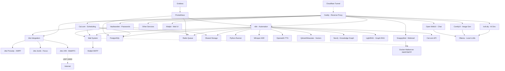

# 🚀 AI LaunchKit

<div align="center">

**Open-Source AI Development Toolkit**

*Deploy your complete AI stack in minutes, not weeks*

[](LICENSE)
[](https://github.com/freddy-schuetz/ai-launchkit)
[](https://github.com/kossakovsky/n8n-installer)

[Installation](#-installation) • [Features](#-whats-included) • [Documentation](#-documentation) • [Support](#-support)

</div>

---

## 🎯 What is AI LaunchKit?

AI LaunchKit is a comprehensive, self-hosted AI development environment that deploys **50+ pre-configured tools** with a single command. Build AI applications, automate workflows, generate images, and develop with AI assistance - all running on your own infrastructure.

Originally forked from [n8n-installer](https://github.com/kossakovsky/n8n-installer), AI LaunchKit has evolved into a complete AI development platform, maintained by [Friedemann Schuetz](https://www.linkedin.com/in/friedemann-schuetz).

### 🎬 Quick Demo

```bash
# One command to rule them all
git clone https://github.com/freddy-schuetz/ai-launchkit && cd ai-launchkit && sudo bash ./scripts/install.sh
```

**That's it!** Your AI development stack is ready in ~10-15 minutes.

**ATTENTION!** The AI LaunchKit is currently in development. It is regularly tested and updated. However, use is at your own risk!

---

## ✨ What's Included

### 📧 Mail System

| Tool | Description | Always Active | Purpose |
|------|-------------|---------------|----------|
| **[Mailpit](https://github.com/axllent/mailpit)** | Mail catcher with web UI Access: `mail.yourdomain.com` | ✅ Yes | Development/Testing - captures all emails |
| **[Docker-Mailserver](https://github.com/docker-mailserver/docker-mailserver)** | Production mail server | ⚡ Optional | Real email delivery for production |
| **[SnappyMail](https://github.com/the-djmaze/snappymail)** | Modern webmail client Access: `webmail.yourdomain.com` | ⚡ Optional | Web interface for Docker-Mailserver |

**Mail Configuration:**
- Mailpit automatically configured for all services (always active)
- Docker-Mailserver available for production email delivery (optional)
- SnappyMail provides a modern web interface for email access (optional, requires Docker-Mailserver)
- Web UI to view all captured emails
- Zero manual configuration needed!

### 🔧 Workflow Automation

| Tool | Description | Use Cases | Access |
|------|-------------|-----------|--------|
| **[n8n](https://github.com/n8n-io/n8n)** | Visual workflow automation platform | API integrations, data pipelines, business automation | `n8n.yourdomain.com` |
| **[n8n-MCP](https://github.com/czlonkowski/n8n-mcp)** | AI workflow generator for n8n | Claude/Cursor integration, 525+ node docs, workflow validation | `n8nmcp.yourdomain.com` |
| **300+ Workflows** | Pre-built n8n templates | Email automation, social media, data sync, AI workflows | Imported on install |

### 🎯 User Interfaces

| Tool | Description | Use Cases | Access |
|------|-------------|-----------|--------|
| **[Open WebUI](https://github.com/open-webui/open-webui)** | ChatGPT-like interface for LLMs | AI chat, model switching, conversation management | `webui.yourdomain.com` |
| **[Postiz](https://github.com/gitroomhq/postiz-app)** | Social media management platform | Content scheduling, analytics, multi-platform posting | `postiz.yourdomain.com` |

### 📹 Video Conferencing

| Tool | Description | Use Cases | Access |
|------|-------------|-----------|--------|
| **[Jitsi Meet](https://github.com/jitsi/jitsi-meet)** ⚠️ | Professional video conferencing platform | Client meetings, team calls, webinars, Cal.com integration | `meet.yourdomain.com` |

**⚠️ Jitsi Meet Requirements:**
- **CRITICAL:** Requires UDP Port 10000 for WebRTC audio/video
- Many VPS providers block UDP traffic by default
- Without UDP 10000: Only chat works, no audio/video!
- Test UDP connectivity before production use
- Alternative: Use external services (Zoom, Google Meet) with Cal.com

### 💼 Business & Productivity

| Tool | Description | Use Cases | Access |
|------|-------------|-----------|--------|
| **[Cal.com](https://github.com/calcom/cal.com)** | Open-source scheduling platform | Meeting bookings, team calendars, payment integrations | `cal.yourdomain.com` |
| **[Vikunja](https://github.com/go-vikunja/vikunja)** | Modern task management platform | Kanban boards, Gantt charts, team collaboration, CalDAV | `vikunja.yourdomain.com` |
| **[Leantime](https://github.com/Leantime/leantime)** | Goal-oriented project management suite | ADHD-friendly PM, time tracking, sprints, strategy tools | `leantime.yourdomain.com` |
| **[Kimai](https://github.com/kimai/kimai)** | Professional time tracking | DSGVO-compliant billing, team timesheets, API, 2FA, invoicing | `time.yourdomain.com` |
| **[Invoice Ninja](https://github.com/invoiceninja/invoiceninja)** | Professional invoicing & payment platform | Multi-currency invoices, 40+ payment gateways, recurring billing, client portal | `invoices.yourdomain.com` |
| **[Baserow](https://github.com/bram2w/baserow)** | Airtable Alternative with real-time collaboration | Database management, project tracking, collaborative workflows | `baserow.yourdomain.com` |
| **[NocoDB](https://github.com/nocodb/nocodb)** | Open-source Airtable alternative with API & webhooks | Smart spreadsheet UI, realtime collaboration, automation | `nocodb.yourdomain.com` |
| **[Formbricks](https://github.com/formbricks/formbricks)** | Privacy-first survey platform | Customer feedback, NPS surveys, market research, form builder, GDPR-compliant | `forms.yourdomain.com` |
| **[Metabase](https://github.com/metabase/metabase)** | User-friendly business intelligence platform | No-code dashboards, automated reports, data exploration, team analytics | `analytics.yourdomain.com` |
| **[Odoo 18](https://github.com/odoo/odoo)** | Open Source ERP/CRM with AI features | Sales automation, inventory, accounting, AI lead scoring | `odoo.yourdomain.com` |
| **[Twenty CRM](https://github.com/twentyhq/twenty)** | Modern Notion-like CRM | Customer pipelines, GraphQL API, team collaboration, lightweight CRM for startups | `twenty.yourdomain.com` |
| **[EspoCRM](https://github.com/espocrm/espocrm)** | Full-featured CRM platform | Email campaigns, workflow automation, advanced reporting, role-based access | `espocrm.yourdomain.com` |
| **[Mautic](https://github.com/mautic/mautic)** | Marketing automation platform | Lead scoring, email campaigns, landing pages, multi-channel marketing, automation workflows | `mautic.yourdomain.com` |

### 🎨 AI Content Generation

| Tool | Description | Use Cases | Access |
|------|-------------|-----------|--------|
| **[ComfyUI](https://github.com/comfyanonymous/ComfyUI)** | Node-based Stable Diffusion interface | Image generation, AI art, photo editing, workflows | `comfyui.yourdomain.com` |

### 💻 AI-Powered Development / Vibe Coding

| Tool | Description | Use Cases | Access |
|------|-------------|-----------|--------|
| **[bolt.diy](https://github.com/stackblitz-labs/bolt.diy)** | Build full-stack apps with prompts | Rapid prototyping, MVP creation, learning to code | `bolt.yourdomain.com` |
| **[OpenUI](https://github.com/wandb/openui)** 🧪 | AI-powered UI component generation | Design systems, component libraries, mockups | `openui.yourdomain.com` |

### 🤖 AI Agents

| Tool | Description | Use Cases | Access |
|------|-------------|-----------|--------|
| **[Flowise](https://github.com/FlowiseAI/Flowise)** | Visual AI agent builder | Chatbots, customer support, AI workflows | `flowise.yourdomain.com` |
| **[LiveKit](https://github.com/livekit/livekit)** + Agents | Real-time voice agents with WebRTC (auto-uses Whisper/TTS/Ollama or OpenAI) | AI voice assistants, conversational AI, ChatGPT-like voice bots, requires UDP 50000-50100 | `livekit.yourdomain.com` |
| **[Dify](https://github.com/langgenius/dify)** | LLMOps platform for AI apps | Production AI apps, model management, prompt engineering | `dify.yourdomain.com` |
| **[Letta](https://github.com/letta-ai/letta)** | Stateful agent server | Persistent AI assistants, memory management | `letta.yourdomain.com` |
| **[Browser-use](https://github.com/browser-use/browser-use)** | LLM-powered browser control | Web scraping, form filling, automated testing | Internal API only |
| **[Skyvern](https://skyvern.com)** | Vision-based browser automation | Complex web tasks, CAPTCHA handling, dynamic sites | Internal API only |
| **[Browserless](https://browserless.io)** | Headless Chrome service | Puppeteer/Playwright hub, PDF generation, screenshots | Internal WebSocket |

### 📚 RAG Systems

| Tool | Description | Use Cases | Access |
|------|-------------|-----------|--------|
| **[RAGApp](https://github.com/ragapp/ragapp)** | Build RAG assistants over your data | Knowledge bases, document Q&A, research tools | `ragapp.yourdomain.com` |
| **[Qdrant](https://github.com/qdrant/qdrant)** | High-performance vector database | Semantic search, recommendations, RAG storage | `qdrant.yourdomain.com` |
| **[Weaviate](https://github.com/weaviate/weaviate)** | AI-native vector database | Hybrid search, multi-modal data, GraphQL API | `weaviate.yourdomain.com` |

### 🎙️ Speech, Language & Text Processing

| Tool | Description | Use Cases | Access |
|------|-------------|-----------|--------|
| **[Faster-Whisper](https://github.com/SYSTRAN/faster-whisper)** | OpenAI-compatible Speech-to-Text | Transcription, voice commands, meeting notes | Internal API |
| **[OpenedAI-Speech](https://github.com/matatonic/openedai-speech)** | OpenAI-compatible Text-to-Speech | Voice assistants, audiobooks, notifications | Internal API |
| **[TTS Chatterbox](https://github.com/resemble-ai/chatterbox)** | State-of-the-art TTS with emotion control & voice cloning | AI voices with emotional expression, voice synthesis, outperforms ElevenLabs | `chatterbox.yourdomain.com` |
| **[LibreTranslate](https://github.com/LibreTranslate/LibreTranslate)** | Self-hosted translation API | 50+ languages, document translation, privacy-focused | `translate.yourdomain.com` |
| **OCR Bundle: [Tesseract](https://github.com/tesseract-ocr/tesseract) & [EasyOCR](https://github.com/JaidedAI/EasyOCR)** | Dual OCR engines: Tesseract (fast) + EasyOCR (quality) | Text extraction from images/PDFs, receipt scanning, document digitization | Internal API |
| **[Scriberr](https://github.com/rishikanthc/Scriberr)** | AI audio transcription with WhisperX & speaker diarization | Meeting transcripts, podcast processing, call recordings, speaker identification | `scriberr.yourdomain.com` |
| **[Vexa](https://github.com/Vexa-ai/vexa)** | Real-time meeting transcription API | Live transcription for Google Meet & Teams, speaker identification, 99 languages, n8n integration | Internal API |

*If you have troubles installing or updating Vexa, please view this guide:* **[Vexa Workaround](https://github.com/freddy-schuetz/ai-launchkit/blob/main/vexa-troubleshooting-workarounds.md)**

### 🔍 Search & Web Data

| Tool | Description | Use Cases | Access |
|------|-------------|-----------|--------|
| **[SearXNG](https://github.com/searxng/searxng)** | Privacy-respecting metasearch engine | Web search for agents, no tracking, multiple sources | `searxng.yourdomain.com` |
| **[Perplexica](https://github.com/ItzCrazyKns/Perplexica)** | Open-source AI-powered search engine | Deep research, academic search, Perplexity AI alternative | `perplexica.yourdomain.com` |
| **[Crawl4Ai](https://github.com/unclecode/crawl4ai)** | AI-optimized web crawler | Web scraping, data extraction, site monitoring | Internal API |
| **[GPT Researcher](https://github.com/assafelovic/gpt-researcher)** | Autonomous research agent (2000+ word reports) | Comprehensive research reports, multi-source analysis, citations | `research.yourdomain.com` |
| **[Local Deep Research](https://github.com/langchain-ai/local-deep-researcher)** | LangChain's iterative deep research (~95% accuracy) | Fact-checking, detailed analysis, research loops with reflection | Internal API |

### 🧠 Knowledge Graphs

| Tool | Description | Use Cases | Access |
|------|-------------|-----------|--------|
| **[Neo4j](https://github.com/neo4j/neo4j)** | Graph database platform | Knowledge graphs, entity relationships, fraud detection, recommendations | `neo4j.yourdomain.com` |
| **[LightRAG](https://github.com/HKUDS/LightRAG)** | Graph-based RAG with entity extraction | Automatic knowledge graph creation, relationship mapping, complex queries | `lightrag.yourdomain.com` |

### 🎬 Media Processing Suite

Pre-installed in the n8n container for seamless media manipulation:

| Tool | Description | Use Cases |
|------|-------------|-----------|
| **[FFmpeg](https://github.com/FFmpeg/FFmpeg)** | Industry-standard multimedia framework | Video conversion, streaming, audio extraction |
| **[ImageMagick](https://github.com/ImageMagick/ImageMagick)** | Image manipulation toolkit | Format conversion, resizing, effects, thumbnails |
| **[ExifTool](https://github.com/exiftool/exiftool)** | Metadata management | Read/write EXIF, IPTC, XMP metadata |
| **[MediaInfo](https://github.com/MediaArea/MediaInfo)** | Technical media analysis | Codec detection, bitrate analysis, format info |
| **[SoX](https://github.com/chirlu/sox)** | Sound processing toolkit | Audio effects, format conversion, synthesis |
| **[Ghostscript](https://github.com/ArtifexSoftware/ghostpdl)** | PostScript/PDF processor | PDF manipulation, conversion, rendering |
| **[Python3](https://github.com/python/cpython)** | With pydub & Pillow libraries | Custom media processing scripts |

### 💾 Data Infrastructure

| Tool | Description | Use Cases | Access |
|------|-------------|-----------|--------|
| **[Supabase](https://github.com/supabase/supabase)** | Open-source Firebase alternative | User auth, realtime data, file storage, vector embeddings | `supabase.yourdomain.com` |
| **[PostgreSQL](https://github.com/postgres/postgres)** | Relational database | Structured data, transactions, n8n backend | Internal |
| **[Redis](https://github.com/redis/redis)** | In-memory data store | Caching, queues, session management | Internal |

### 📊 System Management

| Tool | Description | Use Cases | Access |
|------|-------------|-----------|--------|
| **[Vaultwarden](https://github.com/dani-garcia/vaultwarden)** | Self-hosted Bitwarden-compatible password manager | Secure credential storage for all AI LaunchKit services, team password sharing | `vault.yourdomain.com` |
| **[Caddy](https://github.com/caddyserver/caddy)** | Modern web server | Automatic HTTPS, reverse proxy, load balancing | All domains |
| **[Cloudflare Tunnel](https://github.com/cloudflare/cloudflared)** | Secure tunnel to Cloudflare | Zero-trust access, no exposed ports, DDoS protection | Internal |
| **Python Runner** | Python execution environment for n8n | Custom scripts, data processing, automation tasks | Internal |
| **[Grafana](https://github.com/grafana/grafana)** | Metrics visualization platform | Performance dashboards, alerts, analytics | `grafana.yourdomain.com` |
| **[Prometheus](https://github.com/prometheus/prometheus)** | Time-series monitoring | Metrics collection, alerting rules, scraping | `prometheus.yourdomain.com` |
| **[Portainer](https://github.com/portainer/portainer)** | Container management UI | Docker admin, logs, resource monitoring | `portainer.yourdomain.com` |
| **[Kopia](https://github.com/kopia/kopia)** | Enterprise backup solution | End-to-end encryption, deduplication, WebDAV/S3/B2 support | `backup.yourdomain.com` |
| **[Langfuse](https://github.com/langfuse/langfuse)** | LLM observability platform | AI performance tracking, cost analysis, debugging | `langfuse.yourdomain.com` |

### 🔧 AI Support Tools

| Tool | Description | Use Cases | Access |
|------|-------------|-----------|--------|
| **[Ollama](https://github.com/ollama/ollama)** | Local LLM runtime | Run Llama, Mistral, Gemma models locally | `ollama.yourdomain.com` |
| **[Gotenberg](https://github.com/gotenberg/gotenberg)** | Document conversion API | PDF generation, HTML to PDF, Office conversions | Internal API |
| **[Stirling-PDF](https://github.com/Stirling-Tools/Stirling-PDF)** | Complete PDF toolkit with 100+ features | Merge, split, OCR, sign, watermark, convert documents | `pdf.yourdomain.com` |

### 🛡️ AI Security & Compliance

| Tool | Description | Use Cases | Access |
|------|-------------|-----------|--------|
| **[LLM Guard](https://github.com/protectai/llm-guard)** | AI security toolkit for LLM applications | Prompt injection detection, PII scanning, toxicity filtering, jailbreak prevention | Internal API |
| **[Microsoft Presidio](https://github.com/microsoft/presidio)** | Enterprise PII detection & anonymization (English) | PII patterns, credit cards, SSN, email addresses, GDPR compliance | Internal API |
| **[Flair NER](https://github.com/flairNLP/flair)** | State-of-the-art German & multi-language PII detection | German names/addresses, IBAN, phone numbers, 95%+ accuracy for DE text | Internal API |

**Security Features:**
- LLM Guard: Real-time threat detection for AI applications  
- Presidio: Enterprise-grade PII handling for English text with pattern matching
- Flair NER: State-of-the-art German PII detection with 95%+ accuracy using neural models
- Combined workflow: Input validation → Language detection → PII detection (Presidio/Flair) → LLM processing → Output sanitization
- No external access required - internal APIs only for n8n integration

---

## 🚀 Quick Start

### One-Line Installation

```bash
git clone https://github.com/freddy-schuetz/ai-launchkit && cd ai-launchkit && sudo bash ./scripts/install.sh
```

### What the Installer Does

The interactive wizard will guide you through:

1. **Domain Configuration** - Your wildcard domain (e.g., `yourdomain.com`)
2. **Email Address** - For SSL certificates and admin accounts
3. **API Keys** (Optional) - OpenAI, Anthropic, Groq for AI features
4. **Service Selection** - Choose from 50+ tools via checkbox menu
5. **Worker Count** - n8n parallel processing (1-4 workers recommended)
6. **Workflow Import** (Optional) - 300+ pre-built templates (adds 20-30 min)

### After Installation

**Access Your Services:**
```bash
# Core Services
https://n8n.yourdomain.com          # Workflow automation
https://bolt.yourdomain.com         # AI development
https://webui.yourdomain.com        # ChatGPT interface
https://vault.yourdomain.com        # Password manager

# View all service URLs
cat installation_report.txt
```

**Get Your Credentials:**
```bash
# Download all passwords as Bitwarden-compatible JSON
sudo bash ./scripts/download_credentials.sh

# Or view .env file
cat .env | grep PASSWORD
```

**Add API Keys (Optional):**
```bash
# Edit configuration
nano .env

# Add your keys
OPENAI_API_KEY=sk-...
ANTHROPIC_API_KEY=sk-ant-...
GROQ_API_KEY=gsk_...

# Restart services to apply
docker compose restart
```

### Installation Time

- **Minimal Setup** (n8n only): ~5 minutes
- **Standard Setup** (10-15 services): ~10-15 minutes  
- **Full Setup** (all services + workflows): ~30-45 minutes

---

**Need help?** Check the [detailed installation guide](#-installation) or join our [community forum](https://thinktank.ottomator.ai/c/local-ai/18).

---

## 📦 Installation

### Prerequisites

Before installing AI LaunchKit, ensure your environment meets these requirements:

#### 1. Server Requirements

**Operating System:**
- Ubuntu 24.04 LTS (64-bit) - **Required**
- Fresh installation recommended
- Root or sudo access required

**Hardware Requirements:**

| Setup Type | RAM | CPU Cores | Disk Space | Use Case |
|------------|-----|-----------|------------|----------|
| **Minimal** | 4 GB | 2 | 30 GB | n8n + basic services |
| **Standard** | 8 GB | 4 | 60 GB | 10-15 services |
| **Recommended** | 16 GB | 8 | 120 GB | Full setup with AI tools |
| **Enterprise** | 32+ GB | 16+ | 250+ GB | All services + ComfyUI/Ollama |

**Network Requirements:**
- Open ports: 80 (HTTP), 443 (HTTPS), 22 (SSH)
- Optional: UDP 10000 (Jitsi), UDP 50000-50100 (LiveKit)
- Stable internet connection

#### 2. Domain Configuration

**You need a registered domain with wildcard DNS configured:**

```
Type: A
Name: *
Value: YOUR_SERVER_IP
TTL: 300 (or your preferred value)
```

**Example Configuration:**
```
Domain: example.com
A Record: *.example.com → 203.0.113.45
```

**This creates:**
- n8n.example.com
- bolt.example.com
- webui.example.com
- ... and all other subdomains

**DNS Propagation:**
- Wait 5-15 minutes after DNS configuration
- Verify with: `nslookup n8n.yourdomain.com`

#### 3. SSH Access

**Connect to your server:**
```bash
ssh root@YOUR_SERVER_IP
# or
ssh your-user@YOUR_SERVER_IP
```

**If using a non-root user, ensure sudo access:**
```bash
sudo -v
```

### Step-by-Step Installation

#### Step 1: Prepare Your Server

```bash
# Update system packages
sudo apt update && sudo apt upgrade -y

# Install required tools
sudo apt install -y git curl

# Verify Ubuntu version
lsb_release -a
# Should show: Ubuntu 24.04 LTS
```

#### Step 2: Clone the Repository

```bash
# Clone AI LaunchKit
git clone https://github.com/freddy-schuetz/ai-launchkit
cd ai-launchkit

# Verify you're in the correct directory
ls -la
# Should show: scripts/, docker-compose.yml, etc.
```

#### Step 3: Run the Installer

```bash
# Start the installation wizard
sudo bash ./scripts/install.sh
```

**The installer will:**
1. Check system requirements
2. Install Docker & Docker Compose
3. Configure firewall (UFW) and security (Fail2ban)
4. Generate secure passwords
5. Launch interactive service selection
6. Deploy selected services
7. Display access URLs and credentials

#### Step 4: Interactive Configuration

**The wizard will ask for:**

1. **Domain Name**
   ```
   Enter your domain: example.com
   (without www or subdomain)
   ```

2. **Email Address**
   ```
   Enter your email: admin@example.com
   (used for: SSL certificates, service logins, notifications)
   ```

3. **API Keys (Optional)**
   ```
   OpenAI API Key: sk-... (or leave empty)
   Anthropic API Key: sk-ant-... (or leave empty)
   Groq API Key: gsk_... (or leave empty)
   ```
   *You can add these later in the `.env` file*

4. **Import n8n Workflows?**
   ```
   Import 300+ pre-built workflows? (yes/no)
   Warning: Adds 20-30 minutes to installation
   ```
   *Recommended for first-time users*

5. **n8n Worker Count**
   ```
   Number of parallel workers: 1-4
   Recommendation:
   - 1 worker: 4-8 GB RAM
   - 2 workers: 8-12 GB RAM  
   - 4 workers: 16+ GB RAM
   ```

6. **Service Selection**
   
   A checklist menu appears. Use:
   - **Space** to select/deselect
   - **Arrow keys** to navigate
   - **Enter** to confirm

   **Service Categories:**
   - Core: n8n, Caddy, PostgreSQL (auto-selected)
   - AI Development: bolt.diy, OpenUI, ComfyUI
   - Automation: Flowise, n8n-MCP
   - Databases: Supabase, Qdrant, Neo4j
   - Business: Cal.com, Kimai, Invoice Ninja
   - Monitoring: Grafana, Prometheus, Langfuse
   - Communication: Jitsi, Mailserver, SnappyMail
   - And many more...

   **Selection Tips:**
   - Start minimal for testing (just n8n)
   - Add services gradually
   - Consider your RAM when selecting

#### Step 5: Installation Progress

The installer will now:

```bash
[1/6] ✓ System preparation complete
[2/6] ✓ Docker installed
[3/6] ✓ Secrets generated
[4/6] ✓ Services selected
[5/6] ⏳ Deploying containers... (5-10 minutes)
[6/6] ✓ Installation complete!
```

**This process takes:**
- Without workflows: 10-15 minutes
- With workflows: 30-45 minutes

#### Step 6: Installation Report

At the end, you'll see:

```
═══════════════════════════════════════════
    AI LAUNCHKIT INSTALLATION COMPLETE
═══════════════════════════════════════════

🌐 Access Your Services:

Core Services:
  n8n:        https://n8n.example.com
  Vaultwarden: https://vault.example.com
  Mailpit:    https://mail.example.com

AI Tools:
  bolt.diy:   https://bolt.example.com
  Open WebUI: https://webui.example.com

📝 Credentials saved to:
  ./installation_report.txt
  .env (on server)

🔑 Download all passwords:
  sudo bash ./scripts/download_credentials.sh

⚠️ IMPORTANT:
  - Save your credentials securely
  - Configure API keys in .env if needed
  - First user to register becomes admin

═══════════════════════════════════════════
```

**Save this information!** The report contains all access URLs and credentials.

### Post-Installation

#### Verify Installation

```bash
# Check all services are running
docker compose ps

# Should show: STATUS = Up
# If any service shows "Restarting" or "Exit", check logs:
docker compose logs [service-name]

# Check resource usage
docker stats --no-stream
```

#### First Logins

**n8n (Workflow Automation):**
1. Open `https://n8n.example.com`
2. First visitor creates owner account
3. Choose strong password (min 8 characters)
4. Setup complete!

**Vaultwarden (Password Manager):**
1. Open `https://vault.example.com`
2. Click "Create Account"
3. Set master password (very strong!)
4. Import AI LaunchKit credentials:
   ```bash
   sudo bash ./scripts/download_credentials.sh
   ```
5. Download JSON file and import in Vaultwarden

**Other Services:**
- Most services: First user = admin
- Some require credentials from `.env` file
- Check `installation_report.txt` for details

#### Configure API Keys (Optional)

If you skipped API keys during installation:

```bash
# Edit environment file
nano .env

# Add your keys:
OPENAI_API_KEY=sk-your-key-here
ANTHROPIC_API_KEY=sk-ant-your-key-here
GROQ_API_KEY=gsk_your-key-here

# Save and exit (Ctrl+X, Y, Enter)

# Apply changes
docker compose restart
```

#### DNS Verification

Ensure your domains are resolving correctly:

```bash
# Test DNS resolution
nslookup n8n.example.com
nslookup bolt.example.com

# Test HTTPS access
curl -I https://n8n.example.com
# Should return: HTTP/2 200
```

#### Firewall Check

Verify firewall rules are correct:

```bash
sudo ufw status

# Should show:
# 22/tcp                     ALLOW       Anywhere
# 80/tcp                     ALLOW       Anywhere
# 443/tcp                    ALLOW       Anywhere
```

### Optional: Docker-Mailserver Setup

If you selected Docker-Mailserver for production email:

#### Add Email Accounts

```bash
# Create first email account
docker exec -it mailserver setup email add admin@example.com

# Create additional accounts
docker exec -it mailserver setup email add noreply@example.com
docker exec -it mailserver setup email add support@example.com

# List all accounts
docker exec mailserver setup email list
```

#### Configure DNS for Email

**Required DNS Records:**

```
# MX Record
Type: MX
Name: @
Value: mail.example.com
Priority: 10

# A Record for mail
Type: A  
Name: mail
Value: YOUR_SERVER_IP

# SPF Record
Type: TXT
Name: @
Value: v=spf1 mx ~all

# DMARC Record
Type: TXT
Name: _dmarc
Value: v=DMARC1; p=none; rua=mailto:postmaster@example.com
```

#### Generate DKIM Keys

```bash
# Generate DKIM signature
docker exec mailserver setup config dkim

# Get public key for DNS
docker exec mailserver cat /tmp/docker-mailserver/opendkim/keys/example.com/mail.txt

# Add as TXT record:
# Name: mail._domainkey
# Value: (paste the key from above)
```

### Troubleshooting Installation

#### Services Won't Start

```bash
# Check Docker is running
sudo systemctl status docker

# Check specific service logs
docker compose logs [service-name] --tail 50

# Common issues:
# - Not enough RAM: Reduce services or upgrade server
# - Port conflicts: Check if ports 80/443 are free
# - DNS not ready: Wait 15 minutes for propagation
```

#### SSL Certificate Errors

```bash
# Caddy might take a few minutes to get certificates
# Check Caddy logs:
docker compose logs caddy --tail 50

# If problems persist:
# 1. Verify DNS is correct: nslookup n8n.example.com
# 2. Ensure ports 80/443 are open
# 3. Check domain is valid and publicly accessible
```

#### Installation Fails

```bash
# Re-run specific installation step:
sudo bash ./scripts/01_system_preparation.sh
sudo bash ./scripts/02_install_docker.sh
# etc.

# Or start completely fresh:
sudo bash ./scripts/cleanup.sh
git pull
sudo bash ./scripts/install.sh
```

#### Need Help?

- **Documentation:** Check [Services section](#-services) for detailed guides
- **Community:** [oTTomator Think Tank Forum](https://thinktank.ottomator.ai/c/local-ai/18)
- **Issues:** [GitHub Issues](https://github.com/freddy-schuetz/ai-launchkit/issues)

---

**Next Steps:** Explore the [Services section](#-services) for detailed setup guides for each tool.

---

## 🔄 Update

Keep your AI LaunchKit installation up-to-date with the latest features, security patches, and bug fixes.

### When to Update

**Recommended Update Schedule:**
- **Security Updates:** Immediately when announced
- **Regular Updates:** Monthly or quarterly
- **Major Releases:** After reviewing changelog

**Update for:**
- New service versions
- Security patches
- Bug fixes
- New features
- Performance improvements

**Check for Updates:**
```bash
# Check current version
git log -1 --oneline

# Check for updates
cd ai-launchkit
git fetch
git status

# View changelog
git log --oneline origin/main..HEAD
```

### Pre-Update Checklist

Before updating, ensure you have:

✅ **Backups of Critical Data**
✅ **Read the Changelog**
✅ **Scheduled Maintenance Window**
✅ **Verified Server Resources**
✅ **Tested on Staging (if applicable)**

### Backup Before Update

**⚠️ CRITICAL: Always backup before updating!**

#### Quick Backup

```bash
# 1. Backup .env file
cp .env .env.backup

# 2. Export Docker volumes
sudo bash ./scripts/backup_volumes.sh

# 3. Backup PostgreSQL database
docker exec postgres pg_dumpall -U postgres > backup-$(date +%Y%m%d).sql

# 4. Backup n8n workflows
docker exec n8n n8n export:workflow --all --output=/data/shared/workflows-backup.json

# 5. List all running services (for reference)
docker compose ps > services-$(date +%Y%m%d).txt
```

#### Comprehensive Backup

```bash
# Stop services (optional, for consistent backup)
docker compose down

# Backup all Docker volumes
docker run --rm \
  -v $(pwd):/backup \
  -v localai_n8n_data:/data/n8n \
  -v localai_postgres_data:/data/postgres \
  busybox tar czf /backup/volumes-backup-$(date +%Y%m%d).tar.gz /data

# Restart services
docker compose up -d
```

### Update Procedure

#### Standard Update

```bash
# Navigate to AI LaunchKit directory
cd ai-launchkit

# Pull latest changes
git pull

# Run update script
sudo bash ./scripts/update.sh
```

**The update script will:**
1. ✓ Pull latest Docker images
2. ✓ Update configurations
3. ✓ Restart services with new versions
4. ✓ Clean up old images
5. ✓ Display update summary

**Update Duration:** 5-15 minutes depending on services

#### Manual Update Process

If you prefer manual control:

```bash
# 1. Pull latest code
git pull

# 2. Pull new Docker images
docker compose pull

# 3. Restart services with new images
docker compose up -d

# 4. Clean up old images (optional)
docker image prune -af
```

### PostgreSQL Version Handling

**Important: PostgreSQL 17 vs 18**

AI LaunchKit now pins PostgreSQL to version 17 to prevent compatibility issues. The PostgreSQL 18 data format is incompatible with version 17.

#### Check Your PostgreSQL Version

```bash
docker exec postgres postgres --version
```

#### If You Have PostgreSQL 17 (Most Users)

No action needed. Simply run the update script:

```bash
sudo bash ./scripts/update.sh
```

#### If You Have PostgreSQL 18

Pin your version before updating:

```bash
# Pin to PostgreSQL 18
echo "POSTGRES_VERSION=18" >> .env

# Now update safely
sudo bash ./scripts/update.sh
```

**Your data stays on PostgreSQL 18 and continues working normally.**

#### If You Experience Database Errors

If you see "database files are incompatible" errors:

<details>
<summary><b>Emergency Recovery Steps</b></summary>

```bash
# 1. BACKUP YOUR DATA (CRITICAL!)
docker exec postgres pg_dumpall -U postgres > emergency-backup.sql

# 2. Stop all services
docker compose down

# 3. Remove incompatible volume
docker volume rm localai_postgres_data

# 4. Pull latest fixes
git pull

# 5. Start PostgreSQL (now pinned to v17)
docker compose up -d postgres
sleep 10

# 6. Restore your data
docker exec -i postgres psql -U postgres < emergency-backup.sql

# 7. Start all services
docker compose up -d
```

</details>

#### Version Verification

After update, verify versions:

```bash
docker exec postgres postgres --version
# Should show: PostgreSQL 17.x or 18.x (if pinned)
```

### Post-Update Verification

#### Check Service Status

```bash
# View all services
docker compose ps

# All should show: STATUS = Up
# If any show "Restarting" wait 2-3 minutes, then check logs:
docker compose logs [service-name] --tail 50
```

#### Test Key Services

**n8n:**
```bash
curl -I https://n8n.yourdomain.com
# Should return: HTTP/2 200
```

**Database:**
```bash
docker exec postgres pg_isready -U postgres
# Should return: accepting connections
```

**Redis:**
```bash
docker exec redis redis-cli ping
# Should return: PONG
```

#### Monitor Resource Usage

```bash
# Check memory and CPU
docker stats --no-stream

# Check disk space
df -h
```

#### Verify Workflows Still Run

1. Open n8n: `https://n8n.yourdomain.com`
2. Open a test workflow
3. Click "Execute Workflow"
4. Verify it completes successfully

### Rollback Procedure

If the update causes issues, rollback to the previous version:

#### Quick Rollback

```bash
# 1. Navigate to AI LaunchKit
cd ai-launchkit

# 2. View commit history
git log --oneline -10

# 3. Rollback to previous commit
git reset --hard [previous-commit-hash]

# 4. Restore .env if needed
cp .env.backup .env

# 5. Restart with old version
docker compose down
docker compose up -d
```

#### Full Rollback with Data Restore

```bash
# 1. Stop services
docker compose down

# 2. Restore volumes from backup
tar xzf volumes-backup-YYYYMMDD.tar.gz

# 3. Restore PostgreSQL
docker compose up -d postgres
sleep 10
docker exec -i postgres psql -U postgres < backup-YYYYMMDD.sql

# 4. Start all services
docker compose up -d
```

### Service-Specific Updates

Some services may require additional steps:

#### ComfyUI Models

```bash
# Models are not automatically updated
# To update models, manually download new versions to:
/var/lib/docker/volumes/localai_comfyui_data/_data/models/
```

#### Ollama Models

```bash
# Update installed models
docker exec ollama ollama pull llama3.2
docker exec ollama ollama pull mistral
```

#### n8n Community Nodes

```bash
# Update community nodes
docker exec n8n npm update -g n8n

# Restart n8n
docker compose restart n8n
```

#### Supabase

```bash
# Supabase has multiple components
# All update together with docker compose pull
docker compose pull supabase-kong supabase-auth supabase-rest supabase-storage
docker compose up -d supabase-kong supabase-auth supabase-rest supabase-storage
```

### Update Troubleshooting

#### Services Won't Start After Update

```bash
# Check logs for specific error
docker compose logs [service-name] --tail 100

# Common fixes:
# 1. Recreate service
docker compose up -d --force-recreate [service-name]

# 2. Clear cache and restart
docker compose down
docker system prune -f
docker compose up -d

# 3. Check .env file is intact
diff .env .env.backup
```

#### Database Connection Errors

```bash
# PostgreSQL not starting
docker compose logs postgres --tail 100

# Common causes:
# - Incompatible data format (see PostgreSQL section)
# - Corrupted data (restore from backup)
# - Insufficient disk space (check with df -h)
```

#### Port Conflicts After Update

```bash
# Check what's using the port
sudo lsof -i :80
sudo lsof -i :443

# Stop conflicting service
sudo systemctl stop [service-name]

# Or change port in .env
nano .env
# Change PORT_VARIABLE to different port
```

#### Missing Environment Variables

```bash
# Compare with .env.example
diff .env .env.example

# Add any missing variables
nano .env

# Restart services
docker compose restart
```

### Maintenance Updates

#### Regular Maintenance

```bash
# Clean up old Docker resources (monthly)
docker system prune -af --volumes

# Update system packages (monthly)
sudo apt update && sudo apt upgrade -y

# Check disk space (weekly)
df -h
docker system df
```

#### Security Updates

```bash
# Update OS security patches
sudo apt update
sudo apt upgrade -y

# Update Docker
sudo apt install docker-ce docker-ce-cli containerd.io

# Restart Docker daemon
sudo systemctl restart docker

# Restart all services
docker compose restart
```

### Update Best Practices

1. **Always Backup First** - Cannot stress this enough
2. **Test in Staging** - If you have a test environment
3. **Read Changelogs** - Know what's changing
4. **Update Off-Peak** - Minimize user impact
5. **Monitor After Update** - Watch logs for 24 hours
6. **Keep Backups** - Retain last 3-5 backups
7. **Document Changes** - Note what was updated and when

### Update Notifications

Stay informed about updates:

- **Watch GitHub Repository**: Get notifications for new releases
- **Join Community Forum**: [oTTomator Think Tank](https://thinktank.ottomator.ai/c/local-ai/18)
- **Discord** *(coming soon)*: Real-time update announcements

### Getting Help with Updates

If you encounter issues:

1. **Check Logs**: `docker compose logs [service]`
2. **Search Issues**: [GitHub Issues](https://github.com/freddy-schuetz/ai-launchkit/issues)
3. **Community Forum**: Ask for help
4. **Rollback**: Use the procedure above if needed

---

**Next Steps:** After updating, explore the [Services section](#-services) for new features in each tool.

---

## 🔧 Services

This section provides detailed information for each service, including setup, n8n integration examples, and troubleshooting.

<!-- Each service will be added as an expandable <details> section in Phase 2 -->

### Mail System

<details>
<summary><b>📧 Mailpit - Development Mail Catcher</b></summary>

<!-- TODO: Content will be added in Phase 2, Step 4 -->
**Content to be added:**
- What is Mailpit?
- Features
- Initial Setup
- n8n Integration
- Examples
- Troubleshooting

</details>

<details>
<summary><b>📬 Docker-Mailserver - Production Email</b></summary>

<!-- TODO: Content will be added in Phase 2 -->

</details>

<details>
<summary><b>✉️ SnappyMail - Webmail Client</b></summary>

<!-- TODO: Content will be added in Phase 2 -->

</details>

### Workflow Automation

<details>
<summary><b>🔧 n8n - Workflow Automation Platform</b></summary>

<!-- TODO: Content will be added in Phase 2 -->

</details>

<details>
<summary><b>🤖 n8n-MCP - AI Workflow Generator</b></summary>

<!-- TODO: Content will be added in Phase 2 -->

</details>

### User Interfaces

<details>
<summary><b>💬 Open WebUI - ChatGPT Interface</b></summary>

<!-- TODO: Content will be added in Phase 2 -->

</details>

<details>
<summary><b>📱 Postiz - Social Media Management</b></summary>

<!-- TODO: Content will be added in Phase 2 -->

</details>

### Video Conferencing

<details>
<summary><b>📹 Jitsi Meet - Video Conferencing</b></summary>

<!-- TODO: Content will be added in Phase 2 -->

</details>

### Business & Productivity

<details>
<summary><b>📅 Cal.com - Scheduling Platform</b></summary>

<!-- TODO: Content will be added in Phase 2 -->

</details>

<details>
<summary><b>✅ Vikunja - Task Management</b></summary>

<!-- TODO: Content will be added in Phase 2 -->

</details>

<details>
<summary><b>🎯 Leantime - Project Management</b></summary>

<!-- TODO: Content will be added in Phase 2 -->

</details>

<details>
<summary><b>⏱️ Kimai - Time Tracking</b></summary>

<!-- TODO: Content will be added in Phase 2 -->

</details>

<details>
<summary><b>💰 Invoice Ninja - Invoicing Platform</b></summary>

<!-- TODO: Content will be added in Phase 2 -->

</details>

<details>
<summary><b>📊 Baserow - Airtable Alternative</b></summary>

<!-- TODO: Content will be added in Phase 2 -->

</details>

<details>
<summary><b>🗂️ NocoDB - Smart Spreadsheets</b></summary>

<!-- TODO: Content will be added in Phase 2 -->

</details>

<details>
<summary><b>📋 Formbricks - Survey Platform</b></summary>

<!-- TODO: Content will be added in Phase 2 -->

</details>

<details>
<summary><b>📈 Metabase - Business Intelligence</b></summary>

<!-- TODO: Content will be added in Phase 2 -->

</details>

<details>
<summary><b>🏢 Odoo 18 - ERP/CRM</b></summary>

<!-- TODO: Content will be added in Phase 2 -->

</details>

<details>
<summary><b>👥 Twenty CRM - Modern CRM</b></summary>

<!-- TODO: Content will be added in Phase 2 -->

</details>

<details>
<summary><b>🔄 EspoCRM - Full-Featured CRM</b></summary>

<!-- TODO: Content will be added in Phase 2 -->

</details>

<details>
<summary><b>📧 Mautic - Marketing Automation</b></summary>

<!-- TODO: Content will be added in Phase 2 -->

</details>

### AI Content Generation

<details>
<summary><b>🎨 ComfyUI - Stable Diffusion Interface</b></summary>

<!-- TODO: Content will be added in Phase 2 -->

</details>

### AI-Powered Development

<details>
<summary><b>⚡ bolt.diy - Full-Stack AI Development</b></summary>

<!-- TODO: Content will be added in Phase 2 -->

</details>

<details>
<summary><b>🎨 OpenUI - UI Component Generator</b></summary>

<!-- TODO: Content will be added in Phase 2 -->

</details>

### AI Agents

<details>
<summary><b>🤖 Flowise - Visual AI Agent Builder</b></summary>

<!-- TODO: Content will be added in Phase 2 -->

</details>

<details>
<summary><b>🎙️ LiveKit - Voice Agents</b></summary>

<!-- TODO: Content will be added in Phase 2 -->

</details>

<details>
<summary><b>🧠 Dify - LLMOps Platform</b></summary>

<!-- TODO: Content will be added in Phase 2 -->

</details>

<details>
<summary><b>💾 Letta - Stateful Agent Server</b></summary>

<!-- TODO: Content will be added in Phase 2 -->

</details>

<details>
<summary><b>🌐 Browser-use - LLM Browser Control</b></summary>

<!-- TODO: Content will be added in Phase 2 -->

</details>

<details>
<summary><b>👁️ Skyvern - Vision-Based Automation</b></summary>

<!-- TODO: Content will be added in Phase 2 -->

</details>

<details>
<summary><b>🖥️ Browserless - Headless Chrome</b></summary>

<!-- TODO: Content will be added in Phase 2 -->

</details>

### RAG Systems

<details>
<summary><b>📚 RAGApp - RAG Assistant Builder</b></summary>

<!-- TODO: Content will be added in Phase 2 -->

</details>

<details>
<summary><b>🔍 Qdrant - Vector Database</b></summary>

<!-- TODO: Content will be added in Phase 2 -->

</details>

<details>
<summary><b>🧩 Weaviate - AI-Native Vector DB</b></summary>

<!-- TODO: Content will be added in Phase 2 -->

</details>

### Speech, Language & Text Processing

<details>
<summary><b>🎤 Faster-Whisper - Speech-to-Text</b></summary>

<!-- TODO: Content will be added in Phase 2 -->

</details>

<details>
<summary><b>🔊 OpenedAI-Speech - Text-to-Speech</b></summary>

<!-- TODO: Content will be added in Phase 2 -->

</details>

<details>
<summary><b>🗣️ TTS Chatterbox - Advanced TTS</b></summary>

<!-- TODO: Content will be added in Phase 2 -->

</details>

<details>
<summary><b>🌍 LibreTranslate - Translation API</b></summary>

<!-- TODO: Content will be added in Phase 2 -->

</details>

<details>
<summary><b>📄 OCR Bundle - Tesseract & EasyOCR</b></summary>

<!-- TODO: Content will be added in Phase 2 -->

</details>

<details>
<summary><b>🎧 Scriberr - Audio Transcription</b></summary>

<!-- TODO: Content will be added in Phase 2 -->

</details>

<details>
<summary><b>📝 Vexa - Meeting Transcription</b></summary>

<!-- TODO: Content will be added in Phase 2 -->

</details>

### Search & Web Data

<details>
<summary><b>🔎 SearXNG - Privacy Search Engine</b></summary>

<!-- TODO: Content will be added in Phase 2 -->

</details>

<details>
<summary><b>🧠 Perplexica - AI-Powered Search</b></summary>

<!-- TODO: Content will be added in Phase 2 -->

</details>

<details>
<summary><b>🕷️ Crawl4Ai - Web Crawler</b></summary>

<!-- TODO: Content will be added in Phase 2 -->

</details>

<details>
<summary><b>🔬 GPT Researcher - Research Agent</b></summary>

<!-- TODO: Content will be added in Phase 2 -->

</details>

<details>
<summary><b>🔍 Local Deep Research - Iterative Research</b></summary>

<!-- TODO: Content will be added in Phase 2 -->

</details>

### Knowledge Graphs

<details>
<summary><b>🕸️ Neo4j - Graph Database</b></summary>

<!-- TODO: Content will be added in Phase 2 -->

</details>

<details>
<summary><b>🔗 LightRAG - Graph-Based RAG</b></summary>

<!-- TODO: Content will be added in Phase 2 -->

</details>

### Media Processing Suite

<details>
<summary><b>🎬 Media Processing Tools</b></summary>

<!-- TODO: Content will be added in Phase 2 -->
**Tools included:**
- FFmpeg
- ImageMagick
- ExifTool
- MediaInfo
- SoX
- Ghostscript
- Python3 with libraries

</details>

### Data Infrastructure

<details>
<summary><b>🔥 Supabase - Firebase Alternative</b></summary>

<!-- TODO: Content will be added in Phase 2 -->

</details>

<details>
<summary><b>🐘 PostgreSQL - Relational Database</b></summary>

<!-- TODO: Content will be added in Phase 2 -->

</details>

<details>
<summary><b>⚡ Redis - In-Memory Store</b></summary>

<!-- TODO: Content will be added in Phase 2 -->

</details>

### System Management

<details>
<summary><b>🔐 Vaultwarden - Password Manager</b></summary>

<!-- TODO: Content will be added in Phase 2 -->

</details>

<details>
<summary><b>🌐 Caddy - Web Server</b></summary>

<!-- TODO: Content will be added in Phase 2 -->

</details>

<details>
<summary><b>☁️ Cloudflare Tunnel - Secure Access</b></summary>

<!-- TODO: Content will be added in Phase 2 -->

</details>

<details>
<summary><b>🐍 Python Runner - Script Execution</b></summary>

<!-- TODO: Content will be added in Phase 2 -->

</details>

<details>
<summary><b>📊 Grafana - Metrics Visualization</b></summary>

<!-- TODO: Content will be added in Phase 2 -->

</details>

<details>
<summary><b>📈 Prometheus - Monitoring</b></summary>

<!-- TODO: Content will be added in Phase 2 -->

</details>

<details>
<summary><b>🐳 Portainer - Container Management</b></summary>

<!-- TODO: Content will be added in Phase 2 -->

</details>

<details>
<summary><b>💾 Kopia - Backup Solution</b></summary>

<!-- TODO: Content will be added in Phase 2 -->

</details>

<details>
<summary><b>🔍 Langfuse - LLM Observability</b></summary>

<!-- TODO: Content will be added in Phase 2 -->

</details>

### AI Support Tools

<details>
<summary><b>🦙 Ollama - Local LLM Runtime</b></summary>

<!-- TODO: Content will be added in Phase 2 -->

</details>

<details>
<summary><b>📄 Gotenberg - Document Conversion</b></summary>

<!-- TODO: Content will be added in Phase 2 -->

</details>

<details>
<summary><b>📋 Stirling-PDF - PDF Toolkit</b></summary>

<!-- TODO: Content will be added in Phase 2 -->

</details>

### AI Security & Compliance

<details>
<summary><b>🛡️ LLM Guard - AI Security</b></summary>

<!-- TODO: Content will be added in Phase 2 -->

</details>

<details>
<summary><b>🔒 Microsoft Presidio - PII Detection (English)</b></summary>

<!-- TODO: Content will be added in Phase 2 -->

</details>

<details>
<summary><b>🇩🇪 Flair NER - PII Detection (German)</b></summary>

<!-- TODO: Content will be added in Phase 2 -->

</details>

---

## 💡 Support & FAQ

<!-- TODO: Support section will be added in Phase 2, Step N -->

### Common Issues

<details>
<summary><b>🚨 502 Bad Gateway Errors</b></summary>

<!-- TODO: Content will be added -->

</details>

<details>
<summary><b>📧 Mail System Issues</b></summary>

<!-- TODO: Content will be added -->

</details>

<details>
<summary><b>🐳 Docker & Network Issues</b></summary>

<!-- TODO: Content will be added -->

</details>

<details>
<summary><b>⚡ Performance Issues</b></summary>

<!-- TODO: Content will be added -->

</details>

<details>
<summary><b>⚠️ General Troubleshooting</b></summary>

<!-- TODO: Content will be added -->

</details>

### Getting Help

**Community Resources:**
- **Discord**: [Join our community](https://discord.gg/ai-launchkit) *(coming soon)*
- **Forum**: [oTTomator Think Tank](https://thinktank.ottomator.ai/c/local-ai/18)
- **Issues**: [GitHub Issues](https://github.com/freddy-schuetz/ai-launchkit/issues)

**Before Creating an Issue:**
1. Check existing GitHub Issues
2. Search the Community Forum
3. Provide:
   - Your server specs
   - Services selected during installation
   - Error messages from `docker logs`
   - Output of `docker ps` and `docker stats`

---

## 🏗️ Architecture



---

## 👥 Contributors

Created and maintained by [Friedemann Schuetz](https://www.linkedin.com/in/friedemann-schuetz)

**Based on:**
- [n8n-installer](https://github.com/kossakovsky/n8n-installer) by kossakovsky
- [self-hosted-ai-starter-kit](https://github.com/n8n-io/self-hosted-ai-starter-kit) by n8n team
- [local-ai-packaged](https://github.com/coleam00/local-ai-packaged) by coleam00

[View all contributors](https://github.com/freddy-schuetz/ai-launchkit/graphs/contributors)

---

## 📜 License

This project is licensed under the Apache License 2.0 - see the [LICENSE](LICENSE) file for details.

---

<div align="center">

**Ready to launch your AI projects?**

[⭐ Star this repo](https://github.com/freddy-schuetz/ai-launchkit) • [🐛 Report issues](https://github.com/freddy-schuetz/ai-launchkit/issues) • [🤝 Contribute](https://github.com/freddy-schuetz/ai-launchkit/pulls)

</div>
